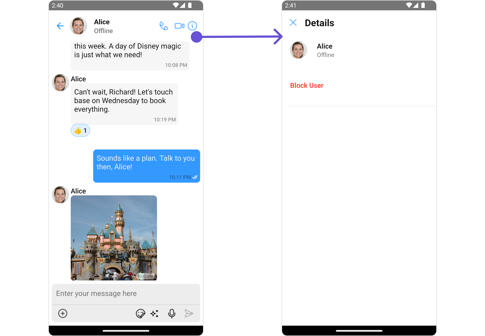

import Tabs from '@theme/Tabs';
import TabItem from '@theme/TabItem';

## Overview

The ConversationsWithMessages is a [Composite Component](/ui-kit/react-native/components-overview#components) encompassing components such as [Conversations](./conversations), [Messages](./messages), and [Contacts](./contacts). Each of these component contributes to the functionality and structure of the overall ConversationsWithMessages component.

<Tabs>

<TabItem value="iOS" label="iOS">


</TabItem>

<TabItem value="android" label="Android">


</TabItem>

</Tabs>

| Components                       | Description                                                                                                                                            |
| -------------------------------- | ------------------------------------------------------------------------------------------------------------------------------------------------------ |
| [Conversations](./conversations) | The `Conversations` component is designed to display a list of either `User` or `Group`. This essentially represents your recent conversation history. |
| [Messages](./messages)           | The `Messages` component is designed to manage the messaging interaction for either individual `User` or `Group` conversations.                        |
| [Contacts](./contacts)           | The `CometChatContacts` component is specifically designed to facilitate the display and management of both `User` and `Groups`.                       |

## Usage

### Integration

<Tabs>
<TabItem value="tsx" label="App.tsx">

```javascript
import { CometChatConversationsWithMessages } from "@cometchat/chat-uikit-react-native";

return <CometChatConversationsWithMessages />;
```

</TabItem>
</Tabs>

---

### Actions

[Actions](/ui-kit/react-native/components-overview#actions) dictate how a component functions. They are divided into two types: Predefined and User-defined. You can override either type, allowing you to tailor the behavior of the component to fit your specific needs.

While the ConversationsWithMessages component does not have its actions, its components - [Conversation](/ui-kit/react-native/conversations#actions), [Messages](/ui-kit/react-native/messages), and [Contacts](/ui-kit/react-native/contacts) - each have their own set of actions.

The Action of the components can be overridden through the use of the [Configurations](#configurations) object of its components. Here is an example code snippet.

<Tabs>
<TabItem value="tsx" label="App.tsx">

```typescript
import {
  CometChatConversationsWithMessages,
  ConversationsConfigurationInterface,
  ContactsConfigurationInterface,
} from "@cometchat/chat-uikit-react-native";

const conversationsConfiguration: ConversationsConfigurationInterface = {
  onError: (error: CometChat.CometChatException) => {
    //handle Error
  },
};

const contactsConfiguration: ContactsConfigurationInterface = {
  onClose: () => {
    //code
  },
};

return (
  <CometChatConversationsWithMessages
    conversationsConfiguration={conversationsConfiguration}
    startConversationConfiguration={contactsConfiguration}
  />
);
```

</TabItem>
</Tabs>

The ConversationsWithMessages component overrides several actions from its components to reach its default behavior. The list of actions overridden by ConversationsWithMessages includes:

- [onItemPress](/ui-kit/react-native/conversations/#1-onitempress) : By overriding the `onItemPress` of the Conversation Component, ConversationsWithMessages achieves navigation from [Conversation](/ui-kit/react-native/conversations) to [Messages](/ui-kit/react-native/messages) component.

<Tabs>

<TabItem value="iOS" label="iOS">


</TabItem>

<TabItem value="android" label="Android">


</TabItem>

</Tabs>

### Filters

**Filters** allow you to customize the data displayed in a list within a Component. You can filter the list based on your specific criteria, allowing for a more customized. Filters can be applied using RequestBuilders of Chat SDK.

While the ConversationsWithMessages component does not have filters, its components do, For more detail on individual filters of its component refer to [Conversations Filters](/ui-kit/react-native/conversations#filters) and [Messages Filters](/ui-kit/react-native/messages).

By utilizing the [Configurations](#configurations) object of its components, you can apply filters.

In the following **example**, we're filtering Conversation to only show `User`

<Tabs>
<TabItem value="tsx" label="App.tsx">

```typescript
import {
  CometChatConversationsWithMessages,
  ConversationsConfigurationInterface,
  ContactsConfigurationInterface,
} from "@cometchat/chat-uikit-react-native";

import { CometChat } from "@cometchat/chat-sdk-react-native";

const conversationsConfiguration: ConversationsConfigurationInterface = {
  conversationsRequestBuilder: new CometChat.ConversationsRequestBuilder()
    .setConversationType("user")
    .setLimit(2),
};

return (
  <CometChatConversationsWithMessages
    conversationsConfiguration={conversationsConfiguration}
  />
);
```

</TabItem>
</Tabs>

---

### Events

[Events](/ui-kit/react-native/components-overview#events) are emitted by a `Component`. By using event you can extend existing functionality. Being global events, they can be applied in Multiple Locations and are capable of being Added or Removed.

The ConversationsWithMessages does not generate its events but its component does. For a full list of these events, you can refer to [Conversations events](/ui-kit/react-native/conversations#events) and [Messages events](/ui-kit/react-native/messages#events).

In the following example, we're incorporating observers for the `ConversationDeleted` event of `Conversations` and the `MessageSent` event of the `Messages` component.

<Tabs>

<TabItem value="tsx" label="Add Listener">

```typescript
import { CometChatUIEventHandler } from "@cometchat/chat-uikit-react-native";

CometChatUIEventHandler.addConversationListener("SOME_UNIQUE_ID_1", {
  ccConversationDeleted: (conversation: CometChat.Conversation) => {
    //code
  },
});

CometChatUIEventHandler.addMessageListener("SOME_UNIQUE_ID_2", {
  ccMessageSent: (conversation: CometChat.Conversation) => {
    //code
  },
});

return {
  /* your view*/
};
```

</TabItem>

</Tabs>

---

## Customization

To fit your app's design requirements, you have the ability to customize the appearance of the
ConversationsWithMessages component. We provide exposed methods that allow you to modify the experience and behavior according to your specific needs.

### Style

Using **Style** you can **customize** the look and feel of the component in your app, These parameters typically control elements such as the **color**, **size**, **shape**, and **fonts** used within the component.
ConversationsWithMessages component doesn't have its own style parameters. But you can customize its component styles. For more details on individual component styles, you can refer [Conversation Styles](/ui-kit/react-native/conversations#style), [Messages Styles](/ui-kit/react-native/messages#style), and [Contacts Styles](/ui-kit/react-native/contacts#contactstyle)

Styles can be applied to SubComponents using their respective [configurations](#configurations).

**Example**

<Tabs>
<TabItem value="tsx" label="App.tsx">

```typescript
import {
  CometChatConversationsWithMessages,
  ConversationsConfigurationInterface,
  ConversationsStyle,
} from "@cometchat/chat-uikit-react-native";

const conversationsConfiguration: ConversationsConfigurationInterface = {
  conversationsStyle: {
    width: "100%",
    height: "100%",
    backgroundColor: "green",
    titleColor: "red",
  },
  listItemStyle: {
    backgroundColor: "green",
  },
};

return (
  <CometChatConversationsWithMessages
    conversationsConfiguration={conversationsConfiguration}
  />
);
```

</TabItem>
</Tabs>

### Functionality

These are a set of **small functional customizations** that allow you to **fine-tune** the overall experience of the component. With these, you can **change text**, set **custom icons**, and toggle the **visibility** of UI elements.

##### User Prop

You can pass a [User](/sdk/react-native/user-management) object as prop to the ConversationsWithMessages component. This will automatically direct you to the [Messages](./messages) component for the specified `User`.

<Tabs>
<TabItem value="js" label="App.tsx">

```typescript
import { CometChat } from "@cometchat/chat-sdk-react-native";
import { CometChatConversationsWithMessages } from "@cometchat/chat-uikit-react-native";

const [user, setUser] = useState<CometChat.User | undefined>(undefined);

const getUser = async () => {
  const user = await CometChat.getUser("uid");
  setUser(user);
};

useEffect(() => {
  getUser();
}, []);

return <CometChatConversationsWithMessages user={user} />;
```

</TabItem>
</Tabs>
---
##### Group Prop

You can pass a [Group](/sdk/react-native/groups-overview) object as input to the ConversationsWithMessages component. This will automatically direct you to the [Messages](./messages) component for the specified `Group`.

<Tabs>
<TabItem value="js" label="ConversationsWithMessagesDemo.tsx">

```typescript
import { CometChat } from "@cometchat/chat-sdk-react-native";
import { CometChatConversationsWithMessages } from "@cometchat/chat-uikit-react-native";

const [group, setGroup] = useState<CometChat.Group | undefined>(undefined);

const getGroup = async () => {
  const group = await CometChat.getGroup("guid");
  setGroup(group);
};

useEffect(() => {
  getGroup();
}, []);

return <CometChatConversationsWithMessages user={user} />;
```

</TabItem>
</Tabs>
---

##### Components

Nearly all functionality customizations available for a Component are also available for the composite component. Using [Configuration](#configurations), you can modify the properties of its components to suit your needs.

You can find the list of all Functionality customization of individual components in [Conversations](/ui-kit/react-native/conversations#functionality) , [Messages](/ui-kit/react-native/messages#functionality), and [Contacts](/ui-kit/react-native/contacts#properties)

**Example**

<Tabs>
<TabItem value="js" label="App.tsx">

```typescript
import {
  CometChatConversationsWithMessages,
  ConversationsConfigurationInterface,
  MessagesConfigurationInterface,
} from "@cometchat/chat-uikit-react-native";

const conversationsConfiguration: ConversationsConfigurationInterface = {
  disableTyping: true,
  showBackButton: true,
};

const messagesConfiguration: MessagesConfigurationInterface = {
  disableTyping: true,
  hideMessageHeader: true,
};
return (
  <CometChatConversationsWithMessages
    conversationsConfiguration={conversationsConfiguration}
    messagesConfigurations={messagesConfiguration}
  />
);
```

</TabItem>
</Tabs>

---

### Advanced

For advanced-level customization, you can set custom views to the component. This lets you tailor each aspect of the component to fit your exact needs and application aesthetics. You can create and define your own views, layouts, and UI elements and then incorporate those into the component.

By utilizing the [Configuration](#configurations) object of each component, you can apply advanced-level customizations to the ConversationsWithMessages.

**Example**

<Tabs>
<TabItem value="js" label="App.tsx">

```typescript
import {
  CometChatConversationsWithMessages,
  ConversationsConfigurationInterface,
} from "@cometchat/chat-uikit-react-native";

const errorViewStyle: StyleProp<ViewStyle> = {
  flex: 1,
  alignItems: "center",
  justifyContent: "center",
  padding: 10,
  borderColor: "black",
  borderWidth: 1,
  backgroundColor: "#E8EAE9",
};

const getErrorStateView = () => {
  return (
    <View style={errorViewStyle}>
      <Text>Something Went Wrong!</Text>
    </View>
  );
};

const conversationsConfiguration: ConversationsConfigurationInterface = {
  ErrorStateView: getErrorStateView,
};

return (
  <CometChatConversationsWithMessages
    conversationsConfiguration={conversationsConfiguration}
  />
);
```

</TabItem>
</Tabs>

---

To find all the details on individual Component advance customization you can refer, [Conversations Advance](/ui-kit/react-native/conversations#advanced),[Messages Advance](/ui-kit/react-native/messages#advanced) and Contacts.

ConversationsWithMessages uses advanced-level customization of both Conversation & Messages components to achieve its default behavior.

1. ConversationsWithMessages utilizes the [AppBar Options](/ui-kit/react-native/conversations#AppBar Options) of the `Conversations` subcomponent to navigate the user from [Conversations](/ui-kit/react-native/conversations) to [Contacts](/ui-kit/react-native/contacts)

<Tabs>

<TabItem value="iOS" label="iOS">


</TabItem>

<TabItem value="android" label="Android">


</TabItem>

</Tabs>

2. ConversationsWithMessages utilizes the [AppBar Options](/ui-kit/react-native/messages#auxilaryappbaroptions) of the `Messages` subcomponent to navigate from [Messages](/ui-kit/react-native/messages) to [Details](./group-details)

<Tabs>

<TabItem value="iOS" label="iOS">


</TabItem>

<TabItem value="android" label="Android">



</TabItem>

</Tabs>

:::warning

When you override `AppBarOptions`, the default behavior of ConversationsWithMessages will also be overridden.

:::

## Configurations

[Configurations](/ui-kit/react-native/components-overview#configurations) offer the ability to customize the properties of each component within a Composite Component.

ConversationsWithMessages has `Conversations`, `Messages`, and `Contacts` component. Hence, each of these components will have its individual `Configuration``.

- `Configurations` expose properties that are available in its individual components.

#### Conversations

You can customize the properties of the Conversations component by making use of the conversationsConfiguration. You can accomplish this by employing the `conversationsConfiguration` props as demonstrated below:

<Tabs>

<TabItem value="ts" label="App.tsx">

```typescript
import {
  CometChatConversationsWithMessages,
  ConversationsConfigurationInterface,
} from "@cometchat/chat-uikit-react-native";

const conversationsConfiguration: ConversationsConfigurationInterface = {
  //override properties
};

return (
  <CometChatConversationsWithMessages
    conversationsConfiguration={conversationsConfiguration}
  />
);
```

</TabItem>

</Tabs>

All exposed properties of `ConversationsConfiguration` can be found under [Conversations](./conversations#functionality).

<!-- Properties marked with the <a data-tooltip-id="my-tooltip-html-prop"><span class="material-icons red">report</span></a> symbol are not accessible within the Configuration Object. -->

**Example**

Let's say you want to change the style of the Conversations subcomponent and, in addition, you only want to display users in the conversation list.

You can modify the style using the `conversationsStyle` property and filter the list with the `conversationsRequestBuilder` property.

<Tabs>

<TabItem value="iOS" label="iOS">


</TabItem>

<TabItem value="android" label="Android">


</TabItem>

</Tabs>

<Tabs>

<TabItem value="java" label="TypeScript">

```javascript
import {
  CometChatConversationsWithMessages,
  ConversationsConfigurationInterface,
  ConversationsStyle,
} from "@cometchat/chat-uikit-react-native";

import { CometChat } from "@cometchat/chat-sdk-react-native";

const conversationsConfiguration: ConversationsConfigurationInterface = {
  conversationsStyle: {
    width: "100%",
    height: "100%",
    backgroundColor: "#d5dde8",
    titleColor: "#6851D6",
  },
  listItemStyle: {
    backgroundColor: "#d5dde8",
  },
  conversationsRequestBuilder:
    new CometChat.ConversationsRequestBuilder().setLimit(5),
};

return (
  <CometChatConversationsWithMessages
    conversationsConfiguration={conversationsConfiguration}
  />
);
```

</TabItem>

</Tabs>

---

#### Messages

You can customize the properties of the Messages component by making use of the messagesConfiguration. You can accomplish this by employing the `messagesConfiguration` props as demonstrated below:

<Tabs>

<TabItem value="java" label="TypeScript">

```javascript
import {
  CometChatConversationsWithMessages,
  MessagesConfigurationInterface,
} from "@cometchat/chat-uikit-react-native";

const messagesConfiguration: MessagesConfigurationInterface = {
  //override properties
};
return (
  <CometChatConversationsWithMessages
    messagesConfigurations={messagesConfiguration}
  />
);
```

</TabItem>

</Tabs>

All exposed properties of `MessagesConfiguration` can be found under [Messages](./messages#configuration).

<!-- Properties marked with the <a data-tooltip-id="my-tooltip-html-prop"><span class="material-icons red">report</span></a> symbol are not accessible within the Configuration Object. -->

**Example**

Let's say you want to change the style of the Messages subcomponent and, in addition, you only want to hide message header.

You can modify the style using the `messagesStyle` property and hide the message header with the `hideMessageHeader` property.

<!--  -->

<Tabs>

<TabItem value="javascript" label="TypeScript">

```typescript
import {
  CometChatConversationsWithMessages,
  MessagesConfigurationInterface,
} from "@cometchat/chat-uikit-react-native";

const messagesConfiguration: MessagesConfigurationInterface = {
  hideMessageHeader: true,
  messagesStyle: {
    backgroundColor: "grey",
  },
};

return (
  <CometChatConversationsWithMessages
    messagesConfigurations={messagesConfiguration}
  />
);
```

</TabItem>

</Tabs>

---

#### Contacts

You can customize the properties of the Contacts component by making use of the ContactsConfiguration. You can accomplish this by employing the `startConversationConfiguration` props as demonstrated below:

<Tabs>

<TabItem value="javascript" label="App.tsx">

```javascript
import {
  CometChatConversationsWithMessages,
  ContactsConfigurationInterface,
} from "@cometchat/chat-uikit-react-native";

const contactsConfiguration: ContactsConfigurationInterface = {
  //override properties
};

return (
  <CometChatConversationsWithMessages
    startConversationConfiguration={contactsConfiguration}
  />
);
```

</TabItem>

</Tabs>

All exposed properties of `ContactsConfiguration` can be found under [Contacts](./contacts#properties).

<!-- Properties marked with the <a data-tooltip-id="my-tooltip-html-prop"><span class="material-icons red">report</span></a> symbol are not accessible within the Configuration Object. -->

**Example**

Let's say you want to change the style of the Contacts subcomponent and, in addition, you only want to hide the submit button.

You can modify the style using the `contactsStyle` property and hide the submit button with the `hideSubmitButton` property.

<!--  -->

<Tabs>

<TabItem value="javascript" label="App.tsx">

```javascript
import {
  CometChatConversationsWithMessages,
  ContactsConfigurationInterface,
} from "@cometchat/chat-uikit-react-native";

const contactsConfiguration: ContactsConfigurationInterface = {
  hideSubmit: true,
  contactsStyle: {
    titleTextColor: "red",
  },
};

return (
  <CometChatConversationsWithMessages
    startConversationConfiguration={contactsConfiguration}
  />
);
```

</TabItem>

</Tabs>

---
