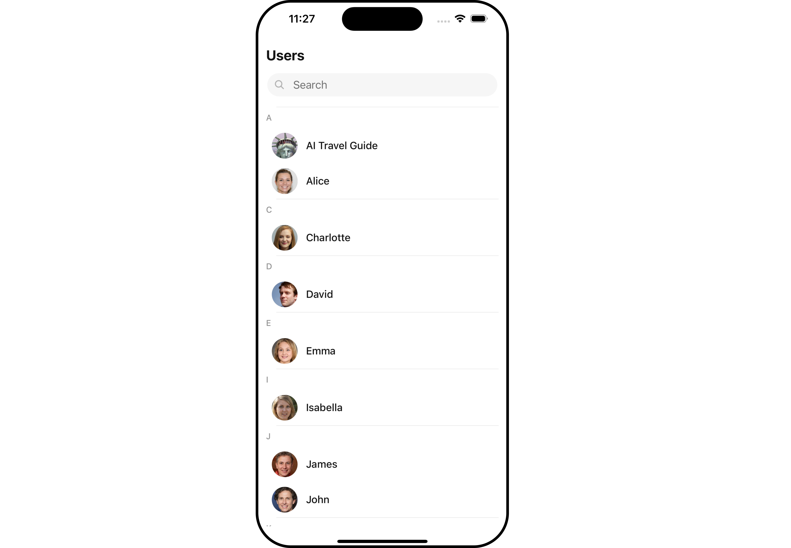

import Tabs from '@theme/Tabs';
import TabItem from '@theme/TabItem';

## Overview

The Users is a [Component](/ui-kit/react-native/components-overview#components), showcasing an accessible list of all available users. It provides an integral search functionality, allowing you to locate any specific user swiftly and easily. For each user listed, the widget displays the user's name by default, in conjunction with their avatar when available. Furthermore, it includes a status indicator, visually informing you whether a user is currently online or offline.

<Tabs>

<TabItem value="iOS" label="iOS">



</TabItem>

<TabItem value="android" label="Android">


</TabItem>

</Tabs>

The Users component is composed of the following BaseComponents:

| Components              | Description                                                                                                             |
| ----------------------- | ----------------------------------------------------------------------------------------------------------------------- |
| CometChatList           | a reusable container component having title, search box, customisable background and a List View                        |
| [ListItem](./list-item) | a component that renders data obtained from a User object on a Tile having a title, subtitle, leading and trailing view |

---

## Usage

### Integration

The following code snippet illustrates how you can directly incorporate the Users component into your `App.tsx` file.

<Tabs>
<TabItem value="typescript" label="App.tsx">

```tsx
return <CometChatUsers />;
```

</TabItem>
</Tabs>

### Actions

[Actions](/ui-kit/react-native/components-overview#actions) dictate how a component functions. They are divided into two types: Predefined and User-defined. You can override either type, allowing you to tailor the behavior of the component to fit your specific needs.

##### 1. onSelection

The `onSelection` event is activated when you select the done icon in the Menubar while in selection mode. This returns a list of all the users that you have selected.

This action does not come with any predefined behavior. However, you have the flexibility to override this event and tailor it to suit your needs using the following code snippet.

<Tabs>

<TabItem value="typescript" label="App.tsx">

```tsx
import { CometChat } from "@cometchat/chat-sdk-react-native";
import { CometChatUsers } from "@cometchat/chat-uikit-react-native";

function App(): React.JSX.Element {
  const onSelectionHandler = (list: CometChat.User[]) => {
    //code
  };

  return (
    <CometChatUsers onSelection={onSelectionHandler} selectionMode="multiple" />
  );
}
```

</TabItem>

</Tabs>

##### 2. onItemPress

The `onItemPress` event is activated when you press on the UserList item. This action does not come with any predefined behavior. However, you have the flexibility to override this event and tailor it to suit your needs using the following code snippet.

<Tabs>

<TabItem value="tsx`" label="App.tsx">

```tsx
import { CometChat } from "@cometchat/chat-sdk-react-native";
import { CometChatUsers } from "@cometchat/chat-uikit-react-native";

function App(): React.JSX.Element {
  const onItemPresshandler = (user: CometChat.User) => {
    //code
  };

  return <CometChatUsers onItemPress={onItemPresshandler} />;
}
```

</TabItem>
</Tabs>

##### 3. onItemLongPress

The `onItemLongPress` event is activated when you Long Press on the UserList item. This action does not come with any predefined behavior. However, you have the flexibility to override this event and tailor it to suit your needs using the following code snippet.

<Tabs>

<TabItem value="tsx`" label="App.tsx">

```tsx
import { CometChat } from "@cometchat/chat-sdk-react-native";
import { CometChatUsers } from "@cometchat/chat-uikit-react-native";

function App(): React.JSX.Element {
  const onItemLongPresshandler = (user: CometChat.User) => {
    //code
  };

  return <CometChatUsers onItemLongPress={onItemLongPresshandler} />;
}
```

</TabItem>
</Tabs>

##### 4. onBack

The `onBack` function is built to respond when you tap the back button in the Toolbar of the activity.

By default, this action has a predefined behavior: it simply closes the current activity. However, the flexibility of CometChat UI Kit allows you to override this standard behavior according to your application's specific requirements. You can define a custom action that will be performed instead when the back button is pressed.

<Tabs>

<TabItem value="App.tsx" label="App.tsx">

```tsx
import { CometChat } from "@cometchat/chat-sdk-react-native";
import { CometChatUsers } from "@cometchat/chat-uikit-react-native";

function App(): React.JSX.Element {
  const onBackHandler = () => {
    //code
  };

  return <CometChatUsers showBackButton={true} onBack={onBackHandler} />;
}
```

</TabItem>
</Tabs>

##### 5. onError

This action doesn't change the behavior of the component but rather listens for any errors that occur in the User component.

<Tabs>

<TabItem value="App.tsx" label="App.tsx">

```tsx
import { CometChat } from "@cometchat/chat-sdk-react-native";
import { CometChatUsers } from "@cometchat/chat-uikit-react-native";

function App(): React.JSX.Element {
  const onErrorHandler = (error: CometChat.CometChatException) => {
    //code
  };

  return <CometChatUsers onError={onErrorHandler} />;
}
```

</TabItem>
</Tabs>

### Filters

**Filters** allow you to customize the data displayed in a list within a Component. You can filter the list based on your specific criteria, allowing for a more customized. Filters can be applied using RequestBuilders of Chat SDK.

##### 1. UserRequestBuilder

The [UserRequestBuilder](/sdk/react-native/retrieve-users) enables you to filter and customize the user list based on available parameters in UserRequestBuilder. This feature allows you to create more specific and targeted queries when fetching users. The following are the parameters available in [UserRequestBuilder](/sdk/react-native/retrieve-users)

| Methods              | Type                | Description                                                                            |
| -------------------- | ------------------- | -------------------------------------------------------------------------------------- |
| **setLimit**         | number              | sets the number users that can be fetched in a single request, suitable for pagination |
| **setSearchKeyword** | string              | used for fetching users matching the passed string                                     |
| **hideBlockedUsers** | bool                | used for fetching all those users who are not blocked by the logged in user            |
| **friendsOnly**      | bool                | used for fetching only those users in which logged in user is a member                 |
| **setRoles**         | Array&lt;string&gt; | used for fetching users containing the passed tags                                     |
| **setTags**          | Array&lt;string&gt; | used for fetching users containing the passed tags                                     |
| **withTags**         | bool                | used for fetching users containing tags                                                |
| **setUserStatus**    | string              | used for fetching users by their status online or offline                              |
| **setUIDs**          | Array&lt;string&gt; | used for fetching users containing the passed users                                    |

**Example**

In the example below, we are applying a filter to the UserList based on Friends.

<Tabs>
<TabItem value="App.tsx" label="App.tsx">

```tsx
import { CometChat } from "@cometchat/chat-sdk-react-native";
import { CometChatUsers } from "@cometchat/chat-uikit-react-native";

function App(): React.JSX.Element {
  const usersRequestBuilder = new CometChat.UsersRequestBuilder()
    .setLimit(5)
    .friendsOnly(true);

  return <CometChatUsers usersRequestBuilder={usersRequestBuilder} />;
}
```

</TabItem>
</Tabs>

##### 2. SearchRequestBuilder

The SearchRequestBuilder uses [UserRequestBuilder](/sdk/react-native/retrieve-users) enables you to filter and customize the search list based on available parameters in UserRequestBuilder.
This feature allows you to keep uniformity between the displayed UserList and searched UserList.

**Example**

<Tabs>
<TabItem value="App.tsx`" label="App.tsx`">

```tsx
import { CometChat } from "@cometchat/chat-sdk-react-native";
import { CometChatUsers } from "@cometchat/chat-uikit-react-native";

function App(): React.JSX.Element {
  const usersRequestBuilder = new CometChat.UsersRequestBuilder()
    .setLimit(5)
    .setSearchKeyword("Alice");

  return <CometChatUsers searchRequestBuilder={usersRequestBuilder} />;
}
```

</TabItem>
</Tabs>

### Events

[Events](/ui-kit/react-native/components-overview#events) are emitted by a Component. By using event you can extend existing functionality. Being global events, they can be applied in Multiple Locations and are capable of being Added or Removed.

The users component does not produce any events directly.

## Customization

To fit your app's design requirements, you can customize the appearance of the conversation component. We provide exposed methods that allow you to modify the experience and behavior according to your specific needs.

### Style

Using Style you can customize the look and feel of the component in your app, These parameters typically control elements such as the color, size, shape, and fonts used within the component.

##### 1. Users Style

You can set the `UsersStyle` to the Users Component to customize the styling.

<Tabs>

<TabItem value="App.tsx" label="App.tsx">

```tsx
import { CometChat } from "@cometchat/chat-sdk-react-native";
import {
  CometChatUsers,
  CometChatListStylesInterface,
} from "@cometchat/chat-uikit-react-native";

function App(): React.JSX.Element {
  const usersStyle: CometChatListStylesInterface = {
    background: "#ddd7f7",
    titleColor: "#6851D6",
  };

  return <CometChatUsers usersStyle={usersStyle} />;
}
```

</TabItem>
</Tabs>

List of properties exposed by MessageListStyle

| Property                   | Description                                                                              | Code                                         |
| -------------------------- | ---------------------------------------------------------------------------------------- | -------------------------------------------- |
| **background**             | Used to set the background color                                                         | `background?: string`                        |
| **border**                 | Used to set border width                                                                 | `border?: BorderStyleInterface`              |
| **borderRadius**           | Used to set border radius                                                                | `borderRadius?: number `                     |
| **titleFont**              | Used to set the title font                                                               | `titleFont?: FontStyleInterface`             |
| **titleColor**             | Used to set the color of the title                                                       | `titleColor?: string`                        |
| **backIconTint**           | Used to set the tint for back icon                                                       | `backIconTint?: string`                      |
| **searchBorder**           | Used to set the border for the search box                                                | `searchBorder?: BorderStyleInterface`        |
| **searchBorderRadius**     | Used to set the border radius of the search box                                          | `searchBorderRadius?: number`                |
| **searchBackground**       | Used to set the background color for the search box                                      | `searchBackground?: string`                  |
| **searchTextFont**         | Used to set the font for the search box                                                  | `searchTextFont?: FontStyleInterface`        |
| **searchTextColor**        | Used to set the color for the search box text                                            | `searchTextColor?: string`                   |
| **searchIconTint**         | Used to set the color of the search icon in the search box                               | `searchIconTint?: string`                    |
| **SearchBorderWidth**      | Used to set the border width of the search box                                           | `setSearchBorderWidth(int) `                 |
| **loadingIconTint**        | Used to set the color of the icon shown while the list of group members is being fetched | `loadingIconTint?: string`                   |
| **emptyTextFont**          | Used to set the font for the empty state (when user list is empty)                       | `searchTextFont?: FontStyleInterface`        |
| **emptyTextColor**         | Used to set the text color for the empty state (when user list is empty)                 | `searchTextColor?: string`                   |
| **onlineStatusColor**      | Used to set the color of the status indicator shown if a group member is online          | `onlineStatusColor?: string`                 |
| **separatorColor**         | Used to set the color of the divider separating the user items                           | `separatorColor?: string`                    |
| **sectionHeaderTextFont**  | Used to set the font for the section header                                              | `sectionHeaderTextFont?: FontStyleInterface` |
| **sectionHeaderTextColor** | Used to set the color for the section header text                                        | `sectionHeaderTextColor?: string`            |

##### 2. Avatar Style

To apply customized styles to the `Avatar` component in the Users Component, you can use the following code snippet. For further insights on `Avatar` Styles [refer](./avatar)

<Tabs>

<TabItem value="tsx" label="App.tsx">

```tsx
import { CometChat } from "@cometchat/chat-sdk-react-native";
import {
  CometChatUsers,
  CometChatListStylesInterface,
} from "@cometchat/chat-uikit-react-native";

function App(): React.JSX.Element {
  const avatarStyle: AvatarStyleInterface = {
    outerViewSpacing: 5,
    outerView: {
      borderWidth: 2,
      borderStyle: "dotted",
      borderColor: "blue",
    },
    border: borderStyle,
  };

  return <CometChatUsers avatarStyle={avatarStyle} />;
}
```

</TabItem>
</Tabs>

##### 3. StatusIndicator Style

To apply customized styles to the Status Indicator component in the Users Component, You can use the following code snippet. For further insights on Status Indicator Styles [refer](./status-indicator)

<Tabs>

<TabItem value="App.tsx" label="App.tsx">

```tsx
import { CometChat } from "@cometchat/chat-sdk-react-native";
import {
  CometChatUsers,
  CometChatListStylesInterface,
} from "@cometchat/chat-uikit-react-native";

function App(): React.JSX.Element {
  const statusIndicatorStyle: StatusIndicatorStyleInterface = {
    backgroundColor: "grey",
  };

  return <CometChatUsers statusIndicatorStyle={statusIndicatorStyle} />;
}
```

</TabItem>
</Tabs>

---

### Functionality

These are a set of small functional customizations that allow you to fine-tune the overall experience of the component. With these, you can change text, set custom icons, and toggle the visibility of UI elements.

<Tabs>

<TabItem value="tsx" label="App.tsx">

```tsx
import { CometChat } from "@cometchat/chat-sdk-react-native";
import {
  CometChatUsers,
  CometChatListStylesInterface,
} from "@cometchat/chat-uikit-react-native";

function App(): React.JSX.Element {
  const statusIndicatorStyle: StatusIndicatorStyleInterface = {
    backgroundColor: "grey",
  };

  return <CometChatUsers title="Contacts" showBackButton={true} />;
}
```

</TabItem>
</Tabs>

<Tabs>

<TabItem value="iOS" label="iOS">


</TabItem>

<TabItem value="android" label="Android">


</TabItem>

</Tabs>

Below is a list of customizations along with corresponding code snippets
| Property | Description | Code |
| -------------------------------------------------------------------------------------------------------- | ---------------------------------------------------------------------------------------------------------------------------------- | ----------------------------------------------------------- |
| **title** | Used to set title in the app bar | `title?: string;` |
| **searchPlaceholderText** | Used to set search placeholder text | `searchPlaceholderText?: string;` |
| **backButtonIcon** | Used to set back button icon | `backButtonIcon?: ImageURISource` |
| **showBackButton** | Used to toggle visibility for back button | `showBackButton?: boolean` |
| **searchBoxIcon** | Used to set search Icon in the search field | `searchBoxIcon?: ImageURISource` |
| **hideSearch** | Used to toggle visibility for search box | `hideSearch?: boolean` |
| **hideError** | Used to hide error on fetching users | `hideError?: boolean` |
| **hideSeparator** | Used to hide the divider separating the user items | `hideSeparator?: boolean` |
| **disableUsersPresence** | Used to control visibility of user indicator shown if user is online | `disableUsersPresence?: boolean` |
| **selectionIcon** | Used to override the default selection complete icon | `selectionIcon?: ImageURISource` |
| **emptyStateText** | Used to set a custom text response when fetching the users has returned an empty list | `emptyStateText?: string` |
| **errorStateText** | Used to set a custom text response when some error occurs on fetching the list of users | `errorStateText?: string` |

---

### Advanced

For advanced-level customization, you can set custom views to the component. This lets you tailor each aspect of the component to fit your exact needs and application aesthetics. You can create and define your views, layouts, and UI elements and then incorporate those into the component.

---

#### ListItemView

With this function, you can assign a custom ListItem to the Users Component.

<Tabs>

<TabItem value="App.tsx" label="App.tsx">

```tsx
import { CometChat } from "@cometchat/chat-sdk-react-native";
import {
  CometChatUsers,
  CometChatListStylesInterface,
} from "@cometchat/chat-uikit-react-native";

function App(): React.JSX.Element {
  const viewStyle: StyleProp<ViewStyle> = {
    flex: 1,
    flexDirection: "row",
    alignItems: "flex-start",
    padding: 10,
    borderColor: "black",
    borderWidth: 1,
    backgroundColor: "#E8EAE9",
    borderRadius: 10,
    margin: 2,
  };

  const getListItemView = (info: { item: CometChat.User; index: number }) => {
    let user = info.item;
    return (
      <View style={viewStyle}>
        <CometChatAvatar
          image={user.getAvatar() ? { uri: user.getAvatar() } : undefined}
          name={user.getName()}
        />

        <View>
          <Text style={{ color: "black", fontWeight: "bold" }}>
            {user.getName()}
          </Text>
          <Text style={{ color: "#667" }}>{user.getStatus()}</Text>
        </View>
      </View>
    );
  };

  return <CometChatUsers ListItemView={getListItemView} />;
}
```

</TabItem>
</Tabs>

**Example**

<Tabs>

<TabItem value="iOS" label="iOS">


</TabItem>

<TabItem value="android" label="Android">


</TabItem>

</Tabs>

---

#### AppBarOptions

You can set the Custom AppBarOptions to add more options to the Users component.

<Tabs>

<TabItem value="tsx" label="App.tsx">

    ```tsx

import {CometChat} from '@cometchat/chat-sdk-react-native';
import { CometChatUsers, CometChatListStylesInterface } from '@cometchat/chat-uikit-react-native';

function App(): React.JSX.Element {

const styles = StyleSheet.create({
button: {
height: 20,
width: 20,
borderRadius: 0,
backgroundColor: 'transparent',
},
image: {
height: 20,
width: 20,
tintColor: '#7E57C2',
},
});

const getAppBarOptions = () => {
return (
<TouchableOpacity style={styles.button} onPress={() => {/_code_/}}>
<Image source={Notification} style={styles.image} />
</TouchableOpacity>
);
};

return (
<CometChatUsers
         AppBarOptions={getAppBarOptions}
      />
);
}

````

</TabItem>
</Tabs>

**Example**

<Tabs>

<TabItem value="iOS" label="iOS">


</TabItem>

<TabItem value="android" label="Android">


</TabItem>

</Tabs>

---

#### LoadingStateView

You can set a custom loader view using `LoadingStateView` to match the loading view of your app.

<Tabs>

<TabItem value="tsx" label="App.tsx">

```tsx
import { CometChat } from "@cometchat/chat-sdk-react-native";
import {
  CometChatUsers,
  CometChatListStylesInterface,
} from "@cometchat/chat-uikit-react-native";

function App(): React.JSX.Element {
  const loadingViewStyle: StyleProp<ViewStyle> = {
    flex: 1,
    alignItems: "center",
    justifyContent: "center",
    padding: 10,
    borderColor: "black",
    borderWidth: 1,
    backgroundColor: "#E8EAE9",
  };

  const getLoadingStateView = () => {
    return (
      <View style={loadingViewStyle}>
        <Text style={{ fontSize: 20, color: "black" }}>Loading...</Text>
      </View>
    );
  };

  return <CometChatUsers LoadingStateView={getLoadingStateView} />;
}
````

</TabItem>
</Tabs>

**Example**

<Tabs>

<TabItem value="iOS" label="iOS">


</TabItem>

<TabItem value="android" label="Android">


</TabItem>

</Tabs>

---

#### SubtitleView

You can customize the subtitle view for each user item to meet your requirements.

<Tabs>

<TabItem value="tsx" label="App.tsx">

    ```tsx

import {CometChat} from '@cometchat/chat-sdk-react-native';
import { CometChatUsers } from '@cometchat/chat-uikit-react-native';

function App(): React.JSX.Element {

const getSubtitleView = (user) => {
return (
<Text
style={{
          fontSize: 12,
          color: theme.palette.getAccent800(),
        }}>
Last Active At:{' '}
{user?.lastActiveAt
? formatTime(user?.lastActiveAt)
: '--'}
</Text>
);
}

return (
<CometChatUsers
          SubtitleView={getSubtitleView}
      />
);
}

````
</TabItem>
</Tabs>

**Examples**

<Tabs>

<TabItem value="iOS" label="iOS">


</TabItem>

<TabItem value="android" label="Android">


</TabItem>

</Tabs>

---

#### TailView

You can customize the tail view for each user item to meet your requirements.

<Tabs>

<TabItem value="tsx" label="App.tsx">

    ```tsx

import {CometChat} from '@cometchat/chat-sdk-react-native';
import { CometChatUsers } from '@cometchat/chat-uikit-react-native';

function App(): React.JSX.Element {

const getTailView = (user: any) => {
return (
<Text
style={{
            fontSize: 12,
            color: theme.palette.getAccent800(),
          }}>
{user.status}
</Text>
);
};

return (
<CometChatUsers
          TailView={getTailView}
      />
);
}
````

</TabItem>
</Tabs>

**Examples**

<Tabs>

<TabItem value="iOS" label="iOS">


</TabItem>

<TabItem value="android" label="Android">


</TabItem>

</Tabs>

---

#### EmptyStateView

You can set a custom `EmptyStateView` using `EmptyStateView` to match the empty view of your app.

<Tabs>

<TabItem value="tsx" label="App.tsx">

    ```tsx

import {CometChat} from '@cometchat/chat-sdk-react-native';
import { CometChatUsers, CometChatListStylesInterface } from '@cometchat/chat-uikit-react-native';

function App(): React.JSX.Element {

const usersRequestBuilder = new CometChat.UsersRequestBuilder().setLimit(5).setSearchKeyword('user-does-not-exist');

const emptyViewStyle: StyleProp<ViewStyle> = {
flex: 1,
alignItems: 'center',
justifyContent: 'center',
padding: 10,
borderColor: 'black',
borderWidth: 1,
backgroundColor: '#E8EAE9',
};

const getEmptyStateView = () => {
return (
<View style={emptyViewStyle}>
<Text style={{fontSize: 80, color: "black"}}>Empty</Text>
</View>
);
};

return (
<CometChatUsers
          usersRequestBuilder={usersRequestBuilder}
          EmptyStateView={getEmptyStateView}
      />
);
}

````
</TabItem>
</Tabs>

**Examples**

<Tabs>

<TabItem value="iOS" label="iOS">


</TabItem>

<TabItem value="android" label="Android">


</TabItem>

</Tabs>

---

#### Swipe Options

You can set the Custom options to the Users component.

<Tabs>

<TabItem value="tsx" label="App.tsx">

    ```tsx

import {CometChat} from '@cometchat/chat-sdk-react-native';
import { CometChatUsers, CometChatOptions } from '@cometchat/chat-uikit-react-native';

function App(): React.JSX.Element {

const getCustomOptions = (
user: CometChat.User,
) => {
const customOption: CometChatOptions = ({
id: "custom id",
title: "Call",
icon: Call,
iconTint: "#7316f5",
backgroundColor: "#93f5bf",
onPress: () => console.log("custom action"),
});

    return (
      <CometChatUsers
          options={getCustomOptions}
      />

);
}
````

</TabItem>
</Tabs>

**Examples**

<Tabs>

<TabItem value="iOS" label="iOS">


</TabItem>

<TabItem value="android" label="Android">


</TabItem>

</Tabs>
