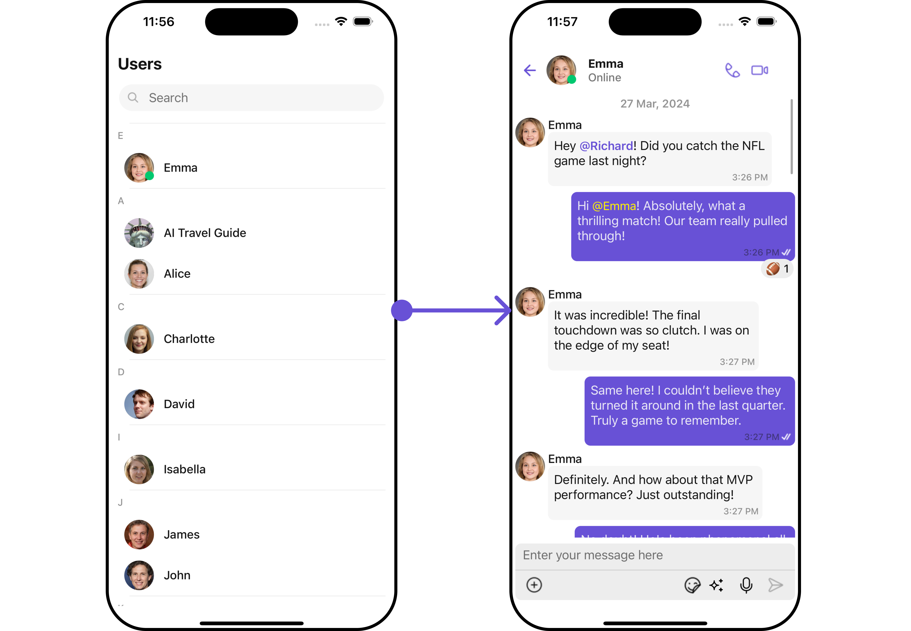
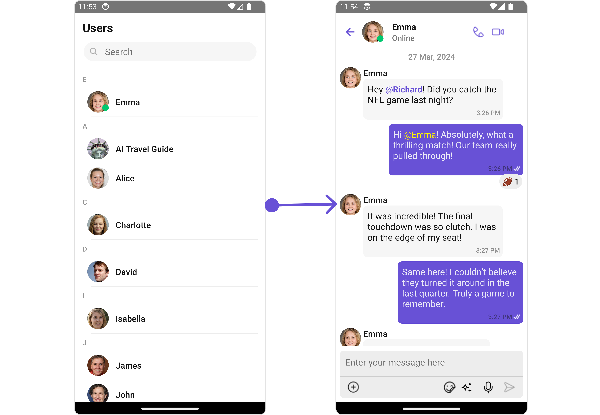
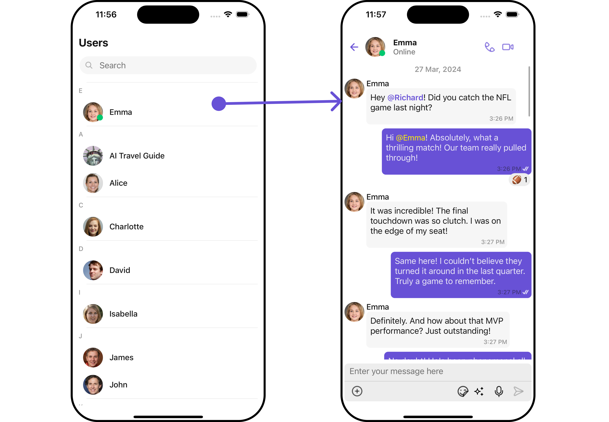
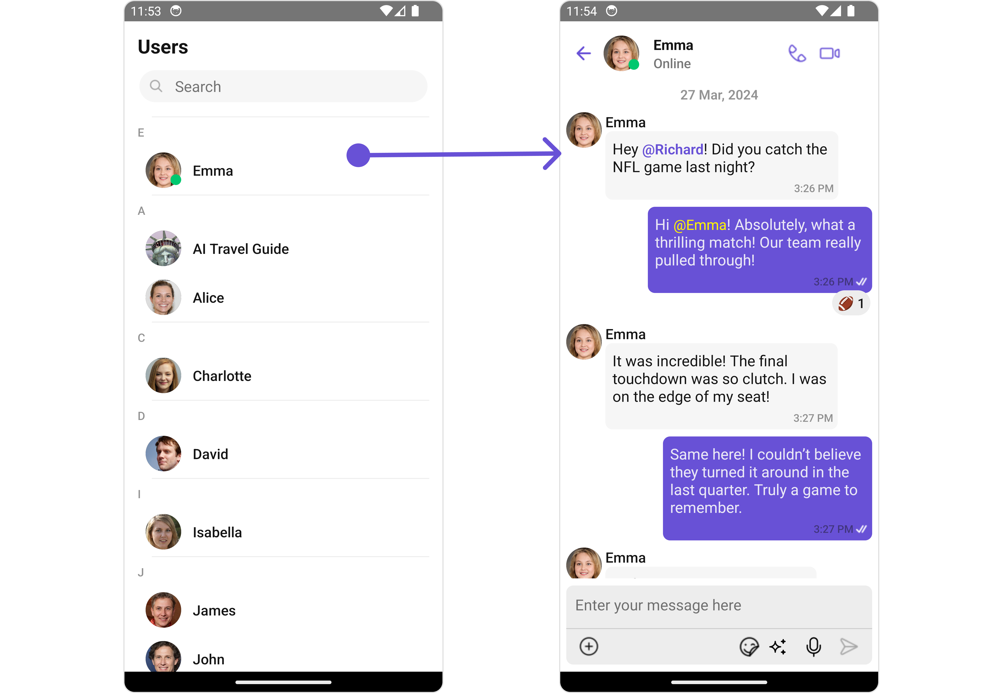
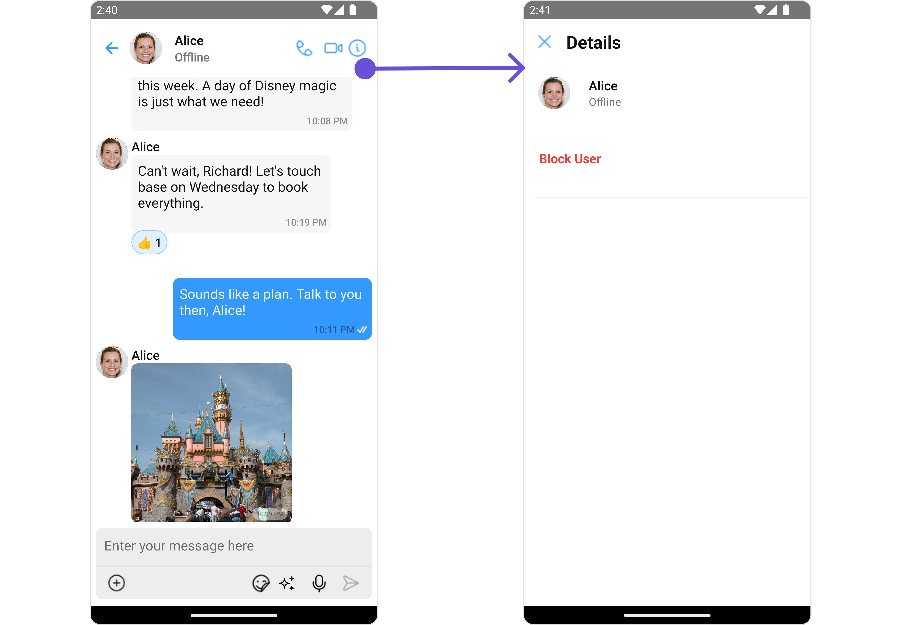
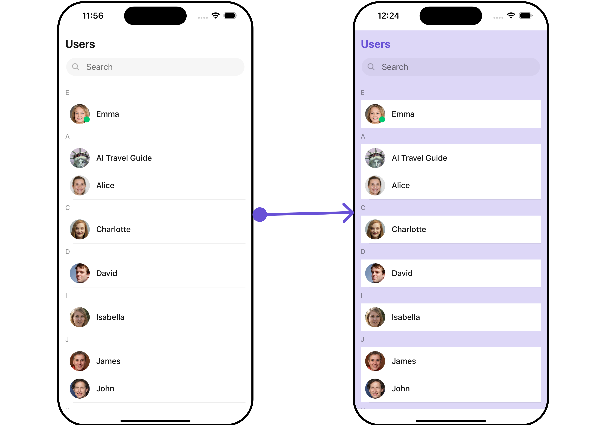
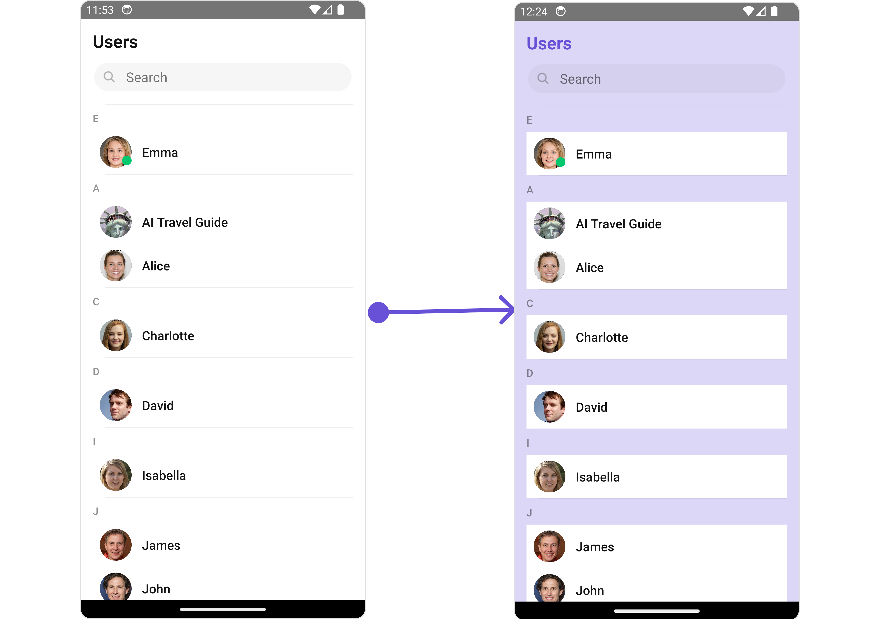
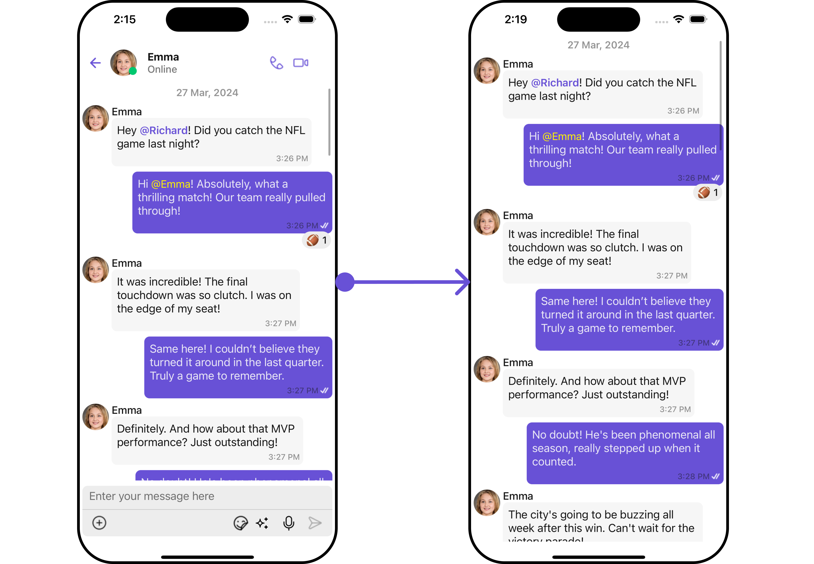
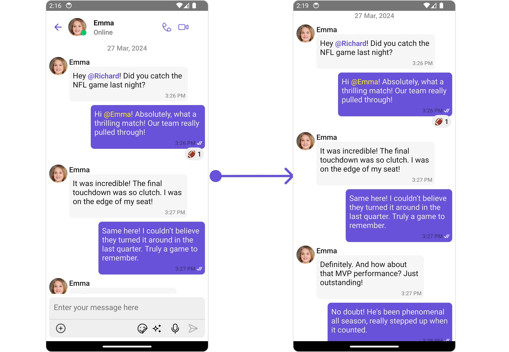

import Tabs from '@theme/Tabs';
import TabItem from '@theme/TabItem';

## Overview

The UsersWithMessages is a [Composite Component](/ui-kit/react-native/components-overview#components) encompassing components such as [Users](./users) and [Messages](./messages). Each of these component contributes to the functionality and structure of the overall UsersWithMessages component.

<Tabs>

<TabItem value="iOS" label="iOS">



</TabItem>

<TabItem value="android" label="Android">



</TabItem>

</Tabs>

| Components             | Description                                                                                                                     |
| ---------------------- | ------------------------------------------------------------------------------------------------------------------------------- |
| [Users](./users)       | The `Users` component is designed to display a list of `Users`.                                                                 |
| [Messages](./messages) | The `Messages` component is designed to manage the messaging interaction for either individual `User` or `Group` conversations. |

## Usage

### Integration

<Tabs>
<TabItem value="typescript" label="App.tsx">

```tsx
import { CometChatUsersWithMessages } from "@cometchat/chat-uikit-react-native";

return <CometChatUsersWithMessages />;
```

</TabItem>
</Tabs>

---

### Actions

[Actions](/ui-kit/react-native/components-overview#actions) dictate how a component functions. They are divided into two types: Predefined and User-defined. You can override either type, allowing you to tailor the behavior of the component to fit your specific needs.

##### 1. onError

This action doesn't change the behavior of the component but rather listens for any errors that occur in the UserWithMessages component.

The sub components - [Users](/ui-kit/react-native/users#actions) and [Messages](/ui-kit/react-native/messages).

The Action of the components can be overridden through the use of the [Configurations](#configurations) object of its components. Here is an example code snippet.

<Tabs>
<TabItem value="tsx" label="App.tsx">

```typescript
import { CometChat } from "@cometchat/chat-sdk-react-native";
import { CometChatUsersWithMessages } from "@cometchat/chat-uikit-react-native";

function App(): React.JSX.Element {
  const onErrorHandler = (error: CometChat.CometChatException) => {
    //code
  };

  return (
    <CometChatUsersWithMessages
      onError={onErrorHandler}
    ></CometChatUsersWithMessages>
  );
}
```

</TabItem>
</Tabs>

The UsersWithMessages component overrides several actions from its components to reach its default behavior. The list of actions overridden by UsersWithMessages includes:

- [onItemPress](/ui-kit/react-native/users/#2-onitempress) : By overriding the `onItemPress` of the Users Component, UsersWithMessages achieves navigation from [Users](/ui-kit/react-native/users) to [Messages](/ui-kit/react-native/messages) component.

<Tabs>

<TabItem value="iOS" label="iOS">



</TabItem>

<TabItem value="android" label="Android">



</TabItem>

</Tabs>

### Filters

**Filters** allow you to customize the data displayed in a list within a Component. You can filter the list based on your specific criteria, allowing for a more customized. Filters can be applied using RequestBuilders of Chat SDK.

While the UsersWithMessages component does not have filters, its components do, For more detail on individual filters of its component refer to [Users Filters](/ui-kit/react-native/users#filters) and [Messages Filters](/ui-kit/react-native/messages).

By utilizing the [Configurations](#configurations) object of its components, you can apply filters.

In the following **example**, we're filtering Users to only show `Friends`

<Tabs>
<TabItem value="tsx" label="App.tsx">

```typescript
import { CometChat } from "@cometchat/chat-sdk-react-native";
import {
  CometChatUsersWithMessages,
  UsersConfigurationInterface,
} from "@cometchat/chat-uikit-react-native";

function App(): React.JSX.Element {
  const usersRequestBuilder = new CometChat.UsersRequestBuilder()
    .setLimit(5)
    .friendsOnly(true);

  const usersConfiguration: UsersConfigurationInterface = {
    usersRequestBuilder: usersRequestBuilder,
  };

  return (
    <CometChatUsersWithMessages
      usersConfiguration={usersConfiguration}
    ></CometChatUsersWithMessages>
  );
}
```

</TabItem>
</Tabs>

---

### Events

[Events](/ui-kit/react-native/components-overview#events) are emitted by a `Component`. By using event you can extend existing functionality. Being global events, they can be applied in Multiple Locations and are capable of being Added or Removed.

The UsersWithMessages component and its components do not directly generate any events.

---

## Customization

To fit your app's design requirements, you have the ability to customize the appearance of the
UsersWithMessages component. We provide exposed methods that allow you to modify the experience and behavior according to your specific needs.

### Style

Using **Style** you can **customize** the look and feel of the component in your app, These parameters typically control elements such as the **color**, **size**, **shape**, and **fonts** used within the component.
UsersWithMessages component doesn't have its own style parameters. But you can customize its component styles. For more details on individual component styles, you can refer [User Styles](/ui-kit/react-native/users#style) and [Messages Styles](/ui-kit/react-native/messages#style).
Styles can be applied to SubComponents using their respective [configurations](#configurations).

**Example**

<Tabs>
<TabItem value="tsx" label="App.tsx">

```typescript
import { CometChat } from "@cometchat/chat-sdk-react-native";
import {
  CometChatUsersWithMessages,
  CometChatListStylesInterface,
  UsersConfigurationInterface,
} from "@cometchat/chat-uikit-react-native";

function App(): React.JSX.Element {
  const usersStyle: CometChatListStylesInterface = {
    background: "#ddd7f7",
    titleColor: "#6851D6",
  };

  const usersConfiguration: UsersConfigurationInterface = {
    usersStyle: usersStyle,
  };

  return (
    <CometChatUsersWithMessages
      usersConfiguration={usersConfiguration}
    ></CometChatUsersWithMessages>
  );
}
```

</TabItem>
</Tabs>

### Functionality

These are a set of **small functional customizations** that allow you to **fine-tune** the overall experience of the component. With these, you can **change text**, set **custom icons**, and toggle the **visibility** of UI elements.

##### User Prop

You can pass a [User](/sdk/react-native/user-management) object as prop to the UsersWithMessages component. This will automatically direct you to the [Messages](./messages) component for the specified `User`.

<Tabs>
<TabItem value="js" label="App.tsx">

```typescript
import { CometChat } from "@cometchat/chat-sdk-react-native";
import { CometChatUsersWithMessages } from "@cometchat/chat-uikit-react-native";

const [user, setUser] = useState<CometChat.User | undefined>(undefined);

const getUser = async () => {
  const user = await CometChat.getUser("uid");
  setUser(user);
};

useEffect(() => {
  getUser();
}, []);

return <CometChatUsersWithMessages user={user} />;
```

</TabItem>
</Tabs>

---

##### Components

Nearly all functionality customizations available for a Component are also available for the composite component. Using [Configuration](#configurations), you can modify the properties of its components to suit your needs.

You can find the list of all Functionality customization of individual components in [Users](/ui-kit/react-native/users#functionality) and [Messages](/ui-kit/react-native/messages#functionality)

**Example**

<Tabs>
<TabItem value="js" label="App.tsx">

```typescript
import { CometChat } from "@cometchat/chat-sdk-react-native";
import {
  CometChatUsersWithMessages,
  UsersConfigurationInterface,
  MessagesConfigurationInterface,
} from "@cometchat/chat-uikit-react-native";

const [user, setUser] = useState<CometChat.User | undefined>(undefined);

const getUser = async () => {
  const user = await CometChat.getUser("uid");
  setUser(user);
};

useEffect(() => {
  getUser();
}, []);

const usersConfiguration: UsersConfigurationInterface = {
  hideSearch: true,
  hideSeparator: true,
};

const messagesConfiguration: MessagesConfigurationInterface = {
  disableTyping: false,
  hideMessageComposer: false,
};

return (
  <CometChatUsersWithMessages
    usersConfiguration={usersConfiguration}
    messagesConfigurations={messagesConfiguration}
  />
);
```

</TabItem>
</Tabs>

---

### Advanced

For advanced-level customization, you can set custom views to the component. This lets you tailor each aspect of the component to fit your exact needs and application aesthetics. You can create and define your own views, layouts, and UI elements and then incorporate those into the component.

By utilizing the [Configuration](#configurations) object of each component, you can apply advanced-level customizations to the UsersWithMessages.

**Example**

<Tabs>
<TabItem value="js" label="App.tsx">

```typescript
import {
  CometChatUsersWithMessages,
  UsersConfigurationInterface,
} from "@cometchat/chat-uikit-react-native";

const errorViewStyle: StyleProp<ViewStyle> = {
  flex: 1,
  alignItems: "center",
  justifyContent: "center",
  padding: 10,
  borderColor: "black",
  borderWidth: 1,
  backgroundColor: "#E8EAE9",
};

const getErrorStateView = () => {
  return (
    <View style={errorViewStyle}>
      <Text></Text>
    </View>
  );
};

const usersConfiguration: UsersConfigurationInterface = {
  ErrorStateView: getErrorStateView,
};

return <CometChatUsersWithMessages usersConfiguration={usersConfiguration} />;
```

</TabItem>
</Tabs>

---

To find all the details on individual Component advance customization you can refer, [Users Advanced](/ui-kit/react-native/users#advanced) and [Messages Advanced](/ui-kit/react-native/messages#advanced).

UsersWithMessages uses advanced-level customization of both Users & Messages components to achieve its default behavior.

1. UsersWithMessages utilizes the [AppBarOptions](/ui-kit/react-native/messages#auxilaryappbaroptions) of the `Messages` subcomponent to navigate from [Messages](/ui-kit/react-native/messages) to [Details](./user-details)

<Tabs>

<TabItem value="iOS" label="iOS">


</TabItem>

<TabItem value="android" label="Android">



</TabItem>

</Tabs>

:::warning

When you override `AppBarOptions`, the default behavior of UsersWithMessages will also be overridden.

:::

## Configurations

[Configurations](/ui-kit/react-native/components-overview#configurations) offer the ability to customize the properties of each component within a Composite Component.

UsersWithMessages has `Users` and `Messages` component. Hence, each of these components will have its individual `Configuration``.

- `Configurations` expose properties that are available in its individual components.

#### Users

You can customize the properties of the Users component by making use of the usersConfiguration. You can accomplish this by employing the `usersConfiguration` props as demonstrated below:

<Tabs>

<TabItem value="ts" label="App.tsx">

```typescript
import {
  CometChatUsersWithMessages,
  UsersConfigurationInterface,
} from "@cometchat/chat-uikit-react-native";

const usersConfiguration: UsersConfigurationInterface = {
  //override properties
};

return <CometChatUsersWithMessages usersConfiguration={usersConfiguration} />;
```

</TabItem>

</Tabs>

All exposed properties of `UsersConfiguration` can be found under [Users](./users#functionality).

<!-- Properties marked with the <a data-tooltip-id="my-tooltip-html-prop"><span class="material-icons red">report</span></a> symbol are not accessible within the Configuration Object. -->

**Example**

Let's say you want to change the style of the Users subcomponent and, in addition, you only want to display friends in the users list.

You can modify the style using the `usersStyle` property and filter the list with the `usersRequestBuilder` property.

<Tabs>

<TabItem value="iOS" label="iOS">



</TabItem>

<TabItem value="android" label="Android">



</TabItem>

</Tabs>

<Tabs>

<TabItem value="java" label="TypeScript">

```javascript
import { CometChat } from "@cometchat/chat-sdk-react-native";
import {
  CometChatUsersWithMessages,
  CometChatListStylesInterface,
  UsersConfigurationInterface,
} from "@cometchat/chat-uikit-react-native";

function App(): React.JSX.Element {
  const customRequestBuilder: CometChat.UsersRequestBuilder =
    new CometChat.UsersRequestBuilder().setLimit(5).friendsOnly(true);

  const customUserStyle: CometChatListStylesInterface = {
    background: "#ddd7f7",
    titleColor: "#6851D6",
  };

  const usersConfiguration: UsersConfigurationInterface = {
    usersStyle: customUserStyle,
    usersRequestBuilder: customRequestBuilder,
  };

  return (
    <CometChatUsersWithMessages
      usersConfiguration={usersConfiguration}
    ></CometChatUsersWithMessages>
  );
}
```

</TabItem>

</Tabs>

---

#### Messages

You can customize the properties of the Messages component by making use of the messagesConfiguration. You can accomplish this by employing the `messagesConfiguration` props as demonstrated below:

<Tabs>

<TabItem value="java" label="TypeScript">

```javascript
import {
  CometChatUsersWithMessages,
  MessagesConfigurationInterface,
} from "@cometchat/chat-uikit-react-native";

const messagesConfiguration: MessagesConfigurationInterface = {
  //override properties
};
return (
  <CometChatUsersWithMessages messagesConfigurations={messagesConfiguration} />
);
```

</TabItem>

</Tabs>

All exposed properties of `MessagesConfiguration` can be found under [Messages](./messages#configuration).

<!-- Properties marked with the <a data-tooltip-id="my-tooltip-html-prop"><span class="material-icons red">report</span></a> symbol are not accessible within the Configuration Object. -->

**Example**

Let's say you want to change the style of the Messages subcomponent and, in addition, you only want to hide message header.

You can modify the style using the `messagesStyle` property and hide the message header with the `hideMessageHeader` property.

<Tabs>

<TabItem value="iOS" label="iOS">



</TabItem>

<TabItem value="android" label="Android">



</TabItem>

</Tabs>

<Tabs>

<TabItem value="javascript" label="TypeScript">

```typescript
import {
  CometChatUsersWithMessages,
  MessagesConfigurationInterface,
} from "@cometchat/chat-uikit-react-native";

const messagesConfiguration: MessagesConfigurationInterface = {
  hideMessageHeader: true,
  hideMessageComposer: true,
};

return (
  <CometChatUsersWithMessages messagesConfigurations={messagesConfiguration} />
);
```

</TabItem>

</Tabs>

---
