import Tabs from '@theme/Tabs';
import TabItem from '@theme/TabItem';

import { Tooltip } from 'react-tooltip'
import 'react-tooltip/dist/react-tooltip.css'

## Overview

The Groups is a [Component](/ui-kit/react-native/components-overview#components), showcasing an accessible list of all available groups. It provides an integral search functionality, allowing you to locate any specific groups swiftly and easily. For each group listed, the group name is displayed by default, in conjunction with the group icon when available. Additionally, it provides a useful feature by displaying the number of members in each group as a subtitle, offering valuable context about group size and activity level.

<Tabs>

<TabItem value="iOS" label="iOS">

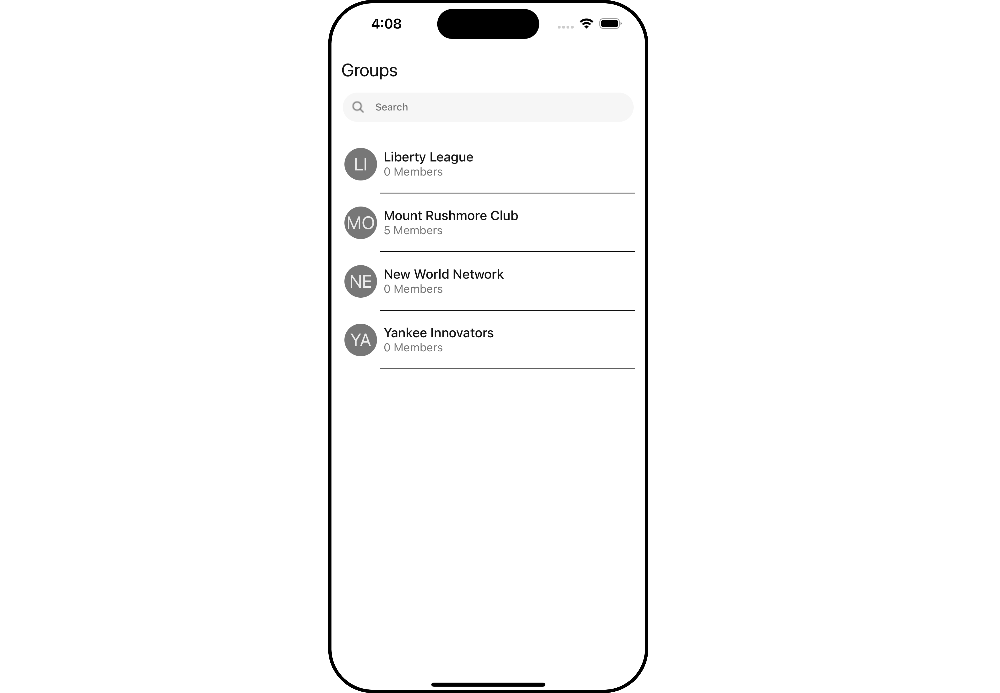

</TabItem>

<TabItem value="android" label="Android">

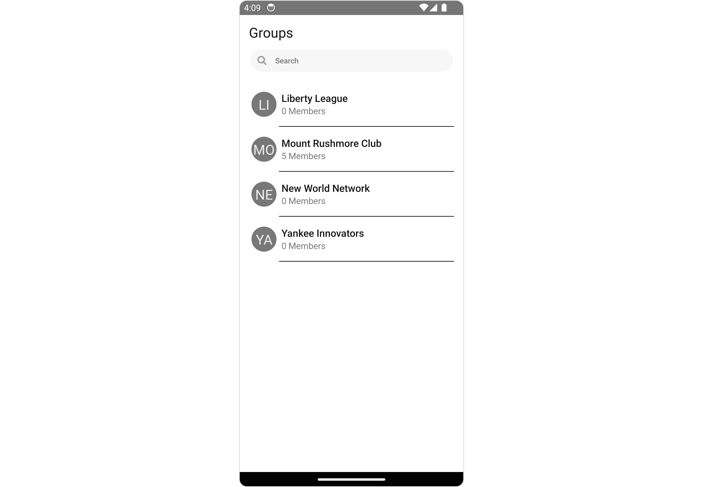

</TabItem>

</Tabs>

The Groups component is composed of the following BaseComponents:

| Components              | Description                                                                                                             |
| ----------------------- | ----------------------------------------------------------------------------------------------------------------------- |
| CometChatList           | a reusable container component having title, search box, customisable background and a List View                        |
| [ListItem](./list-item) | a component that renders data obtained from a User object on a Tile having a title, subtitle, leading and trailing view |

---

## Usage

### Integration

The following code snippet illustrates how you can directly incorporate the Groups component into your `App.tsx` file.

<Tabs>

<TabItem value="typescript" label="App.tsx">

```tsx
import { CometChat } from "@cometchat/chat-sdk-react-native";
import { CometChatGroups } from "@cometchat/chat-uikit-react-native";

function App(): React.JSX.Element {
  return <CometChatGroups />;
}
```

</TabItem>

</Tabs>

### Actions

[Actions](/ui-kit/react-native/components-overview#actions) dictate how a component functions. They are divided into two types: Predefined and User-defined. You can override either type, allowing you to tailor the behavior of the component to fit your specific needs.

##### 1. onSelection

The `onSelection` event is activated when you select the done icon in the AppBar while in selection mode. This returns a list of all the Groups that you have selected.

This action does not come with any predefined behavior. However, you have the flexibility to override this event and tailor it to suit your needs using the following code snippet.

<Tabs>

<TabItem value="typescript" label="App.tsx">

```tsx
import { CometChat } from "@cometchat/chat-sdk-react-native";
import { CometChatGroups } from "@cometchat/chat-uikit-react-native";

function App(): React.JSX.Element {
  const onSelectionHandler = (list: CometChat.Group[]) => {
    //code
  };

  return (
    <CometChatGroups
      onSelection={onSelectionHandler}
      selectionMode="multiple"
    />
  );
}
```

</TabItem>

</Tabs>

<Tabs>

<TabItem value="iOS" label="iOS">


</TabItem>

<TabItem value="android" label="Android">

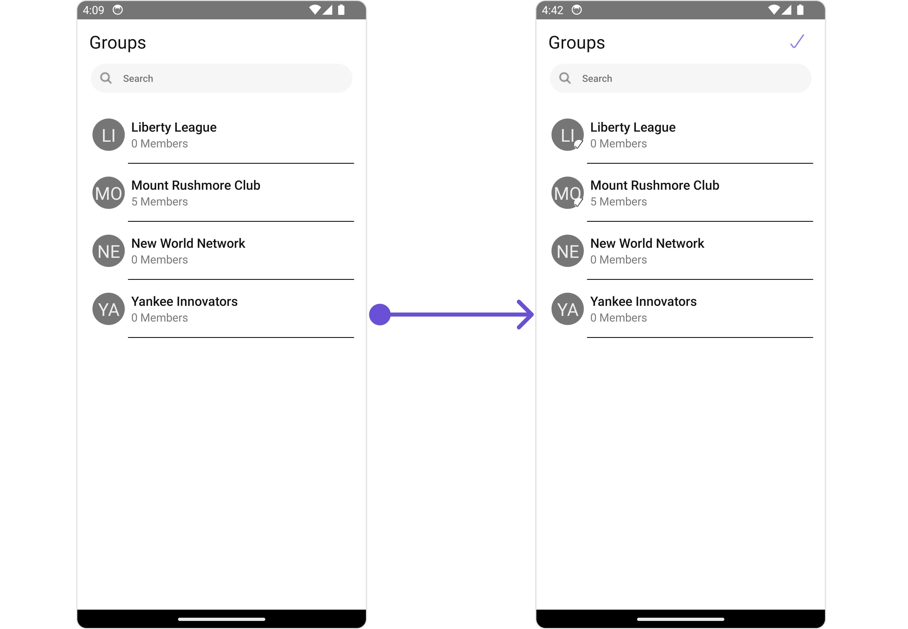

</TabItem>

</Tabs>

##### 2. onItemPress

The `onItemPress` event is activated when you press on the Group item. This action does not come with any predefined behavior. However, you have the flexibility to override this event and tailor it to suit your needs using the following code snippet.

<Tabs>

<TabItem value="tsx`" label="App.tsx">

```tsx
import { CometChat } from "@cometchat/chat-sdk-react-native";
import { CometChatGroups } from "@cometchat/chat-uikit-react-native";

function App(): React.JSX.Element {
  const onItemPresshandler = (user: CometChat.User) => {
    //code
  };

  return (
    <CometChatGroups selectionMode="none" onItemPress={onItemPresshandler} />
  );
}
```

</TabItem>
</Tabs>

##### 3. onItemLongPress

The `onItemLongPress` event is activated when you Long Press on the Group item. This action does not come with any predefined behavior. However, you have the flexibility to override this event and tailor it to suit your needs using the following code snippet.

<Tabs>

<TabItem value="tsx`" label="App.tsx">

```tsx
import { CometChat } from "@cometchat/chat-sdk-react-native";
import { CometChatGroups } from "@cometchat/chat-uikit-react-native";

function App(): React.JSX.Element {
  const onItemLongPresshandler = (group: CometChat.Group) => {
    //code
  };

  return (
    <CometChatGroups
      selectionMode={"none"}
      onItemLongPress={onItemLongPresshandler}
    />
  );
}
```

</TabItem>
</Tabs>

##### 4. onBack

The `onBack` function is built to respond when you press the back button in the AppBar. The back button is only displayed when the prop `showBackButton` is set to true.

By default, this action does not have a predefined behavior. However, you have the flexibility to override this event and tailor it to suit your needs using the following code snippet.

<Tabs>

<TabItem value="App.tsx" label="App.tsx">

```tsx
import { CometChat } from "@cometchat/chat-sdk-react-native";
import { CometChatGroups } from "@cometchat/chat-uikit-react-native";

function App(): React.JSX.Element {
  const onBackHandler = () => {
    //code
  };

  return <CometChatGroups showBackButton={true} onBack={onBackHandler} />;
}
```

</TabItem>
</Tabs>

##### 5. onError

This action doesn't change the behavior of the component but rather listens for any errors that occur in the Groups component.

<Tabs>

<TabItem value="App.tsx" label="App.tsx">

```tsx
import { CometChat } from "@cometchat/chat-sdk-react-native";
import { CometChatGroups } from "@cometchat/chat-uikit-react-native";

function App(): React.JSX.Element {
  const onErrorHandler = (error: CometChat.CometChatException) => {
    //code
  };

  return <CometChatGroups onError={onErrorHandler} />;
}
```

</TabItem>
</Tabs>

### Filters

**Filters** allow you to customize the data displayed in a list within a Component. You can filter the list based on your specific criteria, allowing for a more customized. Filters can be applied using RequestBuilders of Chat SDK.

##### 1. GroupsRequestBuilder

The [GroupsRequestBuilder](/sdk/react-native/retrieve-groups) enables you to filter and customize the group list based on available parameters in [GroupsRequestBuilder](/sdk/react-native/retrieve-groups). This feature allows you to create more specific and targeted queries when fetching groups. The following are the parameters available in [GroupsRequestBuilder](/sdk/react-native/retrieve-groups)

| Methods              | Type                | Description                                                                             |
| -------------------- | ------------------- | --------------------------------------------------------------------------------------- |
| **setLimit**         | number              | sets the number groups that can be fetched in a single request, suitable for pagination |
| **setSearchKeyword** | string              | used for fetching groups matching the passed string                                     |
| **joinedOnly**       | boolean             | to fetch only joined groups                                                             |
| **friendsOnly**      | boolean             | used for fetching only those users in which logged in user is a member                  |
| **setTags**          | Array&lt;string&gt; | used for fetching groups containing the passed tags                                     |
| **withTags**         | boolean             | used to fetch tags data along with the list of groups                                   |

**Example**

In the example below, we are applying a filter to the Group List based on only joined groups and setting the limit to ten.

<Tabs>
<TabItem value="App.tsx" label="App.tsx">

```tsx
import { CometChat } from "@cometchat/chat-sdk-react-native";
import { CometChatGroups } from "@cometchat/chat-uikit-react-native";

function App(): React.JSX.Element {
  const groupsRequestBuilder = new CometChat.GroupsRequestBuilder()
    .setLimit(10)
    .joinedOnly(true);

  return (
    <CometChatGroups
      selectionMode="none"
      groupsRequestBuilder={groupsRequestBuilder}
    />
  );
}
```

</TabItem>
</Tabs>

##### 2. SearchRequestBuilder

The SearchRequestBuilder uses [GroupsRequestBuilder](/sdk/react-native/retrieve-groups) enables you to filter and customize the search list based on available parameters in [GroupsRequestBuilder](/sdk/react-native/retrieve-groups).

**Example**

<Tabs>
<TabItem value="App.tsx" label="App.tsx">

```tsx
import { CometChat } from "@cometchat/chat-sdk-react-native";
import { CometChatGroups } from "@cometchat/chat-uikit-react-native";

function App(): React.JSX.Element {
  const searchRequestBuilder = new CometChat.GroupsRequestBuilder()
    .setLimit(10)
    .setSearchKeyword("custom-keyword");

  return (
    <CometChatGroups
      selectionMode="none"
      searchRequestBuilder={searchRequestBuilder}
    />
  );
}
```

</TabItem>
</Tabs>

---

### Events

[Events](/ui-kit/react-native/components-overview#events) are emitted by a Component. By using event you can extend existing functionality. Being global events, they can be applied in Multiple Locations and are capable of being Added or Removed.

To handle events supported by Groups you have to add corresponding listeners by using `CometChatGroupEvents`.

The Groups component does not produce any events directly.

---

## Customization

To fit your app's design requirements, you can customize the appearance of the conversation component. We provide exposed methods that allow you to modify the experience and behavior according to your specific needs.

### Style

Using Style you can customize the look and feel of the component in your app, These parameters typically control elements such as the color, size, shape, and fonts used within the component.

##### 1. Groups Style

You can set the `GroupsStyle` to the Groups Component to customize the styling.

<Tabs>

<TabItem value="iOS" label="iOS">

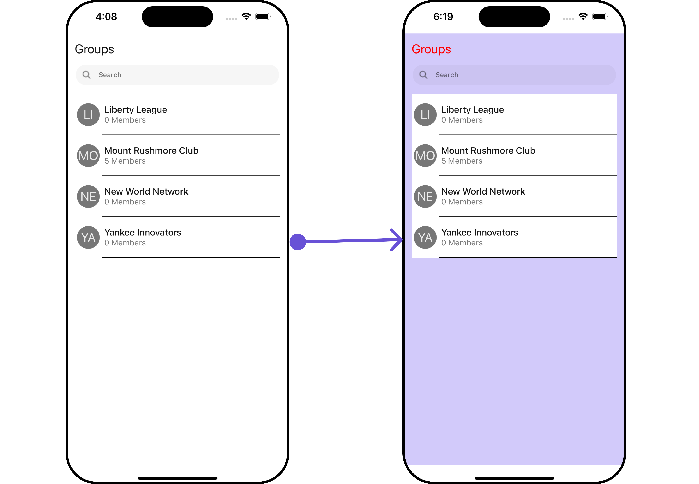

</TabItem>

<TabItem value="android" label="Android">

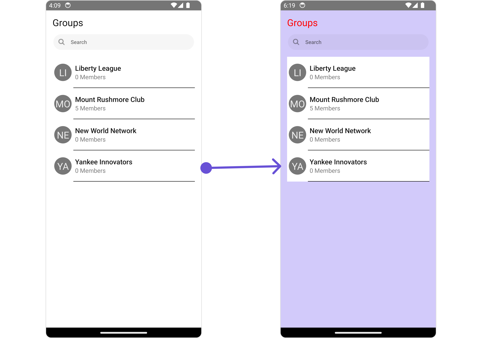

</TabItem>

</Tabs>

<Tabs>

<TabItem value="App.tsx" label="App.tsx">

```tsx
import { CometChat } from "@cometchat/chat-sdk-react-native";
import {
  CometChatGroups,
  GroupsStyleInterface,
} from "@cometchat/chat-uikit-react-native";

function App(): React.JSX.Element {
  const groupsStyle: GroupsStyleInterface = {
    titleColor: "red",
    backgroundColor: "#d2cafa",
  };

  return <CometChatGroups groupsStyle={groupsStyle} />;
}
```

</TabItem>
</Tabs>

List of properties exposed by GroupsStyle

| Property                        | Description                                                                                                      | Code                                       |
| ------------------------------- | ---------------------------------------------------------------------------------------------------------------- | ------------------------------------------ |
| **border**                      | Used to set border                                                                                               | `border?: BorderStyleInterface,`           |
| **borderRadius**                | Used to set border radius                                                                                        | `borderRadius?: number;`                   |
| **backgroundColor**             | Used to set background colour                                                                                    | `background?: string;`                     |
| **height**                      | Used to set height                                                                                               | `height?: number` &#124; `string;`         |
| **width**                       | Used to set width                                                                                                | `width?: number` &#124; `string;`          |
| **titleFont**                   | Used to customise the font of the title in the app bar                                                           | `titleFont?: FontStyleInterface;`          |
| **titleColor**                  | Used to customise the color of the title in the app bar                                                          | `titleColor?: string;`                     |
| **backIconTint**                | Used to set the tint for the back button                                                                         | `backIconTint?: string`                    |
| **searchBorder**                | Used to set search box border                                                                                    | `searchBorder?: BorderStyleInterface,`     |
| **searchBorderRadius**          | Used to set search box border radius                                                                             | `searchBorderRadius?: number;`             |
| **searchBackgroundColor**       | Used to set search box background colour                                                                         | `searchBackgroundColor?: string;`          |
| **searchTextFont**              | Used to customise the font of the search box in the app bar                                                      | `searchTextFont?: FontStyleInterface;`     |
| **searchTextColor**             | Used to customise the color of the search box in the app bar                                                     | `searchTextColor?: string;`                |
| **searchPlaceholderTextColor**  | Used to set the color of the placeholder text in the search box                                                  | `searchPlaceholderTextColor?: string;`     |
| **searchIconTint**              | Used to set the tint for the search icon tint                                                                    | `searchIconTint?: string`                  |
| **emptyTextColor**              | Used to empty state text color                                                                                   | `emptyTextColor?: string`                  |
| **emptyTextFont**               | Used to empty state text font                                                                                    | `emptyTextFont?: FontStyleInterface`       |
| **errorTextColor**              | Used to set the font style of the response text shown in case some error occurs while fetching the list of users | `errorTextColor?: string;`                 |
| **errorTextFont**               | Used to set the font style of the response text shown in case some error occurs while fetching the list of users | `errorTextFont?: FontStyleInterface;`      |
| **subtitleTextColor**           | Used to set the color for group item subtitle                                                                    | `subtitleTextColor?: string;`              |
| **subtitleTextFont**            | Used to set the font style for group item subtitle                                                               | `subtitleTextFont?: FontStyleInterface;`   |
| **separatorColor**              | Used to set the color of the divider separating the group member items                                           | `separatorColor?: string;`                 |
| **loadingIconTint**             | Used to set the color of the icon shown while the list of users is being fetched                                 | `loadingIconTint?: string;`                |
| **privateGroupIconBackground**  | Sets background image of private group Icon                                                                      | `privateGroupIconBackground?: ImageType;`  |
| **passwordGroupIconBackground** | Sets background image of protected group Icon                                                                    | `passwordGroupIconBackground?: ImageType;` |

##### 2. Avatar Style

To apply customized styles to the `Avatar` component in the Groups Component, you can use the following code snippet. For further insights on `Avatar` Styles [refer](./avatar)

<Tabs>

<TabItem value="tsx" label="App.tsx">

```tsx
import { CometChat } from "@cometchat/chat-sdk-react-native";
import {
  CometChatGroups,
  AvatarStyleInterface,
} from "@cometchat/chat-uikit-react-native";

function App(): React.JSX.Element {
  const avatarStyle: AvatarStyleInterface = {
    outerViewSpacing: 5,
    outerView: {
      borderWidth: 2,
      borderStyle: "dotted",
      borderColor: "blue",
    },
    border: borderStyle,
  };

  return <CometChatGroups avatarStyle={avatarStyle} />;
}
```

</TabItem>
</Tabs>

##### 3. StatusIndicator Style

To apply customized styles to the Status Indicator component in the Groups Component, You can use the following code snippet. For further insights on Status Indicator Styles [refer](./status-indicator)

<Tabs>

<TabItem value="App.tsx" label="App.tsx">

```tsx
import { CometChat } from "@cometchat/chat-sdk-react-native";
import {
  CometChatGroups,
  StatusIndicatorStyleInterface,
} from "@cometchat/chat-uikit-react-native";

function App(): React.JSX.Element {
  const statusIndicatorStyle: StatusIndicatorStyleInterface = {
    backgroundColor: "grey",
  };

  return <CometChatGroups statusIndicatorStyle={statusIndicatorStyle} />;
}
```

</TabItem>
</Tabs>

##### 3. LisItem Style

To apply customized styles to the List Item component in the Groups Component, you can use the following code snippet. For further insights on List Item Styles [refer](./list-item)

<Tabs>

<TabItem value="App.tsx" label="App.tsx">

```tsx
import { CometChat } from "@cometchat/chat-sdk-react-native";
import {
  CometChatGroups,
  ListItemStyleInterface,
} from "@cometchat/chat-uikit-react-native";

function App(): React.JSX.Element {
  const listItemStyle: ListItemStyleInterface = {
    titleColor: "red",
    backgroundColor: "#e4e1f0",
  };

  return <CometChatGroups listItemStyle={listItemStyle} />;
}
```

</TabItem>
</Tabs>

---

### Functionality

These are a set of small functional customizations that allow you to fine-tune the overall experience of the component. With these, you can change text, set custom icons, and toggle the visibility of UI elements.

<Tabs>

<TabItem value="iOS" label="iOS">

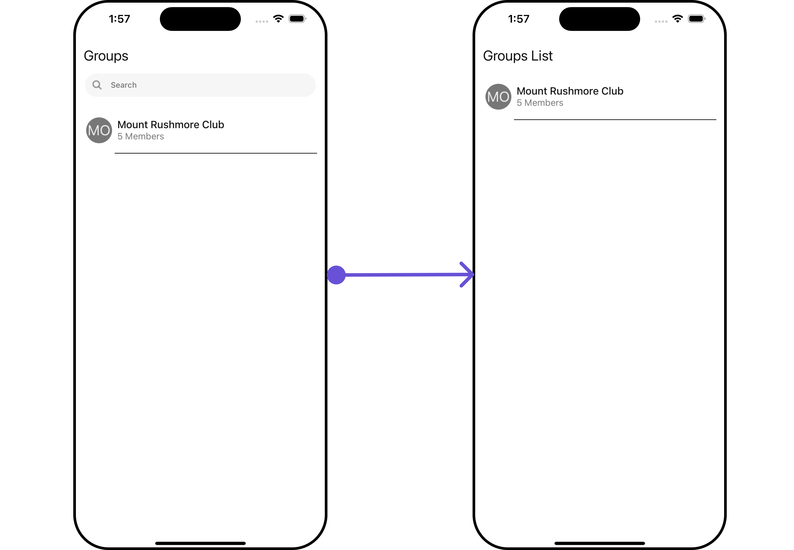

</TabItem>

<TabItem value="android" label="Android">

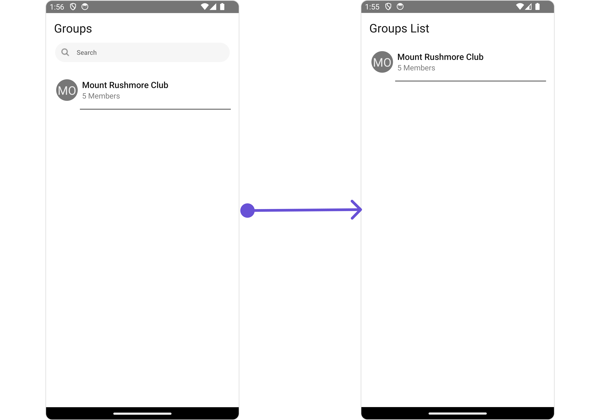

</TabItem>

</Tabs>

<Tabs>

<TabItem value="tsx" label="App.tsx">

```tsx
import { CometChat } from "@cometchat/chat-sdk-react-native";
import { CometChatGroups } from "@cometchat/chat-uikit-react-native";

function App(): React.JSX.Element {
  return <CometChatGroups title="Groups List" hideSearch={true} />;
}
```

</TabItem>
</Tabs>

Below is a list of customizations along with corresponding code snippets
| Property | Description | Code |
| -------------------------------------------------------------------------------------------------------- | ---------------------------------------------------------------------------------------------------------------------------------- | ----------------------------------------------------------- |
| **title** | Used to set title in the app bar | `title?: string` |
| **searchPlaceholderText** | Used to set search placeholder text | `searchPlaceHolderText?: string` |
| **errorStateText** <a data-tooltip-id="my-tooltip-html-prop"> <span class="material-icons red">report</span> </a>| Used to set a custom text response when some error occurs on fetching the list of groups | `errorStateText?: string` |
| **emptyStateText** <a data-tooltip-id="my-tooltip-html-prop"> <span class="material-icons red">report</span> </a> | Used to set a custom text response when fetching the groups has returned an empty list | `emptyStateText?: string` |
| **searchBoxIcon** | Used to set search Icon in the search field | `searchBoxIcon?: ImageType` |
| **privateGroupIcon** | Used to set the private group Icon | `privateGroupIcon?: ImageType` |
| **passwordGroupIcon** | Used to set the protected group Icon | `passwordGroupIcon?: ImageType` |
| **hideSearch** | Used to toggle visibility for search box | `hideSearch?: boolean` |
| **hideError** | Used to hide error on fetching groups | `hideError?: boolean` |
| **hideSeperator** | Used to hide the divider separating the group items | `hideSeperator?: boolean` |
| **selectionMode** | set the number of groups that can be selected, SelectionMode can be single, multiple or none. | `selectionMode? SelectionMode` |
| **hideSubmitIcon** | Used to hide the selection submit icon | `hideSubmitIcon?: boolean` |
| **backButtonIcon** | Used to set the back button icon | `backButtonIcon?: ImageType` |
| **showBackButton** | Used to hide or show the back button | `showBackButton?: boolean` |

---

### Advanced

For advanced-level customization, you can set custom views to the component. This lets you tailor each aspect of the component to fit your exact needs and application aesthetics. You can create and define your views, layouts, and UI elements and then incorporate those into the component.

---

#### ListItemView

With this property, you can assign a custom ListItem to the Groups Component.

<Tabs>

<TabItem value="App.tsx" label="App.tsx">

```tsx
import { CometChat } from "@cometchat/chat-sdk-react-native";
import { CometChatGroups } from "@cometchat/chat-uikit-react-native";

function App(): React.JSX.Element {
  const viewStyle: StyleProp<ViewStyle> = {
    flex: 1,
    flexDirection: "row",
    alignItems: "flex-start",
    padding: 10,
    borderColor: "black",
    borderWidth: 1,
    backgroundColor: "#E8EAE9",
    borderRadius: 10,
    margin: 2,
  };

  const getListItemView = (group: CometChat.Group) => {
    return (
      <View style={viewStyle}>
        <CometChatAvatar
          image={group.getIcon() ? { uri: group.getIcon() } : undefined}
          name={group.getName()}
        />

        <View>
          <Text style={{ color: "black", fontWeight: "bold" }}>
            {group.getName()}
          </Text>
          <Text style={{ color: "#667" }}>
            Members: {group.getMembersCount()}
          </Text>
        </View>
      </View>
    );
  };

  return <CometChatGroups ListItemView={getListItemView} />;
}
```

</TabItem>
</Tabs>

**Example**

<Tabs>

<TabItem value="iOS" label="iOS">

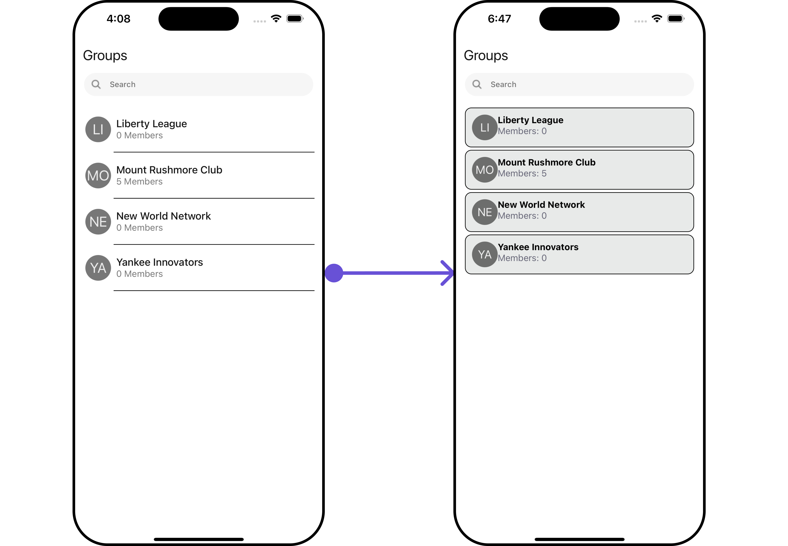

</TabItem>

<TabItem value="android" label="Android">

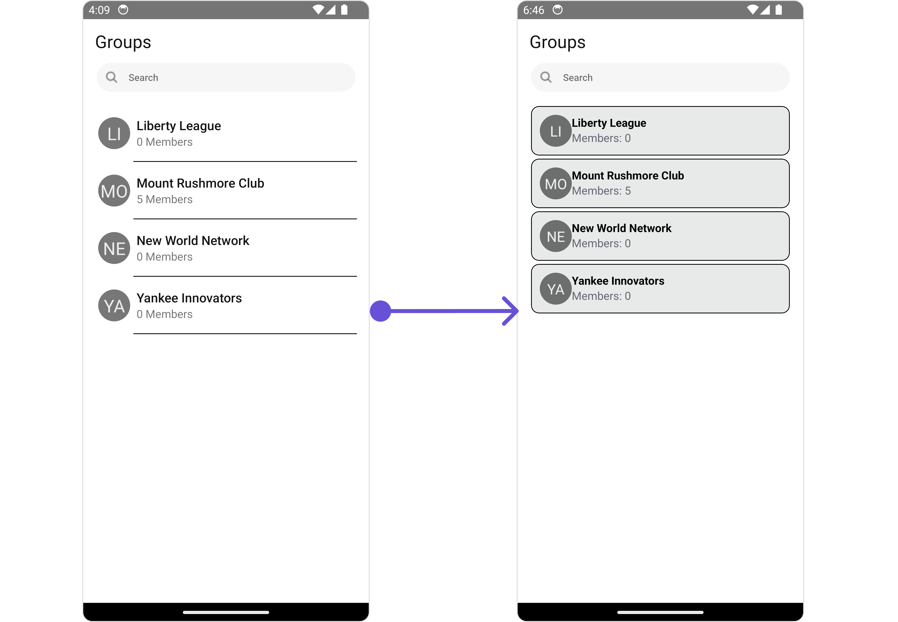

</TabItem>

</Tabs>

---

#### SubtitleView

You can customize the subtitle view for each group item to meet your requirements

<Tabs>

<TabItem value="tsx" label="App.tsx">

    ```tsx

import {CometChat} from '@cometchat/chat-sdk-react-native';
import { CometChatGroups } from '@cometchat/chat-uikit-react-native';

function App(): React.JSX.Element {

const getSubtitleView = (group: CometChat.Group) => {
return (
<Text
style={{
          fontSize: 12,
          color: theme.palette.getAccent800(),
        }}>
Members Count:
{group?.getMembersCount()}
</Text>
);
}

return (
<CometChatGroups
          SubtitleView={getSubtitleView}
      />
);
}

````
</TabItem>
</Tabs>

**Example**

<Tabs>

<TabItem value="iOS" label="iOS">

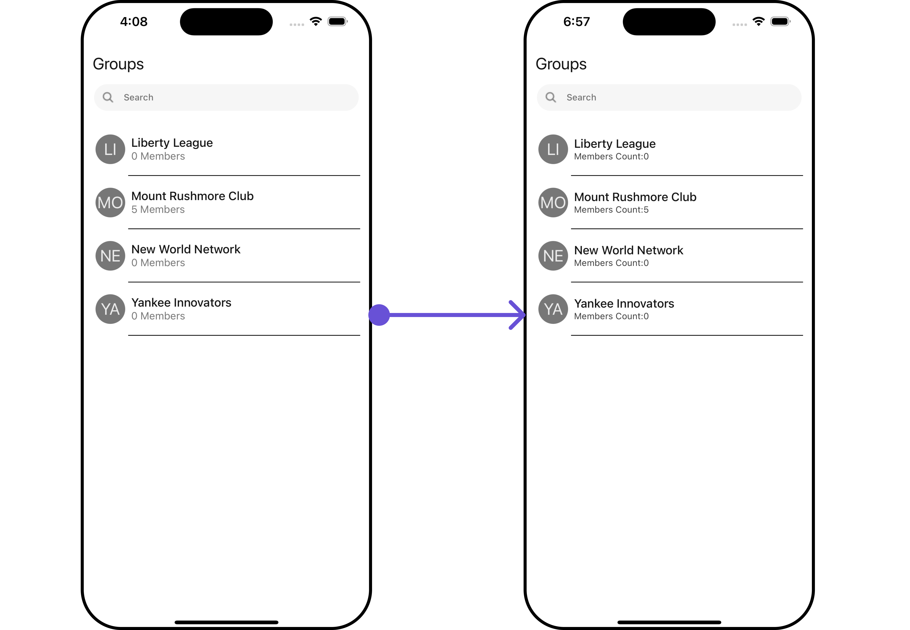

</TabItem>

<TabItem value="android" label="Android">

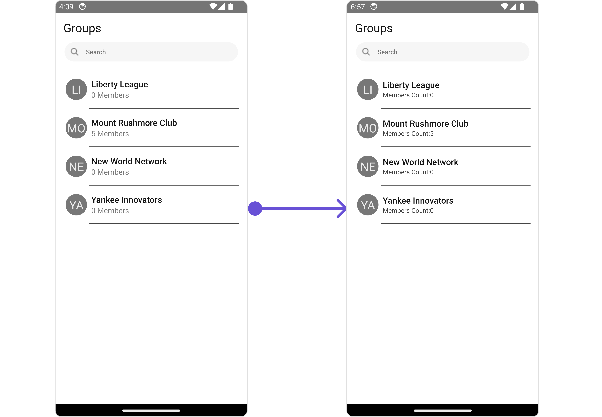

</TabItem>

</Tabs>

---

#### LoadingStateView

You can set a custom loader view using `LoadingStateView` to match the loading view of your app.

<Tabs>

<TabItem value="tsx" label="App.tsx">

```tsx
import { CometChat } from "@cometchat/chat-sdk-react-native";
import { CometChatGroups } from "@cometchat/chat-uikit-react-native";

function App(): React.JSX.Element {
  const loadingViewStyle: StyleProp<ViewStyle> = {
    flex: 1,
    alignItems: "center",
    justifyContent: "center",
    padding: 10,
    borderColor: "black",
    borderWidth: 1,
    backgroundColor: "#E8EAE9",
  };

  const getLoadingStateView = () => {
    return (
      <View style={loadingViewStyle}>
        <Text style={{ fontSize: 20, color: "black" }}>Loading...</Text>
      </View>
    );
  };

  return <CometChatGroups LoadingStateView={getLoadingStateView} />;
}
````

</TabItem>
</Tabs>

**Example**

<Tabs>

<TabItem value="iOS" label="iOS">

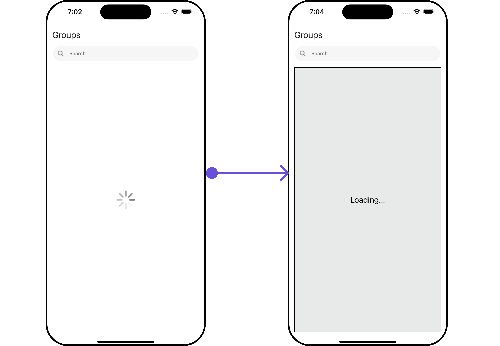

</TabItem>

<TabItem value="android" label="Android">

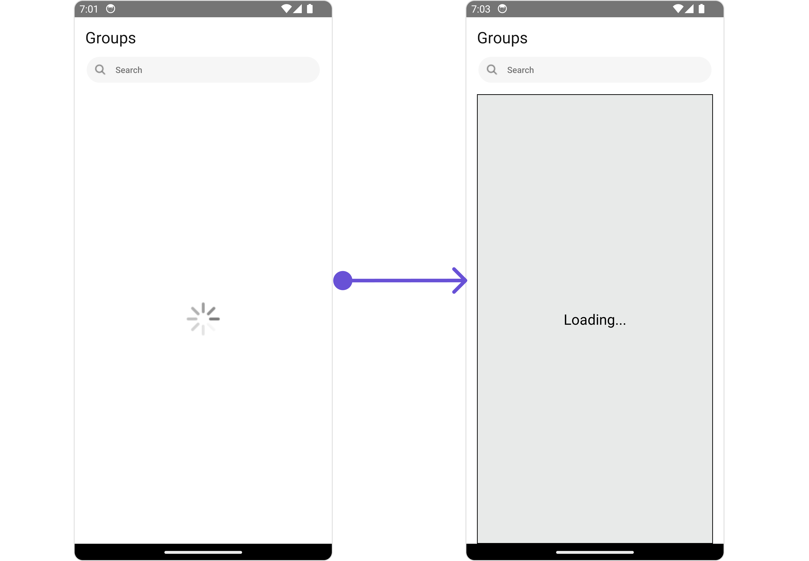

</TabItem>

</Tabs>

---

#### EmptyStateView

You can set a custom `EmptyStateView` using `EmptyStateView` prop to match the empty view of your app.

<Tabs>

<TabItem value="tsx" label="App.tsx">

    ```tsx

import {CometChat} from '@cometchat/chat-sdk-react-native';
import { CometChatGroups } from '@cometchat/chat-uikit-react-native';

function App(): React.JSX.Element {

const emptyViewStyle: StyleProp<ViewStyle> = {
flex: 1,
alignItems: 'center',
justifyContent: 'center',
padding: 10,
borderColor: 'black',
borderWidth: 1,
backgroundColor: '#E8EAE9',
};

const getEmptyStateView = () => {
return (
<View style={emptyViewStyle}>
<Text style={{fontSize: 80, color: "black"}}>Empty</Text>
</View>
);
};

//use a keyword that does not exist so that empty state view gets rendered
const searchRequestBuilder = new CometChat.GroupsRequestBuilder().setLimit(10).setSearchKeyword('does-not-exist');

return (
<CometChatGroups
          searchRequestBuilder={searchRequestBuilder}
          EmptyStateView={getEmptyStateView}
      />
);
}

````
</TabItem>
</Tabs>

**Example**

<Tabs>

<TabItem value="iOS" label="iOS">

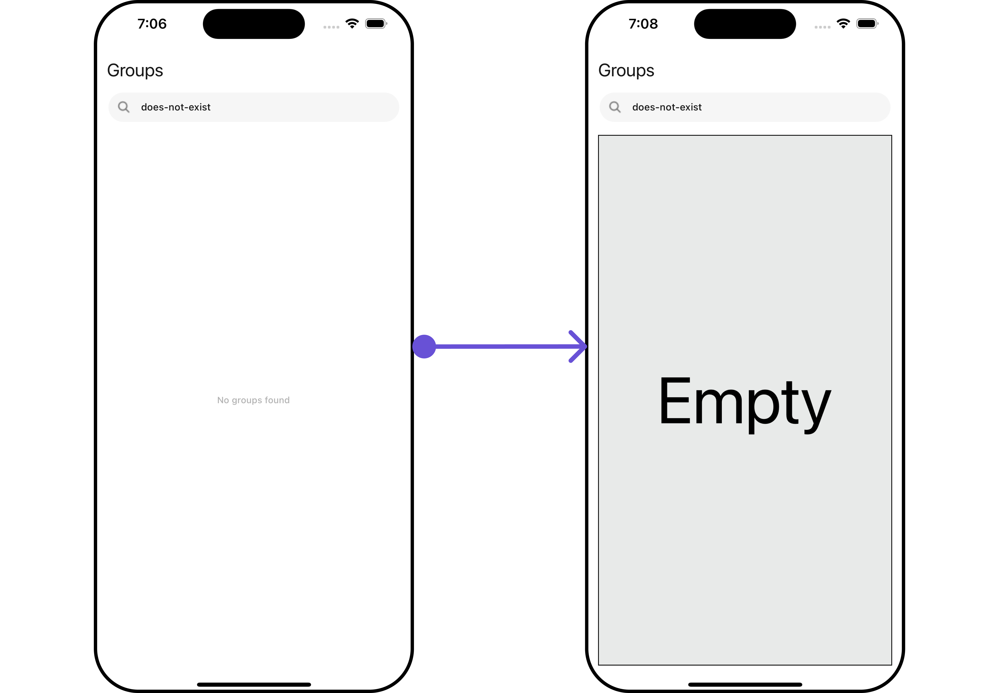

</TabItem>

<TabItem value="android" label="Android">

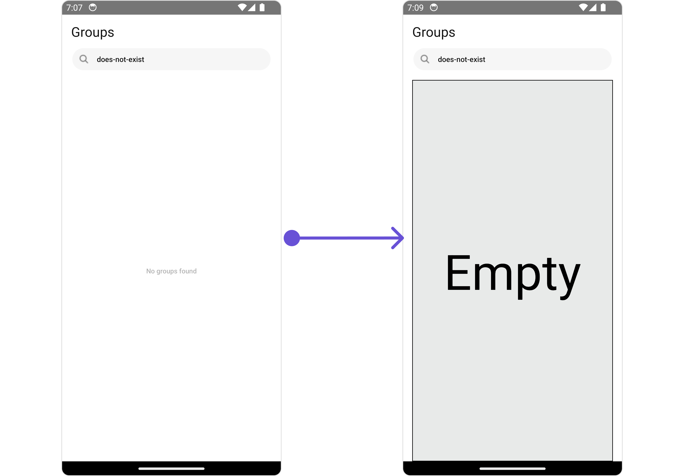

</TabItem>

</Tabs>

---

#### AppBarOptions

You can set Custom AppBarOptions to add more options to the Groups component.

<Tabs>

<TabItem value="tsx" label="App.tsx">

    ```tsx

import {CometChat} from '@cometchat/chat-sdk-react-native';
import { CometChatGroups } from '@cometchat/chat-uikit-react-native';
import Notification from './push-notification.png';

function App(): React.JSX.Element {

const styles = StyleSheet.create({
button: {
height: 20,
width: 20,
borderRadius: 0,
backgroundColor: 'transparent',
},
image: {
height: 20,
width: 20,
tintColor: '#7E57C2',
},
});

const getAppBarOptions = () => {
return (
<TouchableOpacity style={styles.button} onPress={() => {/_code_/}}>
<Image source={Notification} style={styles.image} />
</TouchableOpacity>
);
};

return (
<CometChatGroups
         AppBarOption={getAppBarOptions}
      />
);
}
````

</TabItem>
</Tabs>

**Example**

<Tabs>

<TabItem value="iOS" label="iOS">

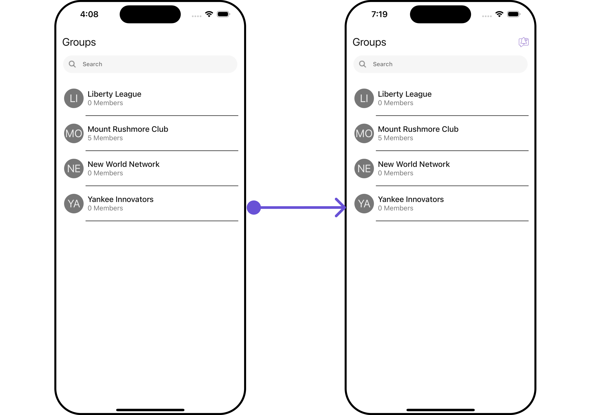

</TabItem>

<TabItem value="android" label="Android">


</TabItem>

</Tabs>

---

#### Swipe Options

You can set Custom Swipe options to the Groups component.

<Tabs>

<TabItem value="tsx" label="App.tsx">

    ```tsx

import {CometChat} from '@cometchat/chat-sdk-react-native';
import { CometChatGroups, CometChatOptions } from '@cometchat/chat-uikit-react-native';
import Call from './Call.png';

function App(): React.JSX.Element {

const getCustomOptions = (
user: CometChat.User,
) => {
const customOption: CometChatOptions = ({
id: "custom id",
title: "Call",
icon: Call,
iconTint: "#7316f5",
backgroundColor: "#93f5bf",
onPress: () => console.log("custom action"),
});

    return (
      <CometChatGroups
          options={getCustomOptions}
      />

);
}

```
</TabItem>
</Tabs>

**Example**

<Tabs>

<TabItem value="iOS" label="iOS">

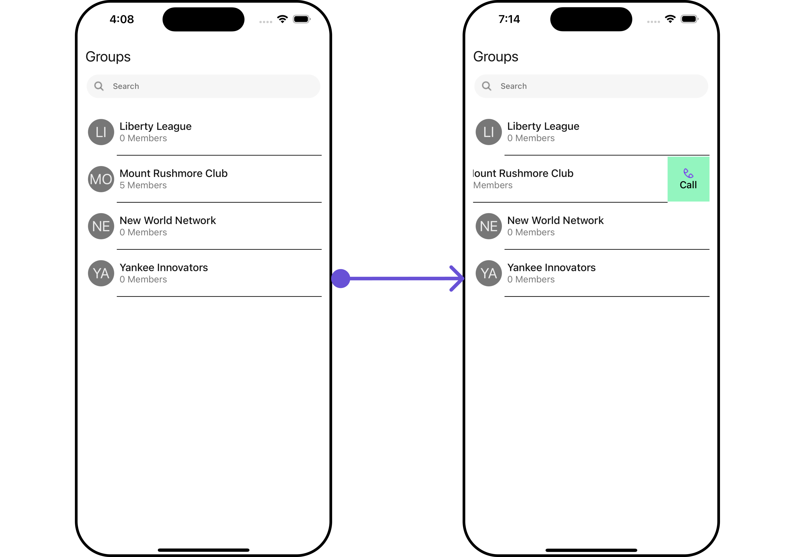

</TabItem>

<TabItem value="android" label="Android">

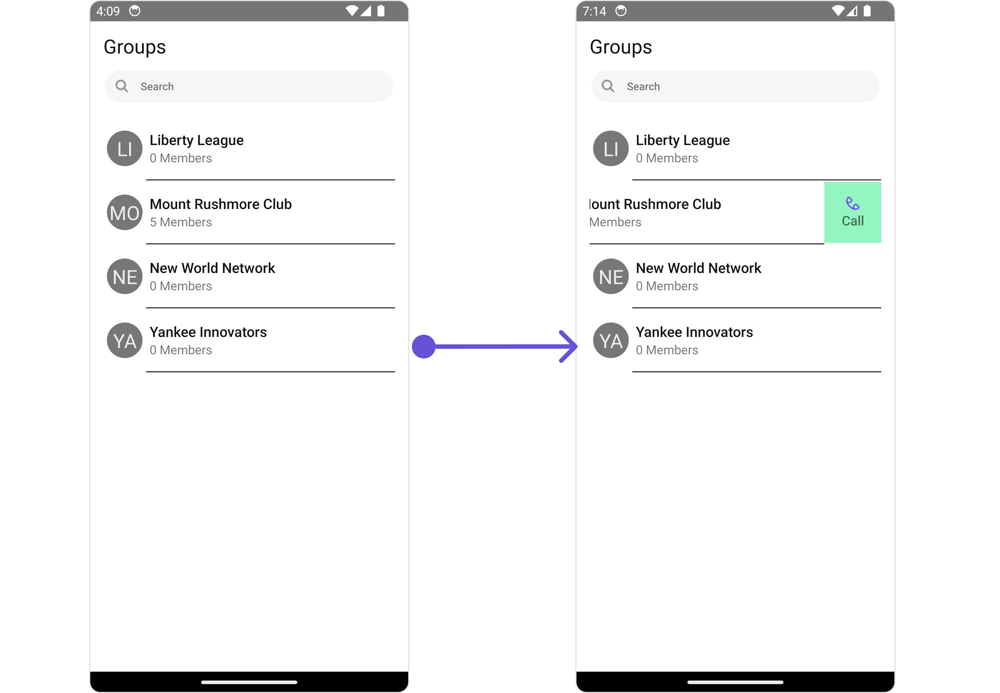

</TabItem>

</Tabs>

---

<Tooltip
  id="my-tooltip-html-prop"
  html="Not available in GroupsConfiguration"
/>
```
