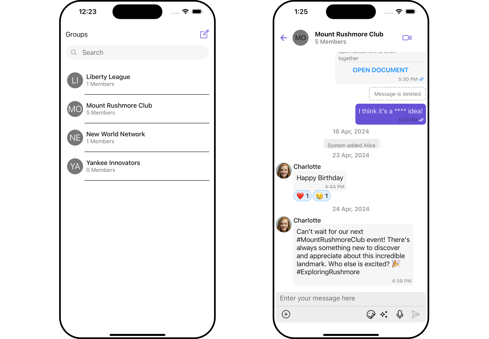
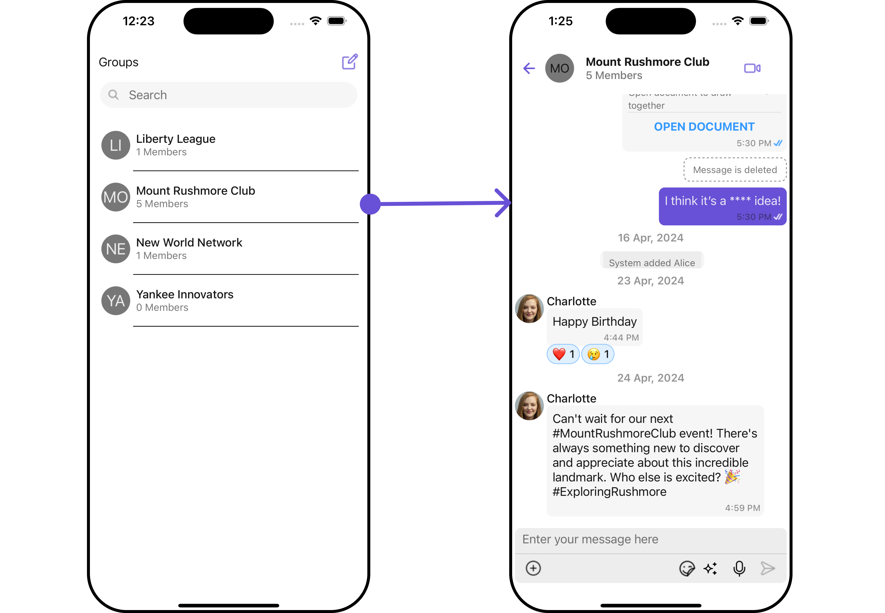
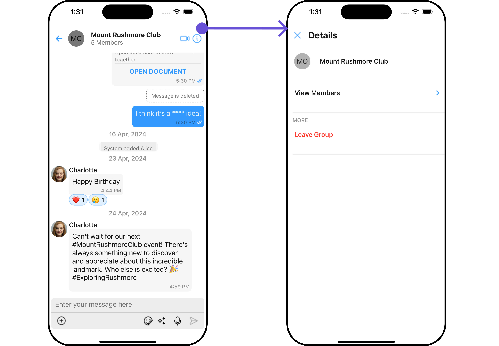
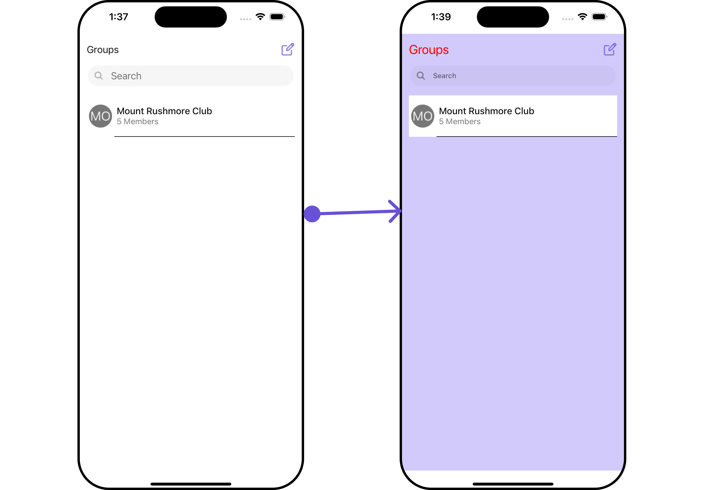
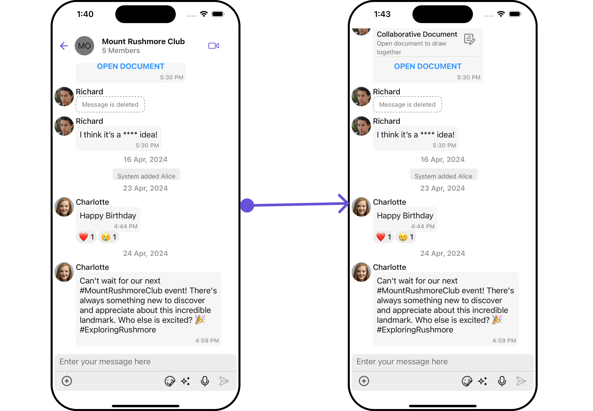
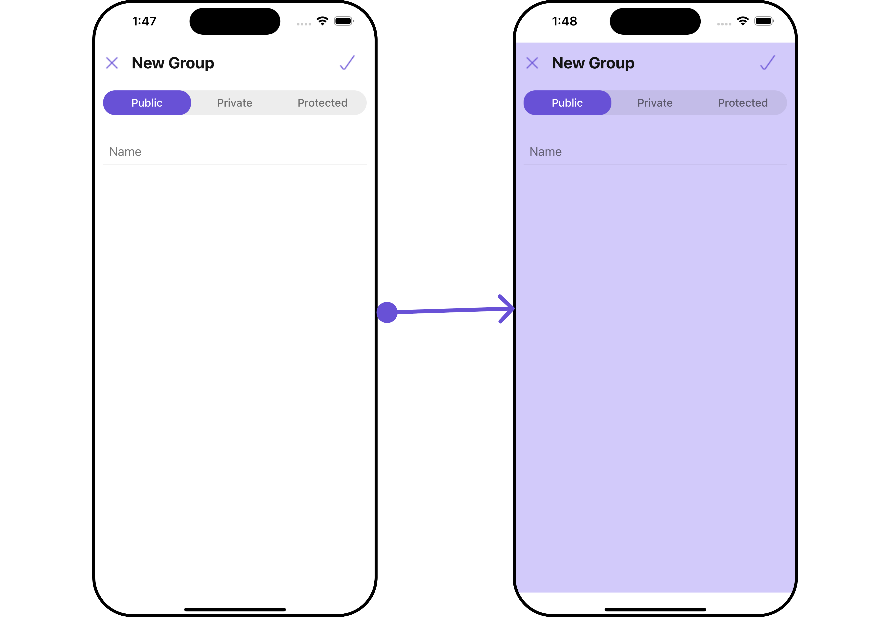

import Tabs from '@theme/Tabs';
import TabItem from '@theme/TabItem';

## Overview

The GroupsWithMessages is a [Composite Component](/ui-kit/react-native/components-overview#composite-components) encompassing components such as [Groups](./groups) and [Messages](./messages). Both of these component contributes to the functionality and structure of the overall GroupsWithMessages component.

<Tabs>

<TabItem value="iOS" label="iOS">



</TabItem>

<!-- <TabItem value="android" label="Android">


</TabItem> -->

</Tabs>
The GroupsWithMessages component is composed of the following BaseComponents:

| Components             | Description                                                                                                                     |
| ---------------------- | ------------------------------------------------------------------------------------------------------------------------------- |
| [Groups](./groups)     | The `Groups` component is designed to display a list of `Groups`. This essentially represents the recent conversation history.  |
| [Messages](./messages) | The `Messages` component is designed to manage the messaging interaction for either individual `User` or `Group` conversations. |

---

## Usage

### Integration

The following code snippet illustrates how you can directly incorporate the Groups component into your `App.tsx` file.

<Tabs>

<TabItem value="typescript" label="App.tsx">

```tsx
import { CometChat } from "@cometchat/chat-sdk-react-native";
import { CometChatGroupsWithMessages } from "@cometchat/chat-uikit-react-native";

function App(): React.JSX.Element {
  return <CometChatGroupsWithMessages />;
}
```

</TabItem>

</Tabs>

### Actions

[Actions](/ui-kit/react-native/components-overview#actions) dictate how a component functions. They are divided into two types: Predefined and User-defined. You can override either type, allowing you to tailor the behavior of the component to fit your specific needs.

##### 1. onError

This action doesn't change the behavior of the component but rather listens for any errors that occur in the User component.

<Tabs>

<TabItem value="App.tsx" label="App.tsx">

```tsx
import { CometChat } from "@cometchat/chat-sdk-react-native";
import { CometChatGroupsWithMessages } from "@cometchat/chat-uikit-react-native";

function App(): React.JSX.Element {
  const onErrorHandler = (error: CometChat.CometChatException) => {
    //code
  };

  return <CometChatGroupsWithMessages onError={onErrorHandler} />;
}
```

</TabItem>
</Tabs>

The child components - [Groups](./groups) and [Messages](./messages) - both have their own set of actions. The Actions of these components can be overridden through the use of the [Configurations](./groups-with-messages#configurations) object. Here is an example code snippet.

<Tabs>

<TabItem value="App.tsx" label="App.tsx">

```tsx
import { CometChat } from "@cometchat/chat-sdk-react-native";
import {
  CometChatGroupsWithMessages,
  GroupsConfigurationInterface,
  MessagesConfigurationInterface,
} from "@cometchat/chat-uikit-react-native";

function App(): React.JSX.Element {
  const groupsRequestBuilder = new CometChat.GroupsRequestBuilder()
    .setLimit(3)
    .joinedOnly(true);
  const groupsConfiguration: GroupsConfigurationInterface = {
    onItemLongPress(item) {
      //code
    },
    groupsRequestBuilder: groupsRequestBuilder,
    onItemPress(item) {
      //code
    },
  };

  const messagesConfiguration: MessagesConfigurationInterface = {
    hideMessageHeader: true,
    hideMessageComposer: true,
  };

  return (
    <CometChatGroupsWithMessages
      groupsConfiguration={groupsConfiguration}
      messagesConfigurations={messagesConfiguration}
    />
  );
}
```

</TabItem>
</Tabs>

The GroupsWithMessages component overrides several actions from its components to reach its default behavior. The list of actions overridden by GroupsWithMessages includes:

- [onItemPress](/ui-kit/react-native/groups/#2-onitempress) : By overriding the OnItemClick of the [Groups](./groups) Component, GroupsWithMessages achieves navigation from [Groups](./groups) to [Messages](./messages) component.

<Tabs>

<TabItem value="iOS" label="iOS">



</TabItem>

<!-- <TabItem value="android" label="Android">


</TabItem> -->

</Tabs>

### Filters

**Filters** allow you to customize the data displayed in a list within a Component. You can filter the list based on your specific criteria, allowing for a more customized. Filters can be applied using RequestBuilders of Chat SDK.

While the GroupsWithMessages component does not have filters, its components do, For more detail on individual filters of its component refer to [Groups Filters](./groups#filters) and [Messages Filters](./messages#filters).

By utilizing the [Configurations](./groups-with-messages#configurations) object of its components, you can apply filters.

In the following example, we are applying a filter to the Group List based on only joined groups and setting the limit to 3 using the groupsRequestBuilder.

<Tabs>

<TabItem value="App.tsx" label="App.tsx">

```tsx
import { CometChat } from "@cometchat/chat-sdk-react-native";
import {
  CometChatGroupsWithMessages,
  GroupsConfigurationInterface,
} from "@cometchat/chat-uikit-react-native";

function App(): React.JSX.Element {
  const groupsRequestBuilder = new CometChat.GroupsRequestBuilder()
    .setLimit(3)
    .joinedOnly(true);

  const groupsConfiguration: GroupsConfigurationInterface = {
    groupsRequestBuilder: groupsRequestBuilder,
  };

  return (
    <CometChatGroupsWithMessages groupsConfiguration={groupsConfiguration} />
  );
}
```

</TabItem>
</Tabs>

### Events

[Events](/ui-kit/react-native/components-overview#events) are emitted by a Component. By using event you can extend existing functionality. Being global events, they can be applied in Multiple Locations and are capable of being Added or Removed.

The GroupsWithMessages does not produce any events but its component does.

## Customization

To fit your app's design requirements, you can customize the appearance of the `GroupsWithMessages` component. We provide exposed methods that allow you to modify the experience and behavior according to your specific needs.

### Style

Using Style you can customize the look and feel of the component in your app, These parameters typically control elements such as the color, size, shape, and fonts used within the component.

GroupsWithMessages does not have a style property but you can customize its sub-component styles. For more details on individual component styles, you can refer [Groups Styles](./groups#style) and [Messages Styles](./messages#style).

Styles can be applied to SubComponents using their respective configurations.

<Tabs>

<TabItem value="App.tsx" label="App.tsx">

```tsx
import { CometChat } from "@cometchat/chat-sdk-react-native";
import {
  CometChatGroupsWithMessages,
  GroupsConfigurationInterface,
  MessagesConfigurationInterface,
  GroupsStyleInterface,
  MessageStyleInterface,
} from "@cometchat/chat-uikit-react-native";

function App(): React.JSX.Element {
  const groupsStyle: GroupsStyleInterface = {
    titleColor: "red",
    backgroundColor: "#d2cafa",
  };

  const groupsConfiguration: GroupsConfigurationInterface = {
    groupsStyle: groupsStyle,
  };

  const messageStyle: MessageStyleInterface = {
    backgroundColor: "#6851D6",
  };

  const messagesConfiguration: MessagesConfigurationInterface = {
    messagesStyle: messageStyle,
  };

  return (
    <CometChatGroupsWithMessages
      groupsConfiguration={groupsConfiguration}
      messagesConfiguration={messagesConfiguration}
    />
  );
}
```

</TabItem>
</Tabs>

---

### Functionality

These are a set of **small functional customizations** that allow you to fine-tune the overall experience of the component. With these, you can **change text**, set **custom icons**, and toggle the **visibility** of UI elements.

you can utilize the group method with a [Group](./groups) object as input to the GroupsWithMessages component. This will automatically direct you to the [Messages](./messages) component for the specified Group.

##### 1. Group

<Tabs>

<TabItem value="tsx" label="App.tsx">

```tsx
import { CometChat } from "@cometchat/chat-sdk-react-native";
import { CometChatGroups } from "@cometchat/chat-uikit-react-native";

function App(): React.JSX.Element {
  const [group, setGroup] = useState<CometChat.Group | undefined>(undefined);

  const getGroup = async () => {
    const group = await CometChat.getGroup("guid");
    setGroup(group);
  };

  useEffect(() => {
    //login
    getGroup();
  });

  return (
    <>
      {group && (
        <CometChatGroupsWithMessages
          group={group}
        ></CometChatGroupsWithMessages>
      )}
    </>
  );
}
```

</TabItem>
</Tabs>

---

##### Components

Nearly all functionality customizations available for a Component are also available for the composite component. Using [Configuration](#configurations), you can modify the properties of its components to suit your needs.

You can find the list of all Functionality customization of individual components in [Groups](/ui-kit/react-native/groups#functionality) and [Messages](/ui-kit/react-native/messages#functionality).

**Example**

<Tabs>

<TabItem value="App.tsx" label="App.tsx">

```tsx
import { CometChat } from "@cometchat/chat-sdk-react-native";
import {
  CometChatGroupsWithMessages,
  GroupsConfigurationInterface,
  MessagesConfigurationInterface,
} from "@cometchat/chat-uikit-react-native";

function App(): React.JSX.Element {
  const groupsRequestBuilder = new CometChat.GroupsRequestBuilder()
    .setLimit(10)
    .joinedOnly(true);

  const groupsConfiguration: GroupsConfigurationInterface = {
    groupsRequestBuilder: groupsRequestBuilder,
  };

  const messagesConfiguration: MessagesConfigurationInterface = {
    hideMessageHeader: true,
    hideMessageComposer: true,
  };

  return (
    <CometChatGroupsWithMessages
      groupsConfiguration={groupsConfiguration}
      messagesConfigurations={messagesConfiguration}
    />
  );
}
```

</TabItem>
</Tabs>

---

### Advanced

For advanced-level customization, you can set custom views to the component. This lets you tailor each aspect of the component to fit your exact needs and application aesthetics. You can create and define your own views, layouts, and UI elements and then incorporate those into the component.

By utilizing the [Configuration](#configurations) object of each component, you can apply advanced-level customizations to the GroupsWithMessages.

**Example**

<Tabs>

<TabItem value="App.tsx" label="App.tsx">

```tsx
import { CometChat } from "@cometchat/chat-sdk-react-native";
import {
  CometChatGroupsWithMessages,
  GroupsConfigurationInterface,
  MessagesConfigurationInterface,
} from "@cometchat/chat-uikit-react-native";

function App(): React.JSX.Element {
  const errorViewStyle: StyleProp<ViewStyle> = {
    flex: 1,
    alignItems: "center",
    justifyContent: "center",
    padding: 10,
    borderColor: "black",
    borderWidth: 1,
    backgroundColor: "#E8EAE9",
  };

  const getErrorStateView = () => {
    return (
      <View style={errorViewStyle}>
        <Text>Error</Text>
      </View>
    );
  };

  const groupsConfiguration: GroupsConfigurationInterface = {
    ErrorStateView: getErrorStateView,
  };

  return (
    <CometChatGroupsWithMessages groupsConfiguration={groupsConfiguration} />
  );
}
```

</TabItem>
</Tabs>

---

To find all the details on individual Component advance customization you can refer, [Groups Advance](/ui-kit/react-native/groups#advanced) and [Messages Advance](/ui-kit/react-native/messages#advanced).

GroupsWithMessages uses advanced-level customization of both Groups & Messages components to achieve its default behavior.

1. GroupsWithMessages utilizes the [onItemPress](/ui-kit/react-native/groups#2-onitempress) property of the `Groups` subcomponent to navigate the group from [Groups](/ui-kit/react-native/groups) to [Messages](/ui-kit/react-native/messages)

<Tabs>

<TabItem value="iOS" label="iOS">


</TabItem>

<!-- <TabItem value="android" label="Android">


</TabItem> -->

</Tabs>

2. GroupsWithMessages utilizes the [AppBarOptions](/ui-kit/react-native/messages#auxilaryappbaroptions) of the `Messages` subcomponent to navigate from [Messages](/ui-kit/react-native/messages) to [Details](./group-details)

<Tabs>

<TabItem value="iOS" label="iOS">



</TabItem>

<!-- <TabItem value="android" label="Android">


</TabItem> -->

</Tabs>

:::warning

When you override `onItemPress` and `AppBarOptions`, the default behavior of GroupsWithMessages will also be overridden.

:::

## Configurations

[Configurations](/ui-kit/react-native/components-overview#configurations) offer the ability to customize the properties of each component within a Composite Component.

GroupsWithMessages has `Groups` and `Messages` component. Hence, each of these components will have its individual `Configuration``.

- `Configurations` expose properties that are available in its individual components.

#### Groups

You can customize the properties of the Groups component by making use of the `groupsConfiguration`. You can accomplish this by employing the `groupsConfiguration` props as demonstrated below:

<Tabs>

<TabItem value="App.tsx" label="App.tsx">

```tsx
import { CometChat } from "@cometchat/chat-sdk-react-native";
import {
  CometChatGroupsWithMessages,
  GroupsConfigurationInterface,
} from "@cometchat/chat-uikit-react-native";

function App(): React.JSX.Element {
  const groupsConfiguration: GroupsConfigurationInterface = {
    //override properties
  };

  return (
    <CometChatGroupsWithMessages groupsConfiguration={groupsConfiguration} />
  );
}
```

</TabItem>
</Tabs>

All exposed properties of `GroupsConfiguration` can be found under [Groups](./groups#functionality). Properties marked with the <a data-tooltip-id="my-tooltip-html-prop"><span class="material-icons red">report</span></a> symbol are not accessible within the Configuration Object.

**Example**

Let's say you want to change the style of the Groups subcomponent and, in addition, you only want to display the Group List based on only joined groups and setting the limit to 3.

You can modify the style using the `groupsStyle` property and filter the list with the `groupsRequestBuilder` property.

<Tabs>

<TabItem value="iOS" label="iOS">



</TabItem>

<!-- <TabItem value="android" label="Android">


</TabItem> -->

</Tabs>

<Tabs>

<TabItem value="App.tsx" label="App.tsx">

```tsx
import { CometChat } from "@cometchat/chat-sdk-react-native";
import {
  CometChatGroupsWithMessages,
  GroupsConfigurationInterface,
  GroupsStyleInterface,
} from "@cometchat/chat-uikit-react-native";

function App(): React.JSX.Element {
  const groupsStyle: GroupsStyleInterface = {
    titleColor: "red",
    backgroundColor: "#d2cafa",
  };

  const groupsRequestBuilder = new CometChat.GroupsRequestBuilder()
    .setLimit(3)
    .joinedOnly(true);

  const groupsConfiguration: GroupsConfigurationInterface = {
    groupsRequestBuilder: groupsRequestBuilder,
    groupsStyle: groupsStyle,
  };

  return (
    <CometChatGroupsWithMessages groupsConfiguration={groupsConfiguration} />
  );
}
```

</TabItem>
</Tabs>

---

#### Messages

You can customize the properties of the Messages component by making use of the messagesConfiguration. You can accomplish this by employing the `messagesConfiguration` props as demonstrated below:

<Tabs>

<TabItem value="App.tsx" label="App.tsx">

```tsx
import { CometChat } from "@cometchat/chat-sdk-react-native";
import {
  CometChatGroupsWithMessages,
  MessagesConfigurationInterface,
} from "@cometchat/chat-uikit-react-native";

function App(): React.JSX.Element {
  const messagesConfiguration: MessagesConfigurationInterface = {
    //override properties
  };

  return (
    <CometChatGroupsWithMessages
      messagesConfigurations={messagesConfiguration}
    />
  );
}
```

</TabItem>
</Tabs>

All exposed properties of `MessagesConfiguration` can be found under [Messages](./messages#functionality). Properties marked with the <a data-tooltip-id="my-tooltip-html-prop"><span class="material-icons red">report</span></a> symbol are not accessible within the Configuration Object.

**Example**

Let's say you want to change the style of the Messages subcomponent and, in addition, you only want to hide message header.

You can modify the style using the `messagesStyle` property and hide the message header with the `hideMessageHeader` property.

<Tabs>

<TabItem value="iOS" label="iOS">



</TabItem>

<!-- <TabItem value="android" label="Android">


</TabItem> -->

</Tabs>

<Tabs>

<TabItem value="App.tsx" label="App.tsx">

```tsx
import { CometChat } from "@cometchat/chat-sdk-react-native";
import {
  CometChatGroupsWithMessages,
  MessageStyleInterface,
  MessagesConfigurationInterface,
} from "@cometchat/chat-uikit-react-native";

function App(): React.JSX.Element {
  const messageStyle: MessageStyleInterface = {
    //override style
  };

  const messagesConfiguration: MessagesConfigurationInterface = {
    hideMessageHeader: true,
    messagesStyle: messageStyle,
  };

  return (
    <CometChatGroupsWithMessages
      messagesConfigurations={messagesConfiguration}
    />
  );
}
```

</TabItem>
</Tabs>

---

#### Create Group

You can customize the properties of the Create Group component by making use of the CreateGroupConfiguration. You can accomplish this by employing the `createGroupConfiguration` props as demonstrated below:

<Tabs>

<TabItem value="App.tsx" label="App.tsx">

```tsx
import { CometChat } from "@cometchat/chat-sdk-react-native";
import {
  CometChatGroupsWithMessages,
  CreateGroupConfigurationInterface,
} from "@cometchat/chat-uikit-react-native";

function App(): React.JSX.Element {
  const createGroupConfiguration: CreateGroupConfigurationInterface = {
    //override properites
  };

  return (
    <CometChatGroupsWithMessages
      createGroupConfiguration={createGroupConfiguration}
    />
  );
}
```

</TabItem>
</Tabs>

All exposed properties of `CreateGroupConfiguration` can be found under [Create Group](./create-group#functionality). Properties marked with the <a data-tooltip-id="my-tooltip-html-prop"><span class="material-icons red">report</span></a> symbol are not accessible within the Configuration Object.

**Example**

Let's say you want to change the style of the Create Group subcomponent.

You can modify the style using the `createGroupStyle` property.

<Tabs>

<TabItem value="iOS" label="iOS">



</TabItem>

<!-- <TabItem value="android" label="Android">


</TabItem> -->

</Tabs>

<Tabs>

<TabItem value="App.tsx" label="App.tsx">

```tsx
import { CometChat } from "@cometchat/chat-sdk-react-native";
import {
  CometChatGroupsWithMessages,
  CreateGroupStyleInterface,
  CreateGroupConfigurationInterface,
} from "@cometchat/chat-uikit-react-native";

function App(): React.JSX.Element {
  const createGroupStyle: CreateGroupStyleInterface = {
    background: "#6851D6",
  };

  const createGroupConfiguration: CreateGroupConfigurationInterface = {
    createGroupStyle: createGroupStyle,
    onBack: () => {
      //code
    },
  };

  return (
    <CometChatGroupsWithMessages
      createGroupConfiguration={createGroupConfiguration}
    />
  );
}
```

</TabItem>
</Tabs>

---
