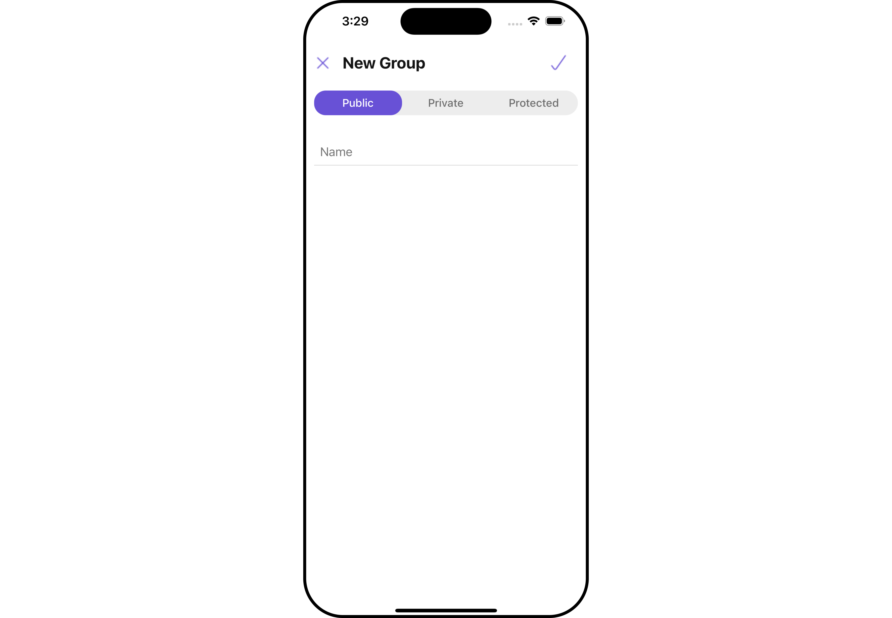
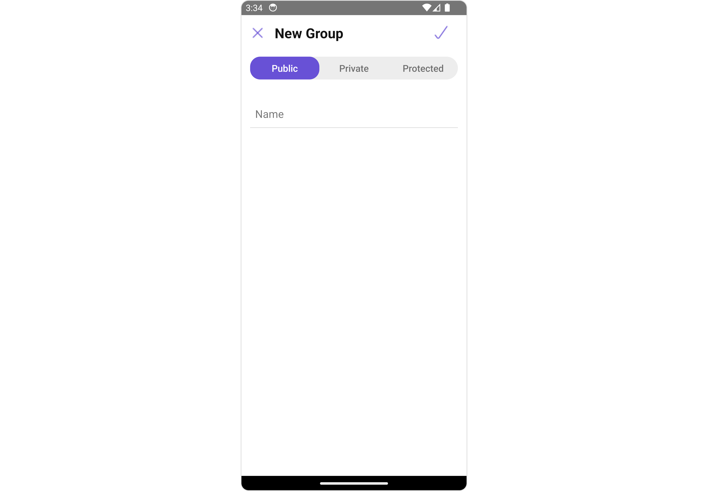
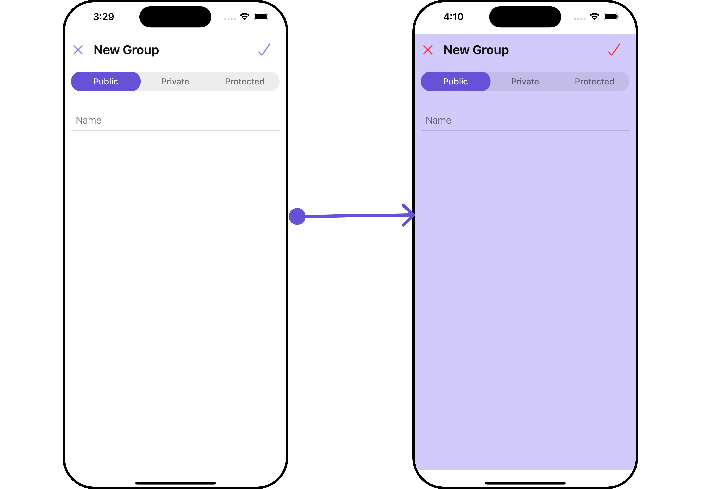
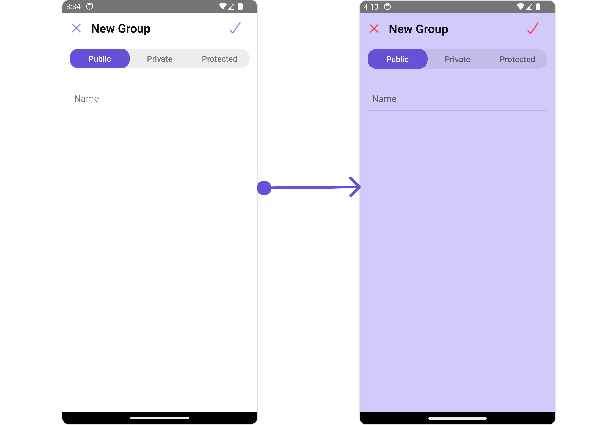
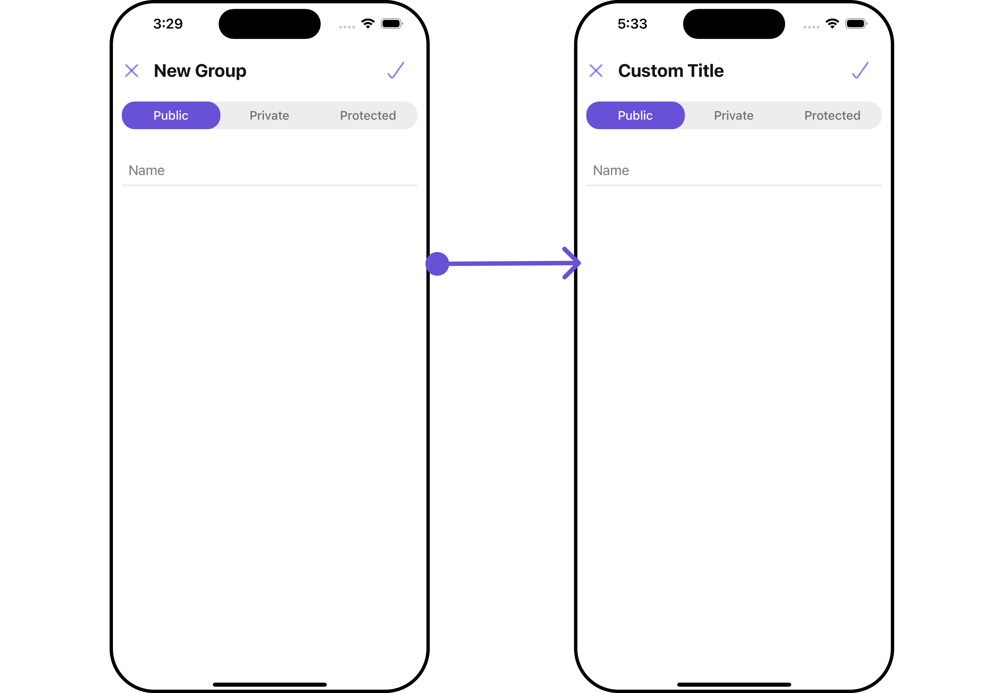
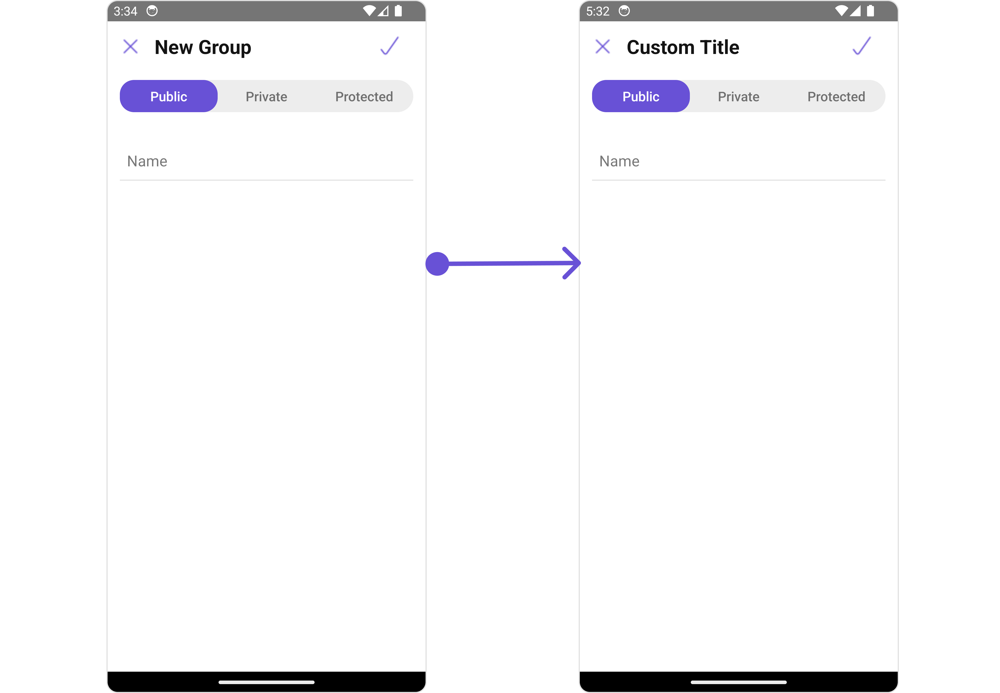

import Tabs from '@theme/Tabs';
import TabItem from '@theme/TabItem';

## Overview

`CometChatCreateGroup` is a [Component](/ui-kit/react-native/components-overview#components) enabling users to create various types of groups, including public, private, and password-protected ones. This functionality enables users to curate their group settings according to their preferences and needs.

<Tabs>

<TabItem value="iOS" label="iOS">



</TabItem>

<TabItem value="android" label="Android">



</TabItem>

</Tabs>

---

## Usage

### Integration

The following code snippet illustrates how you can directly incorporate the Create Groups component into your Application.

<Tabs>

<TabItem value="tsx`" label="App.tsx">

```tsx
import { CometChat } from "@cometchat/chat-sdk-react-native";
import { CometChatCreateGroup } from "@cometchat/chat-uikit-react-native";

function App(): React.JSX.Element {
  return <CometChatCreateGroup />;
}
```

</TabItem>
</Tabs>

---

### Actions

[Actions](/ui-kit/react-native/components-overview#actions) dictate how a component functions. They are divided into two types: Predefined and User-defined. You can override either type, allowing you to tailor the behavior of the component to fit your specific needs.

##### 1. onCreatePress

The `onCreatePress` action is activated when you click the create Group button. This returns the created groups.

You can override this action using the following code snippet.

<Tabs>

<TabItem value="tsx`" label="App.tsx">

```tsx
import { CometChat } from "@cometchat/chat-sdk-react-native";
import { CometChatCreateGroup } from "@cometchat/chat-uikit-react-native";

function App(): React.JSX.Element {
  const onCreatePressHandler = (
    groupName: string,
    groupType: string,
    password: string
  ) => {
    //code
  };

  return (
    <CometChatCreateGroup
      onCreatePress={onCreatePressHandler}
    ></CometChatCreateGroup>
  );
}
```

</TabItem>
</Tabs>

##### 2. onBack

The `onBack` event is typically triggered when the back/close button is clicked and it does not carry a default action.

With the following code snippet, you can effortlessly override this default operation.

<Tabs>

<TabItem value="App.tsx" label="App.tsx">

```tsx
import { CometChat } from "@cometchat/chat-sdk-react-native";
import { CometChatCreateGroup } from "@cometchat/chat-uikit-react-native";

function App(): React.JSX.Element {
  const onBackHandler = () => {
    //code
  };

  return <CometChatCreateGroup onBack={onBackHandler} />;
}
```

</TabItem>
</Tabs>

### Filters

**Filters** allow you to customize the data displayed in a list within a `Component`. You can filter the list based on your specific criteria, allowing for a more customized. Filters can be applied using `RequestBuilders` of Chat SDK.

The `CreateGroup` component does not have any exposed filters.

### Events

[Events](/ui-kit/react-native/components-overview#events) are emitted by a `Component`. By using event you can extend existing functionality. Being global events, they can be applied in Multiple Locations and are capable of being Added or Removed.

Events emitted by the Create Group component is as follows.

| Event              | Description                                         |
| ------------------ | --------------------------------------------------- |
| **ccGroupCreated** | Triggers when the user creates a group successfully |

<Tabs>
<TabItem value="js" label="Adding Listeners">

```js
import { CometChatUIEventHandler } from "@cometchat/chat-uikit-react-native";

CometChatUIEventHandler.addGroupListener("GROUP_LISTENER_ID", {
  ccGroupCreated: ({ group }) => {
    //code
  },
});
```

</TabItem>

</Tabs>

<!-- CometChatUIEventHandler.addGroupListener("GROUP_LISTENER_ID", {
        ccGroupLeft: ({ leftGroup }) => {
          //code
        }
    });

    CometChatUIEventHandler.addGroupListener("GROUP_LISTENER_ID", {
        ccGroupDeleted: ({ group }) => {
          //code
        },
    }); -->

---

<Tabs>
<TabItem value="js" label="Removing Listeners">

```js
import { CometChatUIEventHandler } from "@cometchat/chat-uikit-react-native";

CometChatUIEventHandler.removeGroupListener("GROUP_LISTENER_ID");
```

</TabItem>
</Tabs>

---

## Customization

To fit your app's design requirements, you can customize the appearance of the Create Groups component. We provide exposed methods that allow you to modify the experience and behavior according to your specific needs.

### Style

Using **Style** you can **customize** the look and feel of the component in your app, These parameters typically control elements such as the **color**, **size**, **shape**, and **fonts** used within the component.

##### 1. CreateGroup Style

You can set the `CreateGroupStyle` to the `Create Group` Component to customize the styling.

<Tabs>

<TabItem value="iOS" label="iOS">



</TabItem>

<TabItem value="android" label="Android">



</TabItem>

</Tabs>

<Tabs>

<TabItem value="App.tsx" label="App.tsx">

```tsx
import { CometChat } from "@cometchat/chat-sdk-react-native";
import { CometChatCreateGroup } from "@cometchat/chat-uikit-react-native";

function App(): React.JSX.Element {
  const createGroupStyle: CreateGroupStyleInterface = {
    background: "#d2cafa",
    createIconTint: "red",
    closeIconTint: "red",
  };

  return <CometChatCreateGroup createGroupStyle={createGroupStyle} />;
}
```

</TabItem>
</Tabs>

List of properties exposed by CreateGroupStyle

| Property                         | Description                                                          | Code                                                 |
| -------------------------------- | -------------------------------------------------------------------- | ---------------------------------------------------- |
| **border**                       | Used to set border                                                   | `border?: BorderStyleInterface,`                     |
| **borderRadius**                 | Used to set border radius                                            | `borderRadius?: number;`                             |
| **background**                   | Used to set background colour                                        | `background?: string;`                               |
| **height**                       | Used to set height                                                   | `height?: string` &#124; `number ;`                  |
| **width**                        | Used to set width                                                    | `width?: string` &#124; `number`                     |
| **tabColor**                     | Sets the color for group type tabs                                   | `tabColor?: string;`                                 |
| **selectedTabColor**             | Sets the color for selected group type tab                           | `selectedTabColor?: string;`                         |
| **createIconTint**               | Sets the create icon tint                                            | `createIconTint?: sring`                             |
| **closeIconTint**                | Sets the close icon tint                                             | `closeIconTint?: sring`                              |
| **titleTextStyle**               | Sets the font style for the title                                    | `titleTextStyle?: FontStyleInterface`                |
| **passwordInputTextStyle**       | Sets the font style for the password input field                     | `passwordInputTextStyle?: FontStyleInterface;`       |
| **nameInputTextStyle**           | Sets the font style for group name field                             | `nameInputTextStyle?: FontStyleInterface;`           |
| **passwordPlaceholderTextStyle** | Sets the font style for placeholder text in the password input field | `passwordPlaceholderTextStyle?: FontStyleInterface;` |
| **namePlaceholderTextStyle**     | Sets the font style for placeholder text in the name input field     | `namePlaceholderTextStyle?: FontStyleInterface;`     |
| **namePlaceholderTextStyle**     | Sets the font style for placeholder text in the name input field     | `namePlaceholderTextStyle?: FontStyleInterface;`     |
| **tabTextStyle**                 | Sets the font style for group type tabs                              | `tabTextStyle?: FontStyleInterface;`                 |
| **selectedTabTextStyle**         | Sets the font style for selected group type tab                      | `selectedTabTextStyle?: FontStyleInterface;`         |

---

### Functionality

These are a set of small functional customizations that allow you to fine-tune the overall experience of the component. With these, you can change text, set custom icons, and toggle the visibility of UI elements.

<Tabs>

<TabItem value="App.tsx" label="App.tsx">

```tsx
import { CometChat } from "@cometchat/chat-sdk-react-native";
import { CometChatCreateGroup } from "@cometchat/chat-uikit-react-native";

function App(): React.JSX.Element {
  return (
    <CometChatCreateGroup title="Custom Title" disableCloseButton={true} />
  );
}
```

</TabItem>
</Tabs>

<Tabs>

<TabItem value="iOS" label="iOS">



</TabItem>

<TabItem value="android" label="Android">



</TabItem>

</Tabs>

| Property                    | Description                              | Code                               |
| --------------------------- | ---------------------------------------- | ---------------------------------- |
| **title**                   | Custom title for the component           | `title?: string;`                  |
| **passwordPlaceholderText** | Custom text for the password placeholder | `passwordPlaceholderText?: string` |
| **namePlaceholderText**     | Custom text for the name placeholder     | `namePlaceholderText?: string`     |
| **disableCloseButton**      | Used to disable close button             | `disableCloseButton?: boolean`     |

---

### Advance

For advanced-level customization, you can set custom views to the component. This lets you tailor each aspect of the component to fit your exact needs and application aesthetics. You can create and define your views, layouts, and UI elements and then incorporate those into the component.

the `Create Group` component does not offer any advanced functionalities beyond this level of customization.

---
