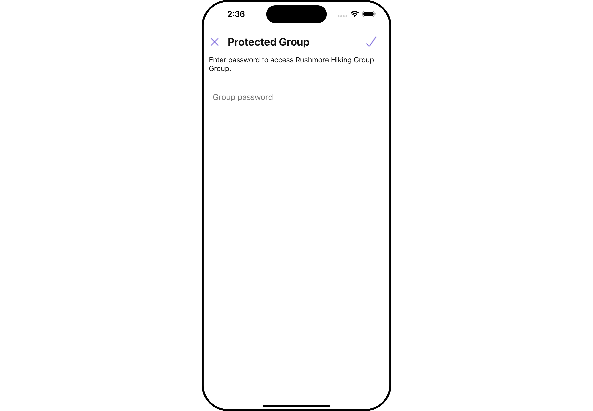
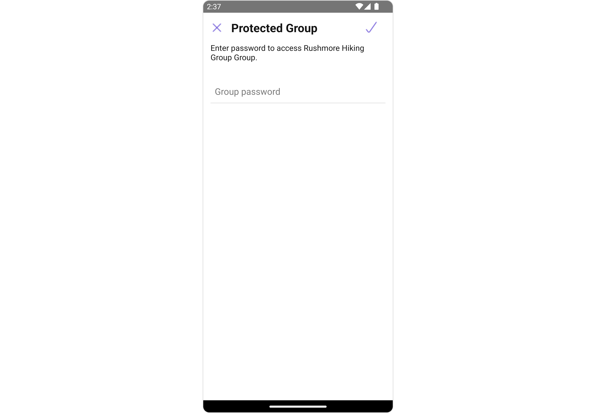
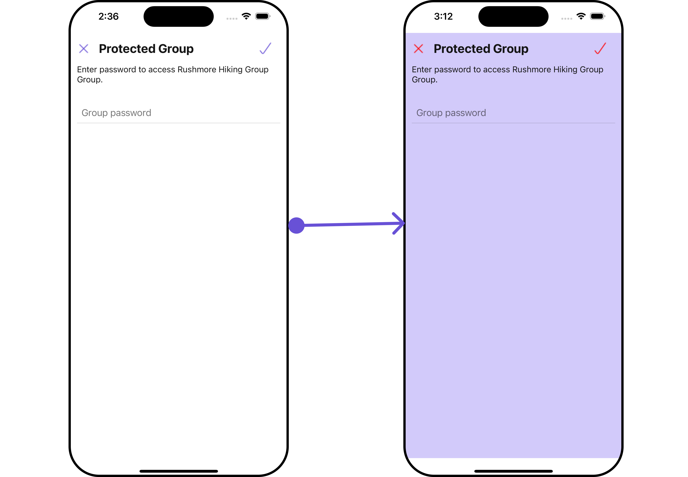
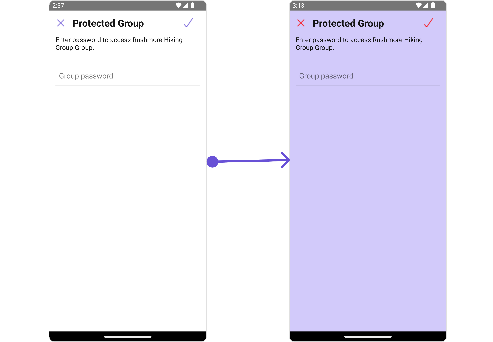
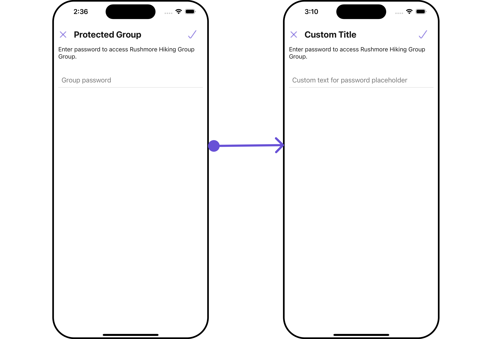
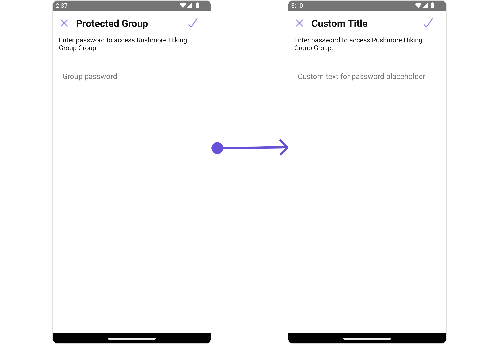

import Tabs from '@theme/Tabs';
import TabItem from '@theme/TabItem';

## Overview

`CometChatJoinGroup` is a [Component](/ui-kit/react-native/components-overview#components) used to set up a screen that shows the functionality to join a password protected group, featuring the functionality to join a password-protected group, where users can join a single password-protected group at a time.

<Tabs>

<TabItem value="iOS" label="iOS">



</TabItem>

<TabItem value="android" label="Android">



</TabItem>

</Tabs>

---

## Usage

### Integration

The following code snippet illustrates how you can directly incorporate the Join Group component into your Application.

<Tabs>

<TabItem value="App.tsx" label="App.tsx">

```tsx
import { CometChat } from "@cometchat/chat-sdk-react-native";
import { CometChatJoinProtectedGroup } from "@cometchat/chat-uikit-react-native";

function App(): React.JSX.Element {
  const [group, setGroup] = useState<CometChat.Group | undefined>(undefined);

  const getGroup = async () => {
    const group = await CometChat.getGroup("protected-group-id");
    setGroup(group);
  };

  useEffect(() => {
    //login
    getGroup();
  });

  return (
    <>
      {group && (
        <CometChatJoinProtectedGroup
          group={group}
        ></CometChatJoinProtectedGroup>
      )}
    </>
  );
}
```

</TabItem>
</Tabs>

---

### Actions

[Actions](/ui-kit/react-native/components-overview#actions) dictate how a component functions. They are divided into two types: Predefined and User-defined. You can override either type, allowing you to tailor the behavior of the component to fit your specific needs.

##### 1. onJoinClick

The `onJoinClick` action is activated when you click the join Group button. This returns the join groups.

You can override this action using the following code snippet.

<Tabs>

<TabItem value="App.tsx" label="App.tsx">

```tsx
import { CometChat } from "@cometchat/chat-sdk-react-native";
import { CometChatJoinProtectedGroup } from "@cometchat/chat-uikit-react-native";

function App(): React.JSX.Element {
  const [group, setGroup] = useState<CometChat.Group | undefined>(undefined);

  const getGroup = async () => {
    const group = await CometChat.getGroup("protected-group-id");
    setGroup(group);
  };

  useEffect(() => {
    //login
    getGroup();
  });

  const onJoinClickHandler = ({
    group,
    password,
  }: {
    group: CometChat.Group;
    password: string;
  }) => {
    //code
  };

  return (
    <>
      {group && (
        <CometChatJoinProtectedGroup
          group={group}
          onJoinClick={onJoinClickHandler}
        ></CometChatJoinProtectedGroup>
      )}
    </>
  );
}
```

</TabItem>
</Tabs>

### Filters

**Filters** allow you to customize the data displayed in a list within a `Component`. You can filter the list based on your specific criteria, allowing for a more customized. Filters can be applied using `RequestBuilders` of Chat SDK.

The `Join Group` component does not have any exposed filters.

### Events

[Events](/ui-kit/react-native/components-overview#events) are emitted by a `Component`. By using event you can extend existing functionality. Being global events, they can be applied in Multiple Locations and are capable of being Added or Removed.

Events emitted by the Join Group component is as follows.

| Event                   | Description                                                  |
| ----------------------- | ------------------------------------------------------------ |
| **ccGroupMemberJoined** | Triggers when the user joined a protected group successfully |

<Tabs>
<TabItem value="js" label="Adding Listeners">

```js
import { CometChatUIEventHandler } from "@cometchat/chat-uikit-react-native";

CometChatUIEventHandler.addGroupListener("GROUP_LISTENER_ID", {
  ccGroupMemberJoined: ({ joinedGroup }) => {
    //code
  },
});
```

</TabItem>

</Tabs>

---

<Tabs>
<TabItem value="js" label="Removing Listeners">

```js
import { CometChatUIEventHandler } from "@cometchat/chat-uikit-react-native";

CometChatUIEventHandler.removeGroupListener("GROUP_LISTENER_ID");
```

</TabItem>
</Tabs>

---

## Customization

To fit your app's design requirements, you can customize the appearance of the Join Groups component. We provide exposed methods that allow you to modify the experience and behavior according to your specific needs.

### Style

Using **Style** you can **customize** the look and feel of the component in your app, These parameters typically control elements such as the **color**, **size**, **shape**, and **fonts** used within the component.

##### 1. JoinGroup Style

You can set the `JoinGroupStyle` to the `Join Group` Component to customize the styling.

<Tabs>

<TabItem value="iOS" label="iOS">



</TabItem>

<TabItem value="android" label="Android">



</TabItem>

</Tabs>

<Tabs>

<TabItem value="App.tsx" label="App.tsx">

```tsx
import { CometChat } from "@cometchat/chat-sdk-react-native";
import {
  CometChatJoinProtectedGroup,
  JoinProtectedGroupStyleInterface,
} from "@cometchat/chat-uikit-react-native";

function App(): React.JSX.Element {
  const [group, setGroup] = useState<CometChat.Group | undefined>(undefined);

  const getGroup = async () => {
    const group = await CometChat.getGroup("protected-group-id");
    setGroup(group);
  };

  useEffect(() => {
    //login
    getGroup();
  });

  const joinProtectedGroupStyle: JoinProtectedGroupStyleInterface = {
    background: "#d2cafa",
    joinIconTint: "red",
    closeIconTint: "red",
  };

  return (
    <>
      {group && (
        <CometChatJoinProtectedGroup
          group={group}
          joinProtectedGroupStyle={joinProtectedGroupStyle}
        ></CometChatJoinProtectedGroup>
      )}
    </>
  );
}
```

</TabItem>
</Tabs>

List of properties exposed by JoinGroupsStyle

| Property                     | Description                                                   | Code                                            |
| ---------------------------- | ------------------------------------------------------------- | ----------------------------------------------- |
| **border**                   | Used to set border                                            | `border?: BorderStyleInterface,`                |
| **borderRadius**             | Used to set border radius                                     | `borderRadius?: number;`                        |
| **background**               | Used to set background colour                                 | `background?: string;`                          |
| **height**                   | Used to set height                                            | `height?: string` &#124; `number ;`             |
| **width**                    | Used to set width                                             | `width?: string` &#124; `number ;`              |
| **descriptionTextStyle**     | Used to the set font style for the description                | `descriptionTextStyle?: FontStyleInterface`     |
| **errorTextStyle**           | Used to the set font style for the error text                 | `errorTextStyle?: FontStyleInterface`           |
| **passwordInputTextStyle**   | Used to the set font style for the password input             | `passwordInputTextStyle?: FontStyleInterface`   |
| **passwordPlaceholderStyle** | Used to the set font style for the password input placeholder | `passwordPlaceholderStyle?: FontStyleInterface` |

---

### Functionality

These are a set of small functional customizations that allow you to fine-tune the overall experience of the component. With these, you can change text, set custom icons, and toggle the visibility of UI elements.

<Tabs>

<TabItem value="App.tsx" label="App.tsx">

```tsx
import { CometChat } from "@cometchat/chat-sdk-react-native";
import { CometChatJoinProtectedGroup } from "@cometchat/chat-uikit-react-native";

function App(): React.JSX.Element {
  return (
    <CometChatJoinProtectedGroup
      title="Custom Title"
      passwordPlaceholderText="Custom text for password placeholder"
    />
  );
}
```

</TabItem>
</Tabs>

<Tabs>

<TabItem value="iOS" label="iOS">



</TabItem>

<TabItem value="android" label="Android">



</TabItem>

</Tabs>

| Property                    | Description                                      | Code                                                                    |
| --------------------------- | ------------------------------------------------ | ----------------------------------------------------------------------- |
| **title**                   | Custom title for the component                   | `title='Your Custom Title'`                                             |
| **joinButtonText**          | Custom text for the join group button            | `joinButtonText='Your Custom Join Group Button Text'`                   |
| **passwordPlaceholderText** | Custom placeholder text for password input field | `passwordPlaceholderText='Your Custom Password Input Placeholder Text'` |
| **errorText**               | Custom error state text                          | `errorText='Your Custom Error Text'`                                    |
| **hasError**                | Whether the component has an error state         | `hasError={true}`                                                       |
| **group**                   | used to set the group                            | `group={groupObject}`                                                   |
| **description**             | Used to set Custom Description                   | `description='Custom Description'`                                      |

---

### Advance

For advanced-level customization, you can set custom views to the component. This lets you tailor each aspect of the component to fit your exact needs and application aesthetics. You can create and define your views, layouts, and UI elements and then incorporate those into the component.

The `Join Group` component does not offer any advanced functionalities beyond this level of customization.

---
