import Tabs from '@theme/Tabs';
import TabItem from '@theme/TabItem';

## Overview

`CometChatGroupMembers` is a [Component](/ui-kit/react-native/components-overview#components) that displays all users added or invited to a group, granting them access to group discussions, shared content, and collaborative features. Group members can communicate in real-time via messaging, voice and video calls, and other activities. They can interact, share files, and join calls based on group permissions set by the administrator or owner.

<Tabs>

<TabItem value="iOS" label="iOS">

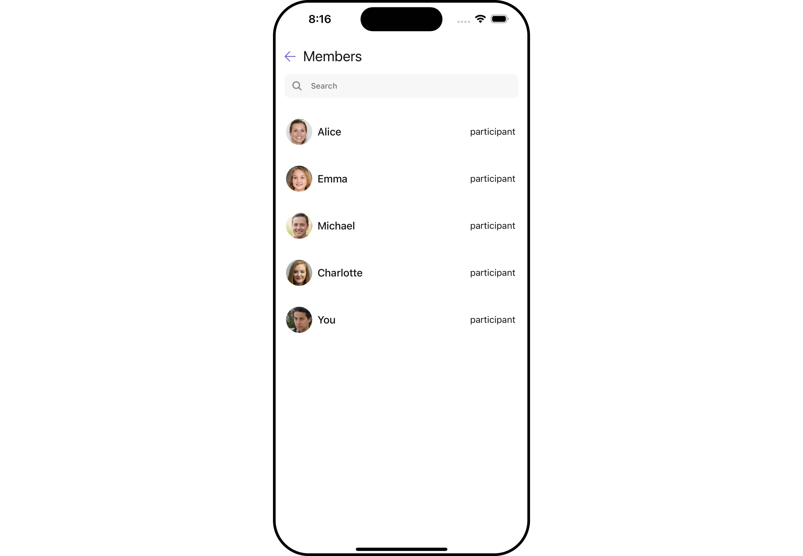

</TabItem>

<TabItem value="android" label="Android">

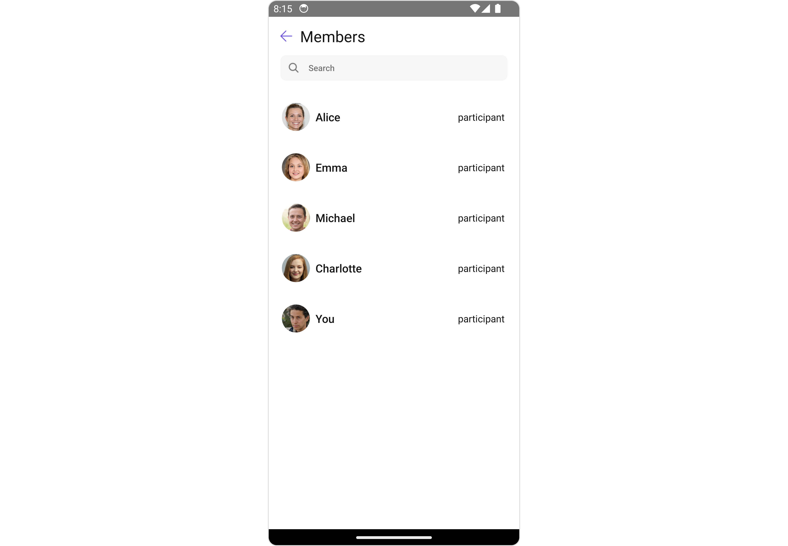

</TabItem>

</Tabs>

---

## Usage

### Integration

The following code snippet illustrates how you can directly incorporate the Group Members component into your Application.

<Tabs>

<TabItem value="App.tsx" label="App.tsx">

```tsx
import { CometChat } from "@cometchat/chat-sdk-react-native";
import { CometChatGroupsMembers } from "@cometchat/chat-uikit-react-native";

function App(): React.JSX.Element {
  const [group, setGroup] = useState<CometChat.Group | undefined>(undefined);

  const getGroup = async () => {
    const group = await CometChat.getGroup("guid");
    setGroup(group);
  };

  useEffect(() => {
    //login
    getGroup();
  });

  return (
    <>
      {group && <CometChatGroupsMembers group={group}></CometChatGroupsMembers>}
    </>
  );
}
```

</TabItem>
</Tabs>

---

### Actions

[Actions](/ui-kit/react-native/components-overview#actions) dictate how a component functions. They are divided into two types: Predefined and User-defined. You can override either type, allowing you to tailor the behavior of the component to fit your specific needs.

##### 1. onSelect

The `onSelect` action is activated when you select the done icon while in selection mode. This returns a list of all the group members that you have selected.

This action does not come with any predefined behavior. However, you have the flexibility to override this event and tailor it to suit your needs using the following code snippet.

<Tabs>

<TabItem value="App.tsx" label="App.tsx">

```tsx
import { CometChat } from "@cometchat/chat-sdk-react-native";
import { CometChatGroupsMembers } from "@cometchat/chat-uikit-react-native";

function App(): React.JSX.Element {
  const [group, setGroup] = useState<CometChat.Group | undefined>(undefined);

  const getGroup = async () => {
    const group = await CometChat.getGroup("guid");
    setGroup(group);
  };

  useEffect(() => {
    //login
    getGroup();
  });

  const onSelectionHandler = (list: CometChat.GroupMember[]) => {
    //code
  };

  return (
    <>
      {group && (
        <CometChatGroupsMembers
          group={group}
          selectionMode="multiple"
          onSelection={onSelectionHandler}
        ></CometChatGroupsMembers>
      )}
    </>
  );
}
```

</TabItem>
</Tabs>

##### 2. onItemPress

The `onItemPress` event is activated when you click on the Group Members List item. This action does not come with any predefined behavior. However, you have the flexibility to override this event and tailor it to suit your needs using the following code snippet.

<Tabs>

<TabItem value="App.tsx" label="App.tsx">

```tsx
import { CometChat } from "@cometchat/chat-sdk-react-native";
import { CometChatGroupsMembers } from "@cometchat/chat-uikit-react-native";

function App(): React.JSX.Element {
  const [group, setGroup] = useState<CometChat.Group | undefined>(undefined);

  const getGroup = async () => {
    const group = await CometChat.getGroup("guid");
    setGroup(group);
  };

  useEffect(() => {
    //login
    getGroup();
  });

  const onGroupMemberPressHandler = (groupMember: CometChat.GroupMember) => {
    //code
  };

  return (
    <>
      {group && (
        <CometChatGroupsMembers
          group={group}
          onItemPress={onGroupMemberPressHandler}
        ></CometChatGroupsMembers>
      )}
    </>
  );
}
```

</TabItem>
</Tabs>

##### 2. onItemLongPress

The `onItemLongPress` event is activated when you click on the Group Members List item. This action does not come with any predefined behavior. However, you have the flexibility to override this event and tailor it to suit your needs using the following code snippet.

<Tabs>

<TabItem value="App.tsx" label="App.tsx">

```tsx
import { CometChat } from "@cometchat/chat-sdk-react-native";
import { CometChatGroupsMembers } from "@cometchat/chat-uikit-react-native";

function App(): React.JSX.Element {
  const [group, setGroup] = useState<CometChat.Group | undefined>(undefined);

  const getGroup = async () => {
    const group = await CometChat.getGroup("guid");
    setGroup(group);
  };

  useEffect(() => {
    //login
    getGroup();
  });

  const onGroupMemberLongPressHandler = (
    groupMember: CometChat.GroupMember
  ) => {
    //code
  };

  return (
    <>
      {group && (
        <CometChatGroupsMembers
          group={group}
          onItemLongPress={onGroupMemberLongPressHandler}
        ></CometChatGroupsMembers>
      )}
    </>
  );
}
```

</TabItem>
</Tabs>

##### 3. OnBack

`OnBack` is triggered when you click on the back button of the Group Members component. You can override this action using the following code snippet.

<Tabs>

<TabItem value="App.tsx" label="App.tsx">

```tsx
import { CometChat } from "@cometchat/chat-sdk-react-native";
import { CometChatGroupsMembers } from "@cometchat/chat-uikit-react-native";

function App(): React.JSX.Element {
  const [group, setGroup] = useState<CometChat.Group | undefined>(undefined);

  const getGroup = async () => {
    const group = await CometChat.getGroup("guid");
    setGroup(group);
  };

  useEffect(() => {
    //login
    getGroup();
  });

  const onBackHandler = (groupMember: CometChat.GroupMember) => {
    //code
  };

  return (
    <>
      {group && (
        <CometChatGroupsMembers
          group={group}
          onBack={onBackHandler}
        ></CometChatGroupsMembers>
      )}
    </>
  );
}
```

</TabItem>
</Tabs>

##### 4. onError

This action doesn't change the behavior of the component but rather listens for any errors that occur in the Group Membets component.

<Tabs>

<TabItem value="App.tsx" label="App.tsx">

```tsx
import { CometChat } from "@cometchat/chat-sdk-react-native";
import { CometChatGroupsMembers } from "@cometchat/chat-uikit-react-native";

function App(): React.JSX.Element {
  const [group, setGroup] = useState<CometChat.Group | undefined>(undefined);

  const getGroup = async () => {
    const group = await CometChat.getGroup("guid");
    setGroup(group);
  };

  useEffect(() => {
    //login
    getGroup();
  });

  const onErrorHandler = (error: CometChat.CometChatException) => {
    //code
  };

  return (
    <>
      {group && (
        <CometChatGroupsMembers
          group={group}
          onError={onErrorHandler}
        ></CometChatGroupsMembers>
      )}
    </>
  );
}
```

</TabItem>
</Tabs>

---

### Filters

**Filters** allow you to customize the data displayed in a list within a Component. You can filter the list based on your specific criteria, allowing for a more customized. Filters can be applied using RequestBuilders of Chat SDK.

##### 1. GroupMembersRequestBuilder

The [GroupMembersRequestBuilder](/sdk/react-native/retrieve-group-members) enables you to filter and customize the group members list based on available parameters in GroupMembersRequestBuilder. This feature allows you to create more specific and targeted queries when fetching groups. The following are the parameters available in [GroupMembersRequestBuilder](/sdk/react-native/retrieve-group-members)

| Methods              | Type                | Description                                                                                       |
| -------------------- | ------------------- | ------------------------------------------------------------------------------------------------- |
| **setLimit**         | number              | sets the number of group members that can be fetched in a single request, suitable for pagination |
| **setSearchKeyword** | string              | used for fetching group members matching the passed string                                        |
| **setScopes**        | Array&lt;string&gt; | used for fetching group members based on multiple scopes                                          |

**Example**

In the example below, we are applying a filter to the Group Members by setting the limit to two and setting the scope to show only admin and moderator.

<Tabs>

<TabItem value="App.tsx" label="App.tsx">

```tsx
import { CometChat } from "@cometchat/chat-sdk-react-native";
import { CometChatGroupsMembers } from "@cometchat/chat-uikit-react-native";

function App(): React.JSX.Element {
  const [group, setGroup] = useState<CometChat.Group | undefined>(undefined);
  let groupMemberRequestBuilder;

  const getGroup = async () => {
    const group = await CometChat.getGroup("mrc-uid");
    groupMemberRequestBuilder = new CometChat.GroupMembersRequestBuilder(
      group.getGuid()
    ).setScopes(["admin"]);
    setGroup(group);
  };

  useEffect(() => {
    //login
    getGroup();
  });

  const onErrorHandler = (error: CometChat.CometChatException) => {
    //code
  };

  return (
    <>
      {group && (
        <CometChatGroupsMembers
          group={group}
          groupMemberRequestBuilder={groupMemberRequestBuilder}
        ></CometChatGroupsMembers>
      )}
    </>
  );
}
```

</TabItem>
</Tabs>

##### 2. SearchRequestBuilder

The SearchRequestBuilder uses [GroupMembersRequestBuilder](/sdk/react-native/retrieve-group-members) enables you to filter and customize the search list based on available parameters in GroupMembersRequestBuilder.
This feature allows you to keep uniformity between the displayed Group Members List and searched Group Members List.

**Example**

<Tabs>

<TabItem value="App.tsx" label="App.tsx">

```tsx
import { CometChat } from "@cometchat/chat-sdk-react-native";
import { CometChatGroupsMembers } from "@cometchat/chat-uikit-react-native";

function App(): React.JSX.Element {
  const [group, setGroup] = useState<CometChat.Group | undefined>(undefined);
  let searchRequestBuilder;

  const getGroup = async () => {
    const group = await CometChat.getGroup("mrc-uid");
    searchRequestBuilder = new CometChat.GroupMembersRequestBuilder(
      group.getGuid()
    )
      .setScopes(["admin"])
      .setSearchKeyword("some-search-keyword");
    setGroup(group);
  };

  useEffect(() => {
    //login
    getGroup();
  });

  return (
    <>
      {group && (
        <CometChatGroupsMembers
          group={group}
          groupMemberRequestBuilder={searchRequestBuilder}
        ></CometChatGroupsMembers>
      )}
    </>
  );
}
```

</TabItem>
</Tabs>

---

### Events

[Events](/ui-kit/react-native/components-overview#events) are emitted by a `Component`. By using event you can extend existing functionality. Being global events, they can be applied in Multiple Locations and are capable of being Added or Removed.

Events emitted by the Group Members component is as follows.

| Event                         | Description                                                       |
| ----------------------------- | ----------------------------------------------------------------- |
| **ccGroupMemberBanned**       | Triggers when the group member banned from the group successfully |
| **ccGroupMemberKicked**       | Triggers when the group member kicked from the group successfully |
| **ccGroupMemberScopeChanged** | Triggers when the group member scope is changed in the group      |

<Tabs>
<TabItem value="js" label="Adding Listeners">

```js
import { CometChatUIEventHandler } from "@cometchat/chat-uikit-react-native";

CometChatUIEventHandler.addGroupListener("GROUP_LISTENER_ID", {
  ccGroupMemberBanned: ({
    message,
    kickedUser,
    kickedBy,
    kickedFrom,
  }: {
    message: CometChat.BaseMessage,
    kickedUser: CometChat.User,
    kickedBy: CometChat.User,
    kickedFrom: CometChat.Group,
  }) => {
    //code
  },
  ccGroupMemberKicked: ({
    message,
    kickedFrom,
  }: {
    message: CometChat.BaseMessage,
    kickedFrom: CometChat.Group,
  }) => {
    //code
  },
  ccGroupMemberScopeChanged: ({
    action,
    updatedUser,
    scopeChangedTo,
    scopeChangedFrom,
    group,
  }) => {
    //code
  },
});
```

</TabItem>

</Tabs>

---

<Tabs>
<TabItem value="js" label="Removing Listeners">

```js
import { CometChatUIEventHandler } from "@cometchat/chat-uikit-react-native";

CometChatUIEventHandler.removeGroupListener("GROUP_LISTENER_ID");
```

</TabItem>
</Tabs>

---

## Customization

To fit your app's design requirements, you can customize the appearance of the Group Members component. We provide exposed methods that allow you to modify the experience and behavior according to your specific needs.

### Style

Using **Style** you can **customize** the look and feel of the component in your app, These parameters typically control elements such as the **color**, **size**, **shape**, and **fonts** used within the component.

##### 1. GroupMembers Style

You can set the `GroupMembersStyle` to the Group Members Component to customize the styling.

<Tabs>

<TabItem value="iOS" label="iOS">

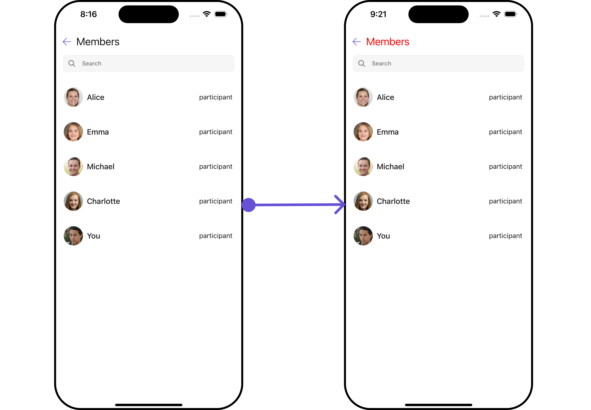

</TabItem>

<TabItem value="android" label="Android">

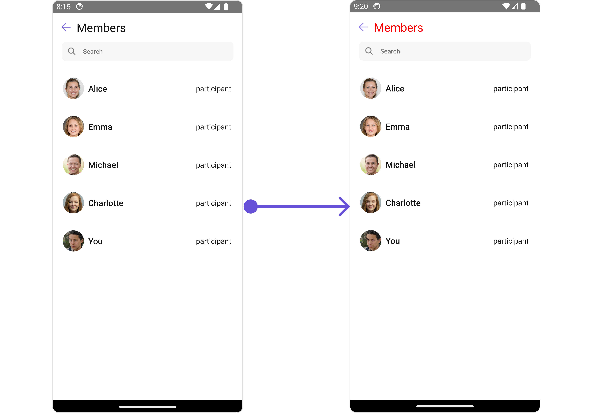

</TabItem>

</Tabs>

<Tabs>

<TabItem value="App.tsx" label="App.tsx">

```tsx
import { CometChat } from "@cometchat/chat-sdk-react-native";
import {
  CometChatGroupsMembers,
  GroupMembersStyleInterface,
} from "@cometchat/chat-uikit-react-native";

function App(): React.JSX.Element {
  const [group, setGroup] = useState<CometChat.Group | undefined>(undefined);

  const getGroup = async () => {
    const group = await CometChat.getGroup("mrc-uid");
    setGroup(group);
  };

  useEffect(() => {
    //login
    getGroup();
  });

  const groupMemberStyle: GroupMembersStyleInterface = {
    titleColor: "red",
  };

  return (
    <>
      {group && (
        <CometChatGroupsMembers
          group={group}
          groupMemberStyle={groupMemberStyle}
        ></CometChatGroupsMembers>
      )}
    </>
  );
}
```

</TabItem>
</Tabs>

List of properties exposed by GroupMembersStyle:

| Property               | Description                        | Code                                   |
| ---------------------- | ---------------------------------- | -------------------------------------- |
| **border**             | Used to set border                 | `border?: BorderStyleInterface,`       |
| **borderRadius**       | Used to set border radius          | `borderRadius?: number;`               |
| **backgroundColor**    | Used to set background colour      | `backgroundColor?: string;`            |
| **height**             | Used to set height                 | `height?: string` &#124; `number ;`    |
| **width**              | Used to set width                  | `width?: string` &#124; `number ;`     |
| **titleFont**          | Used to set title text font        | `titleFont?: FontStyleInterface,`      |
| **titleColor**         | Used to set title text color       | `titleColor?: string;`                 |
| **backIconTint**       | Used to set back button icon tint  | `backIconTint?: string;`               |
| **searchBorder**       | Used to set search border          | `searchBorder?: BorderStyleInterface;` |
| **searchBorderRadius** | Used to set search border radius   | `searchBorderRadius?: number;`         |
| **searchTextFont**     | Used to set search text font       | `searchTextFont?: FontStyleInterface;` |
| **searchTextColor**    | Used to set search text color      | `searchTextColor?: string;`            |
| **searchIconTint**     | Used to set search icon tint       | `searchIconTint?: string;`             |
| **onlineStatusColor**  | Used to set online status color    | `onlineStatusColor?: string;`          |
| **separatorColor**     | Used to set separator color        | `separatorColor?: string;`             |
| **loadingIconTint**    | Used to set loading icon tint      | `loadingIconTint?: string;`            |
| **emptyTextFont**      | Used to set empty state text font  | `emptyTextFont?: FontStyleInterface;`  |
| **emptyTextColor**     | Used to set empty state text color | `emptyTextColor?: string;`             |
| **errorTextFont**      | Used to set error state text font  | `errorTextFont?: FontStyleInterface;`  |
| **errorTextColor**     | Used to set error state text color | `errorTextColor?: string;`             |

##### 2. GroupScope Style

You can set the `GroupScope` to the Group Members Component to customize the styling.

<Tabs>

<TabItem value="iOS" label="iOS">

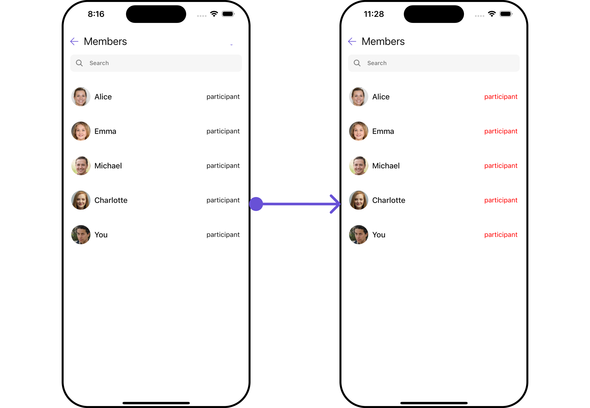

</TabItem>

<TabItem value="android" label="Android">

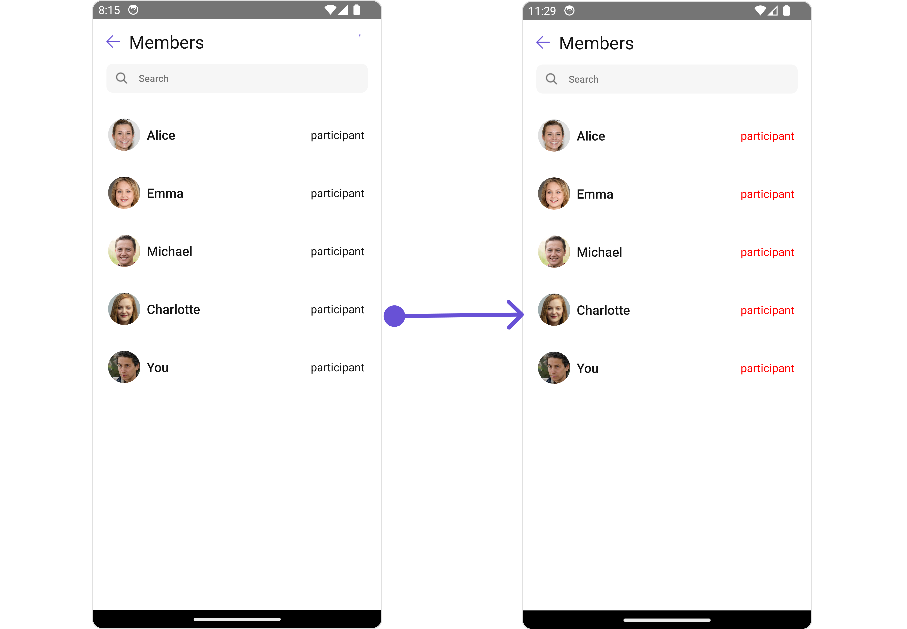

</TabItem>

</Tabs>

<Tabs>

<TabItem value="App.tsx" label="App.tsx">

```tsx
import { CometChat } from "@cometchat/chat-sdk-react-native";
import {
  CometChatGroupsMembers,
  GroupScopeStyleInterface,
} from "@cometchat/chat-uikit-react-native";

function App(): React.JSX.Element {
  const [group, setGroup] = useState<CometChat.Group | undefined>(undefined);

  const getGroup = async () => {
    const group = await CometChat.getGroup("mrc-uid");
    setGroup(group);
  };

  useEffect(() => {
    //login
    getGroup();
  });

  const groupScopeStyle: GroupScopeStyleInterface = {
    optionTextColor: "red",
  };

  return (
    <>
      {group && (
        <CometChatGroupsMembers
          group={group}
          groupScopeStyle={groupScopeStyle}
        ></CometChatGroupsMembers>
      )}
    </>
  );
}
```

</TabItem>
</Tabs>

List of properties exposed by ChangeScopeStyle:

| Property                          | Description                                  | Code                                           |
| --------------------------------- | -------------------------------------------- | ---------------------------------------------- |
| **border**                        | Used to set border                           | `border?: BorderStyleInterface,`               |
| **borderRadius**                  | Used to set border radius                    | `borderRadius?: number;`                       |
| **backgroundColor**               | Used to set background colour                | `backgroundColor?: string;`                    |
| **height**                        | Used to set height                           | `height?: string` &#124; `number ;`            |
| **width**                         | Used to set width                            | `width?: string` &#124; `number ;`             |
| **optionTextFont**                | Used to set option text font                 | `optionTextFont?: FontStyleInterface`          |
| **optionTextColor**               | Used to set option text color                | `optionTextColor?: string;`                    |
| **optionBackgroundColor**         | Used to set option background color          | `optionBackgroundColor?: string;`              |
| **optionBorder**                  | Used to set option border                    | `optionBorder?: BorderStyleInterface;`         |
| **optionBorderRadius**            | Used to set option border radius             | `optionBorderRadius?: number;`                 |
| **arrowIconTint**                 | Used to set arrow icon tint                  | `arrowIconTint?: string;`                      |
| **selectedOptionTextFont**        | Used to set selected option text font        | `selectedOptionTextFont?: FontStyleInterface,` |
| **selectedOptionTextColor**       | Used to set selected option text color       | `selectedOptionTextColor?: string;`            |
| **selectedOptionBackgroundColor** | Used to set selected option background color | `selectedOptionBackgroundColor?: string;`      |
| **selectedOptionBorder**          | Used to set selected option border           | `selectedOptionBorder?: BorderStyleInterface;` |
| **selectedOptionBorderRadius**    | Used to set selected option border radius    | `selectedOptionBorderRadius?: number;`         |

##### 3. Avatar Style

To apply customized styles to the `Avatar` component in the Group Members Component, you can use the following code snippet. For further insights on `Avatar` Styles [refer](./avatar)

<Tabs>

<TabItem value="App.tsx" label="App.tsx">

```tsx
import { CometChat } from "@cometchat/chat-sdk-react-native";
import {
  CometChatGroupsMembers,
  AvatarStyleInterface,
} from "@cometchat/chat-uikit-react-native";

function App(): React.JSX.Element {
  const [group, setGroup] = useState<CometChat.Group | undefined>(undefined);

  const getGroup = async () => {
    const group = await CometChat.getGroup("mrc-uid");
    setGroup(group);
  };

  useEffect(() => {
    //login
    getGroup();
  });

  const avatarStyle: AvatarStyleInterface = {
    outerViewSpacing: 5,
    outerView: {
      borderWidth: 2,
      borderStyle: "dotted",
      borderColor: "blue",
    },
    border: borderStyle,
  };

  return (
    <>
      {group && (
        <CometChatGroupsMembers
          group={group}
          avatarStyle={avatarStyle}
        ></CometChatGroupsMembers>
      )}
    </>
  );
}
```

</TabItem>
</Tabs>

##### 4. ListItem Style

To apply customized styles to the `ListItemStyle` component in the `Group Members` Component, you can use the following code snippet. For further insights on `ListItemStyle` Styles [refer](./list-item)

<Tabs>

<TabItem value="App.tsx" label="App.tsx">

```tsx
import { CometChat } from "@cometchat/chat-sdk-react-native";
import {
  CometChatGroupsMembers,
  ListItemStyleInterface,
} from "@cometchat/chat-uikit-react-native";

function App(): React.JSX.Element {
  const [group, setGroup] = useState<CometChat.Group | undefined>(undefined);

  const getGroup = async () => {
    const group = await CometChat.getGroup("mrc-uid");
    setGroup(group);
  };

  useEffect(() => {
    //login
    getGroup();
  });

  const listItemStyle: ListItemStyleInterface = {
    titleColor: "red",
  };

  return (
    <>
      {group && (
        <CometChatGroupsMembers
          group={group}
          listItemStyle={listItemStyle}
        ></CometChatGroupsMembers>
      )}
    </>
  );
}
```

</TabItem>
</Tabs>

##### 5. StatusIndicator Style

To apply customized styles to the Status Indicator component in the Group Members Component, You can use the following code snippet. For further insights on Status Indicator Styles [refer](./status-indicator)

<Tabs>

<TabItem value="App.tsx" label="App.tsx">

```tsx
import { CometChat } from "@cometchat/chat-sdk-react-native";
import {
  CometChatGroupsMembers,
  StatusIndicatorStyleInterface,
} from "@cometchat/chat-uikit-react-native";

function App(): React.JSX.Element {
  const [group, setGroup] = useState<CometChat.Group | undefined>(undefined);

  const getGroup = async () => {
    const group = await CometChat.getGroup("mrc-uid");
    setGroup(group);
  };

  useEffect(() => {
    //login
    getGroup();
  });

  const statusIndicatorStyle: StatusIndicatorStyleInterface = {
    backgroundColor: "grey",
  };

  return (
    <>
      {group && (
        <CometChatGroupsMembers
          group={group}
          statusIndicatorStyle={statusIndicatorStyle}
        ></CometChatGroupsMembers>
      )}
    </>
  );
}
```

</TabItem>
</Tabs>

---

### Functionality

These are a set of small functional customizations that allow you to fine-tune the overall experience of the component. With these, you can change text, set custom icons, and toggle the visibility of UI elements.

<Tabs>

<TabItem value="App.tsx" label="App.tsx">

```tsx
import { CometChat } from "@cometchat/chat-sdk-react-native";
import {
  CometChatGroupsMembers,
  StatusIndicatorStyleInterface,
} from "@cometchat/chat-uikit-react-native";

function App(): React.JSX.Element {
  const [group, setGroup] = useState<CometChat.Group | undefined>(undefined);

  const getGroup = async () => {
    const group = await CometChat.getGroup("guid");
    setGroup(group);
  };

  useEffect(() => {
    //login
    getGroup();
  });

  const statusIndicatorStyle: StatusIndicatorStyleInterface = {
    backgroundColor: "grey",
  };

  return (
    <>
      {group && (
        <CometChatGroupsMembers
          group={group}
          title="List Of Group Members"
        ></CometChatGroupsMembers>
      )}
    </>
  );
}
```

</TabItem>
</Tabs>

<Tabs>

<TabItem value="iOS" label="iOS">

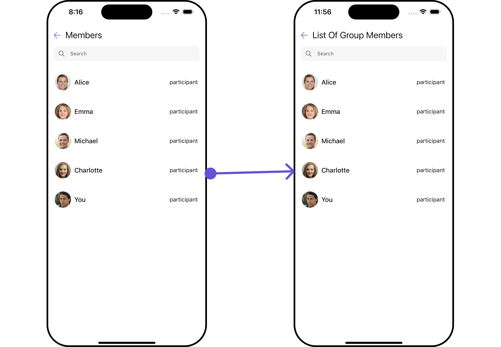

</TabItem>

<TabItem value="android" label="Android">

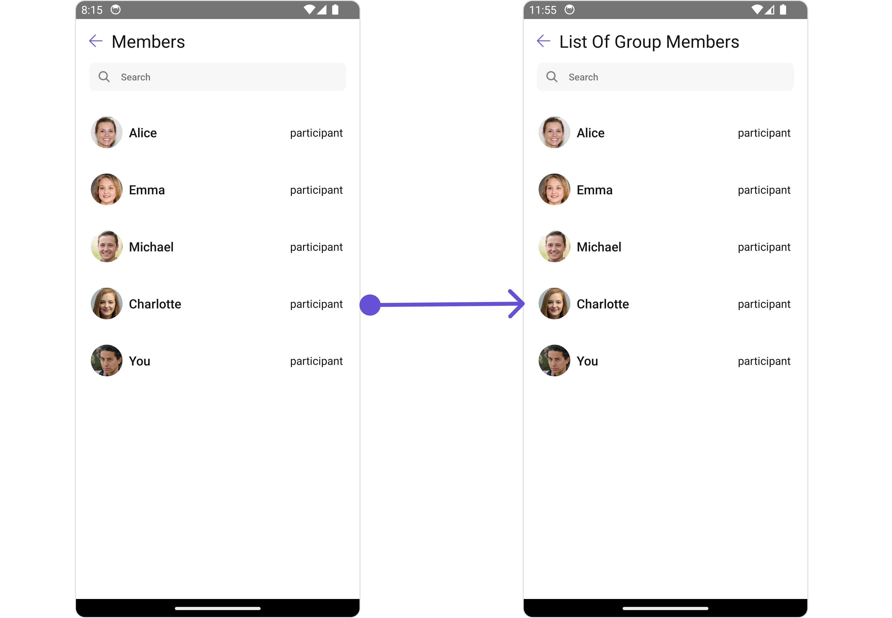

</TabItem>

</Tabs>

Below is a list of customizations along with corresponding code snippets

| Property                                                                                                          | Description                                                                                          | Code                                                           |
| ----------------------------------------------------------------------------------------------------------------- | ---------------------------------------------------------------------------------------------------- | -------------------------------------------------------------- |
| **title**                                                                                                         | Used to set title in the app heading                                                                 | `title?: string`                                               |
| **errorStateText**                                                                                                | Used to set a custom text response when some error occurs on fetching the list of group members      | `errorStateText?: string`                                      |
| **emptyStateText**                                                                                                | Used to set a custom text response when fetching the group members has returned an empty list        | `emptyStateText?: string`                                      |
| **searchBoxIcon**                                                                                                 | Used to set search Icon in the search field                                                          | `searchBoxIcon?: ImageType`                                    |
| **showBackButton**                                                                                                | Used to show or hide back button                                                                     | `showBackButton?: boolean`                                     |
| **backButtonIcon**                                                                                                | Used to set the back button Icon                                                                     | `backButtonIcon?: ImageType`                                   |
| **hideError**                                                                                                     | Used to hide error on fetching groups                                                                | `hideError?: boolean`                                          |
| **hideSearch**                                                                                                    | Used to toggle visibility for search box                                                             | `hideSearch?: boolean`                                         |
| **hideSeparator**                                                                                                 | Used to hide the divider separating the user items                                                   | `hideSeparator?: boolean`                                      |
| **disableUsersPresence**                                                                                          | Used to toggle functionality to show user's presence                                                 | `disableUsersPresence?: boolean`                               |
| **selectionMode**                                                                                                 | set the number of group members that can be selected, SelectionMode can be single, multiple or none. | `selectionMode?: 'none'` &#124; `'single'` &#124; `'multiple'` |
| **group** <a data-tooltip-id="my-tooltip-html-prop"> <span class="material-icons red">report</span> </a>          | Used to pass group object of which group members will be shown                                       | `group: CometChat.Group`                                       |
| **searchPlaceholder**                                                                                             | Used to set custom search placeholder text                                                           | `searchPlaceholder='Custom Search PlaceHolder'`                |
| **hideSubmitIcon** <a data-tooltip-id="my-tooltip-html-prop"> <span class="material-icons red">report</span> </a> | Used to hide the submit button                                                                       | `hideSubmitIcon?: boolean`                                     |

---

### Advance

For advanced-level customization, you can set custom views to the component. This lets you tailor each aspect of the component to fit your exact needs and application aesthetics. You can create and define your views, layouts, and UI elements and then incorporate those into the component.

---

#### ListItemView

With this property, you can assign a custom ListItem to the Group Members Component.

**Example**

<Tabs>

<TabItem value="iOS" label="iOS">

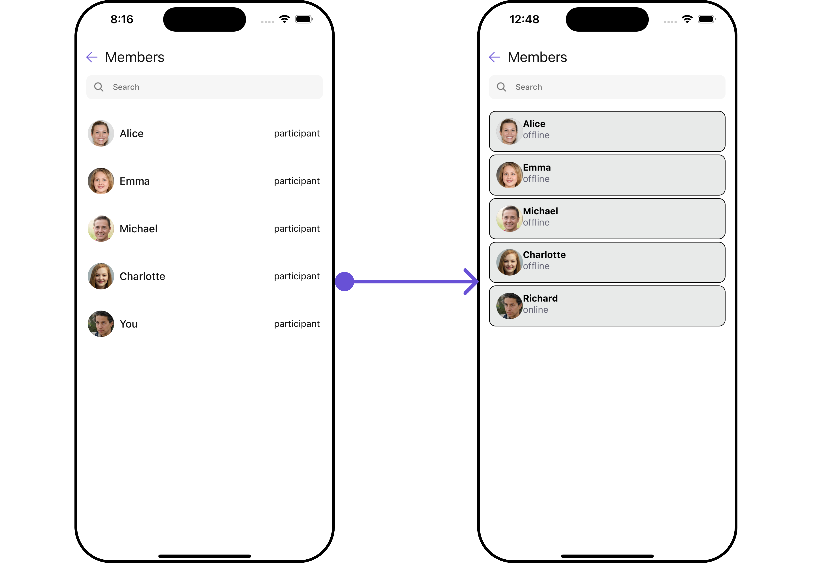

</TabItem>

<TabItem value="android" label="Android">

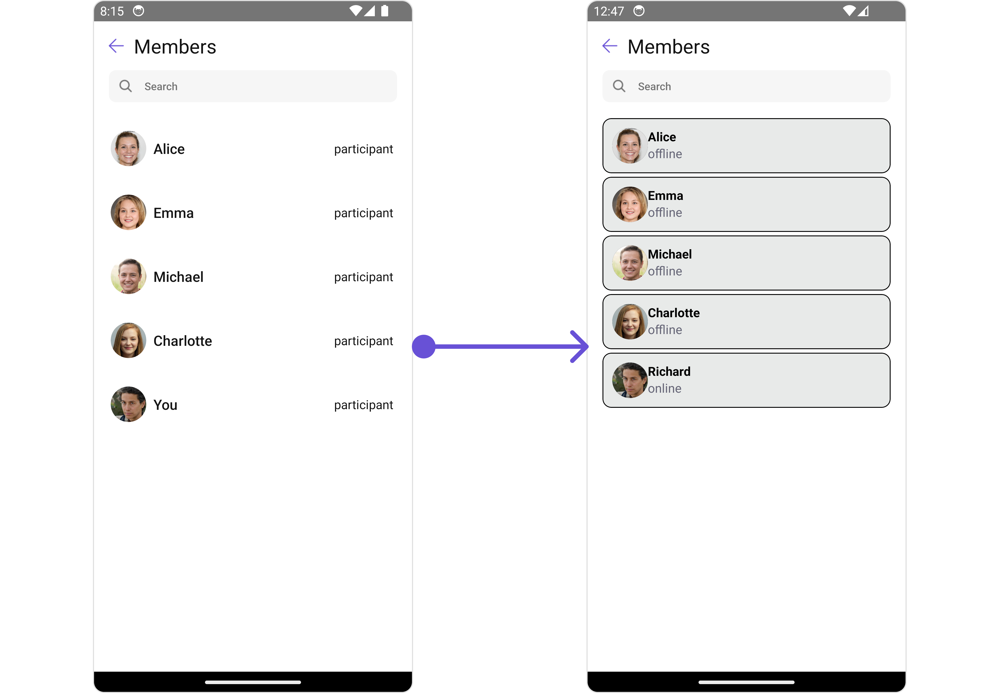

</TabItem>

</Tabs>

<Tabs>

<TabItem value="App.tsx" label="App.tsx">

```tsx
import { CometChat } from "@cometchat/chat-sdk-react-native";
import { CometChatGroupsMembers } from "@cometchat/chat-uikit-react-native";

function App(): React.JSX.Element {
  const [group, setGroup] = useState<CometChat.Group | undefined>(undefined);

  const getGroup = async () => {
    const group = await CometChat.getGroup("guid");
    setGroup(group);
  };

  useEffect(() => {
    //login
    getGroup();
  });

  const viewStyle: StyleProp<ViewStyle> = {
    flex: 1,
    flexDirection: "row",
    alignItems: "flex-start",
    padding: 10,
    borderColor: "black",
    borderWidth: 1,
    backgroundColor: "#E8EAE9",
    borderRadius: 10,
    margin: 2,
  };

  const getGroupMemberListItemView = (item: any) => {
    let user = item;
    return (
      <View style={viewStyle}>
        <CometChatAvatar
          image={user.avatar ? { uri: user.avatar } : undefined}
          name={user.name}
        />

        <View>
          <Text style={{ color: "black", fontWeight: "bold" }}>
            {user.name}
          </Text>
          <Text style={{ color: "#667" }}>{user.status}</Text>
        </View>
      </View>
    );
  };

  return (
    <>
      {group && (
        <CometChatGroupsMembers
          group={group}
          ListItemView={getGroupMemberListItemView}
        ></CometChatGroupsMembers>
      )}
    </>
  );
}
```

</TabItem>
</Tabs>

---

#### SubtitleView

You can customize the subtitle view for each group members to meet your requirements

<Tabs>

<TabItem value="iOS" label="iOS">

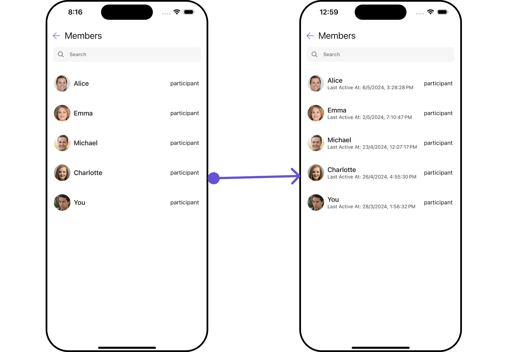

</TabItem>

<TabItem value="android" label="Android">

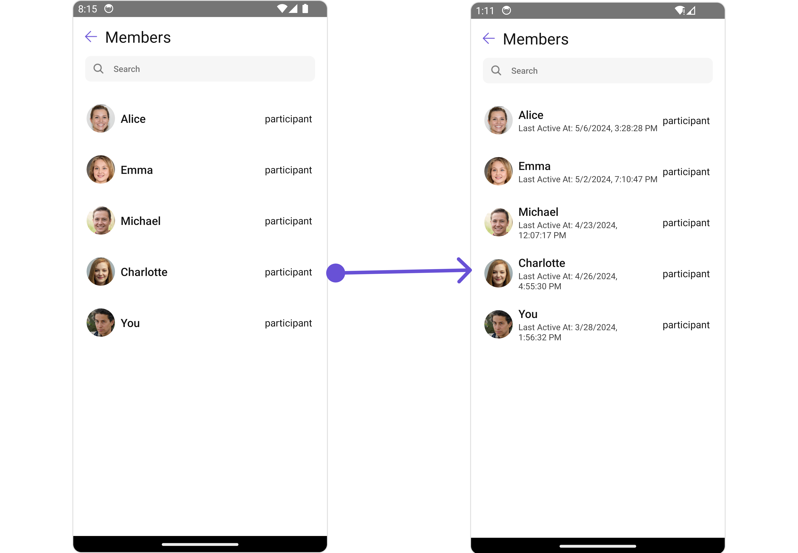

</TabItem>

</Tabs>

<Tabs>

<TabItem value="App.tsx" label="App.tsx">

```tsx
import { CometChat } from "@cometchat/chat-sdk-react-native";
import { CometChatGroupsMembers } from "@cometchat/chat-uikit-react-native";

function App(): React.JSX.Element {
  const [group, setGroup] = useState<CometChat.Group | undefined>(undefined);

  const getGroup = async () => {
    const group = await CometChat.getGroup("guid");
    setGroup(group);
  };

  useEffect(() => {
    //login
    getGroup();
  });

  const viewStyle: StyleProp<ViewStyle> = {
    flex: 1,
    flexDirection: "row",
    alignItems: "flex-start",
    padding: 10,
    borderColor: "black",
    borderWidth: 1,
    backgroundColor: "#E8EAE9",
    borderRadius: 10,
    margin: 2,
  };

  const getGroupMemberSubtitleView = (user) => {
    return (
      <Text
        style={{
          fontSize: 12,
          color: theme.palette.getAccent800(),
        }}
      >
        Last Active At:{" "}
        {user?.lastActiveAt ? formatTime(user?.lastActiveAt) : "--"}
      </Text>
    );
  };

  return (
    <>
      {group && (
        <CometChatGroupsMembers
          group={group}
          SubtitleView={getGroupMemberSubtitleView}
        ></CometChatGroupsMembers>
      )}
    </>
  );
}
```

</TabItem>
</Tabs>

---

#### TailView

You can customize the tail view for each group members to meet your requirements

<Tabs>

<TabItem value="iOS" label="iOS">

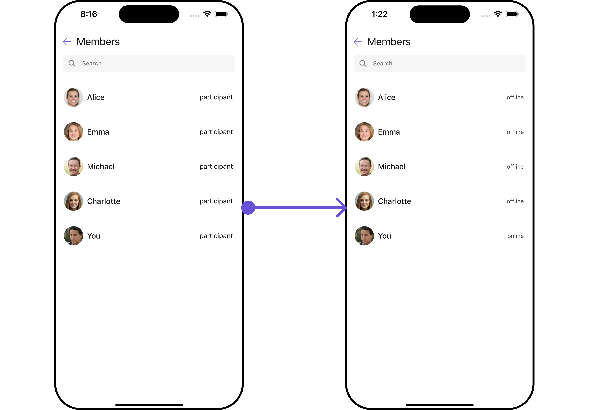

</TabItem>

<TabItem value="android" label="Android">

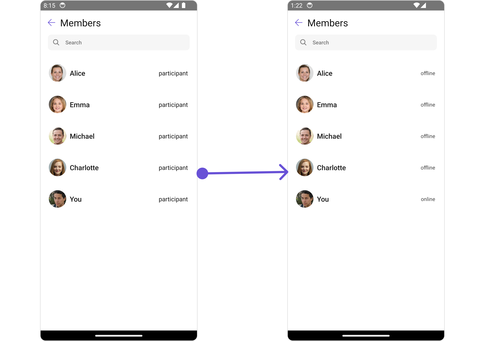

</TabItem>

</Tabs>

<Tabs>

<TabItem value="App.tsx" label="App.tsx">

```tsx
import { CometChat } from "@cometchat/chat-sdk-react-native";
import { CometChatGroupsMembers } from "@cometchat/chat-uikit-react-native";

function App(): React.JSX.Element {
  const [group, setGroup] = useState<CometChat.Group | undefined>(undefined);

  const getGroup = async () => {
    const group = await CometChat.getGroup("guid");
    setGroup(group);
  };

  useEffect(() => {
    //login
    getGroup();
  });

  const getTailView = (user) => {
    return (
      <Text
        style={{
          fontSize: 12,
          color: theme.palette.getAccent800(),
        }}
      >
        {user.status}
      </Text>
    );
  };

  return (
    <>
      {group && (
        <CometChatGroupsMembers
          group={group}
          TailView={getTailView}
        ></CometChatGroupsMembers>
      )}
    </>
  );
}
```

</TabItem>
</Tabs>

---

#### EmptyStateView

You can set a custom `EmptyStateView` using `emptyStateView` to match the empty view of your app.

<!-- Default:


Custom:
 -->

<Tabs>

<TabItem value="App.tsx" label="App.tsx">

```tsx
import { CometChat } from "@cometchat/chat-sdk-react-native";
import { CometChatGroupsMembers } from "@cometchat/chat-uikit-react-native";

function App(): React.JSX.Element {
  const [group, setGroup] = useState<CometChat.Group | undefined>(undefined);

  const getGroup = async () => {
    const group = await CometChat.getGroup("guid");
    setGroup(group);
  };

  useEffect(() => {
    //login
    getGroup();
  });

  const emptyViewStyle: StyleProp<ViewStyle> = {
    flex: 1,
    alignItems: "center",
    justifyContent: "center",
    padding: 10,
    borderColor: "black",
    borderWidth: 1,
    backgroundColor: "#E8EAE9",
  };

  const getGroupMemberEmptyStateView = () => {
    return (
      <View style={emptyViewStyle}>
        <Text style={{ fontSize: 80, color: "black" }}>Empty</Text>
      </View>
    );
  };

  return (
    <>
      {group && (
        <CometChatGroupsMembers
          group={group}
          EmptyStateView={getGroupMemberEmptyStateView}
        ></CometChatGroupsMembers>
      )}
    </>
  );
}
```

</TabItem>
</Tabs>

---

#### ErrorStateView

You can set a custom `ErrorStateView` using `errorStateView` to match the error view of your app.

<!-- Default:


Custom:
 -->

<Tabs>

<TabItem value="App.tsx" label="App.tsx">

```tsx
import { CometChat } from "@cometchat/chat-sdk-react-native";
import { CometChatGroupsMembers } from "@cometchat/chat-uikit-react-native";

function App(): React.JSX.Element {
  const [group, setGroup] = useState<CometChat.Group | undefined>(undefined);

  const getGroup = async () => {
    const group = await CometChat.getGroup("guid");
    setGroup(group);
  };

  useEffect(() => {
    //login
    getGroup();
  });

  const errorViewStyle: StyleProp<ViewStyle> = {
    flex: 1,
    alignItems: "center",
    justifyContent: "center",
    padding: 10,
    borderColor: "black",
    borderWidth: 1,
    backgroundColor: "#E8EAE9",
  };

  const getGroupMemberErrorStateView = () => {
    return (
      <View style={errorViewStyle}>
        <Text></Text>
      </View>
    );
  };

  return (
    <>
      {group && (
        <CometChatGroupsMembers
          group={group}
          ErrorStateView={getGroupMemberErrorStateView}
        ></CometChatGroupsMembers>
      )}
    </>
  );
}
```

</TabItem>
</Tabs>

---

#### AppBarOptions

You can set the Custom Menu view to add more options to the Group Members component.

<Tabs>

<TabItem value="iOS" label="iOS">

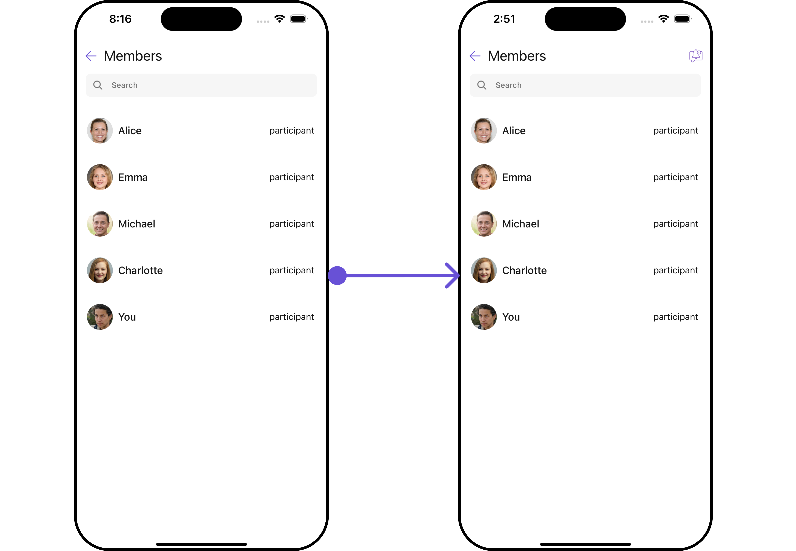

</TabItem>

<TabItem value="android" label="Android">

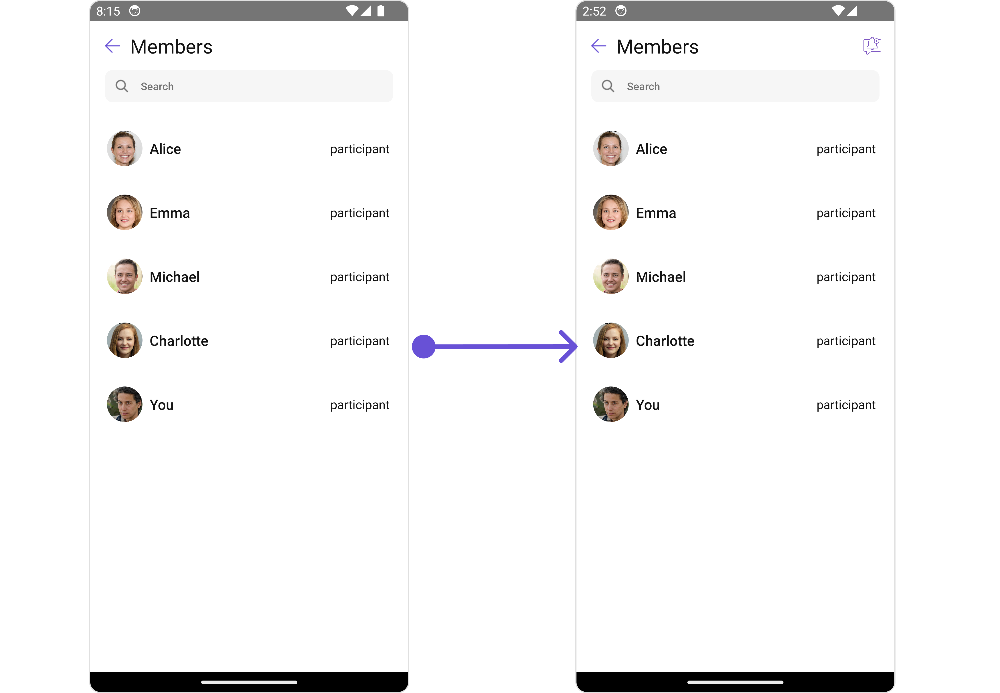

</TabItem>

</Tabs>

<Tabs>

<TabItem value="App.tsx" label="App.tsx">

```tsx
import { CometChat } from "@cometchat/chat-sdk-react-native";
import { CometChatGroupsMembers } from "@cometchat/chat-uikit-react-native";

function App(): React.JSX.Element {
  const [group, setGroup] = useState<CometChat.Group | undefined>(undefined);

  const getGroup = async () => {
    const group = await CometChat.getGroup("guid");
    setGroup(group);
  };

  useEffect(() => {
    //login
    getGroup();
  });

  const styles = StyleSheet.create({
    button: {
      height: 20,
      width: 20,
      borderRadius: 0,
      backgroundColor: "transparent",
    },
    image: {
      height: 20,
      width: 20,
      tintColor: "#7E57C2",
    },
  });

  const getAppBarOptions = () => {
    return (
      <TouchableOpacity
        style={styles.button}
        onPress={() => {
          /*code*/
        }}
      >
        <Image source={Notification} style={styles.image} />
      </TouchableOpacity>
    );
  };

  return (
    <>
      {group && (
        <CometChatGroupsMembers
          group={group}
          AppBarOptions={getAppBarOptions}
        ></CometChatGroupsMembers>
      )}
    </>
  );
}
```

</TabItem>
</Tabs>

---

#### Swipe Options

You can set the Custom Swipe options to the Add Members component.

<Tabs>

<TabItem value="iOS" label="iOS">

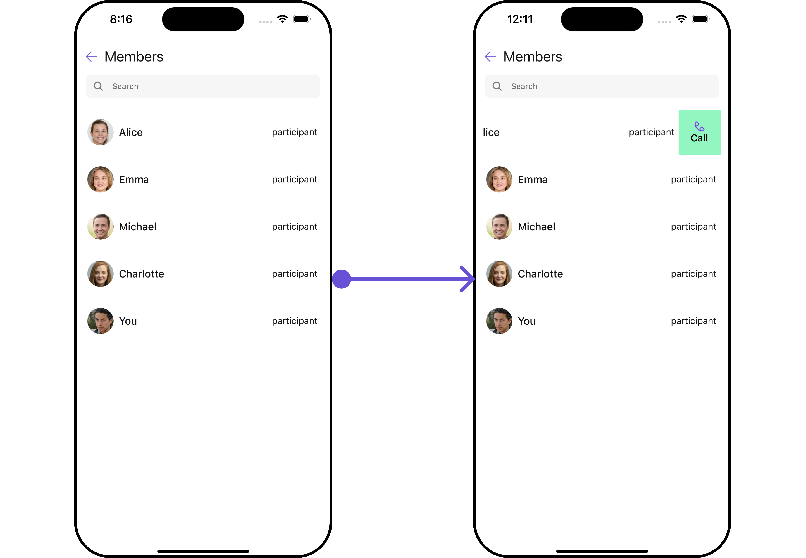

</TabItem>

<TabItem value="android" label="Android">

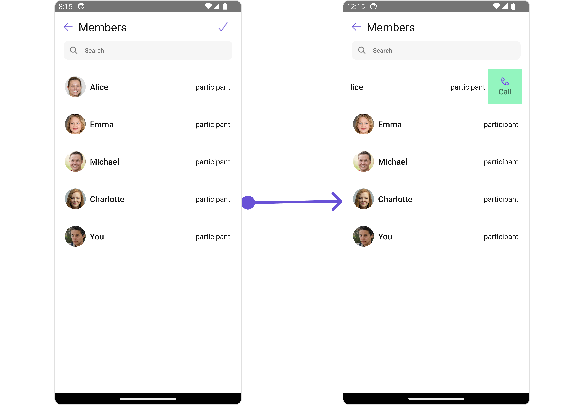

</TabItem>

</Tabs>

<Tabs>

<TabItem value="App.tsx" label="App.tsx">

```tsx
import { CometChat } from "@cometchat/chat-sdk-react-native";
import { CometChatGroupsMembers } from "@cometchat/chat-uikit-react-native";

function App(): React.JSX.Element {
  const [group, setGroup] = useState<CometChat.Group | undefined>(undefined);

  const getGroup = async () => {
    const group = await CometChat.getGroup("guid");
    setGroup(group);
  };

  useEffect(() => {
    //login
    getGroup();
  });

  const getGroupMemberCustomOptions = (item: CometChat.GroupMember) => {
    const customOption: CometChatOptions = {
      id: "custom id",
      title: "Call",
      icon: Call,
      iconTint: "#7316f5",
      backgroundColor: "#93f5bf",
      onPress: () => console.log("custom action"),
    };

    return [customOption];
  };

  return (
    <>
      {group && (
        <CometChatGroupsMembers
          group={group}
          options={getGroupMemberCustomOptions}
        ></CometChatGroupsMembers>
      )}
    </>
  );
}
```

</TabItem>
</Tabs>

---

import { Tooltip } from 'react-tooltip'
import 'react-tooltip/dist/react-tooltip.css'

<Tooltip
  id="my-tooltip-html-prop"
  html="Not available in GroupMembersConfiguration"
/>
