import Tabs from '@theme/Tabs';
import TabItem from '@theme/TabItem';

## Overview

`CometChatBannedMembers` is a [Component](/ui-kit/react-native/components-overview#components) that displays all the users who have been restricted or prohibited from participating in specific groups or conversations. When the user is banned, they are no longer able to access or engage with the content and discussions within the banned group. Group administrators or owners have the authority to ban members from specific groups they manage. They can review user activity, monitor behavior, and take appropriate actions, including banning users when necessary.

<Tabs>

<TabItem value="iOS" label="iOS">

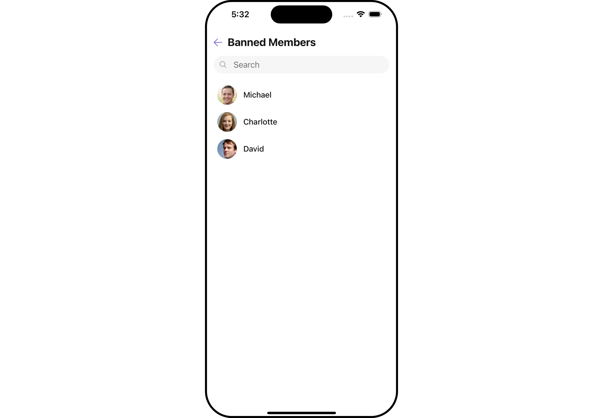

</TabItem>

<TabItem value="android" label="Android">

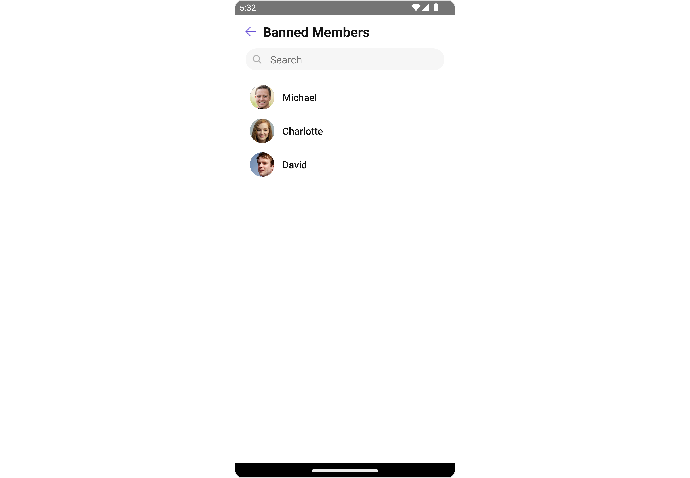

</TabItem>

</Tabs>

---

## Usage

### Integration

The following code snippet illustrates how you can directly incorporate the Banned Members component into your Application.

<Tabs>

<TabItem value="App.tsx" label="App.tsx">

```tsx
import { CometChat } from "@cometchat/chat-sdk-react-native";
import { CometChatBannedMembers } from "@cometchat/chat-uikit-react-native";

function App(): React.JSX.Element {
  const [group, setGroup] = useState<CometChat.Group | undefined>(undefined);

  const getGroup = async () => {
    const group = await CometChat.getGroup("guid");
    setGroup(group);
  };

  useEffect(() => {
    //login
    getGroup();
  });

  return (
    <>
      {group && <CometChatBannedMembers group={group}></CometChatBannedMembers>}
    </>
  );
}
```

</TabItem>
</Tabs>

---

### Actions

[Actions](/ui-kit/react-native/components-overview#actions) dictate how a component functions. They are divided into two types: Predefined and User-defined. You can override either type, allowing you to tailor the behavior of the component to fit your specific needs.

##### 1. onSelection

The `onSelection` action is activated when you select the done icon while in selection mode. This returns a list of all the banned members that you have selected.

This action does not come with any predefined behavior. However, you have the flexibility to override this event and tailor it to suit your needs using the following code snippet.

<Tabs>

<TabItem value="App.tsx" label="App.tsx">

```tsx
import { CometChat } from "@cometchat/chat-sdk-react-native";
import { CometChatBannedMembers } from "@cometchat/chat-uikit-react-native";

function App(): React.JSX.Element {
  const [group, setGroup] = useState<CometChat.Group | undefined>(undefined);

  const getGroup = async () => {
    const group = await CometChat.getGroup("guid");
    setGroup(group);
  };

  useEffect(() => {
    //login
    getGroup();
  });

  const onSelectionHandler = (list: CometChat.User[]) => {
    //code
  };

  return (
    <>
      {group && (
        <CometChatBannedMembers
          group={group}
          onSelection={onSelectionHandler}
        ></CometChatBannedMembers>
      )}
    </>
  );
}
```

</TabItem>
</Tabs>

##### 2. onItemPress

The `onItemPress` event is activated when you click on the Banned Members List item. This action does not come with any predefined behavior. However, you have the flexibility to override this event and tailor it to suit your needs using the following code snippet.

<Tabs>

<TabItem value="App.tsx" label="App.tsx">

```tsx
import { CometChat } from "@cometchat/chat-sdk-react-native";
import { CometChatBannedMembers } from "@cometchat/chat-uikit-react-native";

function App(): React.JSX.Element {
  const [group, setGroup] = useState<CometChat.Group | undefined>(undefined);

  const getGroup = async () => {
    const group = await CometChat.getGroup("guid");
    setGroup(group);
  };

  useEffect(() => {
    //login
    getGroup();
  });

  const onItemPresshandler = (user: CometChat.User) => {
    //code
  };

  return (
    <>
      {group && (
        <CometChatBannedMembers
          group={group}
          onItemPress={onItemPresshandler}
        ></CometChatBannedMembers>
      )}
    </>
  );
}
```

</TabItem>
</Tabs>

##### 3. onItemLongPress

The `onItemLongPress` event is activated when you Long Press on the Banned Members List item. This action does not come with any predefined behavior. However, you have the flexibility to override this event and tailor it to suit your needs using the following code snippet.

<Tabs>

<TabItem value="App.tsx" label="App.tsx">

```tsx
import { CometChat } from "@cometchat/chat-sdk-react-native";
import { CometChatBannedMembers } from "@cometchat/chat-uikit-react-native";

function App(): React.JSX.Element {
  const [group, setGroup] = useState<CometChat.Group | undefined>(undefined);

  const getGroup = async () => {
    const group = await CometChat.getGroup("guid");
    setGroup(group);
  };

  useEffect(() => {
    //login
    getGroup();
  });

  const onItemLongPresshandler = (user: CometChat.User) => {
    //code
  };

  return (
    <>
      {group && (
        <CometChatBannedMembers
          group={group}
          onItemLongPress={onItemLongPresshandler}
        ></CometChatBannedMembers>
      )}
    </>
  );
}
```

</TabItem>
</Tabs>

##### 4. OnBack

`OnBack` is triggered when you click on the back button of the Banned Members component. You can override this action using the following code snippet.

<Tabs>

<TabItem value="App.tsx" label="App.tsx">

```tsx
import { CometChat } from "@cometchat/chat-sdk-react-native";
import { CometChatBannedMembers } from "@cometchat/chat-uikit-react-native";

function App(): React.JSX.Element {
  const [group, setGroup] = useState<CometChat.Group | undefined>(undefined);

  const getGroup = async () => {
    const group = await CometChat.getGroup("guid");
    setGroup(group);
  };

  useEffect(() => {
    //login
    getGroup();
  });

  const onBackHandler = () => {
    //code
  };

  return (
    <>
      {group && (
        <CometChatBannedMembers
          group={group}
          onBack={onBackHandler}
        ></CometChatBannedMembers>
      )}
    </>
  );
}
```

</TabItem>
</Tabs>

##### 5. onError

This action doesn't change the behavior of the component but rather listens for any errors that occur in the Banned Members component.

<Tabs>

<TabItem value="App.tsx" label="App.tsx">

```tsx
import { CometChat } from "@cometchat/chat-sdk-react-native";
import { CometChatBannedMembers } from "@cometchat/chat-uikit-react-native";

function App(): React.JSX.Element {
  const [group, setGroup] = useState<CometChat.Group | undefined>(undefined);

  const getGroup = async () => {
    const group = await CometChat.getGroup("guid");
    setGroup(group);
  };

  useEffect(() => {
    //login
    getGroup();
  });

  const onErrorHandler = (error: CometChat.CometChatException) => {
    //code
  };

  return (
    <>
      {group && (
        <CometChatBannedMembers
          group={group}
          onError={onErrorHandler}
        ></CometChatBannedMembers>
      )}
    </>
  );
}
```

</TabItem>
</Tabs>

---

### Filters

**Filters** allow you to customize the data displayed in a list within a Component. You can filter the list based on your specific criteria, allowing for a more customized. Filters can be applied using RequestBuilders of Chat SDK.

##### 1. BannedMembersRequestBuilder

The [BannedMembersRequestBuilder](/sdk/react-native/group-kick-ban-members) enables you to filter and customize the Banned Members list based on available parameters in BannedMembersRequestBuilder. This feature allows you to create more specific and targeted queries when fetching banned members. The following are the parameters available in [BannedMembersRequestBuilder](/sdk/react-native/group-kick-ban-members)

| Methods              | Type                | Description                                                                                        |
| -------------------- | ------------------- | -------------------------------------------------------------------------------------------------- |
| **setLimit**         | number              | sets the number of banned members that can be fetched in a single request, suitable for pagination |
| **setSearchKeyword** | String              | used for fetching banned members matching the passed string                                        |
| **setScopes**        | Array&lt;String&gt; | used for fetching banned members based on multiple scopes                                          |

**Example**

In the example below, we are applying a filter to the banned members by setting the limit to 2 and setting the scope to show only the moderator.

<Tabs>

<TabItem value="App.tsx" label="App.tsx">

```tsx
import { CometChat } from "@cometchat/chat-sdk-react-native";
import { CometChatBannedMembers } from "@cometchat/chat-uikit-react-native";

function App(): React.JSX.Element {
  const [group, setGroup] = useState<CometChat.Group | undefined>(undefined);

  const getGroup = async () => {
    const group = await CometChat.getGroup("guid");
    setGroup(group);
  };

  useEffect(() => {
    //login
    getGroup();
  });

  const bannedMembersRequestBuilder = new CometChat.BannedMembersRequestBuilder(
    "guid"
  )
    .setLimit(2)
    .setScopes(["moderator"]);

  return (
    <>
      {group && (
        <CometChatBannedMembers
          group={group}
          bannedMembersRequestBuilder={bannedMembersRequestBuilder}
        ></CometChatBannedMembers>
      )}
    </>
  );
}
```

</TabItem>
</Tabs>

##### 2. SearchRequestBuilder

The SearchRequestBuilder uses [BannedMembersRequestBuilder](/sdk/react-native/group-kick-ban-members) enables you to filter and customize the search list based on available parameters in BannedMembersRequestBuilder.

**Example**

<Tabs>

<TabItem value="App.tsx" label="App.tsx">

```tsx
import { CometChat } from "@cometchat/chat-sdk-react-native";
import { CometChatBannedMembers } from "@cometchat/chat-uikit-react-native";

function App(): React.JSX.Element {
  const [group, setGroup] = useState<CometChat.Group | undefined>(undefined);

  const getGroup = async () => {
    const group = await CometChat.getGroup("guid");
    setGroup(group);
  };

  useEffect(() => {
    //login
    getGroup();
  });

  const searchBannedMembersRequestBuilder =
    new CometChat.BannedMembersRequestBuilder("guid")
      .setLimit(2)
      .setSearchKeyword("some-keyword");

  return (
    <>
      {group && (
        <CometChatBannedMembers
          group={group}
          searchRequestBuilder={searchBannedMembersRequestBuilder}
        ></CometChatBannedMembers>
      )}
    </>
  );
}
```

</TabItem>
</Tabs>

---

### Events

[Events](/ui-kit/react-native/components-overview#events) are emitted by a `Component`. By using event you can extend existing functionality. Being global events, they can be applied in Multiple Locations and are capable of being Added or Removed.

Events emitted by the Add Members component is as follows.

| Event                     | Description                                   |
| ------------------------- | --------------------------------------------- |
| **ccGroupMemberUnBanned** | Triggers when a user is unbanned from a group |

<Tabs>
<TabItem value="js" label="Adding Listeners">

```js
import { CometChatUIEventHandler } from "@cometchat/chat-uikit-react-native";

CometChatUIEventHandler.addGroupListener("GROUP_LISTENER_ID", {
  ccGroupMemberUnBanned: ({ message }: { message: CometChat.BaseMessage }) => {
    //code
  },
});
```

</TabItem>

</Tabs>

---

<Tabs>
<TabItem value="js" label="Removing Listeners">

```js
import { CometChatUIEventHandler } from "@cometchat/chat-uikit-react-native";

CometChatUIEventHandler.removeGroupListener("GROUP_LISTENER_ID");
```

</TabItem>
</Tabs>

---

---

## Customization

To fit your app's design requirements, you can customize the appearance of the Groups component. We provide exposed methods that allow you to modify the experience and behavior according to your specific needs.

### Style

Using **Style** you can **customize** the look and feel of the component in your app, These parameters typically control elements such as the **color**, **size**, **shape**, and **fonts** used within the component.

##### 1. BannedMembers Style

You can set the `BannedMembersStyle` to the Banned Members Component to customize the styling.

<Tabs>

<TabItem value="iOS" label="iOS">

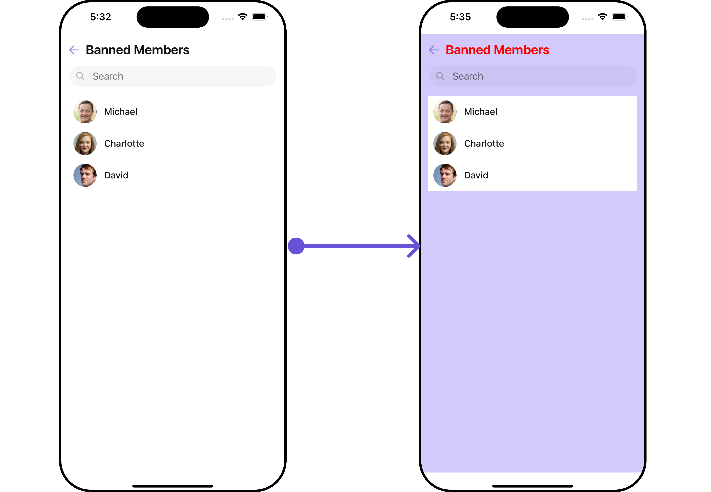

</TabItem>

<TabItem value="android" label="Android">

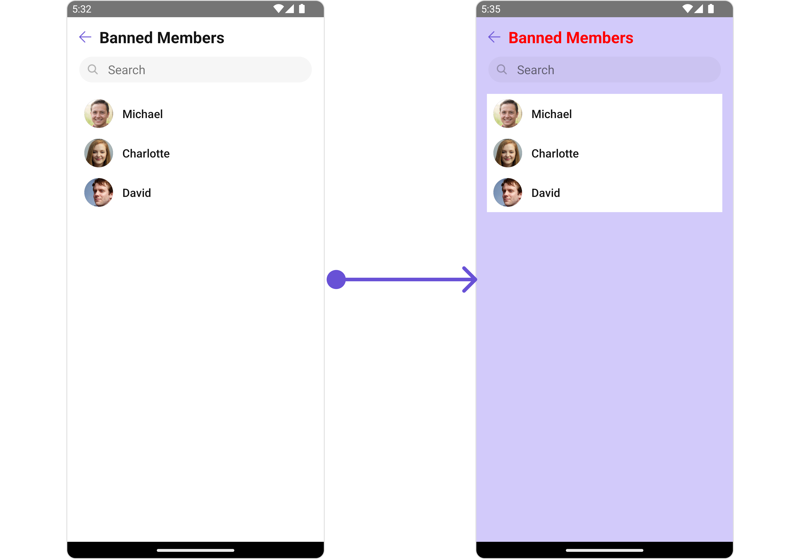

</TabItem>

</Tabs>

<Tabs>

<TabItem value="App.tsx" label="App.tsx">

```tsx
import { CometChat } from "@cometchat/chat-sdk-react-native";
import {
  CometChatBannedMembers,
  CometChatListStylesInterface,
} from "@cometchat/chat-uikit-react-native";

function App(): React.JSX.Element {
  const [group, setGroup] = useState<CometChat.Group | undefined>(undefined);

  const getGroup = async () => {
    const group = await CometChat.getGroup("guid");
    setGroup(group);
  };

  useEffect(() => {
    //login
    getGroup();
  });

  const bannedMemberStyle: CometChatListStylesInterface = {
    background: "#d2cafa",
    titleColor: "red",
  };

  return (
    <>
      {group && (
        <CometChatBannedMembers
          group={group}
          bannedMemberStyle={bannedMemberStyle}
        ></CometChatBannedMembers>
      )}
    </>
  );
}
```

</TabItem>
</Tabs>

List of properties exposed by BannedMembersStyle:

| Property                   | Description                           | Code                                          |
| -------------------------- | ------------------------------------- | --------------------------------------------- |
| **border**                 | Used to set border                    | `border?: BorderStyleInterface,`              |
| **borderRadius**           | Used to set border radius             | `borderRadius?: number;`                      |
| **background**             | Used to set background colour         | `background?: string;`                        |
| **height**                 | Used to set height                    | `height?: string` &#124; `number ;`           |
| **width**                  | Used to set width                     | `width?: string` &#124; `number ;`            |
| **titleFont**              | Used to set title text font           | `titleFont?: FontStyleInterface,`             |
| **titleColor**             | Used to set title text color          | `titleColor?: string;`                        |
| **backIconTint**           | Used to set back button icon tint     | `backIconTint?: string;`                      |
| **searchIconTint**         | Used to set search icon tint          | `searchIconTint?: string;`                    |
| **searchBorder**           | Used to set search border             | `searchBorder?: BorderStyleInterface;`        |
| **searchBorderRadius**     | Used to set search border radius      | `searchBorderRadius?: number;`                |
| **searchBackground**       | Used to set search background color   | `searchBackground?: string;`                  |
| **searchTextFont**         | Used to set search text font          | `searchTextFont?: FontStyleInterface;`        |
| **searchTextColor**        | Used to set search text color         | `searchTextColor?: string;`                   |
| **onlineStatusColor**      | Used to set online status color       | `onlineStatusColor?: string;`                 |
| **loadingIconTint**        | Used to set loading icon tint         | `loadingIconTint?: string;`                   |
| **separatorColor**         | Used to set separator color           | `separatorColor?: string;`                    |
| **emptyTextColor**         | Used to set empty state text color    | `emptyTextColor?: string;`                    |
| **emptyStateTextFont**     | Used to set empty state text font     | `emptyStateTextFont?: FontStyleInterface;`    |
| **errorTextFont**          | Used to set error state text font     | `errorStateTextFont?: FontStyleInterface;`    |
| **errorTextColor**         | Used to set error state text color    | `errorStateTextColor?: string;`               |
| **sectionHeaderTextFont**  | Used to set section header text font  | `sectionHeaderTextFont?: FontStyleInterface;` |
| **sectionHeaderTextColor** | Used to set section header text color | `sectionHeaderTextColor?: string;`            |

##### 2. Avatar Style

To apply customized styles to the `Avatar` component in the Add Members Component, you can use the following code snippet. For further insights on `Avatar` Styles [refer](./avatar)

<Tabs>

<TabItem value="App.tsx" label="App.tsx">

```tsx
import { CometChat } from "@cometchat/chat-sdk-react-native";
import {
  CometChatBannedMembers,
  BorderStyleInterface,
  AvatarStyleInterface,
} from "@cometchat/chat-uikit-react-native";

function App(): React.JSX.Element {
  const [group, setGroup] = useState<CometChat.Group | undefined>(undefined);

  const getGroup = async () => {
    const group = await CometChat.getGroup("guid");
    setGroup(group);
  };

  useEffect(() => {
    //login
    getGroup();
  });

  const borderStyle: BorderStyleInterface = {
    borderWidth: 1,
    borderStyle: "solid",
    borderColor: "red",
  };

  const avatarStyle: AvatarStyleInterface = {
    outerViewSpacing: 5,
    outerView: {
      borderWidth: 2,
      borderStyle: "dotted",
      borderColor: "blue",
    },
    border: borderStyle,
  };

  return (
    <>
      {group && (
        <CometChatBannedMembers
          group={group}
          avatarStyle={avatarStyle}
        ></CometChatBannedMembers>
      )}
    </>
  );
}
```

</TabItem>
</Tabs>

##### 3. ListItem Style

To apply customized styles to the `ListItemStyle` component in the `Add Members` Component, you can use the following code snippet. For further insights on `ListItemStyle` Styles [refer](./list-item)

<Tabs>

<TabItem value="App.tsx" label="App.tsx">

```tsx
import { CometChat } from "@cometchat/chat-sdk-react-native";
import {
  CometChatBannedMembers,
  ListItemStyleInterface,
} from "@cometchat/chat-uikit-react-native";

function App(): React.JSX.Element {
  const [group, setGroup] = useState<CometChat.Group | undefined>(undefined);

  const getGroup = async () => {
    const group = await CometChat.getGroup("guid");
    setGroup(group);
  };

  useEffect(() => {
    //login
    getGroup();
  });

  const listItemStyle: ListItemStyleInterface = {
    titleColor: "red",
    backgroundColor: "#d2cafa",
  };

  return (
    <>
      {group && (
        <CometChatBannedMembers
          group={group}
          listItemStyle={listItemStyle}
        ></CometChatBannedMembers>
      )}
    </>
  );
}
```

</TabItem>
</Tabs>

##### 4. StatusIndicator Style

To apply customized styles to the Status Indicator component in the Add Members Component, You can use the following code snippet. For further insights on Status Indicator Styles [refer](./status-indicator)

<Tabs>

<TabItem value="App.tsx" label="App.tsx">

```tsx
import { CometChat } from "@cometchat/chat-sdk-react-native";
import {
  CometChatBannedMembers,
  StatusIndicatorStyleInterface,
} from "@cometchat/chat-uikit-react-native";

function App(): React.JSX.Element {
  const [group, setGroup] = useState<CometChat.Group | undefined>(undefined);

  const getGroup = async () => {
    const group = await CometChat.getGroup("guid");
    setGroup(group);
  };

  useEffect(() => {
    //login
    getGroup();
  });

  const statusIndicatorStyle: StatusIndicatorStyleInterface = {
    backgroundColor: "grey",
  };

  return (
    <>
      {group && (
        <CometChatBannedMembers
          group={group}
          statusIndicatorStyle={statusIndicatorStyle}
        ></CometChatBannedMembers>
      )}
    </>
  );
}
```

</TabItem>
</Tabs>

---

### Functionality

These are a set of small functional customizations that allow you to fine-tune the overall experience of the component. With these, you can change text, set custom icons, and toggle the visibility of UI elements.

<Tabs>

<TabItem value="App.tsx" label="App.tsx">

```tsx
import { CometChat } from "@cometchat/chat-sdk-react-native";
import { CometChatBannedMembers } from "@cometchat/chat-uikit-react-native";

function App(): React.JSX.Element {
  const [group, setGroup] = useState<CometChat.Group | undefined>(undefined);

  const getGroup = async () => {
    const group = await CometChat.getGroup("guid");
    setGroup(group);
  };

  useEffect(() => {
    //login
    getGroup();
  });

  return (
    <>
      {group && (
        <CometChatBannedMembers
          group={group}
          title="Custom Title"
        ></CometChatBannedMembers>
      )}
    </>
  );
}
```

</TabItem>
</Tabs>

<Tabs>

<TabItem value="iOS" label="iOS">

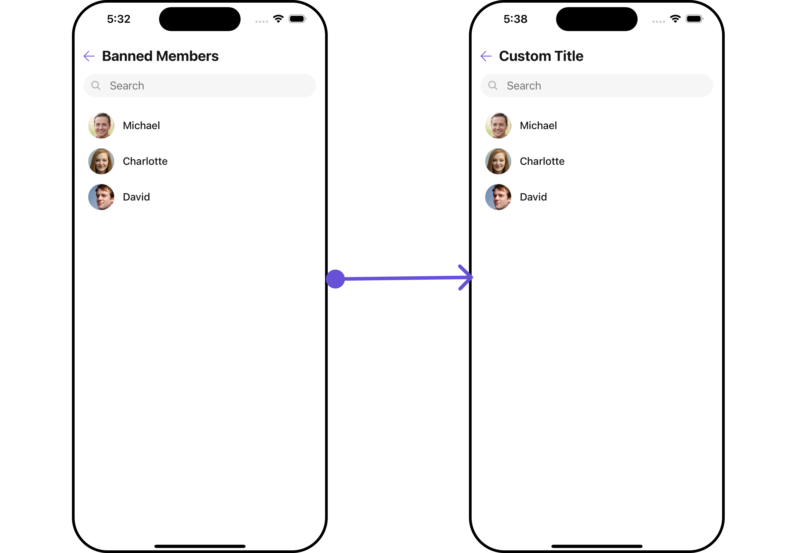

</TabItem>

<TabItem value="android" label="Android">

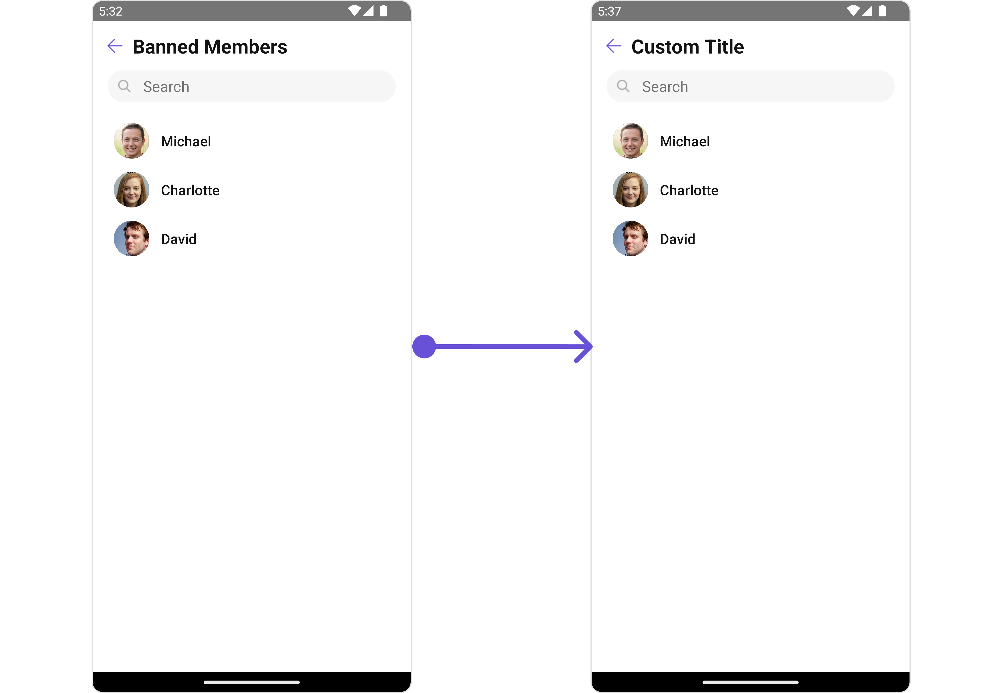

</TabItem>

</Tabs>

Below is a list of customizations along with corresponding code snippets

| Property                                                                                                 | Description                                                                             | Code                              |
| -------------------------------------------------------------------------------------------------------- | --------------------------------------------------------------------------------------- | --------------------------------- |
| **title**                                                                                                | Used to set title in the app bar                                                        | `title?: string;`                 |
| **searchPlaceholderText**                                                                                | Used to set search placeholder text                                                     | `searchPlaceholderText?: string;` |
| **backButtonIcon**                                                                                       | Used to set back button icon                                                            | `backButtonIcon?: ImageURISource` |
| **showBackButton**                                                                                       | Used to toggle visibility for back button                                               | `showBackButton?: boolean`        |
| **searchBoxIcon**                                                                                        | Used to set search Icon in the search field                                             | `searchBoxIcon?: ImageURISource`  |
| **hideSearch**                                                                                           | Used to toggle visibility for search box                                                | `hideSearch?: boolean`            |
| **hideError**                                                                                            | Used to hide error on fetching users                                                    | `hideError?: boolean`             |
| **hideSeparator**                                                                                        | Used to hide the divider separating the user items                                      | `hideSeparator?: boolean`         |
| **disableUsersPresence**                                                                                 | Used to control visibility of user indicator shown if user is online                    | `disableUsersPresence?: boolean`  |
| **selectionIcon**                                                                                        | Used to override the default selection complete icon                                    | `selectionIcon?: ImageURISource`  |
| **emptyStateText**                                                                                       | Used to set a custom text response when fetching the users has returned an empty list   | `emptyStateText?: string`         |
| **errorStateText**                                                                                       | Used to set a custom text response when some error occurs on fetching the list of users | `errorStateText?: string`         |
| **group** <a data-tooltip-id="my-tooltip-html-prop"> <span class="material-icons red">report</span> </a> | Used to pass group object of which group members will be shown                          | `group={chatGroup}`               |

---

### Advance

For advanced-level customization, you can set custom views to the component. This lets you tailor each aspect of the component to fit your exact needs and application aesthetics. You can create and define your views, layouts, and UI elements and then incorporate those into the component.

---

#### ListItemView

With this property, you can assign a custom ListItem to the Add Members Component.

**Example**

<Tabs>

<TabItem value="iOS" label="iOS">

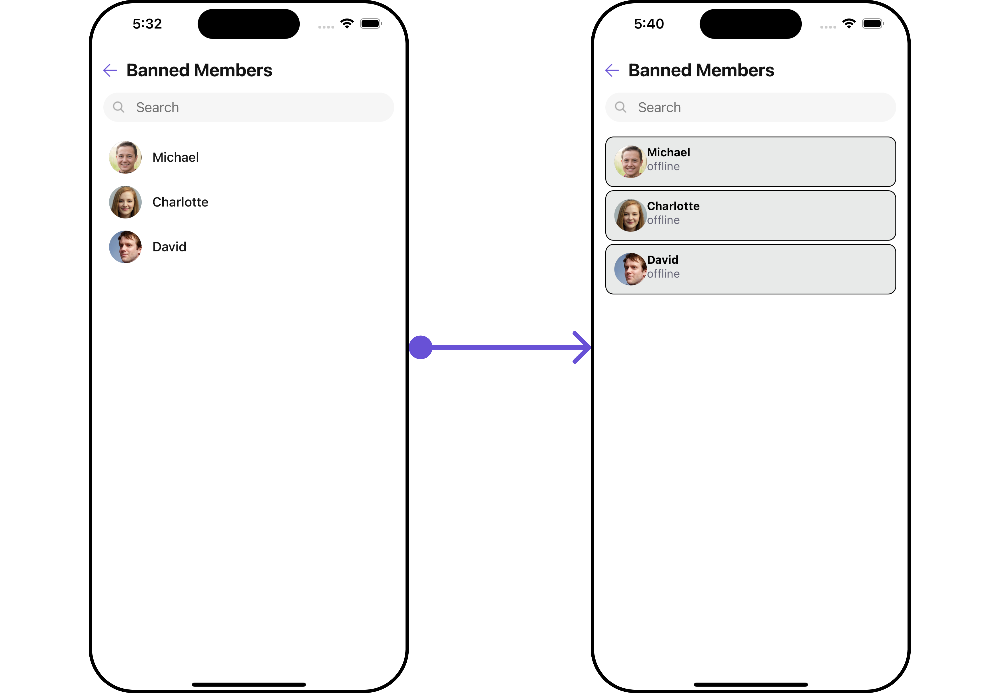

</TabItem>

<TabItem value="android" label="Android">

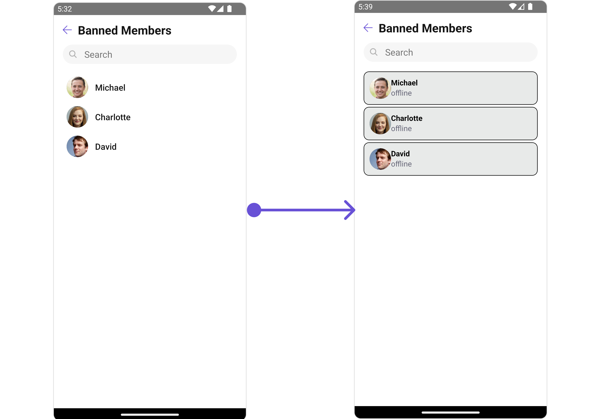

</TabItem>

</Tabs>

<Tabs>

<TabItem value="App.tsx" label="App.tsx">

```tsx
import { CometChat } from "@cometchat/chat-sdk-react-native";
import { CometChatBannedMembers } from "@cometchat/chat-uikit-react-native";

function App(): React.JSX.Element {
  const [group, setGroup] = useState<CometChat.Group | undefined>(undefined);

  const getGroup = async () => {
    const group = await CometChat.getGroup("guid");
    setGroup(group);
  };

  useEffect(() => {
    //login
    getGroup();
  });

  const viewStyle: StyleProp<ViewStyle> = {
    flex: 1,
    flexDirection: "row",
    alignItems: "flex-start",
    padding: 10,
    borderColor: "black",
    borderWidth: 1,
    backgroundColor: "#E8EAE9",
    borderRadius: 10,
    margin: 2,
  };

  const getListItemView = (info: { item: CometChat.User; index: number }) => {
    let user = info.item;
    return (
      <View style={viewStyle}>
        <CometChatAvatar
          image={user.getAvatar() ? { uri: user.getAvatar() } : undefined}
          name={user.getName()}
        />

        <View>
          <Text style={{ color: "black", fontWeight: "bold" }}>
            {user.getName()}
          </Text>
          <Text style={{ color: "#667" }}>{user.getStatus()}</Text>
        </View>
      </View>
    );
  };

  return (
    <>
      {group && (
        <CometChatBannedMembers
          group={group}
          title="Custom Title"
          ListItemView={getListItemView}
        ></CometChatBannedMembers>
      )}
    </>
  );
}
```

</TabItem>
</Tabs>

---

#### SubtitleView

You can customize the subtitle view for each users to meet your requirements

<Tabs>

<TabItem value="iOS" label="iOS">

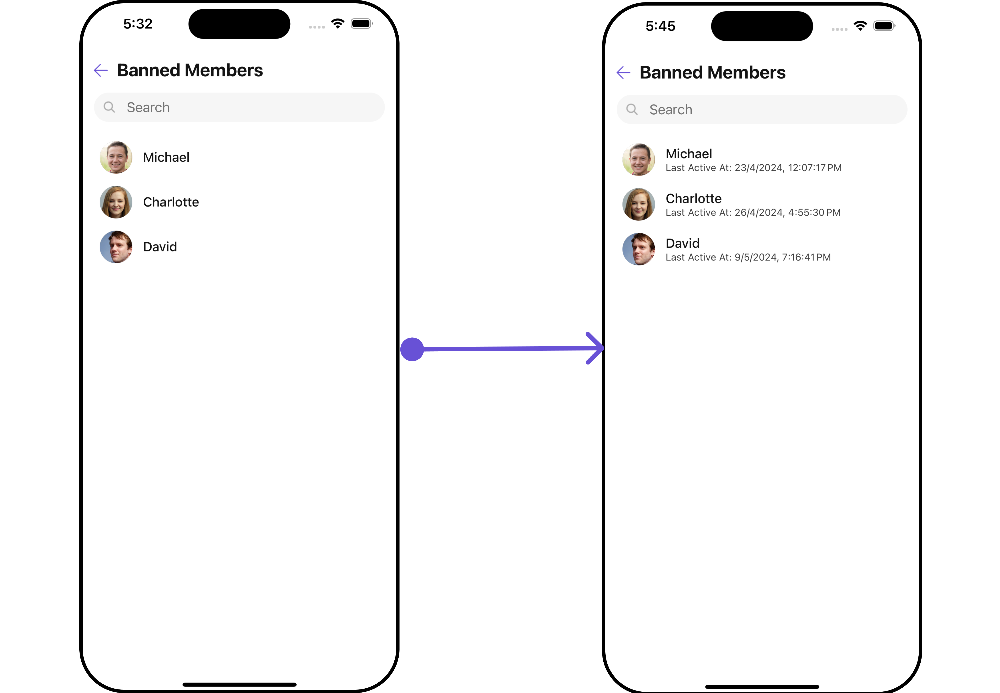

</TabItem>

<TabItem value="android" label="Android">

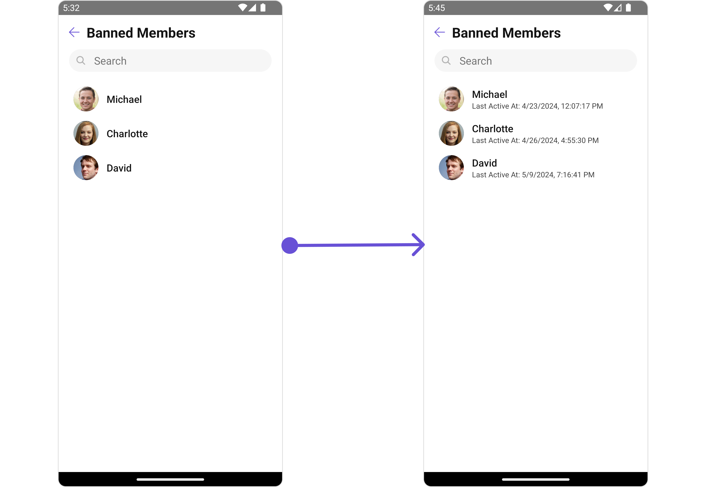

</TabItem>

</Tabs>

<Tabs>

<TabItem value="App.tsx" label="App.tsx">

```tsx
import { CometChat } from "@cometchat/chat-sdk-react-native";
import { CometChatBannedMembers } from "@cometchat/chat-uikit-react-native";

function App(): React.JSX.Element {
  const [group, setGroup] = useState<CometChat.Group | undefined>(undefined);

  const getGroup = async () => {
    const group = await CometChat.getGroup("guid");
    setGroup(group);
  };

  useEffect(() => {
    //login
    getGroup();
  });

  const getSubtitleView = (user) => {
    return (
      <Text
        style={{
          fontSize: 12,
          color: theme.palette.getAccent800(),
        }}
      >
        Last Active At:{" "}
        {user?.lastActiveAt ? formatTime(user?.lastActiveAt) : "--"}
      </Text>
    );
  };

  return (
    <>
      {group && (
        <CometChatBannedMembers
          group={group}
          title="Custom Title"
          SubtitleView={getSubtitleView}
        ></CometChatBannedMembers>
      )}
    </>
  );
}
```

</TabItem>
</Tabs>

#### LoadingStateView

You can set a custom loader view using `LoadingStateView` to match the loading view of your app.

<Tabs>

<TabItem value="iOS" label="iOS">

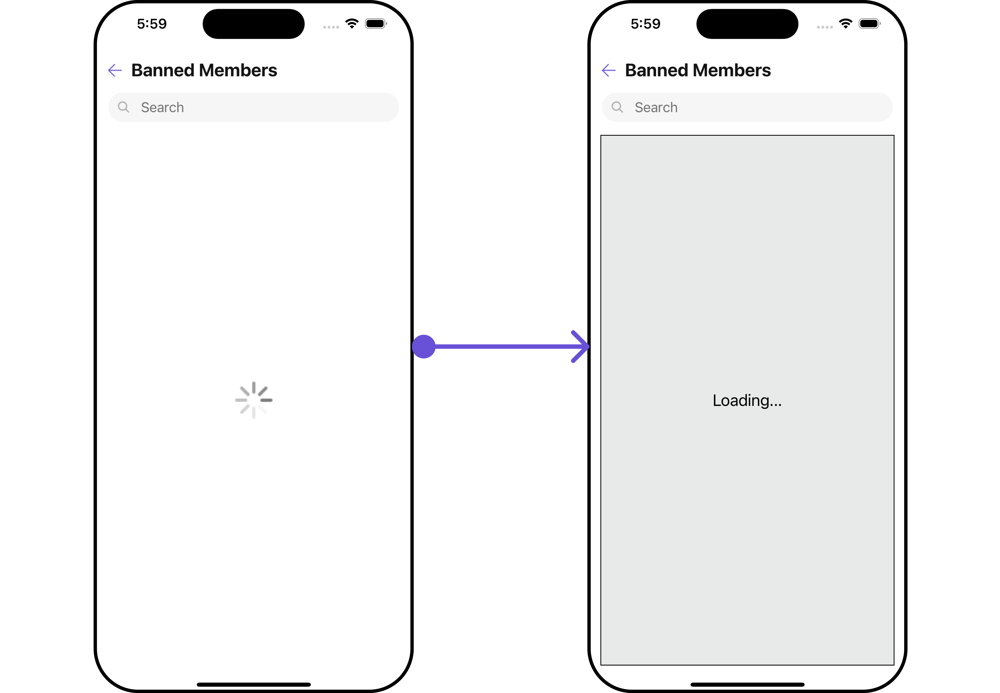

</TabItem>

<TabItem value="android" label="Android">

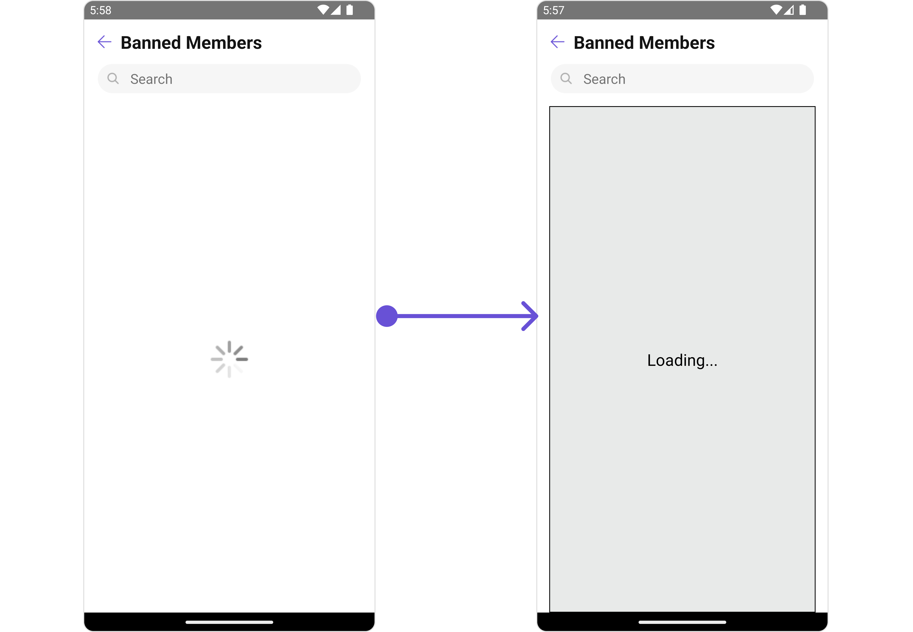

</TabItem>

</Tabs>

<Tabs>

<TabItem value="App.tsx" label="App.tsx">

```tsx
import { CometChat } from "@cometchat/chat-sdk-react-native";
import { CometChatBannedMembers } from "@cometchat/chat-uikit-react-native";

function App(): React.JSX.Element {
  const [group, setGroup] = useState<CometChat.Group | undefined>(undefined);

  const getGroup = async () => {
    const group = await CometChat.getGroup("guid");
    setGroup(group);
  };

  useEffect(() => {
    //login
    getGroup();
  });

  const loadingViewStyle: StyleProp<ViewStyle> = {
    flex: 1,
    alignItems: "center",
    justifyContent: "center",
    padding: 10,
    borderColor: "black",
    borderWidth: 1,
    backgroundColor: "#E8EAE9",
  };

  const getLoadingStateView = () => {
    return (
      <View style={loadingViewStyle}>
        <Text style={{ fontSize: 20, color: "black" }}>Loading...</Text>
      </View>
    );
  };

  return (
    <>
      {group && (
        <CometChatBannedMembers
          group={group}
          LoadingStateView={getLoadingStateView}
        ></CometChatBannedMembers>
      )}
    </>
  );
}
```

</TabItem>
</Tabs>

#### EmptyStateView

You can set a custom `EmptyStateView` using `EmptyStateView` to match the empty view of your app.

<Tabs>

<TabItem value="App.tsx" label="App.tsx">

```tsx
import { CometChat } from "@cometchat/chat-sdk-react-native";
import { CometChatBannedMembers } from "@cometchat/chat-uikit-react-native";

function App(): React.JSX.Element {
  const [group, setGroup] = useState<CometChat.Group | undefined>(undefined);

  const getGroup = async () => {
    const group = await CometChat.getGroup("guid");
    setGroup(group);
  };

  useEffect(() => {
    //login
    getGroup();
  });

  const searchRequestBuilder = new CometChat.UsersRequestBuilder()
    .setLimit(100)
    .setSearchKeyword("does-not-exist");

  const emptyViewStyle: StyleProp<ViewStyle> = {
    flex: 1,
    alignItems: "center",
    justifyContent: "center",
    padding: 10,
    borderColor: "black",
    borderWidth: 1,
    backgroundColor: "#E8EAE9",
  };

  const getEmptyStateView = () => {
    return (
      <View style={emptyViewStyle}>
        <Text style={{ fontSize: 80, color: "black" }}>Empty</Text>
      </View>
    );
  };

  return (
    <>
      {group && (
        <CometChatBannedMembers
          group={group}
          searchRequestBuilder={searchRequestBuilder}
          EmptyStateView={getEmptyStateView}
        ></CometChatBannedMembers>
      )}
    </>
  );
}
```

</TabItem>
</Tabs>

---

#### AppBarOptions

You can set the Custom Menu view to add more options to the Add Members component.

<Tabs>

<TabItem value="iOS" label="iOS">

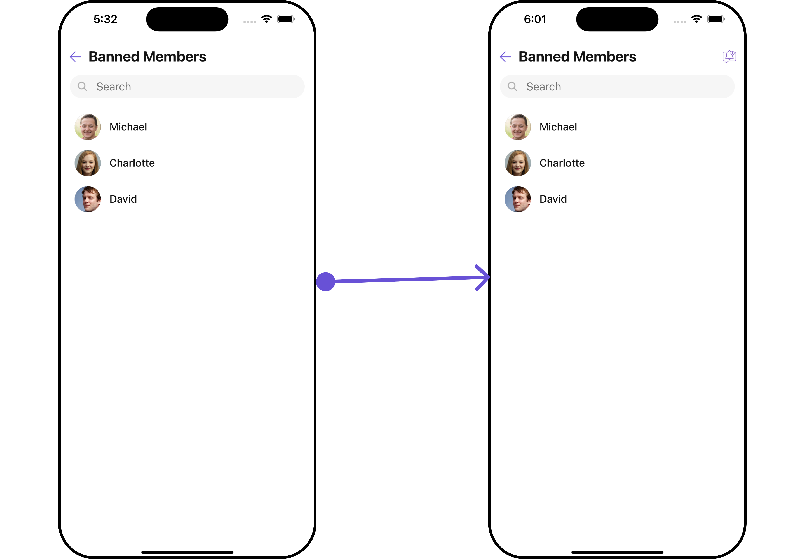

</TabItem>

<TabItem value="android" label="Android">

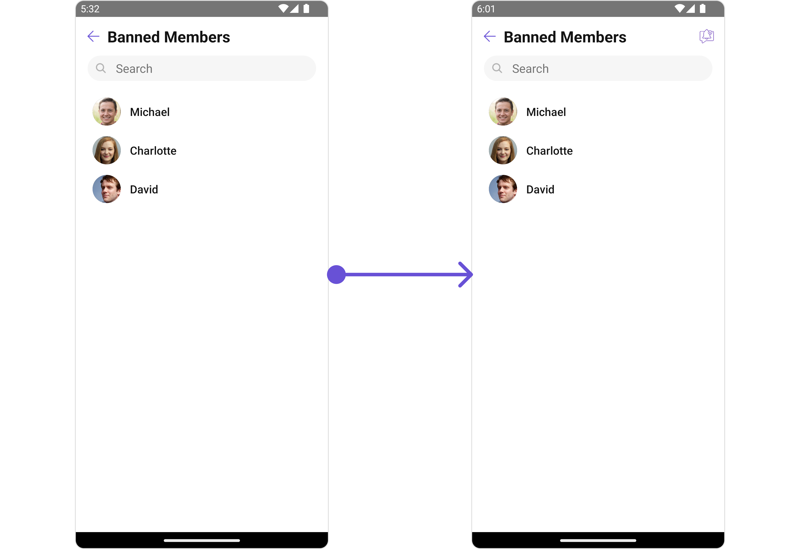

</TabItem>

</Tabs>

<Tabs>

<TabItem value="App.tsx" label="App.tsx">

```tsx
import { CometChat } from "@cometchat/chat-sdk-react-native";
import { CometChatBannedMembers } from "@cometchat/chat-uikit-react-native";

function App(): React.JSX.Element {
  const [group, setGroup] = useState<CometChat.Group | undefined>(undefined);

  const getGroup = async () => {
    const group = await CometChat.getGroup("guid");
    setGroup(group);
  };

  useEffect(() => {
    //login
    getGroup();
  });

  const getAppBarOptions = () => {
    return (
      <TouchableOpacity
        style={styles.button}
        onPress={() => {
          /*code*/
        }}
      >
        <Image source={Notification} style={styles.image} />
      </TouchableOpacity>
    );
  };

  return (
    <>
      {group && (
        <CometChatBannedMembers
          group={group}
          AppBarOptions={getAppBarOptions}
          selectionMode="none"
        ></CometChatBannedMembers>
      )}
    </>
  );
}
```

</TabItem>
</Tabs>

---

#### Swipe Options

You can set the Custom Swipe options to the Add Members component.

<Tabs>

<TabItem value="iOS" label="iOS">

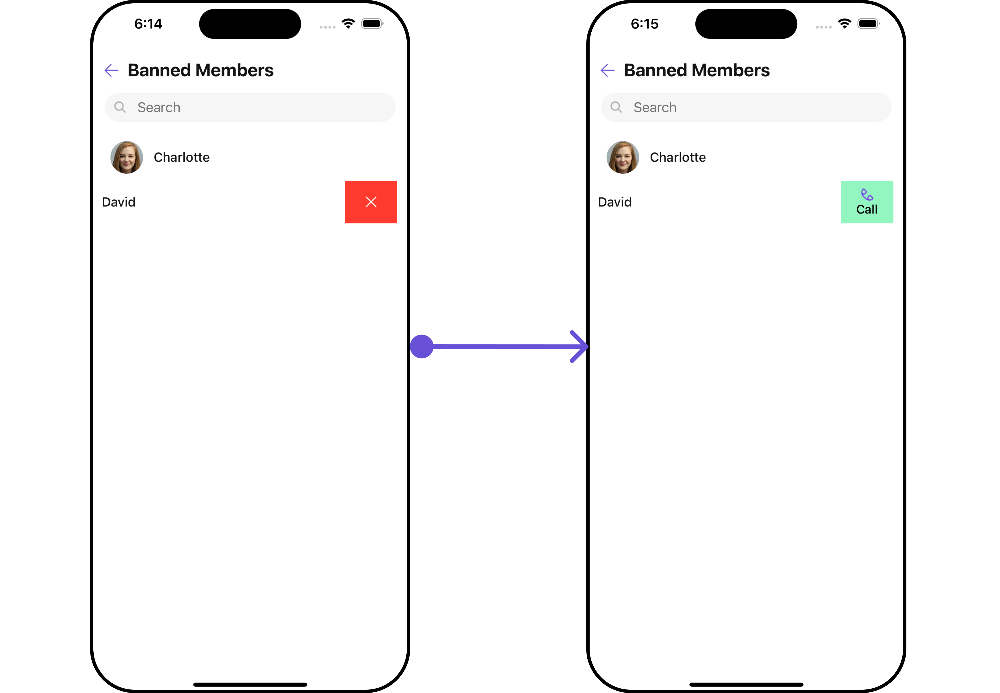

</TabItem>

<TabItem value="android" label="Android">

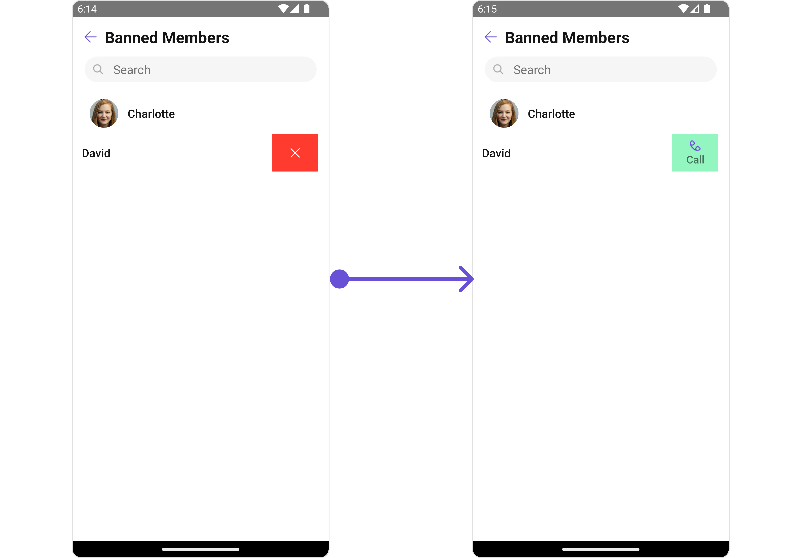

</TabItem>

</Tabs>

<Tabs>

<TabItem value="App.tsx" label="App.tsx">

```tsx
import { CometChat } from "@cometchat/chat-sdk-react-native";
import { CometChatBannedMembers } from "@cometchat/chat-uikit-react-native";

function App(): React.JSX.Element {
  const [group, setGroup] = useState<CometChat.Group | undefined>(undefined);

  const getGroup = async () => {
    const group = await CometChat.getGroup("guid");
    setGroup(group);
  };

  useEffect(() => {
    //login
    getGroup();
  });

  const getCustomOptions = (user: CometChat.User) => {
    const customOption: CometChatOptions = {
      id: "custom id",
      title: "Call",
      icon: Call,
      iconTint: "#7316f5",
      backgroundColor: "#93f5bf",
      onPress: () => console.log("custom action"),
    };

    return [customOption];
  };

  return (
    <>
      {group && (
        <CometChatBannedMembers
          group={group}
          options={getCustomOptions}
        ></CometChatBannedMembers>
      )}
    </>
  );
}
```

</TabItem>
</Tabs>

---

import { Tooltip } from 'react-tooltip'
import 'react-tooltip/dist/react-tooltip.css'

<Tooltip
  id="my-tooltip-html-prop"
  html="Not available in AddMembersConfiguration"
/>
