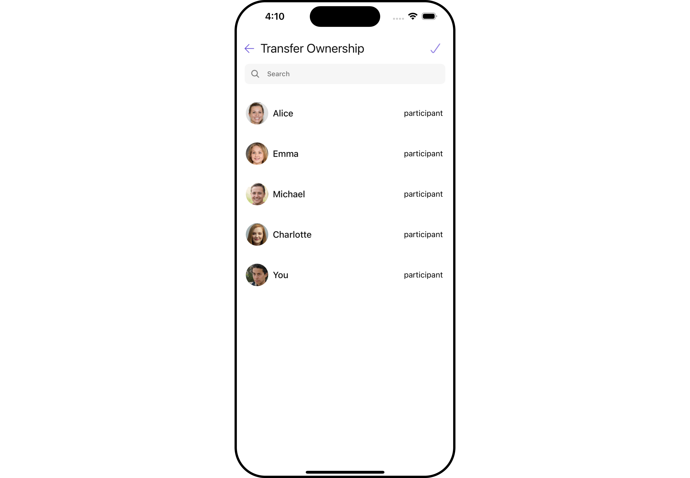
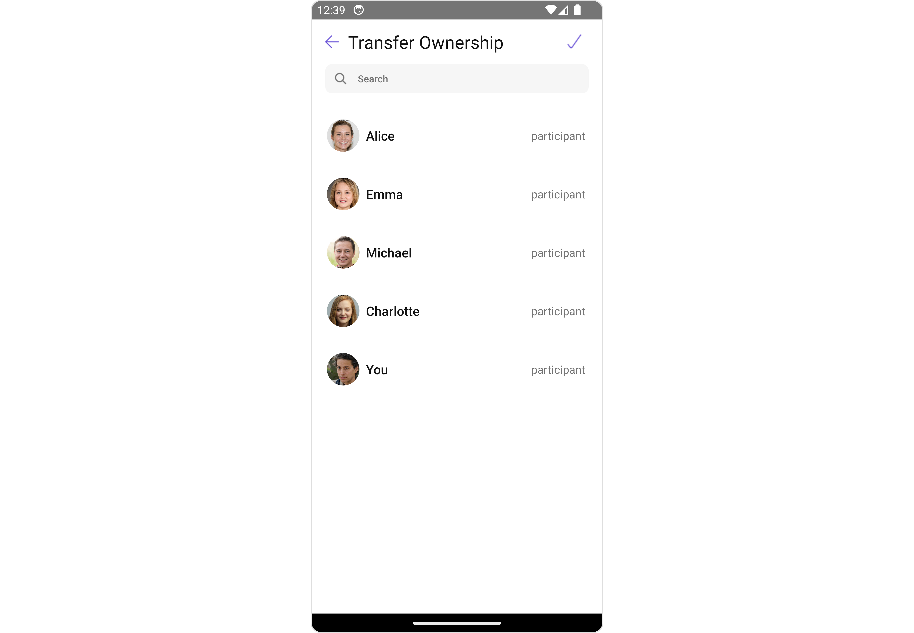
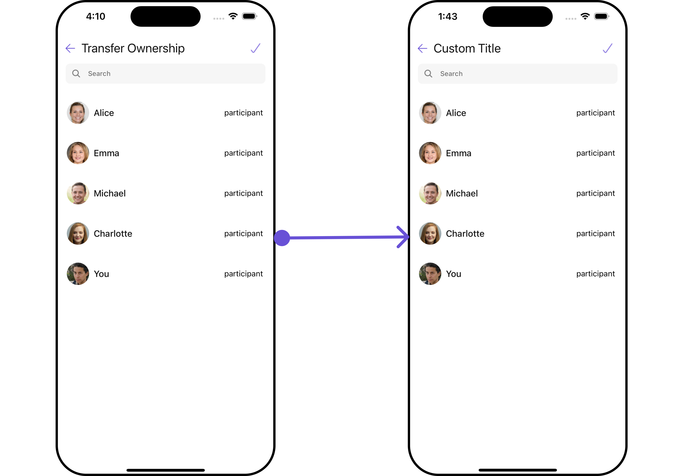
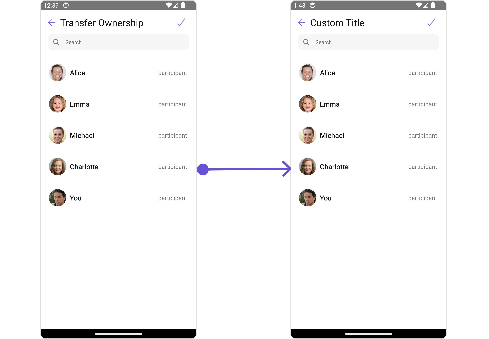
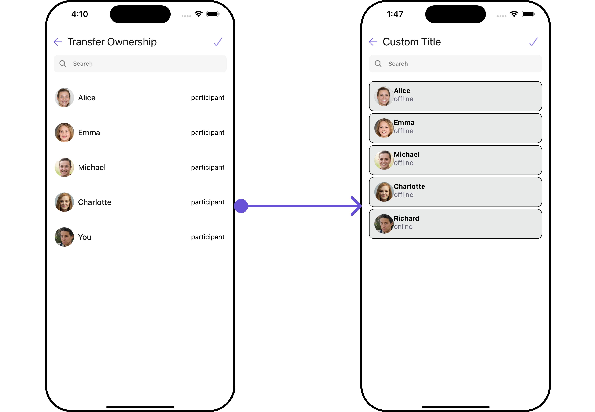
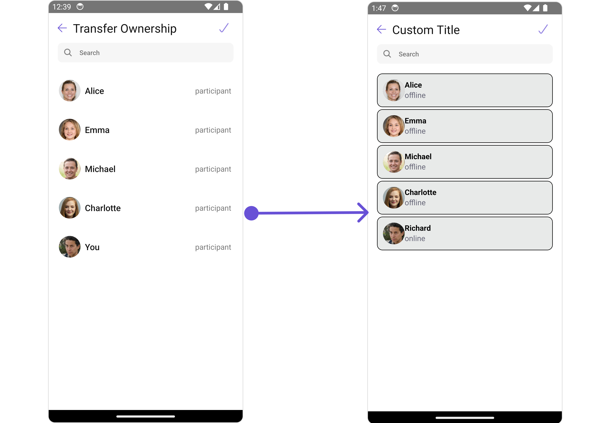
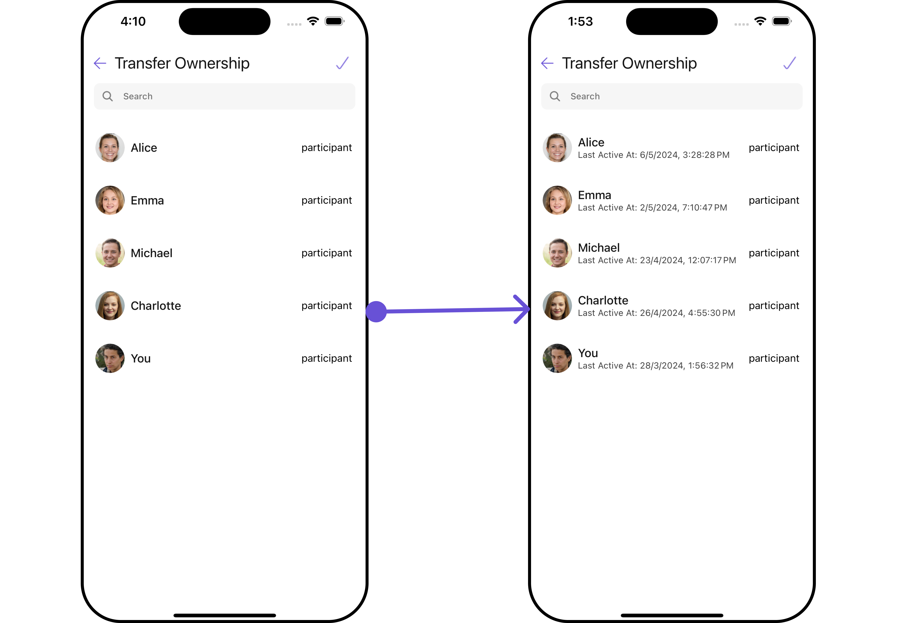
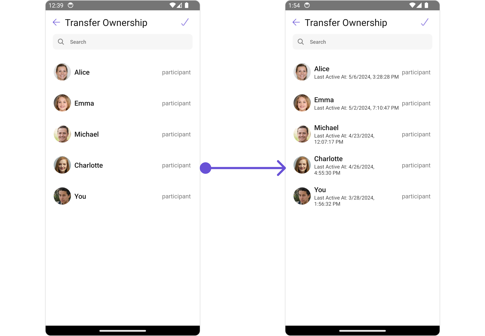
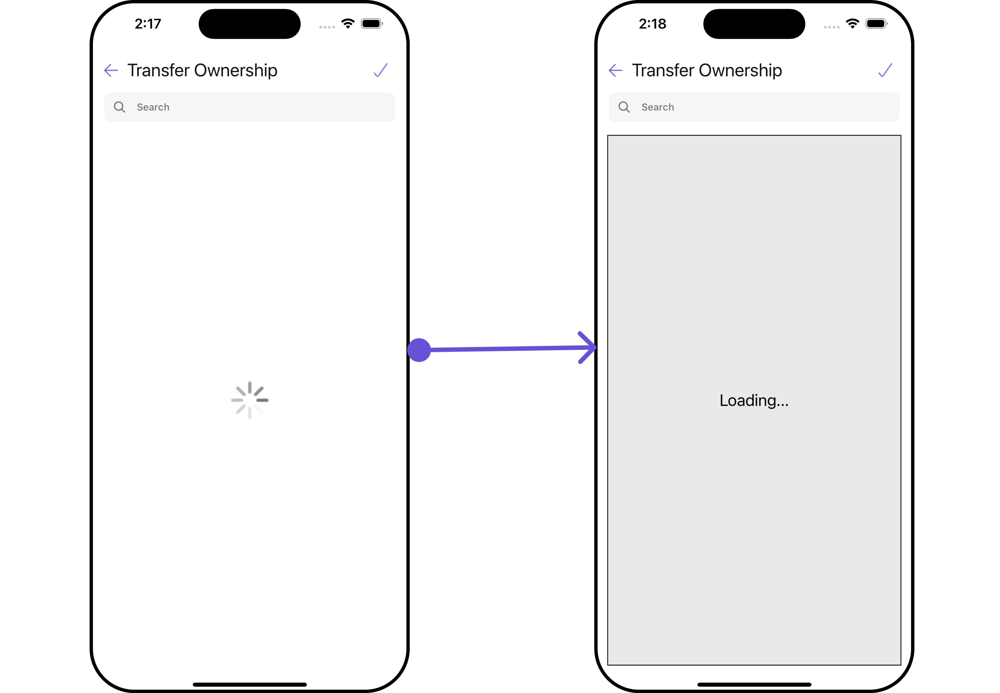
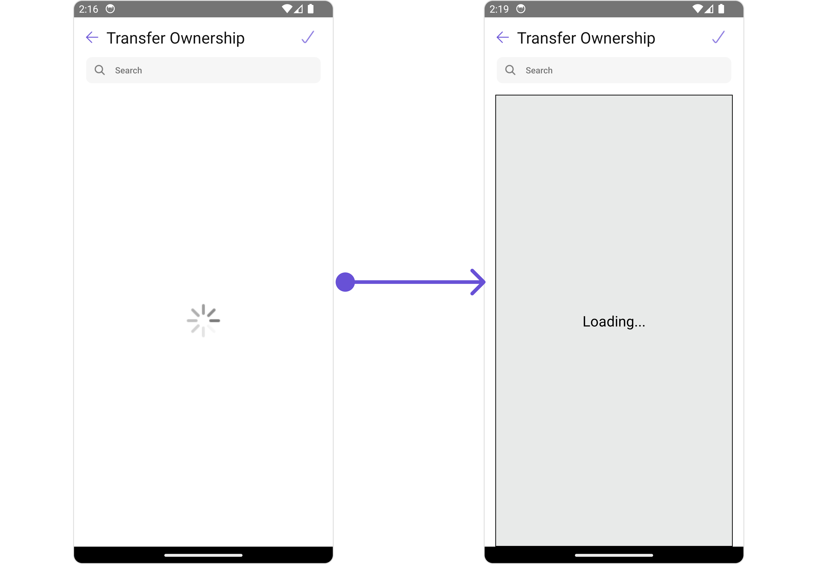

import Tabs from '@theme/Tabs';
import TabItem from '@theme/TabItem';

## Overview

`CometChatTransferOwnership` is a [Component](/ui-kit/react-native/components-overview#components) that allows the current owner or administrator of a group to transfer the ownership rights and administrative control of that group to another user. By transferring ownership, the original owner can designate a new user as the group owner, giving them full control and administrative privileges over the group.

Here are some key points regarding the transfer ownership feature in CometChat:

1. Administrative Control: The current owner or administrator of the group has the authority to initiate the transfer of ownership. This feature is typically available to ensure flexibility and allow smooth transitions of group ownership.
2. New Group Owner: During the transfer process, the current owner can select a specific user from the group members to become the new owner. This new owner will then assume the responsibilities and privileges associated with being the group owner.
3. Administrative Privileges: As the new owner, the designated user will gain full administrative control over the group. They will have the ability to manage group settings, add or remove members, moderate conversations, and perform other administrative actions.
4. Group Continuity: Transferring ownership does not disrupt the existing group or its content. The transfer ensures the continuity of the group while transferring the administrative control to a new owner.

<Tabs>

<TabItem value="iOS" label="iOS">



</TabItem>

<TabItem value="android" label="Android">



</TabItem>

</Tabs>

---

## Usage

### Integration

The following code snippet illustrates how you can directly incorporate the Transfer Ownership component into your Application.

<Tabs>

<TabItem value="App.tsx" label="App.tsx">

```tsx
import { CometChat } from "@cometchat/chat-sdk-react-native";
import { CometChatTransferOwnership } from "@cometchat/chat-uikit-react-native";

function App(): React.JSX.Element {
  const [group, setGroup] = useState<CometChat.Group | undefined>(undefined);

  const getGroup = async () => {
    const group = await CometChat.getGroup("guid");
    setGroup(group);
  };

  useEffect(() => {
    //login
    getGroup();
  });

  return (
    <>
      {group && (
        <CometChatTransferOwnership group={group}></CometChatTransferOwnership>
      )}
    </>
  );
}
```

</TabItem>
</Tabs>

---

### Actions

[Actions](/ui-kit/react/components-overview#actions) dictate how a component functions. They are divided into two types: Predefined and User-defined. You can override either type, allowing you to tailor the behavior of the component to fit your specific needs.

##### 1. onTransferOwnership

The `onTransferOwnership` action is activated when you make a selection and press the done icon. This action takes place after the ownership has been transferred.

This action does not come with any predefined behavior. However, you have the flexibility to override this event and tailor it to suit your needs using the following code snippet.

<Tabs>

<TabItem value="App.tsx" label="App.tsx">

```tsx
import { CometChat } from "@cometchat/chat-sdk-react-native";
import { CometChatTransferOwnership } from "@cometchat/chat-uikit-react-native";

function App(): React.JSX.Element {
  const [group, setGroup] = useState<CometChat.Group | undefined>(undefined);

  const getGroup = async () => {
    const group = await CometChat.getGroup("guid");
    setGroup(group);
  };

  useEffect(() => {
    //login
    getGroup();
  });

  const onTransferOwnershipHandler = (
    group: CometChat.Group,
    ownershipTransferredMember: CometChat.User
  ) => {
    //code
  };

  return (
    <>
      {group && (
        <CometChatTransferOwnership
          group={group}
          onTransferOwnership={onTransferOwnershipHandler}
        ></CometChatTransferOwnership>
      )}
    </>
  );
}
```

</TabItem>
</Tabs>

##### 2. OnBack

`OnBack` is triggered when you click on the back button of the Transfer Ownership component. You can override this action using the following code snippet.

<Tabs>

<TabItem value="App.tsx" label="App.tsx">

```tsx
import { CometChat } from "@cometchat/chat-sdk-react-native";
import { CometChatTransferOwnership } from "@cometchat/chat-uikit-react-native";

function App(): React.JSX.Element {
  const [group, setGroup] = useState<CometChat.Group | undefined>(undefined);

  const getGroup = async () => {
    const group = await CometChat.getGroup("guid");
    setGroup(group);
  };

  useEffect(() => {
    //login
    getGroup();
  });

  const onBackHandler = () => {
    //code
  };

  return (
    <>
      {group && (
        <CometChatTransferOwnership
          group={group}
          onBack={onBackHandler}
        ></CometChatTransferOwnership>
      )}
    </>
  );
}
```

</TabItem>
</Tabs>

##### 3. onError

This action doesn't change the behavior of the component but rather listens for any errors that occur in the Transfer Ownership component.

<Tabs>

<TabItem value="App.tsx" label="App.tsx">

```tsx
import { CometChat } from "@cometchat/chat-sdk-react-native";
import { CometChatTransferOwnership } from "@cometchat/chat-uikit-react-native";

function App(): React.JSX.Element {
  const [group, setGroup] = useState<CometChat.Group | undefined>(undefined);

  const getGroup = async () => {
    const group = await CometChat.getGroup("guid");
    setGroup(group);
  };

  useEffect(() => {
    //login
    getGroup();
  });

  const onErrorHandler = (error: CometChat.CometChatException) => {
    //code
  };

  return (
    <>
      {group && (
        <CometChatTransferOwnership
          group={group}
          onError={onErrorHandler}
        ></CometChatTransferOwnership>
      )}
    </>
  );
}
```

</TabItem>
</Tabs>

---

### Filters

**Filters** allow you to customize the data displayed in a list within a Component. You can filter the list based on your specific criteria, allowing for a more customized. Filters can be applied using RequestBuilders of Chat SDK.

##### 1. GroupMembersRequestBuilder

The [GroupMembersRequestBuilder](/sdk/react-native/retrieve-group-members) enables you to filter and customize the group members list based on available parameters in GroupMembersRequestBuilder. This feature allows you to create more specific and targeted queries when fetching groups. The following are the parameters available in [GroupMembersRequestBuilder](/sdk/react-native/retrieve-group-members)

| Methods              | Type                | Description                                                                                       |
| -------------------- | ------------------- | ------------------------------------------------------------------------------------------------- |
| **setLimit**         | number              | sets the number of group members that can be fetched in a single request, suitable for pagination |
| **setSearchKeyword** | string              | used for fetching group members matching the passed string                                        |
| **setScopes**        | Array&lt;string&gt; | used for fetching group members based on multiple scopes                                          |

**Example**

In the example below, we are applying a filter to the Group Members by setting the limit to two and setting the scope to show only admin and moderator.

<Tabs>

<TabItem value="App.tsx" label="App.tsx">

```tsx
import { CometChat } from "@cometchat/chat-sdk-react-native";
import { CometChatTransferOwnership } from "@cometchat/chat-uikit-react-native";

function App(): React.JSX.Element {
  const [group, setGroup] = useState<CometChat.Group | undefined>(undefined);
  let groupMemberRequestBuilder;

  const getGroup = async () => {
    const group = await CometChat.getGroup("mrc-uid");
    groupMemberRequestBuilder = new CometChat.GroupMembersRequestBuilder(
      group.getGuid()
    ).setScopes(["admin"]);
    setGroup(group);
  };

  useEffect(() => {
    //login
    getGroup();
  });

  const onErrorHandler = (error: CometChat.CometChatException) => {
    //code
  };

  return (
    <>
      {group && (
        <CometChatTransferOwnership
          group={group}
          groupMemberRequestBuilder={groupMemberRequestBuilder}
        ></CometChatTransferOwnership>
      )}
    </>
  );
}
```

</TabItem>
</Tabs>

##### 2. SearchRequestBuilder

The SearchRequestBuilder uses [GroupMembersRequestBuilder](/sdk/react-native/retrieve-group-members) enables you to filter and customize the search list based on available parameters in GroupMembersRequestBuilder.
This feature allows you to keep uniformity between the displayed Group Members List and searched Group Members List.

**Example**

<Tabs>

<TabItem value="App.tsx" label="App.tsx">

```tsx
import { CometChat } from "@cometchat/chat-sdk-react-native";
import { CometChatTransferOwnership } from "@cometchat/chat-uikit-react-native";

function App(): React.JSX.Element {
  const [group, setGroup] = useState<CometChat.Group | undefined>(undefined);
  let searchRequestBuilder;

  const getGroup = async () => {
    const group = await CometChat.getGroup("mrc-uid");
    searchRequestBuilder = new CometChat.GroupMembersRequestBuilder(
      group.getGuid()
    )
      .setScopes(["admin"])
      .setSearchKeyword("some-search-keyword");
    setGroup(group);
  };

  useEffect(() => {
    //login
    getGroup();
  });

  return (
    <>
      {group && (
        <CometChatTransferOwnership
          group={group}
          groupMemberRequestBuilder={searchRequestBuilder}
        ></CometChatTransferOwnership>
      )}
    </>
  );
}
```

</TabItem>
</Tabs>

---

---

### Events

[Events](/ui-kit/react/components-overview#events) are emitted by a `Component`. By using event you can extend existing functionality. Being global events, they can be applied in Multiple Locations and are capable of being Added or Removed.

Events emitted by the Add Members component is as follows.

| Event                  | Description                                                   |
| ---------------------- | ------------------------------------------------------------- |
| **ccOwnershipChanged** | Triggers when the group ownership is successfully transferred |

<Tabs>
<TabItem value="js" label="Adding Listeners">

```js
import { CometChatUIEventHandler } from "@cometchat/chat-uikit-react-native";

CometChatUIEventHandler.addGroupListener("GROUP_LISTENER_ID", {
  ccOwnershipChanged: ({ group, message }) => {
    //code
  },
});
```

</TabItem>

</Tabs>

---

<Tabs>
<TabItem value="js" label="Removing Listeners">

```js
import { CometChatUIEventHandler } from "@cometchat/chat-uikit-react-native";

CometChatUIEventHandler.removeGroupListener("GROUP_LISTENER_ID");
```

</TabItem>
</Tabs>

---

## Customization

To fit your app's design requirements, you can customize the appearance of the Groups component. We provide exposed methods that allow you to modify the experience and behavior according to your specific needs.

### Style

Using **Style** you can **customize** the look and feel of the component in your app, These parameters typically control elements such as the **color**, **size**, **shape**, and **fonts** used within the component.

##### 1. GroupMember Style

You can set the `GroupMemberStyle` to the Transfer Ownership Component to customize the styling. For further insights on `GroupMember` Styles [refer](./group-members)

<Tabs>

<TabItem value="App.tsx" label="App.tsx">

```tsx
import { CometChat } from "@cometchat/chat-sdk-react-native";
import {
  CometChatTransferOwnership,
  GroupMembersStyleInterface,
} from "@cometchat/chat-uikit-react-native";

function App(): React.JSX.Element {
  const [group, setGroup] = useState<CometChat.Group | undefined>(undefined);

  const getGroup = async () => {
    const group = await CometChat.getGroup("mrc-uid");
    setGroup(group);
  };

  useEffect(() => {
    //login
    getGroup();
  });

  const groupMemberStyle: GroupMembersStyleInterface = {
    titleColor: "red",
    backgroundColor: "#d2cafa",
  };

  return (
    <>
      {group && (
        <CometChatTransferOwnership
          group={group}
          groupMemberStyle={groupMemberStyle}
        ></CometChatTransferOwnership>
      )}
    </>
  );
}
```

</TabItem>
</Tabs>

##### 2. Avatar Style

To apply customized styles to the `Avatar` component in the Banned Members Component, you can use the following code snippet. For further insights on `Avatar` Styles [refer](./avatar)

<Tabs>

<TabItem value="App.tsx" label="App.tsx">

```tsx
import { CometChat } from "@cometchat/chat-sdk-react-native";
import {
  CometChatTransferOwnership,
  AvatarStyleInterface,
} from "@cometchat/chat-uikit-react-native";

function App(): React.JSX.Element {
  const [group, setGroup] = useState<CometChat.Group | undefined>(undefined);

  const getGroup = async () => {
    const group = await CometChat.getGroup("mrc-uid");
    setGroup(group);
  };

  useEffect(() => {
    //login
    getGroup();
  });

  const avatarStyle: AvatarStyleInterface = {
    outerViewSpacing: 5,
    outerView: {
      borderWidth: 2,
      borderStyle: "dotted",
      borderColor: "blue",
    },
    border: borderStyle,
  };

  return (
    <>
      {group && (
        <CometChatTransferOwnership
          group={group}
          avatarStyle={avatarStyle}
        ></CometChatTransferOwnership>
      )}
    </>
  );
}
```

</TabItem>
</Tabs>

##### 3. ListItem Style

To apply customized styles to the `ListItemStyle` component in the `Banned Members` Component, you can use the following code snippet. For further insights on `ListItemStyle` Styles [refer](./list-item)

<Tabs>

<TabItem value="App.tsx" label="App.tsx">

```tsx
import { CometChat } from "@cometchat/chat-sdk-react-native";
import {
  CometChatTransferOwnership,
  ListItemStyleInterface,
} from "@cometchat/chat-uikit-react-native";

function App(): React.JSX.Element {
  const [group, setGroup] = useState<CometChat.Group | undefined>(undefined);

  const getGroup = async () => {
    const group = await CometChat.getGroup("guid");
    setGroup(group);
  };

  useEffect(() => {
    //login
    getGroup();
  });

  const listItemStyle: ListItemStyleInterface = {
    titleColor: "red",
    backgroundColor: "#d2cafa",
  };

  return (
    <>
      {group && (
        <CometChatTransferOwnership
          group={group}
          listItemStyle={listItemStyle}
        ></CometChatTransferOwnership>
      )}
    </>
  );
}
```

</TabItem>
</Tabs>

##### 4. StatusIndicator Style

To apply customized styles to the Status Indicator component in the Banned Members Component, You can use the following code snippet. For further insights on Status Indicator Styles [refer](./status-indicator)

<Tabs>

<TabItem value="App.tsx" label="App.tsx">

```tsx
import { CometChat } from "@cometchat/chat-sdk-react-native";
import {
  CometChatTransferOwnership,
  StatusIndicatorStyleInterface,
} from "@cometchat/chat-uikit-react-native";

function App(): React.JSX.Element {
  const [group, setGroup] = useState<CometChat.Group | undefined>(undefined);

  const getGroup = async () => {
    const group = await CometChat.getGroup("guid");
    setGroup(group);
  };

  useEffect(() => {
    //login
    getGroup();
  });

  const statusIndicatorStyle: StatusIndicatorStyleInterface = {
    backgroundColor: "grey",
  };

  return (
    <>
      {group && (
        <CometChatTransferOwnership
          group={group}
          statusIndicatorStyle={statusIndicatorStyle}
        ></CometChatTransferOwnership>
      )}
    </>
  );
}
```

</TabItem>
</Tabs>

---

### Functionality

These are a set of small functional customizations that allow you to fine-tune the overall experience of the component. With these, you can change text, set custom icons, and toggle the visibility of UI elements.

<Tabs>

<TabItem value="App.tsx" label="App.tsx">

```tsx
import { CometChat } from "@cometchat/chat-sdk-react-native";
import { CometChatTransferOwnership } from "@cometchat/chat-uikit-react-native";

function App(): React.JSX.Element {
  const [group, setGroup] = useState<CometChat.Group | undefined>(undefined);

  const getGroup = async () => {
    const group = await CometChat.getGroup("guid");
    setGroup(group);
  };

  useEffect(() => {
    //login
    getGroup();
  });

  return (
    <>
      {group && (
        <CometChatTransferOwnership
          group={group}
          title="Custom Title"
        ></CometChatTransferOwnership>
      )}
    </>
  );
}
```

</TabItem>
</Tabs>

<Tabs>

<TabItem value="iOS" label="iOS">



</TabItem>

<TabItem value="android" label="Android">



</TabItem>

</Tabs>

---

### Advance

For advanced-level customization, you can set custom views to the component. This lets you tailor each aspect of the component to fit your exact needs and application aesthetics. You can create and define your views, layouts, and UI elements and then incorporate those into the component.

---

#### ListItemView

With this property, you can assign a custom `ListItemView` to the Transfer Ownership Component.

**Example**

<Tabs>

<TabItem value="iOS" label="iOS">



</TabItem>

<TabItem value="android" label="Android">



</TabItem>

</Tabs>

<Tabs>

<TabItem value="App.tsx" label="App.tsx">

```tsx
import { CometChat } from "@cometchat/chat-sdk-react-native";
import { CometChatTransferOwnership } from "@cometchat/chat-uikit-react-native";

function App(): React.JSX.Element {
  const [group, setGroup] = useState<CometChat.Group | undefined>(undefined);

  const getGroup = async () => {
    const group = await CometChat.getGroup("guid");
    setGroup(group);
  };

  useEffect(() => {
    //login
    getGroup();
  });

  const viewStyle: StyleProp<ViewStyle> = {
    flex: 1,
    flexDirection: "row",
    alignItems: "flex-start",
    padding: 10,
    borderColor: "black",
    borderWidth: 1,
    backgroundColor: "#E8EAE9",
    borderRadius: 10,
    margin: 2,
  };

  const getListItemView = (user: any) => {
    return (
      <View style={viewStyle}>
        <CometChatAvatar
          image={user.avatar ? { uri: user.avatar } : undefined}
          name={user.name}
        />

        <View>
          <Text style={{ color: "black", fontWeight: "bold" }}>
            {user.name}
          </Text>
          <Text style={{ color: "#667" }}>{user.status}</Text>
        </View>
      </View>
    );
  };

  return (
    <>
      {group && (
        <CometChatTransferOwnership
          group={group}
          title="Custom Title"
          ListItemView={getListItemView}
        ></CometChatTransferOwnership>
      )}
    </>
  );
}
```

</TabItem>
</Tabs>

---

#### SubtitleView

You can customize the `SubtitleView` view for each banned members to meet your requirements

<Tabs>

<TabItem value="iOS" label="iOS">



</TabItem>

<TabItem value="android" label="Android">



</TabItem>

</Tabs>

<Tabs>

<TabItem value="App.tsx" label="App.tsx">

```tsx
import { CometChat } from "@cometchat/chat-sdk-react-native";
import { CometChatTransferOwnership } from "@cometchat/chat-uikit-react-native";

function App(): React.JSX.Element {
  const [group, setGroup] = useState<CometChat.Group | undefined>(undefined);

  const getGroup = async () => {
    const group = await CometChat.getGroup("guid");
    setGroup(group);
  };

  useEffect(() => {
    //login
    getGroup();
  });

  const getSubtitleView = (user) => {
    return (
      <Text
        style={{
          fontSize: 12,
          color: theme.palette.getAccent800(),
        }}
      >
        Last Active At:{" "}
        {user?.lastActiveAt ? formatTime(user?.lastActiveAt) : "--"}
      </Text>
    );
  };

  const getSubtitleView = (user) => {
    return (
      <Text
        style={{
          fontSize: 12,
          color: theme.palette.getAccent800(),
        }}
      >
        Last Active At:{" "}
        {user?.lastActiveAt ? formatTime(user?.lastActiveAt) : "--"}
      </Text>
    );
  };

  return (
    <>
      {group && (
        <CometChatTransferOwnership
          group={group}
          SubtitleView={getSubtitleView}
        ></CometChatTransferOwnership>
      )}
    </>
  );
}
```

</TabItem>
</Tabs>

#### LoadingStateView

You can set a custom loader view using `LoadingStateView` to match the loading view of your app.

<Tabs>

<TabItem value="iOS" label="iOS">



</TabItem>

<TabItem value="android" label="Android">



</TabItem>

</Tabs>

<Tabs>

<TabItem value="App.tsx" label="App.tsx">

```tsx
import { CometChat } from "@cometchat/chat-sdk-react-native";
import { CometChatTransferOwnership } from "@cometchat/chat-uikit-react-native";

function App(): React.JSX.Element {
  const [group, setGroup] = useState<CometChat.Group | undefined>(undefined);

  const getGroup = async () => {
    const group = await CometChat.getGroup("guid");
    setGroup(group);
  };

  useEffect(() => {
    //login
    getGroup();
  });

  const loadingViewStyle: StyleProp<ViewStyle> = {
    flex: 1,
    alignItems: "center",
    justifyContent: "center",
    padding: 10,
    borderColor: "black",
    borderWidth: 1,
    backgroundColor: "#E8EAE9",
  };

  const getLoadingStateView = () => {
    return (
      <View style={loadingViewStyle}>
        <Text style={{ fontSize: 20, color: "black" }}>Loading...</Text>
      </View>
    );
  };

  return (
    <>
      {group && (
        <CometChatTransferOwnership
          group={group}
          LoadingStateView={getLoadingStateView}
        ></CometChatTransferOwnership>
      )}
    </>
  );
}
```

</TabItem>
</Tabs>

#### EmptyStateView

You can set a custom `EmptyStateView` using `EmptyStateView` to match the empty view of your app.

<Tabs>

<TabItem value="App.tsx" label="App.tsx">

```tsx
import { CometChat } from "@cometchat/chat-sdk-react-native";
import { CometChatTransferOwnership } from "@cometchat/chat-uikit-react-native";

function App(): React.JSX.Element {
  const [group, setGroup] = useState<CometChat.Group | undefined>(undefined);

  const getGroup = async () => {
    const group = await CometChat.getGroup("guid");
    setGroup(group);
  };

  useEffect(() => {
    //login
    getGroup();
  });

  const searchRequestBuilder = new CometChat.UsersRequestBuilder()
    .setLimit(100)
    .setSearchKeyword("does-not-exist");

  const emptyViewStyle: StyleProp<ViewStyle> = {
    flex: 1,
    alignItems: "center",
    justifyContent: "center",
    padding: 10,
    borderColor: "black",
    borderWidth: 1,
    backgroundColor: "#E8EAE9",
  };

  const getEmptyStateView = () => {
    return (
      <View style={emptyViewStyle}>
        <Text style={{ fontSize: 80, color: "black" }}>Empty</Text>
      </View>
    );
  };

  return (
    <>
      {group && (
        <CometChatTransferOwnership
          group={group}
          searchRequestBuilder={searchRequestBuilder}
          EmptyStateView={getEmptyStateView}
        ></CometChatTransferOwnership>
      )}
    </>
  );
}
```

</TabItem>
</Tabs>

---
