import Tabs from '@theme/Tabs';
import TabItem from '@theme/TabItem';

## Overview

The Messages is a [Composite Component](/ui-kit/react-native/components-overview#components) that manages messages for users and groups.

<Tabs>

<TabItem value="iOS" label="iOS">

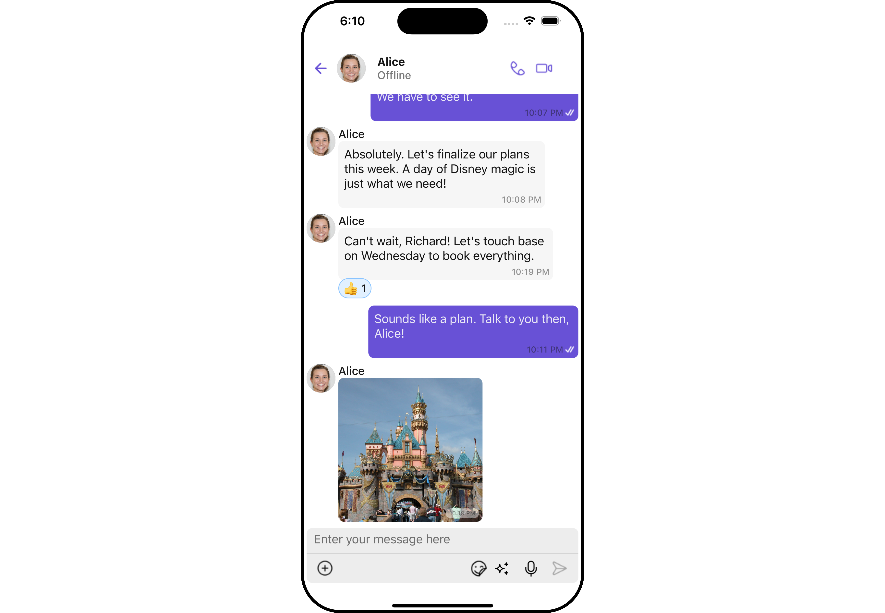

</TabItem>

<TabItem value="android" label="Android">

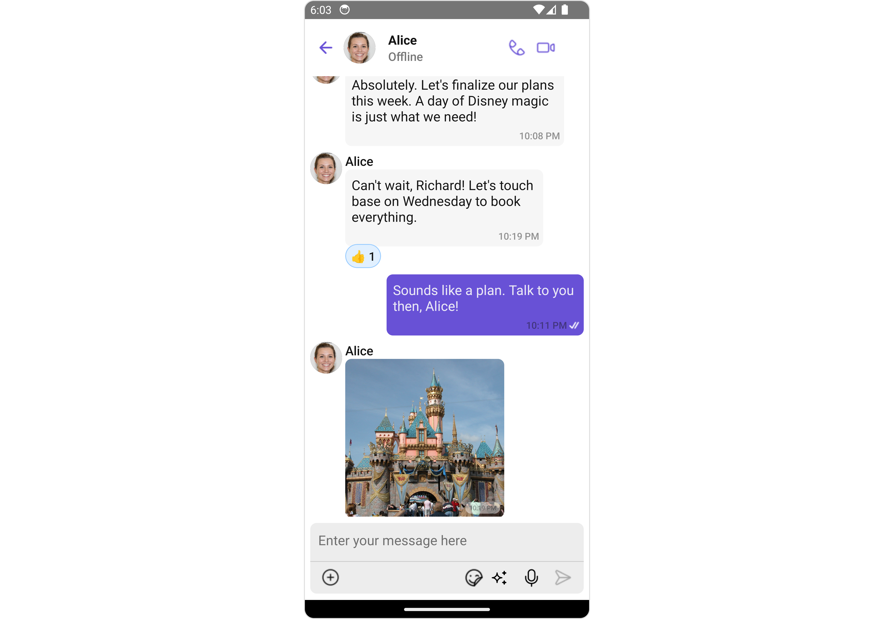

</TabItem>

</Tabs>

The Messages component is composed of three individual components, [MessageHeader](./message-header), [MessageList](./message-list), and [MessageComposer](./message-composer). In addition, the Messages component also navigates to the [Details](/ui-kit/react-native/group-details) and [ThreadedMessages](/ui-kit/react-native/threaded-messages) components.

| Components                                                 | Description                                                                                                                                                                                              |
| ---------------------------------------------------------- | -------------------------------------------------------------------------------------------------------------------------------------------------------------------------------------------------------- |
| [MessageHeader](./message-header)                          | `CometChatMessageHeader` displays the `User` or `Group` information using CometChat SDK's `User` or `Group object.` It also shows the typing indicator when the user starts typing in `MessageComposer`. |
| [MessageList](./message-list)                              | `CometChatMessageList` is one of the core UI components. It displays a list of messages and handles real-time operations.                                                                                |
| [MessageComposer](./message-composer)                      | `CometChatMessageComposer` is an independent and critical component that allows users to compose and send various types of messages includes text, image, video and custom messages.                     |
| [Details](/ui-kit/react-native/group-details)              | `CometChatDetails` is a component that displays all the available options available for `Users` & `Groups`                                                                                               |
| [ThreadedMessages](/ui-kit/react-native/threaded-messages) | `CometChatThreadedMessages` is a component that displays all replies made to a particular message in a conversation.                                                                                     |

## Usage

### Integration

The following code snippet illustrates how you can directly incorporate the Messages component.

<Tabs>
<TabItem value="ts" label="App.tsx">

```tsx
import { CometChat } from "@cometchat/chat-sdk-react-native";
import { CometChatMessages } from "@cometchat/chat-uikit-react-native";

function App(): React.JSX.Element {
  const [chatUser, setChatUser] = React.useState<CometChat.User>();
  React.useEffect(() => {
    CometChat.getUser("uid").then((user) => {
      setChatUser(user);
    });
  }, []);

  return <>{chatUser && <CometChatMessages user={chatUser} />}</>;
}
```

</TabItem>
</Tabs>

---

### Actions

[Actions](/ui-kit/react-native/components-overview#actions) dictate how a component functions. They are divided into two types: Predefined and User-defined. You can override either type, allowing you to tailor the behavior of the component to fit your specific needs.

The Messages component does not have its actions. However, since it's a [Composite Component](/ui-kit/react-native/components-overview#components), you can use the actions of its components by utilizing the [Configurations](#configuration) object of each component.

**Example**

In this example, we are employing the [onThreadRepliesPress](/ui-kit/react-native/message-list#1-onthreadrepliespress) action from the MessageList Component through the MessageListConfiguration object.

<Tabs>
<TabItem value="ts" label="App.tsx">

```tsx
import { CometChat } from "@cometchat/chat-sdk-react-native";
import {
  CometChatMessages,
  MessageListConfigurationInterface,
} from "@cometchat/chat-uikit-react-native";

function App(): React.JSX.Element {
  const [chatUser, setChatUser] = React.useState<CometChat.User>();
  React.useEffect(() => {
    CometChat.getUser("uid").then((user) => {
      setChatUser(user);
    });
  }, []);

  const getOnThreadRepliesPress = () => {
    console.log("Thread replies pressed");
  };

  const messageListConfiguration: MessageListConfigurationInterface = {
    onThreadRepliesPress: getOnThreadRepliesPress,
  };

  return (
    <>
      {chatUser && (
        <CometChatMessages
          user={chatUser}
          messageListConfiguration={messageListConfiguration}
        />
      )}
    </>
  );
}
```

</TabItem>
</Tabs>

---

<Tabs>

<TabItem value="iOS" label="iOS">

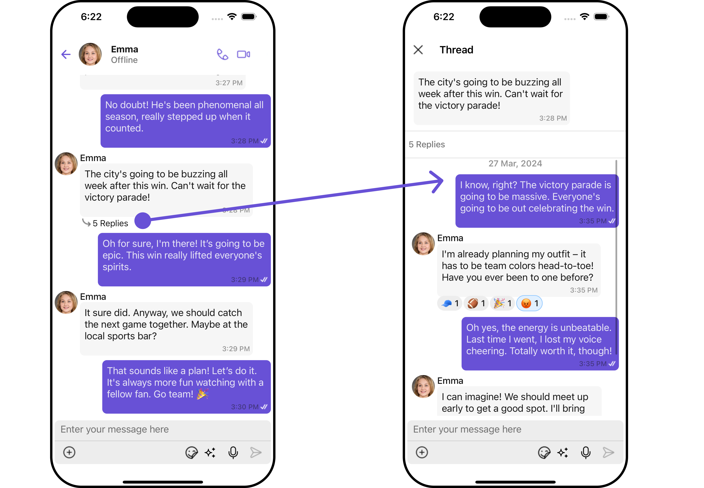

</TabItem>

<TabItem value="android" label="Android">


</TabItem>

</Tabs>

:::warning

The Messages Component overrides the [onThreadRepliesPress](/ui-kit/react-native/message-list#1-onthreadrepliespress) action to navigate to the [ThreadedMessages](/ui-kit/react-native/threaded-messages) component. If you override `onThreadRepliesPress`, it will also override the default behavior of the Messages Component.

:::

### Filters

**Filters** allow you to customize the data displayed in a list within a Component. You can filter the list based on your specific criteria, allowing for a more customized. Filters can be applied using RequestBuilders of Chat SDK.

The Messages component does not have its filters. But as it is a [Composite Component](/ui-kit/react-native/components-overview#components), you can use the filters of its components by using the [Configurations](#configuration) object of each component. For more details on the filters of its components, please refer to [MessageList Filters](/ui-kit/react-native/message-list#filters).

**Example**

In this example, we're applying the MessageList Component filter to the Messages Component using `MessageListConfiguration`.

<Tabs>
<TabItem value="tsx" label="App.tsx">

```jsx

import {CometChat} from '@cometchat/chat-sdk-react-native';
import {CometChatMessages, MessageListConfigurationInterface,  } from '@cometchat/chat-uikit-react-native';

function App(): React.JSX.Element {
  const [chatUser, setChatUser] = React.useState<CometChat.User>();
  React.useEffect(() => {
      CometChat.getUser("uid").then((user) => {
          setChatUser(user);
      })
  }, [])

  const messageListConfiguration : MessageListConfigurationInterface = {
    onThreadRepliesPress: getOnThreadRepliesClick,
    messageRequestBuilder: new CometChat.MessagesRequestBuilder().setSearchKeyword("Your Search Keyword")
                           .setUID("uid").setLimit(10)
  }

  return (
    <>
       { chatUser && <CometChatMessages
         user={chatUser}
         messageListConfiguration={messageListConfiguration}
         /> }
    </>
  );
}
```

</TabItem>
</Tabs>

---

### Events

[Events](/ui-kit/react-native/components-overview#events) are emitted by a `Component`. By using event you can extend existing functionality. Being global events, they can be applied in Multiple Locations and are capable of being Added or Removed.

---

## Customization

To fit your app's design requirements, you can customize the appearance of the conversation component. We provide exposed methods that allow you to modify the experience and behavior according to your specific needs.

### Style

Using Style you can customize the look and feel of the component in your app, These parameters typically control elements such as the color, size, shape, and fonts used within the component.

##### 1. Messages Style

You can customize the appearance of the Messages Component by applying the MessagesStyle to it using the following code snippet.

<Tabs>
<TabItem value="js" label="App.tsx">

```tsx
import { CometChat } from "@cometchat/chat-sdk-react-native";
import {
  CometChatMessages,
  MessageListConfigurationInterface,
  MessageStyleInterface,
} from "@cometchat/chat-uikit-react-native";

function App(): React.JSX.Element {
  const [chatUser, setChatUser] = React.useState<CometChat.User>();

  React.useEffect(() => {
    CometChat.getUser("uid").then((user) => {
      setChatUser(user);
    });
  }, []);

  const messagesStyle: MessageStyleInterface = {
    backgroundColor: "grey",
  };

  return (
    <>
      {chatUser && (
        <CometChatMessages messagesStyle={messagesStyle} user={chatUser} />
      )}
    </>
  );
}
```

</TabItem>
</Tabs>

List of properties exposed by MessagesStyle

| Prop            | Type                 | Description                            |
| --------------- | -------------------- | -------------------------------------- |
| backgroundColor | string               | Sets the background color for messages |
| borderRadius    | number               | Sets the border radius for messages    |
| border          | BorderStyleInterface | Sets the border for messages           |
| height          | string &#124; number | Sets the height for messages           |
| width           | string &#124; number | Sets the width for messages            |

##### 2. Component's Styles

Being a [Composite component](/ui-kit/react-native/components-overview#composite-components), the Messages Component allows you to customize the styles of its components using their respective Configuration objects.

For a list of all available properties, refer to each component's styling documentation: [MesssageHeader Styles](/ui-kit/react-native/message-header#style), [MessageList Styles](/ui-kit/react-native/message-list#style), [MessageComposer Styles](/ui-kit/react-native/message-composer#style), [Details Styles](/ui-kit/react-native/group-details), [ThreadMessages Styles](/ui-kit/react-native/threaded-messages).

**Example**

In this example, we are creating `MessageListStyle` and `MessageComposerStyle` and then applying them to the Messages Component using `MessageListConfiguration` and `MessageComposerConfiguration`.

<Tabs>
<TabItem value="js" label="App.tsx">

```tsx
import { CometChat } from "@cometchat/chat-sdk-react-native";
import {
  CometChatMessages,
  MessageListConfigurationInterface,
  MessageStyleInterface,
} from "@cometchat/chat-uikit-react-native";

function App(): React.JSX.Element {
  const [chatUser, setChatUser] = React.useState<CometChat.User>();
  React.useEffect(() => {
    CometChat.getUser("uid").then((user) => {
      setChatUser(user);
    });
  }, []);

  const messageListStyle: MessageStyleInterface = {
    backgroundColor: "transparent",
    height: "100%",
    width: "100%",
  };

  const messageComposerStyle: MessageComposerStyleInterface = {
    backgroundColor: "#fffcff",
    inputBackground: "#e2d5e8",
    textColor: "#ff299b",
    sendIconTint: "#ff0088",
  };

  const messageListConfiguration: MessageListConfigurationInterface = {
    messageListStyle: messageListStyle,
  };

  const messageComposerConfiguration: MessageComposerConfigurationInterface = {
    messageComposerStyle: messageComposerStyle,
  };

  return (
    <>
      {chatUser && (
        <CometChatMessages
          messagesStyle={messagesStyle}
          user={chatUser}
          messageListConfiguration={messageListConfiguration}
          messageComposerConfiguration={messageComposerConfiguration}
        />
      )}
    </>
  );
}
```

</TabItem>
</Tabs>

---

### Functionality

These are a set of small functional customizations that allow you to fine-tune the overall experience of the component. With these, you can change text, set custom icons, and toggle the visibility of UI elements.

<Tabs>
<TabItem value="js" label="App.tsx">

```tsx
import { CometChat } from "@cometchat/chat-sdk-react-native";
import {
  CometChatMessages,
  MessageListConfigurationInterface,
  MessageStyleInterface,
} from "@cometchat/chat-uikit-react-native";

function App(): React.JSX.Element {
  const [chatUser, setChatUser] = React.useState<CometChat.User>();
  React.useEffect(() => {
    CometChat.getUser("uid").then((user) => {
      setChatUser(user);
    });
  }, []);

  const messageListStyle: MessageStyleInterface = {
    backgroundColor: "transparent",
    height: "100%",
    width: "100%",
  };

  const messageComposerStyle: MessageComposerStyleInterface = {
    backgroundColor: "#fffcff",
    inputBackground: "#e2d5e8",
    textColor: "#ff299b",
    sendIconTint: "#ff0088",
  };

  const messageListConfiguration: MessageListConfigurationInterface = {
    messageListStyle: messageListStyle,
  };

  const messageComposerConfiguration: MessageComposerConfigurationInterface = {
    messageComposerStyle: messageComposerStyle,
  };

  return (
    <>
      {chatUser && (
        <CometChatMessages
          user={chatUser}
          hideDetails={true}
          disableTyping={true}
        />
      )}
    </>
  );
}
```

</TabItem>
</Tabs>

Below is a list of customizations along with corresponding code snippets
| Property | Description | Code |
| -------------------------------------------------------------------------------------------------------- | ---------------------------------------------------------------------------------------------------------------------------------- | ----------------------------------------------------------- |
| **User** | Used to pass user object of which header specific details will be shown | `user={chatUser!}` |
| **Group**| Used to pass group object of which header specific details will be shown | `group={chatGroup!}` |
| **Hide MessageComposer** | Used to toggle visibility for CometChatMessageComposer, default false | `hideMessageComposer={true}` |
| **Hide MessageHeader** | Used to toggle visibility for CometChatMessageHeader, default false | `hideMessageHeader={true}` |
| **Disable Typing** | Used to toggle functionality for showing typing indicator and also enable/disable sending message delivery/read receipts | `disableTyping={true}` |
| **Disable SoundForMessages** | Used to toggle sound for messages | `disableSoundForMessages={true}` |
| **CustomSoundForIncomingMessages** | Used to set custom sound asset's path for incoming messages | `customSoundForIncomingMessages="your custom sound for incoming call"` |
| **CustomSoundForOutgoingMessages** | Used to set custom sound asset's path for outgoing messages | `customSoundForOutgoingMessages="your custom sound for outgoing call"` |
| **Hide Details** | Used to toggle visibility for details icon in CometChatMessageHeader | `hideDetails={true}` |

### Advanced

For advanced-level customization, you can set custom views to the component. This lets you tailor each aspect of the component to fit your exact needs and application aesthetics. You can create and define your views, layouts, and UI elements and then incorporate those into the component.

---

#### MessageHeaderView

You can set your custom message header view using the `` method. But keep in mind, by using this you will override the default message header functionality.

<Tabs>
<TabItem value="tsx" label="App.tsx">

```tsx
import { CometChat } from "@cometchat/chat-sdk-react-native";
import {
  CometChatMessages,
  CometChatAvatar,
} from "@cometchat/chat-uikit-react-native";
import React from "react";
import { View, Text } from "react-native";

function App(): React.JSX.Element {
  const [chatUser, setChatUser] = React.useState<CometChat.User | undefined>();

  React.useEffect(() => {
    CometChat.getUser("uid").then((user) => {
      setChatUser(user);
    });
  }, []);

  const customHeaderView = ({
    user,
    group,
  }: {
    user?: CometChat.User | undefined;
    group?: CometChat.Group | undefined;
  }) => {
    const image = user ? user.getAvatar() : group?.getIcon();
    const name = user ? user.getName() : group?.getName();

    return (
      <View style={{ flexDirection: "row", alignItems: "center" }}>
        <CometChatAvatar image={{ uri: image }} name={name} />
        <Text style={{ color: "black", fontSize: 18, paddingLeft: 10 }}>
          {name}
        </Text>
      </View>
    );
  };

  return (
    <>
      {chatUser && (
        <CometChatMessages
          user={chatUser}
          MessageHeaderView={customHeaderView}
        />
      )}
    </>
  );
}
```

</TabItem>
</Tabs>

<Tabs>

<TabItem value="iOS" label="iOS">

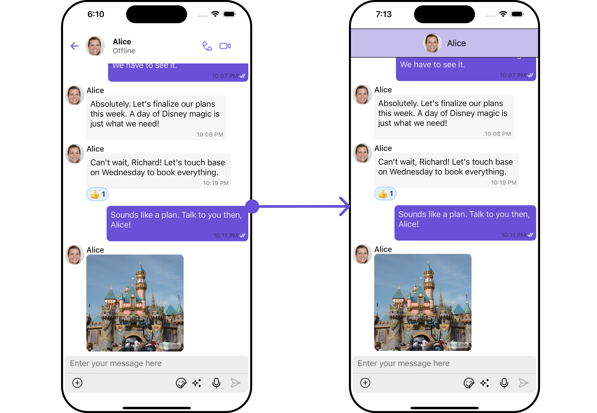

</TabItem>

<TabItem value="android" label="Android">

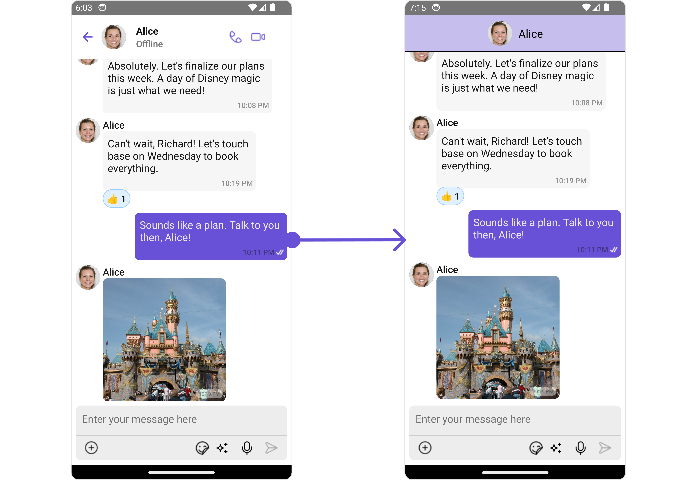

</TabItem>

</Tabs>

---

#### MessageListView

You can set your custom message list view using the `messageListView` method. But keep in mind, by using this you will override the default message ListView functionality.

<Tabs>
<TabItem value="tsx" label="App.tsx">

```tsx
import { CometChat } from "@cometchat/chat-sdk-react-native";
import {
  CometChatMessages,
  MessageListConfigurationInterface,
  MessageListStyleInterface,
  CometChatMessageList,
} from "@cometchat/chat-uikit-react-native";
import React from "react";
import { View, Text } from "react-native";

function App(): React.JSX.Element {
  const [chatUser, setChatUser] = React.useState<CometChat.User | undefined>();

  React.useEffect(() => {
    CometChat.getUser("uid").then((user) => {
      setChatUser(user);
    });
  }, []);

  const messageListStyle: MessageListStyleInterface = {
    backgroundColor: "transparent",
    height: "100%",
    width: "100%",
  };

  const customMessageListView = ({
    user,
    group,
  }: {
    user?: CometChat.User | undefined;
    group?: CometChat.Group | undefined;
  }) => {
    return (
      <CometChatMessageList
        user={chatUser}
        messageListStyle={messageListStyle}
      ></CometChatMessageList>
    );
  };

  return (
    <>
      {chatUser && (
        <CometChatMessages
          user={chatUser}
          MessageListView={customMessageListView}
        />
      )}
    </>
  );
}
```

</TabItem>
</Tabs>

<Tabs>

<TabItem value="iOS" label="iOS">

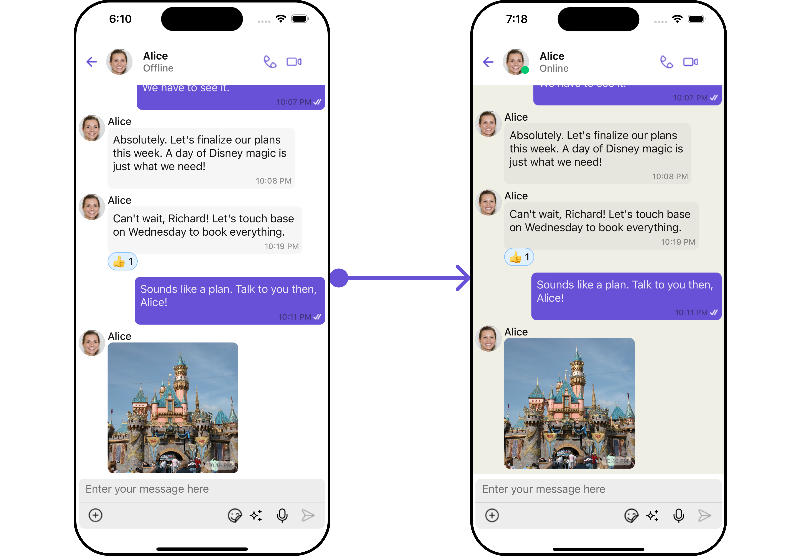

</TabItem>

<TabItem value="android" label="Android">

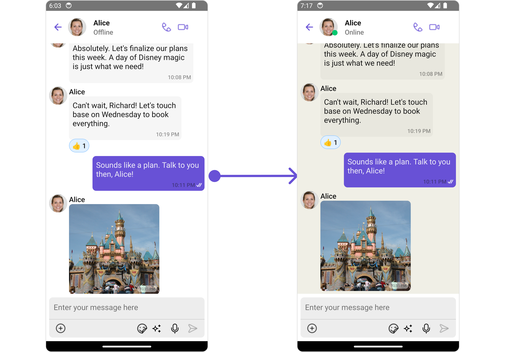

</TabItem>

</Tabs>

---

#### MessageComposerView

You can set your custom Message Composer view using the `MessageComposerView` method. But keep in mind, by using this you will override the default message composer functionality.

<Tabs>
<TabItem value="App" label="App.tsx">

```js
import { CometChat } from '@cometchat/chat-sdk-react-native';
import { CometChatMessages, CometChatMessageComposer, MessageComposerStyleInterface } from '@cometchat/chat-uikit-react-native';
import React from 'react';
import { View, Text } from 'react-native';

function App(): React.JSX.Element {
    const [chatUser, setChatUser] = React.useState<CometChat.User| undefined>();

    React.useEffect(() => {
        CometChat.getUser("uid").then((user) => {
            setChatUser(user);
        })
    }, []);

  const messageComposerStyle : MessageComposerStyleInterface = {
    backgroundColor:"#fffcff",
    inputBackground:"#e2d5e8",
    textColor:"#ff299b",
    sendIconTint:"#ff0088",
  };

  const customComposerView = ({user, group} : {user?: CometChat.User| undefined, group?: CometChat.Group | undefined}) => {
    return (
     <CometChatMessageComposer
         user={chatUser}
         messageComposerStyle={messageComposerStyle}
      >
     </CometChatMessageComposer>
    )
  }

    return (
        <>
            { chatUser &&
                <CometChatMessages
                    user={chatUser}
                    MessageComposerView={customComposerView}
                /> }
        </>
    );
}
```

</TabItem>
</Tabs>

---

#### AuxilaryAppBarOptions

You can set a custom header menu option by using the `AuxilaryAppBarOptions` method.

<Tabs>
<TabItem value="tsx" label="App.tsx">

```js
import { CometChat } from '@cometchat/chat-sdk-react-native';
import { CometChatMessages, CometChatMessageComposer, MessageComposerStyleInterface } from '@cometchat/chat-uikit-react-native';
import React from 'react';
import { View, Text } from 'react-native';
import Call from './Call.png';

function App(): React.JSX.Element {
    const [chatUser, setChatUser] = React.useState<CometChat.User| undefined>();

    React.useEffect(() => {
        CometChat.getUser("uid").then((user) => {
            setChatUser(user);
        })
    }, []);

    const CustomAuxilaryMenu = () =>{
      return (
        <Image source={Call} style={{ tintColor: '#6851D6', marginRight: 3 }} />
      )
    }

    return (
        <>
            { chatUser &&
                <CometChatMessages
                    user={chatUser}
                    hideDetails={true}
                    AuxilaryAppBarOptions={CustomAuxilaryMenu}
                /> }
        </>
    );
}
```

</TabItem>
</Tabs>

---

## Configuration

Configurations offer the ability to customize the properties of each individual component within a Composite Component.

The Messages Component is a Composite Component and it has a specific set of configuration for each of its components.

### MessageHeader

If you want to customize the properties of the [MessageHeader](./message-header) Component inside Messages Component, you need use the `MessageHeaderConfiguration` object.

<Tabs>
<TabItem value="tsx" label="App.tsx">

```tsx
import { CometChat } from "@cometchat/chat-sdk-react-native";
import {
  CometChatMessages,
  MessageHeaderConfigurationInterface,
} from "@cometchat/chat-uikit-react-native";
import React from "react";

function App(): React.JSX.Element {
  const [chatUser, setChatUser] = React.useState<CometChat.User | undefined>();

  React.useEffect(() => {
    CometChat.getUser("uid").then((user) => {
      setChatUser(user);
    });
  }, []);

  const messageHeaderConfiguration: MessageHeaderConfigurationInterface = {
    //config
  };

  return (
    <>
      {chatUser && (
        <CometChatMessages
          user={chatUser}
          messageHeaderConfiguration={messageHeaderConfiguration}
        />
      )}
    </>
  );
}
```

</TabItem>
</Tabs>

The `MessageHeaderConfiguration` provides access to all the [Action](/ui-kit/react-native/message-header#style), [Filters](/ui-kit/react-native/message-header#filters), [Styles](/ui-kit/react-native/message-header#style), [Functionality](/ui-kit/react-native/message-header#functionality), and [Advanced](/ui-kit/react-native/message-header#advanced) properties of the [MessageHeader](/ui-kit/react-native/message-header) component.

:::info

Please note that the properties marked with the <a><span class="material-icons red">report</span></a> symbol are not accessible within the Configuration Object.

:::

**Example**
<Tabs>

<TabItem value="iOS" label="iOS">

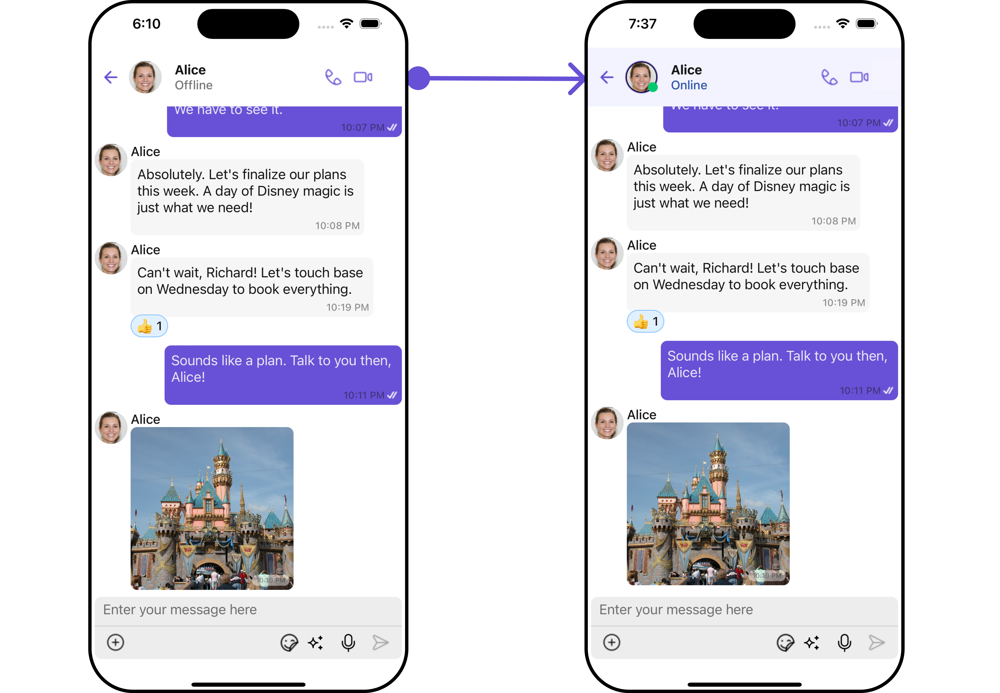

</TabItem>

<TabItem value="android" label="Android">

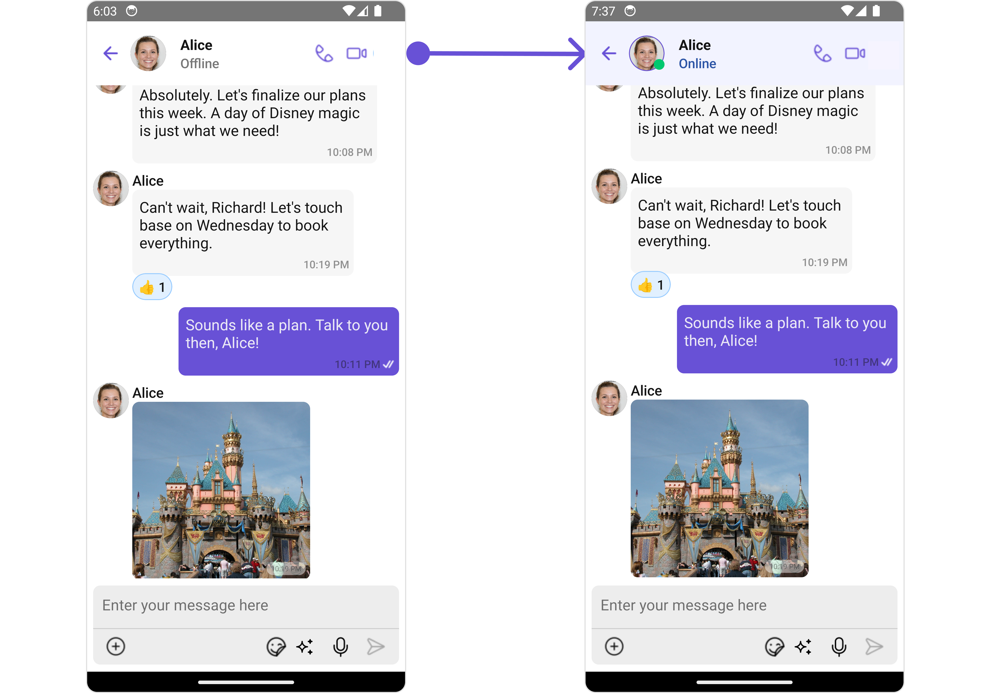

</TabItem>

</Tabs>

In this example, we will style the Avatar and MessageHeader of the [MessageHeader](/ui-kit/react-native/message-header) component using `MessageHeaderConfiguration`.

<Tabs>
<TabItem value="MessagesDemo" label="JavaScript">

```js
import { CometChat } from '@cometchat/chat-sdk-react-native';
import { CometChatMessages, MessageHeaderConfigurationInterface, BorderStyleInterface, AvatarStyleInterface,
MessageHeaderStyleInterface} from '@cometchat/chat-uikit-react-native';
import React from 'react';

function App(): React.JSX.Element {
    const [chatUser, setChatUser] = React.useState<CometChat.User| undefined>();

    React.useEffect(() => {
        CometChat.getUser("uid").then((user) => {
            setChatUser(user);
        })
    }, []);

    const borderStyle : BorderStyleInterface = {
      borderStyle: "solid",
      borderColor: "#6851D6",
      borderWidth: 1
    }

    const avatarStyle : AvatarStyleInterface = {
      border: borderStyle
    }

    const messageHeaderStyle : MessageHeaderStyleInterface ={
      backgroundColor:"#f2f3ff",
      subtitleTextColor:"#2d55a6"
    }


    const messageHeaderConfiguration : MessageHeaderConfigurationInterface = {
      avatarStyle: avatarStyle,
    }

    return (
        <>
            { chatUser &&
                <CometChatMessages
                    user={chatUser}
                    messageHeaderConfiguration={messageHeaderConfiguration}
                /> }
        </>
    );
}
```

</TabItem>
</Tabs>

### MessageList

If you want to customize the properties of the [MessageList](./message-list) Component inside Messages Component, you need use the `MessageListConfiguration` object.

<Tabs>
<TabItem value="tsx" label="App.tsx">

```tsx
import { CometChat } from "@cometchat/chat-sdk-react-native";
import {
  CometChatMessages,
  MessageHeaderConfigurationInterface,
} from "@cometchat/chat-uikit-react-native";
import React from "react";

function App(): React.JSX.Element {
  const [chatUser, setChatUser] = React.useState<CometChat.User | undefined>();

  React.useEffect(() => {
    CometChat.getUser("uid").then((user) => {
      setChatUser(user);
    });
  }, []);

  const messageListConfiguration: MessageListConfigurationInterface = {
    //configuration
  };

  return (
    <>
      {chatUser && (
        <CometChatMessages
          user={chatUser}
          messageListConfiguration={messageListConfiguration}
        />
      )}
    </>
  );
}
```

</TabItem>
</Tabs>

The `MessageListConfiguration` provides access to all the [Action](/ui-kit/react-native/message-list#style), [Filters](/ui-kit/react-native/message-list#filters), [Styles](/ui-kit/react-native/message-list#style), [Functionality](/ui-kit/react-native/message-list#functionality), and [Advanced](//react-chat-ui-kit/message-list#advanced) properties of the [MessageList](/ui-kit/react-native/message-list) component.

:::info

Please note that the properties marked with the <a><span class="material-icons red">report</span></a> symbol are not accessible within the Configuration Object.

:::

**Example**
<Tabs>

<TabItem value="iOS" label="iOS">

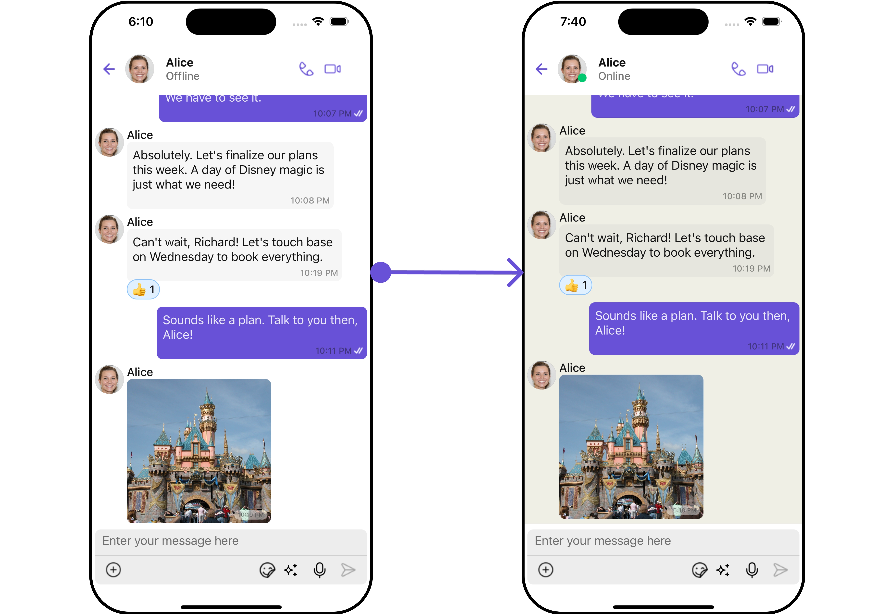

</TabItem>

<TabItem value="android" label="Android">

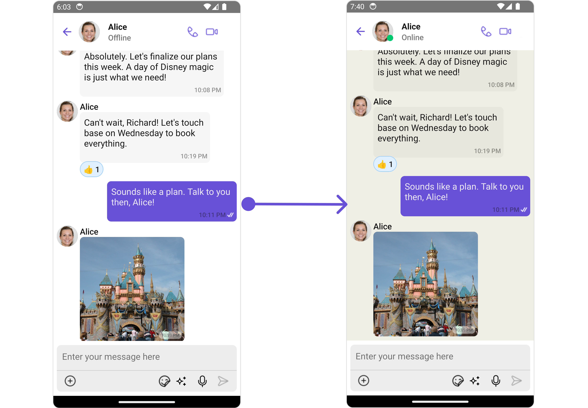

</TabItem>

</Tabs>
In this example, we will be changing the list alignment and modifying the message bubble styles in the [MessageList](/ui-kit/react-native/message-list) component using `MessageListConfiguration`.

<Tabs>
<TabItem value="tsx" label="App.tsx">

```js
import { CometChat } from '@cometchat/chat-sdk-react-native';
import { CometChatMessages, MessageListConfigurationInterface, MessageListStyleInterface } from '@cometchat/chat-uikit-react-native';
import React from 'react';

function App(): React.JSX.Element {
    const [chatUser, setChatUser] = React.useState<CometChat.User| undefined>();

    React.useEffect(() => {
        CometChat.getUser("uid").then((user) => {
            setChatUser(user);
        })
    }, []);

  const messageListStyle : MessageListStyleInterface = {
    backgroundColor:"#f0efe6",
    height:"100%",
    width:"100%",
  };


 const messageListConfiguration : MessageListConfigurationInterface = {
    messageListStyle: messageListStyle
 }

    return (
        <>
            { chatUser &&
                <CometChatMessages
                    user={chatUser}
                    messageListConfiguration={messageListConfiguration}
                /> }
        </>
    );
}
```

</TabItem>
</Tabs>

### MessageComposer

If you want to customize the properties of the [MessageComposer](/ui-kit/react-native/message-composer) Component inside Messages Component, you need use the `MessageComposerConfiguration` object.

<Tabs>
<TabItem value="tsx" label="App.tsx">

```js
import { CometChat } from '@cometchat/chat-sdk-react-native';
import { CometChatMessages, MessageListConfigurationInterface, MessageComposerStyleInterface, MessageComposerConfigurationInterface } from '@cometchat/chat-uikit-react-native';
import React from 'react';

function App(): React.JSX.Element {
    const [chatUser, setChatUser] = React.useState<CometChat.User| undefined>();

    React.useEffect(() => {
        CometChat.getUser("uid").then((user) => {
            setChatUser(user);
        })
    }, []);


    const messageComposerStyle : MessageComposerStyleInterface = {
       backgroundColor:"#fffcff",
       inputBackground:"#e2d5e8",
       textColor:"#ff299b",
       sendIconTint:"#ff0088",
    };


    const messageComposerConfiguration : MessageComposerConfigurationInterface = {
       messageComposerStyle: messageComposerStyle
    }

    return (
        <>
          { chatUser &&
             <CometChatMessages
                user={chatUser}
                messageComposerConfiguration={messageComposerConfiguration}
             /> }
        </>
    );
}
```

</TabItem>
</Tabs>

The `MessageComposerConfiguration` provides access to all the [Action](/ui-kit/react-native/message-composer#style), [Filters](/ui-kit/react-native/message-composer#filters), [Styles](/ui-kit/react-native/message-composer#style), [Functionality](/ui-kit/react-native/message-composer#functionality), and [Advanced](/ui-kit/react-native/message-composer#advanced) properties of the [MessageComposer](/ui-kit/react-native/message-composer) component.

:::info

Please note that the properties marked with the <a><span class="material-icons red">report</span></a> symbol are not accessible within the Configuration Object.

:::

**Example**
<Tabs>

<TabItem value="iOS" label="iOS">

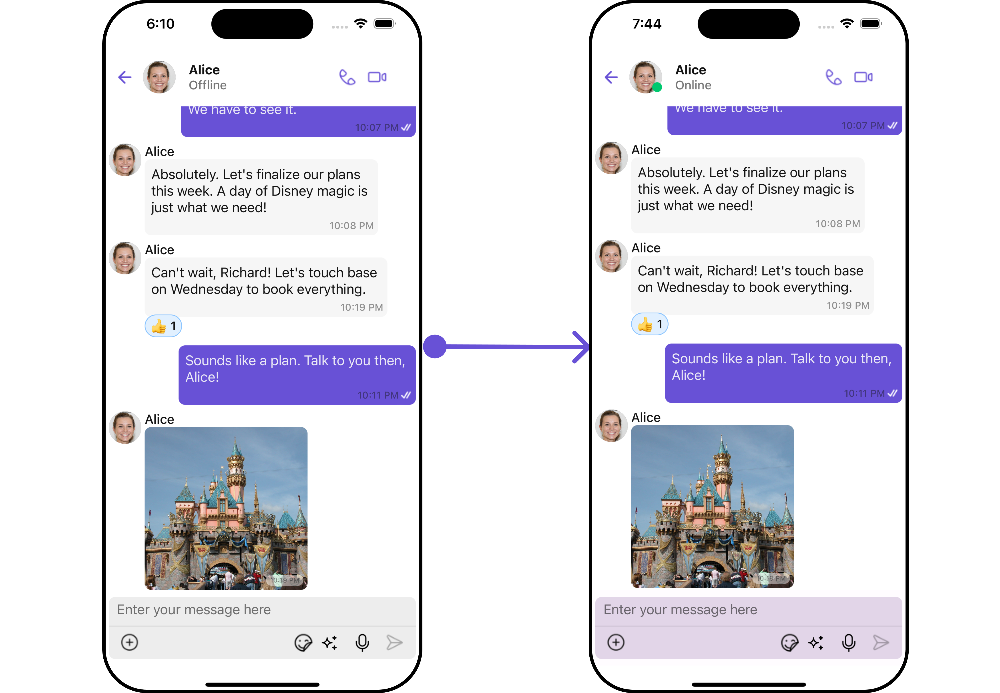

</TabItem>

<TabItem value="android" label="Android">

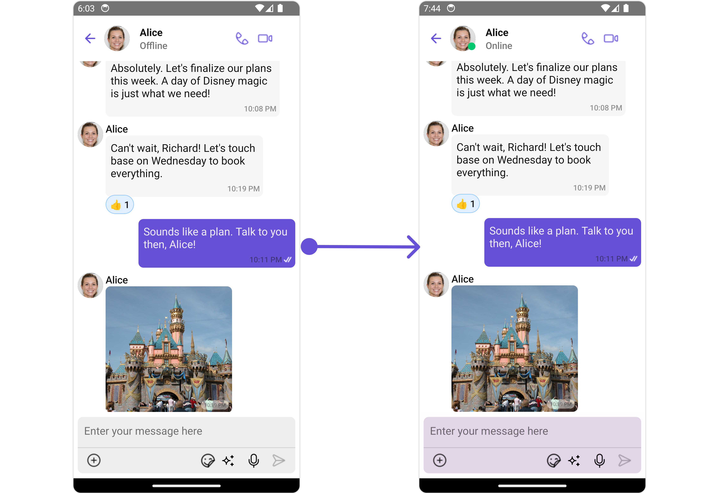

</TabItem>

</Tabs>

In this example, we'll be adding styling to the message composer and custom text to the [MessageComposer](/ui-kit/react-native/message-composer) component using `MessageComposerConfiguration`.

<Tabs>
<TabItem value="tsx" label="App.tsx">

```js
import { CometChat } from '@cometchat/chat-sdk-react-native';
import { CometChatMessages, MessageListConfigurationInterface, MessageComposerStyleInterface, MessageComposerConfigurationInterface } from '@cometchat/chat-uikit-react-native';
import React from 'react';

function App(): React.JSX.Element {
    const [chatUser, setChatUser] = React.useState<CometChat.User| undefined>();

    React.useEffect(() => {
        CometChat.getUser("uid").then((user) => {
            setChatUser(user);
        })
    }, []);

    const messageComposerStyle : MessageComposerStyleInterface = {
       backgroundColor:"#fffcff",
       inputBackground:"#e2d5e8",
       textColor:"#ff299b",
       sendIconTint:"#ff0088",
    };


    const messageComposerConfiguration : MessageComposerConfigurationInterface = {
       messageComposerStyle: messageComposerStyle
    }

    return (
        <>
            { chatUser &&
                <CometChatMessages
                    user={chatUser}
                    messageComposerConfiguration={messageComposerConfiguration}
                /> }
        </>
    );
}
```

</TabItem>
</Tabs>

### ThreadedMessages

If you want to customize the properties of the [ThreadedMessages](/ui-kit/react-native/threaded-messages) Component inside Messages Component, you need use the `ThreadedMessagesConfiguration` object.

<Tabs>
<TabItem value="tsx" label="App.tsx">

```js
import { CometChat } from '@cometchat/chat-sdk-react-native';
import { CometChatMessages, ThreadedMessagesConfigurationInterface } from '@cometchat/chat-uikit-react-native';
import React from 'react';

function App(): React.JSX.Element {
    const [chatUser, setChatUser] = React.useState<CometChat.User| undefined>();

    React.useEffect(() => {
        CometChat.getUser("uid").then((user) => {
            setChatUser(user);
        })
    }, []);

    const threadedMessagesConfiguration : ThreadedMessagesConfigurationInterface = {
       //config
    }

    return (
        <>
          { chatUser &&
             <CometChatMessages
                user={chatUser}
                threadedMessagesConfiguration={threadedMessagesConfiguration}
             /> }
        </>
    );
}
```

</TabItem>
</Tabs>

The `ThreadedMessagesConfiguration` provides access to all the [Action](/ui-kit/react-native/threaded-messages#style), [Filters](/ui-kit/react-native/threaded-messages#filters), [Styles](/ui-kit/react-native/threaded-messages#style), [Functionality](/ui-kit/react-native/threaded-messages#functionality), and [Advanced](/ui-kit/react-native/threaded-messages#advanced) properties of the [ThreadedMessages](/ui-kit/react-native/threaded-messages) component.

:::info

Please note that the properties marked with the <a><span class="material-icons red">report</span></a> symbol are not accessible within the Configuration Object.

:::

**Example**
<Tabs>

<TabItem value="iOS" label="iOS">


</TabItem>

<TabItem value="android" label="Android">

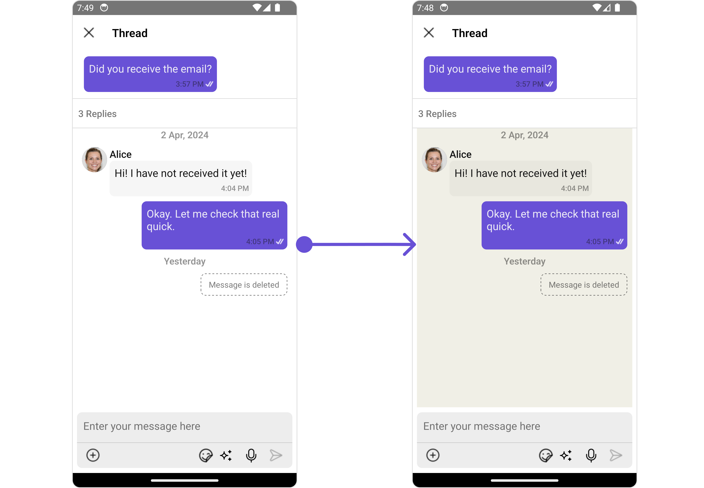

</TabItem>

</Tabs>

In this example, we are adding a custom close icon to the Threaded Message component and also adding custom properties to the [MessageList](#messagelist) using `MessageListConfiguration`. We then apply these changes to the [ThreadedMessages](/ui-kit/react-native/message-composer) component using `ThreadedMessagesConfiguration`.

<Tabs>
<TabItem value="tsx" label="App.tsx">

```js
import { CometChat } from '@cometchat/chat-sdk-react-native';
import { CometChatMessages, ThreadedMessagesConfigurationInterface, MessageListStyleInterface,
MessageListConfigurationInterface } from '@cometchat/chat-uikit-react-native';
import React from 'react';

function App(): React.JSX.Element {
    const [chatUser, setChatUser] = React.useState<CometChat.User| undefined>();

    React.useEffect(() => {
        CometChat.getUser("uid").then((user) => {
            setChatUser(user);
        })
    }, []);

  const messageListStyle : MessageListStyleInterface = {
    backgroundColor:"#f0efe6",
    height:"100%",
    width:"100%",
  };

  const messageListConfiguration : MessageListConfigurationInterface = {
    messageListStyle: messageListStyle
  };

  const threadedMessagesConfiguration : ThreadedMessagesConfigurationInterface = {
    messageListConfiguration: messageListConfiguration
  }

  return (
    <>
      { chatUser &&
         <CometChatMessages
            user={chatUser}
            threadedMessagesConfiguration={threadedMessagesConfiguration}
        /> }
    </>
  );
}
```

</TabItem>
</Tabs>
