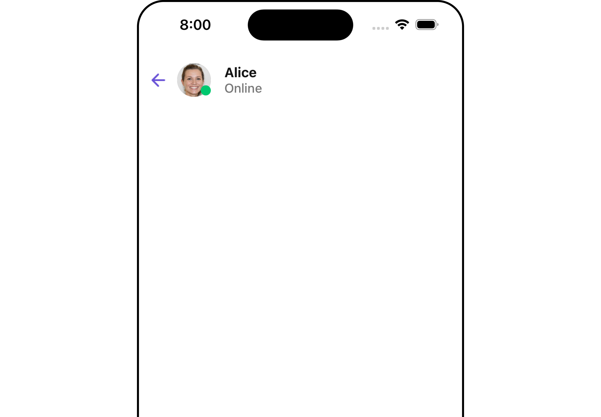
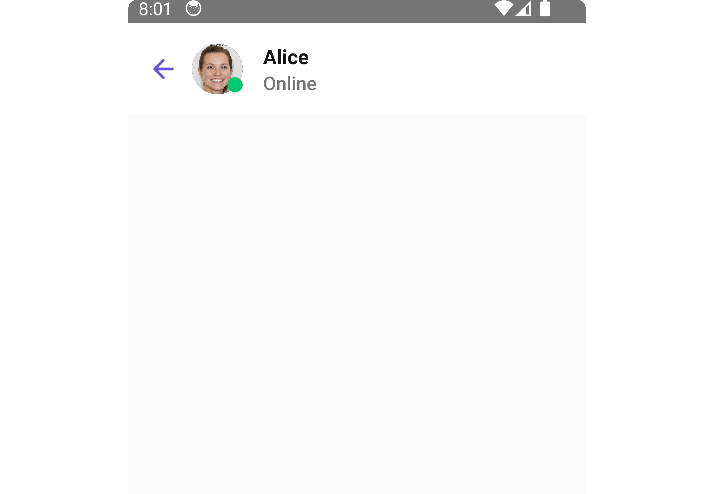
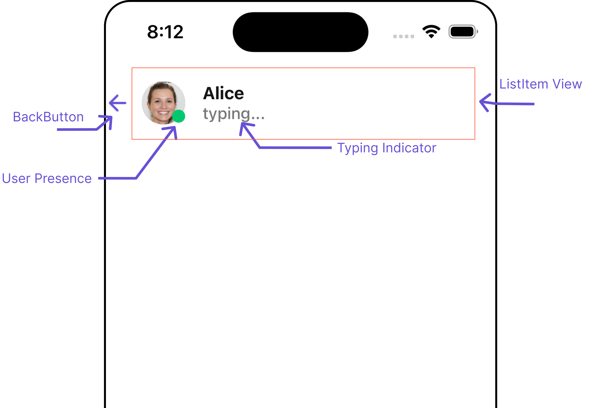
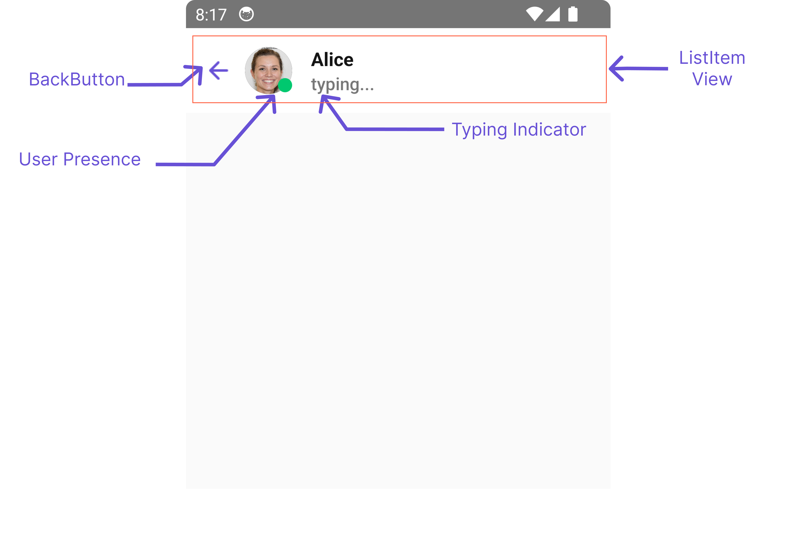
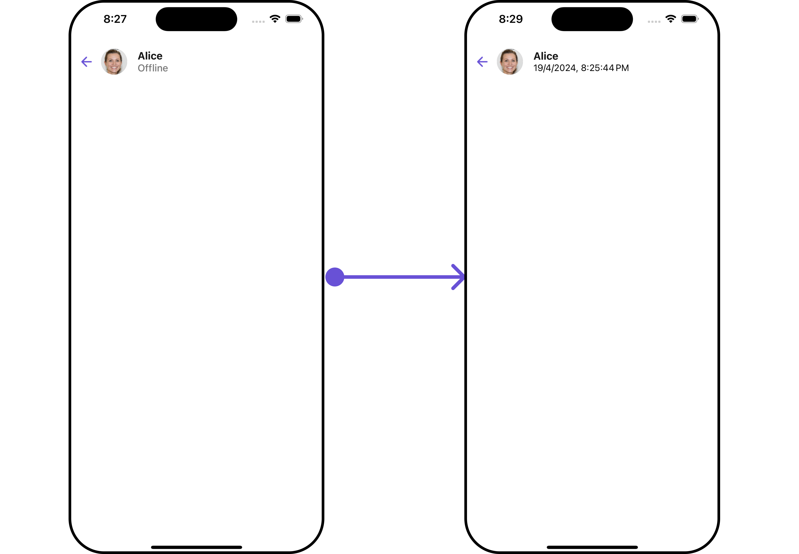
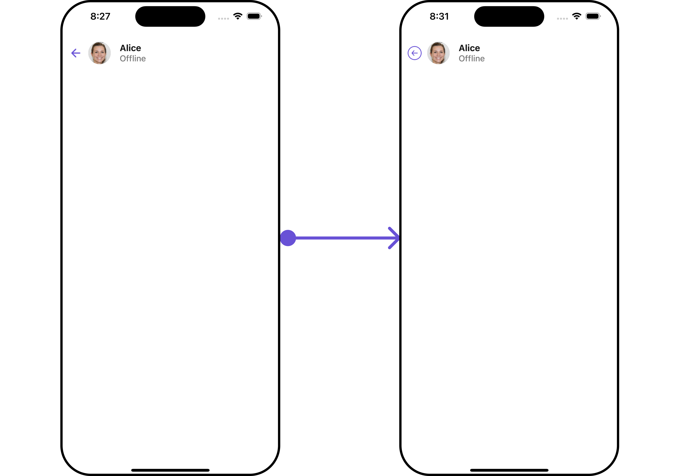
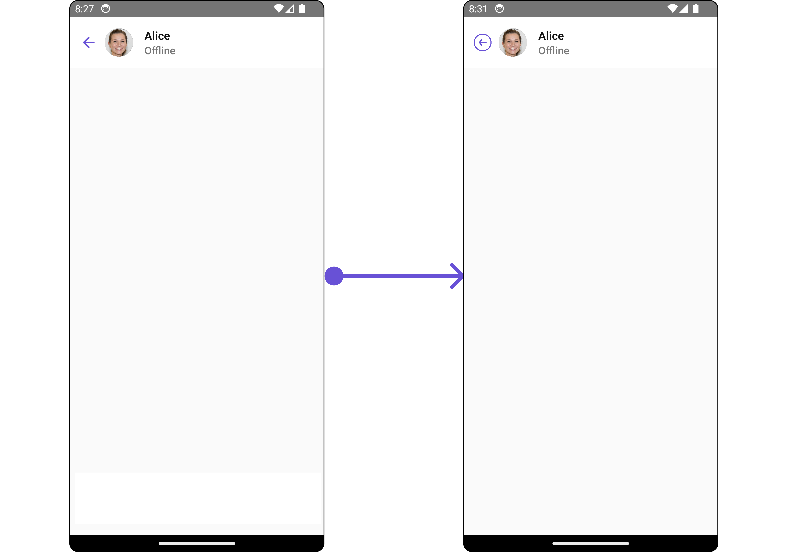
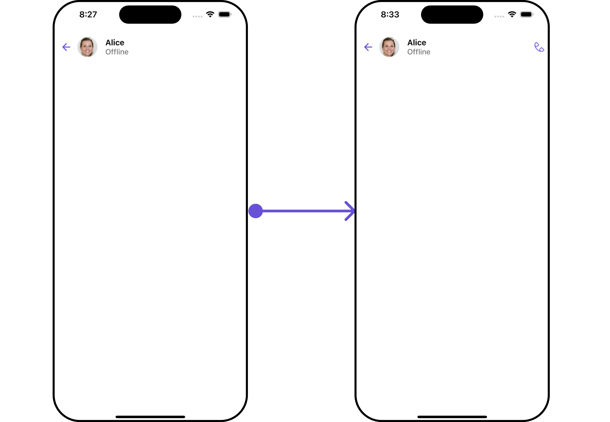
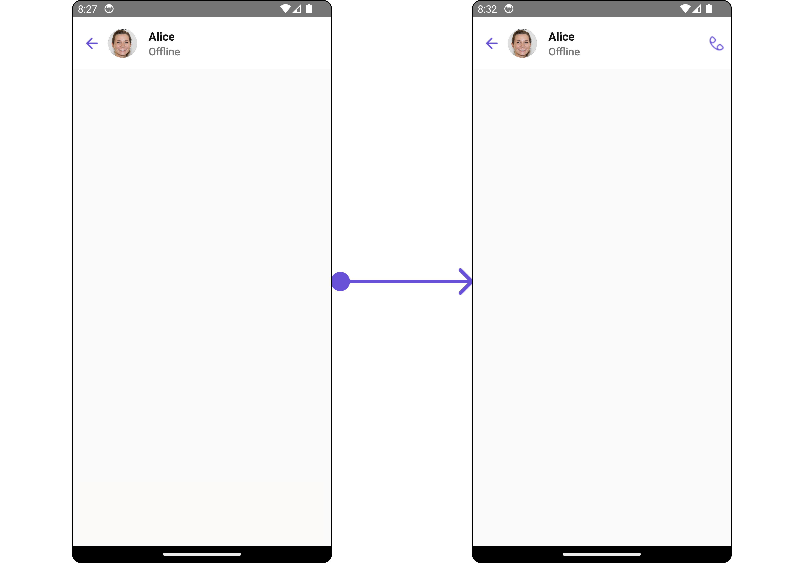

import Tabs from '@theme/Tabs';
import TabItem from '@theme/TabItem';

## Overview

`MessageHeader` is a [Component](/ui-kit/react-native/components-overview#components) that showcases the [User](/sdk/react-native/users-overview) or [Group](/sdk/react-native/groups-overview) details in the toolbar. Furthermore, it also presents a typing indicator and a back navigation button for ease of use.

<Tabs>

<TabItem value="iOS" label="iOS">



</TabItem>

<TabItem value="android" label="Android">



</TabItem>

</Tabs>

The `MessageHeader` is comprised of the following components:

| Components                        | Description                                                                                                                                    |
| --------------------------------- | ---------------------------------------------------------------------------------------------------------------------------------------------- |
| [ListItem Component](./list-item) | This component’s view consists of avatar, status indicator , title, and subtitle. The fields are then mapped with the SDK’s user, group class. |
| Back Button                       | BackButton that allows users to navigate back from the current activity or screen to the previous one                                          |

## Usage

### Integration

<Tabs>
<TabItem value="tsx" label="App.tsx">

```js
import { CometChat } from '@cometchat/chat-sdk-react-native';
import { CometChatMessageHeader, MessageHeaderStyleInterface } from '@cometchat/chat-uikit-react-native';
import React from 'react';

function App(): React.JSX.Element {
    const [chatUser, setChatUser] = React.useState<CometChat.User| undefined>();

    React.useEffect(() => {
        CometChat.getUser("uid").then((user) => {
            setChatUser(user);
        })
    }, []);

  const messageHeaderStyle : MessageHeaderStyleInterface = {
     backgroundColor: "#c7caed"
  }

  return (
    <>
        { chatUser && <CometChatMessageHeader
             user={chatUser}
             style={messageHeaderStyle}
          />
         }
    </>
  );
}
```

</TabItem>
</Tabs>

### Actions

[Actions](/ui-kit/react-native/components-overview#actions) dictate how a component functions. They are divided into two types: Predefined and User-defined. You can override either type, allowing you to tailor the behavior of the component to fit your specific needs.

##### 1. OnBack

`OnBack` is triggered when you click on the back button of the Message Header component. You can override this action using the following code snippet.

<Tabs>
<TabItem value="tsx" label="App.tsx">

```js
import { CometChat } from '@cometchat/chat-sdk-react-native';
import { CometChatMessageHeader, MessageHeaderStyleInterface } from '@cometchat/chat-uikit-react-native';
import React from 'react';

function App(): React.JSX.Element {
    const [chatUser, setChatUser] = React.useState<CometChat.User| undefined>();

    React.useEffect(() => {
        CometChat.getUser("uid").then((user) => {
            setChatUser(user);
        })
    }, []);

  let messageHeaderStyle : MessageHeaderStyleInterface = {
     backgroundColor: "#c7caed"
  }

  const onBackHandler = () => {
    //code
  }

  return (
    <>
        { chatUser && <CometChatMessageHeader
             user={chatUser}
             style={messageHeaderStyle}
             onBack={onBackHandler}
          />
         }
    </>
  );
}
```

</TabItem>
</Tabs>

---

### Filters

**Filters** allow you to customize the data displayed in a list within a `Component`. You can filter the list based on your specific criteria, allowing for a more customized. Filters can be applied using `RequestBuilders` of Chat SDK.

The `MessageHeader` component does not have any exposed filters.

### Events

[Events](/ui-kit/react-native/components-overview#events) are emitted by a `Component`. By using event you can extend existing functionality. Being global events, they can be applied in Multiple Locations and are capable of being Added or Removed.

The `MessageHeader` component does not produce any events.

## Customization

To fit your app's design requirements, you can customize the appearance of the conversation component. We provide exposed methods that allow you to modify the experience and behavior according to your specific needs.

### Style

Using Style you can customize the look and feel of the component in your app, These parameters typically control elements such as the color, size, shape, and fonts used within the component.

##### 1. MessageHeader Style

To customize the appearance, you can assign a `MessageHeaderStyle` object to the `MessageHeader` component.

<Tabs>
<TabItem value="tsx" label="App.tsx">

```js
import { CometChat } from '@cometchat/chat-sdk-react-native';
import { CometChatMessageHeader, MessageHeaderStyleInterface } from '@cometchat/chat-uikit-react-native';
import React from 'react';

function App(): React.JSX.Element {
    const [chatUser, setChatUser] = React.useState<CometChat.User| undefined>();

    React.useEffect(() => {
        CometChat.getUser("uid").then((user) => {
            setChatUser(user);
        })
    }, []);

  const messageHeaderStyle : MessageHeaderStyleInterface = {
     backgroundColor: "#c7caed"
  }

  return (
    <>
        { chatUser && <CometChatMessageHeader
             user={chatUser}
             style={messageHeaderStyle}
          />
         }
    </>
  );
}
```

</TabItem>

</Tabs>

The properties exposed by `MessageHeaderStyle` are as follows:

| Property                 | Type                 | Description                                              |
| ------------------------ | -------------------- | -------------------------------------------------------- |
| backgroundColor          | string               | Sets the background colour for message header            |
| width                    | string &#124; number | Sets the width for message header                        |
| height                   | string &#124; number | Sets the height for message header                       |
| border                   | BorderStyleInterface | Sets the border colour for message header                |
| borderRadius             | number               | sets the border radius for message header                |
| backIconTint             | string               | Sets the tint colour for back icon for message header    |
| typingIndicatorTextColor | string               | Sets the typing indicator text colour for message header |
| typingIndicatorTextFont  | FontStyleInterface   | Sets the typing indicator text font for message header   |
| onlineStatusColor        | string               | Sets the online status colour for message header         |
| subtitleTextColor        | string               | Sets the subtitle colour for message header              |
| subtitleTextFont         | FontStyleInterface   | Sets the subtitle font for message header                |

##### 2. Avatar Style

If you want to apply customized styles to the `Avatar` component within the `MessageHeader` Component, you can use the following code snippet. For more information you can refer [Avatar Styles](/ui-kit/react-native/avatar#avatarstyleinterface).

<Tabs>
<TabItem value="App" label="App.tsx">

```js
import { CometChat } from '@cometchat/chat-sdk-react-native';
import { CometChatMessageHeader, BorderStyleInterface, AvatarStyleInterface } from '@cometchat/chat-uikit-react-native';
import React from 'react';

function App(): React.JSX.Element {
    const [chatUser, setChatUser] = React.useState<CometChat.User| undefined>();

    React.useEffect(() => {
        CometChat.getUser("uid").then((user) => {
            setChatUser(user);
        })
    }, []);

    const messageHeaderStyle : MessageHeaderStyleInterface = {
       backgroundColor: "#c7caed"
    }

    const borderStyle : BorderStyleInterface = {
       borderStyle: "solid",
       borderColor: "#6851D6",
       borderWidth: 1
    }

    const avatarStyle : AvatarStyleInterface = {
     border: borderStyle
    }

    return (
      <>
        { chatUser && <CometChatMessageHeader
             user={chatUser}
             style={messageHeaderStyle}
             avatarStyle={avatarStyle}
          />
         }
      </>
    );
}
```

</TabItem>

</Tabs>

##### 3. ListItem Style

If you want to apply customized styles to the `ListItemStyle` component within the `MessageHeader` Component, you can use the following code snippet. For more information, you can refer [ListItem Styles](/ui-kit/react-native/list-item#listitemstyle).

<Tabs>
<TabItem value="App" label="App.tsx">

```js
import { CometChat } from '@cometchat/chat-sdk-react-native';
import { CometChatMessageHeader, MessageHeaderStyleInterface } from '@cometchat/chat-uikit-react-native';
import React from 'react';

function App(): React.JSX.Element {
    const [chatUser, setChatUser] = React.useState<CometChat.User| undefined>();

    React.useEffect(() => {
        CometChat.getUser("uid").then((user) => {
            setChatUser(user);
        })
    }, []);

    const messageHeaderStyle : MessageHeaderStyleInterface = {
       backgroundColor: "#c7caed"
    }

    const listItemStyle : ListItemStyleInterface = {
       backgroundColor: "transparent",
       titleColor:"#6851D6",
    };

    return (
      <>
        { chatUser && <CometChatMessageHeader
             user={chatUser}
             style={messageHeaderStyle}
             listItemStyle={listItemStyle}
          />
         }
      </>
    );
}
```

</TabItem>

</Tabs>

##### 4. StatusIndicator Style

If you want to apply customized styles to the `Status Indicator` component within the `MessageHeader` Component, you can use the following code snippet. For more information you can refer [StatusIndicator Styles](/ui-kit/react-native/status-indicator).

<Tabs>
<TabItem value="App" label="App.tsx">

```js
import { CometChat } from '@cometchat/chat-sdk-react-native';
import { CometChatMessageHeader, MessageHeaderStyleInterface, StatusIndicatorStyleInterface } from '@cometchat/chat-uikit-react-native';
import React from 'react';

function App(): React.JSX.Element {
    const [chatUser, setChatUser] = React.useState<CometChat.User| undefined>();

    React.useEffect(() => {
        CometChat.getUser("uid").then((user) => {
            setChatUser(user);
        })
    }, []);

    const messageHeaderStyle : MessageHeaderStyleInterface = {
       backgroundColor: "#c7caed"
    }

    const statusIndicatorStyle : StatusIndicatorStyleInterface= {
        backgroundColor: "red",
        height: 15,
        width: 15,
        border: borderStyle,
        borderRadius: 100,
     };

    return (
      <>
        { chatUser && <CometChatMessageHeader
             user={chatUser}
             style={messageHeaderStyle}
             statusIndicatorStyle={statusIndicatorStyle}
          />
         }
      </>
    );
}
```

</TabItem>

</Tabs>

### Functionality

These are a set of small functional customizations that allow you to fine-tune the overall experience of the component. With these, you can change text, set custom icons, and toggle the visibility of UI elements.

Here is a code snippet demonstrating how you can customize the functionality of the Message Header component.

<Tabs>

<TabItem value="iOS" label="iOS">



</TabItem>

<TabItem value="android" label="Android">



</TabItem>

</Tabs>

<Tabs>
<TabItem value="App" label="App.tsx">

```tsx
import { CometChat } from "@cometchat/chat-sdk-react-native";
import {
  CometChatMessageHeader,
  MessageHeaderStyleInterface,
} from "@cometchat/chat-uikit-react-native";
import React from "react";

function App(): React.JSX.Element {
  const [chatUser, setChatUser] = React.useState<CometChat.User | undefined>();

  React.useEffect(() => {
    CometChat.getUser("uid").then((user) => {
      setChatUser(user);
    });
  }, []);

  const messageHeaderStyle: MessageHeaderStyleInterface = {
    backgroundColor: "#c7caed",
  };

  return (
    <>
      {chatUser && (
        <CometChatMessageHeader
          user={chatUser}
          style={messageHeaderStyle}
          hideBackIcon={true}
        />
      )}
    </>
  );
}
```

</TabItem>
</Tabs>

Following is a list of customizations along with their corresponding code snippets:

| Property                 | Description                                                              | Code                                                                                                                                                                   |
| ------------------------ | ------------------------------------------------------------------------ | ---------------------------------------------------------------------------------------------------------------------------------------------------------------------- |
| **user**                 | Used to pass user object of which header specific details will be shown  | `user={chatUser}`                                                                                                                                                      |
| **group**                | Used to pass group object of which header specific details will be shown | `group={chatGroup}`                                                                                                                                                    |
| **protectedGroupIcon**   | Used to set custom protected group icon                                  | `protectedGroupIcon={{uri: <image url>}}` OR `import customProtectedGroupIcon from "./customProtectedGroupIcon.svg"; ` `protectedGroupIcon={customProtectedGroupIcon}` |
| **privateGroupIcon**     | Used to set custom private group icon                                    | `privateGroupIcon={{uri: <image url>}}` OR `import customPrivateGroupIcon from "./customPrivateGroupIcon.svg"; ` `privateGroupIcon={customPrivateGroupIcon}`           |
| **hideBackIcon**         | Used to toggle back button visibility                                    | `hideBackhideBackIconButton={true}`                                                                                                                                    |
| **disableTyping**        | Used to enable disable typing indicators                                 | `disableTyping={true}`                                                                                                                                                 |
| **disableUsersPresence** | Used to toggle functionality to show user's presence                     | `disableUsersPresence={true`                                                                                                                                           |

### Advanced

For advanced-level customization, you can set custom views to the component. This lets you tailor each aspect of the component to fit your exact needs and application aesthetics. You can create and define your views, layouts, and UI elements and then incorporate those into the component.

---

#### SubtitleView

By using the `SubtitleView` method, you can modify the SubtitleView to meet your specific needs.

<Tabs>
<TabItem value="App" label="App.tsx">

```jsx
import { CometChat } from '@cometchat/chat-sdk-react-native';
import { CometChatMessageHeader, MessageHeaderStyleInterface } from '@cometchat/chat-uikit-react-native';
import React from 'react';

function App(): React.JSX.Element {
    const [chatUser, setChatUser] = React.useState<CometChat.User| undefined>();

    React.useEffect(() => {
        CometChat.getUser("uid").then((user) => {
            setChatUser(user);
        })
    }, []);

  const messageHeaderStyle : MessageHeaderStyleInterface = {
     backgroundColor: "#c7caed"
  }

  function formatTime(timestamp: number) {
    const date = new Date(timestamp * 1000);
    return date.toLocaleString();
  }

  const getSubtitleView = () =>{
    return (
      <Text>{formatTime(chatUser!.getLastActiveAt())}</Text>
    )
  }

  return (
    <>
        { chatUser && <CometChatMessageHeader
             user={chatUser}
             style={messageHeaderStyle}
             SubtitleView={getSubtitleView}
          />
         }
    </>
  );
}
```

</TabItem>
</Tabs>

**Example**
<Tabs>

<TabItem value="iOS" label="iOS">



</TabItem>

<TabItem value="android" label="Android">


</TabItem>

</Tabs>

---

#### BackButtonIcon

You can customize the Back Icon according to your specific requirements by using the `backButtonIcon` method.

<Tabs>
<TabItem value="App" label="App.tsx">

```tsx
import { CometChat } from "@cometchat/chat-sdk-react-native";
import {
  CometChatMessageHeader,
  MessageHeaderStyleInterface,
} from "@cometchat/chat-uikit-react-native";
import React from "react";
import BackArrow from "./back-arrow.png";

function App(): React.JSX.Element {
  const [chatUser, setChatUser] = React.useState<CometChat.User | undefined>();

  React.useEffect(() => {
    CometChat.getUser("uid").then((user) => {
      setChatUser(user);
    });
  }, []);

  const messageHeaderStyle: MessageHeaderStyleInterface = {
    backgroundColor: "#c7caed",
  };

  return (
    <>
      {chatUser && (
        <CometChatMessageHeader
          user={chatUser}
          style={messageHeaderStyle}
          backButtonIcon={BackArrow}
        />
      )}
    </>
  );
}
```

</TabItem>
</Tabs>

**Example**

<Tabs>

<TabItem value="iOS" label="iOS">



</TabItem>

<TabItem value="android" label="Android">



</TabItem>

</Tabs>

---

#### AppBarOptions

You can customize the Menu options to meet your specific needs by using the `AppBarOptions` method.

<Tabs>
<TabItem value="App" label="App.tsx">

```jsx
import { CometChat } from '@cometchat/chat-sdk-react-native';
import { CometChatMessageHeader, MessageHeaderStyleInterface } from '@cometchat/chat-uikit-react-native';
import React from 'react';
import Call from './Call.png';

function App(): React.JSX.Element {
    const [chatUser, setChatUser] = React.useState<CometChat.User| undefined>();

    React.useEffect(() => {
        CometChat.getUser("uid").then((user) => {
            setChatUser(user);
        })
    }, []);

  const messageHeaderStyle : MessageHeaderStyleInterface = {
     backgroundColor: "#c7caed"
  }

  const appBarOptions = () =>{
    return (
      <Image source={Call} style={{ tintColor: '#6851D6', marginRight: 3 }} />
    )
  }

  return (
    <>
        { chatUser && <CometChatMessageHeader
             user={chatUser}
             style={messageHeaderStyle}
             AppBarOptions={appBarOptions}
          />
         }
    </>
  );
}
```

</TabItem>
</Tabs>

**Example**
<Tabs>

<TabItem value="iOS" label="iOS">



</TabItem>

<TabItem value="android" label="Android">



</TabItem>

</Tabs>
