import Tabs from '@theme/Tabs';
import TabItem from '@theme/TabItem';

## Overview

`MessageList` is a [Composite Component](/ui-kit/react-native/components-overview#composite-components) that displays a list of messages and effectively manages real-time operations. It includes various types of messages such as Text Messages, Media Messages, Stickers, and more.

`MessageList` is primarily a list of the base component [MessageBubble](/ui-kit/react-native/message-bubble). The MessageBubble Component is utilized to create different types of chat bubbles depending on the message type.

<Tabs>

<TabItem value="iOS" label="iOS">

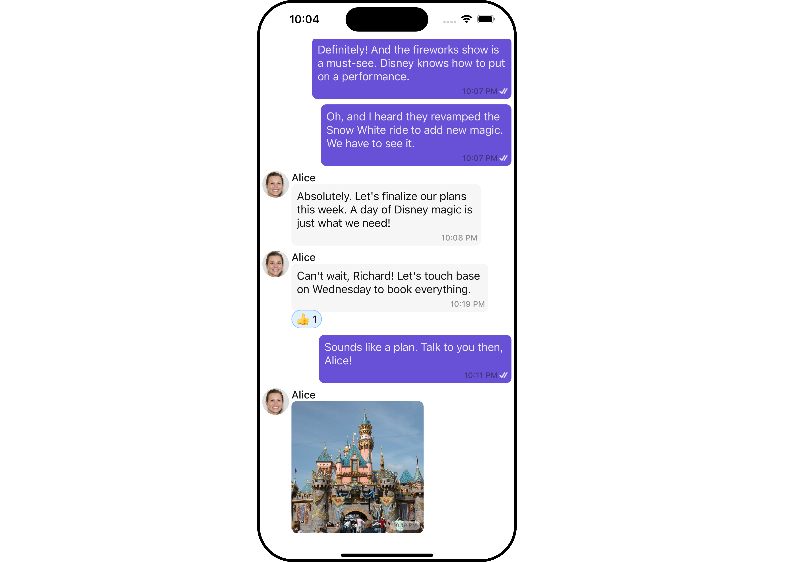

</TabItem>

<TabItem value="android" label="Android">

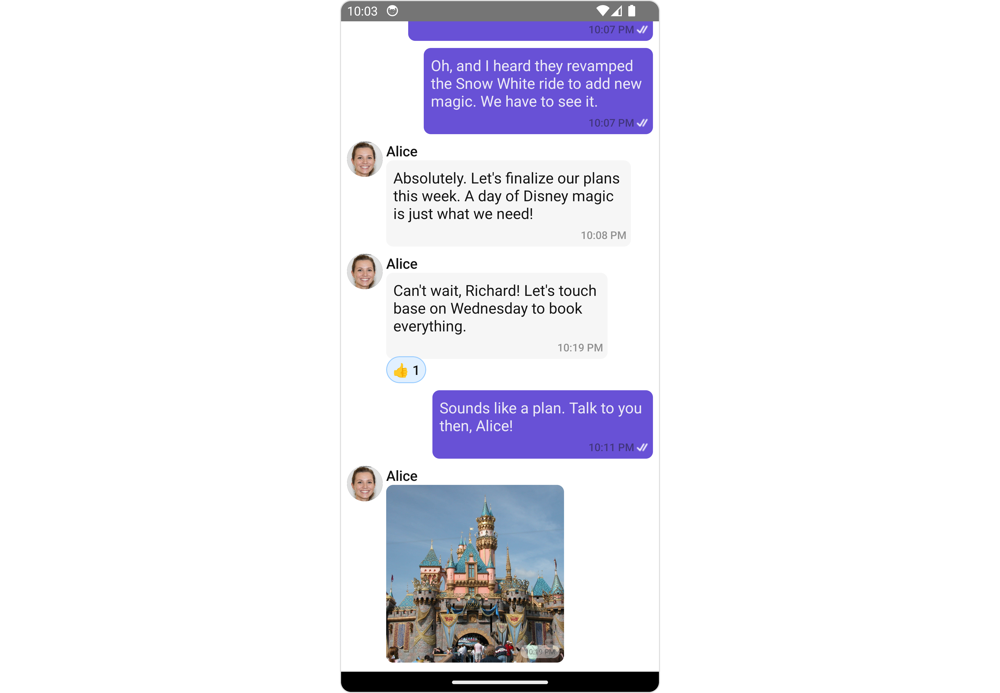

</TabItem>

</Tabs>

---

## Usage

### Integration

The following code snippet illustrates how you can directly incorporate the MessageList component into your Application.

<Tabs>
<TabItem value="ts" label="App.tsx">

```tsx
import { CometChat } from "@cometchat/chat-sdk-react-native";
import { CometChatMessageList } from "@cometchat/chat-uikit-react-native";

function App(): React.JSX.Element {
  const [chatUser, setChatUser] = React.useState<CometChat.User | undefined>();

  React.useEffect(() => {
    CometChat.getUser("uid").then((user) => {
      setChatUser(user);
    });
  }, []);

  return <>{chatUser && <CometChatMessageList user={chatUser} />}</>;
}
```

</TabItem>
</Tabs>

---

### Actions

[Actions](/ui-kit/react-native/components-overview#actions) dictate how a component functions. They are divided into two types: Predefined and User-defined. You can override either type, allowing you to tailor the behavior of the component to fit your specific needs.

##### 1. onThreadRepliesPress

`onThreadRepliesPress` is triggered when you click on the threaded message bubble. The `onThreadRepliesPress` action doesn't have a predefined behavior. You can override this action using the following code snippet.

<Tabs>
<TabItem value="App" label="App.tsx">

```jsx

import { CometChat } from '@cometchat/chat-sdk-react-native';
import { CometChatMessageList } from '@cometchat/chat-uikit-react-native';

function App(): React.JSX.Element {
    const [chatUser, setChatUser] = React.useState<CometChat.User| undefined>();

    React.useEffect(() => {
        CometChat.getUser("uid").then((user) => {
            setChatUser(user);
        })
    }, []);

   const onThreadRepliesPressHandler = (messageObject: CometChat.BaseMessage, messageBubbleView: () => JSX.Element) => {
     //code
   }

   return (
     <>
         { chatUser && <CometChatMessageList
              user={chatUser}
              onThreadRepliesPress={onThreadRepliesPressHandler}
           />
          }
     </>
   );
}


```

</TabItem>
</Tabs>

##### 2. onError

This action doesn't change the behavior of the component but rather listens for any errors that occur in the MessageList component.

<Tabs>
<TabItem value="App" label="App.tsx">

```jsx

import { CometChat } from '@cometchat/chat-sdk-react-native';
import { CometChatMessageList } from '@cometchat/chat-uikit-react-native';

function App(): React.JSX.Element {
    const [chatUser, setChatUser] = React.useState<CometChat.User| undefined>();

    React.useEffect(() => {
        CometChat.getUser("uid").then((user) => {
            setChatUser(user);
        })
    }, []);

   const onErrorHandler = (error: CometChat.CometChatException) => {
     //code
   }

   return (
     <>
         { chatUser && <CometChatMessageList
              user={chatUser}
              onError={onErrorHandler}
           />
          }
     </>
   );
}

```

</TabItem>
</Tabs>

### Filters

You can adjust the `MessagesRequestBuilder` in the MessageList Component to customize your message list. Numerous options are available to alter the builder to meet your specific needs. For additional details on `MessagesRequestBuilder`, please visit [MessagesRequestBuilder](/sdk/react-native/additional-message-filtering).

In the example below, we are applying a filter to the messages based on a search substring and for a specific user. This means that only messages that contain the search term and are associated with the specified user will be displayed

<Tabs>
<TabItem value="App" label="App.tsx">

```jsx

import { CometChat } from '@cometchat/chat-sdk-react-native';
import { CometChatMessageList } from '@cometchat/chat-uikit-react-native';

function App(): React.JSX.Element {
    const [chatUser, setChatUser] = React.useState<CometChat.User| undefined>();

    React.useEffect(() => {
        CometChat.getUser("uid").then((user) => {
            setChatUser(user);
        })
    }, []);

    const messageRequestBuilder = new CometChat.MessagesRequestBuilder().setLimit(5);

    return (
     <>
         { chatUser && <CometChatMessageList
              user={chatUser}
              messageRequestBuilder={messageRequestBuilder}
           />
          }
     </>
   );
}

```

</TabItem>
</Tabs>

:::info

The following parameters in messageRequestBuilder will always be altered inside the message list

1. UID
2. GUID

:::

### Events

[Events](/ui-kit/react-native/components-overview#events) are emitted by a `Component`. By using event you can extend existing functionality. Being global events, they can be applied in Multiple Locations and are capable of being Added or Removed.

The list of events emitted by the Message List component is as follows.

| Event                   | Description                                                                                                                       |
| ----------------------- | --------------------------------------------------------------------------------------------------------------------------------- |
| **openChat**            | this event alerts the listeners if the logged-in user has opened a user or a group chat                                           |
| **ccMessageEdited**     | Triggers whenever a loggedIn user edits any message from the list of messages. It will have two states such as: inProgress & sent |
| **ccMessageDeleted**    | Triggers whenever a loggedIn user deletes any message from the list of messages                                                   |
| **ccActiveChatChanged** | This event is triggered when the user navigates to a particular chat window.                                                      |
| **ccMessageRead**       | Triggers whenever a loggedIn user reads any message.                                                                              |
| **ccMessageDelivered**  | Triggers whenever messages are marked as delivered for the loggedIn user                                                          |

Adding `CometChatMessageEvents` Listener's

<Tabs>
<TabItem value="js" label="JavaScript">

```js
import { CometChatUIEventHandler } from "@cometchat/chat-uikit-react-native";

CometChatUIEventHandler.addUIListener("UI_LISTENER_ID", {
  openChat: ({ user, group }) => {
    //code
  },
});

CometChatUIEventHandler.addMessageListener("MESSAGE_LISTENER_ID", {
  ccMessageEdited: ({ message }) => {
    //code
  },
});

CometChatUIEventHandler.addMessageListener("MESSAGE_LISTENER_ID", {
  ccMessageDeleted: ({ message }) => {
    //code
  },
});

CometChatUIEventHandler.addMessageListener("MESSAGE_LISTENER_ID", {
  ccMessageDelivered: ({ message }) => {
    //code
  },
});

CometChatUIEventHandler.addMessageListener("MESSAGE_LISTENER_ID", {
  ccMessageRead: ({ message }) => {
    //code
  },
});

CometChatUIEventHandler.addMessageListener("MESSAGE_LISTENER_ID", {
  addMessageListener: ({ message, user, group, theme, parentMessageId }) => {
    //code
  },
});
```

</TabItem>
</Tabs>

---

Removing Listeners

<Tabs>
<TabItem value="js" label="JavaScript">

```js
import { CometChatUIEventHandler } from "@cometchat/chat-uikit-react-native";

CometChatUIEventHandler.removeUIListener("UI_LISTENER_ID");
CometChatUIEventHandler.removeMessageListener("MESSAGE_LISTENER_ID");
```

</TabItem>
</Tabs>

---

## Customization

To fit your app's design requirements, you can customize the appearance of the conversation component. We provide exposed methods that allow you to modify the experience and behavior according to your specific needs.

### Style

Using Style you can customize the look and feel of the component in your app, These parameters typically control elements such as the color, size, shape, and fonts used within the component.

##### 1. MessageList Style

You can set the MessageListStyle to the MessageList Component Component to customize the styling.

<Tabs>
<TabItem value="App" label="App.tsx">

```jsx

import { CometChat } from '@cometchat/chat-sdk-react-native';
import { CometChatMessageList, MessageListStyleInterface, FontStyleInterface } from '@cometchat/chat-uikit-react-native';

function App(): React.JSX.Element {
    const [chatUser, setChatUser] = React.useState<CometChat.User| undefined>();

    React.useEffect(() => {
        CometChat.getUser("uid").then((user) => {
            setChatUser(user);
        })
    }, []);

    const fontStyle: FontStyleInterface = {
      fontFamily: 'Arial',
      fontWeight: 'bold',
      fontSize: 15,
    }

    const messageListStyle : MessageListStyleInterface = {
      backgroundColor: "#fff5fd",
      nameTextColor: "#0532e8",
      nameTextFont: fontStyle
    }


    return (
     <>
         { chatUser && <CometChatMessageList
              user={chatUser}
              messageListStyle={messageListStyle}
           />
          }
     </>
   );
}

```

</TabItem>
</Tabs>

List of properties exposed by MessageListStyle

| Property                  | Type                 | Description                                               |
| ------------------------- | -------------------- | --------------------------------------------------------- |
| height                    | number &#124; string | Sets the height for message list                          |
| width                     | number &#124; string | Sets the width colour for message list                    |
| backgroundColor           | string               | Sets the background colour for message list               |
| border                    | BorderStyleInterface | Sets the corner radius for message list                   |
| borderRadius              | number               | Sets the border radius for message list                   |
| nameTextColor             | string               | Sets sender/receiver name text color on a message bubble. |
| nameTextFont              | FontStyleInterface   | Sets sender/receiver name text font on a message bubble   |
| emptyStateTextColor       | string               | Sets the empty text colour for message list               |
| emptyStateTextFont        | FontStyleInterface   | Sets the empty text font for message list                 |
| errorStateTextColor       | string               | Sets the error text colour for message list               |
| errorStateTextFont        | FontStyleInterface   | Sets the error text font for message list                 |
| timestampTextFont         | FontStyleInterface   | Sets the timestamp text font for message list             |
| timestampTextColor        | string               | Sets the timestamp text colour for message list           |
| threadReplyTextColor      | string               | Sets the thread reply text colour for message list        |
| threadReplyTextFont       | FontStyleInterface   | Sets the thread reply text font for message list          |
| threadReplySeparatorColor | string               | Sets the thread reply saperator colour for message list   |
| threadReplyIconTint       | string               | Sets thread reply icon tint                               |
| loadingIconTint           | string               | Sets the loading icon tint for message list               |

##### 2. Avatar Style

To apply customized styles to the `Avatar` component in the `Conversations` Component, you can use the following code snippet. For further insights on `Avatar` Styles [refer](./avatar)

<Tabs>
<TabItem value="App" label="App.tsx">

```jsx
import { CometChat } from '@cometchat/chat-sdk-react-native';
import { CometChatMessageList, BorderStyleInterface, AvatarStyleInterface } from '@cometchat/chat-uikit-react-native';

function App(): React.JSX.Element {
    const [chatUser, setChatUser] = React.useState<CometChat.User| undefined>();

    React.useEffect(() => {
        CometChat.getUser("uid").then((user) => {
            setChatUser(user);
        })
    }, []);

    const borderStyle : BorderStyleInterface =  {
       borderWidth: 1,
       borderStyle: 'solid',
       borderColor: 'red',
    }

    const avatarStyle : AvatarStyleInterface = {
      border: borderStyle
    }


    return (
     <>
         { chatUser && <CometChatMessageList
              user={chatUser}
              avatarStyle={avatarStyle}
           />
          }
     </>
   );
}
```

</TabItem>
</Tabs>

---

### Functionality

These are a set of small functional customizations that allow you to fine-tune the overall experience of the component. With these, you can change text, set custom icons, and toggle the visibility of UI elements.

<Tabs>
<TabItem value="App" label="App.tsx">

```jsx
import { CometChat } from '@cometchat/chat-sdk-react-native';
import { CometChatMessageList, BorderStyleInterface, AvatarStyleInterface } from '@cometchat/chat-uikit-react-native';

function App(): React.JSX.Element {
    const [chatUser, setChatUser] = React.useState<CometChat.User| undefined>();

    React.useEffect(() => {
        CometChat.getUser("uid").then((user) => {
            setChatUser(user);
        })
    }, []);

    return (
     <>
         { chatUser && <CometChatMessageList
              user={chatUser}
              hideReceipt={true}
           />
          }
     </>
   );
}
```

</TabItem>
</Tabs>

---

Below is a list of customizations along with corresponding code snippets

| Property                                                                                                                   | Description                                                                                                                                                                                                                                     | Code                                                                                                                                          |
| -------------------------------------------------------------------------------------------------------------------------- | ----------------------------------------------------------------------------------------------------------------------------------------------------------------------------------------------------------------------------------------------- | --------------------------------------------------------------------------------------------------------------------------------------------- |
| **user** <a data-tooltip-id="my-tooltip-html-prop"> <span class="material-icons red">report</span> </a>                    | Used to pass user object of which header specific details will be shown                                                                                                                                                                         | `user={chatUser}`                                                                                                                             |
| **group** <a data-tooltip-id="my-tooltip-html-prop"> <span class="material-icons red">report</span> </a>                   | Used to pass group object of which header specific details will be shown                                                                                                                                                                        | `group={chatGroup}`                                                                                                                           |
| **alignment**                                                                                                              | used to set the alignmet of messages in CometChatMessageList. It can be either **leftAligned** or **standard**. Type: **MessageListAlignmentType**                                                                                              | `alignment={"standard"}`                                                                                                                      |
| **emptyStateText**                                                                                                         | used to set text which will be visible when no messages are available                                                                                                                                                                           | `emptyStateText="Your Custom Empty State text"`                                                                                               |
| **errorStateText**                                                                                                         | used to set text which will be visible when error in messages retrieval                                                                                                                                                                         | `errorStateText="Your Custom Error State text"`                                                                                               |
| **disableSoundForMessages** <a data-tooltip-id="my-tooltip-html-prop"> <span class="material-icons red">report</span> </a> | used to enable/disable sound for incoming/outgoing messages , default false                                                                                                                                                                     | `disableSoundForMessages={true}`                                                                                                              |
| **customSoundForMessages** <a data-tooltip-id="my-tooltip-html-prop"> <span class="material-icons red">report</span> </a>  | used to set custom sound for outgoing message                                                                                                                                                                                                   | `customSoundForMessages="your custom sound for messages"`                                                                                     |
| **readIcon**                                                                                                               | used to set custom read icon visible at read receipt. Type: **ImageType**                                                                                                                                                                       | `readIcon={{uri: <image url>}}` OR `import customReadIcon from "./customReadIcon.svg"; ` `readIcon={customReadIcon}`                          |
| **deliveredIcon**                                                                                                          | used to set custom delivered icon visible at read receipt. Type: **ImageType**                                                                                                                                                                  | `deliveredIcon={{uri: <image url>}}` OR `import customDeliveredIcon from "./customDeliveredIcon.svg"; ` `deliveredIcon={customDeliveredIcon}` |
| **sentIcon**                                                                                                               | used to set custom sent icon visible at read receipt. Type: **ImageType**                                                                                                                                                                       | `sentIcon={{uri: <image url>}}` OR `import customSentIcon from "./customSentIcon.svg"; ` `sentIcon={customSentIcon}`                          |
| **waitIcon**                                                                                                               | used to set custom wait icon visible at read receipt. Type: **ImageType**                                                                                                                                                                       | `waitIcon={{uri: <image url>}}` OR `import customWaitIcon from "./customWaitIcon.svg"; ` `waitIcon={customWaitIcon}`                          |
| **showAvatar**                                                                                                             | used to toggle visibility for avatar                                                                                                                                                                                                            | `showAvatar={true}`                                                                                                                           |
| **hideActionSheetHeader**                                                                                                  | used to hides the header of the action sheet                                                                                                                                                                                                    | `hideActionSheetHeader={true}`                                                                                                                |
| **timestampAlignment**                                                                                                     | used to set receipt's time stamp alignment. It can be either **top** or **bottom**. Type: MessageTimeAlignmentType                                                                                                                              | `timestampAlignment={"top"}`                                                                                                                  |
| **newMessageIndicatorText** <a data-tooltip-id="my-tooltip-html-prop"> <span class="material-icons red">report</span> </a> | used to set new message indicator text                                                                                                                                                                                                          | `newMessageIndicatorText="Custom Indicator text"`                                                                                             |
| **scrollToBottomOnNewMessage**                                                                                             | should scroll to bottom on new message? , by default false                                                                                                                                                                                      | `scrollToBottomOnNewMessages={true}`                                                                                                          |
| **disableMentions**                                                                                                        | Sets whether mentions in text should be disabled. Processes the text formatters If there are text formatters available and the disableMentions flag is set to true, it removes any formatters that are instances of CometChatMentionsFormatter. | `disableMentions={true}`                                                                                                                      |
| **hideReceipt**                                                                                                            | Used to control the visibility of read receipts without affecting the functionality of marking messages as read and delivered.                                                                                                                  | `hideReceipt={true}`                                                                                                                          |

| **disableReactions** | Used to disable Reactions | `disableReactions={true}` |

---

### Advanced

For advanced-level customization, you can set custom views to the component. This lets you tailor each aspect of the component to fit your exact needs and application aesthetics. You can create and define your views, layouts, and UI elements and then incorporate those into the component.

#### Templates

[CometChatMessageTemplate](./message-template) is a pre-defined structure for creating message views that can be used as a starting point or blueprint for creating message views often known as message bubbles. For more information, you can refer to [CometChatMessageTemplate](./message-template).

You can set message Templates to MessageList by using the following code snippet

<Tabs>
<TabItem value="App" label="App.tsx">

```jsx
import { CometChat } from '@cometchat/chat-sdk-react-native';
import { CometChatMessageList, BorderStyleInterface, AvatarStyleInterface } from '@cometchat/chat-uikit-react-native';

function App(): React.JSX.Element {
    const [chatUser, setChatUser] = React.useState<CometChat.User| undefined>();

    React.useEffect(() => {
        CometChat.getUser("uid").then((user) => {
            setChatUser(user);
        })
    }, []);

    const getTemplates = () => {
      let templates : CometChatMessageTemplate[] = ChatConfigurator.getDataSource().getAllMessageTemplates(theme);
      templates.map((data) => {
        if(data.type == "text") {
          data.ContentView =  (messageObject: CometChat.BaseMessage, alignment: MessageBubbleAlignmentType) => {
            const textMessage : CometChat.TextMessage = (messageObject as CometChat.TextMessage);
            return <Text style={{backgroundColor: "#fff5fd", padding: 10}}>{textMessage.getText()}</Text>
          }
        }
      });
      return templates;
    };

    return (
     <>
         { chatUser && <CometChatMessageList
              user={chatUser}
              templates={getTemplates()}
           />
          }
     </>
   );
}
```

</TabItem>
</Tabs>

#### DateSeperatorPattern

You can customize the date pattern of the message list separator using the `DateSeparatorPattern` prop. Pass a custom function to use your own pattern.

<Tabs>
<TabItem value="App" label="App.tsx">

```jsx
import React from "react";
import { CometChat } from '@cometchat/chat-sdk-react-native';
import { CometChatMessageList, BorderStyleInterface, AvatarStyleInterface } from '@cometchat/chat-uikit-react-native';

function App(): React.JSX.Element {
    const [chatUser, setChatUser] = React.useState<CometChat.User| undefined>();

    React.useEffect(() => {
        CometChat.getUser("uid").then((user) => {
            setChatUser(user);
        })
    }, []);

    const customDateSeparatorPattern = (date: number) => {
       const timeStampInSeconds = new Date(date * 1000);

       const day = String(timeStampInSeconds.getUTCDate()).padStart(2, '0');
       const month = String(timeStampInSeconds.getUTCMonth() + 1).padStart(2, '0'); // Months are 0-indexed
       const year = timeStampInSeconds.getUTCFullYear();

       const hours = String(timeStampInSeconds.getUTCHours()).padStart(2, '0');
       const minutes = String(timeStampInSeconds.getUTCMinutes()).padStart(2, '0');

       return `${day}/${month}/${year}, ${hours}:${minutes}`;
    }

    return (
     <>
         { chatUser && <CometChatMessageList
              user={chatUser}
              dateSeperatorPattern = {customDateSeparatorPattern}
           />
          }
     </>
   );
}
```

</TabItem>
</Tabs>

**Example**

<Tabs>

<TabItem value="iOS" label="iOS">

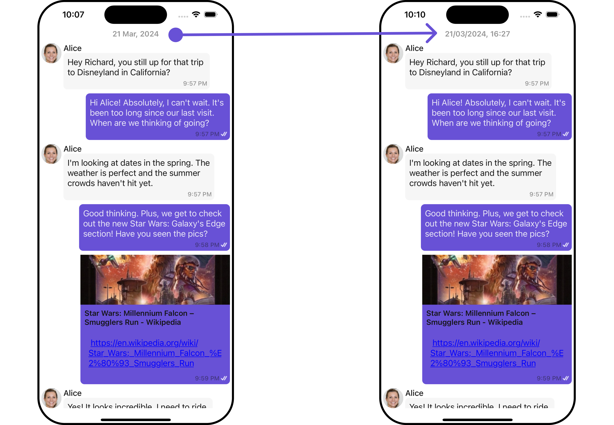

</TabItem>

<TabItem value="android" label="Android">

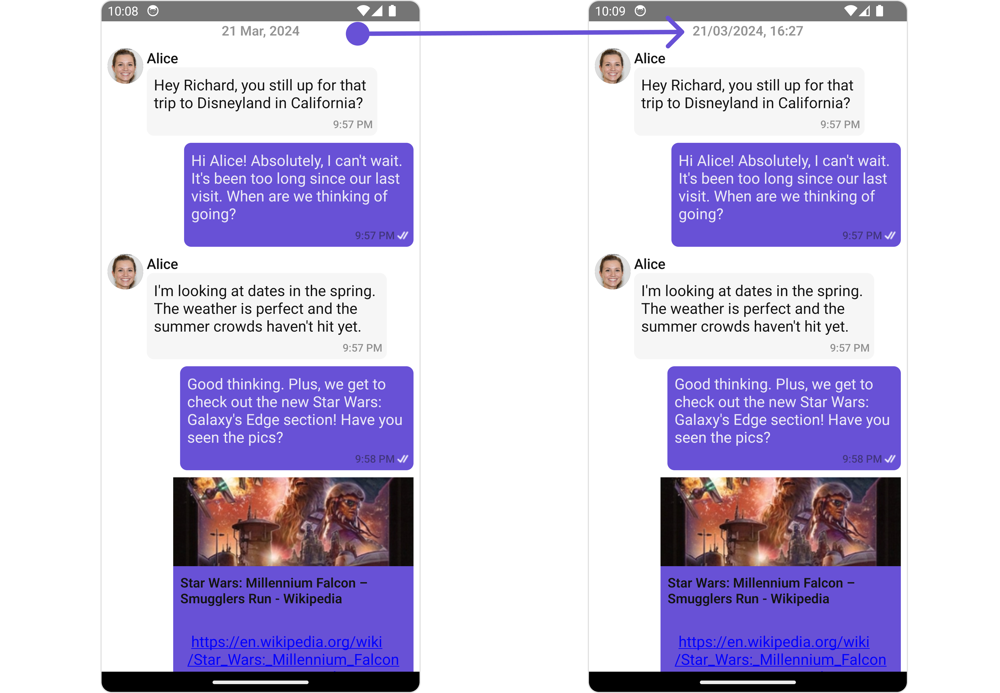

</TabItem>

</Tabs>

#### DatePattern

You can modify the date pattern to your requirement using the `datePattern` prop. Pass a custom function to use your own pattern.

<Tabs>
<TabItem value="App" label="App.tsx">

```jsx
import React from "react";
import { CometChat } from '@cometchat/chat-sdk-react-native';
import { CometChatMessageList, BorderStyleInterface, AvatarStyleInterface } from '@cometchat/chat-uikit-react-native';

function App(): React.JSX.Element {
    const [chatUser, setChatUser] = React.useState<CometChat.User| undefined>();

    React.useEffect(() => {
        CometChat.getUser("uid").then((user) => {
            setChatUser(user);
        })
    }, []);

    const generateDateString = (message: CometChat.BaseMessage) : any => {
       const days = [
         'Sunday',
         'Monday',
         'Tuesday',
         'Wednesday',
         'Thursday',
         'Friday',
         'Saturday',
       ];
      const timeStamp = message['sentAt'];
      if(timeStamp) {
         const timeStampInSeconds = new Date(timeStamp * 1000);
         const day = days[timeStampInSeconds.getUTCDay()].substring(0, 3);
         const hours = timeStampInSeconds.getUTCHours();
         const minutes = String(timeStampInSeconds.getUTCMinutes()).padStart(2, '0');

         return `${day}, ${hours}:${minutes}`;
      }

      return `---, --:--`;
    };

    return (
     <>
         { chatUser && <CometChatMessageList
          user={chatUser}
          datePattern={generateDateString}
           />
          }
     </>
   );
}
```

</TabItem>
</Tabs>

---

#### HeaderView

You can set custom headerView to the Message List component using the following method.

<Tabs>
<TabItem value="App" label="App.tsx">

```jsx
import React from "react";
import { CometChat } from '@cometchat/chat-sdk-react-native';
import { CometChatMessageList, BorderStyleInterface, AvatarStyleInterface } from '@cometchat/chat-uikit-react-native';
import { StyleProp } from 'react-native';
import bot from './bot.png';

function App(): React.JSX.Element {
    const [chatUser, setChatUser] = React.useState<CometChat.User| undefined>();

    React.useEffect(() => {
        CometChat.getUser("uid").then((user) => {
            setChatUser(user);
        })
    }, []);

  const headerViewStyle: StyleProp<ViewStyle> = {
    flexDirection: 'row',
    alignItems: 'center',
    justifyContent: 'center',
    paddingVertical: 5,
    backgroundColor: 'white',
    height: 50,
    width: '120%',
    left:-25,
    borderBottomWidth:2,
    borderBottomColor:'#6851D6'
  };

  const getHeaderView = () => {
    return (
      <View style={headerViewStyle}>
        <Text style={{ color: "#6851D6", fontWeight: "bold", marginRight: 10 }}>
          Chat Bot
        </Text>
        <Image
          style={{ tintColor: "#6851D6", height: 30, width: 30 }}
          source={bot}
        />
      </View>
    );
  };

    return (
     <>
         { chatUser && <CometChatMessageList
            user={chatUser}
            HeaderView={getHeaderView}
        />}
     </>
   );
  }
```

</TabItem>
</Tabs>

**Example**

<Tabs>

<TabItem value="iOS" label="iOS">

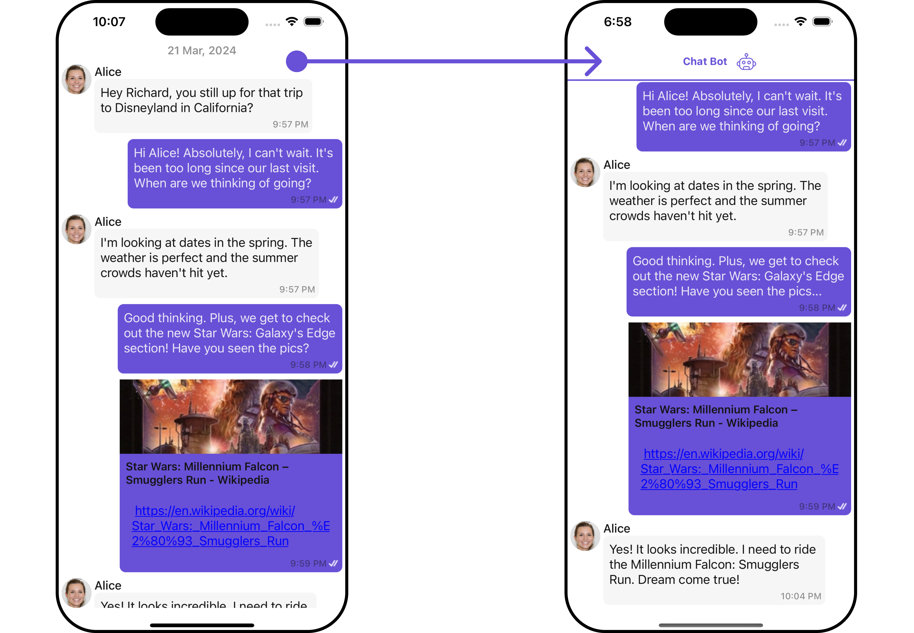

</TabItem>

<TabItem value="android" label="Android">

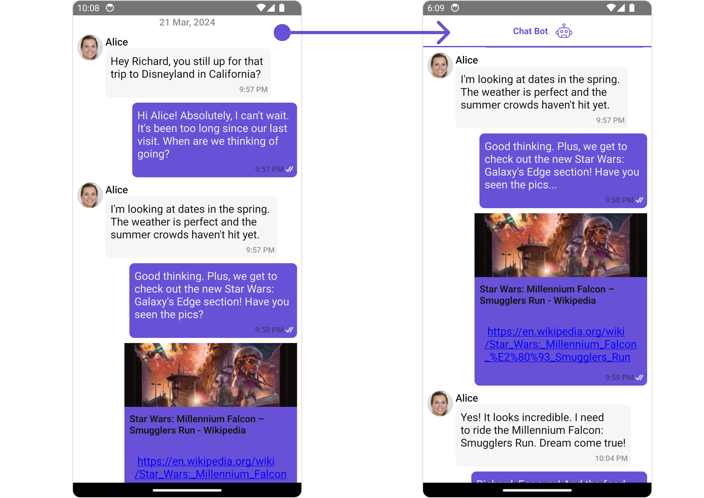

</TabItem>

</Tabs>

---

#### FooterView

You can set custom footerView to the Message List component using the following method.

<Tabs>
<TabItem value="App" label="App.tsx">

```jsx
import React from "react";
import { CometChat } from '@cometchat/chat-sdk-react-native';
import { CometChatMessageList, BorderStyleInterface, AvatarStyleInterface } from '@cometchat/chat-uikit-react-native';
import { StyleProp } from 'react-native';
import bot from './bot.png';

function App(): React.JSX.Element {
    const [chatUser, setChatUser] = React.useState<CometChat.User| undefined>();

    React.useEffect(() => {
        CometChat.getUser("uid").then((user) => {
            setChatUser(user);
        })
    }, []);

  const footerViewStyle: StyleProp<ViewStyle> = {
    flexDirection: 'row',
    alignItems: 'center',
    justifyContent: 'center',
    paddingVertical: 5,
    backgroundColor: 'white',
    height: 50,
    width: '120%',
    left:-25,
    borderBottomWidth:2,
    borderBottomColor:'#6851D6'
  };

  const getFooterView = () => {
    return (
      <View style={footerViewStyle}>
        <Text style={{ color: "#6851D6", fontWeight: "bold", marginRight: 10 }}>
          Chat Bot
        </Text>
        <Image
          style={{ tintColor: "#6851D6", height: 30, width: 30 }}
          source={bot}
        />
      </View>
    );
  };

    return (
     <>
         { chatUser && <CometChatMessageList
            user={chatUser}
            FooterView={getFooterView}
        />}
     </>
   );
  }
```

</TabItem>
</Tabs>

**Example**

<Tabs>

<TabItem value="iOS" label="iOS">

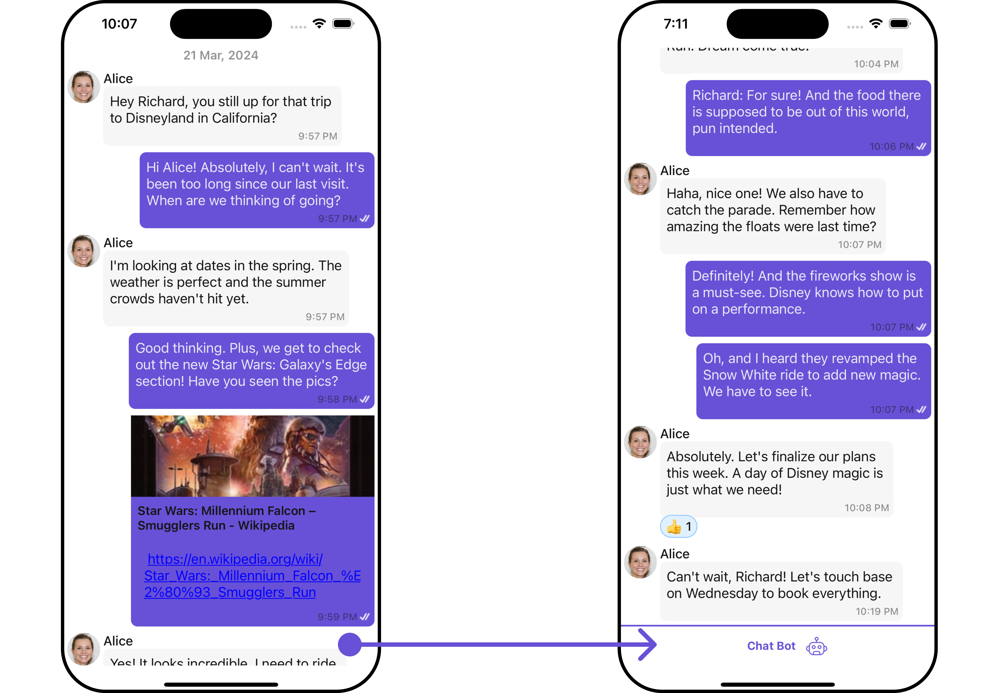
</TabItem>

<TabItem value="android" label="Android">

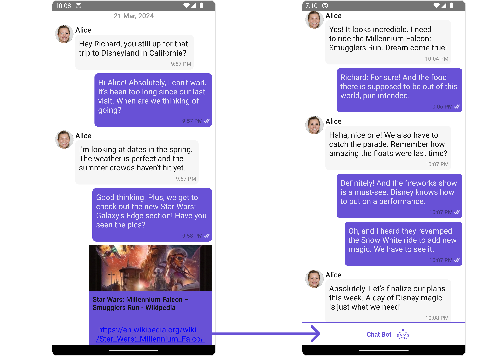

</TabItem>

</Tabs>

---

#### ErrorStateView

You can set a custom `ErrorStateView` to match the error view of your app.

<Tabs>
<TabItem value="App" label="App.tsx">

```jsx
import React from "react";
import { CometChat } from '@cometchat/chat-sdk-react-native';
import { CometChatMessageList, BorderStyleInterface, AvatarStyleInterface } from '@cometchat/chat-uikit-react-native';

function App(): React.JSX.Element {
    const [chatUser, setChatUser] = React.useState<CometChat.User| undefined>();

    React.useEffect(() => {
        CometChat.getUser("uid").then((user) => {
            setChatUser(user);
        })
    }, []);

    const errorViewStyle: StyleProp<ViewStyle> = {
       flex: 1,
       alignItems: 'center',
       justifyContent: 'center',
       padding: 10,
       borderColor: 'black',
       borderWidth: 1,
       backgroundColor: '#E8EAE9',
    };

    const getErrorStateView = () => {
      return (
        <View style={errorViewStyle}>
        <Text style={{fontSize: 80, color: "black"}}>Error</Text>
      </View>
      );
    };

    return (
     <>
         { chatUser && <CometChatMessageList
            user={chatUser}
            messageRequestBuilder={new CometChat.MessagesRequestBuilder().setLimit(1000)}
            ErrorStateView={getErrorStateView}
        />}
     </>
   );
  }
```

</TabItem>
</Tabs>

**Example**

<Tabs>

<TabItem value="iOS" label="iOS">

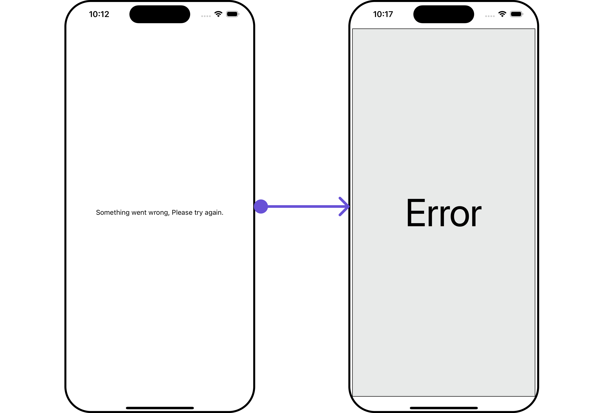

</TabItem>

<TabItem value="android" label="Android">

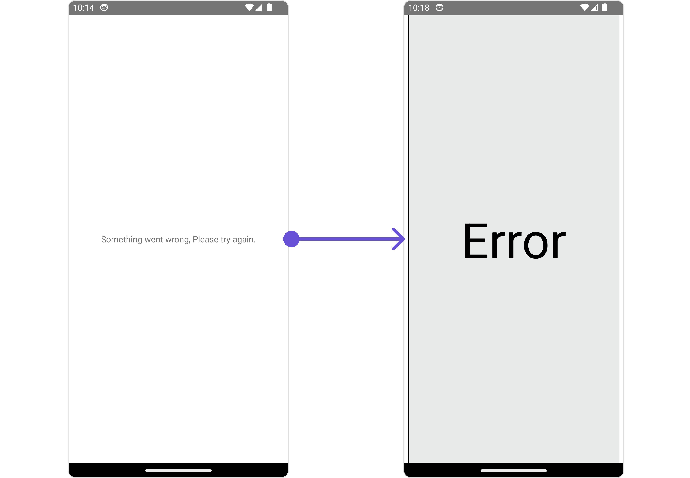

</TabItem>

</Tabs>

---

#### EmptyStateView

The `EmptyStateView` method provides the ability to set a custom empty state view in your app. An empty state view is displayed when there are no messages for a particular user.

<Tabs>
<TabItem value="App" label="App.tsx">

```jsx
import React from "react";
import { CometChat } from '@cometchat/chat-sdk-react-native';
import { CometChatMessageList, BorderStyleInterface, AvatarStyleInterface } from '@cometchat/chat-uikit-react-native';

function App(): React.JSX.Element {
    const [chatUser, setChatUser] = React.useState<CometChat.User| undefined>();

    React.useEffect(() => {
        CometChat.getUser("uid").then((user) => {
            setChatUser(user);
        })
    }, []);

    const emptyViewStyle: StyleProp<ViewStyle> = {
       flex: 1,
       alignItems: 'center',
       justifyContent: 'center',
       padding: 10,
       borderColor: 'black',
       borderWidth: 1,
       backgroundColor: '#E8EAE9',
    };

    const getEmptyStateView = () => {
      return (
        <View style={emptyViewStyle}>
          <Text style={{fontSize: 80, color: "black"}}>Empty</Text>
        </View>
      );
    };

    return (
     <>
         { chatUser && <CometChatMessageList
            user={chatUser}
            messageRequestBuilder={new CometChat.MessagesRequestBuilder().setLimit(5)}
            EmptyStateView={getEmptyStateView}
        />}
     </>
   );
  }
```

</TabItem>
</Tabs>

**Example**

<Tabs>

<TabItem value="iOS" label="iOS">

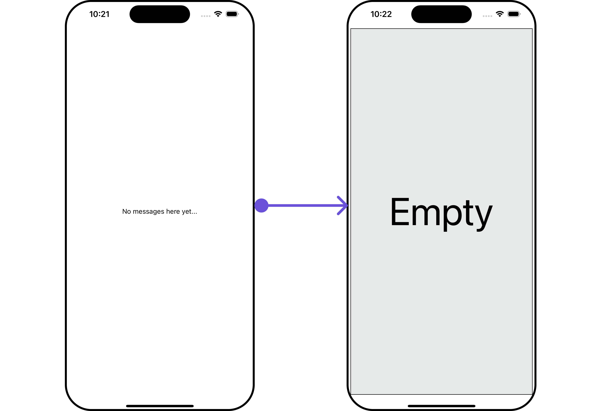

</TabItem>

<TabItem value="android" label="Android">

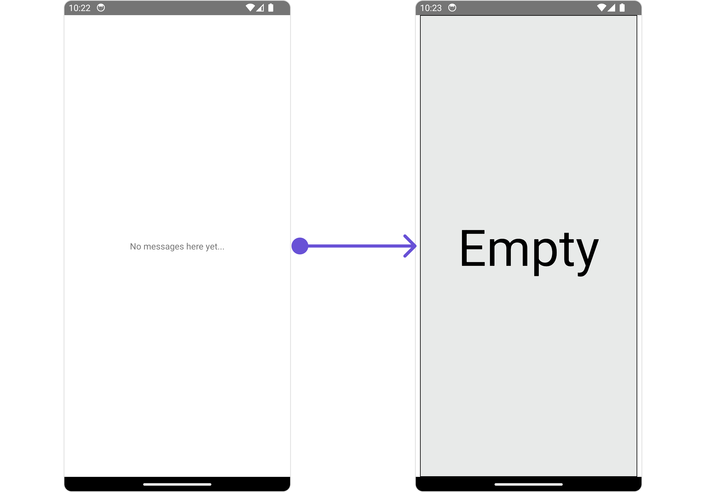

</TabItem>

</Tabs>

---

#### TextFormatters

Assigns the list of text formatters. If the provided list is not null, it sets the list. Otherwise, it assigns the default text formatters retrieved from the data source. To configure the existing Mentions look and feel check out [CometChatMentionsFormatter](./mentions-formatter-guide)

<Tabs>
<TabItem value="ShortCutFormatter" label="ShortCutFormatter.ts">

```typescript
import { CometChat } from "@cometchat/chat-sdk-react-native";
import {
  CometChatTextFormatter,
  SuggestionItem,
} from "@cometchat/chat-uikit-react-native";

export class ShortCutFormatter extends CometChatTextFormatter {
  constructor() {
    super();
    this.trackCharacter = "!";
  }

  search = (searchKey: string) => {
    let data: Array<SuggestionItem> = [];

    CometChat.callExtension("message-shortcuts", "GET", "v1/fetch", undefined)
      .then((data: any) => {
        if (data && data?.shortcuts) {
          let suggestionData = Object.keys(data.shortcuts).map((key) => {
            return new SuggestionItem({
              id: key,
              name: data.shortcuts[key],
              promptText: data.shortcuts[key],
              trackingCharacter: "!",
              underlyingText: data.shortcuts[key],
            });
          });
          this.setSearchData(suggestionData); // setting data in setSearchData();
        }
      })
      .catch((error) => {
        // Some error occured
      });

    this.setSearchData(data);
  };

  // return null in fetchNext, if there's no pagination.
  fetchNext = () => {
    return null;
  };
}
```

</TabItem>

<TabItem value="App" label="App.tsx">

```typescript
import React from "react";
import { CometChat } from "@cometchat/chat-sdk-react-native";
import { CometChatMessageList } from "@cometchat/chat-uikit-react-native";
import { ShortCutFormatter } from "./ShortcutsTextFormatter";

function App(): React.JSX.Element {
  const [chatUser, setChatUser] = React.useState<CometChat.User | undefined>();

  React.useEffect(() => {
    CometChat.getUser("uid").then((user) => {
      setChatUser(user);
    });
  }, []);

  const shortcutFormatter = new ShortCutFormatter();

  return <CometChatMessageList textFormatters={[new ShortcutFormatter()]} />;
}
```

</TabItem>
</Tabs>

---

## Configuration

[Configurations](/ui-kit/react-native/components-overview#configurations) offer the ability to customize the properties of each component within a Composite Component.

### MessageInformation

From the MessageList, you can navigate to the [MesssageInformation](/ui-kit/react-native/message-information) component as shown in the image.

<Tabs>

<TabItem value="iOS" label="iOS">

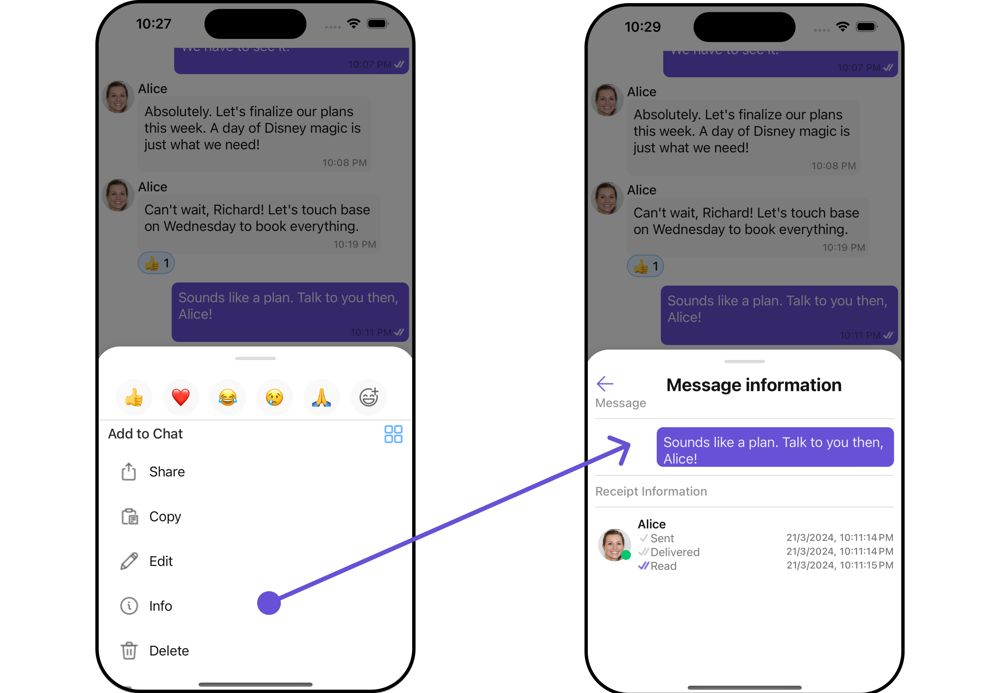

</TabItem>

<TabItem value="android" label="Android">

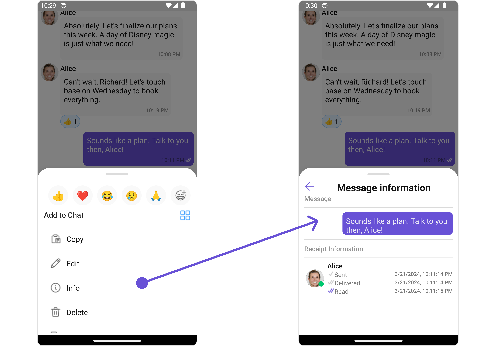

</TabItem>

</Tabs>

If you wish to modify the properties of the [MesssageInformation](/ui-kit/react-native/message-information) Component, you can use the `MessageInformationConfiguration` object.

<Tabs>
<TabItem value="App" label="App.tsx">

```jsx
import React from "react";
import { CometChat } from '@cometchat/chat-sdk-react-native';
import { CometChatMessageList, MessageInformationStyleInterface, MessageInformationConfigurationInterface } from '@cometchat/chat-uikit-react-native';

function App(): React.JSX.Element {
    const [chatUser, setChatUser] = React.useState<CometChat.User| undefined>();

    React.useEffect(() => {
        CometChat.getUser("uid").then((user) => {
            setChatUser(user);
        })
    }, []);

  const messageInformationStyle : MessageInformationStyleInterface = {
    titleTextColor: "#6851D6",
    subtitleTextColor: "red",
  }

  const messageInformationConfiguration : MessageInformationConfigurationInterface = {
    messageInformationStyle: messageInformationStyle
  }
    return (
     <>
         { chatUser && <CometChatMessageList
            user={chatUser}
            messageInformationConfiguration={messageInformationConfiguration}
        />}
     </>
   );
  }
```

</TabItem>
</Tabs>

The `MessageInformationConfiguration` indeed provides access to all the [Action](/ui-kit/react-native/message-information#style), [Filters](/ui-kit/react-native/message-information#filters), [Styles](#style), [Functionality](/ui-kit/react-native/message-information#functionality), and [Advanced](/ui-kit/react-native/message-information#advanced) properties of the [MesssageInformation](/ui-kit/react-native/message-information) component.

Please note that the properties marked with the <a data-tooltip-id="my-tooltip-html-prop"><span class="material-icons red">report</span></a> symbol are not accessible within the Configuration Object.

**Example**

<Tabs>

<TabItem value="iOS" label="iOS">

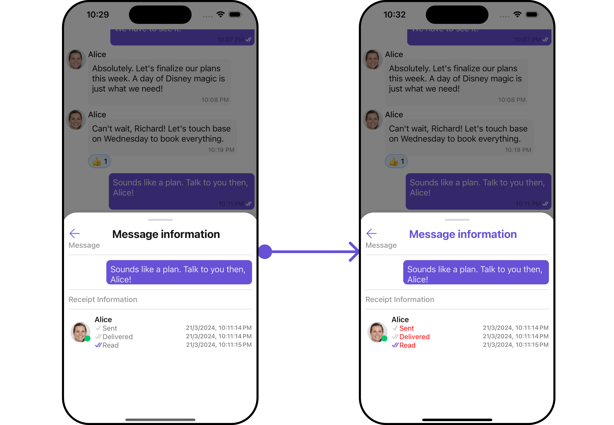

</TabItem>

<TabItem value="android" label="Android">

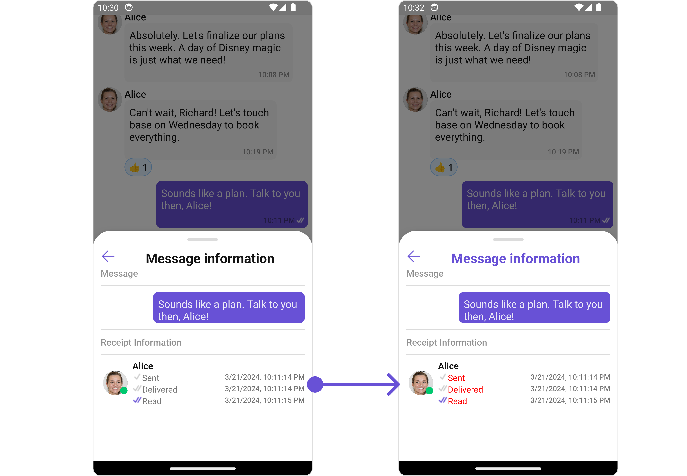

</TabItem>

</Tabs>

In the above example, we are styling a few properties of the [MesssageInformation](/ui-kit/react-native/message-information) component using `MessageInformationConfiguration`.

### QuickReactions

From the MessageList, you can navigate to the [QuickReactions](/ui-kit/react-native/quick-reactions) component as shown in the image.

If you wish to modify the properties of the [QuickReactions](/ui-kit/react-native/quick-reactions) Component, you can use the [QuickReactionConfiguration](/ui-kit/react-native/quick-reactions#functionality) object.

import { Tooltip } from 'react-tooltip'
import 'react-tooltip/dist/react-tooltip.css'

<Tooltip
  id="my-tooltip-html-prop"
  html="Not available in MessageListConfiguration"
/>
