import Tabs from '@theme/Tabs';
import TabItem from '@theme/TabItem';

## Overview

A MessageTemplate provides you with the capability to define and customize both the structure and the behavior of the [MessageBubble](/ui-kit/react-native/message-bubble). It acts as a schema or design blueprint for the creation of a variety of [MessageBubble](/ui-kit/react-native/message-bubble) components, allowing you to manage the appearance and interactions of [MessageBubble](/ui-kit/react-native/message-bubble) within your application effectively and consistently.

### Structure

<Tabs>

<TabItem value="iOS" label="iOS">

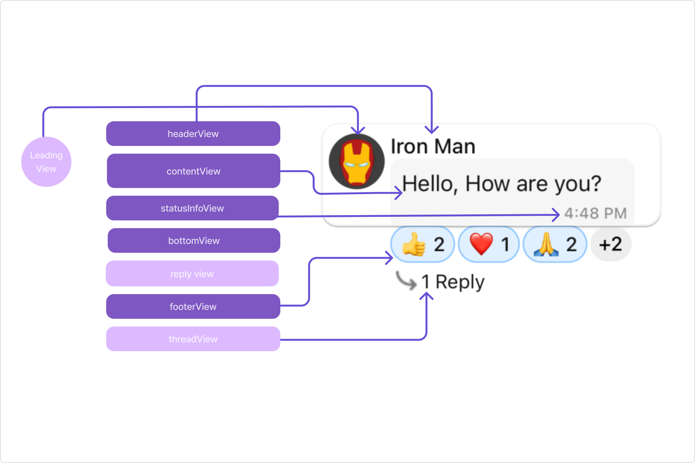

</TabItem>

<TabItem value="android" label="Android">


</TabItem>

</Tabs>

The MessageBubble structure can typically be broken down into the following views:

1. **Leading view**: This is where the sender's avatar is displayed. It's typically on the left of the MessageBubble for messages from others and on the right for messages from the current user.

2. **Header view**: This displays the sender's name and is especially useful in group chats where multiple users are sending messages.

3. **Reply view**: This view can be used to extend the MessageBubble with additional elements. It's typically placed above the Content view.

4. **Content view**: This is the core of the MessageBubble where the message content (text, images, videos, etc.) is displayed.

5. **Bottom view**: This view can be used to extend the MessageBubble with additional elements, such as link previews or a 'load more' button for long messages. It's typically placed beneath the Content view.

6. **Thread view**: This is where the thread reply icon and reply counts are displayed. It's located below the footer view.

7. **Footer view**: This is where the reactions are displayed. It's located at the bottom of the MessageBubble.

8. **StatusInfo view**: This is where the timestamp of the message and its delivery or read status are displayed. It's located inside the MessageBubble just below the content view.

### Properties

MessageTemplate provides you with methods that allow you to alter various properties of the MessageBubble. These properties include aspects such as the `type` and `category` of a message, the appearance and behavior of the header, content, and footer sections of the message bubble,

1. **type**

   Using `type` you can set the type of CometChatMessage, This will map your MessageTemplate to the corresponding CometChatMessage. You can set the MessageTemplate Type using the following code snippet.

2. **category**

   Using `category` you can set the category of a MessageTemplate. This will create a MessageTemplate with the specified category and link it with a CometChatMessage of the same category.

   Please refer to our guide on [Message Categories](/sdk/react-native/message-structure-and-hierarchy) for a deeper understanding of message categories.

3. **HeaderView**

   The `headerView` method allows you to assign a custom header view to the MessageBubble. By default, it is configured to display the sender's name.

4. **ContentView**

   The `contentView` method allows you to assign a custom content view to the MessageBubble. By default, it displays the [Text Bubble](/ui-kit/react-native/text-bubble), [Image Bubble](/ui-kit/react-native/image-bubble), [File Bubble](/ui-kit/react-native/file-bubble), [Audio Bubble](/ui-kit/react-native/audio-bubble), or [Video Bubble](/ui-kit/react-native/video-bubble), depending on the message type.

5. **FooterView**

   The `footerView` method allows you to assign a custom Footer view to the MessageBubble. By default it shows thr reactions for the message bubble.

6. **BubbleView**

   The `bubbleView` method allows you to assign a custom Bubble view to the MessageBubble. By default, headerView, contentView, statusInfoView and footerView together form a message bubble.

7. **StatusInfoView**

   The `statusInfoView` method allows you to assign a custom status info view to the MessageBubble. By default, it displays the receipt and timestamp.

8. **options**

   The `options` lets you set the list of actions that a user can perform on a message. This includes actions like reacting to, editing, or deleting a message.

---

```tsx
import { CometChat } from "@cometchat/chat-sdk-react-native";
import {
  CometChatUIKit,
  CometChatTheme,
} from "@cometchat/chat-uikit-react-native";

const theme = new CometChatTheme({});
let allTemplates = CometChatUIKit.getDataSource().getAllMessageTemplates(theme);

const customMessageTemplate = new CometChatMessageTemplate({
  type: "CUSTOM_MESSAGE_TYPE",
  category: CometChatUiKitConstants.MessageCategoryConstants.custom,
  HeaderView: (
    messageObject: CometChat.BaseMessage,
    alignment: CometChatUiKitConstants.MessageBubbleAlignmentType
  ) => {
    return <></>;
  },
  ContentView: (
    messageObject: CometChat.BaseMessage,
    alignment: CometChatUiKitConstants.MessageBubbleAlignmentType
  ) => {
    return <></>;
  },
  FooterView: (
    messageObject: CometChat.BaseMessage,
    alignment: CometChatUiKitConstants.MessageBubbleAlignmentType
  ) => {
    return <></>;
  },
  BubbleView: (messageObject: CometChat.BaseMessage) => {
    return <></>;
  },
  StatusInfoView: (
    messageObject: CometChat.BaseMessage,
    alignment: CometChatUiKitConstants.MessageBubbleAlignmentType
  ) => {
    return <></>;
  },
  options: (
    loggedInUser: CometChat.User,
    messageObject: CometChat.BaseMessage,
    group: CometChat.Group
  ) => {
    let options: CometChatMessageOption[] = [];
    //code
    return options;
  },
});

allTemplates.push(customMessageTemplate);
```

---

## Customization

Let's dive into how you can use the [properties](#properties) of MessageTemplate to customize an existing template or add a new one to the [MessageList](/ui-kit/react-native/message-list) component.

The First step is to fetch the list of existing templates when you want to modify or add to them. This can be done using the getAllMessageTemplates() method from the DataSource of the CometChatUIKit class.

```javascript
let definedTemplates =
  ChatConfigurator.getDataSource().getAllMessageTemplates(theme);
```

### Existing Templates

You will need to first get the MessageTemplate object for the type of message you want to customize. You will be customizing the TextMessage Bubble here. The code snippet to get the Text MessageTemplate is as follows.

<Tabs>
<TabItem value="TypeScript" label="TypeScript">

```javascript
import { CometChat } from "@cometchat/chat-sdk-react-native";
import {
  CometChatUIKit,
  CometChatTheme,
} from "@cometchat/chat-uikit-react-native";

const theme = new CometChatTheme({});
let allTemplates = CometChatUIKit.getDataSource().getAllMessageTemplates(theme);
for (let i = 0; i < allTemplates.length; i++) {
  if (
    allTemplates[i].type == CometChatUiKitConstants.CometChatMessageTypes.text
  ) {
    //customize allTemplates[i]
  }
}
```

</TabItem>
</Tabs>

You will be using [Messages](/ui-kit/react-native/messages#overview) Component for example here so to apply Template to Messages you will need to use `MessageListConfiguration`. This is because the [templates](/ui-kit/react-native/message-list#templates) function, which is used to apply the custom templates, belongs to the [MessageList](./message-list) component.

You can apply MessageTemplates to Messages Component using the following code snippet.

<Tabs>
<TabItem value="TypeScript" label="TypeScript">

```typescript
import { CometChat } from "@cometchat/chat-sdk-react-native";
import {
  CometChatUIKit,
  CometChatMessageComposerInterface,
  CometChatTheme,
} from "@cometchat/chat-uikit-react-native";

function App(): React.JSX.Element {
  const [chatUser, setChatUser] = React.useState<CometChat.User | undefined>();

  React.useEffect(() => {
    CometChat.getUser("uid").then((user) => {
      setChatUser(user);
    });
  }, []);

  let allTemplates =
    CometChatUIKit.getDataSource().getAllMessageTemplates(theme);

  // Creating a new custom message template
  const customMessageTemplate = new CometChatMessageTemplate({
    type: "CUSTOM_MESSAGE_TYPE",
    category: CometChatUiKitConstants.MessageCategoryConstants.custom,

    HeaderView: (
      messageObject: CometChat.BaseMessage,
      alignment: CometChatUiKitConstants.MessageBubbleAlignmentType
    ) => {
      return <></>; // Replace this with the actual component you want to render
    },

    ContentView: (
      messageObject: CometChat.BaseMessage,
      alignment: CometChatUiKitConstants.MessageBubbleAlignmentType
    ) => {
      return <></>; // Replace this with the actual component you want to render
    },

    FooterView: (
      messageObject: CometChat.BaseMessage,
      alignment: CometChatUiKitConstants.MessageBubbleAlignmentType
    ) => {
      return <></>; // Replace this with the actual component you want to render
    },

    BubbleView: (messageObject: CometChat.BaseMessage) => {
      return <></>; // Replace this with the actual component you want to render
    },

    StatusInfoView: (
      messageObject: CometChat.BaseMessage,
      alignment: CometChatUiKitConstants.MessageBubbleAlignmentType
    ) => {
      return <></>; // Replace this with the actual component you want to render
    },

    options: (
      loggedInUser: CometChat.User,
      messageObject: CometChat.BaseMessage,
      group: CometChat.Group
    ) => {
      let options: CometChatMessageOption[] = [];
      // Add your code here
      return options;
    },
  });

  allTemplates.push(customMessageTemplate);

  const messageListConfiguration: MessageListConfigurationInterface = {
    templates: allTemplates,
  };

  return (
    <>
      {chatUser && (
        <CometChatMessages
          user={chatUser}
          messageListConfiguration={messageListConfiguration}
        />
      )}
    </>
  );
}
```

</TabItem>
</Tabs>

#### HeaderView

The `HeaderView` method of MessageTemplate allows you to add custom views to the header of your message bubbles. In the example below, we will add a custom header view of every text message in the MessageList.

<Tabs>

<TabItem value="iOS" label="iOS">

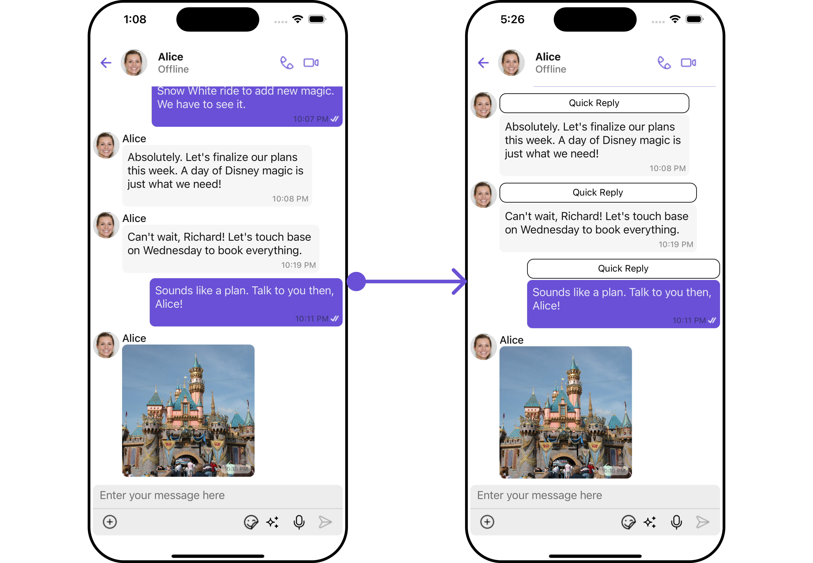

</TabItem>

<TabItem value="android" label="Android">

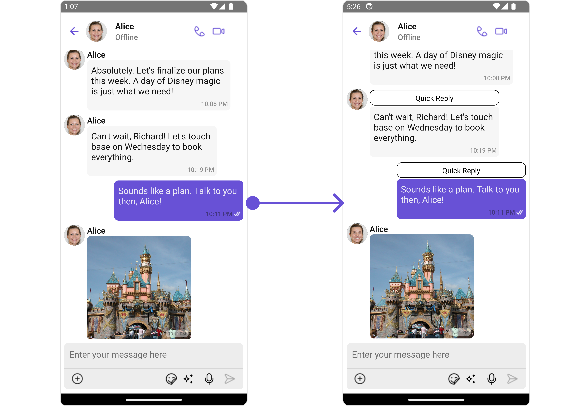

</TabItem>

</Tabs>

<Tabs>
<TabItem value="TypeScript" label="App.tsx">

```tsx
import { CometChat } from "@cometchat/chat-sdk-react-native";
import {
  CometChatUIKit,
  CometChatUiKitConstants,
  CometChatTheme,
} from "@cometchat/chat-uikit-react-native";

function App(): React.JSX.Element {
  const [chatUser, setChatUser] = React.useState<CometChat.User | undefined>();

  React.useEffect(() => {
    CometChat.getUser("uid").then((user) => {
      setChatUser(user);
    });
  }, []);

  let allTemplates =
    CometChatUIKit.getDataSource().getAllMessageTemplates(theme);

  const viewStyle: StyleProp<ViewStyle> = {
    flexDirection: "row",
    alignItems: "flex-start",
    justifyContent: "center",
    borderColor: "black",
    borderWidth: 1,
    paddingTop: 5,
    marginTop: 2,
    marginBottom: 2,
    backgroundColor: "white",
    borderRadius: 10,
    height: 30,
    width: "100%",
  };

  for (let i = 0; i < allTemplates.length; i++) {
    if (
      allTemplates[i].type ==
        CometChatUiKitConstants.CometChatMessageTypes.text &&
      allTemplates[i].category ==
        CometChatUiKitConstants.MessageCategoryConstants.message
    ) {
      allTemplates[i].HeaderView = (
        messageObject: CometChat.BaseMessage,
        alignment: CometChatUiKitConstants.MessageBubbleAlignmentType
      ) => {
        return (
          <View style={viewStyle}>
            <Text style={{ color: "black" }}>Quick Reply</Text>
          </View>
        );
      };
    }
  }

  const messageListConfiguration: MessageListConfigurationInterface = {
    templates: allTemplates,
  };

  return (
    <>
      {chatUser && (
        <CometChatMessages
          user={chatUser}
          messageListConfiguration={messageListConfiguration}
        />
      )}
    </>
  );
}
```

</TabItem>
</Tabs>

#### ContentView

The `ContentView` method of MessageTemplate allows you to add a custom view to the content of your message bubbles. In the example below, we will add a custom layout to the content view of every text message in the MessageList.

<!--  -->

<Tabs>
<TabItem value="TypeScript" label="App.tsx">

```tsx title='App.tsx'
import { CometChat } from "@cometchat/chat-sdk-react-native";
import {
  ChatConfigurator,
  CometChatUiKitConstants,
  CometChatTheme,
} from "@cometchat/chat-uikit-react-native";
import RocketGif from "./rocket.gif";

function App(): React.JSX.Element {
  const [chatUser, setChatUser] = React.useState<CometChat.User | undefined>();

  React.useEffect(() => {
    CometChat.getUser("uid").then((user) => {
      setChatUser(user);
    });
  }, []);

  let allTemplates =
    ChatConfigurator.getDataSource().getAllMessageTemplates(theme);
  const CUSTOM_MESSAGE_TYPE = "nudge";

  let nudgeMessageTemplate = new CometChatMessageTemplate({
    type: CUSTOM_MESSAGE_TYPE,
    category: CometChatUiKitConstants.MessageCategoryConstants.custom,
    ContentView: (message: CometChat.BaseMessage) => getContentView(message),
  });

  const getContentView = (message: CometChat.BaseMessage) => {
    return <Image source={RocketGif} style={{ width: 100, height: 100 }} />;
  };

  allTemplates.push(nudgeMessageTemplate);
  const messageListConfiguration: MessageListConfigurationInterface = {
    templates: allTemplates,
  };

  return (
    <>
      {chatUser && (
        <CometChatMessages
          user={chatUser}
          messageListConfiguration={messageListConfiguration}
        />
      )}
    </>
  );
}
```

</TabItem>
</Tabs>

#### FooterView

The `FooterView` method of MessageTemplate allows you to add a footer view to your message bubbles. In the example below, we will add a custom footer view to every text message in the MessageList.

<Tabs>

<TabItem value="iOS" label="iOS">

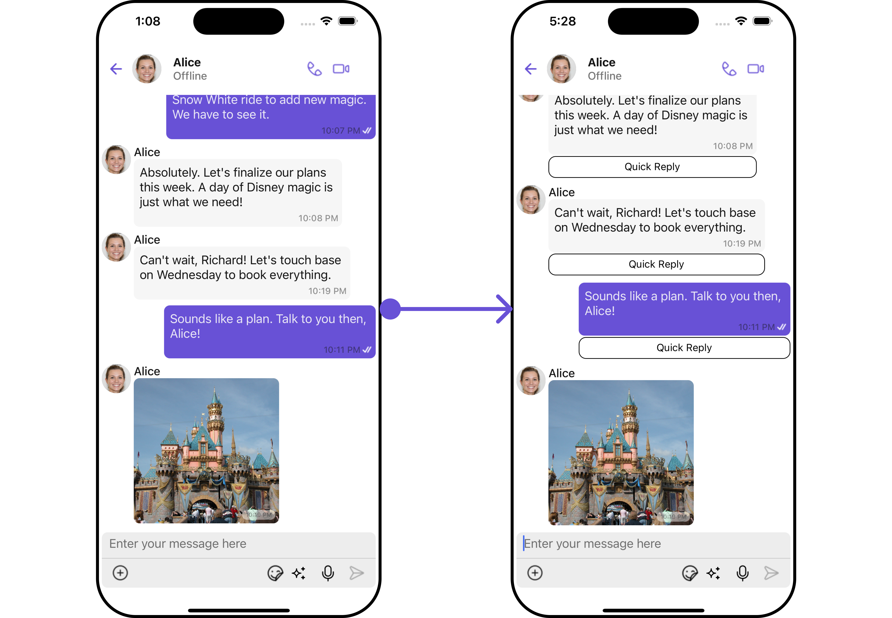

</TabItem>

<TabItem value="android" label="Android">

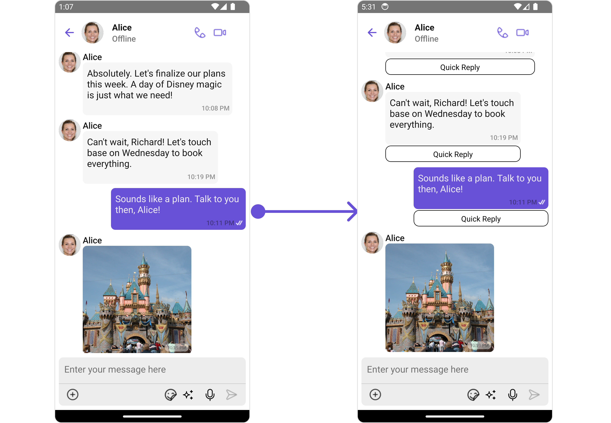

</TabItem>

</Tabs>

<Tabs>
<TabItem value="TypeScript" label="App.tsx">

```TypeScript title='App.tsx'
import { CometChat } from '@cometchat/chat-sdk-react-native';
import { CometChatUIKit, CometChatUiKitConstants, CometChatTheme } from '@cometchat/chat-uikit-react-native';


function App(): React.JSX.Element {
    const [chatUser, setChatUser] = React.useState<CometChat.User| undefined>();

    React.useEffect(() => {
        CometChat.getUser("uid").then((user) => {
            setChatUser(user);
        })
    }, []);

    let allTemplates = CometChatUIKit.getDataSource().getAllMessageTemplates(theme);

    const viewStyle: StyleProp<ViewStyle> = {
       flexDirection: 'row',
       alignItems: 'flex-start',
       justifyContent: 'center',
       borderColor: 'black',
       borderWidth: 1,
       paddingTop: 5,
       marginTop: 2,
       marginBottom: 2,
       backgroundColor: 'white',
       borderRadius: 10,
       height: 30,
       width: '100%',
    };

    for(let i = 0; i < allTemplates.length; i++) {
        if(allTemplates[i].type == CometChatUiKitConstants.CometChatMessageTypes.text && allTemplates[i].category == CometChatUiKitConstants.MessageCategoryConstants.message) {

            allTemplates[i].FooterView = (messageObject: CometChat.BaseMessage,
                                      alignment: CometChatUiKitConstants.MessageBubbleAlignmentType) =>
                                      {
                                          return <View style={viewStyle}><Text style={{color: 'black'}}>Quick Reply</Text></View>;
                                      }
        }
    }

    const messageListConfiguration : MessageListConfigurationInterface = {
       templates: allTemplates
    }

    return (
      <>
        { chatUser && <CometChatMessages
             user={chatUser}
             messageListConfiguration={messageListConfiguration}
          />
         }
      </>
    );
}
```

</TabItem>
</Tabs>

#### BubbleView

The `BubbleView` method of MessageTemplate allows you to add a bubble view to your message bubbles. In the example below, we will add a custom bubble view to the text message in the MessageList.

<Tabs>

<TabItem value="iOS" label="iOS">

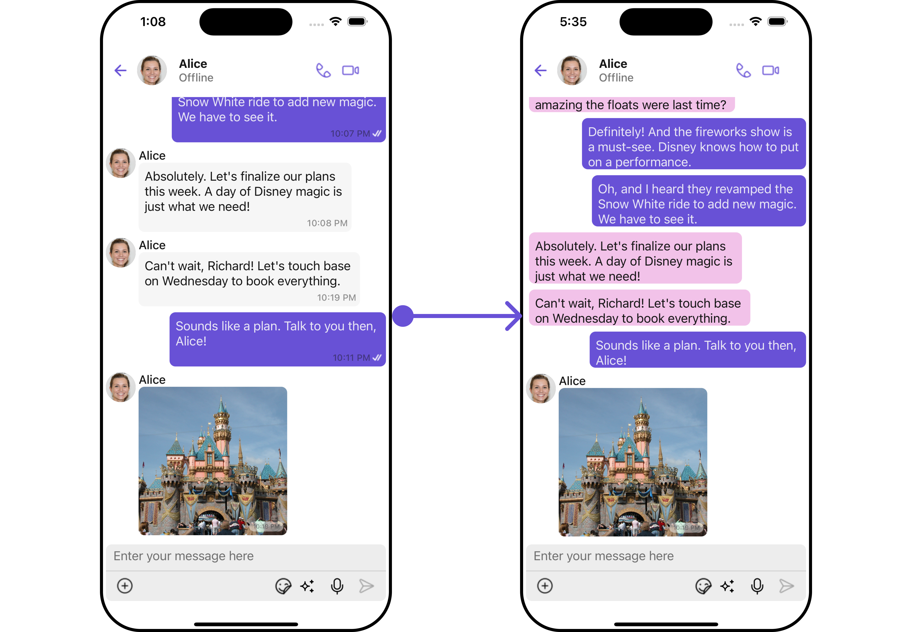

</TabItem>

<TabItem value="android" label="Android">

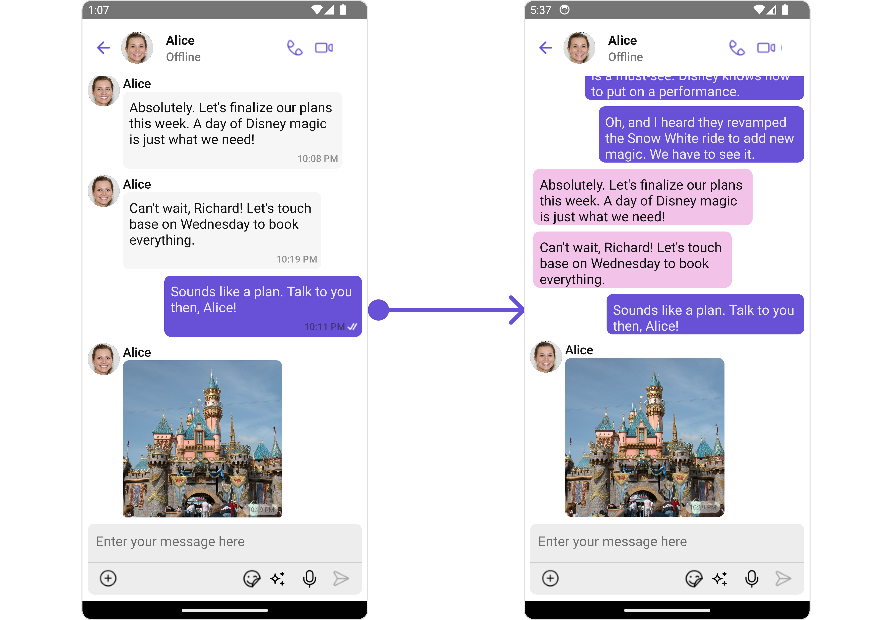

</TabItem>

</Tabs>

<Tabs>
<TabItem value="TypeScript" label="App.tsx">

```TypeScript title='App.tsx'
import { CometChat } from '@cometchat/chat-sdk-react-native';
import { CometChatUIKit, CometChatUiKitConstants, CometChatTheme, MessageListConfigurationInterface } from '@cometchat/chat-uikit-react-native';


function App(): React.JSX.Element {
    const [chatUser, setChatUser] = React.useState<CometChat.User| undefined>();

   //CometChat Login

    React.useEffect(() => {
        CometChat.getUser("uid").then((user) => {
            setChatUser(user);
        })
    }, []);

    let theme = new CometChatTheme({});
    let allTemplates = CometChatUIKit.getDataSource().getAllMessageTemplates(theme);

    const getAlignment = useCallback((item: CometChat.BaseMessage) => {
       if (item && item.getCategory() == CometChatUiKitConstants.MessageCategoryConstants.action)
          return "center";
       if (item.getSender()?.getUid() == loggedInUser.getUid())
          return "right";
       return "left";
    }, [])


    const getTextMessageBubble = (message: CometChat.BaseMessage) => {
       const alignment  = getAlignment(message);
       return   <CometChatMessageBubble
                   id ="text"
                   alignment={alignment}
                   ContentView={
                   () => {
                     return  <CometChatTextBubble
                               text={(message as CometChat.TextMessage).getText()}
                               style={{
                               width: '100%',
                               height: 1000,
                               backgroundColor: alignment == "right" ? '#6851D6' : '#f2c2e9',
                               textFont: theme?.typography.body,
                               textColor: alignment == "right" ? theme?.palette.getSecondary() : theme?.palette?.getAccent(),
                               borderRadius: 8
                               }}
                              />}
                    }
                />
    }

    for(let i = 0; i < allTemplates.length; i++) {
        if(allTemplates[i].type == CometChatUiKitConstants.CometChatMessageTypes.text && allTemplates[i].category == CometChatUiKitConstants.MessageCategoryConstants.message) {
            allTemplates[i].BubbleView = getTextMessageBubble;
        }
    }

    const messageListConfiguration : MessageListConfigurationInterface = {
       templates: allTemplates
    }

    return (
      <>
        { chatUser && <CometChatMessages
             user={chatUser}
             messageListConfiguration={messageListConfiguration}
          />
         }
      </>
    );
}
```

</TabItem>
</Tabs>

#### Options

The `options` method in the MessageTemplate allows you to customize the options that appear in the action sheet when a message is long-pressed. By default, CometChat UI Kit provides a set of options like "Thread Reply", "Copy" ,"Edit", and "Delete".

However, if you wish to override or modify these options, you can use the `options` method and pass a list of `CometChatMessageOption`. This list of options will replace the default set.

<Tabs>

<TabItem value="iOS" label="iOS">

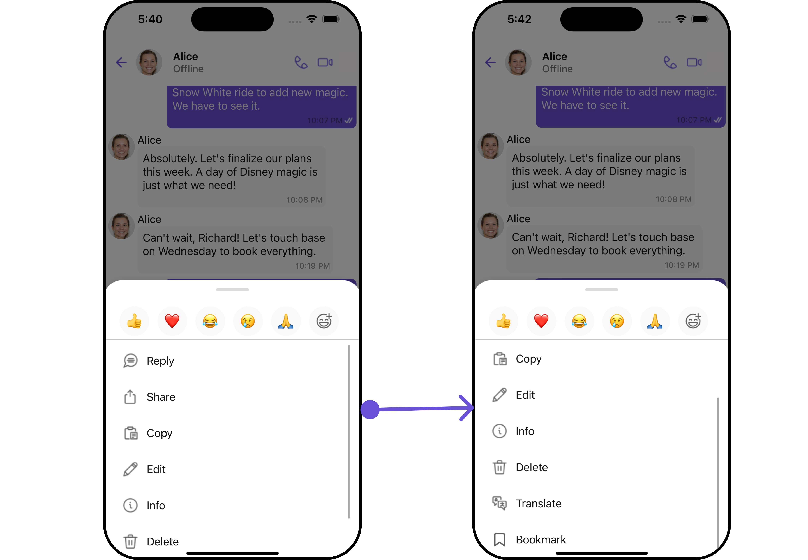

</TabItem>

<TabItem value="android" label="Android">

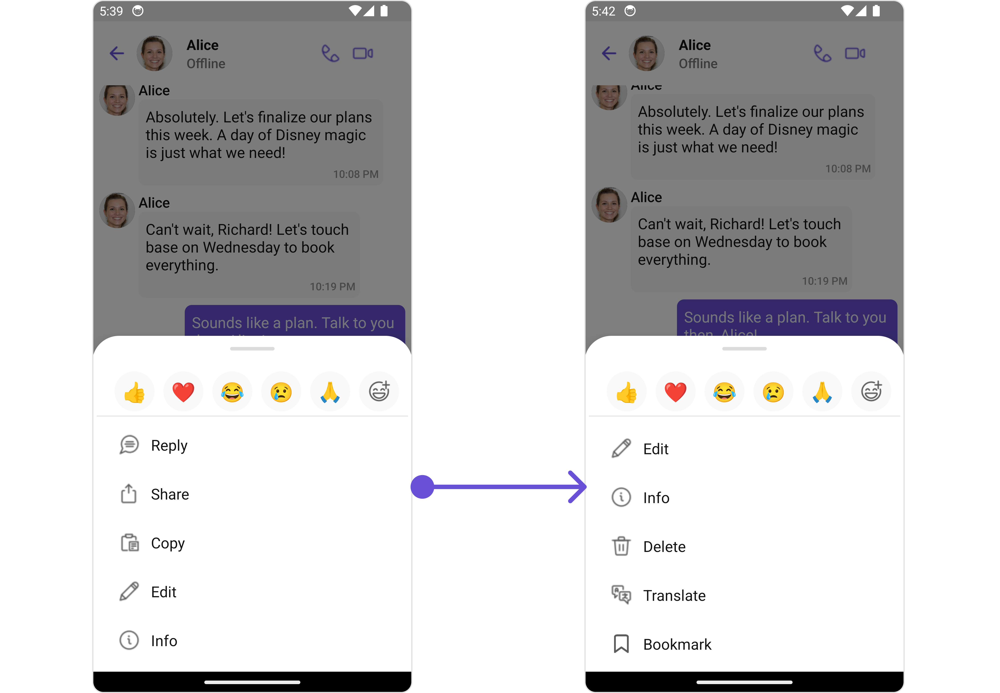

</TabItem>

</Tabs>

<Tabs>
<TabItem value="TypeScript" label="App.tsx">

```TypeScript title='App.tsx'
import { CometChat } from '@cometchat/chat-sdk-react-native';
import { CometChatUIKit, CometChatUiKitConstants, CometChatTheme, MessageListConfigurationInterface } from '@cometchat/chat-uikit-react-native';


function App(): React.JSX.Element {
    const [chatUser, setChatUser] = React.useState<CometChat.User| undefined>();

   //CometChat Login

    React.useEffect(() => {
        CometChat.getUser("uid").then((user) => {
            setChatUser(user);
        })
    }, []);

    let theme = new CometChatTheme({});
    let allTemplates = CometChatUIKit.getDataSource().getAllMessageTemplates(theme);

    const getAlignment = useCallback((item: CometChat.BaseMessage) => {
       if (item && item.getCategory() == CometChatUiKitConstants.MessageCategoryConstants.action)
          return "center";
       if (item.getSender()?.getUid() == loggedInUser.getUid())
          return "right";
       return "left";
    }, [])


    const getOptions = (loggedInUser: CometChat.User, messageObject: CometChat.BaseMessage, group: CometChat.Group) => {
       let defaultOptions = CometChatUIKit.getDataSource().getMessageOptions(loggedInUser, messageObject,group );
       let customOption : CometChatMessageOption = {
          id: "bookmark",
          title: "Bookmark",
          icon: Bookmark,
          //iconTint?: string | undefined;
          //titleStyle?: FontStyleInterface | undefined;
          //CustomView?: ((message: CometChat.BaseMessage) => JSX.Element) | undefined;
          onPress: (message: CometChat.BaseMessage) => {}
        }
        defaultOptions.push(customOption);
        return defaultOptions;
     }

    for(let i = 0; i < allTemplates.length; i++) {
        if(allTemplates[i].type == CometChatUiKitConstants.CometChatMessageTypes.text && allTemplates[i].category == CometChatUiKitConstants.MessageCategoryConstants.message) {
            allTemplates[i].options = getOptions;
        }
    }

    const messageListConfiguration : MessageListConfigurationInterface = {
       templates: allTemplates
    }

    return (
      <>
        { chatUser && <CometChatMessages
             user={chatUser}
             messageListConfiguration={messageListConfiguration}
          />
         }
      </>
    );
}
```

</TabItem>
</Tabs>

### New Templates

You can create an entirely new template for custom messages is one of the powerful features of CometChat's MessageTemplate.

<Tabs>

<TabItem value="iOS" label="iOS">

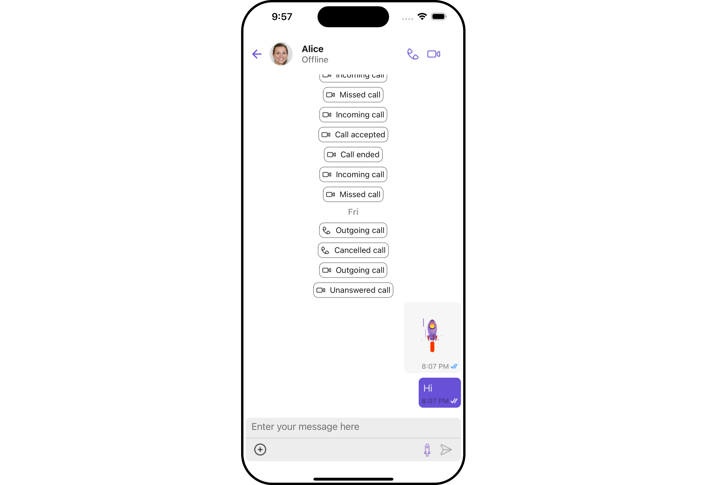

</TabItem>

<TabItem value="android" label="Android">

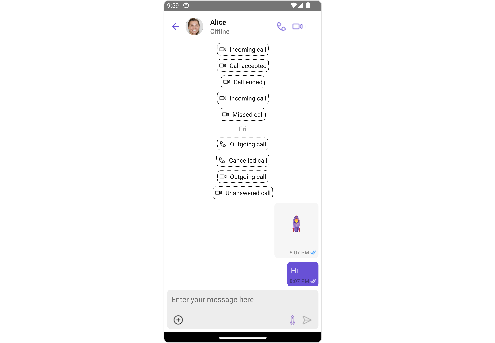

</TabItem>

</Tabs>

<Tabs>
<TabItem value="TypeScript" label="App.tsx">

```TypeScript title='App.tsx'

import { CometChat } from '@cometchat/chat-sdk-react-native';
import { CometChatUIKit, CometChatUiKitConstants, CometChatTheme, MessageListConfigurationInterface } from '@cometchat/chat-uikit-react-native';


function App(): React.JSX.Element {
    const [chatUser, setChatUser] = React.useState<CometChat.User| undefined>();

   //CometChat Login

    React.useEffect(() => {
        CometChat.getUser("uid").then((user) => {
            setChatUser(user);
        })
    }, []);

    let theme = new CometChatTheme({});
    let allTemplates = CometChatUIKit.getDataSource().getAllMessageTemplates(theme);

    const CUSTOM_MESSAGE_TYPE = "nudge";
    let nudgeMessageTemplate = new CometChatMessageTemplate({
       type: CUSTOM_MESSAGE_TYPE,
       category: CometChatUiKitConstants.MessageCategoryConstants.custom,
       ContentView: (message: CometChat.BaseMessage) => getContentView(message),
    });

    const getContentView = (message: CometChat.BaseMessage) => {
       return (
          <Image source={RocketGif} style={{ width: 100, height: 100 }}  />
       )
    }

    allTemplates.push(nudgeMessageTemplate);

    const messageListConfiguration : MessageListConfigurationInterface = {
       templates: allTemplates,
       messageRequestBuilder: getMessageRequestBuilder()
    }

    const messageComposerConfiguration : MessageComposerConfigurationInterface = {
       AuxiliaryButtonView: customAuxiliaryButtonView
    }

    return (
      <>
        { chatUser && <CometChatMessages
             user={chatUser}
             messageListConfiguration={messageListConfiguration}
             messageComposerConfiguration={messageComposerConfiguration}
          />
         }
      </>
    );
}
```

</TabItem>
</Tabs>
