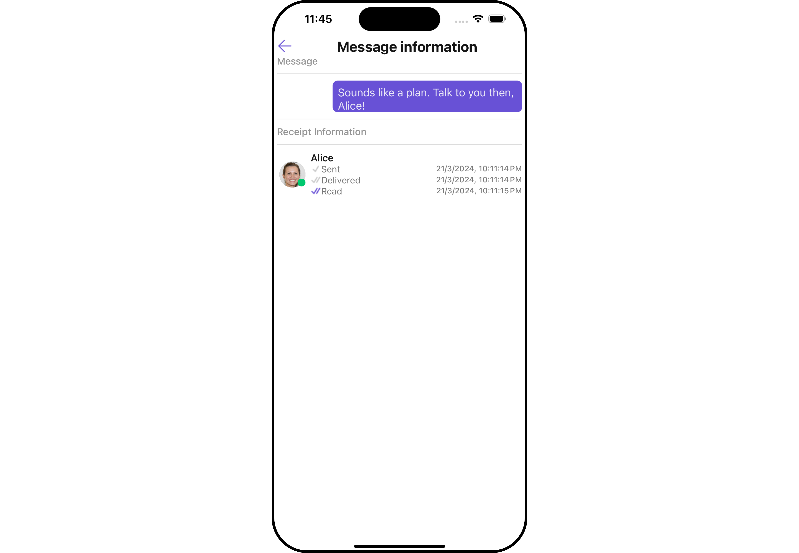
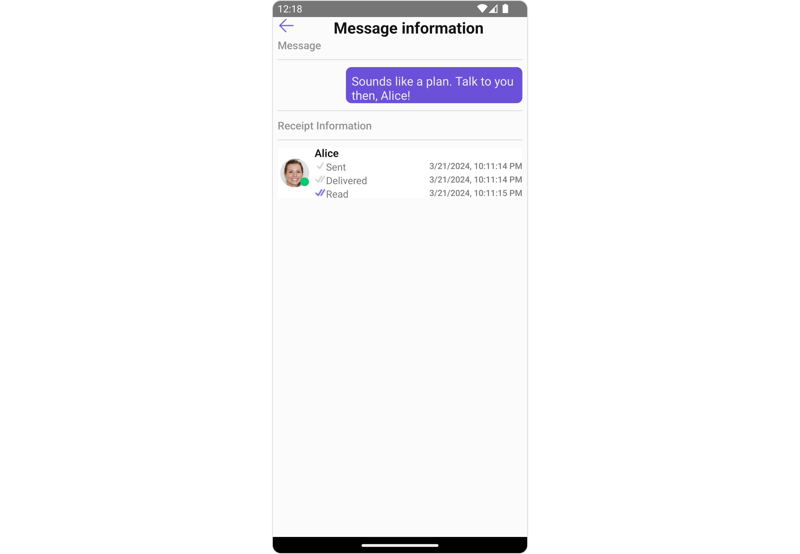

import Tabs from '@theme/Tabs';
import TabItem from '@theme/TabItem';

The MessageInformation is a [Component](/ui-kit/react-native/components-overview#components) designed to display message-related information, such as delivery and read receipts. It serves as an integral part of the CometChat UI UI Kit, extending the [List Item](/ui-kit/react-native/list-item) class, which provides the underlying infrastructure for CometChat UI components. With its rich set of methods and properties, developers can easily customize and tailor the appearance and behavior of the message information view to suit the specific requirements of their application.

<Tabs>

<TabItem value="iOS" label="iOS">



</TabItem>

<TabItem value="android" label="Android">



</TabItem>

</Tabs>

MessageInformation is comprised of the following [Base Components](/ui-kit/react-native/components-overview#base-components):

| Base Components                             | Description                                                                     |
| ------------------------------------------- | ------------------------------------------------------------------------------- |
| [List Item](/ui-kit/react-native/list-item) | This renders common components used across `Conversations`, `Groups` & `Users`. |

## Usage

### Integration

The following code snippet illustrates how you can directly incorporate the Message Information component into your Application.

<Tabs>
<TabItem value="App" label="App.tsx">

```jsx
import { CometChat } from '@cometchat/chat-sdk-react-native';
import { CometChatMessageInformation, ListItemStyleInterface, CometChatListItem } from '@cometchat/chat-uikit-react-native';

function App(): React.JSX.Element {
    const [message, setMessage] = React.useState<CometChat.TextMessage | undefined>(undefined);

    React.useEffect(() => {
          //after login
          CometChat.getMessageDetails(614).then((message: any) => {
              setMessage(message);
          })

    }, []);

    const listItemStyle : ListItemStyleInterface = {
      width: "500",
      height: "100%",
      borderRadius: 12,
      titleColor:"#ffffff",
      backgroundColor:"#6851D6",
    };

    const customBubbleView = () => {
       return(
         <CometChatListItem id="info" title ={(message as CometChat.TextMessage).getText()}
         listItemStyle={listItemStyle} />
       )
    };


    return (
      <>
         {
           message &&  <CometChatMessageInformation message={message} BubbleView={customBubbleView}></CometChatMessageInformation> }
      </>
    );
}
```

</TabItem>
</Tabs>

## Properties

| property                    | type                                                               | Description                                                                                      |
| --------------------------- | ------------------------------------------------------------------ | ------------------------------------------------------------------------------------------------ |
| **template**                | CometChatMessageTemplate                                           | Sets a custom message template for the message information view.                                 |
| **message**                 | CometChat.BaseMessage                                              | Sets the message to be displayed in the message information view.                                |
| **ErrorStateView**          | () => JSX.Element                                                  | Sets the visibility of the error view in the message information view.                           |
| **title**                   | String                                                             | Sets the title that will be displayed at the top of the `message information`.                   |
| **ListItemView**            | message: CometChat.BaseMessage, receipt: Recipient) => JSX.Element | Sets a custom list item view for individual entries in the message information view.             |
| **receiptDatePattern**      | ((timestamp: number) => string)                                    | Sets a custom date pattern for formatting receipt dates in the message information view.         |
| **messageInformationStyle** | MessageInformationStyleInterface                                   | Sets the overall style and appearance for the message information view.                          |
| **readIcon**                | ImageType                                                          | Sets the custom icon resource for read receipts in the message information view.                 |
| **deliveredIcon**           | ImageType                                                          | Sets the custom icon resource for delivered receipts in the message information view.            |
| **loadingIcon**             | ImageType                                                          | Sets the custom icon resource loading state.                                                     |
| **listItemStyle**           | ListItemStyleInterface                                             | Sets the style for list items in the message information view.                                   |
| **onError**                 | ((error: CometChatException) => void)                              | Sets the error callback to handle any errors that may occur within the message information view. |
| **emptyStateText**          | String                                                             | Sets the text to be displayed in the empty state view of the message information view.           |
| **errorStateText=**         | String                                                             | Sets the error message to be displayed in the error state view of the message information view.  |
| **EmptyStateView**          | () => JSX.Element                                                  | Sets the custom layout resource for the empty state view of the message information view.        |
| **ErrorStateView**          | () => JSX.Element                                                  | Sets the custom layout resource for the error state view of the message information view.        |
| **LoadingStateView**        | () => JSX.Element                                                  | Sets the custom layout resource for the loading state view of the message information view.      |

### Actions

[Actions](/ui-kit/react-native/components-overview#actions) dictate how a component functions. They are divided into two types: Predefined and User-defined. You can override either type, allowing you to tailor the behavior of the component to fit your specific needs.

##### 1. onBack

The `onBack` event is typically triggered when the close button is clicked and it carries a default action. However, with the following code snippet, you can effortlessly override this default operation.

<Tabs>
<TabItem value="App" label="App.tsx">

```jsx
import { CometChat } from '@cometchat/chat-sdk-react-native';
import { CometChatMessageInformation, ListItemStyleInterface, CometChatListItem } from '@cometchat/chat-uikit-react-native';

function App(): React.JSX.Element {
    const [message, setMessage] = React.useState<CometChat.TextMessage | undefined>(undefined);

    React.useEffect(() => {
          //after login
          CometChat.getMessageDetails(614).then((message: any) => {
              setMessage(message);
          })

    }, []);

    const listItemStyle : ListItemStyleInterface = {
      width: "500",
      height: "100%",
      borderRadius: 12,
      titleColor:"#ffffff",
      backgroundColor:"#6851D6",
    };

    const customBubbleView = () => {
       return(
         <CometChatListItem id="info" title ={(message as CometChat.TextMessage).getText()}
         listItemStyle={listItemStyle} />
       )
    };

    const onBackHandler = () => {
      //code
    };


    return (
      <>
         {
           message &&  <CometChatMessageInformation message={message} BubbleView={customBubbleView}
           onBack={onBackHandler}
           ></CometChatMessageInformation> }
      </>
    );
}
```

</TabItem>
</Tabs>

##### 2. onError

This action doesn't change the behavior of the component but rather listens for any errors that occur in the MessageInformation component.

<Tabs>
<TabItem value="App" label="App.tsx">

```jsx
import { CometChat } from '@cometchat/chat-sdk-react-native';
import { CometChatMessageInformation, ListItemStyleInterface, CometChatListItem } from '@cometchat/chat-uikit-react-native';

function App(): React.JSX.Element {
    const [message, setMessage] = React.useState<CometChat.TextMessage | undefined>(undefined);

    React.useEffect(() => {
          //after login
          CometChat.getMessageDetails(614).then((message: any) => {
              setMessage(message);
          })

    }, []);

    const listItemStyle : ListItemStyleInterface = {
      width: "500",
      height: "100%",
      borderRadius: 12,
      titleColor:"#ffffff",
      backgroundColor:"#6851D6",
    };

    const customBubbleView = () => {
       return(
         <CometChatListItem id="info" title ={(message as CometChat.TextMessage).getText()}
         listItemStyle={listItemStyle} />
       )
    };

    const onErrorHandler = () => {
      //handle Error
    };


    return (
      <>
         {
           message &&  <CometChatMessageInformation message={message} BubbleView={customBubbleView}
           onError={onErrorHandler}
           ></CometChatMessageInformation> }
      </>
    );
}
```

</TabItem>
</Tabs>

---

### Filters

MessageInformation component does not have any available filters.

---

### Events

MessageInformation component does not have any available events.

---

## Customization

To fit your app's design requirements, you can customize the appearance of the MessageInformation component. We provide exposed methods that allow you to modify the experience and behavior according to your specific needs.

### Style

Using Style you can customize the look and feel of the component in your app, These parameters typically control elements such as the color, size, shape, and fonts used within the component.

##### 1. MessageInformationStyle

To modify the styling, you can apply the MessageInformationStyle to the MessageInformation Component using the `messageInformationStyle` property.

<Tabs>
<TabItem value="App" label="App.tsx">

```jsx
import { CometChat } from '@cometchat/chat-sdk-react-native';
import { CometChatMessageInformation, MessageInformationStyleInterface, ListItemStyleInterface, CometChatListItem } from '@cometchat/chat-uikit-react-native';

function App(): React.JSX.Element {
    const [message, setMessage] = React.useState<CometChat.TextMessage | undefined>(undefined);

    React.useEffect(() => {
          //after login
          CometChat.getMessageDetails(614).then((message: any) => {
              setMessage(message);
          })

    }, []);

    const listItemStyle : ListItemStyleInterface = {
      width: "500",
      height: "100%",
      borderRadius: 12,
      titleColor:"#ffffff",
      backgroundColor:"#6851D6",
    };

    const customBubbleView = () => {
       return(
         <CometChatListItem id="info" title ={(message as CometChat.TextMessage).getText()}
         listItemStyle={listItemStyle} />
       )
    };

    const messageInformationStyle : MessageInformationStyleInterface ={
       backgroundColor:'#e7e3fc',
       readIconTint: "rgb(0,200,11)",
       deliveredIconTint: "grey"
    }

    const receiptDataStyle : ListItemStyleInterface = {
       titleColor: "red",
       backgroundColor: "#e7e3fc"
    }

    return (
      <>
         {
           message &&  <CometChatMessageInformation message={message} BubbleView={customBubbleView}
            messageInformationStyle={messageInformationStyle}
            listItemStyle={receiptDataStyle}
           ></CometChatMessageInformation> }
      </>
    );
}
```

</TabItem>
</Tabs>

The following properties are exposed by MessageInformationStyle:

| Property              | Description                                | Code                                     |
| --------------------- | ------------------------------------------ | ---------------------------------------- |
| **titleTextFont**     | Sets the font for the title                | `titleTextFont?: FontStyleInterface;`    |
| **titleTextColor**    | Sets the font for the title                | `titleTextColor?: string;`               |
| **subtitleTextColor** | Sets the text color for the subtitle       | `subtitleTextColor?: string;`            |
| **subtitleTextFont**  | Sets the text font for the subtitle        | `subtitleTextFont?: FontStyleInterface;` |
| **sendIconTint**      | Sets the icon color for the send Icon      | `sendIconTint?: string;`                 |
| **readIconTint**      | Sets the icon color for the read Icon      | `readIconTint?: string;`                 |
| **deliveredIconTint** | Sets the icon color for the delivered Icon | `deliveredIconTint?: string;`            |
| **dividerTint**       | Sets the icon color for the separator      | `dividerTint?: string;`                  |
| **border**            | Used to set border                         | `border?: BorderStyleInterface,`         |
| **borderRadius**      | Used to set border radius                  | `borderRadius?: number;`                 |
| **backgroundColor**   | Used to set background colour              | `backgroundColor?: string;`              |
| **height**            | Used to set height                         | `height?: string;`                       |
| **width**             | Used to set width                          | `width?: string;`                        |

---

##### 2. ListItemStyle

To apply customized styles to the `ListItemStyle` component in the MessageInformation Component, you can use the following code snippet. For further insights on `ListItemStyle` Styles [refer](./list-item)

<Tabs>
<TabItem value="App" label="App.tsx">

```jsx
import { CometChat } from '@cometchat/chat-sdk-react-native';
import { CometChatMessageInformation, MessageInformationStyleInterface, ListItemStyleInterface, CometChatListItem } from '@cometchat/chat-uikit-react-native';

function App(): React.JSX.Element {
    const [message, setMessage] = React.useState<CometChat.TextMessage | undefined>(undefined);

    React.useEffect(() => {
          //after login
          CometChat.getMessageDetails(614).then((message: any) => {
              setMessage(message);
          })

    }, []);

    const listItemStyle : ListItemStyleInterface = {
      width: "500",
      height: "100%",
      borderRadius: 12,
      titleColor:"#ffffff",
      backgroundColor:"#6851D6",
    };

    const customBubbleView = () => {
       return(
         <CometChatListItem id="info" title ={(message as CometChat.TextMessage).getText()}
         listItemStyle={listItemStyle} />
       )
    };

    const messageInformationStyle : MessageInformationStyleInterface ={
       backgroundColor:'#e7e3fc',
       readIconTint: "rgb(0,200,11)",
       deliveredIconTint: "grey"
    }

    const receiptDataStyle : ListItemStyleInterface = {
       titleColor: "red",
       backgroundColor: "#e7e3fc"
    }

    return (
      <>
         {
           message &&  <CometChatMessageInformation message={message} BubbleView={customBubbleView}
            messageInformationStyle={messageInformationStyle}
            listItemStyle={receiptDataStyle}
           ></CometChatMessageInformation> }
      </>
    );
}
```

</TabItem>
</Tabs>

---

### Functionality

These are a set of small functional customizations that allow you to fine-tune the overall experience of the component. With these, you can change text, set custom icons, and toggle the visibility of UI elements.

<Tabs>
<TabItem value="App" label="App.tsx">

```jsx
import { CometChat } from "@cometchat/chat-sdk-react-native";
import {
  CometChatMessageInformation,
  MessageInformationStyleInterface,
  ListItemStyleInterface,
  CometChatListItem,
} from "@cometchat/chat-uikit-react-native";

function App(): React.JSX.Element {
  const [message, setMessage] =
    (React.useState < CometChat.TextMessage) | (undefined > undefined);

  React.useEffect(() => {
    //after login
    CometChat.getMessageDetails(614).then((message: any) => {
      setMessage(message);
    });
  }, []);

  return (
    <>
      {message && (
        <CometChatMessageInformation
          message={message}
          BubbleView={customBubbleView}
          title="Message Details"
          backIcon={BackArrowCurved}
        ></CometChatMessageInformation>
      )}
    </>
  );
}
```

</TabItem>
</Tabs>

Below is a list of customizations along with corresponding code snippets

| Property           | Description                                                                                                   | Code                                         |
| ------------------ | ------------------------------------------------------------------------------------------------------------- | -------------------------------------------- |
| message            | Sets the message to be displayed in the message information view.                                             | `message: CometChat.BaseMessage`             |
| errorStateView     | used to show the error state view in case of an error occurred.                                               | `ErrorStateView?: () => JSX.Element`         |
| deliveredIcon      | It is used to pass user defined image in to the MessageReceipt, to change the icon When Message is delivered. | `deliveredIcon?: ImageType`                  |
| readIcon           | It is used to pass user defined image in to the MessageReceipt, to change the icon When Message is read.      | `readIcon?: ImageType`                       |
| receiptDatePattern | used to set the date pattern for delivered and read date time                                                 | `receiptDatePattern?: (timestamp) => string` |
| emptyStateText     | used to set a custom text response when fetching the users has returned an empty list                         | `emptyStateText?: string`                    |

<!-- ## How to integrate CometChatMesssageInformation ?

Since `CometChatMesssageInformation` is a component, it can be added directly to your application.


<Tabs>
<TabItem value="MessageComposerDemo" label="MessageComposerDemo.tsx">

```jsx
import { CometChat } from '@cometchat/chat-sdk-javascript';
import { CometChatMessageInformation, ListItemStyle } from '@cometchat/chat-uikit-react'
import React from 'react'

const MessageInformationDemo = () => {
    const [message, setmessage] = React.useState<CometChat.BaseMessage | undefined>();
    React.useEffect(() => {
        CometChat.getMessageDetails(166).then((message) => {
            setmessage(message);
        })
    }, []);
    const bubbleView = () => {
        const listItemStyle = new ListItemStyle({
            width: "500px",
            height: "100%",
            border: "2px solid #6615e8",
            borderRadius:"12px",
            titleColor:"#ffffff",
            background:"rgb(104, 81, 214)",
            titleFont:"12px sans-serif"
          });
        return(
            <div>
            <cometchat-list-item title ={(message as CometChat.TextMessage).getText()} listItemStyle={JSON.stringify(listItemStyle)} />
            </div>
        )
      };
    return (
        <>
            {
                message &&
                <CometChatMessageInformation
                    message={message}
                    bubbleView={bubbleView}
                />
            }
        </>
    )
}
export default MessageInformationDemo;
```
</TabItem>
<TabItem value="ts" label="App.tsx">

```jsx
import { MessageInformationDemo } from "./MessageInformationDemo";

export default function App() {
  return (
    <div className='App'>
      <div>
        <MessageInformationDemo />
      </div>
    </div>
  );
}
```

</TabItem>
</Tabs> -->

### Advanced

For advanced-level customization, you can set custom views to the component. This lets you tailor each aspect of the component to fit your exact needs and application aesthetics. You can create and define your views, layouts, and UI elements and then incorporate those into the component.
