import Tabs from '@theme/Tabs';
import TabItem from '@theme/TabItem';

## Overview

ThreadedMessages is a [Composite Component](/ui-kit/react-native/components-overview#composite-components) that displays all replies made to a particular message in a conversation. By default, the parent message will be displayed at the top, the message composer will be at the bottom and between them a message list will contain all replies.

<Tabs>

<TabItem value="iOS" label="iOS">

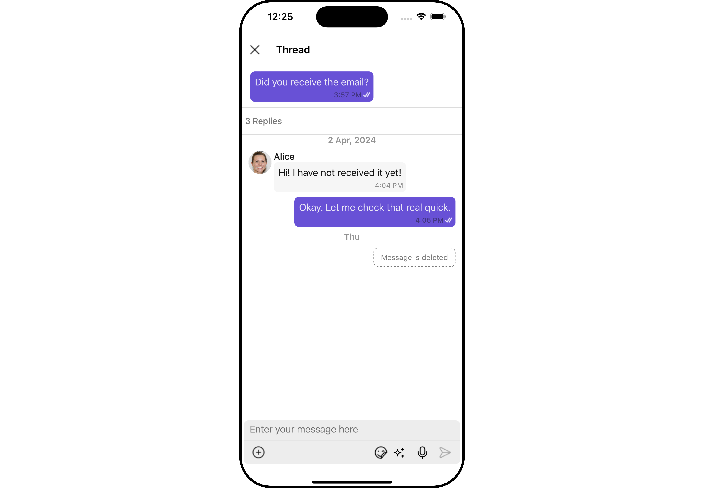

</TabItem>

<TabItem value="android" label="Android">

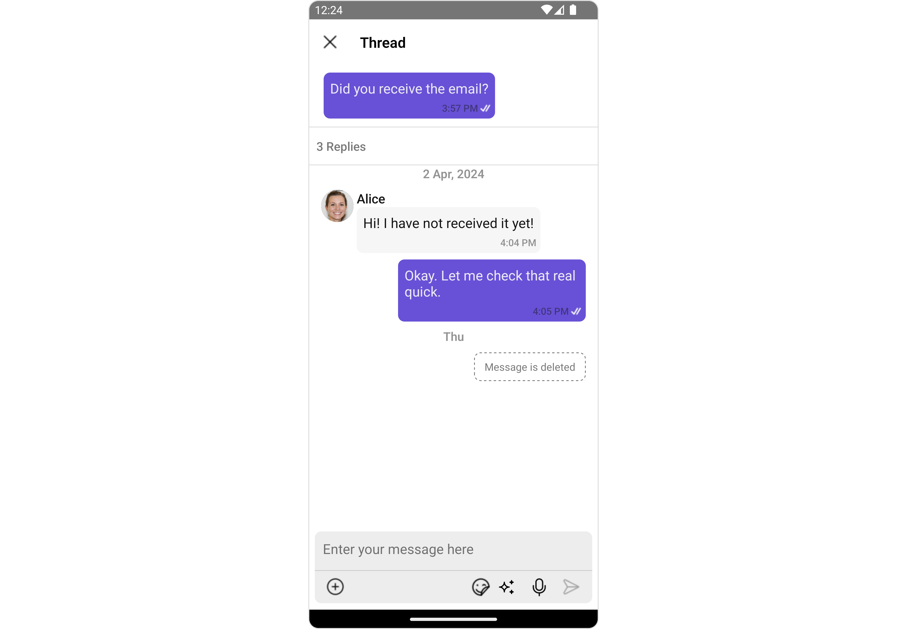

</TabItem>

</Tabs>

ThreadedMessages is composed of the following components:

| Component                             | Description                                                                                                        |
| ------------------------------------- | ------------------------------------------------------------------------------------------------------------------ |
| [MessageList](./message-list)         | CometChatMessageList is a component that displays a list of Messages                                               |
| [MessageComposer](./message-composer) | CometChatMessageComposer is a component that helps in writing and editing of messages and also sending attachments |

## Usage

### Integration

The following code snippet illustrates how you can directly incorporate the ThreadedMessages component into your Application.

<Tabs>
<TabItem value="App" label="App.tsx">

```jsx
import { CometChat } from '@cometchat/chat-sdk-react-native';
import { CometChatThreadedMessages, ThreadedMessagesStyleInterface } from '@cometchat/chat-uikit-react-native';

function App(): React.JSX.Element {

    const [chatUser, setChatUser] = React.useState<CometChat.User>();
    const [message, setMessage] = React.useState<CometChat.TextMessage | undefined>(undefined);

    React.useEffect(() => {
          //after login
          CometChat.getUser("alice-uid").then((user) => {
              setChatUser(user);
          })
          CometChat.getMessageDetails(614).then((message: any) => {
              setMessage(message);
          })

    }, []);

    const listItemStyle : ListItemStyleInterface = {
      width: "500",
      height: "100%",
      borderRadius: 12,
      titleColor:"#ffffff",
      backgroundColor:"#6851D6",
    };

    const customBubbleView = () => {
       return(
         <CometChatListItem id="info" title ={(message as CometChat.TextMessage).getText()}
         listItemStyle={listItemStyle} />
       )
    };

    const threadedMessagesStyle : ThreadedMessagesStyleInterface = {
       titleStyle: {
         fontFamily: 'Arial',
         fontWeight: 'bold',
         fontSize: 15,
       },
       background: "#ebdeff",
       width: "100%",
       height: "600px",
       closeIconTint: "#6851D6"
    };


    return (
      <>
         {  chatUser && message &&
            <CometChatThreadedMessages
            parentMessage={message}
            BubbleView={customBubbleView}
            title={`Thread ${chatUser?.getName()}`}
            threadedMessagesStyle={threadedMessagesStyle}
           ></CometChatThreadedMessages> }
      </>
    );
}
```

</TabItem>
</Tabs>

---

### Actions

[Actions](/ui-kit/react-native/components-overview#actions) dictate how a component functions. They are divided into two types: Predefined and User-defined. You can override either type, allowing you to tailor the behavior of the component to fit your specific needs.

ThreadedMessages does not have its own actions. However, you can override the behavior of the ThreadedMessages component by using the actions of its Components, with the help of [Configurations](/ui-kit/react-native/components-overview#configurations).

**Example**

In this example, we are overriding the `onClose` callback.

<Tabs>
<TabItem value="App" label="App.tsx">

```jsx
import { CometChat } from '@cometchat/chat-sdk-react-native';
import { CometChatThreadedMessages, ThreadedMessagesStyleInterface } from '@cometchat/chat-uikit-react-native';

function App(): React.JSX.Element {

    const [chatUser, setChatUser] = React.useState<CometChat.User>();
    const [message, setMessage] = React.useState<CometChat.TextMessage | undefined>(undefined);

    React.useEffect(() => {
          //after login
          CometChat.getUser("alice-uid").then((user) => {
              setChatUser(user);
          })
          CometChat.getMessageDetails(614).then((message: any) => {
              setMessage(message);
          })

    }, []);

    const listItemStyle : ListItemStyleInterface = {
      width: "500",
      height: "100%",
      borderRadius: 12,
      titleColor:"#ffffff",
      backgroundColor:"#6851D6",
    };

    const customBubbleView = () => {
       return(
         <CometChatListItem id="info" title ={(message as CometChat.TextMessage).getText()}
         listItemStyle={listItemStyle} />
       )
    };

    const threadedMessagesStyle : ThreadedMessagesStyleInterface = {
       titleStyle: {
         fontFamily: 'Arial',
         fontWeight: 'bold',
         fontSize: 15,
       },
       background: "#ebdeff",
       width: "100%",
       height: "600px",
       closeIconTint: "#6851D6"
    };

    const onCloseHandler = () => {
      //code
    }

    return (
      <>
         {  chatUser && message &&
            <CometChatThreadedMessages
            parentMessage={message}
            BubbleView={customBubbleView}
            title={`Thread ${chatUser?.getName()}`}
            threadedMessagesStyle={threadedMessagesStyle}
            onClose={onCloseHandler}
           ></CometChatThreadedMessages> }
      </>
    );
}
```

</TabItem>
</Tabs>

---

### Filters

**Filters** allow you to customize the data displayed in a list within a Component. You can filter the list based on your specific criteria, allowing for a more customized. Filters can be applied using RequestBuilders of Chat SDK.

ThreadedMessages does not have its own Filters. However, you can filter the messages list in ThreadedMessages Component using [MessageListConfiguration](#configuration).

**Example**

In this example, we are filtering messages based on the ParentMessageID and searching for messages that contain the keyword "hi".

<Tabs>
<TabItem value="App" label="App.tsx">

```jsx
import { CometChat } from '@cometchat/chat-sdk-react-native';
import { CometChatThreadedMessages, ThreadedMessagesStyleInterface } from '@cometchat/chat-uikit-react-native';

function App(): React.JSX.Element {

    const [chatUser, setChatUser] = React.useState<CometChat.User>();
    const [message, setMessage] = React.useState<CometChat.TextMessage | undefined>(undefined);

    React.useEffect(() => {
          //after login
          CometChat.getUser("alice-uid").then((user) => {
              setChatUser(user);
          })
          CometChat.getMessageDetails(614).then((message: any) => {
              setMessage(message);
          })

    }, []);

    const listItemStyle : ListItemStyleInterface = {
      width: "500",
      height: "100%",
      borderRadius: 12,
      titleColor:"#ffffff",
      backgroundColor:"#6851D6",
    };

    const customBubbleView = () => {
       return(
         <CometChatListItem id="info" title ={(message as CometChat.TextMessage).getText()}
         listItemStyle={listItemStyle} />
       )
    };

    const threadedMessagesStyle : ThreadedMessagesStyleInterface = {
       titleStyle: {
         fontFamily: 'Arial',
         fontWeight: 'bold',
         fontSize: 15,
       },
       background: "#ebdeff",
       width: "100%",
       height: "600px",
       closeIconTint: "#6851D6"
    };

    const messageRequestBuilder : CometChat.MessagesRequestBuilder = new CometChat.MessagesRequestBuilder()
                                                                .setLimit(2).setSearchKeyword('keyword');


    const messageListConfiguration : MessageListConfigurationInterface = {
       messageRequestBuilder: messageRequestBuilder
    }

    return (
      <>
         {  chatUser && message &&
            <CometChatThreadedMessages
            parentMessage={message}
            BubbleView={customBubbleView}
            title={`Thread ${chatUser?.getName()}`}
            threadedMessagesStyle={threadedMessagesStyle}
            messageListConfiguration={messageListConfiguration}
           ></CometChatThreadedMessages> }
      </>
    );
}
```

</TabItem>
</Tabs>

---

### Events

[Events](/ui-kit/react-native/components-overview#events) are emitted by a `Component`. By using event you can extend existing functionality. Being global events, they can be applied in Multiple Locations and are capable of being Added or Removed.

The ThreadedMessages Component does not emit any events of its own.

---

## Customization

To fit your app's design requirements, you can customize the appearance of the conversation component. We provide exposed methods that allow you to modify the experience and behavior according to yfEventour specific needs.

---

### Style

Using Style you can customize the look and feel of the component in your app, These parameters typically control elements such as the color, size, shape, and fonts used within the component.

##### 1. threadedMessagesStyle

To modify the styling, you can apply the ThreadedMessageStyle to the ThreadedMessage Component using the `threadedMessagesStyle` property.

<Tabs>
<TabItem value="ThreadedMessagesDemo" label="ThreadedMessagesDemo.tsx">

```jsx
import { CometChat } from '@cometchat/chat-sdk-react-native';
import { CometChatThreadedMessages, ThreadedMessagesStyleInterface } from '@cometchat/chat-uikit-react-native';

function App(): React.JSX.Element {

    const [chatUser, setChatUser] = React.useState<CometChat.User>();
    const [message, setMessage] = React.useState<CometChat.TextMessage | undefined>(undefined);

    React.useEffect(() => {
          //after login
          CometChat.getUser("alice-uid").then((user) => {
              setChatUser(user);
          })
          CometChat.getMessageDetails(614).then((message: any) => {
              setMessage(message);
          })

    }, []);

    const listItemStyle : ListItemStyleInterface = {
      width: "500",
      height: "100%",
      borderRadius: 12,
      titleColor:"#ffffff",
      backgroundColor:"#6851D6",
    };

    const customBubbleView = () => {
       return(
         <CometChatListItem id="info" title ={(message as CometChat.TextMessage).getText()}
         listItemStyle={listItemStyle} />
       )
    };

    const threadedMessagesStyle : ThreadedMessagesStyleInterface = {
       titleStyle: {
         fontFamily: 'Arial',
         fontWeight: 'bold',
         fontSize: 15,
       },
       background: "#ebdeff",
       width: "100%",
       height: "600px",
       closeIconTint: "#6851D6"
    };


    return (
      <>
         {  chatUser && message &&
            <CometChatThreadedMessages
            parentMessage={message}
            BubbleView={customBubbleView}
            threadedMessagesStyle={threadedMessagesStyle}
           ></CometChatThreadedMessages> }
      </>
    );
}
```

</TabItem>
</Tabs>

The following properties are exposed by `ThreadedMessagesStyle`:

| Methods           | Description                                            | Type                                 |
| ----------------- | ------------------------------------------------------ | ------------------------------------ |
| **border**        | Used to set border                                     | `border?: BorderStyleInterface,`     |
| **borderRadius**  | Used to set border radius                              | `borderRadius?: string;`             |
| **background**    | Used to set background colour                          | `background?: number &#124; string;` |
| **height**        | Used to set height                                     | `height?: number &#124; string;`     |
| **width**         | Used to set width                                      | `width?: number &#124; string;`      |
| **titleStyle**    | used to customise the font of the title in the app bar | `titleStyle?: FontStyleInterface;`   |
| **closeIconTint** | used to set the color of the close icon in the app bar | `closeIconTint?: string;`            |

---

### Functionality

These are a set of small functional customizations that allow you to fine-tune the overall experience of the component. With these, you can change text, set custom icons, and toggle the visibility of UI elements.

<Tabs>
<TabItem value="App" label="App.tsx">

```jsx
import { CometChat } from '@cometchat/chat-sdk-react-native';
import { CometChatThreadedMessages, ThreadedMessagesStyleInterface } from '@cometchat/chat-uikit-react-native';
import CloseIcon from './close-icon.png';

function App(): React.JSX.Element {

    const [chatUser, setChatUser] = React.useState<CometChat.User>();
    const [message, setMessage] = React.useState<CometChat.TextMessage | undefined>(undefined);

    React.useEffect(() => {
          //after login
          CometChat.getUser("alice-uid").then((user) => {
              setChatUser(user);
          })
          CometChat.getMessageDetails(614).then((message: any) => {
              setMessage(message);
          })

    }, []);

    const listItemStyle : ListItemStyleInterface = {
      width: "500",
      height: "100%",
      borderRadius: 12,
      titleColor:"#ffffff",
      backgroundColor:"#6851D6",
    };

    const customBubbleView = () => {
       return(
         <CometChatListItem id="info" title ={(message as CometChat.TextMessage).getText()}
         listItemStyle={listItemStyle} />
       )
    };

    const threadedMessagesStyle : ThreadedMessagesStyleInterface = {
       titleStyle: {
         fontFamily: 'Arial',
         fontWeight: 'bold',
         fontSize: 15,
       },
       background: "#ebdeff",
       width: "100%",
       height: "600px",
       closeIconTint: "#6851D6"
    };


    return (
      <>
         {  chatUser && message &&
            <CometChatThreadedMessages
            parentMessage={message}
            BubbleView={customBubbleView}
            title={`Thread ${chatUser?.getName()}`}
            threadedMessagesStyle={threadedMessagesStyle}
            closeIcon={CloseIcon}
            hideMessageComposer={true}
           ></CometChatThreadedMessages> }
      </>
    );
}
```

</TabItem>
</Tabs>

Below is a list of customizations along with corresponding code snippets

| Property                                                                                                         | Description                                                         | Code                                                                                                                      |
| ---------------------------------------------------------------------------------------------------------------- | ------------------------------------------------------------------- | ------------------------------------------------------------------------------------------------------------------------- |
| **parentMessage** <a data-tooltip-id="my-tooltip-html-prop"> <span class="material-icons red">report</span> </a> | Used to to set the message for which the replies need to be fetched | `parentMessage={parentMessage}`                                                                                           |
| **title**                                                                                                        | Used to set title in the app bar                                    | `title={getTitle()}`                                                                                                      |
| **closeIcon**                                                                                                    | Used to set the icon to exit the widget                             | `closeIcon={{uri: <image url>}}` OR `import customCloseIcon from "./customCloseIcon.svg"; ` `closeIcon={customCloseIcon}` |
| **hideMessageComposer**                                                                                          | This will hide/show the message composer                            | `hideMessageComposer={true}`                                                                                              |

---

### Advanced

For advanced-level customization, you can set custom views to the component. This lets you tailor each aspect of the component to fit your exact needs and application aesthetics. You can create and define your views, layouts, and UI elements and then incorporate those into the component.

#### BubbleView

By using `bubbleView`, You can set parent message bubble view inside ThreadedMessage Component.

**Example**

<Tabs>

<TabItem value="iOS" label="iOS">

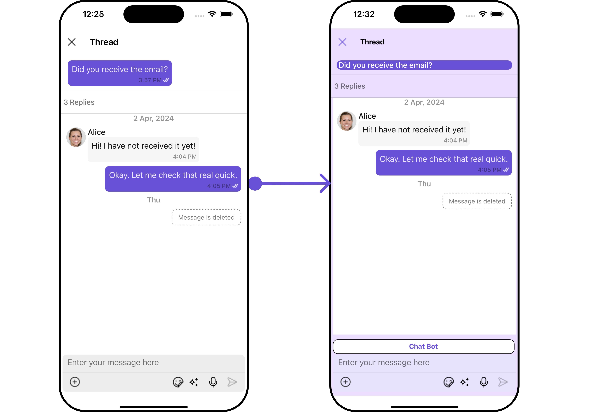

</TabItem>

<TabItem value="android" label="Android">


</TabItem>

</Tabs>

In this example, we will set parent message bubble view using `bubbleView` and apply custom styles on it.

<Tabs>
<TabItem value="ThreadedMessagesDemo" label="ThreadedMessagesDemo.tsx">

```jsx
import { CometChat } from '@cometchat/chat-sdk-react-native';
import { CometChatThreadedMessages, ListItemStyleInterface } from '@cometchat/chat-uikit-react-native';

function App(): React.JSX.Element {

    const [chatUser, setChatUser] = React.useState<CometChat.User>();
    const [message, setMessage] = React.useState<CometChat.TextMessage | undefined>(undefined);

    React.useEffect(() => {
          //after login
          CometChat.getUser("alice-uid").then((user) => {
              setChatUser(user);
          })
          CometChat.getMessageDetails(614).then((message: any) => {
              setMessage(message);
          })

    }, []);

    const listItemStyle : ListItemStyleInterface = {
      width: "500",
      height: "100%",
      borderRadius: 12,
      titleColor:"#ffffff",
      backgroundColor:"#6851D6",
    };

    const customBubbleView = () => {
       return(
         <CometChatListItem id="info" title ={(message as CometChat.TextMessage).getText()}
         listItemStyle={listItemStyle} />
       )
    };


    return (
      <>
         {  chatUser && message &&
            <CometChatThreadedMessages
            parentMessage={message}
            BubbleView={customBubbleView}
           ></CometChatThreadedMessages> }
      </>
    );
}
```

</TabItem>
</Tabs>

#### MessageActionView

By utilizing the `MessageActionView` method, you can assign custom actions to the parent message bubble view inside the ThreadedMessage Component.

**Example**

<Tabs>

<TabItem value="iOS" label="iOS">

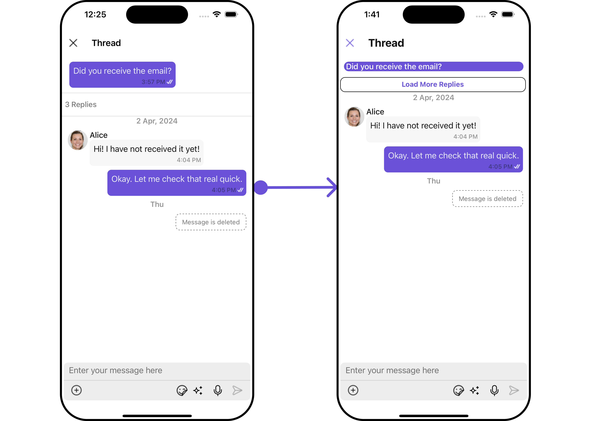

</TabItem>

<TabItem value="android" label="Android">

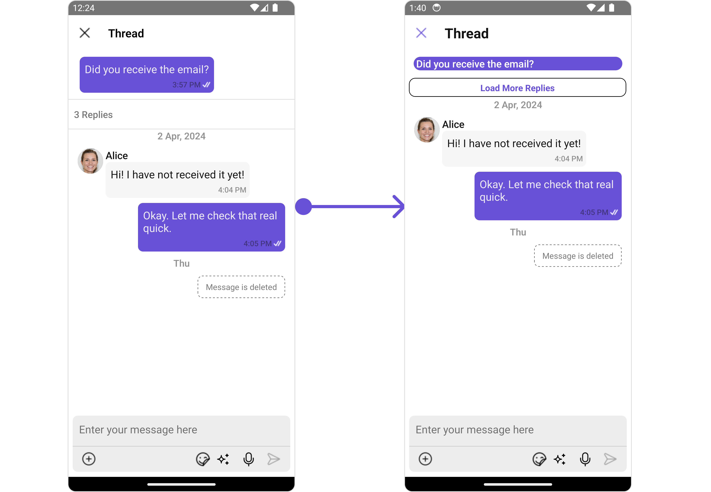
</TabItem>

</Tabs>

In this example, we are setting mock `Load More Replies` as message action view in ThreadedMessages Component.

<Tabs>
<TabItem value="App" label="App.tsx">

```jsx
import { CometChat } from '@cometchat/chat-sdk-react-native';
import { CometChatThreadedMessages, ListItemStyleInterface } from '@cometchat/chat-uikit-react-native';

function App(): React.JSX.Element {

    const [chatUser, setChatUser] = React.useState<CometChat.User>();
    const [message, setMessage] = React.useState<CometChat.TextMessage | undefined>(undefined);

    React.useEffect(() => {
          //after login
          CometChat.getUser("alice-uid").then((user) => {
              setChatUser(user);
          })
          CometChat.getMessageDetails(614).then((message: any) => {
              setMessage(message);
          })

    }, []);

    const listItemStyle : ListItemStyleInterface = {
      width: "500",
      height: "100%",
      borderRadius: 12,
      titleColor:"#ffffff",
      backgroundColor:"#6851D6",
    };

    const customBubbleView = () => {
       return(
         <CometChatListItem id="info" title ={(message as CometChat.TextMessage).getText()}
         listItemStyle={listItemStyle} />
       )
    };

    const viewStyle: StyleProp<ViewStyle> = {
      flexDirection: 'row',
      alignItems: 'flex-start',
      justifyContent: 'center',
      padding: 5,
      borderColor: 'black',
      borderWidth: 1,
      backgroundColor: 'white',
      borderRadius: 10,
      margin: 2,
      marginLeft: 7.4,
      height: 30,
      width: '95.5%',
    };

    const customMessageActionView  = () : JSX.Element => {
      return <View style={viewStyle}>
               <Text style={{color: "#6851D6", fontWeight: "bold"}}>Load More Replies</Text>
            </View>
    };

    return (
      <>
         {  chatUser && message &&
            <CometChatThreadedMessages
            parentMessage={message}
            BubbleView={customBubbleView}
            MessageActionView={customMessageActionView}
           ></CometChatThreadedMessages> }
      </>
    );
}
```

</TabItem>
</Tabs>

#### MessageComposerView

By utilizing the `MessageComposerView` method, you can override the default CometChatMessageComposer.

**Example**

<Tabs>

<TabItem value="iOS" label="iOS">

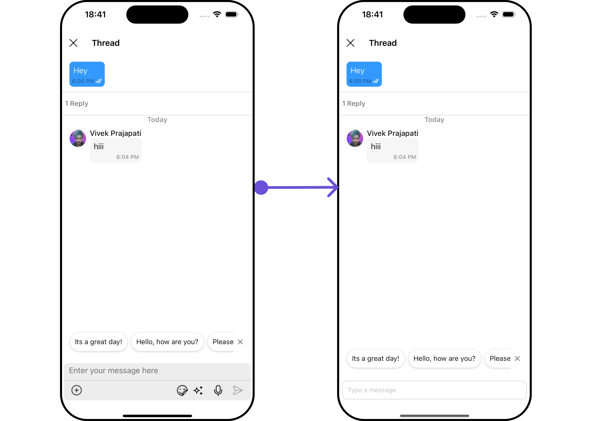

</TabItem>

<TabItem value="android" label="Android">

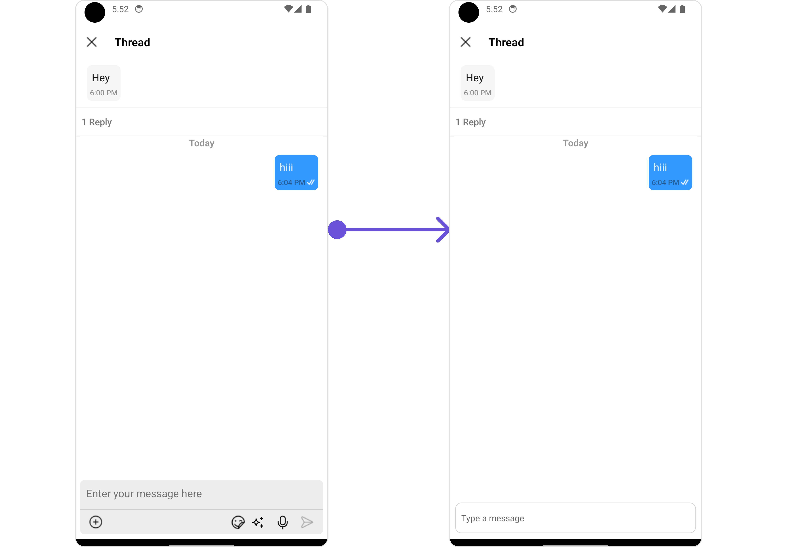
</TabItem>

</Tabs>

In this example, we are setting a custom MessageComposerView.

<Tabs>
<TabItem value="App" label="App.tsx">

```jsx
import { CometChat } from '@cometchat/chat-sdk-react-native';
import { CometChatThreadedMessages, ListItemStyleInterface } from '@cometchat/chat-uikit-react-native';

function App(): React.JSX.Element {

    const [chatUser, setChatUser] = React.useState<CometChat.User>();
    const [message, setMessage] = React.useState<CometChat.TextMessage | undefined>(undefined);

    React.useEffect(() => {
          //after login
          CometChat.getUser("alice-uid").then((user) => {
              setChatUser(user);
          })
          CometChat.getMessageDetails(614).then((message: any) => {
              setMessage(message);
          })

    }, []);

    const listItemStyle : ListItemStyleInterface = {
      width: "500",
      height: "100%",
      borderRadius: 12,
      titleColor:"#ffffff",
      backgroundColor:"#6851D6",
    };

    const customBubbleView = () => {
       return(
         <CometChatListItem id="info" title ={(message as CometChat.TextMessage).getText()}
         listItemStyle={listItemStyle} />
       )
    };

    const CustomMessageComposer = ({ user, group, parentMessage }: {
        user?: CometChat.User | undefined;
        group?: CometChat.Group | undefined;
        parentMessage: CometChat.BaseMessage;
    }) => {
        return <TextInput style={{
            padding: 10, margin: 10,
            borderRadius: 10,
            borderWidth: 1, borderColor: "lightgray",
        }} placeholder="Type a message" />
    };

    const viewStyle: StyleProp<ViewStyle> = {
      flexDirection: 'row',
      alignItems: 'flex-start',
      justifyContent: 'center',
      padding: 5,
      borderColor: 'black',
      borderWidth: 1,
      backgroundColor: 'white',
      borderRadius: 10,
      margin: 2,
      marginLeft: 7.4,
      height: 30,
      width: '95.5%',
    };

    const customMessageActionView  = () : JSX.Element => {
      return <View style={viewStyle}>
               <Text style={{color: "#6851D6", fontWeight: "bold"}}>Load More Replies</Text>
            </View>
    };

    return (
      <>
         {  chatUser && message &&
            <CometChatThreadedMessages
            parentMessage={message}
            BubbleView={customBubbleView}
            MessageActionView={customMessageActionView}
            MessageComposerView={CustomMessageComposer}
           ></CometChatThreadedMessages> }
      </>
    );
}
```

</TabItem>
</Tabs>

#### MessageListView

By utilizing the `MessageListView` method, you can override the default CometChatMessageList.

**Example**

<Tabs>

<TabItem value="iOS" label="iOS">

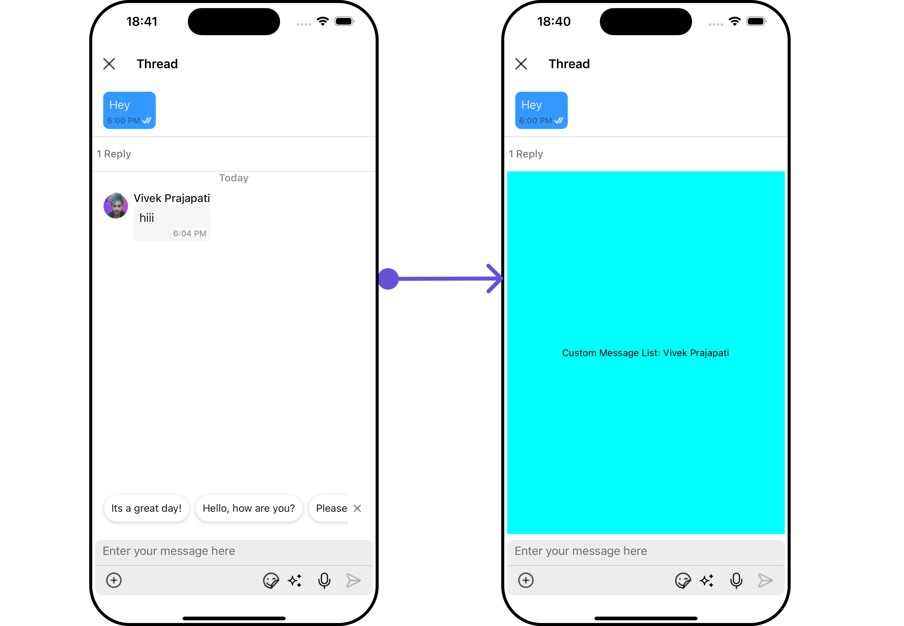

</TabItem>

<TabItem value="android" label="Android">

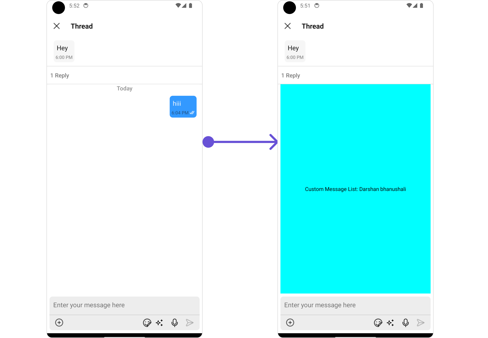
</TabItem>

</Tabs>

In this example, we are setting a custom MessageListView.

<Tabs>
<TabItem value="App" label="App.tsx">

```jsx
import { CometChat } from '@cometchat/chat-sdk-react-native';
import { CometChatThreadedMessages, ListItemStyleInterface } from '@cometchat/chat-uikit-react-native';

function App(): React.JSX.Element {

    const [chatUser, setChatUser] = React.useState<CometChat.User>();
    const [message, setMessage] = React.useState<CometChat.TextMessage | undefined>(undefined);

    React.useEffect(() => {
          //after login
          CometChat.getUser("alice-uid").then((user) => {
              setChatUser(user);
          })
          CometChat.getMessageDetails(614).then((message: any) => {
              setMessage(message);
          })

    }, []);

    const listItemStyle : ListItemStyleInterface = {
      width: "500",
      height: "100%",
      borderRadius: 12,
      titleColor:"#ffffff",
      backgroundColor:"#6851D6",
    };

    const customBubbleView = () => {
       return(
         <CometChatListItem id="info" title ={(message as CometChat.TextMessage).getText()}
         listItemStyle={listItemStyle} />
       )
    };

    const CustomMessageComposer = ({ user, group, parentMessage }: {
        user?: CometChat.User | undefined;
        group?: CometChat.Group | undefined;
        parentMessage: CometChat.BaseMessage;
    }) => {
        return <TextInput style={{
            padding: 10, margin: 10,
            borderRadius: 10,
            borderWidth: 1, borderColor: "lightgray",
        }} placeholder="Type a message" />
    };

    const CustomMessagesListView = ({ user, group, parentMessage }: {
        user?: CometChat.User | undefined;
        group?: CometChat.Group | undefined;
        parentMessage: CometChat.BaseMessage;
    }) => {
        let name = user?.getName() || group?.getName();
        return <View style={{
                flex: 1,
                alignItems: 'center',
                justifyContent: 'center',
                backgroundColor: 'cyan'
            }}>
                <Text style={{ color: "#000" }}>Custom Message List: {name}</Text>
            </View>
    };

    const viewStyle: StyleProp<ViewStyle> = {
      flexDirection: 'row',
      alignItems: 'flex-start',
      justifyContent: 'center',
      padding: 5,
      borderColor: 'black',
      borderWidth: 1,
      backgroundColor: 'white',
      borderRadius: 10,
      margin: 2,
      marginLeft: 7.4,
      height: 30,
      width: '95.5%',
    };

    const customMessageActionView  = () : JSX.Element => {
      return <View style={viewStyle}>
               <Text style={{color: "#6851D6", fontWeight: "bold"}}>Load More Replies</Text>
            </View>
    };

    return (
      <>
         {  chatUser && message &&
            <CometChatThreadedMessages
            parentMessage={message}
            BubbleView={customBubbleView}
            MessageActionView={customMessageActionView}
            MessageComposerView={CustomMessageComposer}
           ></CometChatThreadedMessages> }
      </>
    );
}
```

</TabItem>
</Tabs>
---

## Configuration

Configurations offer the ability to customize the properties of each individual component within a Composite Component.

The ThreadedMessages is a Composite Component, and it has a distinct set of configurations for each of its components as follows.

### MessageList

If you want to customize the properties of the [MessageList](./message-list) Component inside ThreadedMessages Component, you need use the `MessageListConfiguration` object.

<Tabs>
<TabItem value="App" label="App.tsx">

```jsx
import { CometChat } from '@cometchat/chat-sdk-react-native';
import { CometChatThreadedMessages, MessageListConfigurationInterface } from '@cometchat/chat-uikit-react-native';

function App(): React.JSX.Element {

    const [chatUser, setChatUser] = React.useState<CometChat.User>();
    const [message, setMessage] = React.useState<CometChat.TextMessage | undefined>(undefined);

    React.useEffect(() => {
          //after login
          CometChat.getUser("alice-uid").then((user) => {
              setChatUser(user);
          })
          CometChat.getMessageDetails(614).then((message: any) => {
              setMessage(message);
          })

    }, []);

    const listItemStyle : ListItemStyleInterface = {
      width: "500",
      height: "100%",
      borderRadius: 12,
      titleColor:"#ffffff",
      backgroundColor:"#6851D6",
    };

    const customBubbleView = () => {
       return(
         <CometChatListItem id="info" title ={(message as CometChat.TextMessage).getText()}
         listItemStyle={listItemStyle} />
       )
    };

   const messageRequestBuilder : CometChat.MessagesRequestBuilder = new CometChat.MessagesRequestBuilder()
                                                                .setLimit(2).setSearchKeyword('check');


   const messageListConfiguration : MessageListConfigurationInterface = {
       //config
       messageRequestBuilder: messageRequestBuilder
   }


    return (
      <>
         {  chatUser && message &&
            <CometChatThreadedMessages
            parentMessage={message}
            BubbleView={customBubbleView}
            messageListConfiguration={messageListConfiguration}
           ></CometChatThreadedMessages> }
      </>
    );
}
```

</TabItem>
</Tabs>

The `MessageListConfiguration` provides access to all the [Action](/ui-kit/react-native/message-list#actions), [Filters](/ui-kit/react-native/message-list#filters), [Styles](/ui-kit/react-native/message-list#style), [Functionality](/ui-kit/react-native/message-list#functionality), and [Advanced](/ui-kit/react-native/message-list#advanced) properties of the [MessageList](/ui-kit/react-native/message-list) component.

:::info

Please note that the properties marked with the <a><span class="material-icons red">report</span></a> symbol are not accessible within the Configuration Object.

:::

**Example**

<Tabs>

<TabItem value="iOS" label="iOS">

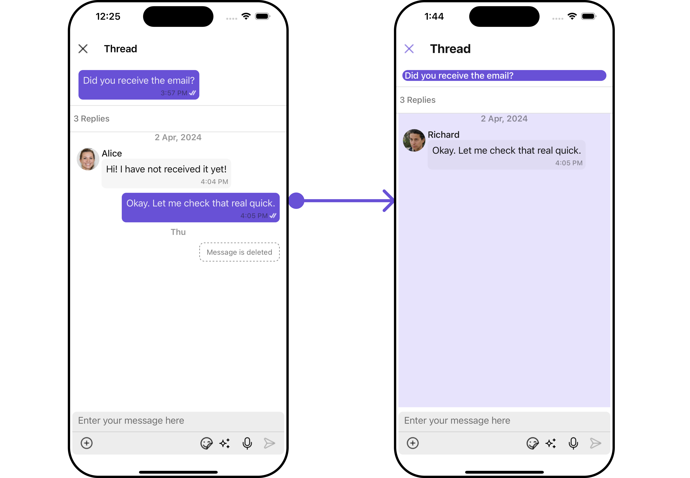

</TabItem>

<TabItem value="android" label="Android">

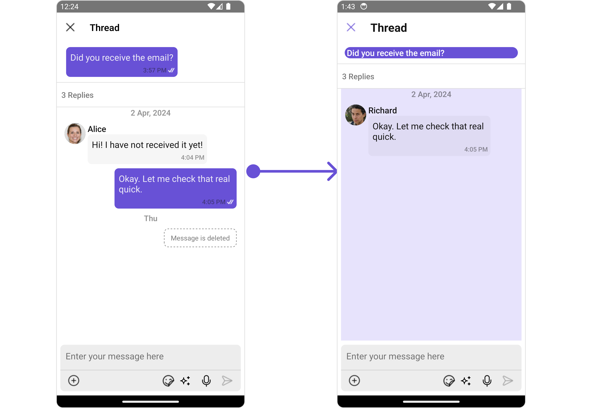
</TabItem>

</Tabs>

In this example, we will be changing the list alignment and modifying the message list styles in the [MessageList](/ui-kit/react-native/message-list) component using `MessageListConfiguration`.

<Tabs>
<TabItem value="App" label="App.tsx">

```jsx
import { CometChat } from '@cometchat/chat-sdk-react-native';
import { CometChatThreadedMessages, MessageListConfigurationInterface, CometChatUiKitConstants,
MessageListStyleInterface } from '@cometchat/chat-uikit-react-native';

function App(): React.JSX.Element {

    const [chatUser, setChatUser] = React.useState<CometChat.User>();
    const [message, setMessage] = React.useState<CometChat.TextMessage | undefined>(undefined);

    React.useEffect(() => {
          //after login
          CometChat.getUser("alice-uid").then((user) => {
              setChatUser(user);
          })
          CometChat.getMessageDetails(614).then((message: any) => {
              setMessage(message);
          })

    }, []);

    const listItemStyle : ListItemStyleInterface = {
      width: "500",
      height: "100%",
      borderRadius: 12,
      titleColor:"#ffffff",
      backgroundColor:"#6851D6",
    };

    const customBubbleView = () => {
       return(
         <CometChatListItem id="info" title ={(message as CometChat.TextMessage).getText()}
         listItemStyle={listItemStyle} />
       )
    };

    const messageListStyle : MessageListStyleInterface = {
       backgroundColor:"#e7e3fc",
       loadingIconTint:"#e7e3fc"
    };

    const messageRequestBuilder : CometChat.MessagesRequestBuilder = new CometChat.MessagesRequestBuilder()
                                                                .setLimit(2).setSearchKeyword('check');

    const alignment : CometChatUiKitConstants.MessageListAlignmentType = "leftAligned";

    const messageListConfiguration : MessageListConfigurationInterface = {
       messageRequestBuilder: messageRequestBuilder,
       alignment: alignment,
       messageListStyle: messageListStyle
    }

    return (
      <>
         {  chatUser && message &&
            <CometChatThreadedMessages
            parentMessage={message}
            BubbleView={customBubbleView}
            messageListConfiguration={messageListConfiguration}
           ></CometChatThreadedMessages> }
      </>
    );
}
```

</TabItem>
</Tabs>

---

### MessageComposer

If you want to customize the properties of the [MessageComposer](/ui-kit/react-native/message-composer) Component inside ThreadedMessages Component, you need use the `MessageComposerConfiguration` object.

<Tabs>
<TabItem value="App" label="App.tsx">

```jsx
import { CometChat } from '@cometchat/chat-sdk-react-native';
import { CometChatThreadedMessages, CometChatMessageComposerInterface } from '@cometchat/chat-uikit-react-native';

function App(): React.JSX.Element {

    const [chatUser, setChatUser] = React.useState<CometChat.User>();
    const [message, setMessage] = React.useState<CometChat.TextMessage | undefined>(undefined);

    React.useEffect(() => {
          //after login
          CometChat.getUser("alice-uid").then((user) => {
              setChatUser(user);
          })
          CometChat.getMessageDetails(614).then((message: any) => {
              setMessage(message);
          })

    }, []);

    const listItemStyle : ListItemStyleInterface = {
      width: "500",
      height: "100%",
      borderRadius: 12,
      titleColor:"#ffffff",
      backgroundColor:"#6851D6",
    };

    const customBubbleView = () => {
       return(
         <CometChatListItem id="info" title ={(message as CometChat.TextMessage).getText()}
         listItemStyle={listItemStyle} />
       )
    };

    const messageComposerConfiguration : CometChatMessageComposerInterface = {
       //config
    }

    return (
      <>
         {  chatUser && message &&
            <CometChatThreadedMessages
            parentMessage={message}
            BubbleView={customBubbleView}
            messageComposerConfiguration={messageComposerConfiguration}
           ></CometChatThreadedMessages> }
      </>
    );
}
```

</TabItem>
</Tabs>

The `MessageComposerConfiguration` provides access to all the [Action](/ui-kit/react-native/message-composer#actions), [Filters](/ui-kit/react-native/message-composer#filters), [Styles](/ui-kit/react-native/message-composer#style), [Functionality](/ui-kit/react-native/message-composer#functionality), and [Advanced](/ui-kit/react-native/message-composer#advanced) properties of the [MessageComposer](/ui-kit/react-native/message-composer) component.

:::info

Please note that the properties marked with the <a><span class="material-icons red">report</span></a> symbol are not accessible within the Configuration Object.

:::

**Example**

<Tabs>

<TabItem value="iOS" label="iOS">

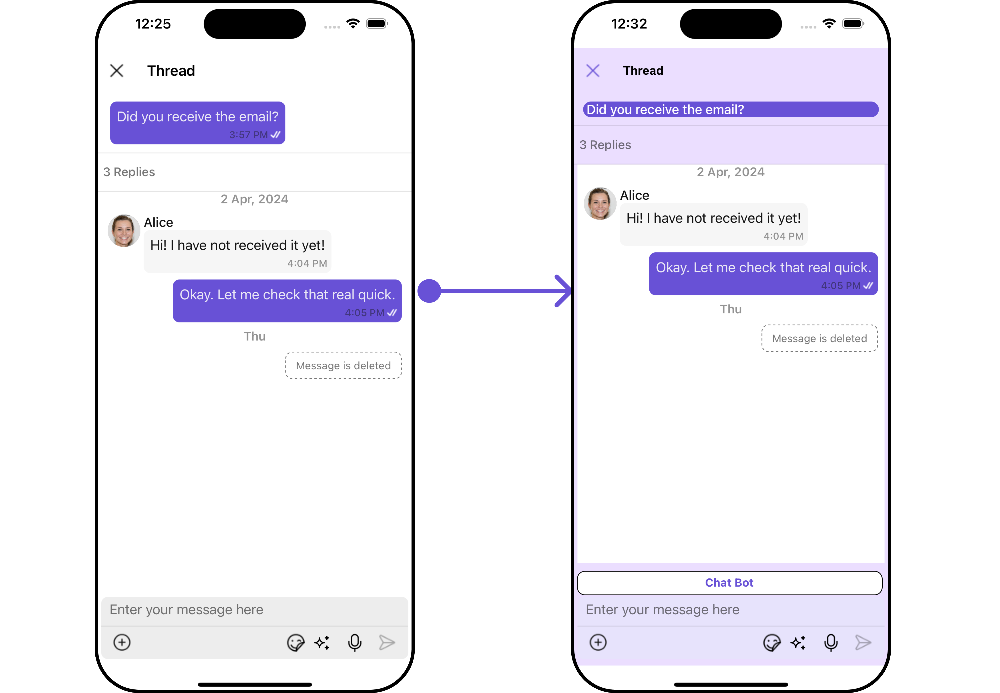

</TabItem>

<TabItem value="android" label="Android">

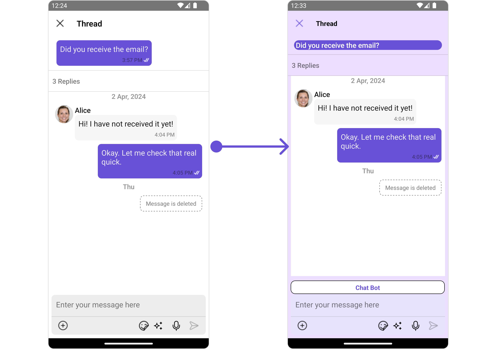
</TabItem>

</Tabs>

In this example, we'll be adding a custom header view and customizing some properties of the [MessageComposer](/ui-kit/react-native/message-composer) component using `MessageComposerConfiguration`.

<Tabs>
<TabItem value="ThreadedMessagesDemo" label="ThreadedMessagesDemo.tsx">

```jsx
import { CometChat } from '@cometchat/chat-sdk-react-native';
import { CometChatThreadedMessages, CometChatMessageComposerInterface } from '@cometchat/chat-uikit-react-native';

function App(): React.JSX.Element {

    const [chatUser, setChatUser] = React.useState<CometChat.User>();
    const [message, setMessage] = React.useState<CometChat.TextMessage | undefined>(undefined);

    React.useEffect(() => {
          //after login
          CometChat.getUser("alice-uid").then((user) => {
              setChatUser(user);
          })
          CometChat.getMessageDetails(614).then((message: any) => {
              setMessage(message);
          })

    }, []);

    const listItemStyle : ListItemStyleInterface = {
      width: "500",
      height: "100%",
      borderRadius: 12,
      titleColor:"#ffffff",
      backgroundColor:"#6851D6",
    };

    const customBubbleView = () => {
       return(
         <CometChatListItem id="info" title ={(message as CometChat.TextMessage).getText()}
         listItemStyle={listItemStyle} />
       )
    };

    const viewStyleComposerHeader: StyleProp<ViewStyle> = {
      flexDirection: 'row',
      alignItems: 'flex-start',
      justifyContent: 'center',
      padding: 5,
      borderColor: 'black',
      borderWidth: 1,
      backgroundColor: 'white',
      borderRadius: 10,
      margin: 2,
      marginLeft: 7.4,
      height: 30,
      width: '95.5%',
    };


    const customHeaderViewForComposer = () => {
       return <View style={viewStyleComposerHeader}>
                 <Text style={{color: "#6851D6", fontWeight: "bold"}}>Chat Bot</Text>
              </View>
    }

    const messageComposerStyle : MessageComposerStyleInterface = {
      sendIconTint: "red",
      inputBackground: "#e7e3fc",
      borderRadius: 20,
      textColor:"red",
    }

    const messageComposerConfiguration : CometChatMessageComposerInterface = {
       HeaderView: customHeaderViewForComposer,
       messageComposerStyle: messageComposerStyle,
    }

    return (
      <>
         {  chatUser && message &&
            <CometChatThreadedMessages
            parentMessage={message}
            BubbleView={customBubbleView}
            messageComposerConfiguration={messageComposerConfiguration}
           ></CometChatThreadedMessages> }
      </>
    );
}
```

</TabItem>
</Tabs>

import { Tooltip } from 'react-tooltip'
import 'react-tooltip/dist/react-tooltip.css'

<Tooltip
  id="my-tooltip-html-prop"
  html="Not available in ThreadedMessagesConfiguration"
/>
