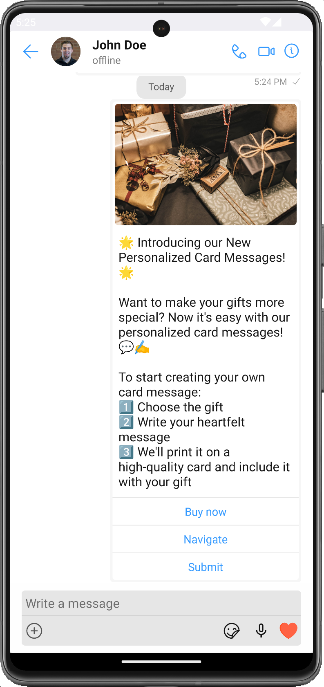

import Tabs from '@theme/Tabs';
import TabItem from '@theme/TabItem';

The CometChatCardBubble component is used to display a card within a chat bubble. The card includes an image, text, and action buttons. It helps to offer action-oriented chat experiences, like booking a flight, ordering food, scheduling a meeting, etc., directly in the chat.



---

## Properities

| Methods        | Parameters               | Description                                                                                                                                            |
| -------------- | ------------------------ | ------------------------------------------------------------------------------------------------------------------------------------------------------ |
| message        | Card Message             | An instance of the `CardMessage` class which holds information about the card, such as image URL, text, and action buttons.                            |
| style?         | CardBubbleStyleInterface | An instance of the `CardBubbleStyle` class for customizing the appearance of the card bubble.                                                          |
| onSubmitClick? | (formData: any) => void  | A function that will be called when the action button of the card is clicked. This function receives the payload of the clicked action as an argument. |

## CardBubbleStyle

CardBubbleStyle is a class containing attributes to customize the appearance of the card in the CometChatCardBubble component.

| Methods         | Type                                                      | Description                                                                                              |
| --------------- | --------------------------------------------------------- | -------------------------------------------------------------------------------------------------------- |
| backgroundColor | string                                                    | Used to set the background color of the card bubble.                                                     |
| borderRadius    | number                                                    | Used to set the border radius of the card bubble.                                                        |
| textFont        | FontStyle                                                 | Used to set the font style of the title. The object should include fontFamily, fontSize, and fontWeight. |
| textColor       | string                                                    | Used to set the color of the title.                                                                      |
| padding         | number                                                    | Used to set the padding of the card bubble.                                                              |
| buttonStyle     | ButtonStyleInterface                                      | Used to customize the style of buttons.                                                                  |
| imageStyle      | ImageBubbleStyleInterface                                 | Used to customize the style of the image in the card.                                                    |
| imageResizeMode | "cover" \| "contain" \| "stretch" \| "repeat" \| "center" | Used to set how to resize the image in the card.                                                         |

## Usage

<Tabs>
<TabItem value="ts2" label="Typescript">

```typescript
<CometChatCardBubble
  message={message} //message: CardMessage
  onSubmitClick={onSubmitClick} //onSubmitClick?: (data: any) => void
  style={style} //style?: CardBubbleStyle
/>
```

</TabItem>

</Tabs>
