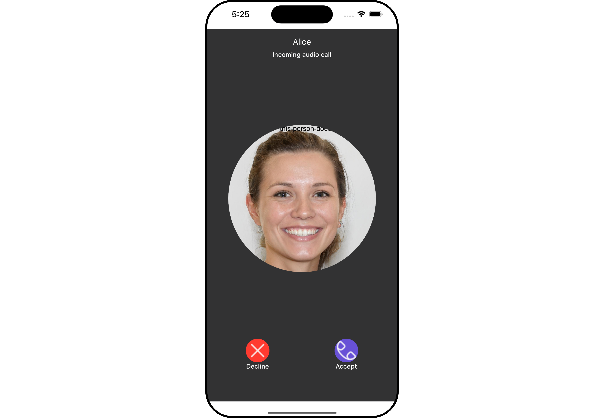
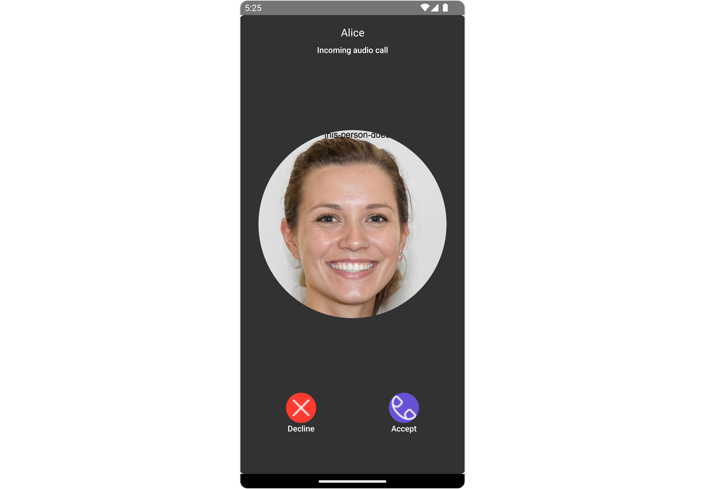
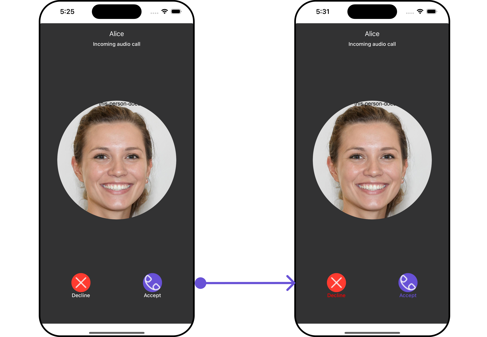
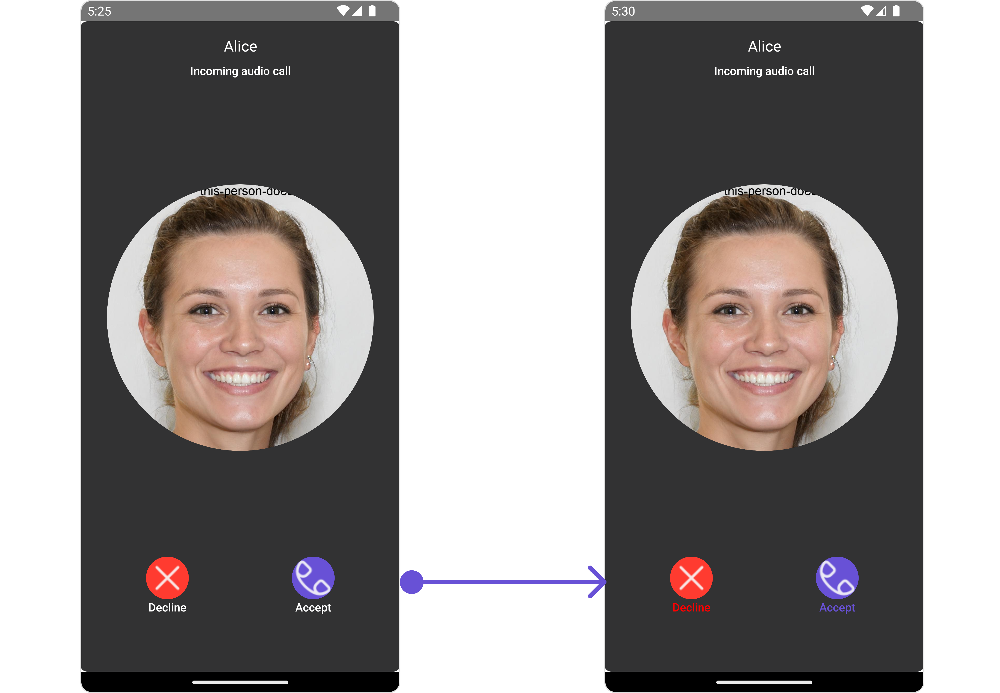
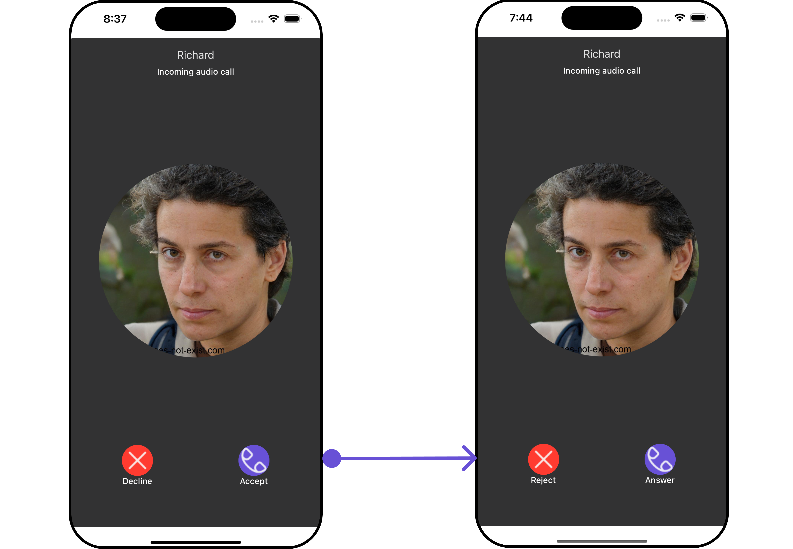
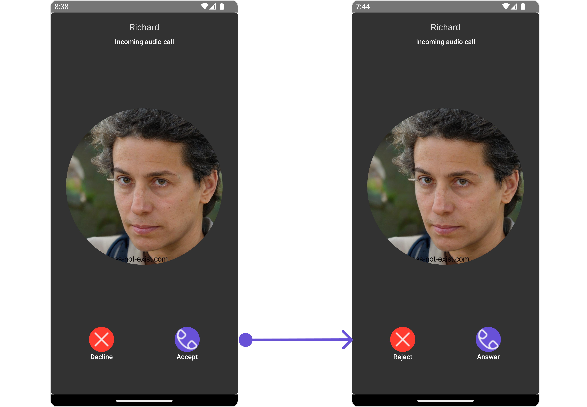
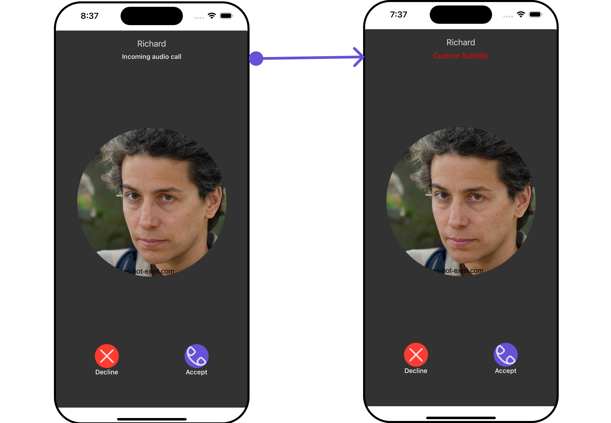
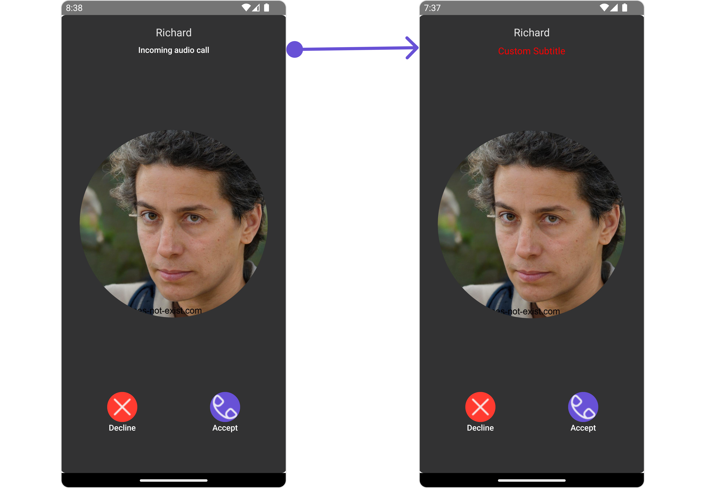

import Tabs from '@theme/Tabs';
import TabItem from '@theme/TabItem';

## Overview

The `Incoming call` is a [Component](/ui-kit/react-native/components-overview#components) that serves as a visual representation when the user receives an incoming call, such as a voice call or video call, providing options to answer or decline the call.

<Tabs>

<TabItem value="iOS" label="iOS">



</TabItem>

<TabItem value="android" label="Android">



</TabItem>

</Tabs>

The `Incoming Call` is comprised of the following base components:

| Components                         | Description                                                                                                                                    |
| ---------------------------------- | ---------------------------------------------------------------------------------------------------------------------------------------------- |
| [cometchat-list-item](./list-item) | This component’s view consists of avatar, status indicator , title, and subtitle. The fields are then mapped with the SDK’s user, group class. |
| [cometchat-avatar](./avatar)       | This component component displays an image or user's avatar with fallback to the first two letters of the username                             |

## Usage

### Integration

<Tabs>
<TabItem value="typescript" label="App.tsx">

```tsx
import { CometChat } from "@cometchat/chat-sdk-react-native";
import { CometChatIncomingCall } from "@cometchat/chat-uikit-react-native";

function App(): React.JSX.Element {
  const incomingCall = useRef(null);
  const [callReceived, setCallReceived] = useState(false);
  const listnerID = "UNIQUE_LISTENER_ID";

  useEffect(() => {
    //code
    CometChat.addCallListener(
      listnerID,
      new CometChat.CallListener({
        onIncomingCallReceived: (call) => {
          incomingCall.current = call;
          setCallReceived(true);
        },
        onOutgoingCallRejected: (call) => {
          incomingCall.current = null;
          setCallReceived(false);
        },
        onIncomingCallCancelled: (call) => {
          incomingCall.current = null;
          setCallReceived(false);
        },
      })
    );
  });

  return (
    <>
      {callReceived && (
        <CometChatIncomingCall
          call={incomingCall.current!}
          onDecline={(call) => {
            setCallReceived(false);
          }}
        />
      )}
    </>
  );
}
```

</TabItem>
</Tabs>

### Actions

[Actions](/ui-kit/react-native/components-overview#actions) dictate how a component functions. They are divided into two types: Predefined and User-defined. You can override either type, allowing you to tailor the behavior of the component to fit your specific needs.

##### 1. onAccept

`onAccept` is triggered when you click the accept button of the `Incoming Call` component. You can override this action using the following code snippet.

<Tabs>

<TabItem value="typescript" label="App.tsx">

```tsx
import { CometChat } from "@cometchat/chat-sdk-react-native";
import { CometChatIncomingCall } from "@cometchat/chat-uikit-react-native";

function App(): React.JSX.Element {
  const incomingCall = useRef(null);
  const [callReceived, setCallReceived] = useState(false);
  const listnerID = "UNIQUE_LISTENER_ID";

  useEffect(() => {
    //code
    CometChat.addCallListener(
      listnerID,
      new CometChat.CallListener({
        onIncomingCallReceived: (call) => {
          incomingCall.current = call;
          setCallReceived(true);
        },
        onOutgoingCallRejected: (call) => {
          incomingCall.current = null;
          setCallReceived(false);
        },
        onIncomingCallCancelled: (call) => {
          incomingCall.current = null;
          setCallReceived(false);
        },
      })
    );
  });

  const onAcceptHandler = (message: CometChat.BaseMessage) => {
    //code
  };

  return (
    <>
      {callReceived && (
        <CometChatIncomingCall
          call={incomingCall.current!}
          onDecline={(call) => {
            setCallReceived(false);
          }}
          onAccept={onAcceptHandler}
        />
      )}
    </>
  );
}
```

</TabItem>
</Tabs>

##### 2. onDecline

`onDecline` is triggered when you click the Decline button of the `Incoming Call` component. This action does not have a predefined behavior. You can override this action using the following code snippet.

<Tabs>
<TabItem value="typescript" label="App.tsx">

```tsx
import { CometChat } from "@cometchat/chat-sdk-react-native";
import { CometChatIncomingCall } from "@cometchat/chat-uikit-react-native";

function App(): React.JSX.Element {
  const incomingCall = useRef(null);
  const [callReceived, setCallReceived] = useState(false);
  const listnerID = "UNIQUE_LISTENER_ID";

  useEffect(() => {
    //code
    CometChat.addCallListener(
      listnerID,
      new CometChat.CallListener({
        onIncomingCallReceived: (call) => {
          incomingCall.current = call;
          setCallReceived(true);
        },
        onOutgoingCallRejected: (call) => {
          incomingCall.current = null;
          setCallReceived(false);
        },
        onIncomingCallCancelled: (call) => {
          incomingCall.current = null;
          setCallReceived(false);
        },
      })
    );
  });

  const onDeclineHandler = (call) => {
    setCallReceived(false);
  };

  return (
    <>
      {callReceived && (
        <CometChatIncomingCall
          call={incomingCall.current!}
          onDecline={onDeclineHandler}
        />
      )}
    </>
  );
}
```

</TabItem>
</Tabs>

##### 3. onError

This action doesn't change the behavior of the component but rather listens for any errors that occur in the Banned Members component.

<Tabs>
<TabItem value="typescript" label="App.tsx">

```tsx
import { CometChat } from "@cometchat/chat-sdk-react-native";
import { CometChatIncomingCall } from "@cometchat/chat-uikit-react-native";

function App(): React.JSX.Element {
  const incomingCall = useRef(null);
  const [callReceived, setCallReceived] = useState(false);
  const listnerID = "UNIQUE_LISTENER_ID";

  useEffect(() => {
    //code
    CometChat.addCallListener(
      listnerID,
      new CometChat.CallListener({
        onIncomingCallReceived: (call) => {
          incomingCall.current = call;
          setCallReceived(true);
        },
        onOutgoingCallRejected: (call) => {
          incomingCall.current = null;
          setCallReceived(false);
        },
        onIncomingCallCancelled: (call) => {
          incomingCall.current = null;
          setCallReceived(false);
        },
      })
    );
  });

  const onErrorHandler = (error: CometChat.CometChatException) => {
    //code
  };

  return (
    <>
      {callReceived && (
        <CometChatIncomingCall
          call={incomingCall.current!}
          onDecline={(call) => {
            setCallReceived(false);
          }}
          onError={onErrorHandler}
        />
      )}
    </>
  );
}
```

</TabItem>
</Tabs>

---

### Filters

**Filters** allow you to customize the data displayed in a list within a `Component`. You can filter the list based on your specific criteria, allowing for a more customized. Filters can be applied using `RequestBuilders` of Chat SDK.

The `Incoming Call` component does not have any exposed filters.

### Events

[Events](/ui-kit/react-native/components-overview#events) are emitted by a `Component`. By using event you can extend existing functionality. Being global events, they can be applied in Multiple Locations and are capable of being Added or Removed.

The list of events emitted by the Incoming Call component is as follows.

| Event              | Description                                                                  |
| ------------------ | ---------------------------------------------------------------------------- |
| **ccCallRejected** | This event is triggered when the initiated call is rejected by the receiver. |
| **ccCallAccepted** | This event is triggered when the initiated call is accepted by the receiver. |
| **ccCallEnded**    | This event is triggered when the initiated call successfully ends.           |
| **ccCallFailled**  | This event is triggered when an error occurs during the intiated call.       |

<Tabs>
<TabItem value="js" label="Adding Listeners">

```js
import { CometChatUIEventHandler } from "@cometchat/chat-uikit-react-native";

CometChatUIEventHandler.addCallListener("CALL_LISTENER_ID", {
  ccCallRejected: ({ call }) => {
    //code
  },
});

CometChatUIEventHandler.addCallListener("CALL_LISTENER_ID", {
  ccCallAccepted: ({ call }) => {
    //code
  },
});

CometChatUIEventHandler.addCallListener("CALL_LISTENER_ID", {
  ccCallEnded: ({ call }) => {
    //code
  },
});

CometChatUIEventHandler.addCallListener("CALL_LISTENER_ID", {
  ccCallFailled: ({ call }) => {
    //code
  },
});
```

</TabItem>

</Tabs>

---

<Tabs>
<TabItem value="js" label="Removing Listeners">

```js
import { CometChatUIEventHandler } from "@cometchat/chat-uikit-react-native";

CometChatUIEventHandler.removeCallListener("CALL_LISTENER_ID");
```

</TabItem>
</Tabs>

---

## Customization

To fit your app's design requirements, you can customize the appearance of the Incoming Call component. We provide exposed methods that allow you to modify the experience and behavior according to your specific needs.

### Style

Using Style you can customize the look and feel of the component in your app, These parameters typically control elements such as the color, size, shape, and fonts used within the component.

##### 1. IncomingCall Style

To customize the appearance, you can assign a `IncomingCallStyle` object to the `Incoming Call` component.

In this example, we are employing the `IncomingCallStyle`.

<Tabs>

<TabItem value="iOS" label="iOS">



</TabItem>

<TabItem value="android" label="Android">



</TabItem>

</Tabs>

<Tabs>
<TabItem value="typescript" label="App.tsx">

```tsx
import { CometChat } from "@cometchat/chat-sdk-react-native";
import {
  CometChatIncomingCall,
  IncomingCallStyleInterface,
} from "@cometchat/chat-uikit-react-native";

function App(): React.JSX.Element {
  const incomingCall = useRef(null);
  const [callReceived, setCallReceived] = useState(false);
  const listnerID = "UNIQUE_LISTENER_ID";

  useEffect(() => {
    //code
    CometChat.addCallListener(
      listnerID,
      new CometChat.CallListener({
        onIncomingCallReceived: (call) => {
          incomingCall.current = call;
          setCallReceived(true);
        },
        onOutgoingCallRejected: (call) => {
          incomingCall.current = null;
          setCallReceived(false);
        },
        onIncomingCallCancelled: (call) => {
          incomingCall.current = null;
          setCallReceived(false);
        },
      })
    );
  });

  const incomingCallStyle: IncomingCallStyleInterface = {
    declineButtonTextColor: "red",
    acceptButtonTextColor: "#6851D6",
  };

  return (
    <>
      {callReceived && (
        <CometChatIncomingCall
          call={incomingCall.current!}
          onDecline={(call) => {
            setCallReceived(false);
          }}
          incomingCallStyle={incomingCallStyle}
        />
      )}
    </>
  );
}
```

</TabItem>
</Tabs>

The following properties are exposed by IncomingCallStyle:

| Property                         | Description                                             | Code                                          |
| -------------------------------- | ------------------------------------------------------- | --------------------------------------------- |
| **border**                       | Used to set border                                      | `border?: BorderStyleInterface,`              |
| **borderRadius**                 | Used to set border radius                               | `borderRadius?: number;`                      |
| **backgroundColor**              | Used to set background colour                           | `background?: string;`                        |
| **height**                       | Used to set height                                      | `height?: number` &#124; `string;`            |
| **width**                        | Used to set width                                       | `width?: number` &#124; `string;`             |
| **titleFont**                    | Used to customise the font of the title in the app bar  | `titleFont?: FontStyleInterface;`             |
| **titleColor**                   | Used to customise the color of the title in the app bar | `titleColor?: string;`                        |
| **subtitleColor**                | Used to set the color for group item subtitle           | `subtitleColor?: string;`                     |
| **subtitleFont**                 | Used to set the font style for group item subtitle      | `subtitle	Font?: FontStyleInterface;`          |
| **onlineStatusColor**            | Used to set online status color                         | `onlineStatusColor?: string;`                 |
| **acceptButtonTextColor**        | Used to set accept button text color                    | `acceptButtonTextColor?: string;`             |
| **acceptButtonTextFont**         | Used to set accept button text font                     | `acceptButtonTextFont?: FontStyleInterface;`  |
| **acceptButtonBackgroundColor**  | Used to set accept button background color              | `acceptButtonBackgroundColor?: string;`       |
| **acceptButtonBorder**           | Used to set accept button border                        | `acceptButtonBorder?: BorderStyleInterface;`  |
| **declineButtonTextColor**       | Used to set decline button text color                   | `declineButtonTextColor?: string;`            |
| **declineButtonTextFont**        | Used to set decline button text font                    | `declineButtonTextFont?: FontStyleInterface;` |
| **declineButtonBackgroundColor** | Used to set decline button background color             | `declineButtonBackgroundColor?: string;`      |
| **declineButtonBorder**          | Used to set decline button border                       | `declineButtonBorder?: BorderStyleInterface;` |

##### 2. Avatar Style

If you want to apply customized styles to the `Avatar` component within the `Incoming Call` Component, you can use the following code snippet. For more information you can refer [Avatar Styles](/ui-kit/react-native/avatar#avatarstyleinterface).

<Tabs>
<TabItem value="typescript" label="App.tsx">

```tsx
import { CometChat } from "@cometchat/chat-sdk-react-native";
import {
  CometChatIncomingCall,
  AvatarStyleInterface,
  BorderStyleInterface,
} from "@cometchat/chat-uikit-react-native";

function App(): React.JSX.Element {
  const incomingCall = useRef(null);
  const [callReceived, setCallReceived] = useState(false);
  const listnerID = "UNIQUE_LISTENER_ID";

  useEffect(() => {
    //code
    CometChat.addCallListener(
      listnerID,
      new CometChat.CallListener({
        onIncomingCallReceived: (call) => {
          incomingCall.current = call;
          setCallReceived(true);
        },
        onOutgoingCallRejected: (call) => {
          incomingCall.current = null;
          setCallReceived(false);
        },
        onIncomingCallCancelled: (call) => {
          incomingCall.current = null;
          setCallReceived(false);
        },
      })
    );
  });

  const borderStyle: BorderStyleInterface = {
    borderWidth: 10,
    borderStyle: "solid",
    borderColor: "#cc5e95",
  };

  const avatarStyle: AvatarStyleInterface = {
    outerViewSpacing: 5,
    outerView: {
      borderWidth: 2,
      borderStyle: "dotted",
      borderColor: "blue",
    },
    border: borderStyle,
  };

  return (
    <>
      {callReceived && (
        <CometChatIncomingCall
          call={incomingCall.current!}
          onDecline={(call) => {
            setCallReceived(false);
          }}
          avatarStyle={avatarStyle}
        />
      )}
    </>
  );
}
```

</TabItem>
</Tabs>

##### 3. OngoingCallScreen Style

You can use this style property to apply customized styles to the `OngoingCallScreen` component within the `Incoming Call` Component.

---

### Functionality

These are a set of small functional customizations that allow you to fine-tune the overall experience of the component. With these, you can change text, set custom icons, and toggle the visibility of UI elements.

Here is a code snippet demonstrating how you can customize the functionality of the `Incoming Call` component.

<Tabs>
<TabItem value="typescript" label="App.tsx">

```tsx
import { CometChat } from "@cometchat/chat-sdk-react-native";
import { CometChatIncomingCall } from "@cometchat/chat-uikit-react-native";

function App(): React.JSX.Element {
  const incomingCall = useRef(null);
  const [callReceived, setCallReceived] = useState(false);
  const listnerID = "UNIQUE_LISTENER_ID";

  useEffect(() => {
    //code
    CometChat.addCallListener(
      listnerID,
      new CometChat.CallListener({
        onIncomingCallReceived: (call) => {
          incomingCall.current = call;
          setCallReceived(true);
        },
        onOutgoingCallRejected: (call) => {
          incomingCall.current = null;
          setCallReceived(false);
        },
        onIncomingCallCancelled: (call) => {
          incomingCall.current = null;
          setCallReceived(false);
        },
      })
    );
  });

  return (
    <>
      {callReceived && (
        <CometChatIncomingCall
          call={incomingCall.current!}
          onDecline={(call) => {
            setCallReceived(false);
          }}
          acceptButtonText="Answer"
          declineButtonText="Reject"
          disableSoundForCalls={true}
        />
      )}
    </>
  );
}
```

</TabItem>
</Tabs>

<Tabs>

<TabItem value="iOS" label="iOS">



</TabItem>

<TabItem value="android" label="Android">



</TabItem>

</Tabs>

Below is a list of customizations along with corresponding code snippets

| Property                 | Description                                                                       | Code                             |
| ------------------------ | --------------------------------------------------------------------------------- | -------------------------------- |
| **title**                | Used to set title                                                                 | `title?: string`                 |
| **acceptButtonText**     | Used to set custom accept button text                                             | `acceptButtonText?: string`      |
| **declineButtonText**    | Used to set custom decline button text                                            | `declineButtonText?: string`     |
| **customSoundForCalls**  | Used to set custom sound for incoming calls                                       | `customSoundForCalls?: string`   |
| **disableSoundForCalls** | Used to disable/enable the sound of incoming calls, by default it is set to false | `disableSoundForCalls?: string`  |
| **call**                 | CometChat call object consumed by the component to launch itself                  | `disableSoundForMessages={true}` |

---

### Advanced

For advanced-level customization, you can set custom views to the component. This lets you tailor each aspect of the component to fit your exact needs and application aesthetics. You can create and define your views, layouts, and UI elements and then incorporate those into the component.

---

#### SubtitleView

By using the `SubtitleView` property, you can modify the SubtitleView to meet your specific needs.

<Tabs>

<TabItem value="iOS" label="iOS">



</TabItem>

<TabItem value="android" label="Android">



</TabItem>

</Tabs>

<Tabs>
<TabItem value="typescript" label="App.tsx">

```tsx
import { CometChat } from "@cometchat/chat-sdk-react-native";
import { CometChatIncomingCall } from "@cometchat/chat-uikit-react-native";

function App(): React.JSX.Element {
  const incomingCall = useRef(null);
  const [callReceived, setCallReceived] = useState(false);
  const listnerID = "UNIQUE_LISTENER_ID";

  useEffect(() => {
    //code
    CometChat.addCallListener(
      listnerID,
      new CometChat.CallListener({
        onIncomingCallReceived: (call) => {
          incomingCall.current = call;
          setCallReceived(true);
        },
        onOutgoingCallRejected: (call) => {
          incomingCall.current = null;
          setCallReceived(false);
        },
        onIncomingCallCancelled: (call) => {
          incomingCall.current = null;
          setCallReceived(false);
        },
      })
    );
  });

  const getSubtitleView = (call: CometChat.Call | CometChat.CustomMessage) => {
    return (
      <Text
        style={{
          fontSize: 15,
          color: "red",
          shadowColor: "red",
        }}
      >
        Custom Subtitle
      </Text>
    );
  };

  return (
    <>
      {callReceived && (
        <CometChatIncomingCall
          call={incomingCall.current!}
          onDecline={(call) => {
            setCallReceived(false);
          }}
          SubtitleView={getSubtitleView}
        />
      )}
    </>
  );
}
```

</TabItem>
</Tabs>
