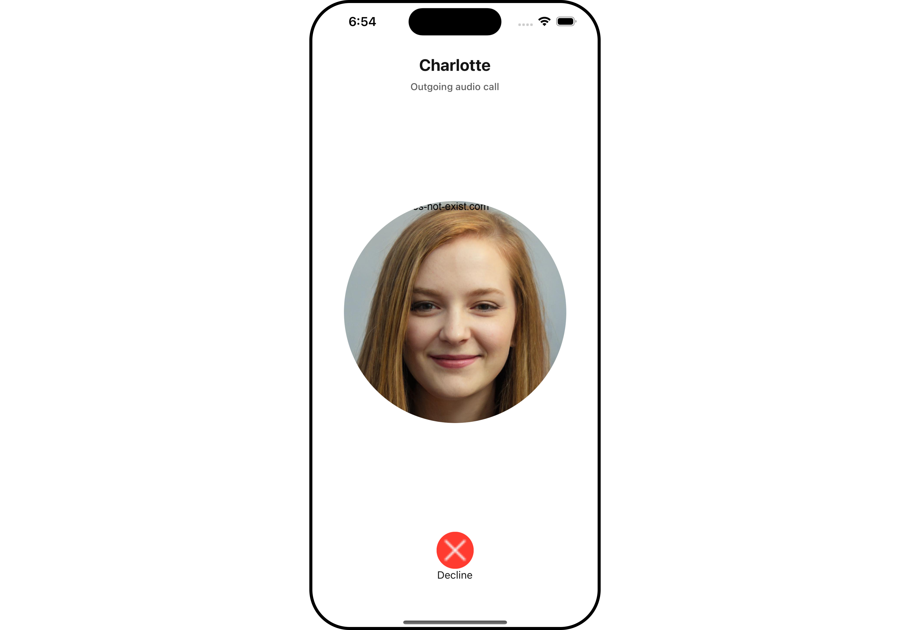
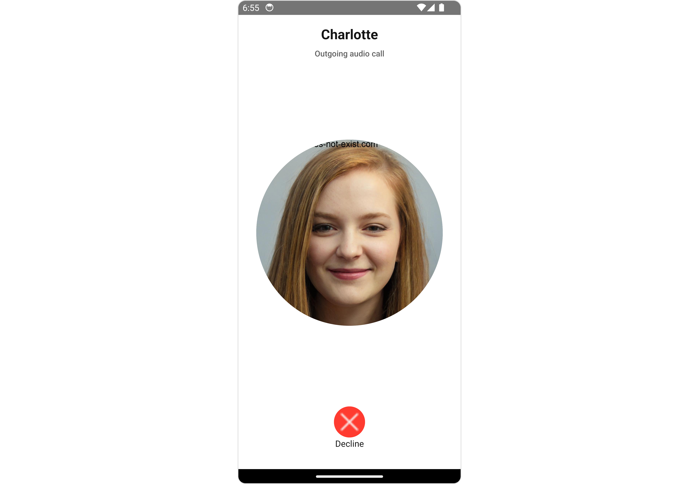
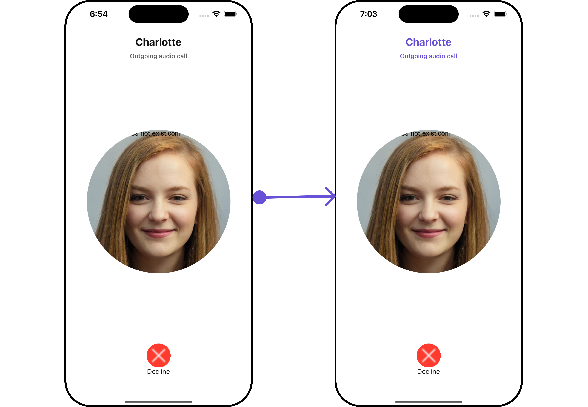
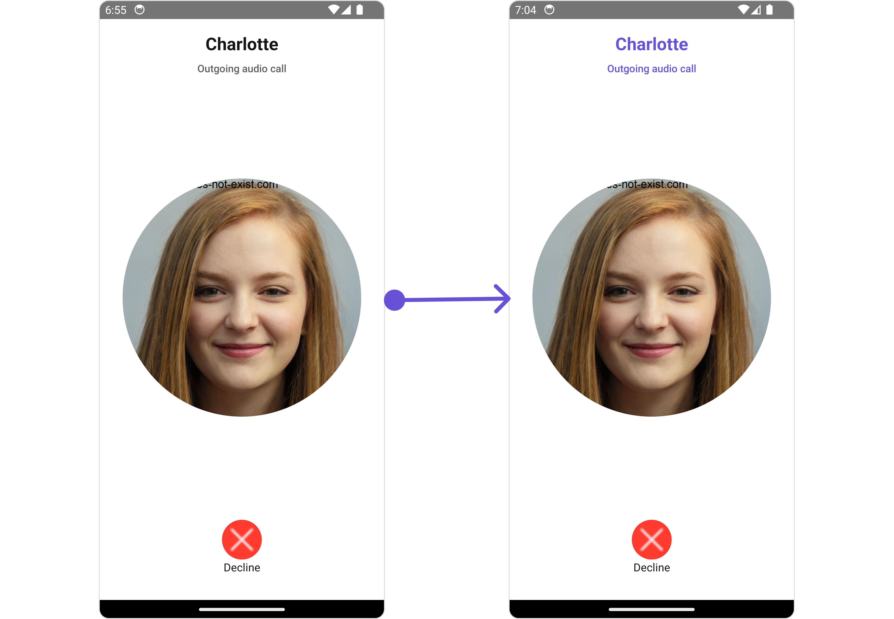
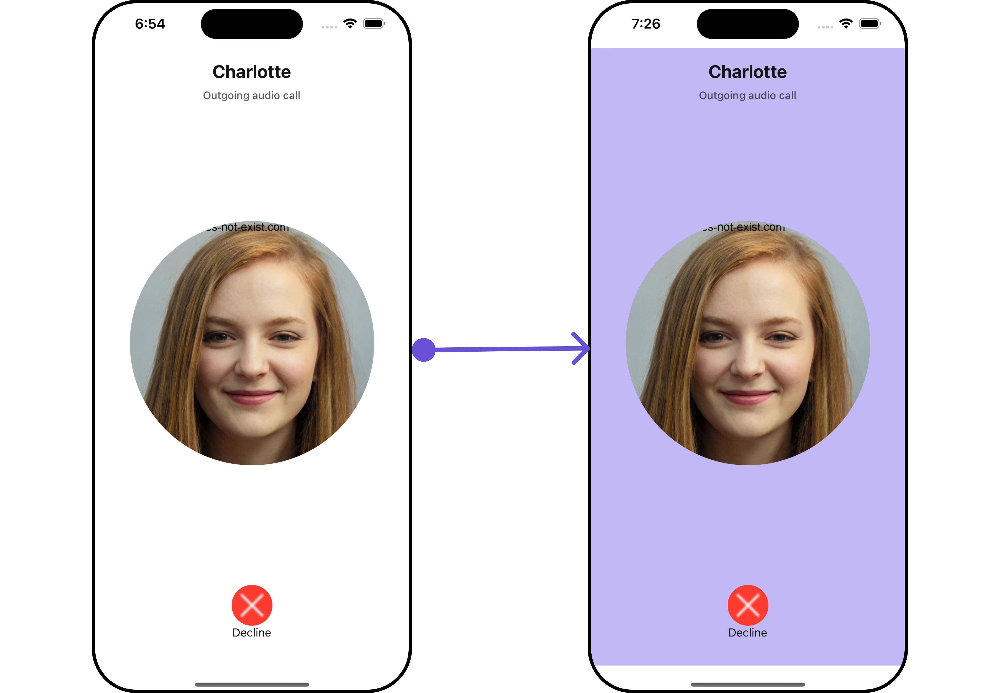
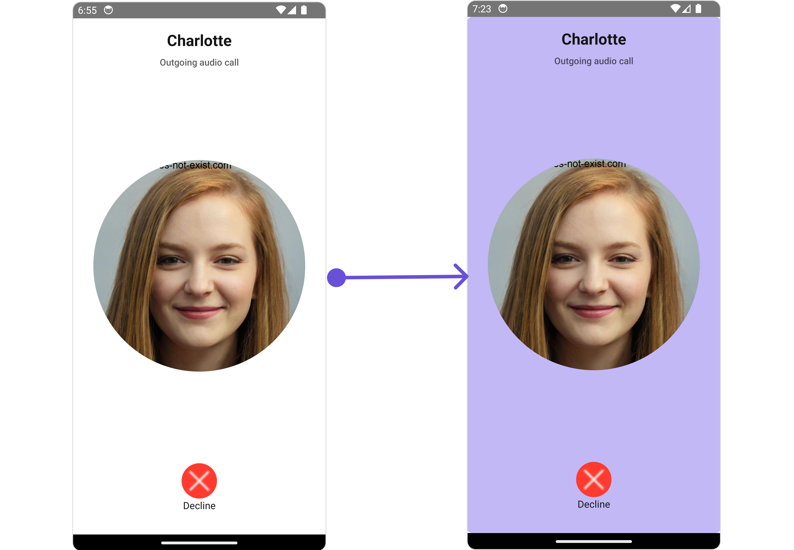
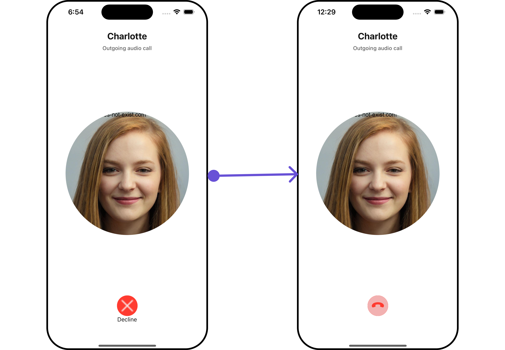
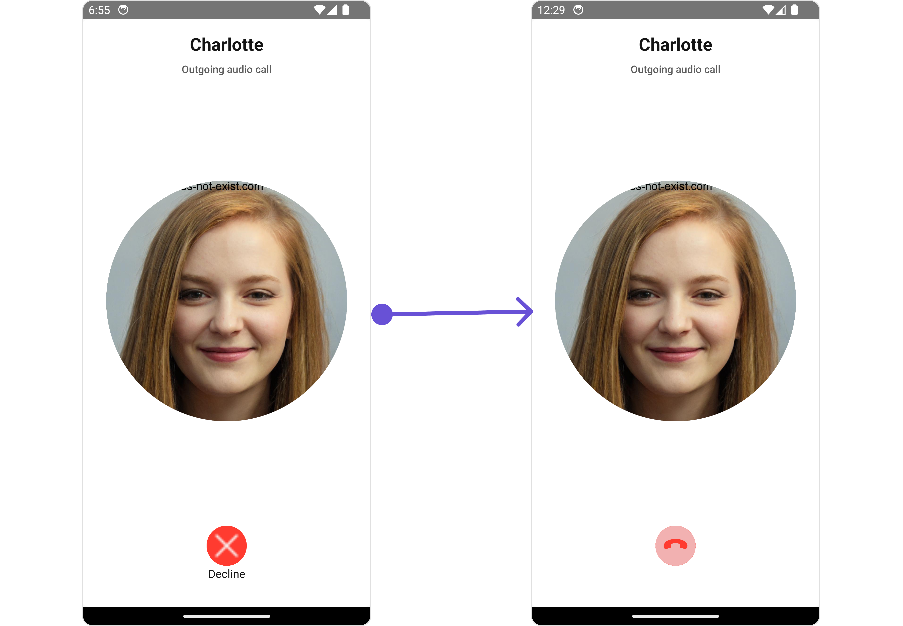

import Tabs from '@theme/Tabs';
import TabItem from '@theme/TabItem';

## Overview

The outgoing call component is a visual representation of a user-initiated call, whether it's a voice or video call. It serves as an interface for managing outgoing calls, providing users with essential options to control the call experience. This component typically includes information about the call recipient, call controls for canceling the call, and feedback on the call status, such as indicating when the call is in progress.

<Tabs>

<TabItem value="iOS" label="iOS">



</TabItem>

<TabItem value="android" label="Android">



</TabItem>

</Tabs>

The `Outgoing Call` is comprised of the following components:

## Usage

### Integration

<Tabs>
<TabItem value="typescript" label="App.tsx">

```tsx
import { CometChat } from "@cometchat/chat-sdk-react-native";
import {
  CometChatOutgoingCall,
  CometChatUiKitConstants,
} from "@cometchat/chat-uikit-react-native";

function App(): React.JSX.Element {
  const [call, setCall] = useState<CometChat.Call>();

  useEffect(() => {
    //login
    const callObject = new CometChat.Call(
      "receiver-uid",
      CometChatUiKitConstants.MessageTypeConstants.audio,
      CometChatUiKitConstants.ReceiverTypeConstants.user
    );

    CometChat.initiateCall(callObject)
      .then((c) => {
        setCall(c);
      })
      .catch(console.log);
  }, []);

  return <>{call && <CometChatOutgoingCall call={call} />}</>;
}
```

</TabItem>
</Tabs>

### Actions

[Actions](/ui-kit/react-native/components-overview#actions) dictate how a component functions. They are divided into two types: Predefined and User-defined. You can override either type, allowing you to tailor the behavior of the component to fit your specific needs.

##### 1. onDeclineButtonPressed

The `onDeclineButtonPressed` event gets activated when the cancel button is clicked. It does not have a default behavior. However, you can override its behavior using the following code snippet.

<Tabs>
<TabItem value="typescript" label="App.tsx">

```tsx
import { CometChat } from "@cometchat/chat-sdk-react-native";
import {
  CometChatOutgoingCall,
  CometChatUiKitConstants,
} from "@cometchat/chat-uikit-react-native";

function App(): React.JSX.Element {
  const [call, setCall] = useState<CometChat.Call>();

  useEffect(() => {
    //login
    const callObject = new CometChat.Call(
      "receiver-uid",
      CometChatUiKitConstants.MessageTypeConstants.audio,
      CometChatUiKitConstants.ReceiverTypeConstants.user
    );

    CometChat.initiateCall(callObject)
      .then((c) => {
        setCall(c);
      })
      .catch(console.log);
  }, []);

  const cancelCall = (c: CometChat.Call) => {
    //code
    CometChat.endCall(c.getSessionId()).then(() => {
      setCall(undefined);
    });
  };

  return (
    <>
      {call && (
        <CometChatOutgoingCall
          call={call}
          onDeclineButtonPressed={cancelCall}
        />
      )}
    </>
  );
}
```

</TabItem>
</Tabs>

---

### Filters

**Filters** allow you to customize the data displayed in a list within a `Component`. You can filter the list based on your specific criteria, allowing for a more customized. Filters can be applied using `RequestBuilders` of Chat SDK.

The `Outgoing Call` component does not have any exposed filters.

---

### Events

[Events](/ui-kit/react-native/components-overview#events) are emitted by a `Component`. By using event you can extend existing functionality. Being global events, they can be applied in Multiple Locations and are capable of being Added or Removed.

The list of events emitted by the Incoming Call component is as follows.

| Event             | Description                                                            |
| ----------------- | ---------------------------------------------------------------------- |
| **ccCallEnded**   | This event is triggered when the initiated call successfully ends.     |
| **ccCallFailled** | This event is triggered when an error occurs during the intiated call. |

<Tabs>
<TabItem value="js" label="Adding Listeners">

```js
import { CometChatUIEventHandler } from "@cometchat/chat-uikit-react-native";

CometChatUIEventHandler.addCallListener("CALL_LISTENER_ID", {
  ccCallEnded: ({ call }) => {
    //code
  },
});

CometChatUIEventHandler.addCallListener("CALL_LISTENER_ID", {
  ccCallFailled: ({ call }) => {
    //code
  },
});
```

</TabItem>

</Tabs>

---

<Tabs>
<TabItem value="js" label="Removing Listeners">

```js
import { CometChatUIEventHandler } from "@cometchat/chat-uikit-react-native";

CometChatUIEventHandler.removeCallListener("CALL_LISTENER_ID");
```

</TabItem>
</Tabs>

---

## Customization

To fit your app's design requirements, you can customize the appearance of the Outgoing Call component. We provide exposed methods that allow you to modify the experience and behavior according to your specific needs.

### Style

Using Style you can customize the look and feel of the component in your app, These parameters typically control elements such as the color, size, shape, and fonts used within the component.

##### 1. OutgoingCallStyle

To customize the appearance, you can assign a `OutgoingCallStyle` object to the `Outgoing Call` component.

<Tabs>

<TabItem value="iOS" label="iOS">



</TabItem>

<TabItem value="android" label="Android">



</TabItem>

</Tabs>

In this example, we are employing the `outgoingCallStyle`.

<Tabs>
<TabItem value="typescript" label="App.tsx">

```tsx
import { CometChat } from "@cometchat/chat-sdk-react-native";
import {
  CometChatOutgoingCall,
  OutgoingCallStyleInterface,
  CometChatUiKitConstants,
} from "@cometchat/chat-uikit-react-native";

function App(): React.JSX.Element {
  const [call, setCall] = useState<CometChat.Call>();

  useEffect(() => {
    //login
    const callObject = new CometChat.Call(
      "receiver-uid",
      CometChatUiKitConstants.MessageTypeConstants.audio,
      CometChatUiKitConstants.ReceiverTypeConstants.user
    );

    CometChat.initiateCall(callObject)
      .then((c) => {
        setCall(c);
      })
      .catch(console.log);
  }, []);

  const cancelCall = (c: CometChat.Call) => {
    //code
    CometChat.endCall(c.getSessionId()).then(() => {
      setCall(undefined);
    });
  };

  const outgoingCallStyle: OutgoingCallStyleInterface = {
    titleColor: "#6851D6",
    subtitleColor: "#6851D6",
  };

  return (
    <>
      {call && (
        <CometChatOutgoingCall
          call={call}
          onDeclineButtonPressed={cancelCall}
          outgoingCallStyle={outgoingCallStyle}
        />
      )}
    </>
  );
}
```

</TabItem>
</Tabs>

The following properties are exposed by OutgoingCallStyle:

| Property            | Description                     | Code                                 |
| ------------------- | ------------------------------- | ------------------------------------ |
| **border**          | Used to set border              | `border?: BorderStyleInterface,`     |
| **borderRadius**    | Used to set border radius       | `borderRadius?: number;`             |
| **backgroundColor** | Used to set background colour   | `background?: string;`               |
| **height**          | Used to set height              | `height?: number` &#124; `string;`   |
| **width**           | Used to set width               | `width?: number` &#124; `string;`    |
| **titleFont**       | Used to set title text font     | `titleFont?: FontStyleInterface,`    |
| **titleColor**      | Used to set title text color    | `titleColor?: string;`               |
| **subtitleFont**    | Used to set subtitle text font  | `subtitleFont?: FontStyleInterface;` |
| **subtitleColor**   | Used to set subtitle text color | `subtitleColor?: string;`            |

---

##### 2. Decline Button Style

If you want to apply customized styles to the `Cancel Button`, you can use the `buttonStyle` property for the same.

<Tabs>

<TabItem value="iOS" label="iOS">



</TabItem>

<TabItem value="android" label="Android">



</TabItem>

</Tabs>

<Tabs>
<TabItem value="typescript" label="App.tsx">

```tsx
import { CometChat } from "@cometchat/chat-sdk-react-native";
import {
  CometChatOutgoingCall,
  OutgoingCallStyleInterface,
  CometChatUiKitConstants,
  ButtonStyleInterface,
} from "@cometchat/chat-uikit-react-native";

function App(): React.JSX.Element {
  const [call, setCall] = useState<CometChat.Call>();

  useEffect(() => {
    //login
    const callObject = new CometChat.Call(
      "receiver-uid",
      CometChatUiKitConstants.MessageTypeConstants.audio,
      CometChatUiKitConstants.ReceiverTypeConstants.user
    );

    CometChat.initiateCall(callObject)
      .then((c) => {
        setCall(c);
      })
      .catch(console.log);
  }, []);

  const cancelCall = (c: CometChat.Call) => {
    //code
    CometChat.endCall(c.getSessionId()).then(() => {
      setCall(undefined);
    });
  };

  const outgoingCallStyle: OutgoingCallStyleInterface = {
    backgroundColor: "#c2b8f5",
  };

  const declineButtonStyle: ButtonStyleInterface = {
    backgroundColor: "#c2b8f5",
  };

  return (
    <>
      {call && (
        <CometChatOutgoingCall
          call={call}
          onDeclineButtonPressed={cancelCall}
          outgoingCallStyle={outgoingCallStyle}
          buttonStyle={declineButtonStyle}
        />
      )}
    </>
  );
}
```

</TabItem>
</Tabs>

---

##### 3. Avatar Style

If you want to apply customized styles to the `Avatar` component within the `Outgoing Call` Component, you can use the following code snippet. For more information you can refer [Avatar Styles](/ui-kit/react-native/avatar#avatarstyleinterface).

<Tabs>
<TabItem value="typescript" label="App.tsx">

```tsx
import { CometChat } from "@cometchat/chat-sdk-react-native";
import {
  CometChatOutgoingCall,
  OutgoingCallStyleInterface,
  CometChatUiKitConstants,
  BorderStyleInterface,
  AvatarStyleInterface,
} from "@cometchat/chat-uikit-react-native";

function App(): React.JSX.Element {
  const [call, setCall] = useState<CometChat.Call>();

  useEffect(() => {
    //login
    const callObject = new CometChat.Call(
      "receiver-uid",
      CometChatUiKitConstants.MessageTypeConstants.audio,
      CometChatUiKitConstants.ReceiverTypeConstants.user
    );

    CometChat.initiateCall(callObject)
      .then((c) => {
        setCall(c);
      })
      .catch(console.log);
  }, []);

  const cancelCall = (c: CometChat.Call) => {
    //code
    CometChat.endCall(c.getSessionId()).then(() => {
      setCall(undefined);
    });
  };

  const borderStyle: BorderStyleInterface = {
    borderWidth: 10,
    borderStyle: "solid",
    borderColor: "#cc5e95",
  };

  const avatarStyle: AvatarStyleInterface = {
    outerViewSpacing: 5,
    outerView: {
      borderWidth: 2,
      borderStyle: "dotted",
      borderColor: "blue",
    },
    border: borderStyle,
  };

  return (
    <>
      {call && (
        <CometChatOutgoingCall
          call={call}
          onDeclineButtonPressed={cancelCall}
          avatarStyle={avatarStyle}
        />
      )}
    </>
  );
}
```

</TabItem>
</Tabs>

---

### Functionality

These are a set of small functional customizations that allow you to fine-tune the overall experience of the component. With these, you can change text, set custom icons, and toggle the visibility of UI elements.

Here is a code snippet demonstrating how you can customize the functionality of the `Outgoing Call` component.

<Tabs>
<TabItem value="typescript" label="App.tsx">

```tsx
import { CometChat } from "@cometchat/chat-sdk-react-native";
import {
  CometChatOutgoingCall,
  OutgoingCallStyleInterface,
  CometChatUiKitConstants,
  ButtonStyleInterface,
} from "@cometchat/chat-uikit-react-native";
import EndCall from "./end-call-icon.png";

function App(): React.JSX.Element {
  const [call, setCall] = useState<CometChat.Call>();

  useEffect(() => {
    //login
    const callObject = new CometChat.Call(
      "receiver-uid",
      CometChatUiKitConstants.MessageTypeConstants.audio,
      CometChatUiKitConstants.ReceiverTypeConstants.user
    );

    CometChat.initiateCall(callObject)
      .then((c) => {
        setCall(c);
      })
      .catch(console.log);
  }, []);

  const cancelCall = (c: CometChat.Call) => {
    //code
    CometChat.endCall(c.getSessionId()).then(() => {
      setCall(undefined);
    });
  };

  const declineButtonStyle: ButtonStyleInterface = {
    iconTint: "#f2b1b1",
  };

  return (
    <>
      {call && (
        <CometChatOutgoingCall
          call={call}
          onDeclineButtonPressed={cancelCall}
          declineButtonText=" "
          disableSoundForCalls={false}
          declineButtonIcon={EndCall}
          buttonStyle={declineButtonStyle}
        />
      )}
    </>
  );
}
```

</TabItem>
</Tabs>

<Tabs>

<TabItem value="iOS" label="iOS">



</TabItem>

<TabItem value="android" label="Android">



</TabItem>

</Tabs>

Below is a list of customizations along with corresponding code snippets

| Property                 | Description                                                                       | Code                                                       |
| ------------------------ | --------------------------------------------------------------------------------- | ---------------------------------------------------------- |
| **declineButtonText**    | Used to set custom decline button text                                            | `declineButtonText?: string`                               |
| **declineButtonIcon**    | Used to set custom decline button icon URL                                        | `declineButtonIcon?: ImageType`                            |
| **customSoundForCalls**  | Used to set custom sound for calls                                                | `customSoundForCalls?: string`                             |
| **disableSoundForCalls** | Used to disable/enable the sound of Outgoing calls, by default it is set to false | `disableSoundForCalls?: boolean`                           |
| **call**                 | Sets the call object for CometChatOutgoingCall                                    | `call?: CometChat.Call ` &#124; ` CometChat.CustomMessage` |

---

### Advance

For advanced-level customization, you can set custom views to the component. This lets you tailor each aspect of the component to fit your exact needs and application aesthetics. You can create and define your views, layouts, and UI elements and then incorporate those into the component.

The `Outgoing Call` component does not offer any advanced functionalities beyond this level of customization.

---
