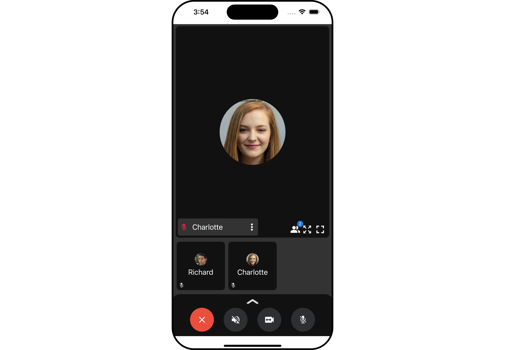
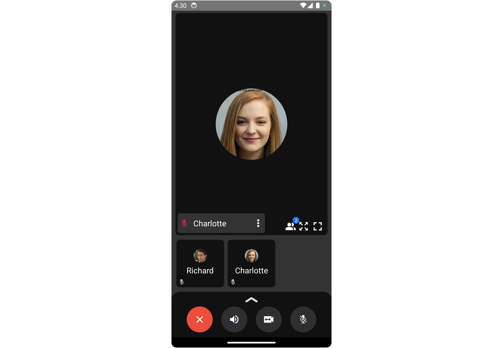
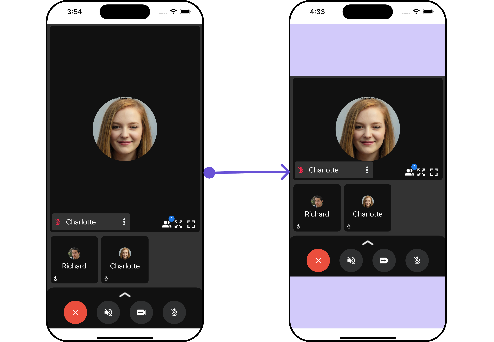
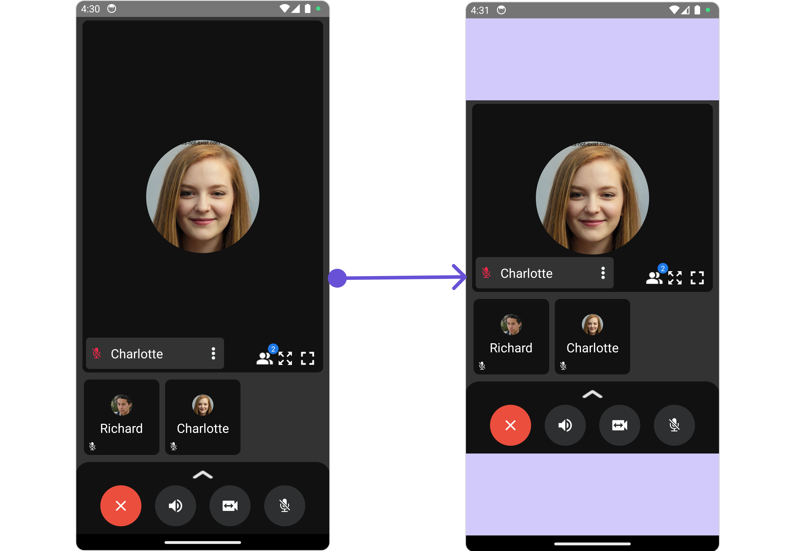

import Tabs from '@theme/Tabs';
import TabItem from '@theme/TabItem';

## Overview

The `Ongoing Call` is a [Component](/ui-kit/react-native/components-overview#components) that provides users with a dedicated interface for managing real-time voice or video conversations. It includes features like a video display area for video calls, call controls for mic and camera management, participant information, call status indicators, and options for call recording and screen-sharing.

<Tabs>

<TabItem value="iOS" label="iOS">



</TabItem>

<TabItem value="android" label="Android">



</TabItem>

</Tabs>

The `Ongoing Call` is comprised of the following components:

| Components                   | Description                                                                                                                                              |
| ---------------------------- | -------------------------------------------------------------------------------------------------------------------------------------------------------- |
| cometchat-callscreen-wrapper | this component manages the interface for CometChat's call functionality, facilitating structured display and management of ongoing voice or video calls. |

## Usage

### Integration

<Tabs>
<TabItem value="typescript" label="App.tsx">

```tsx
import { CometChat, CometChatCalls } from "@cometchat/chat-sdk-react-native";
import { CometChatOngoingCall } from "@cometchat/chat-uikit-react-native";

function App(): React.JSX.Element {
  const [loggedInUser, setLoggedInUser] = useState<CometChat.User>();
  useEffect(() => {
    //code
    CometChatUIKit.login({ uid: "uid" })
      .then(async (user: CometChat.User) => {
        setLoggedInUser(user);
      })
      .catch((error: any) => {
        //handle error
      });
  });

  const callSettingsBuilder = new CometChatCalls.CallSettingsBuilder();

  return (
    <>
      {loggedInUser && (
        <CometChatOngoingCall
          sessionID={"session_id"}
          callSettingsBuilder={callSettingsBuilder}
        />
      )}
    </>
  );
}
```

</TabItem>
</Tabs>

### Actions

[Actions](/ui-kit/react-native/components-overview#actions) dictate how a component functions. They are divided into two types: Predefined and User-defined. You can override either type, allowing you to tailor the behavior of the component to fit your specific needs.

##### 1. onError

This action doesn't change the behavior of the component but rather listens for any errors that occur in the Banned Members component.

<Tabs>
<TabItem value="typescript" label="App.tsx">

```tsx
import { CometChat, CometChatCalls } from "@cometchat/chat-sdk-react-native";
import { CometChatOngoingCall } from "@cometchat/chat-uikit-react-native";

function App(): React.JSX.Element {
  const [loggedInUser, setLoggedInUser] = useState<CometChat.User>();
  useEffect(() => {
    //code
    CometChatUIKit.login({ uid: "uid" })
      .then(async (user: CometChat.User) => {
        setLoggedInUser(user);
      })
      .catch((error: any) => {
        //handle error
      });
  });

  const callSettingsBuilder = new CometChatCalls.CallSettingsBuilder()
    .setIsAudioOnlyCall(true)
    .showRecordingButton(true);

  const onErrorHandler = (error: CometChat.CometChatException) => {
    //code
  };

  return (
    <>
      {loggedInUser && (
        <CometChatOngoingCall
          sessionID={"session_id"}
          callSettingsBuilder={callSettingsBuilder}
          onError={onErrorHandler}
        />
      )}
    </>
  );
}
```

</TabItem>
</Tabs>

---

### Filters

**Filters** allow you to customize the data displayed in a list within a `Component`. You can filter the list based on your specific criteria, allowing for a more customized. Filters can be applied using `RequestBuilders` of Chat SDK.

You can adjust the `callSettingsBuilder` in the `OnGoing Call` Component to customize the OnGoing Call. Numerous options are available to alter the builder to meet your specific needs. For additional details on `CallSettingsBuilder`, please visit [CallSettingsBuilder](/sdk/javascript/direct-call).

In the example below, we are applying a filter to the outgoing call to display only audio calls and include a recording button.

<Tabs>
<TabItem value="typescript" label="App.tsx">

```tsx
import { CometChat, CometChatCalls } from "@cometchat/chat-sdk-react-native";
import { CometChatOngoingCall } from "@cometchat/chat-uikit-react-native";

function App(): React.JSX.Element {
  const [loggedInUser, setLoggedInUser] = useState<CometChat.User>();
  useEffect(() => {
    //code
    CometChatUIKit.login({ uid: "uid" })
      .then(async (user: CometChat.User) => {
        setLoggedInUser(user);
      })
      .catch((error: any) => {
        //handle error
      });
  });

  const callSettingsBuilder = new CometChatCalls.CallSettingsBuilder()
    .setIsAudioOnlyCall(true)
    .showRecordingButton(true);

  return (
    <>
      {loggedInUser && (
        <CometChatOngoingCall
          sessionID={"session_id"}
          callSettingsBuilder={callSettingsBuilder}
        />
      )}
    </>
  );
}
```

</TabItem>
</Tabs>

---

### Events

[Events](/ui-kit/react-native/components-overview#events) are emitted by a Component. By using event you can extend existing functionality. Being global events, they can be applied in Multiple Locations and are capable of being Added or Removed.

The OngoingCall does not produce any events but its component does.

---

## Customization

To fit your app's design requirements, you can customize the appearance of the Ongoing Call component. We provide exposed methods that allow you to modify the experience and behavior according to your specific needs.

### Style

Using Style you can customize the look and feel of the component in your app, These parameters typically control elements such as the color, size, shape, and fonts used within the component.

##### 1. OngoingCall Style

To customize the appearance, you can assign a `CallscreenStyle` object to the `Ongoing Call` component.

<Tabs>

<TabItem value="iOS" label="iOS">



</TabItem>

<TabItem value="android" label="Android">



</TabItem>

</Tabs>

In this example, we are employing the `ongoingCallStyle`.

<Tabs>
<TabItem value="typescript" label="App.tsx">

```tsx
import { CometChat, CometChatCalls } from "@cometchat/chat-sdk-react-native";
import {
  CometChatOngoingCall,
  OngoingCallStyleInterface,
} from "@cometchat/chat-uikit-react-native";

function App(): React.JSX.Element {
  const [loggedInUser, setLoggedInUser] = useState<CometChat.User>();
  useEffect(() => {
    //code
    CometChatUIKit.login({ uid: "uid" })
      .then(async (user: CometChat.User) => {
        setLoggedInUser(user);
      })
      .catch((error: any) => {
        //handle error
      });
  });

  const callSettingsBuilder = new CometChatCalls.CallSettingsBuilder()
    .setIsAudioOnlyCall(true)
    .showRecordingButton(true);

  const ongoingCallStyle: OngoingCallStyleInterface = {
    minWidth: 300,
    minHeight: 400,
    maxWidth: 400,
    maxHeight: 500,
  };

  return (
    <>
      {loggedInUser && (
        <CometChatOngoingCall
          sessionID={"session_id"}
          callSettingsBuilder={callSettingsBuilder}
          ongoingCallStyle={ongoingCallStyle}
        />
      )}
    </>
  );
}
```

</TabItem>
</Tabs>

The following properties are exposed by CallscreenStyle:

| Property      | Description                | Code                  |
| ------------- | -------------------------- | --------------------- |
| **maxHeight** | Used to set maximum height | `maxHeight?: number,` |
| **maxWidth**  | Used to set maximum width  | `maxWidth?: number;`  |
| **minHeight** | Used to set minimum height | `minHeight?: number;` |
| **minWidth**  | Used to set minimum width  | `minWidth?: number;`  |

---

### Functionality

These are a set of small functional customizations that allow you to fine-tune the overall experience of the component. With these, you can change text, set custom icons, and toggle the visibility of UI elements.

Here is a code snippet demonstrating how you can customize the functionality of the `Ongoing Call` component.

<Tabs>
<TabItem value="typescript" label="App.tsx">

```tsx
import { CometChat, CometChatCalls } from "@cometchat/chat-sdk-react-native";
import { CometChatOngoingCall } from "@cometchat/chat-uikit-react-native";

function App(): React.JSX.Element {
  const [loggedInUser, setLoggedInUser] = useState<CometChat.User>();
  useEffect(() => {
    //code
    CometChatUIKit.login({ uid: "uid" })
      .then(async (user: CometChat.User) => {
        setLoggedInUser(user);
      })
      .catch((error: any) => {
        //handle error
      });
  });

  const callSettingsBuilder = new CometChatCalls.CallSettingsBuilder()
    .setIsAudioOnlyCall(true)
    .showRecordingButton(true);

  return (
    <>
      {loggedInUser && (
        <CometChatOngoingCall
          sessionID={"session_id"}
          callSettingsBuilder={callSettingsBuilder}
        />
      )}
    </>
  );
}
```

</TabItem>
</Tabs>

Below is a list of customizations along with corresponding code snippets

| Property      | Description                         | Code                 |
| ------------- | ----------------------------------- | -------------------- |
| **sessionID** | Used to set session Id for the call | `sessionID?: string` |

---

### Advanced

For advanced-level customization, you can set custom views to the component. This lets you tailor each aspect of the component to fit your exact needs and application aesthetics. You can create and define your views, layouts, and UI elements and then incorporate those into the component.

the `OnGoingCall` component does not offer any advanced functionalities beyond this level of customization.

---
