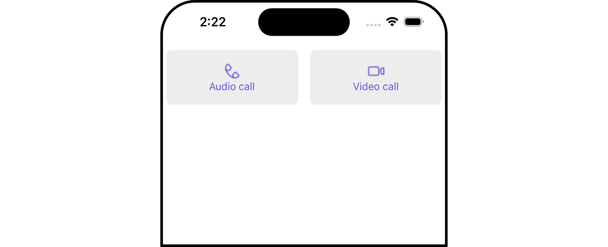
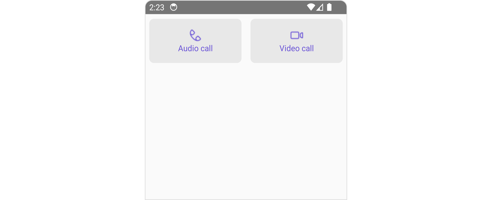
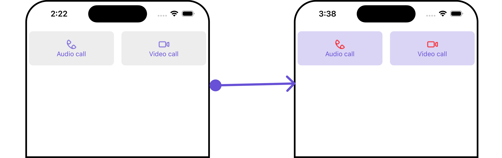
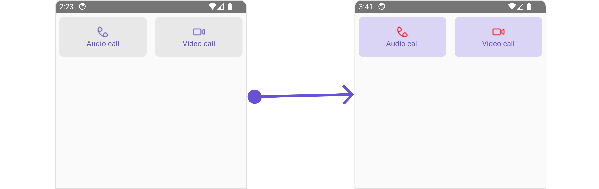
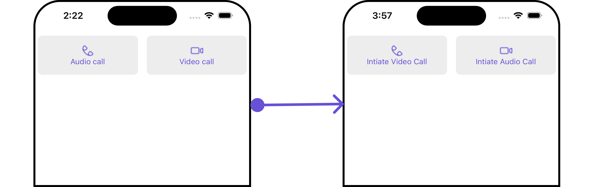
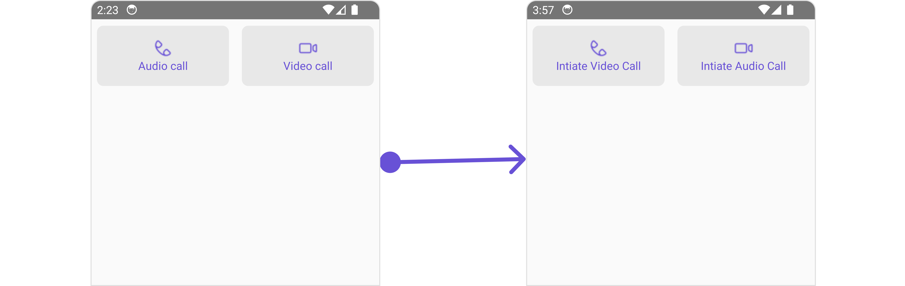

import Tabs from '@theme/Tabs';
import TabItem from '@theme/TabItem';

## Overview

The `Call Button` is a [Component](/ui-kit/react-native/components-overview#components) provides users with the ability to make calls, access call-related functionalities, and control call settings. Clicking this button typically triggers the call to be placed to the desired recipient.

<Tabs>

<TabItem value="iOS" label="iOS">



</TabItem>

<TabItem value="android" label="Android">



</TabItem>

</Tabs>

## Usage

### Integration

<Tabs>
<TabItem value="typescript" label="App.tsx">

```tsx
import {CometChat} from '@cometchat/chat-sdk-react-native';
import { CometChatCallButtons } from '@cometchat/chat-uikit-react-native';

function App(): React.JSX.Element {

	const [user, setUser] = useState<CometChat.User | undefined>(undefined);

    const getUser = async () => {
       const user = await CometChat.getUser('uid');
       setUser(user);
    };

	useEffect(() => {
	   //login
       getUser();
    }, []);


   return (
	 { user &&
	   <CometChatCallButtons
          user={user}
 	   />
	 }
   );
 }
```

</TabItem>
</Tabs>

### Actions

[Actions](/ui-kit/react-native/components-overview#actions) dictate how a component functions. They are divided into two types: Predefined and User-defined. You can override either type, allowing you to tailor the behavior of the component to fit your specific needs.

##### 1. onVoiceCallPress

`onVoiceCallPress` is triggered when you click the voice call button of the `Call Buttons` component. You can override this action using the following code snippet.

<Tabs>
<TabItem value="typescript" label="App.tsx">

```tsx
import {CometChat} from '@cometchat/chat-sdk-react-native';
import { CometChatCallButtons } from '@cometchat/chat-uikit-react-native';

function App(): React.JSX.Element {

	const [user, setUser] = useState<CometChat.User | undefined>(undefined);

    const getUser = async () => {
       const user = await CometChat.getUser('uid');
       setUser(user);
    };

	useEffect(() => {
	   //login
       getUser();
    }, []);

	const onVoiceCallPressHandler  = ({user, group}: {user?: CometChat.User | undefined,
      group?: CometChat.Group | undefined }
    ) => {
       //code
    }


   return (
	 { user &&
	   <CometChatCallButtons
          user={user}
		  onVoiceCallPress={onVoiceCallPressHandler}
 	   />
	 }
   );
 }
```

</TabItem>
</Tabs>

##### 2. onVideoCallClick

`onVideoCallClick` is triggered when you click the video call button of the `Call Buttons` component. You can override this action using the following code snippet.

<Tabs>
<TabItem value="typescript" label="App.tsx">

```tsx
import {CometChat} from '@cometchat/chat-sdk-react-native';
import { CometChatCallButtons } from '@cometchat/chat-uikit-react-native';

function App(): React.JSX.Element {

	const [user, setUser] = useState<CometChat.User | undefined>(undefined);

    const getUser = async () => {
       const user = await CometChat.getUser('uid');
       setUser(user);
    };

	useEffect(() => {
	   //login
       getUser();
    }, []);

    const onVideoCallPressHandler  = ({user, group}: {user?: CometChat.User | undefined,
      group?: CometChat.Group | undefined }
    ) => {
       //code
    }


   return (
	 { user &&
	   <CometChatCallButtons
          user={user}
		  onVideoCallPress={onVideoCallPressHandler}
 	   />
	 }
   );
 }
```

</TabItem>
</Tabs>

##### 3. onError

This action doesn't change the behavior of the component but rather listens for any errors that occur in the Call Button component.

<Tabs>
<TabItem value="typescript" label="App.tsx">

```tsx
import {CometChat} from '@cometchat/chat-sdk-react-native';
import { CometChatCallButtons } from '@cometchat/chat-uikit-react-native';

function App(): React.JSX.Element {

	const [user, setUser] = useState<CometChat.User | undefined>(undefined);

    const getUser = async () => {
       const user = await CometChat.getUser('uid');
       setUser(user);
    };

	useEffect(() => {
	   //login
       getUser();
    }, []);

    const onErrorHandler = (error: CometChat.CometChatException) => {
      //code
    }


   return (
	 { user &&
	   <CometChatCallButtons
          user={user}
		  onError={onErrorHandler}
 	   />
	 }
   );
 }
```

</TabItem>
</Tabs>

---

### Filters

**Filters** allow you to customize the data displayed in a list within a `Component`. You can filter the list based on your specific criteria, allowing for a more customized. Filters can be applied using `RequestBuilders` of Chat SDK.

The `Call Buttons` component does not have any exposed filters.

---

### Events

[Events](/ui-kit/react-native/components-overview#events) are emitted by a `Component`. By using event you can extend existing functionality. Being global events, they can be applied in Multiple Locations and are capable of being Added or Removed.

The list of events emitted by the `Call Buttons` component is as follows.

| Event              | Description                                                                  |
| ------------------ | ---------------------------------------------------------------------------- |
| **ccCallRejected** | This event is triggered when the initiated call is rejected by the receiver. |
| **ccCallFailled**  | This event is triggered when an error occurs during the intiated call.       |
| **ccOutgoingCall** | This event is triggered when the user initiates a voice/video call.          |

<Tabs>
<TabItem value="js" label="Adding Listeners">

```js
import { CometChatUIEventHandler } from "@cometchat/chat-uikit-react-native";

CometChatUIEventHandler.addCallListener("CALL_LISTENER_ID", {
  ccCallRejected: ({ call }) => {
    //code
  },
});

CometChatUIEventHandler.addCallListener("CALL_LISTENER_ID", {
  ccOutgoingCall: ({ call }) => {
    //code
  },
});

CometChatUIEventHandler.addCallListener("CALL_LISTENER_ID", {
  ccCallFailled: ({ call }) => {
    //code
  },
});
```

</TabItem>

</Tabs>

---

<Tabs>
<TabItem value="js" label="Removing Listeners">

```js
import { CometChatUIEventHandler } from "@cometchat/chat-uikit-react-native";

CometChatUIEventHandler.removeCallListener("CALL_LISTENER_ID");
```

</TabItem>
</Tabs>

## Customization

To fit your app's design requirements, you can customize the appearance of the Call Buttons component. We provide exposed methods that allow you to modify the experience and behavior according to your specific needs.

### Style

Using Style you can customize the look and feel of the component in your app, These parameters typically control elements such as the color, size, shape, and fonts used within the component.

##### 1. CallButtons Style

To customize the appearance, you can assign a `CallButtonsStyle` object to the `Call Buttons` component.

<Tabs>

<TabItem value="iOS" label="iOS">



</TabItem>

<TabItem value="android" label="Android">



</TabItem>

</Tabs>

In this example, we are employing the `callButtonsStyle`.

<Tabs>
<TabItem value="typescript" label="App.tsx">

```tsx
import {CometChat} from '@cometchat/chat-sdk-react-native';
import { CometChatCallButtons, CallButtonStyleInterface } from '@cometchat/chat-uikit-react-native';

function App(): React.JSX.Element {

	const [user, setUser] = useState<CometChat.User | undefined>(undefined);

    const getUser = async () => {
       const user = await CometChat.getUser('uid');
       setUser(user);
    };

	useEffect(() => {
	   //login
       getUser();
    }, []);

   const callButtonsStyle : CallButtonStyleInterface = {
       videoCallIconTint: "red",
       voiceCallIconTint: "red",
       backgroundColor: "#dad5f5",
   }

   return (
	 { user &&
	   <CometChatCallButtons
          user={user}
		  callButtonStyle={callButtonsStyle}
 	   />
	 }
   );
 }
```

</TabItem>
</Tabs>
---

The following properties are exposed by `CallButtonsStyle`:

| Property              | Description                           | Code                               |
| --------------------- | ------------------------------------- | ---------------------------------- |
| **border**            | Used to set border                    | `border?: BorderStyleInterface,`   |
| **borderRadius**      | Used to set border radius             | `borderRadius?: number;`           |
| **backgroundColor**   | Used to set background colour         | `background?: string;`             |
| **height**            | Used to set height                    | `height?: number` &#124; `string;` |
| **width**             | Used to set width                     | `width?: number` &#124; `string;`  |
| **voiceCallIconTint** | Used to set voice call icon tint      | `voiceCallIconTint?: string,`      |
| **videoCallIconTint** | Used to set video call icon tint      | `videoCallIconTint?: string;`      |
| **buttonPadding**     | Used to set voice call icon text font | `buttonPadding?: number;`          |

---

### Functionality

These are a set of small functional customizations that allow you to fine-tune the overall experience of the component. With these, you can change text, set custom icons, and toggle the visibility of UI elements.

<Tabs>

<TabItem value="iOS" label="iOS">



</TabItem>

<TabItem value="android" label="Android">



</TabItem>

</Tabs>

Here is a code snippet demonstrating how you can customize the functionality of the `Call Buttons` component.

<Tabs>
<TabItem value="typescript" label="App.tsx">

```tsx
import {CometChat} from '@cometchat/chat-sdk-react-native';
import { CometChatCallButtons } from '@cometchat/chat-uikit-react-native';

function App(): React.JSX.Element {

	const [user, setUser] = useState<CometChat.User | undefined>(undefined);

    const getUser = async () => {
       const user = await CometChat.getUser('uid');
       setUser(user);
    };

	useEffect(() => {
	   //login
       getUser();
    }, []);

   return (
	 { user &&
	   <CometChatCallButtons
          user={user}
          voiceCallIconText='Intiate Video Call'
          videoCallIconText='Intiate Audio Call'
 	   />
	 }
   );
 }
```

</TabItem>
</Tabs>

Below is a list of customizations along with corresponding code snippets

| Property                   | Description                                                                              | Code                                                              |
| -------------------------- | ---------------------------------------------------------------------------------------- | ----------------------------------------------------------------- |
| **group**                  | Used to set the group object for Call Buttons                                            | `group?: CometChat.Group`                                         |
| **user**                   | Sets the user object for Call Buttons                                                    | `user?: CometChat.User`                                           |
| **videoCallIconHoverText** | Used to set the custom text or tooltip displayed on the video call button on mouse over. | `videoCallIconHoverText='Your Custom Video Call Icon Hover Text'` |
| **voiceCallIconHoverText** | Used to set the custom text or tooltip displayed on the voice call button on mouse over. | `voiceCallIconHoverText='Your Custom Voice Call Icon Hover text'` |
| **voiceCallIconText**      | Used to set custom voice call icon text                                                  | `voiceCallIconText?: string`                                      |
| **videoCallIconText**      | Used to set custom video call icon text                                                  | `videoCallIconText?: string`                                      |
| **voiceCallIconImage**     | Used to set custom Icon for Video Call Button                                            | `voiceCallIconImage?: ImageType`                                  |
| **videoCallIconImage**     | Used to set custom Icon for Voice Call Button                                            | `videoCallIconImage?: ImageType`                                  |
| **hideVoiceCall**          | Used to hide Voice Call                                                                  | `hideVoiceCall?: boolean                                          |
| **hideVideoCall**          | Used to hide Video Call                                                                  | `hideVideoCall?: boolean                                          |

---

### Advanced

For advanced-level customization, you can set custom views to the component. This lets you tailor each aspect of the component to fit your exact needs and application aesthetics. You can create and define your views, layouts, and UI elements and then incorporate those into the component.

the `Call Buttons` component does not offer any advanced functionalities beyond this level of customization.

---
