import Tabs from '@theme/Tabs';
import TabItem from '@theme/TabItem';

## Overview

`CometChatCallLogs` is a [Component](/ui-kit/react-native/components-overview#components) that shows the list of Call Log available . By default, names are shown for all listed users, along with their avatar if available.

<Tabs>

<TabItem value="iOS" label="iOS">

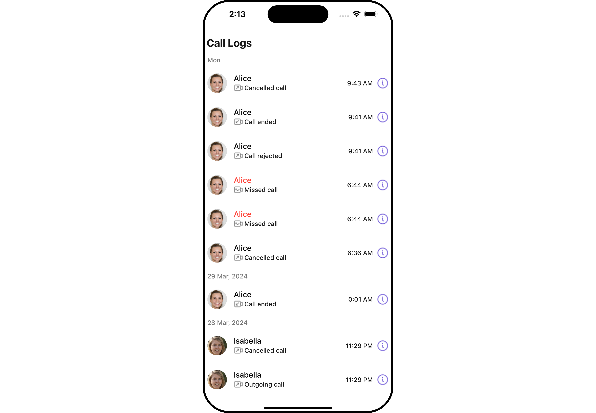

</TabItem>

<TabItem value="android" label="Android">

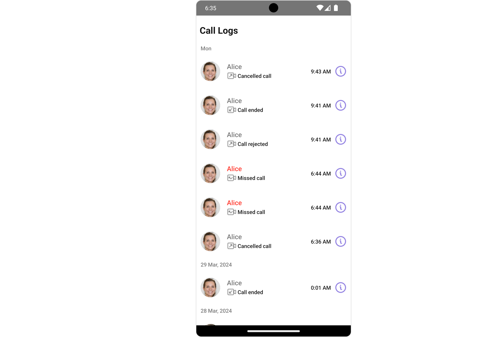

</TabItem>

</Tabs>

The `Call Log` is comprised of the following components:

| Components                       | Description                                                                                                                 |
| -------------------------------- | --------------------------------------------------------------------------------------------------------------------------- |
| [CometChatListItem](./list-item) | a component that renders data obtained from a Group object on a Tile having a title, subtitle, leading and trailing view    |
| [CometChatDate](./date)          | This Component used to show the date and time. You can also customize the appearance of this widget by modifying its logic. |
| cometchat-button                 | This component represents a button with optional icon and text.                                                             |

## Usage

### Integration

<Tabs>
<TabItem value="typescript" label="App.tsx">

```tsx
import { CometChat, CometChatCalls } from "@cometchat/chat-sdk-react-native";
import { CometChatCallLogs } from "@cometchat/chat-uikit-react-native";

function App(): React.JSX.Element {
  const [loggedInUser, setLoggedInUser] = useState<CometChat.User>();
  useEffect(() => {
    //code
    CometChatUIKit.login({ uid: "uid" })
      .then(async (user: CometChat.User) => {
        setLoggedInUser(user);
      })
      .catch((error: any) => {
        //handle error
      });
  }, []);

  const datePattern: DatePattern = "timeFormat";
  const dateSeparatorPattern: DatePattern = "dayDateFormat";

  return (
    <>
      {loggedInUser && (
        <CometChatCallLogs
          datePattern={datePattern}
          dateSeparatorPattern={dateSeparatorPattern}
        />
      )}
    </>
  );
}
```

</TabItem>
</Tabs>

### Actions

[Actions](/ui-kit/react-native/components-overview#actions) dictate how a component functions. They are divided into two types: Predefined and User-defined. You can override either type, allowing you to tailor the behavior of the component to fit your specific needs.

##### 1. onItemPress

`onItemPress` is triggered when you click on a ListItem of the Call Logs component. By default it initiate a call to the participant associated with the respective ListItem. You can override this action using the following code snippet.

<Tabs>
<TabItem value="typescript" label="App.tsx">

```tsx
import { CometChat, CometChatCalls } from "@cometchat/chat-sdk-react-native";
import { CometChatCallLogs } from "@cometchat/chat-uikit-react-native";

function App(): React.JSX.Element {
  const [loggedInUser, setLoggedInUser] = useState<CometChat.User>();
  useEffect(() => {
    //code
    CometChatUIKit.login({ uid: "uid" })
      .then(async (user: CometChat.User) => {
        setLoggedInUser(user);
      })
      .catch((error: any) => {
        //handle error
      });
  }, []);

  const datePattern: DatePattern = "timeFormat";
  const dateSeparatorPattern: DatePattern = "dayDateFormat";

  const onItemPressHandler = () => {
    //code
  };

  return (
    <>
      {loggedInUser && (
        <CometChatCallLogs
          datePattern={datePattern}
          dateSeparatorPattern={dateSeparatorPattern}
          onItemPress={onItemPressHandler}
        />
      )}
    </>
  );
}
```

</TabItem>
</Tabs>

##### 2. onInfoIconPress

`onInfoIconPress` is triggered when you click the Info button Icon of the `Call Logs` component. It does not have a default behavior. However, you can override its behavior using the following code snippet.

<Tabs>
<TabItem value="typescript" label="App.tsx">

```tsx
import { CometChat, CometChatCalls } from "@cometchat/chat-sdk-react-native";
import { CometChatCallLogs } from "@cometchat/chat-uikit-react-native";

function App(): React.JSX.Element {
  const [loggedInUser, setLoggedInUser] = useState<CometChat.User>();
  useEffect(() => {
    //code
    CometChatUIKit.login({ uid: "uid" })
      .then(async (user: CometChat.User) => {
        setLoggedInUser(user);
      })
      .catch((error: any) => {
        //handle error
      });
  }, []);

  const datePattern: DatePattern = "timeFormat";
  const dateSeparatorPattern: DatePattern = "dayDateFormat";

  const onInfoIconPressHandler = ({
    call,
  }: {
    call: CometChat.BaseMessage;
  }) => {
    //code
  };

  return (
    <>
      {loggedInUser && (
        <CometChatCallLogs
          datePattern={datePattern}
          dateSeparatorPattern={dateSeparatorPattern}
          onInfoIconPress={onInfoIconPressHandler}
        />
      )}
    </>
  );
}
```

</TabItem>
</Tabs>

##### 3. onError

This action doesn't change the behavior of the component but rather listens for any errors that occur in the Call Logs component.

<Tabs>
<TabItem value="typescript" label="App.tsx">

```tsx
import { CometChat, CometChatCalls } from "@cometchat/chat-sdk-react-native";
import { CometChatCallLogs } from "@cometchat/chat-uikit-react-native";

function App(): React.JSX.Element {
  const [loggedInUser, setLoggedInUser] = useState<CometChat.User>();
  useEffect(() => {
    //code
    CometChatUIKit.login({ uid: "uid" })
      .then(async (user: CometChat.User) => {
        setLoggedInUser(user);
      })
      .catch((error: any) => {
        //handle error
      });
  }, []);

  const datePattern: DatePattern = "timeFormat";
  const dateSeparatorPattern: DatePattern = "dayDateFormat";

  const onErrorHandler = (error: CometChat.CometChatException) => {
    //code
  };

  return (
    <>
      {loggedInUser && (
        <CometChatCallLogs
          datePattern={datePattern}
          dateSeparatorPattern={dateSeparatorPattern}
          onError={onErrorHandler}
        />
      )}
    </>
  );
}
```

</TabItem>
</Tabs>

---

### Filters

**Filters** allow you to customize the data displayed in a list within a `Component`. You can filter the list based on your specific criteria, allowing for a more customized. Filters can be applied using `RequestBuilders` of Chat SDK.

##### 1. CallLogRequestBuilder

The [CallLogRequestBuilder](/sdk/react-native/call-logs) enables you to filter and customize the Call Log based on available parameters in [CallLogRequestBuilder](/sdk/react-native/call-logs). This feature allows you to create more specific and targeted queries when fetching the call logs. The following are the parameters available in [CallLogRequestBuilder](/sdk/react-native/call-logs)

| Methods              | Type       | Description                                                  |
| -------------------- | ---------- | ------------------------------------------------------------ |
| **setLimit**         | number     | Specifies the number of call logs to fetch.                  |
| **setCallType**      | String     | Sets the type of calls to fetch (call or meet).              |
| **setCallStatus**    | callStatus | Sets the status of calls to fetch (initiated, ongoing, etc.) |
| **setHasRecording**  | boolean    | Sets whether to fetch calls that have recordings.            |
| **setCallCategory**  | string     | Sets the category of calls to fetch (call or meet).          |
| **setCallDirection** | string     | Sets the direction of calls to fetch (incoming or outgoing)  |
| **setUid**           | string     | Sets the UID of the user whose call logs to fetch.           |
| **setGuid**          | string     | Sets the GUID of the user whose call logs to fetch.          |
| **setAuthToken**     | string     | Sets the Auth token of the logged-in user.                   |

**Example**

In the example below, we're filtering Call Logs to show only canceled calls and setting the limit to five.

<Tabs>
<TabItem value="typescript" label="App.tsx">

```tsx
import {
  CometChat,
  CometChatCalls,
  CallLogRequestBuilder,
} from "@cometchat/chat-sdk-react-native";
import { CometChatCallLogs } from "@cometchat/chat-uikit-react-native";

function App(): React.JSX.Element {
  const [loggedInUser, setLoggedInUser] = useState<CometChat.User>();
  useEffect(() => {
    //code
    CometChatUIKit.login({ uid: "uid" })
      .then(async (user: CometChat.User) => {
        setLoggedInUser(user);
      })
      .catch((error: any) => {
        //handle error
      });
  }, []);

  const datePattern: DatePattern = "timeFormat";
  const dateSeparatorPattern: DatePattern = "dayDateFormat";

  return (
    <>
      {loggedInUser && (
        <CometChatCallLogs
          datePattern={datePattern}
          dateSeparatorPattern={dateSeparatorPattern}
          callRequestBuilder={new CallLogRequestBuilder()
            .setLimit(5)
            .setCallStatus("cancelled")
            .setAuthToken(loggedInUser.getAuthToken())}
        />
      )}
    </>
  );
}
```

</TabItem>
</Tabs>

---

### Events

[Events](/ui-kit/react-native/components-overview#events) are emitted by a `Component`. By using event you can extend existing functionality. Being global events, they can be applied in Multiple Locations and are capable of being Added or Removed.

The list of events emitted by the Call Logs component is as follows.

| Event              | Description                                                                  |
| ------------------ | ---------------------------------------------------------------------------- |
| **ccCallRejected** | This event is triggered when the initiated call is rejected by the receiver. |
| **ccCallFailled**  | This event is triggered when an error occurs during the intiated call.       |
| **ccOutgoingCall** | This event is triggered when the user initiates a voice/video call.          |

<Tabs>
<TabItem value="js" label="Adding Listeners">

```js
import { CometChatUIEventHandler } from "@cometchat/chat-uikit-react-native";

CometChatUIEventHandler.addCallListener("CALL_LISTENER_ID", {
  ccCallRejected: ({ call }) => {
    //code
  },
});

CometChatUIEventHandler.addCallListener("CALL_LISTENER_ID", {
  ccOutgoingCall: ({ call }) => {
    //code
  },
});

CometChatUIEventHandler.addCallListener("CALL_LISTENER_ID", {
  ccCallFailled: ({ call }) => {
    //code
  },
});
```

</TabItem>

</Tabs>

---

<Tabs>
<TabItem value="js" label="Removing Listeners">

```js
import { CometChatUIEventHandler } from "@cometchat/chat-uikit-react-native";

CometChatUIEventHandler.removeCallListener("CALL_LISTENER_ID");
```

</TabItem>
</Tabs>

---

## Customization

To fit your app's design requirements, you can customize the appearance of the Call Logs component. We provide exposed methods that allow you to modify the experience and behavior according to your specific needs.

### Style

Using Style you can customize the look and feel of the component in your app, These parameters typically control elements such as the color, size, shape, and fonts used within the component.

##### 1. CallLogs Style

To customize the appearance, you can assign a `CallLogsStyle` object to the `Call Logs` component.

<Tabs>

<TabItem value="iOS" label="iOS">

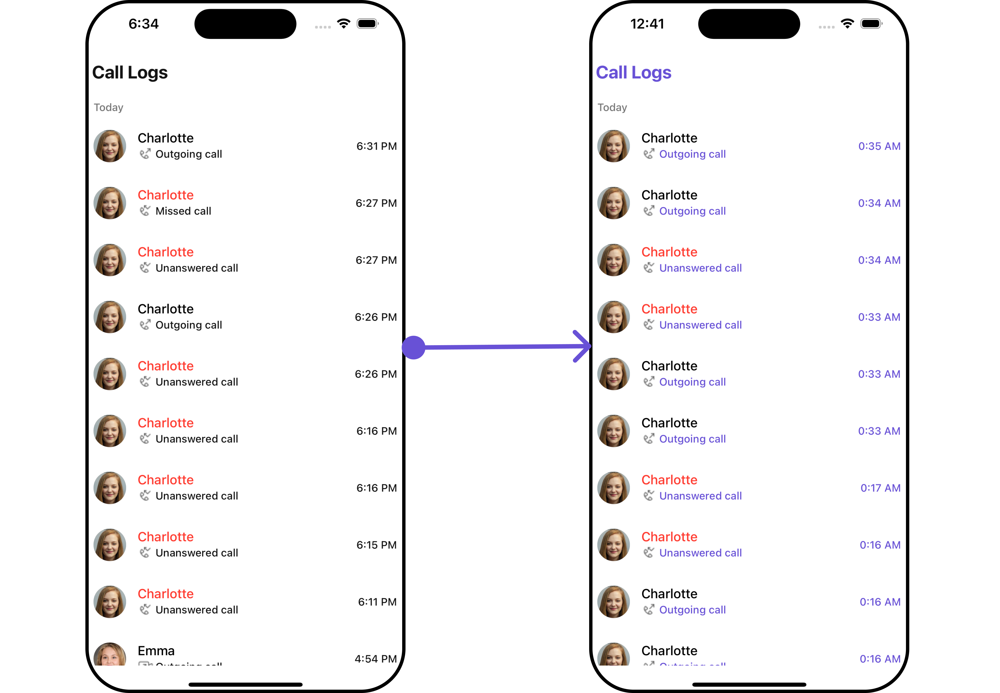

</TabItem>

<TabItem value="android" label="Android">

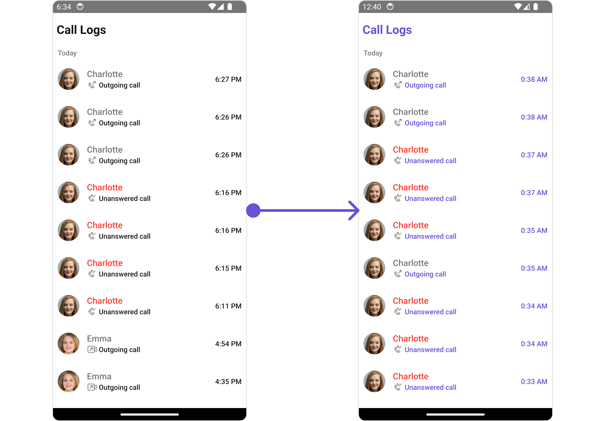

</TabItem>

</Tabs>

In this example, we are employing the `callLogsStyle`.

<Tabs>
<TabItem value="typescript" label="App.tsx">

```tsx
import {
  CometChat,
  CometChatCalls,
  CallLogRequestBuilder,
} from "@cometchat/chat-sdk-react-native";
import {
  CometChatCallLogs,
  CallLogsStyleInterface,
} from "@cometchat/chat-uikit-react-native";

function App(): React.JSX.Element {
  const [loggedInUser, setLoggedInUser] = useState<CometChat.User>();
  useEffect(() => {
    //code
    CometChatUIKit.login({ uid: "uid" })
      .then(async (user: CometChat.User) => {
        setLoggedInUser(user);
      })
      .catch((error: any) => {
        //handle error
      });
  }, []);

  const datePattern: DatePattern = "timeFormat";
  const dateSeparatorPattern: DatePattern = "dayDateFormat";

  const callLogsStyle: CallLogsStyleInterface = {
    titleColor: "#6851D6",
    subtitleTextColor: "#6851D6",
    dateTextColor: "#6851D6",
  };

  return (
    <>
      {loggedInUser && (
        <CometChatCallLogs
          datePattern={datePattern}
          dateSeparatorPattern={dateSeparatorPattern}
          callLogsStyle={callLogsStyle}
        />
      )}
    </>
  );
}
```

</TabItem>
</Tabs>

---

The following properties are exposed by `CallLogsStyle`:

| Property                   | Description                           | Code                                     |
| -------------------------- | ------------------------------------- | ---------------------------------------- |
| **border**                 | Used to set border                    | `border?: BorderStyleInterface,`         |
| **borderRadius**           | Used to set border radius             | `borderRadius?: number;`                 |
| **backgroundColor**        | Used to set background colour         | `background?: string;`                   |
| **height**                 | Used to set height                    | `height?: number` &#124; `string;`       |
| **width**                  | Used to set width                     | `width?: number` &#124; `string;`        |
| **titleFont**              | Used to set title font                | `titleFont?: FontStyleInterface,`        |
| **titleColor**             | Used to set title color               | `titleColor?: string;`                   |
| **loadingTint**            | Used to set loading icon tint         | `loadingTint?: string;`                  |
| **emptyTextColor**         | Used to set empty state text color    | `emptyTextColor?: string;`               |
| **emptyTextFont**          | Used to set empty state text font     | `emptyTextFont?: FontStyleInterface;`    |
| **errorTextColor**         | Used to set error state text color    | `errorTextColor?: string;`               |
| **errorTextFont**          | Used to set error state text font     | `errorTextFont?: FontStyleInterface;`    |
| **separatorColor**         | Used to set the separator color       | `separatorColor?: string`                |
| **infoIconTint**           | Used to set info icon tint            | `infoIconTint?: string;`                 |
| **missedCallIconTint**     | Used to set missed call icon tint     | `missedCallIconTint?: string;`           |
| **outgoingCallIconTint**   | Used to set outgoing call icon tint   | `outgoingCallIconTint?: string;`         |
| **incomingCallIconTint**   | Used to set incoming call icon tint   | `incomingCallIconTint?: string;`         |
| **subtitleTextColor**      | Used to set the subtitle text color   | `subtitleTextColor?: string;`            |
| **subtitleTextFont**       | Used to set subtitle text font        | `subtitleTextFont?: FontStyleInterface;` |
| **dateTextFont**           | Used to set date text font            | `dateTextFont?: FontStyleInterface;`     |
| **dateTextColor**          | Used to set date text color           | `dateTextColor?: string;`                |
| **dateSeparatorTextFont**  | Used to set date separator text font  | `dateSeparatorTextFont?: string;`        |
| **dateSeparatorTextColor** | Used to set date separator text color | `dateSeparatorTextColor?: string;`       |

##### 2. Avatar Style

If you want to apply customized styles to the `Avatar` component within the `Call Logs` Component, you can use the following code snippet. For more information you can refer [Avatar Styles](/ui-kit/react-native/avatar#avatarstyleinterface).

<Tabs>
<TabItem value="typescript" label="App.tsx">

```tsx
import {
  CometChat,
  CometChatCalls,
  CallLogRequestBuilder,
} from "@cometchat/chat-sdk-react-native";
import {
  CometChatCallLogs,
  BorderStyleInterface,
  AvatarStyleInterface,
} from "@cometchat/chat-uikit-react-native";

function App(): React.JSX.Element {
  const [loggedInUser, setLoggedInUser] = useState<CometChat.User>();
  useEffect(() => {
    //code
    CometChatUIKit.login({ uid: "uid" })
      .then(async (user: CometChat.User) => {
        setLoggedInUser(user);
      })
      .catch((error: any) => {
        //handle error
      });
  }, []);

  const datePattern: DatePattern = "timeFormat";
  const dateSeparatorPattern: DatePattern = "dayDateFormat";

  const borderStyle: BorderStyleInterface = {
    borderWidth: 2,
    borderStyle: "solid",
    borderColor: "#cc5e95",
  };

  const avatarStyle: AvatarStyleInterface = {
    outerViewSpacing: 5,
    outerView: {
      borderWidth: 2,
      borderStyle: "dotted",
      borderColor: "blue",
    },
    border: borderStyle,
  };

  return (
    <>
      {loggedInUser && (
        <CometChatCallLogs
          datePattern={datePattern}
          dateSeparatorPattern={dateSeparatorPattern}
          avatarStyle={avatarStyle}
        />
      )}
    </>
  );
}
```

</TabItem>
</Tabs>

##### 3. ListItem Style

If you want to apply customized styles to the `ListItemStyle` component within the `Call Logs` Component, you can use the following code snippet. For more information, you can refer [ListItem Styles](/ui-kit/react-native/list-item#listitemstyle).

<Tabs>
<TabItem value="typescript" label="App.tsx">

```tsx
import {
  CometChat,
  CometChatCalls,
  CallLogRequestBuilder,
} from "@cometchat/chat-sdk-react-native";
import {
  CometChatCallLogs,
  ListItemStyleInterface,
} from "@cometchat/chat-uikit-react-native";

function App(): React.JSX.Element {
  const [loggedInUser, setLoggedInUser] = useState<CometChat.User>();
  useEffect(() => {
    //code
    CometChatUIKit.login({ uid: "uid" })
      .then(async (user: CometChat.User) => {
        setLoggedInUser(user);
      })
      .catch((error: any) => {
        //handle error
      });
  }, []);

  const datePattern: DatePattern = "timeFormat";
  const dateSeparatorPattern: DatePattern = "dayDateFormat";

  const listItemStyle: ListItemStyleInterface = {
    titleColor: "red",
    backgroundColor: "#d2cafa",
  };

  return (
    <>
      {loggedInUser && (
        <CometChatCallLogs
          datePattern={datePattern}
          dateSeparatorPattern={dateSeparatorPattern}
          listItemStyle={listItemStyle}
          hideSeperator={false}
        />
      )}
    </>
  );
}
```

</TabItem>
</Tabs>

---

### Functionality

These are a set of small functional customizations that allow you to fine-tune the overall experience of the component. With these, you can change text, set custom icons, and toggle the visibility of UI elements.

Here is a code snippet demonstrating how you can customize the functionality of the `Call Logs` component.

<Tabs>
<TabItem value="typescript" label="App.tsx">

```tsx
import {
  CometChat,
  CometChatCalls,
  CallLogRequestBuilder,
} from "@cometchat/chat-sdk-react-native";
import {
  CometChatCallLogs,
  ListItemStyleInterface,
} from "@cometchat/chat-uikit-react-native";

function App(): React.JSX.Element {
  const [loggedInUser, setLoggedInUser] = useState<CometChat.User>();
  useEffect(() => {
    //code
    CometChatUIKit.login({ uid: "uid" })
      .then(async (user: CometChat.User) => {
        setLoggedInUser(user);
      })
      .catch((error: any) => {
        //handle error
      });
  }, []);

  const datePattern: DatePattern = "timeFormat";
  const dateSeparatorPattern: DatePattern = "dayDateFormat";

  const listItemStyle: ListItemStyleInterface = {
    titleColor: "red",
    backgroundColor: "#d2cafa",
  };

  return (
    <>
      {loggedInUser && (
        <CometChatCallLogs
          title="Custom Title"
          datePattern={datePattern}
          dateSeparatorPattern={dateSeparatorPattern}
          hideSeperator={false}
        />
      )}
    </>
  );
}
```

</TabItem>
</Tabs>

Below is a list of customizations along with corresponding code snippets

| Property                     | Description                                 | Code                                 |
| ---------------------------- | ------------------------------------------- | ------------------------------------ |
| **title**                    | Used to set custom title                    | `title?: string`                     |
| **emptyStateText**           | Used to set custom empty state text         | `emptyStateText?: string`            |
| **errorStateText**           | Used to set custom error state text         | `errorStateText?: string`            |
| **datePattern**              | Used to set custom date pattern             | `datePattern?: DatePattern`          |
| **dateSeparatorPattern**     | Used to set custom date separator pattern   | `dateSeparatorPattern?: DatePattern` |
| **infoIcon**                 | Used to set custom info icon                | `infoIcon?: ImageType`               |
| **incomingAudioCallIconUrl** | Used to set custom incoming audio call icon | `incomingAudioCallIconUrl?: string`  |
| **incomingVideoCallIconUrl** | Used to set custom incoming video call icon | `incomingVideoCallIconUrl?: string`  |
| **missedAudioCallIconUrl**   | Used to set custom missed audio call icon   | `missedAudioCallIconUrl?: string`    |
| **missedVideoCallIconUrl**   | Used to set custom missed video call icon   | `missedVideoCallIconUrl?: string`    |
| **outgoingAudioCallIconUrl** | Used to set custom outgoing audio call icon | `outgoingAudioCallIconUrl?: string`  |
| **outgoingVideoCallIconUrl** | Used to set custom outgoing video call icon | `outgoingVideoCallIconUrl?: string`  |
| **hideSeperator**            | Option to hide separator                    | `hideSeperator?: boolean`            |
| **loadingIcon**              | Used to set custom loading icon             | `loadingIcon?: ImageType`            |
| **showBackButton**           | Used to show/hide the back button           | `showBackButto?: boolean`            |
| **BackButton**               | Used to set Custom Back Button              | `BackButton?: JSX.Element`           |
| **hideError**                | Used to hide errors                         | `hideError?: boolean`                |

---

### Advanced

For advanced-level customization, you can set custom views to the component. This lets you tailor each aspect of the component to fit your exact needs and application aesthetics. You can create and define your views, layouts, and UI elements and then incorporate those into the component.

#### ListItemView

With this property, you can assign a custom ListItemViews to the Call Logs Component.

<Tabs>

<TabItem value="iOS" label="iOS">

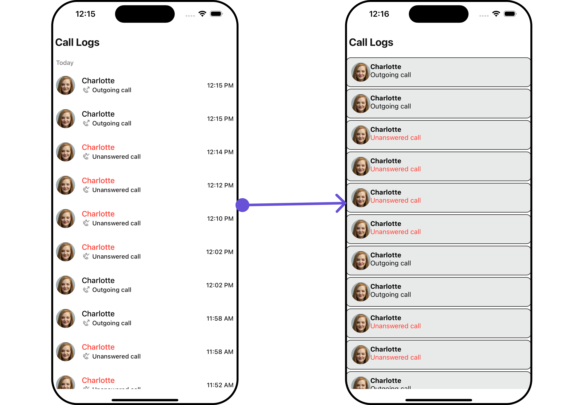

</TabItem>

<TabItem value="android" label="Android">

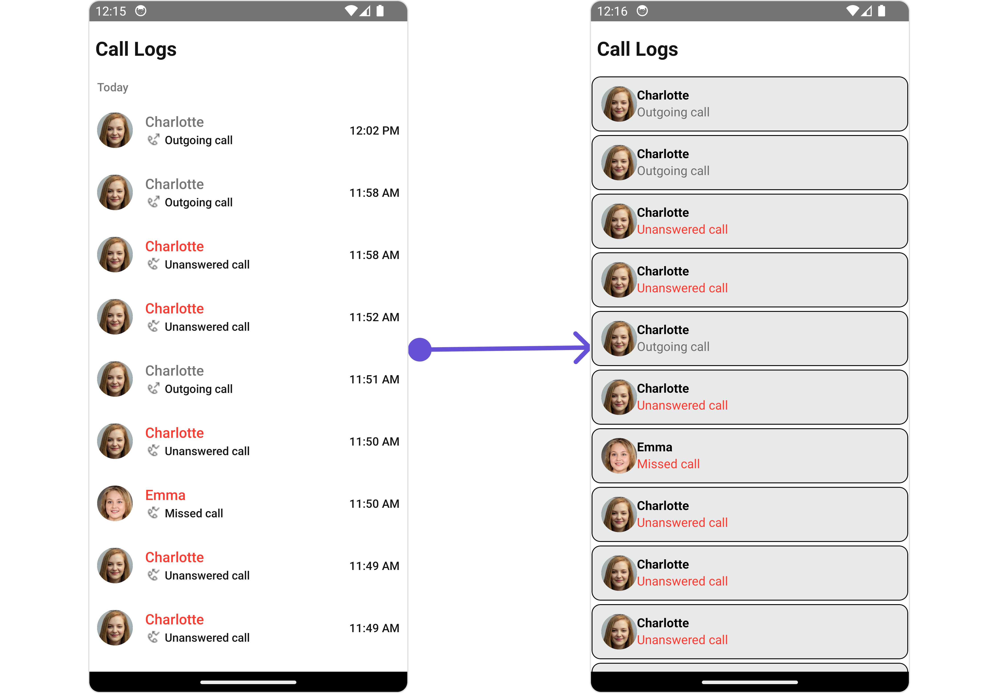

</TabItem>

</Tabs>

<Tabs>
<TabItem value="typescript" label="App.tsx">

```tsx
import { CometChat } from "@cometchat/chat-sdk-react-native";
import {
  CometChatCallLogs,
  CometChatUiKitConstants,
} from "@cometchat/chat-uikit-react-native";
import {
  CallGroup,
  CallLog,
  CallUser,
} from "@cometchat/calls-sdk-react-native";

function App(): React.JSX.Element {
  const [loggedInUser, setLoggedInUser] = useState<CometChat.User>();
  useEffect(() => {
    //code
    CometChatUIKit.login({ uid: "uid" })
      .then(async (user: CometChat.User) => {
        setLoggedInUser(user);
      })
      .catch((error: any) => {
        //handle error
      });
  }, []);

  const datePattern: DatePattern = "timeFormat";
  const dateSeparatorPattern: DatePattern = "dayDateFormat";

  const isInitiator = (
    initiator: CallUser,
    loggedInUser: CometChat.User
  ): boolean => {
    return initiator.getUid() == loggedInUser?.getUid();
  };

  const isMissedCall = (call: CallLog, loggedInUser: CometChat.User) => {
    const callStatus: any = call.getStatus();
    if (isInitiator(call.getInitiator(), loggedInUser)) {
      return callStatus === CometChatUiKitConstants.CALL_UNANSWERED;
    } else {
      return [
        CometChatUiKitConstants.CALL_BUSY,
        CometChatUiKitConstants.CALL_UNANSWERED,
        CometChatUiKitConstants.CALL_REJECTED,
        CometChatUiKitConstants.CALL_CANCELLED,
      ].includes(callStatus);
    }
  };

  const getListItemView = ({ call }: { call?: CallLog }) => {
    if (call) {
      let userOrGroup: CallUser | CallGroup = call.getInitiator();
      if (
        userOrGroup instanceof CallUser &&
        userOrGroup.getUid() == loggedInUser?.getUid()
      ) {
        userOrGroup = call!.getReceiver();
      }
      const name = userOrGroup.getName();
      const image =
        userOrGroup instanceof CallGroup
          ? userOrGroup.getIcon()
          : userOrGroup.getAvatar();
      return (
        <View style={viewStyle}>
          <CometChatAvatar
            image={user!.getAvatar() ? { uri: image } : undefined}
            name={name}
          />

          <View>
            <Text style={{ color: "black", fontWeight: "bold" }}>{name}</Text>
            <Text
              style={{
                color: isMissedCall(call, loggedInUser!)
                  ? theme.palette.getError()
                  : undefined,
              }}
            >
              {CallUtils.getCallStatus(
                call as unknown as CometChat.Call,
                loggedInUser!
              )}
            </Text>
          </View>
        </View>
      );
    } else {
      return <> </>;
    }
  };

  return (
    <>
      {loggedInUser && (
        <CometChatCallLogs
          datePattern={datePattern}
          dateSeparatorPattern={dateSeparatorPattern}
          ListItemView={getListItemView}
        />
      )}
    </>
  );
}
```

</TabItem>
</Tabs>

---

#### SubtitleView

You can customize the `SubtitleView` for each call logs item to meet your requirements

<Tabs>

<TabItem value="iOS" label="iOS">

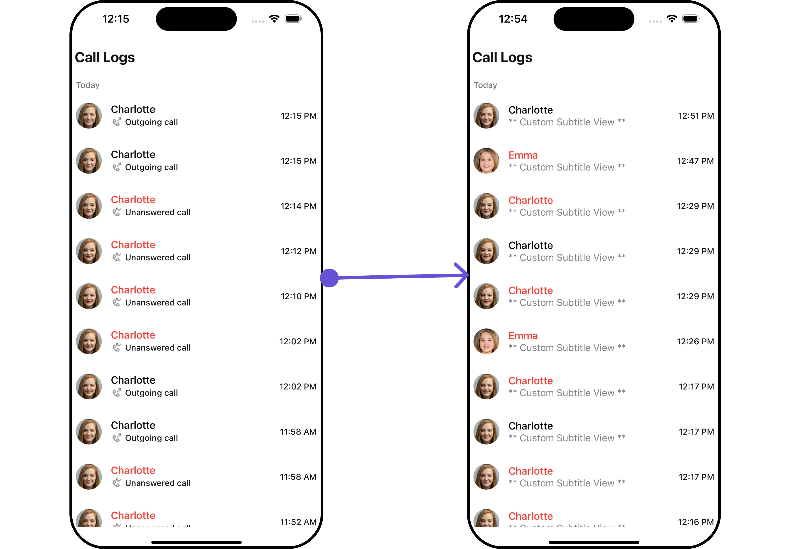

</TabItem>

<TabItem value="android" label="Android">

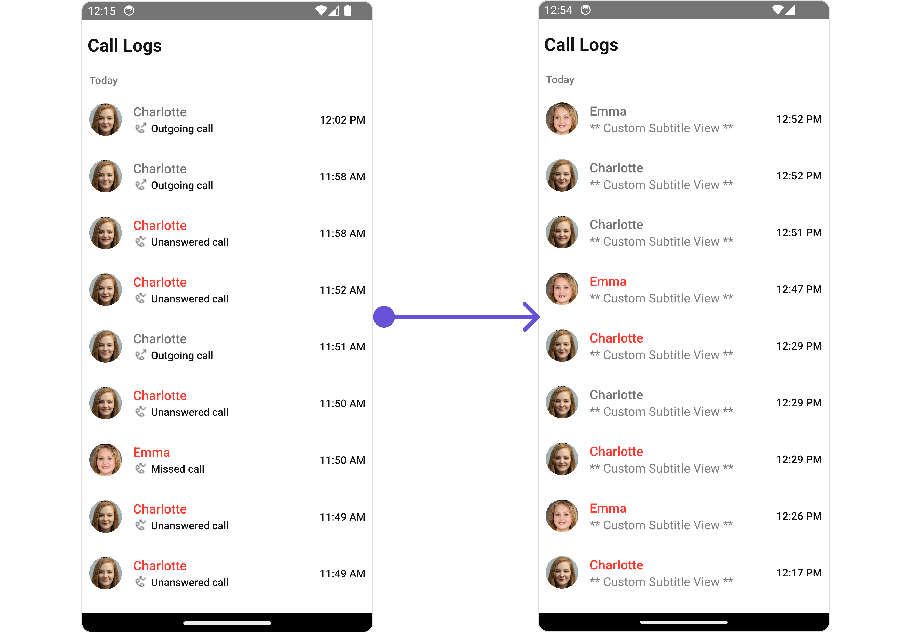

</TabItem>

</Tabs>

<Tabs>
<TabItem value="typescript" label="App.tsx">

```tsx
import { CometChat } from "@cometchat/chat-sdk-react-native";
import { CometChatCallLogs } from "@cometchat/chat-uikit-react-native";
import { CallLog } from "@cometchat/calls-sdk-react-native";

function App(): React.JSX.Element {
  const [loggedInUser, setLoggedInUser] = useState<CometChat.User>();
  useEffect(() => {
    //code
    CometChatUIKit.login({ uid: "uid" })
      .then(async (user: CometChat.User) => {
        setLoggedInUser(user);
      })
      .catch((error: any) => {
        //handle error
      });
  }, []);

  const datePattern: DatePattern = "timeFormat";
  const dateSeparatorPattern: DatePattern = "dayDateFormat";

  const getSubtitleView = (call: CallLog) => {
    return (
      <Text
        style={{
          fontSize: 15,
          color: "grey",
          shadowColor: "red",
        }}
      >
        ** Custom Subtitle View **
      </Text>
    );
  };

  return (
    <>
      {loggedInUser && (
        <CometChatCallLogs
          datePattern={datePattern}
          dateSeparatorPattern={dateSeparatorPattern}
          SubtitleView={getSubtitleView}
        />
      )}
    </>
  );
}
```

</TabItem>
</Tabs>

---

#### TailView

You can customize the `TailView` for each call logs item to meet your requirements

<Tabs>

<TabItem value="iOS" label="iOS">

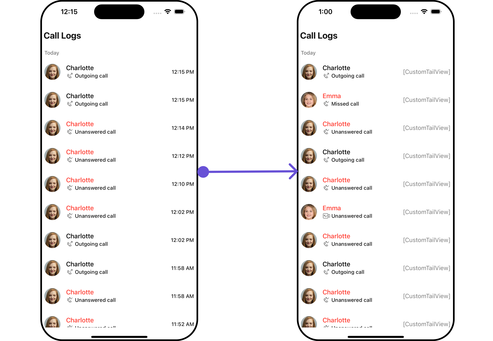

</TabItem>

<TabItem value="android" label="Android">

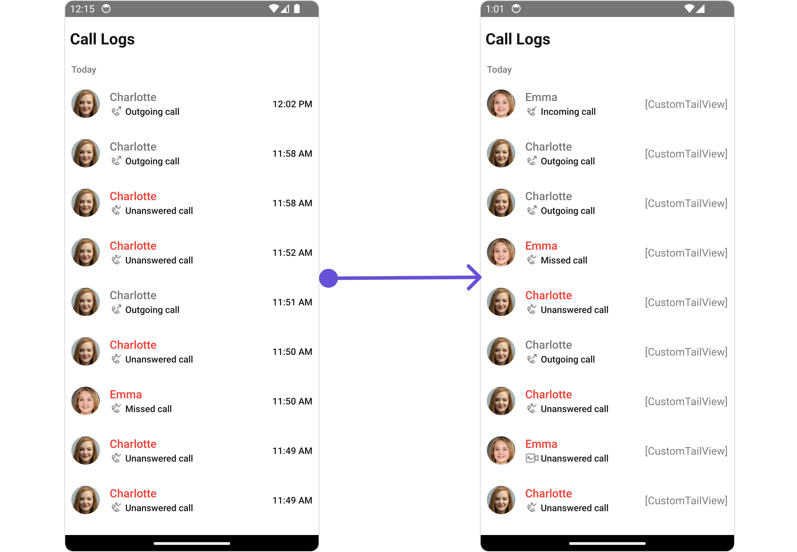

</TabItem>

</Tabs>

<Tabs>
<TabItem value="typescript" label="App.tsx">

```tsx
import { CometChat } from "@cometchat/chat-sdk-react-native";
import { CometChatCallLogs } from "@cometchat/chat-uikit-react-native";
import { CallLog } from "@cometchat/calls-sdk-react-native";

function App(): React.JSX.Element {
  const [loggedInUser, setLoggedInUser] = useState<CometChat.User>();
  useEffect(() => {
    //code
    CometChatUIKit.login({ uid: "uid" })
      .then(async (user: CometChat.User) => {
        setLoggedInUser(user);
      })
      .catch((error: any) => {
        //handle error
      });
  }, []);

  const datePattern: DatePattern = "timeFormat";
  const dateSeparatorPattern: DatePattern = "dayDateFormat";

  const getTailView = (call: CallLog) => {
    return (
      <Text
        style={{
          fontSize: 15,
          color: "grey",
          shadowColor: "red",
        }}
      >
        [CustomTailView]
      </Text>
    );
  };

  return (
    <>
      {loggedInUser && (
        <CometChatCallLogs
          datePattern={datePattern}
          dateSeparatorPattern={dateSeparatorPattern}
          TailView={getTailView}
        />
      )}
    </>
  );
}
```

</TabItem>
</Tabs>

---

#### LoadingStateView

You can set a custom loader view using `LoadingStateView` to match the loading view of your app.

<Tabs>

<TabItem value="iOS" label="iOS">

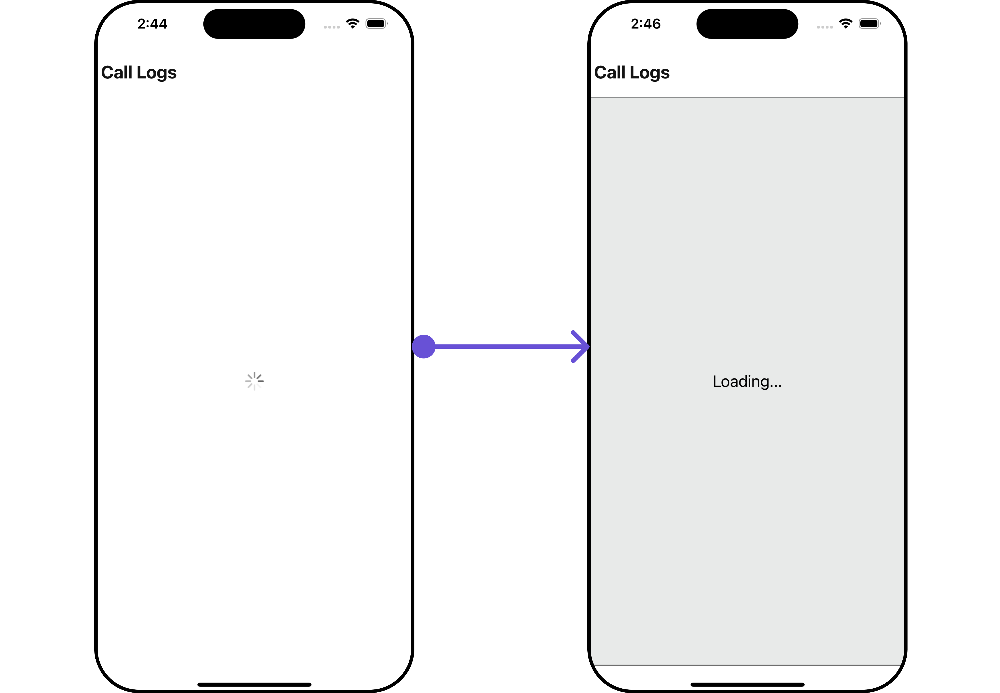

</TabItem>

<TabItem value="android" label="Android">

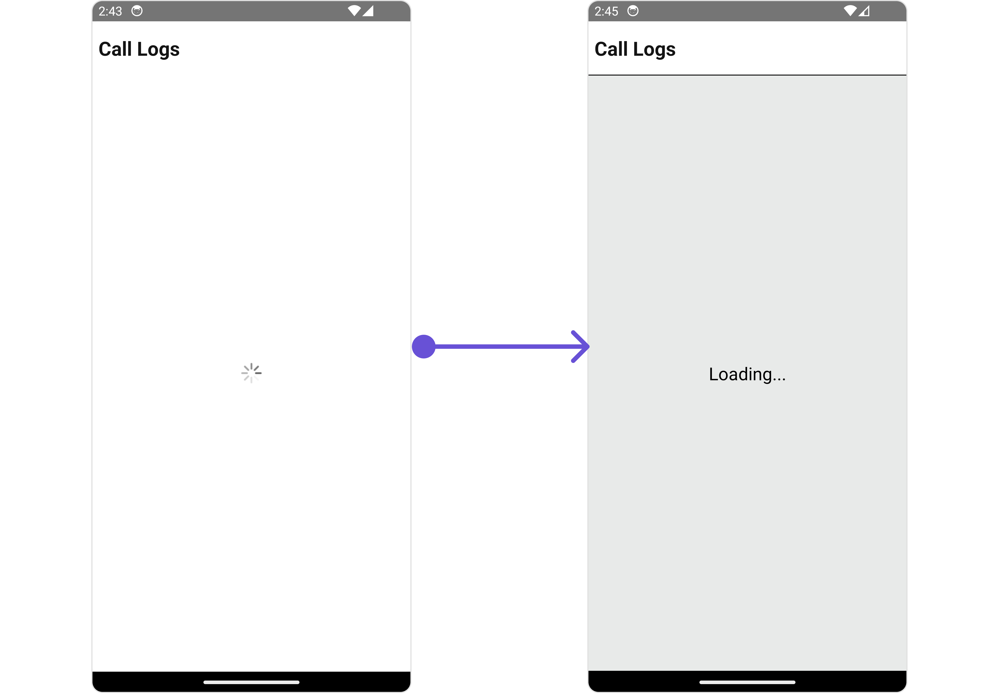

</TabItem>

</Tabs>

<Tabs>
<TabItem value="typescript" label="App.tsx">

```tsx
import { CometChat } from "@cometchat/chat-sdk-react-native";
import { CometChatCallLogs } from "@cometchat/chat-uikit-react-native";
import { CallLog } from "@cometchat/calls-sdk-react-native";

function App(): React.JSX.Element {
  const [loggedInUser, setLoggedInUser] = useState<CometChat.User>();
  useEffect(() => {
    //code
    CometChatUIKit.login({ uid: "uid" })
      .then(async (user: CometChat.User) => {
        setLoggedInUser(user);
      })
      .catch((error: any) => {
        //handle error
      });
  }, []);

  const datePattern: DatePattern = "timeFormat";
  const dateSeparatorPattern: DatePattern = "dayDateFormat";

  const loadingViewStyle: StyleProp<ViewStyle> = {
    flex: 1,
    alignItems: "center",
    justifyContent: "center",
    padding: 10,
    borderColor: "black",
    borderWidth: 1,
    backgroundColor: "#E8EAE9",
  };

  const getLoadingStateView = () => {
    return (
      <View style={loadingViewStyle}>
        <Text style={{ fontSize: 20, color: "black" }}>Loading...</Text>
      </View>
    );
  };

  return (
    <>
      {loggedInUser && (
        <CometChatCallLogs
          datePattern={datePattern}
          dateSeparatorPattern={dateSeparatorPattern}
          LoadingStateView={getLoadingStateView}
        />
      )}
    </>
  );
}
```

</TabItem>
</Tabs>

---

#### EmptyStateView

You can set a custom `EmptyStateView` using `EmptyStateView` to match the empty view of your app.

<Tabs>

<TabItem value="iOS" label="iOS">

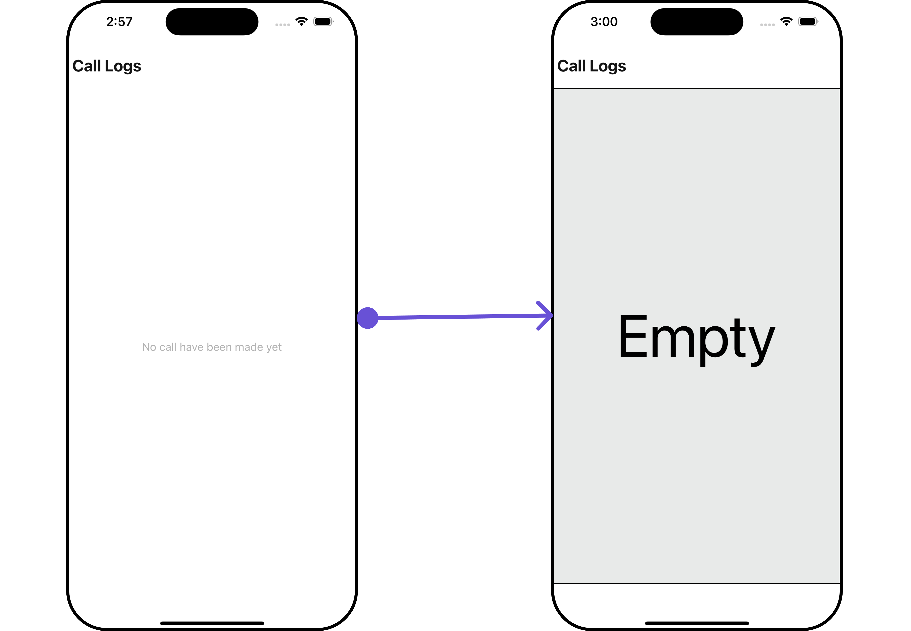

</TabItem>

<TabItem value="android" label="Android">

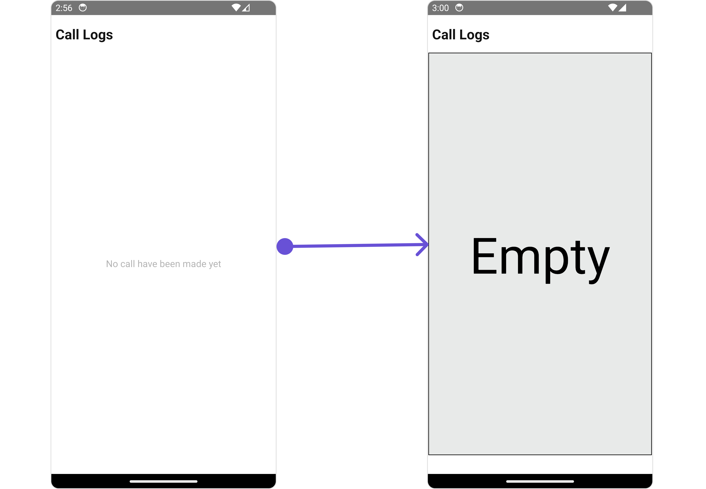

</TabItem>

</Tabs>

<Tabs>
<TabItem value="typescript" label="App.tsx">

```tsx
import { CometChat } from "@cometchat/chat-sdk-react-native";
import { CometChatCallLogs } from "@cometchat/chat-uikit-react-native";
import { CallLog } from "@cometchat/calls-sdk-react-native";

function App(): React.JSX.Element {
  const [loggedInUser, setLoggedInUser] = useState<CometChat.User>();
  useEffect(() => {
    //code
    CometChatUIKit.login({ uid: "uid" })
      .then(async (user: CometChat.User) => {
        setLoggedInUser(user);
      })
      .catch((error: any) => {
        //handle error
      });
  }, []);

  const datePattern: DatePattern = "timeFormat";
  const dateSeparatorPattern: DatePattern = "dayDateFormat";

  const emptyViewStyle: StyleProp<ViewStyle> = {
    flex: 1,
    alignItems: "center",
    justifyContent: "center",
    padding: 10,
    borderColor: "black",
    borderWidth: 1,
    backgroundColor: "#E8EAE9",
    marginLeft: 2,
    marginRight: 2,
    marginBottom: 30,
  };

  const getEmptyStateView = () => {
    return (
      <View style={emptyViewStyle}>
        <Text style={{ fontSize: 80, color: "black" }}>Empty</Text>
      </View>
    );
  };

  return (
    <>
      {loggedInUser && (
        <CometChatCallLogs
          datePattern={datePattern}
          dateSeparatorPattern={dateSeparatorPattern}
          EmptyStateView={getEmptyStateView}
        />
      )}
    </>
  );
}
```

</TabItem>
</Tabs>

---
