import Tabs from '@theme/Tabs';
import TabItem from '@theme/TabItem';

import { Tooltip } from 'react-tooltip'
import 'react-tooltip/dist/react-tooltip.css'

## Overview

`CometChatCallLogHistory` is a [Component](/ui-kit/react-native/components-overview#components) that shows a paginated list of all the calls between the logged-in user & another user or group. This allows the user to see all the calls with a specific user/group they have initiated/received/missed.

<Tabs>

<TabItem value="iOS" label="iOS">

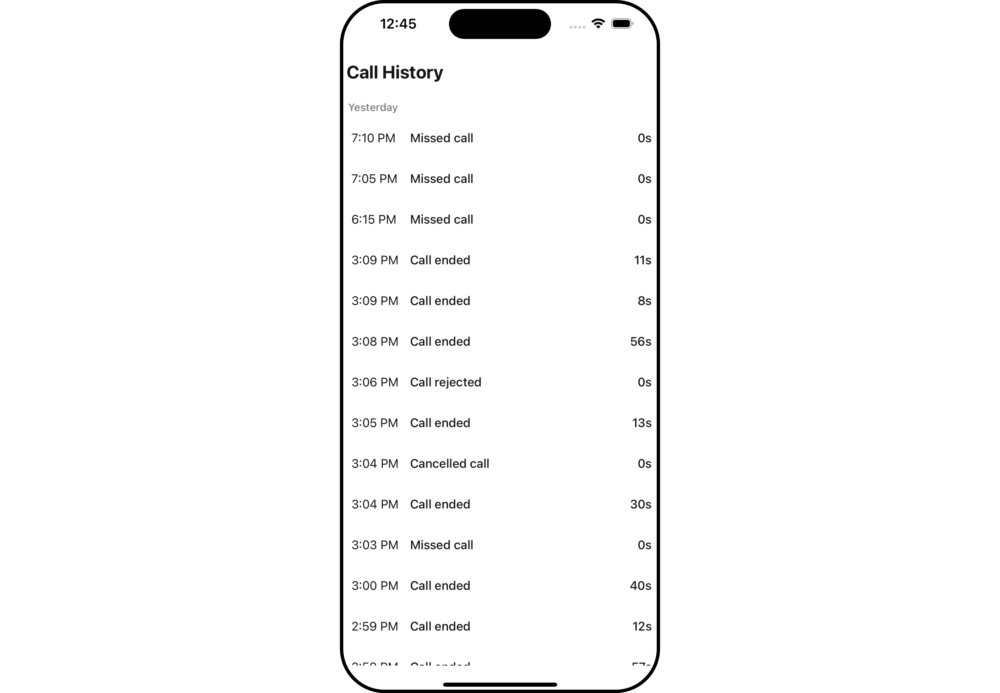

</TabItem>

<TabItem value="android" label="Android">

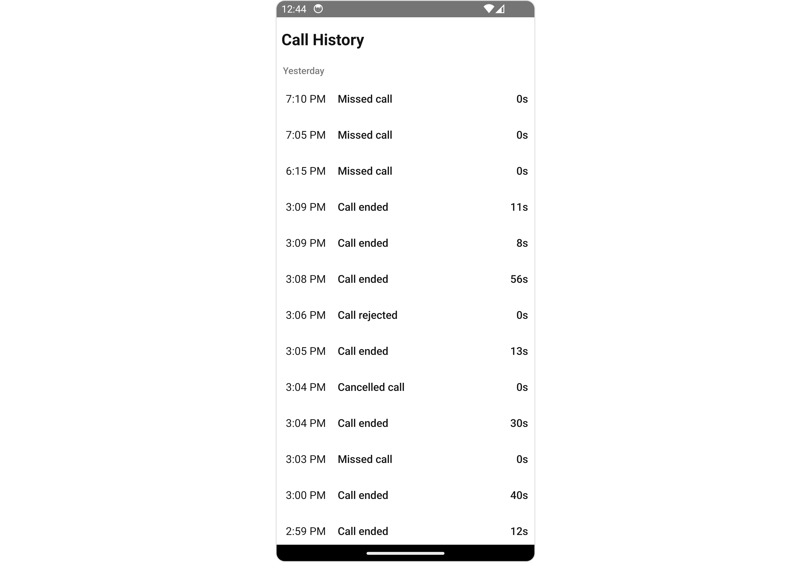

</TabItem>

</Tabs>

## Usage

### Integration

<Tabs>
<TabItem value="typescript" label="App.tsx">

```tsx
import { CometChat } from "@cometchat/chat-sdk-react-native";
import { CometChatCallLogHistory } from "@cometchat/chat-uikit-react-native";

function App(): React.JSX.Element {
  const [loggedInUser, setLoggedInUser] = useState<CometChat.User>();
  useEffect(() => {
    //code
    CometChatUIKit.login({ uid: "uid" })
      .then(async (user: CometChat.User) => {
        setLoggedInUser(user);
      })
      .catch((error: any) => {
        //handle error
      });
  }, []);

  return <>{loggedInUser && <CometChatCallLogHistory />}</>;
}
```

</TabItem>
</Tabs>

### Actions

[Actions](/ui-kit/react-native/components-overview#actions) dictate how a component functions. They are divided into two types: Predefined and User-defined. You can override either type, allowing you to tailor the behavior of the component to fit your specific needs.

##### 1. onItemPress

`onItemPress` is triggered when you click on a ListItem of the of the `Call Log History` component. It does not have a default behavior. However, you can override its behavior using the following code snippet.

<Tabs>
<TabItem value="typescript" label="App.tsx">

```tsx
import { CometChat } from "@cometchat/chat-sdk-react-native";
import { CometChatCallLogHistory } from "@cometchat/chat-uikit-react-native";

function App(): React.JSX.Element {
  const [loggedInUser, setLoggedInUser] = useState<CometChat.User>();
  useEffect(() => {
    //code
    CometChatUIKit.login({ uid: "uid" })
      .then(async (user: CometChat.User) => {
        setLoggedInUser(user);
      })
      .catch((error: any) => {
        //handle error
      });
  }, []);

  const onItemPressHandler = (item: CometChat.BaseMessage) => {
    //code
  };

  return (
    <>
      {loggedInUser && (
        <CometChatCallLogHistory onItemPress={onItemPressHandler} />
      )}
    </>
  );
}
```

</TabItem>
</Tabs>

##### 2. onBack

The `onBack` function is built to respond when you press the back button in the AppBar. The back button is only displayed when the prop `showBackButton` is set to true.

<Tabs>
<TabItem value="typescript" label="App.tsx">

```tsx
import { CometChat } from "@cometchat/chat-sdk-react-native";
import { CometChatCallLogHistory } from "@cometchat/chat-uikit-react-native";

function App(): React.JSX.Element {
  const [loggedInUser, setLoggedInUser] = useState<CometChat.User>();
  useEffect(() => {
    //code
    CometChatUIKit.login({ uid: "uid" })
      .then(async (user: CometChat.User) => {
        setLoggedInUser(user);
      })
      .catch((error: any) => {
        //handle error
      });
  }, []);

  const onBackHandler = () => {
    //code
  };

  return (
    <>
      {loggedInUser && (
        <CometChatCallLogHistory onBack={onBackHandler} showBackButton={true} />
      )}
    </>
  );
}
```

</TabItem>
</Tabs>

##### 3. onError

This action doesn't change the behavior of the component but rather listens for any errors that occur in the `Call Log History` component.

<Tabs>
<TabItem value="typescript" label="App.tsx">

```tsx
import { CometChat } from "@cometchat/chat-sdk-react-native";
import { CometChatCallLogHistory } from "@cometchat/chat-uikit-react-native";

function App(): React.JSX.Element {
  const [loggedInUser, setLoggedInUser] = useState<CometChat.User>();
  useEffect(() => {
    //code
    CometChatUIKit.login({ uid: "uid" })
      .then(async (user: CometChat.User) => {
        setLoggedInUser(user);
      })
      .catch((error: any) => {
        //handle error
      });
  }, []);

  const onErrorHandler = (error: CometChat.CometChatException) => {
    //code
  };

  return (
    <>{loggedInUser && <CometChatCallLogHistory onError={onErrorHandler} />}</>
  );
}
```

</TabItem>
</Tabs>

---

### Filters

**Filters** allow you to customize the data displayed in a list within a `Component`. You can filter the list based on your specific criteria, allowing for a more customized. Filters can be applied using `RequestBuilders` of Chat SDK.

##### 1. CallLogRequestBuilder

The [CallLogRequestBuilder](/sdk/javascript/call-logs) enables you to filter and customize the Call Log History based on available parameters in [CallLogRequestBuilder](/sdk/javascript/call-logs). This feature allows you to create more specific and targeted queries when fetching the call logs. The following are the parameters available in [CallLogRequestBuilder](/sdk/javascript/call-logs)

| Methods              | Type       | Description                                                  |
| -------------------- | ---------- | ------------------------------------------------------------ |
| **setLimit**         | number     | Specifies the number of call logs to fetch.                  |
| **setCallType**      | String     | Sets the type of calls to fetch (call or meet).              |
| **setCallStatus**    | callStatus | Sets the status of calls to fetch (initiated, ongoing, etc.) |
| **setHasRecording**  | boolean    | Sets whether to fetch calls that have recordings.            |
| **setCallCategory**  | string     | Sets the category of calls to fetch (call or meet).          |
| **setCallDirection** | string     | Sets the direction of calls to fetch (incoming or outgoing)  |
| **setUid**           | string     | Sets the UID of the user whose call logs to fetch.           |
| **setGuid**          | string     | Sets the GUID of the user whose call logs to fetch.          |
| **setAuthToken**     | string     | Sets the Auth token of the logged-in user.                   |

**Example**

In the example below, we're filtering Call Log History to show only canceled calls and setting the limit to five.

<Tabs>
<TabItem value="typescript" label="App.tsx">

```tsx
import { CometChat } from "@cometchat/chat-sdk-react-native";
import { CometChatCallLogHistory } from "@cometchat/chat-uikit-react-native";
import { CallLogRequestBuilder } from "@cometchat/calls-sdk-react-native";

function App(): React.JSX.Element {
  const [loggedInUser, setLoggedInUser] = useState<CometChat.User>();
  useEffect(() => {
    //code
    CometChatUIKit.login({ uid: "uid" })
      .then(async (user: CometChat.User) => {
        setLoggedInUser(user);
      })
      .catch((error: any) => {
        //handle error
      });
  }, []);

  return (
    <>
      {loggedInUser && (
        <CometChatCallLogHistory
          callLogHistoryRequestBuilder={new CallLogRequestBuilder()
            .setLimit(5)
            .setAuthToken("auth-token")
            .setCallStatus("cancelled")
            .build()}
        />
      )}
    </>
  );
}
```

</TabItem>
</Tabs>

---

### Events

[Events](/ui-kit/react-native/components-overview#events) are emitted by a `Component`. By using event you can extend existing functionality. Being global events, they can be applied in Multiple Locations and are capable of being Added or Removed.

The `CallLogHistory` does not produce any events.

---

## Customization

To fit your app's design requirements, you have the ability to customize the appearance of the
`CallLogHistory` component. We provide exposed methods that allow you to modify the experience and behavior according to your specific needs.

### Style

Using **Style** you can **customize** the look and feel of the component in your app, These parameters typically control elements such as the **color**, **size**, **shape**, and **fonts** used within the component.

##### 1. CallLogHistory Style

To customize the appearance, you can assign a `CallLogHistoryStyle` object to the `Call Log History` component.

<Tabs>

<TabItem value="iOS" label="iOS">

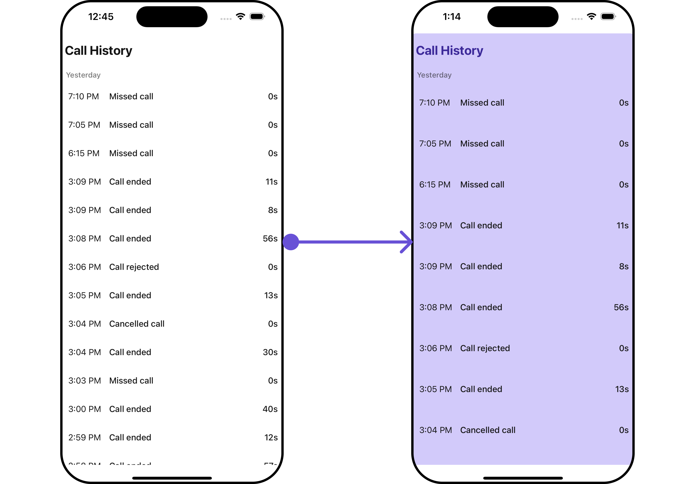

</TabItem>

<TabItem value="android" label="Android">

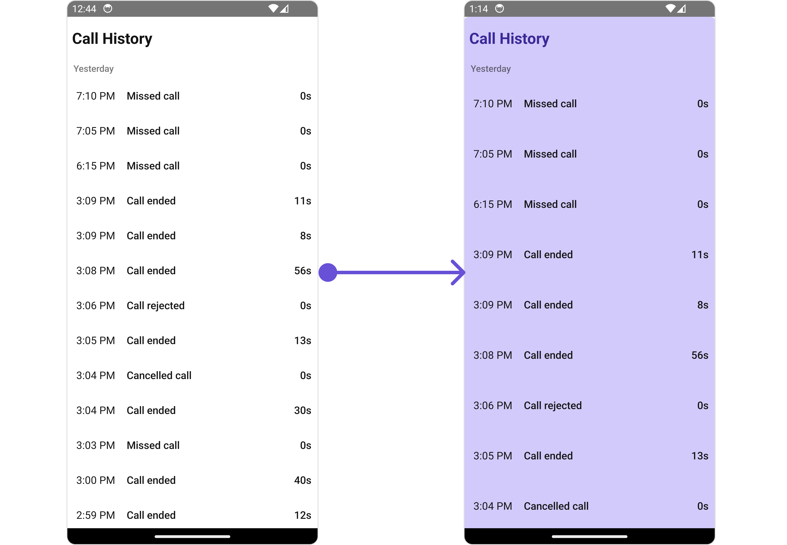

</TabItem>

</Tabs>

In this example, we are employing the `callLogHistoryStyle`.

<Tabs>
<TabItem value="typescript" label="App.tsx">

```tsx
import { CometChat } from "@cometchat/chat-sdk-react-native";
import {
  CometChatCallLogHistory,
  CallLogHistoryStyleInterface,
} from "@cometchat/chat-uikit-react-native";

function App(): React.JSX.Element {
  const [loggedInUser, setLoggedInUser] = useState<CometChat.User>();
  useEffect(() => {
    //code
    CometChatUIKit.login({ uid: "uid" })
      .then(async (user: CometChat.User) => {
        setLoggedInUser(user);
      })
      .catch((error: any) => {
        //handle error
      });
  }, []);

  const callLogHistoryStyle: CallLogHistoryStyleInterface = {
    titleColor: "#3c2999",
    backgroundColor: "#d2cafa",
  };

  return (
    <>
      {loggedInUser && (
        <CometChatCallLogHistory
          callLogHistoryStyle={callLogHistoryStyle}
          listItemStyle={{ backgroundColor: "#d2cafa" }}
        />
      )}
    </>
  );
}
```

</TabItem>
</Tabs>

---

The following properties are exposed by `CallLogHistoryStyle`:

| Property            | Description                   | Code                               |
| ------------------- | ----------------------------- | ---------------------------------- |
| **border**          | Used to set border            | `border?: BorderStyleInterface,`   |
| **borderRadius**    | Used to set border radius     | `borderRadius?: number;`           |
| **backgroundColor** | Used to set background colour | `background?: string;`             |
| **height**          | Used to set height            | `height?: number` &#124; `string;` |
| **width**           | Used to set width             | `width?: number` &#124; `string;`  |

| **titleFont** | Used to set title font | `titleFont?: FontStyleInterface,` |
| **titleColor** | Used to set title color | `titleColor?: string;` |
| **loadingTint** | Used to set loading icon font | `loadingTint?: FontStyleInterface,` |
| **emptyTextColor** | Used to set empty state text color | `emptyTextColor?: string;` |
| **emptyTextFont** | Used to set empty state text font | `emptyTextFont?: FontStyleInterface;` |
| **errorTextColor** | Used to set error state text color | `errorTextColor?: string;` |
| **errorTextFont** | Used to set error state text font | `errorTextFont?: FontStyleInterface;` |
| **backIconTint** | Used to set back icon tint | `backIconTint?: string;` |
| **dateTextFont** | Used to set date text font | `dateTextFont?: FontStyleInterface;` |
| **dateTextColor** | Used to set date text color | `dateTextColor?: string;` |
| **dateSeparatorTextFont** | Used to set date separator text font | `dateSeparatorTextFont?: FontStyleInterface;` |
| **dateSeparatorTextColor** | Used to set date separator text color | `dateSeparatorTextColor?: string;` |
| **callDurationTextFont** | Used to set call duration text font | `callDurationTextFont?: FontStyleInterface;` |
| **callDurationTextColor** | Used to set call duration text color | `callDurationTextColor?: string;` |
| **callStatusTextFont** | Used to set call status text font | `callStatusTextFont?: FontStyleInterface;` |
| **callStatusTextColor** | Used to set call status text color | `callStatusTextColor?: string;` |
| **separatorColor** | Used to set separator color | `separatorColor?: string;` |

##### 2. ListItem Style

If you want to apply customized styles to the `ListItemStyle` component within the `Call Log History` Component, you can use the following code snippet. For more information, you can refer [ListItem Styles](/ui-kit/react-native/list-item#listitemstyle).

<Tabs>
<TabItem value="typescript" label="App.tsx">

```tsx
import { CometChat } from "@cometchat/chat-sdk-react-native";
import {
  CometChatCallLogHistory,
  CallLogHistoryStyleInterface,
} from "@cometchat/chat-uikit-react-native";

function App(): React.JSX.Element {
  const [loggedInUser, setLoggedInUser] = useState<CometChat.User>();
  useEffect(() => {
    //code
    CometChatUIKit.login({ uid: "uid" })
      .then(async (user: CometChat.User) => {
        setLoggedInUser(user);
      })
      .catch((error: any) => {
        //handle error
      });
  }, []);

  const callLogHistoryStyle: CallLogHistoryStyleInterface = {
    titleColor: "#3c2999",
    backgroundColor: "#d2cafa",
  };

  return (
    <>
      {loggedInUser && (
        <CometChatCallLogHistory
          callLogHistoryStyle={callLogHistoryStyle}
          listItemStyle={{ backgroundColor: "#d2cafa" }}
        />
      )}
    </>
  );
}
```

</TabItem>
</Tabs>

---

### Functionality

These are a set of small functional customizations that allow you to fine-tune the overall experience of the component. With these, you can change text, set custom icons, and toggle the visibility of UI elements.

Here is a code snippet demonstrating how you can customize the functionality of the `Call Log History` component.

<Tabs>
<TabItem value="typescript" label="App.tsx">

```tsx
import { CometChat } from "@cometchat/chat-sdk-react-native";
import { CometChatCallLogHistory } from "@cometchat/chat-uikit-react-native";

function App(): React.JSX.Element {
  const [loggedInUser, setLoggedInUser] = useState<CometChat.User>();
  useEffect(() => {
    //code
    CometChatUIKit.login({ uid: "uid" })
      .then(async (user: CometChat.User) => {
        setLoggedInUser(user);
      })
      .catch((error: any) => {
        //handle error
      });
  }, []);

  return (
    <>
      {loggedInUser && (
        <CometChatCallLogHistory title=" **  Custom Title  **" />
      )}
    </>
  );
}
```

</TabItem>
</Tabs>

<Tabs>

<TabItem value="iOS" label="iOS">

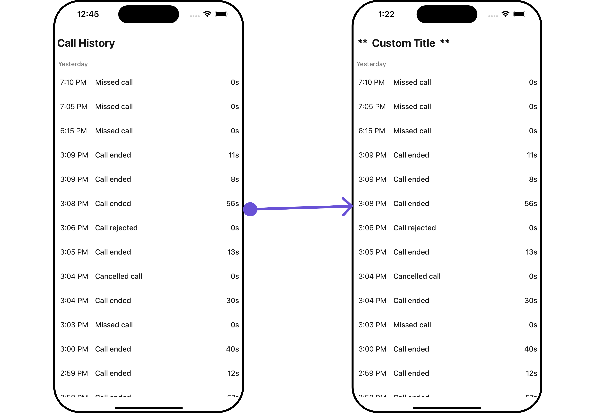

</TabItem>

<TabItem value="android" label="Android">

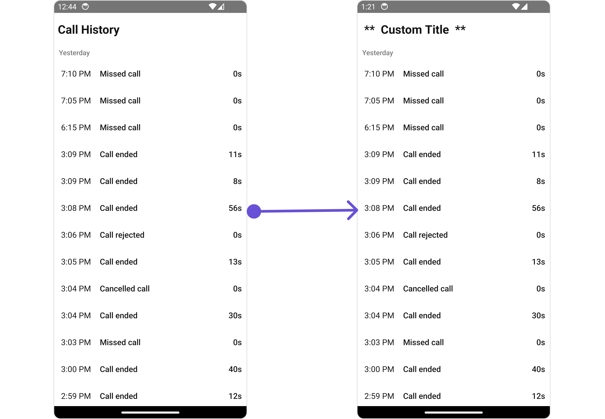

</TabItem>

</Tabs>

Below is a list of customizations along with corresponding code snippets

| Property                                                                                                          | Description                                       | Code                                            |
| ----------------------------------------------------------------------------------------------------------------- | ------------------------------------------------- | ----------------------------------------------- |
| **title** <a data-tooltip-id="my-tooltip-html-prop"> <span class="material-icons red">report</span> </a>          | Used to set custom title                          | `title='Your Custom Title'`                     |
| **emptyStateText** <a data-tooltip-id="my-tooltip-html-prop"> <span class="material-icons red">report</span> </a> | Used to set custom empty state text               | `emptyStateText='Your Custom Empty State Text'` |
| **errorStateText** <a data-tooltip-id="my-tooltip-html-prop"> <span class="material-icons red">report</span> </a> | Used to set custom error state text               | `errorStateText='Your Custom Error State Text'` |
| **datePattern**                                                                                                   | Used to set custom date pattern                   | `datePattern?: DatePattern`                     |
| **dateSeparatorPattern**                                                                                          | Used to set custom date separator pattern         | `dateSeparatorPattern?: DatePattern`            |
| **showBackButton**                                                                                                | Used to control the visibility of the back button | `showBackButton?: boolean`                      |
| **BackButton**                                                                                                    | Used to set custom back icon                      | `BackButton?: JSX.Element;`                     |
| **hideError**                                                                                                     | Used to hide errors                               | `hideError?: boolean`                           |
| **loadingIcon**                                                                                                   | Used to set custom loading icon                   | `loadingIcon?: ImageType;`                      |
| **user**                                                                                                          | Used to set group object                          | `user?: CometChat.User`                         |
| **group**                                                                                                         | Used to set group object                          | `group?: CometChat.Group`                       |

---

### Advanced

For advanced-level customization, you can set custom views to the component. This lets you tailor each aspect of the component to fit your exact needs and application aesthetics. You can create and define your views, layouts, and UI elements and then incorporate those into the component.

---

#### TailView

You can customize the tail view for each call log history item to meet your requirements

<Tabs>

<TabItem value="iOS" label="iOS">

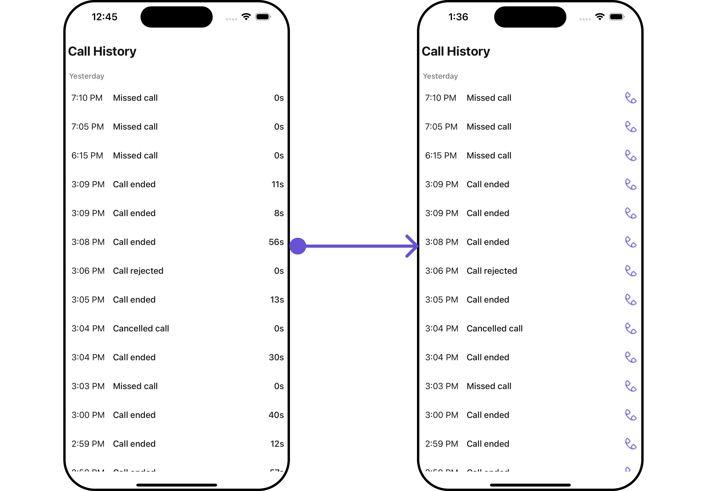

</TabItem>

<TabItem value="android" label="Android">

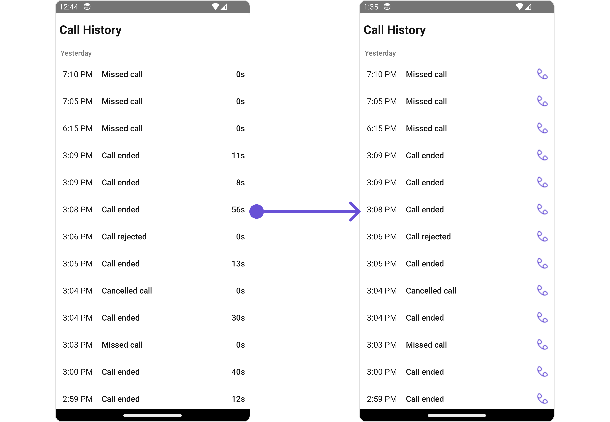

</TabItem>

</Tabs>

<Tabs>
<TabItem value="typescript" label="App.tsx">

```tsx
import { CometChat } from "@cometchat/chat-sdk-react-native";
import { CometChatCallLogHistory } from "@cometchat/chat-uikit-react-native";

function App(): React.JSX.Element {
  const [loggedInUser, setLoggedInUser] = useState<CometChat.User>();
  useEffect(() => {
    //code
    CometChatUIKit.login({ uid: "uid" })
      .then(async (user: CometChat.User) => {
        setLoggedInUser(user);
      })
      .catch((error: any) => {
        //handle error
      });
  }, []);

  const getCustomTailView = (param: any) => {
    return <Image style={{ tintColor: "#6851D6" }} source={Call}></Image>;
  };

  return (
    <>
      {loggedInUser && <CometChatCallLogHistory TailView={getCustomTailView} />}
    </>
  );
}
```

</TabItem>
</Tabs>

---

<!-- #### SubtitleView

--- -->

#### LoadingStateView

You can set a custom loader view using `loadingStateView` to match the loading view of your app.

<Tabs>

<TabItem value="iOS" label="iOS">

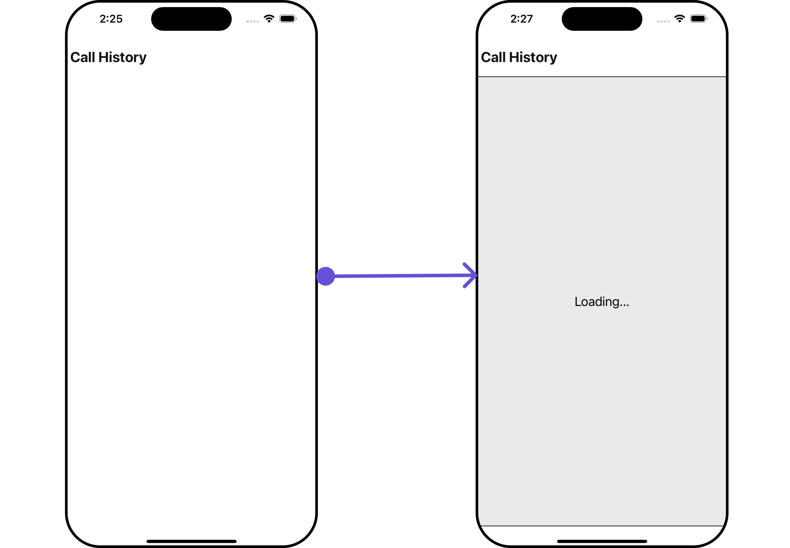

</TabItem>

<TabItem value="android" label="Android">

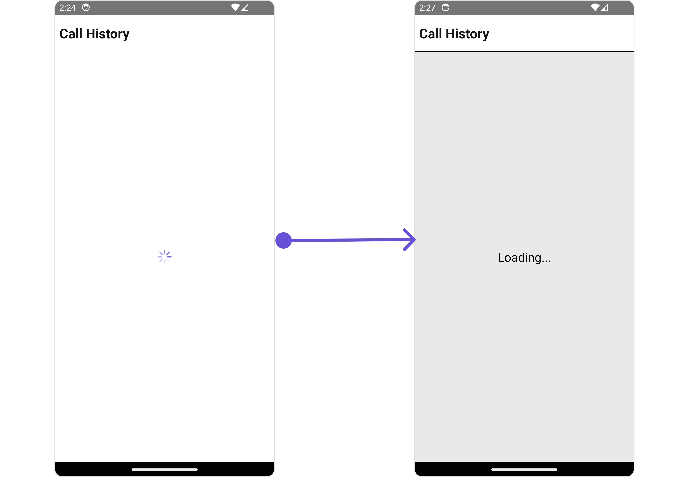

</TabItem>

</Tabs>

<Tabs>
<TabItem value="typescript" label="App.tsx">

```tsx
import { CometChat } from "@cometchat/chat-sdk-react-native";
import { CometChatCallLogHistory } from "@cometchat/chat-uikit-react-native";

function App(): React.JSX.Element {
  const [loggedInUser, setLoggedInUser] = useState<CometChat.User>();
  useEffect(() => {
    //code
    CometChatUIKit.login({ uid: "uid" })
      .then(async (user: CometChat.User) => {
        setLoggedInUser(user);
      })
      .catch((error: any) => {
        //handle error
      });
  }, []);

  const loadingViewStyle: StyleProp<ViewStyle> = {
    flex: 1,
    alignItems: "center",
    justifyContent: "center",
    padding: 10,
    borderColor: "black",
    borderWidth: 1,
    backgroundColor: "#E8EAE9",
  };

  const getLoadingStateView = () => {
    return (
      <View style={loadingViewStyle}>
        <Text style={{ fontSize: 20, color: "black" }}>Loading...</Text>
      </View>
    );
  };

  return (
    <>
      {loggedInUser && (
        <CometChatCallLogHistory LoadingStateView={getLoadingStateView} />
      )}
    </>
  );
}
```

</TabItem>
</Tabs>

---

#### EmptyStateView

You can set a custom `EmptyStateView` using `EmptyStateView` to match the empty view of your app.

<Tabs>

<TabItem value="iOS" label="iOS">

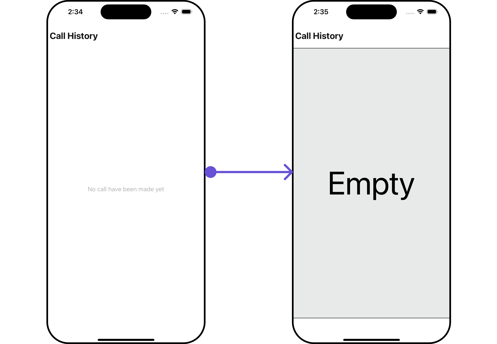

</TabItem>

<TabItem value="android" label="Android">

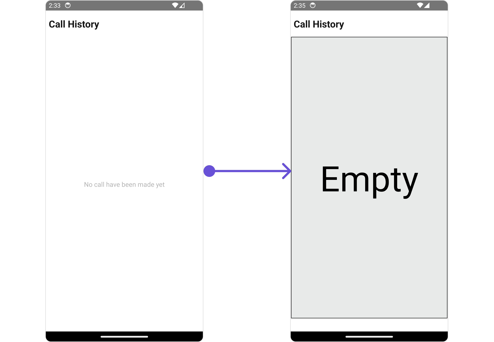

</TabItem>

</Tabs>

<Tabs>
<TabItem value="typescript" label="App.tsx">

```tsx
import { CometChat } from "@cometchat/chat-sdk-react-native";
import { CometChatCallLogHistory } from "@cometchat/chat-uikit-react-native";

function App(): React.JSX.Element {
  const [loggedInUser, setLoggedInUser] = useState<CometChat.User>();
  useEffect(() => {
    //code
    CometChatUIKit.login({ uid: "uid" })
      .then(async (user: CometChat.User) => {
        setLoggedInUser(user);
      })
      .catch((error: any) => {
        //handle error
      });
  }, []);

  const emptyViewStyle: StyleProp<ViewStyle> = {
    flex: 1,
    alignItems: "center",
    justifyContent: "center",
    padding: 10,
    borderColor: "black",
    borderWidth: 1,
    backgroundColor: "#E8EAE9",
    marginLeft: 2,
    marginRight: 2,
    marginBottom: 30,
  };

  const getEmptyStateView = () => {
    //alice-uid
    return (
      <View style={emptyViewStyle}>
        <Text style={{ fontSize: 80, color: "black" }}>Empty</Text>
      </View>
    );
  };

  return (
    <>
      {loggedInUser && (
        <CometChatCallLogHistory EmptyStateView={getEmptyStateView} />
      )}
    </>
  );
}
```

</TabItem>
</Tabs>

---

<Tooltip
  id="my-tooltip-html-prop"
  html="Not available in CallLogHistoryConfiguration"
/>
