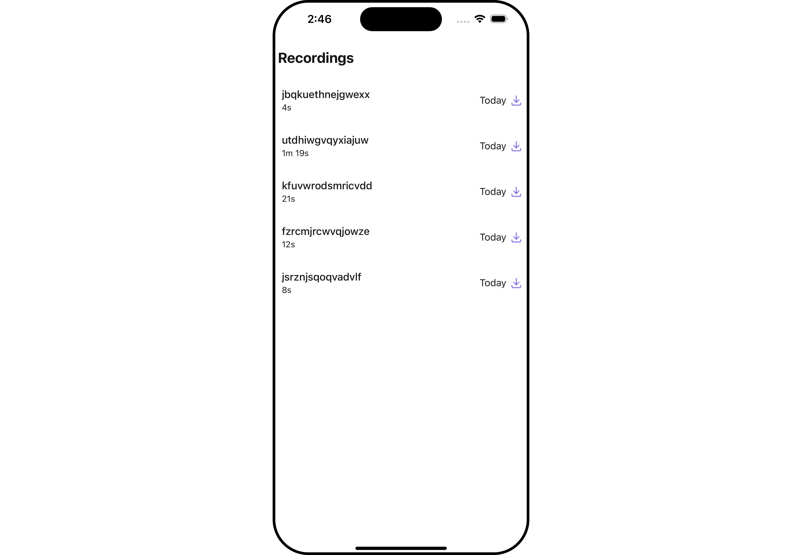
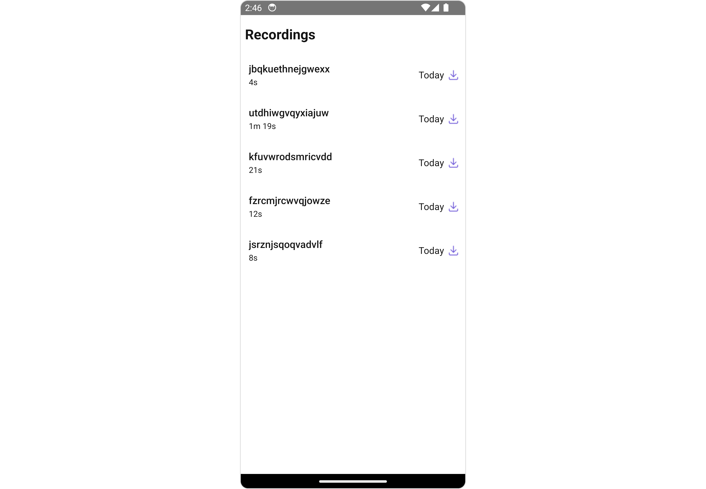
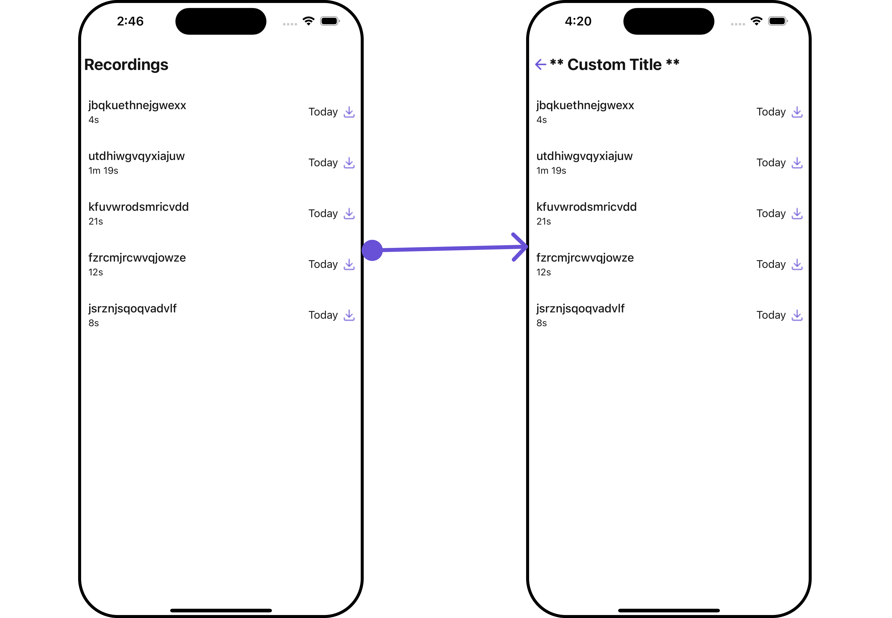
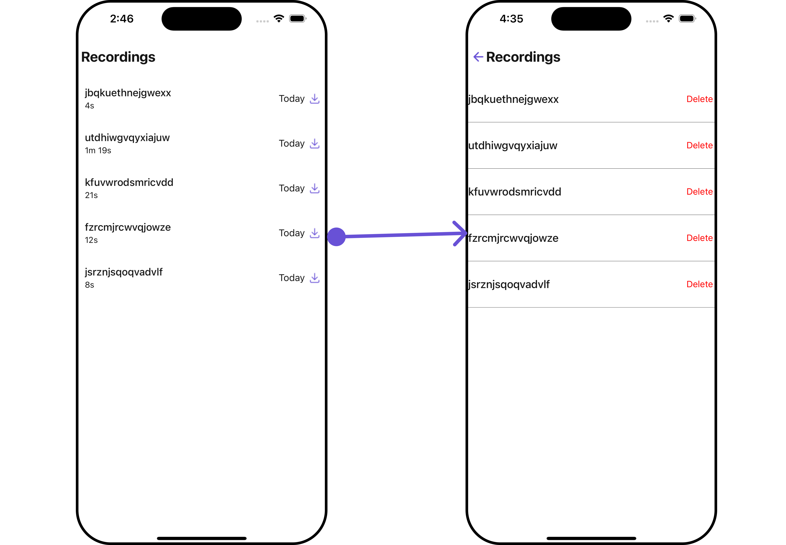
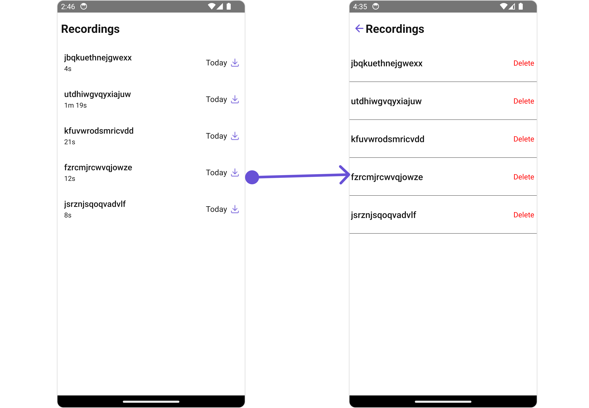
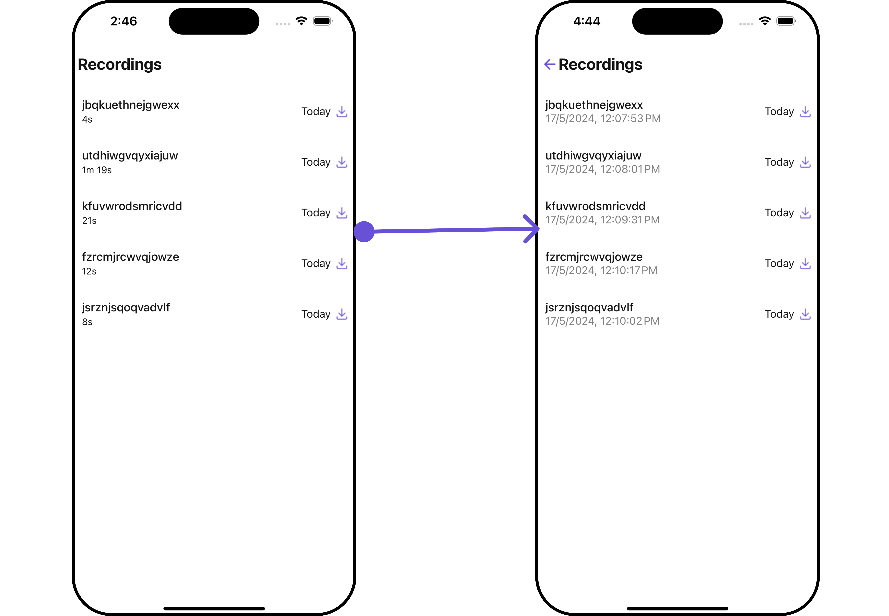
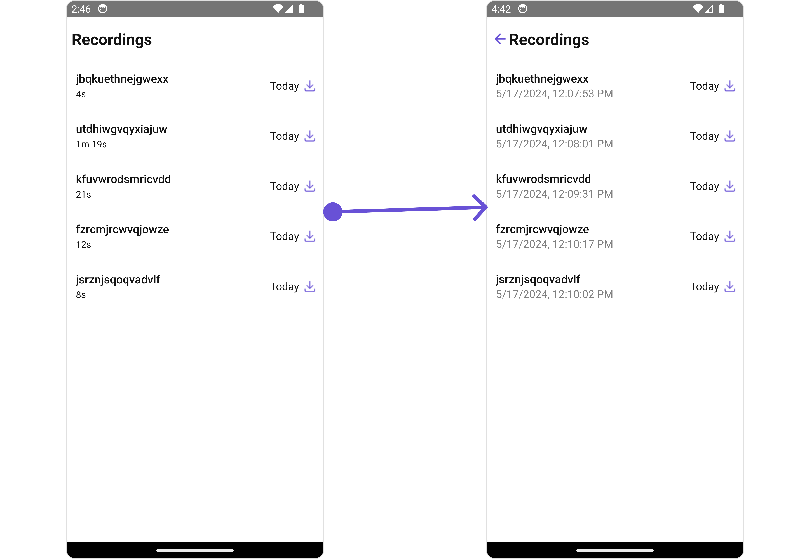
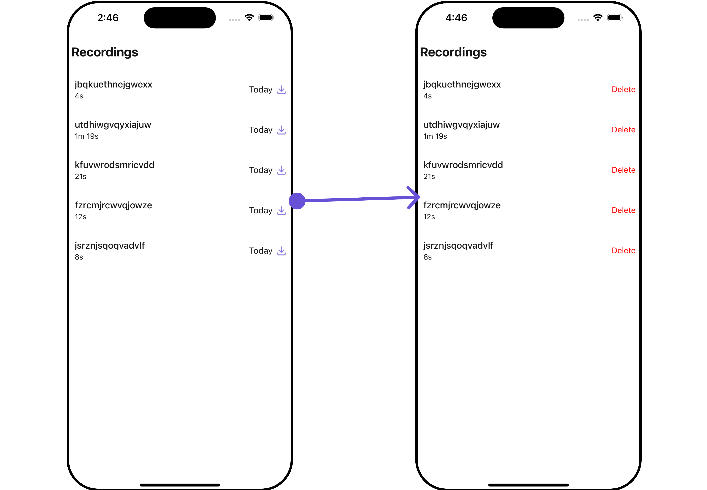
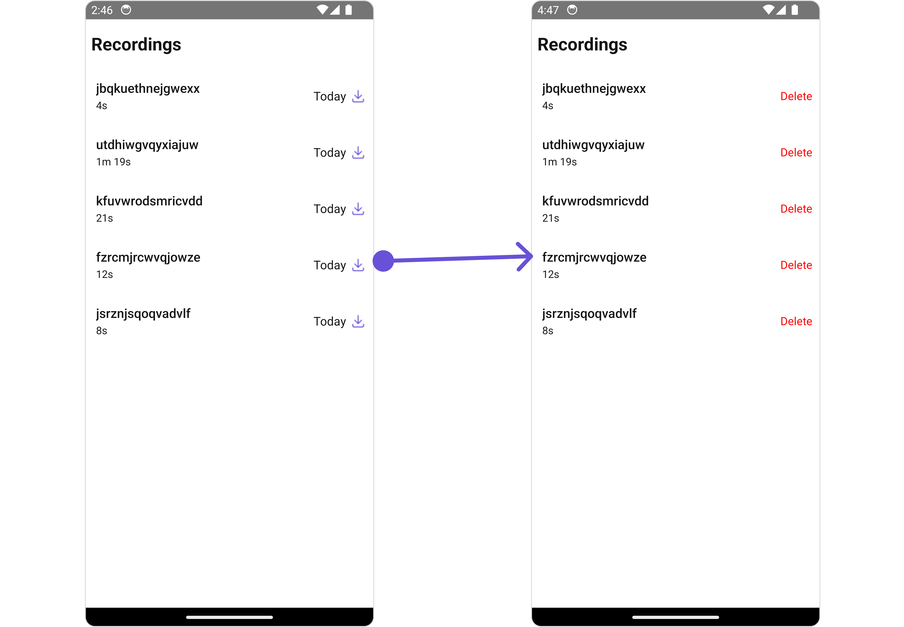

import Tabs from '@theme/Tabs';
import TabItem from '@theme/TabItem';

import { Tooltip } from 'react-tooltip'
import 'react-tooltip/dist/react-tooltip.css'

## Overview

The `CometChatRecordings` is a [Component](/ui-kit/react-native/components-overview#components) that shows a paginated list of recordings of a particular call. This allows the user to see all the recordings along with the duration as well as a download link using which one can download the recording.

<Tabs>

<TabItem value="iOS" label="iOS">



</TabItem>

<TabItem value="android" label="Android">



</TabItem>

</Tabs>

The `CallRecordings` is comprised of the following components:

| Components                       | Description                                                                                                                 |
| -------------------------------- | --------------------------------------------------------------------------------------------------------------------------- |
| CometChatList                    | a reusable container component having title, search box, customisable background and a List View                            |
| [CometChatListItem](./list-item) | a component that renders data obtained from a Group object on a Tile having a title, subtitle, leading and trailing view    |
| [cometchat-date](./date)         | This Component used to show the date and time. You can also customize the appearance of this widget by modifying its logic. |
| cometchat-button                 | This component represents a button with optional icon and text.                                                             |

## Usage

### Integration

<Tabs>
<TabItem value="typescript" label="App.tsx">

```tsx
import { CometChat, CometChatCalls } from "@cometchat/chat-sdk-react-native";
import { CometChatRecordings } from "@cometchat/chat-uikit-react-native";
import {
  CallLog,
  CallLogRequestBuilder,
} from "@cometchat/calls-sdk-react-native";

function App(): React.JSX.Element {
  const [loggedInUser, setLoggedInUser] = useState<CometChat.User>();
  const [callLog, setCallLog] = useState<CallLog>();
  useEffect(() => {
    //code
    CometChatUIKit.login({ uid: "uid" })
      .then(async (user: CometChat.User) => {
        setLoggedInUser(user);
        const CallLogRequest = new CallLogRequestBuilder()
          .setLimit(1)
          .setAuthToken(user!.getAuthToken())
          .setHasRecording(true)
          .build();

        callLogRequest
          .fetchNext()
          .then((callLogs: CallLog[]) => {
            setCallLog(callLogs[0]);
          })
          .catch(() => {
            //handle error
          });
      })
      .catch((error: any) => {
        //handle error
      });
  }, []);

  return (
    <>{callLog && <CometChatRecordings data={callLog.getRecordings()} />}</>
  );
}
```

</TabItem>
</Tabs>

### Actions

[Actions](/ui-kit/react-native/components-overview#actions) dictate how a component functions. They are divided into two types: Predefined and User-defined. You can override either type, allowing you to tailor the behavior of the component to fit your specific needs.

##### 1. onItemPress

`onItemPress` is triggered when you click on a ListItem of the of the `CallRecordings` component. It does not have a default behavior. However, you can override its behavior using the following code snippet.

<Tabs>
<TabItem value="typescript" label="App.tsx">

```tsx
import { CometChat, CometChatCalls } from "@cometchat/chat-sdk-react-native";
import { CometChatRecordings } from "@cometchat/chat-uikit-react-native";
import {
  CallLog,
  CallLogRequestBuilder,
} from "@cometchat/calls-sdk-react-native";

function App(): React.JSX.Element {
  const [loggedInUser, setLoggedInUser] = useState<CometChat.User>();
  const [callLog, setCallLog] = useState<CallLog>();
  useEffect(() => {
    //code
    CometChatUIKit.login({ uid: "uid" })
      .then(async (user: CometChat.User) => {
        setLoggedInUser(user);
        const CallLogRequest = new CallLogRequestBuilder()
          .setLimit(1)
          .setAuthToken(user!.getAuthToken())
          .setHasRecording(true)
          .build();

        callLogRequest
          .fetchNext()
          .then((callLogs: CallLog[]) => {
            setCallLog(callLogs[0]);
          })
          .catch(() => {
            //handle error
          });
      })
      .catch((error: any) => {
        //handle error
      });
  }, []);

  const onItemPressHandler = (item: any) => {
    //code
  };

  return (
    <>
      {callLog && (
        <CometChatRecordings
          data={callLog.getRecordings()}
          onItemPress={onItemPressHandler}
        />
      )}
    </>
  );
}
```

</TabItem>
</Tabs>

##### 2. onBack

The `onBack` function is built to respond when you press the back button in the AppBar. The back button is only displayed when the prop `showBackButton` is set to true.

<Tabs>
<TabItem value="typescript" label="App.tsx">

```tsx
import { CometChat, CometChatCalls } from "@cometchat/chat-sdk-react-native";
import { CometChatRecordings } from "@cometchat/chat-uikit-react-native";
import {
  CallLog,
  CallLogRequestBuilder,
} from "@cometchat/calls-sdk-react-native";

function App(): React.JSX.Element {
  const [loggedInUser, setLoggedInUser] = useState<CometChat.User>();
  const [callLog, setCallLog] = useState<CallLog>();
  useEffect(() => {
    //code
    CometChatUIKit.login({ uid: "uid" })
      .then(async (user: CometChat.User) => {
        setLoggedInUser(user);
        const CallLogRequest = new CallLogRequestBuilder()
          .setLimit(1)
          .setAuthToken(user!.getAuthToken())
          .setHasRecording(true)
          .build();

        callLogRequest
          .fetchNext()
          .then((callLogs: CallLog[]) => {
            setCallLog(callLogs[0]);
          })
          .catch(() => {
            //handle error
          });
      })
      .catch((error: any) => {
        //handle error
      });
  }, []);

  const onBackHandler = () => {
    //code
  };

  return (
    <>
      {callLog && (
        <CometChatRecordings
          data={callLog.getRecordings()}
          onItemPress={onItemPressHandler}
          onBack={onBackHandler}
          showBackButton={true}
        />
      )}
    </>
  );
}
```

</TabItem>
</Tabs>

##### 3. onDownloadIconPress

`onDownloadIconPress` is triggered when you click on the download of the of the `CallRecordings` component. you can override its behavior using the following code snippet.

<Tabs>
<TabItem value="typescript" label="App.tsx">

```tsx
import { CometChat, CometChatCalls } from "@cometchat/chat-sdk-react-native";
import { CometChatRecordings } from "@cometchat/chat-uikit-react-native";
import {
  CallLog,
  CallLogRequestBuilder,
} from "@cometchat/calls-sdk-react-native";

function App(): React.JSX.Element {
  const [loggedInUser, setLoggedInUser] = useState<CometChat.User>();
  const [callLog, setCallLog] = useState<CallLog>();
  useEffect(() => {
    //code
    CometChatUIKit.login({ uid: "uid" })
      .then(async (user: CometChat.User) => {
        setLoggedInUser(user);
        const CallLogRequest = new CallLogRequestBuilder()
          .setLimit(1)
          .setAuthToken(user!.getAuthToken())
          .setHasRecording(true)
          .build();

        callLogRequest
          .fetchNext()
          .then((callLogs: CallLog[]) => {
            setCallLog(callLogs[0]);
          })
          .catch(() => {
            //handle error
          });
      })
      .catch((error: any) => {
        //handle error
      });
  }, []);

  const onDownloadIconPressHandler = (item: any) => {
    //code
  };

  return (
    <>
      {callLog && (
        <CometChatRecordings
          data={callLog.getRecordings()}
          onDownloadIconPress={onDownloadIconPressHandler}
        />
      )}
    </>
  );
}
```

</TabItem>
</Tabs>

##### 4. onError

This action doesn't change the behavior of the component but rather listens for any errors that occur in the `CallRecordings` component.

<Tabs>
<TabItem value="typescript" label="App.tsx">

```tsx
import { CometChat, CometChatCalls } from "@cometchat/chat-sdk-react-native";
import { CometChatRecordings } from "@cometchat/chat-uikit-react-native";
import {
  CallLog,
  CallLogRequestBuilder,
} from "@cometchat/calls-sdk-react-native";

function App(): React.JSX.Element {
  const [loggedInUser, setLoggedInUser] = useState<CometChat.User>();
  const [callLog, setCallLog] = useState<CallLog>();
  useEffect(() => {
    //code
    CometChatUIKit.login({ uid: "uid" })
      .then(async (user: CometChat.User) => {
        setLoggedInUser(user);
        const CallLogRequest = new CallLogRequestBuilder()
          .setLimit(1)
          .setAuthToken(user!.getAuthToken())
          .setHasRecording(true)
          .build();

        callLogRequest
          .fetchNext()
          .then((callLogs: CallLog[]) => {
            setCallLog(callLogs[0]);
          })
          .catch(() => {
            //handle error
          });
      })
      .catch((error: any) => {
        //handle error
      });
  }, []);

  const onErrorHandler = (error: CometChat.CometChatException) => {
    //code
  };

  return (
    <>
      {callLog && (
        <CometChatRecordings
          data={callLog.getRecordings()}
          onError={onErrorHandler}
        />
      )}
    </>
  );
}
```

</TabItem>
</Tabs>

---

### Filters

**Filters** allow you to customize the data displayed in a list within a `Component`. You can filter the list based on your specific criteria, allowing for a more customized. Filters can be applied using `RequestBuilders` of Chat SDK.

The `CallRecordings` component does not have any exposed filters.

---

### Events

[Events](/ui-kit/react-native/components-overview#events) are emitted by a `Component`. By using event you can extend existing functionality. Being global events, they can be applied in Multiple Locations and are capable of being Added or Removed.

The `CallRecordings` does not produce any events.

---

## Customization

To fit your app's design requirements, you have the ability to customize the appearance of the
`CallLogRecordings` component. We provide exposed methods that allow you to modify the experience and behavior according to your specific needs.

### Style

Using **Style** you can **customize** the look and feel of the component in your app, These parameters typically control elements such as the **color**, **size**, **shape**, and **fonts** used within the component.

##### 1. ListItem Style

If you want to apply customized styles to the `ListItemStyle` component within the `CallRecordings` Component, you can use the following code snippet. For more information, you can refer [ListItem Styles](/ui-kit/react-native/list-item#listitemstyle).

<Tabs>
<TabItem value="typescript" label="App.tsx">

```tsx
import { CometChat, CometChatCalls } from "@cometchat/chat-sdk-react-native";
import {
  CometChatRecordings,
  ListItemStyleInterface,
} from "@cometchat/chat-uikit-react-native";
import {
  CallLog,
  CallLogRequestBuilder,
} from "@cometchat/calls-sdk-react-native";

function App(): React.JSX.Element {
  const [loggedInUser, setLoggedInUser] = useState<CometChat.User>();
  const [callLog, setCallLog] = useState<CallLog>();
  useEffect(() => {
    //code
    CometChatUIKit.login({ uid: "uid" })
      .then(async (user: CometChat.User) => {
        setLoggedInUser(user);
        const CallLogRequest = new CallLogRequestBuilder()
          .setLimit(1)
          .setAuthToken(user!.getAuthToken())
          .setHasRecording(true)
          .build();

        callLogRequest
          .fetchNext()
          .then((callLogs: CallLog[]) => {
            setCallLog(callLogs[0]);
          })
          .catch(() => {
            //handle error
          });
      })
      .catch((error: any) => {
        //handle error
      });
  }, []);

  const listItemStyle: ListItemStyleInterface = {
    titleColor: "red",
    backgroundColor: "#d2cafa",
  };

  return (
    <>
      {callLog && (
        <CometChatRecordings
          data={callLog.getRecordings()}
          listItemStyle={listItemStyle}
        />
      )}
    </>
  );
}
```

</TabItem>
</Tabs>

---

### Functionality

These are a set of small functional customizations that allow you to fine-tune the overall experience of the component. With these, you can change text, set custom icons, and toggle the visibility of UI elements.

Here is a code snippet demonstrating how you can customize the functionality of the `CallRecordings` component.

<Tabs>
<TabItem value="typescript" label="App.tsx">

```tsx
import { CometChat, CometChatCalls } from "@cometchat/chat-sdk-react-native";
import { CometChatRecordings } from "@cometchat/chat-uikit-react-native";
import {
  CallLog,
  CallLogRequestBuilder,
} from "@cometchat/calls-sdk-react-native";

function App(): React.JSX.Element {
  const [loggedInUser, setLoggedInUser] = useState<CometChat.User>();
  const [callLog, setCallLog] = useState<CallLog>();
  useEffect(() => {
    //code
    CometChatUIKit.login({ uid: "uid" })
      .then(async (user: CometChat.User) => {
        setLoggedInUser(user);
        const CallLogRequest = new CallLogRequestBuilder()
          .setLimit(1)
          .setAuthToken(user!.getAuthToken())
          .setHasRecording(true)
          .build();

        callLogRequest
          .fetchNext()
          .then((callLogs: CallLog[]) => {
            setCallLog(callLogs[0]);
          })
          .catch(() => {
            //handle error
          });
      })
      .catch((error: any) => {
        //handle error
      });
  }, []);

  return (
    <>
      {callLog && (
        <CometChatRecordings
          data={callLog.getRecordings()}
          title="** Custom Title **"
          showBackButton={true}
        />
      )}
    </>
  );
}
```

</TabItem>
</Tabs>

<Tabs>

<TabItem value="iOS" label="iOS">



</TabItem>

<TabItem value="android" label="Android">


</TabItem>

</Tabs>

---

Below is a list of customizations along with corresponding code snippets

| Property                                                                                                 | Description                                                                  | Code                                     |
| -------------------------------------------------------------------------------------------------------- | ---------------------------------------------------------------------------- | ---------------------------------------- |
| **title** <a data-tooltip-id="my-tooltip-html-prop"> <span class="material-icons red">report</span> </a> | Used to set custom title                                                     | `title='Your Custom Title'`              |
| **downloadIcon**                                                                                         | Used to set custom download icon                                             | `downloadIcon?: ImageType`               |
| **datePattern**                                                                                          | Used to set custom date pattern                                              | `datePattern={DatePatterns.DayDateTime}` |
| **data**                                                                                                 | Used to set the list oif Recordings                                          | `data: Recording[];`                     |
| **showBackButton**                                                                                       | Used to control the visibility of the back button                            | `showBackButton?: boolean`               |
| **BackButton**                                                                                           | Used to set custom Back Button                                               | `BackButton?: JSX.Element`               |
| **hideDownloadButton**                                                                                   | Used to control the visibility of the download button in the user interface. | `hideDownloadButton={true}`              |

---

### Advanced

For advanced-level customization, you can set custom views to the component. This lets you tailor each aspect of the component to fit your exact needs and application aesthetics. You can create and define your views, layouts, and UI elements and then incorporate those into the component.

---

#### ListItemView

With this property, you can assign a custom ListItem to the `CallRecordings` Component.

<Tabs>

<TabItem value="iOS" label="iOS">



</TabItem>

<TabItem value="android" label="Android">



</TabItem>

</Tabs>

<Tabs>
<TabItem value="typescript" label="App.tsx">

```tsx
import { CometChat, CometChatCalls } from "@cometchat/chat-sdk-react-native";
import {
  CometChatRecordings,
  CometChatListItem,
} from "@cometchat/chat-uikit-react-native";
import {
  CallLog,
  CallLogRequestBuilder,
} from "@cometchat/calls-sdk-react-native";

function App(): React.JSX.Element {
  const [loggedInUser, setLoggedInUser] = useState<CometChat.User>();
  const [callLog, setCallLog] = useState<CallLog>();
  useEffect(() => {
    //code
    CometChatUIKit.login({ uid: "uid" })
      .then(async (user: CometChat.User) => {
        setLoggedInUser(user);
        const CallLogRequest = new CallLogRequestBuilder()
          .setLimit(1)
          .setAuthToken(user!.getAuthToken())
          .setHasRecording(true)
          .build();

        callLogRequest
          .fetchNext()
          .then((callLogs: CallLog[]) => {
            setCallLog(callLogs[0]);
          })
          .catch(() => {
            //handle error
          });
      })
      .catch((error: any) => {
        //handle error
      });
  }, []);

  const getListItemView = (param: { recording?: Recording }) => {
    const recording = param.recording;
    return (
      <>
        <CometChatListItem
          id={recording.getRid()}
          title={recording.getRid()}
          TailView={() => {
            return <Text style={{ color: "red" }}>Delete</Text>;
          }}
        />
        <View
          style={{
            borderBottomColor: "black",
            borderBottomWidth: StyleSheet.hairlineWidth,
          }}
        />
      </>
    );
  };

  return (
    <>
      {callLog && (
        <CometChatRecordings
          data={callLog.getRecordings()}
          showBackButton={true}
          ListItemView={getListItemView}
        />
      )}
    </>
  );
}
```

</TabItem>
</Tabs>

---

#### SubtitleView

You can customize the subtitle view for each Call Recordings item to meet your requirements

<Tabs>

<TabItem value="iOS" label="iOS">



</TabItem>

<TabItem value="android" label="Android">



</TabItem>

</Tabs>

<Tabs>
<TabItem value="typescript" label="App.tsx">

```tsx
import { CometChat, CometChatCalls } from "@cometchat/chat-sdk-react-native";
import {
  CometChatRecordings,
  CometChatListItem,
} from "@cometchat/chat-uikit-react-native";
import {
  CallLog,
  CallLogRequestBuilder,
} from "@cometchat/calls-sdk-react-native";

function App(): React.JSX.Element {
  const [loggedInUser, setLoggedInUser] = useState<CometChat.User>();
  const [callLog, setCallLog] = useState<CallLog>();
  useEffect(() => {
    //code
    CometChatUIKit.login({ uid: "uid" })
      .then(async (user: CometChat.User) => {
        setLoggedInUser(user);
        const CallLogRequest = new CallLogRequestBuilder()
          .setLimit(1)
          .setAuthToken(user!.getAuthToken())
          .setHasRecording(true)
          .build();

        callLogRequest
          .fetchNext()
          .then((callLogs: CallLog[]) => {
            setCallLog(callLogs[0]);
          })
          .catch(() => {
            //handle error
          });
      })
      .catch((error: any) => {
        //handle error
      });
  }, []);

  function formatTime(timestamp: number) {
    const date = new Date(timestamp * 1000);
    return date.toLocaleString();
  }

  const getSubtitleView = (param: { recording?: Recording }) => {
    if (!param.recording) {
      return <></>;
    }
    return (
      <Text
        style={{
          fontSize: 15,
          color: "grey",
          shadowColor: "red",
        }}
      >
        {formatTime(param.recording.getStartTime())}
      </Text>
    );
  };

  return (
    <>
      {callLog && (
        <CometChatRecordings
          data={callLog.getRecordings()}
          showBackButton={true}
          SubtitleView={getSubtitleView}
        />
      )}
    </>
  );
}
```

</TabItem>
</Tabs>

---

#### TailView

You can customize the tail view for each call Recordings item to meet your requirements

<Tabs>

<TabItem value="iOS" label="iOS">



</TabItem>

<TabItem value="android" label="Android">



</TabItem>

</Tabs>

<Tabs>
<TabItem value="typescript" label="App.tsx">

```tsx
import { CometChat, CometChatCalls } from "@cometchat/chat-sdk-react-native";
import {
  CometChatRecordings,
  CometChatListItem,
} from "@cometchat/chat-uikit-react-native";
import {
  CallLog,
  CallLogRequestBuilder,
} from "@cometchat/calls-sdk-react-native";

function App(): React.JSX.Element {
  const [loggedInUser, setLoggedInUser] = useState<CometChat.User>();
  const [callLog, setCallLog] = useState<CallLog>();
  useEffect(() => {
    //code
    CometChatUIKit.login({ uid: "uid" })
      .then(async (user: CometChat.User) => {
        setLoggedInUser(user);
        const CallLogRequest = new CallLogRequestBuilder()
          .setLimit(1)
          .setAuthToken(user!.getAuthToken())
          .setHasRecording(true)
          .build();

        callLogRequest
          .fetchNext()
          .then((callLogs: CallLog[]) => {
            setCallLog(callLogs[0]);
          })
          .catch(() => {
            //handle error
          });
      })
      .catch((error: any) => {
        //handle error
      });
  }, []);

  const getTailView = (param: { recording?: Recording }) => {
    return <Text style={{ color: "red" }}>Delete</Text>;
  };

  return (
    <>
      {callLog && (
        <CometChatRecordings
          data={callLog.getRecordings()}
          TailView={getTailView}
        />
      )}
    </>
  );
}
```

</TabItem>
</Tabs>

---

<Tooltip
  id="my-tooltip-html-prop"
  html="Not available in CallLogRecordingsConfiguration"
/>
