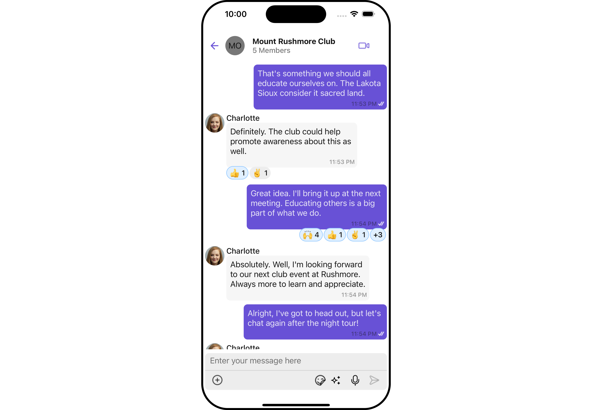
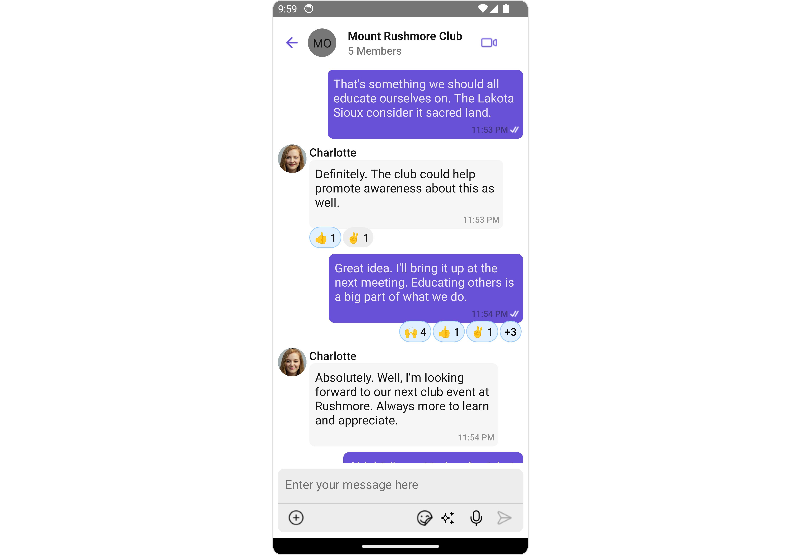
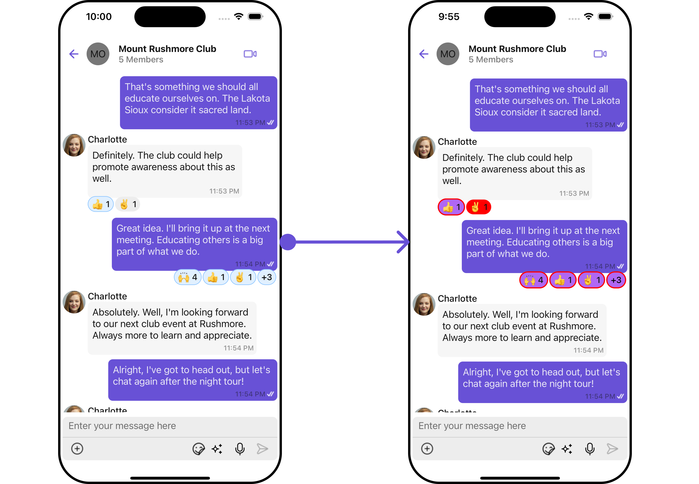
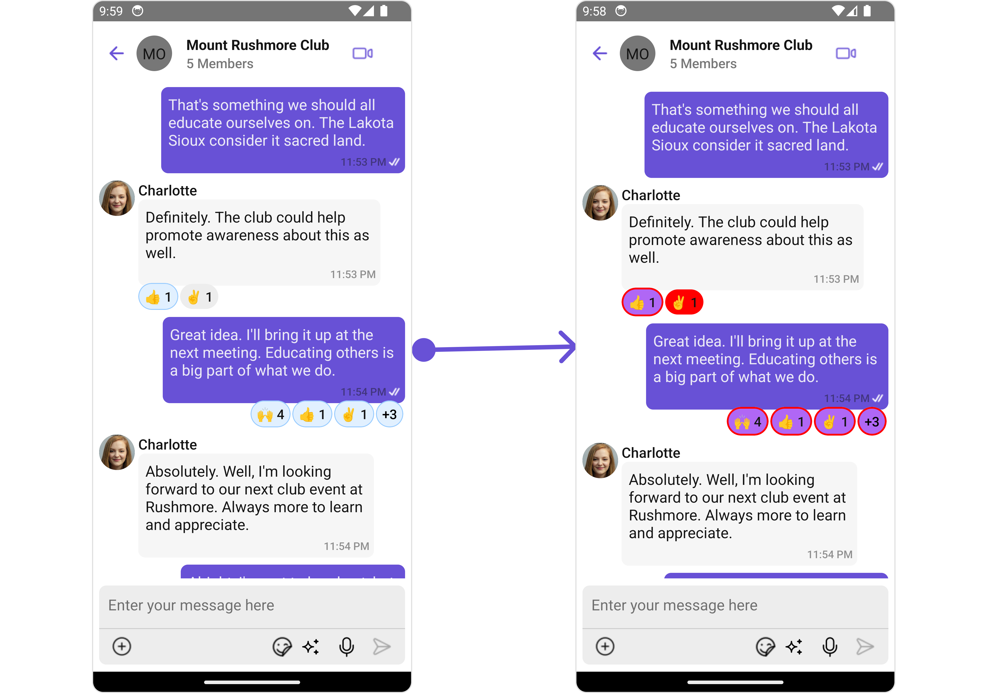

import Tabs from '@theme/Tabs';
import TabItem from '@theme/TabItem';

## Overview

The `CometChatReactions` component provides a visual representation of emoji reactions associated with a specific message. It enables users to quickly identify which emojis were used to react to the message and by whom.

<Tabs>
<TabItem value="ios" label="iOS">



</TabItem>
<TabItem value="android" label="Android">



</TabItem>
</Tabs>

## Usage

### Integration

The following code snippet illustrates how you can directly incorporate the Reactions component into your app.

<Tabs>
<TabItem value="App" label="App.tsx">

```jsx
import React from "react";
import { CometChat } from '@cometchat/chat-sdk-react-native';
import { CometChatMessages, CometChatReactions, ReactionsStyleInterface } from '@cometchat/chat-uikit-react-native';

function App(): React.JSX.Element {
    const [chatUser, setChatUser] = React.useState<CometChat.User| undefined>();
    const [message, setMessage] = React.useState<CometChat.TextMessage | undefined>(undefined);

    React.useEffect(() => {
        CometChat.getUser("uid").then((user) => {
           setChatUser(user);
        })
        CometChat.getMessageDetails(messageId).then((message: any) => {
           setMessage(message);
        });
    }, []);

    return (
     <>
         {message && <CometChatReactions
                        messageObject={message}
                      >
                     </CometChatReactions>}
     </>
   );
  }
```

</TabItem>
</Tabs>

### Actions

[Actions](/ui-kit/react-native/components-overview#actions) dictate how a component functions. They are divided into two types: Predefined and User-defined. You can override either type, allowing you to tailor the behavior of the component to fit your specific needs.

##### 1. onReactionPress

`ReactionPress` is triggered when you press on each Reaction in the footer view of message bubble. You can override this action using the following code snippet.

```typescript
onReactionPress = { onReactionPressHandler };
```

**Example**

In this example, we are employing the `onReactionPress` action.

<Tabs>
<TabItem value="typescript" label="App.tsx">

```jsx title='App.tsx'
import React from "react";
import { CometChat } from '@cometchat/chat-sdk-react-native';
import { CometChatMessages, CometChatReactions, ReactionsStyleInterface } from '@cometchat/chat-uikit-react-native';

function App(): React.JSX.Element {
    const [chatUser, setChatUser] = React.useState<CometChat.User| undefined>();
    const [message, setMessage] = React.useState<CometChat.TextMessage | undefined>(undefined);

    React.useEffect(() => {
        CometChat.getUser("uid").then((user) => {
           setChatUser(user);
        })
        CometChat.getMessageDetails(messageId).then((message: any) => {
           setMessage(message);
        });
    }, []);

    const reactionsStyle : ReactionsStyleInterface = {
       backgroundColor:'red',
       primaryBackgroundColor: "#b067f5",
       primaryBorder: {
         borderWidth: 2,
         borderStyle: 'solid',
         borderColor: 'red'
      }
    };

    const onReactionPressHandler = (reaction: CometChat.ReactionCount, messageObject: CometChat.BaseMessage) => {
       //code
    }

    return (
     <>
         {message && <CometChatReactions
                        messageObject={message}
                        style={reactionsStyle}
                        onReactionPress={onReactionPressHandler}>
                     </CometChatReactions>}
     </>
   );
  }
```

</TabItem>
</Tabs>

##### 2. onReactionLongPress

`ReactionLongPress` is triggered when you press on each Reaction in the footer view of message bubble. You can override this action using the following code snippet.

```typescript
onReactionLongPress = { onReactionLongPressHandler };
```

**Example**

In this example, we are employing the `onReactionLongPress` action.

<Tabs>
<TabItem value="typescript" label="App.tsx">

```jsx title='App.tsx'
import React from "react";
import { CometChat } from '@cometchat/chat-sdk-react-native';
import { CometChatMessages, CometChatReactions, ReactionsStyleInterface } from '@cometchat/chat-uikit-react-native';

function App(): React.JSX.Element {
    const [chatUser, setChatUser] = React.useState<CometChat.User| undefined>();
    const [message, setMessage] = React.useState<CometChat.TextMessage | undefined>(undefined);

    React.useEffect(() => {
        CometChat.getUser("uid").then((user) => {
           setChatUser(user);
        })
        CometChat.getMessageDetails(messageId).then((message: any) => {
           setMessage(message);
        });
    }, []);

    const reactionsStyle : ReactionsStyleInterface = {
       backgroundColor:'red',
       primaryBackgroundColor: "#b067f5",
       primaryBorder: {
         borderWidth: 2,
         borderStyle: 'solid',
         borderColor: 'red'
      }
    };

    const onReactionLongPressHandler = (reaction: CometChat.ReactionCount, messageObject: CometChat.BaseMessage) => {
       //long
    }

    return (
     <>
         {message && <CometChatReactions
                        messageObject={message}
                        style={reactionsStyle}
                        onReactionLongPress={onReactionLongPressHandler}
                        >
                     </CometChatReactions>}
     </>
   );
  }
```

</TabItem>
</Tabs>

---

### Filters

**Filters** allow you to customize the data displayed in a list within a `Component`. You can filter the list based on your specific criteria, allowing for a more customized. Filters can be applied using `RequestBuilders` of Chat SDK.

The `Reactions` component does not have any exposed filters.

### Events

[Events](/ui-kit/react-native/components-overview#events) are emitted by a `Component`. By using event you can extend existing functionality. Being global events, they can be applied in Multiple Locations and are capable of being Added or Removed.

The `Reactions` component does not produce any events.

## Customization

To fit your app's design requirements, you can customize the appearance of the Reaction component. We provide exposed methods that allow you to modify the experience and behavior according to your specific needs.

### Style

Using Style you can customize the look and feel of the component in your app, These parameters typically control elements such as the color, size, shape, and fonts used within the component.

##### 1. reactionsStyle

To customize the appearance, you can assign a `reactionsStyle` object to the `Reactions` component.

**Example**

In this example, we are employing the `reactionsStyle`.

<Tabs>
<TabItem value="TypeScript" label="App.tsx">

```jsx title='App.tsx'

import React from "react";
import { CometChat } from '@cometchat/chat-sdk-react-native';
import { CometChatMessages, CometChatReactions, ReactionsStyleInterface } from '@cometchat/chat-uikit-react-native';

function App(): React.JSX.Element {
    const [chatUser, setChatUser] = React.useState<CometChat.User| undefined>();
    const [message, setMessage] = React.useState<CometChat.TextMessage | undefined>(undefined);

    React.useEffect(() => {
        CometChat.getUser("uid").then((user) => {
           setChatUser(user);
        })
        CometChat.getMessageDetails(messageId).then((message: any) => {
           setMessage(message);
        });
    }, []);

    const reactionsStyle : ReactionsStyleInterface = {
       backgroundColor:'red',
       primaryBackgroundColor: "#b067f5",
       primaryBorder: {
         borderWidth: 2,
         borderStyle: 'solid',
         borderColor: 'red'
      }
    };


    return (
     <>
         {message && <CometChatReactions
                        messageObject={message}
                        onReactionPress={onReactionPressHandler}>
                     </CometChatReactions>}
     </>
   );
  }
```

</TabItem>
</Tabs>

<Tabs>
<TabItem value="ios" label="iOS">



</TabItem>
<TabItem value="android" label="Android">



</TabItem>
</Tabs>

List of properties exposed by ReactionsStyle

| Property                   | Description                                        | Code                                    |
| -------------------------- | -------------------------------------------------- | --------------------------------------- |
| **border**                 | Used to set border                                 | `border?: BorderStyleInterface`         |
| **borderRadius**           | Used to set border radius                          | `borderRadius?: number;`                |
| **backgroundColor**        | Used to set background colour                      | `background?: string;`                  |
| **height**                 | Used to set height                                 | `height?: number &#124; string;`        |
| **width**                  | Used to set width                                  | `width?: number &#124; string;`         |
| **emojiFont**              | Used to set the Emoji Font                         | `emojiFont?: FontStyle`                 |
| **countColor**             | Used to set the reactions count color              | `countColor?: string;`                  |
| **countFont**              | Used to set the reactions count font               | `countFont?: FontStyle;`                |
| **primaryBackgroundColor** | Used to set the reactions primary background color | `primaryBorder?: BorderStyleInterface;` |
| **primaryBorder**          | Used to set the primary border                     | `reactionBackground?: string;`          |

---

### Functionality

These are a set of small functional customizations that allow you to fine-tune the overall experience of the component. With these, you can change text, set custom icons, and toggle the visibility of UI elements.

<Tabs>
<TabItem value="TypeScript" label="App.tsx">

```tsx title='App.tsx'
import React from "react";
import { CometChat } from "@cometchat/chat-sdk-react-native";
import {
  CometChatMessages,
  CometChatReactions,
} from "@cometchat/chat-uikit-react-native";

function App(): React.JSX.Element {
  const [chatUser, setChatUser] = React.useState<CometChat.User | undefined>();
  const [message, setMessage] = React.useState<
    CometChat.TextMessage | undefined
  >(undefined);

  React.useEffect(() => {
    CometChat.getUser("uid").then((user) => {
      setChatUser(user);
    });
    CometChat.getMessageDetails(messageId).then((message: any) => {
      setMessage(message);
    });
  }, []);

  return (
    <>
      {message && (
        <CometChatReactions
          messageObject={message}
          alignment={"right"}
        ></CometChatReactions>
      )}
    </>
  );
}
```

</TabItem>
</Tabs>

---

Below is a customizations list along with corresponding code snippets

| Property                                                                                                     | Description                                                                                     | Code                |
| ------------------------------------------------------------------------------------------------------------ | ----------------------------------------------------------------------------------------------- | ------------------- |
| **alignment** <a data-tooltip-id="my-tooltip-html-prop"> <span class="material-icons red">report</span> </a> | Used to set the allignment of the reactions. it can be either **left**, **right** or **center** | `alignment="right"` |
