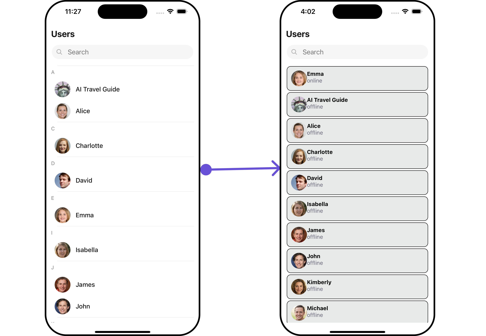

import Tabs from '@theme/Tabs';
import TabItem from '@theme/TabItem';

## Overview

The `Reaction List` component provides a comprehensive display of reactions associated with a message, showcasing which reactions were made by individual users. Additionaly, users can interact with the list to remove their own reactions.

<Tabs>
<TabItem value="ios" label="iOS">


</TabItem>
<TabItem value="android" label="Android">


</TabItem>
</Tabs>

## Usage

### Integration

The following code snippet illustrates how you can directly incorporate the Reactions list component into your app.

<Tabs>
<TabItem value="app" label="App.tsx">

```jsx
import React from "react";
import { CometChat } from '@cometchat/chat-sdk-react-native';
import { CometChatMessages, CometChatReactionList } from '@cometchat/chat-uikit-react-native';

function App(): React.JSX.Element {
    const [chatUser, setChatUser] = React.useState<CometChat.User| undefined>();
    const [message, setMessage] = React.useState<CometChat.TextMessage | undefined>(undefined);

    React.useEffect(() => {
        CometChat.getUser("uid").then((user) => {
           setChatUser(user);
        })
        CometChat.getMessageDetails(messageId).then((message: any) => {
           setMessage(message);
        });
    }, []);

    return (
     <>
           {message && <CometChatReactionList
                        messageObject={message}
                        >}
     </>
   );
  }
```

</TabItem>
</Tabs>

### Actions

[Actions](/ui-kit/react-native/components-overview#actions) dictate how a component functions. They are divided into two types: Predefined and User-defined. You can override either type, allowing you to tailor the behavior of the component to fit your specific needs.

##### 1. onPress

The `onPress` event gets activated when a user clicks on a reaction item within the CometChat Reaction List component. This event provides a way to capture and respond to user interactions with specific reactions.

<Tabs>
<TabItem value="App" label="App.tsx">

```jsx
import React from "react";
import { CometChat } from '@cometchat/chat-sdk-react-native';
import { CometChatMessages, CometChatReactionList } from '@cometchat/chat-uikit-react-native';

function App(): React.JSX.Element {
    const [chatUser, setChatUser] = React.useState<CometChat.User| undefined>();
    const [message, setMessage] = React.useState<CometChat.TextMessage | undefined>(undefined);

    React.useEffect(() => {
        CometChat.getUser("uid").then((user) => {
           setChatUser(user);
        })
        CometChat.getMessageDetails(messageId).then((message: any) => {
           setMessage(message);
        });
    }, []);

    const onReactionListPressHandler = (messageReaction: CometChat.Reaction, messageObject: CometChat.BaseMessage)  => {
       //code
    }

    return (
     <>
           {message && <CometChatReactionList
                        messageObject={message}
                        onPress={onReactionListPressHandler}
                        >}
     </>
   );
  }
```

</TabItem>
</Tabs>

---

### Filters

**Filters** allow you to customize the data displayed in a list within a `Component`. You can filter the list based on your specific criteria, allowing for a more customized. Filters can be applied using `RequestBuilders` of Chat SDK.

You can adjust the `ReactionsRequestBuilder` in the Reaction list Component to customize your Reaction list. Numerous options are available to alter the builder to meet your specific needs. For additional details on `ReactionsRequestBuilder`, please visit [ReactionsRequestBuilder](/sdk/react-native/reactions).

In the example below, we demonstrate the application of a filter to the `reactions list`. This filter allows you to fetch list of Reaction for a specific reaction.

<Tabs>
<TabItem value="App" label="App.tsx">

```jsx
import React from "react";
import { CometChat } from '@cometchat/chat-sdk-react-native';
import { CometChatMessages, CometChatReactionList } from '@cometchat/chat-uikit-react-native';

function App(): React.JSX.Element {
    const [chatUser, setChatUser] = React.useState<CometChat.User| undefined>();
    const [message, setMessage] = React.useState<CometChat.TextMessage | undefined>(undefined);

    React.useEffect(() => {
        CometChat.getUser("uid").then((user) => {
           setChatUser(user);
        })
        CometChat.getMessageDetails(messageId).then((message: any) => {
           setMessage(message);
        });
    }, []);

    const reactionRequestBuilder : CometChat.ReactionsRequestBuilder = new CometChat.ReactionsRequestBuilder();
    reactionRequestBuilder.setReaction("✌");

    return (
     <>
           {message && <CometChatReactionList
                        messageObject={message}
                        reactionRequestBuilder={reactionRequestBuilder}
                        >}
     </>
   );
  }
```

</TabItem>
</Tabs>

### Events

[Events](/ui-kit/react-native/components-overview#events) are emitted by a `Component`. By using event you can extend existing functionality. Being global events, they can be applied in Multiple Locations and are capable of being Added or Removed.

The `Reactions list` component does not produce any events.

## Customization

To fit your app's design requirements, you can customize the appearance of the Reaction List component. We provide exposed methods that allow you to modify the experience and behavior according to your specific needs.

### Style

Using Style you can customize the look and feel of the component in your app, These parameters typically control elements such as the color, size, shape, and fonts used within the component.

##### 1. reactionListStyle

To customize the appearance, you can assign a `reactionListStyle` object to the `Reactions List` component.

**Example**

In this example, we are employing the `reactionListStyle`.

<Tabs>
<TabItem value="App" label="App.tsx">

```jsx
import React from "react";
import { CometChat } from '@cometchat/chat-sdk-react-native';
import { CometChatReactionList, ReactionListStyleInterface } from '@cometchat/chat-uikit-react-native';

function App(): React.JSX.Element {
    const [chatUser, setChatUser] = React.useState<CometChat.User| undefined>();
    const [message, setMessage] = React.useState<CometChat.TextMessage | undefined>(undefined);

    React.useEffect(() => {
        CometChat.getUser("uid").then((user) => {
           setChatUser(user);
        })
        CometChat.getMessageDetails(messageId).then((message: any) => {
           setMessage(message);
        });
    }, []);

    const reactionListStyle : ReactionListStyleInterface  = {
       subtitleColor: "red",
       separatorColor: "black"
    }

    return (
     <>
           {message && <CometChatReactionList
                        messageObject={message}
                        reactionListStyle={reactionListStyle}
                        >}
     </>
   );
  }
```

</TabItem>
</Tabs>

<Tabs>
<TabItem value="ios" label="iOS">


</TabItem>
<TabItem value="android" label="Android">


</TabItem>
</Tabs>

List of properties exposed by ReactionsListStyle

| Property                  | Description                                     | Code                                |
| ------------------------- | ----------------------------------------------- | ----------------------------------- |
| **border**                | Used to set border                              | `border?: BorderStyleInterface;`    |
| **borderRadius**          | Used to set border radius                       | `borderRadius?: number;`            |
| **backgroundColor**       | Used to set background colour                   | `backgroundColor?: string;`         |
| **height**                | Used to set height                              | `height?: string` &#124; ` number;` |
| **width**                 | Used to set width                               | `width?: string` &#124; ` number;`  |
| **sliderEmojiFont**       | used to set the font of slider emoji            | `sliderEmojiFont?: FontStyle;`      |
| **sliderEmojiCountFont**  | used to set the font of the slider emoji count  | `sliderEmojiCountFont?: FontStyle;` |
| **sliderEmojiCountColor** | used to set the color of the slider emoji count | `sliderEmojiCountColor?: string;`   |
| **activeEmojiBackground** | used to set the active emoji background         | `activeEmojiBackground?: string;`   |
| **loadingTint**           | used to set the loading icon color              | `loadingTint?: string;`             |
| **errorIconTint**         | used to set the error icon color                | `errorIconTint?: string;`           |
| **tailViewFont**          | used to set the tail view font                  | `tailViewFont?: FontStyle;`         |
| **subtitleFont**          | used to set the subtitle text font              | `subtitleFont?: FontStyle;`         |
| **subtitleColor**         | used to set the subtitle text color             | `subtitleColor?: string;`           |

---

##### 2. Avatar Style

If you want to apply customized styles to the `Avatar` component within the `Reaction List` Component, you can use the following code snippet. For more information you can refer [Avatar Styles](/ui-kit/react-native/avatar#avatarstyleinterface).

<Tabs>
<TabItem value="App" label="App.tsx">

```jsx
import React from "react";
import { CometChat } from '@cometchat/chat-sdk-react-native';
import { AvatarStyleInterface, CometChatReactionList } from '@cometchat/chat-uikit-react-native';

function App(): React.JSX.Element {
    const [chatUser, setChatUser] = React.useState<CometChat.User| undefined>();
    const [message, setMessage] = React.useState<CometChat.TextMessage | undefined>(undefined);

    React.useEffect(() => {
        CometChat.getUser("uid").then((user) => {
           setChatUser(user);
        })
        CometChat.getMessageDetails(messageId).then((message: any) => {
           setMessage(message);
        });
    }, []);

    const avatarStyle : AvatarStyleInterface  = {
       border: {
         borderStyle: "solid",
         borderColor: "red",
         borderWidth: 2
       }
    }

    return (
     <>
           {message && <CometChatReactionList
                        messageObject={message}
                        avatarStyle={avatarStyle}
                        >}
     </>
   );
  }
```

</TabItem>
</Tabs>

##### 3. ListItem Style

If you want to apply customized styles to the `ListItemStyle` component within the `Reaction List` Component, you can use the following code snippet. For more information, you can refer [ListItem Styles](/ui-kit/react-native/list-item#listitemstyle).

<Tabs>
<TabItem value="App" label="App.tsx">

```jsx
import React from "react";
import { CometChat } from '@cometchat/chat-sdk-react-native';
import { ListItemStyleInterface, CometChatReactionList } from '@cometchat/chat-uikit-react-native';

function App(): React.JSX.Element {
    const [chatUser, setChatUser] = React.useState<CometChat.User| undefined>();
    const [message, setMessage] = React.useState<CometChat.TextMessage | undefined>(undefined);

    React.useEffect(() => {
        CometChat.getUser("uid").then((user) => {
           setChatUser(user);
        })
        CometChat.getMessageDetails(messageId).then((message: any) => {
           setMessage(message);
        });
    }, []);

    const listItemStyle : ListItemStyleInterface = {
       backgroundColor: "#e3e2de",
       titleColor: "red"
    }


    return (
     <>
           {message && <CometChatReactionList
                        messageObject={message}
                        listItemStyle={listItemStyle}
                        >}
     </>
   );
  }
```

</TabItem>
</Tabs>

<Tabs>
<TabItem value="ios" label="iOS">



</TabItem>
<TabItem value="android" label="Android">


</TabItem>
</Tabs>

---

### Functionality

These are a set of small functional customizations that allow you to fine-tune the overall experience of the component. With these, you can change text, set custom icons, and toggle the visibility of UI elements.

<Tabs>
<TabItem value="App" label="App.tsx">

```jsx
import React from "react";
import { CometChat } from '@cometchat/chat-sdk-react-native';
import { CometChatReactionList } from '@cometchat/chat-uikit-react-native';

function App(): React.JSX.Element {
    const [chatUser, setChatUser] = React.useState<CometChat.User| undefined>();
    const [message, setMessage] = React.useState<CometChat.TextMessage | undefined>(undefined);

    React.useEffect(() => {
        CometChat.getUser("uid").then((user) => {
           setChatUser(user);
        })
        CometChat.getMessageDetails(messageId).then((message: any) => {
           setMessage(message);
        });
    }, []);


    return (
     <>
           {message && <CometChatReactionList
                        messageObject={message}
                        loadingIconURL={"custom loading icon ImageSourceURI"}
                        >}
     </>
   );
  }
```

</TabItem>
</Tabs>

---

Below is a customizations list along with corresponding code snippets

| Property           | Description                         | Code                                                    |
| ------------------ | ----------------------------------- | ------------------------------------------------------- |
| **loadingIconURL** | used to set the custom loading icon | `loadingIconURL={"custom loading icon ImageSourceURI"}` |
