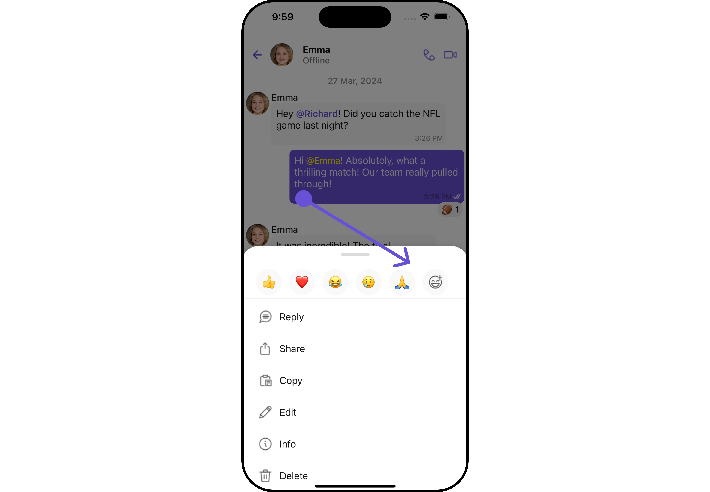
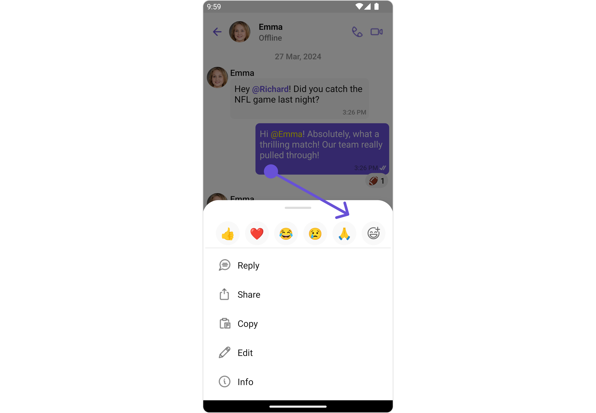

import Tabs from '@theme/Tabs';
import TabItem from '@theme/TabItem';

## Overview

`CometChatQuickReactions` is a component designed to display a row of reactions that users can apply to messages. Initially, it shows favorite reactions along with a plus icon. Tapping the plus icon opens the CometChatEmojiKeyboard, providing access to a broader range of reactions. Selecting a reaction from the keyboard or the favorite reactions list automatically applies it to the respective message.

The quick reactions list can have a minimum of 1 and a maximum of 5 reactions.

This component is typically activated by long-pressing a message bubble in the message list.

<Tabs>

<TabItem value="iOS" label="iOS">



</TabItem>

<TabItem value="android" label="Android">



</TabItem>

</Tabs>

## Usage

### Integration

`CometChatQuickReactions` is a component that displays a list of favorite reactions with a plus button. The component requires a list of favorite reactions to function, which can be supplied using the `quick reactions` property.

<Tabs>

<TabItem value="App.tsx" label="App.tsx">

```tsx
import { CometChat } from "@cometchat/chat-sdk-react-native";
import { CometChatQuickReactions } from "@cometchat/chat-uikit-react-native";

function App(): React.JSX.Element {
  return <CometChatQuickReactions> </CometChatQuickReactions>;
}
```

</TabItem>
</Tabs>

### Actions

[Actions](/ui-kit/react-native/components-overview#actions) dictate how a component functions. They are divided into two types: Predefined and User-defined. You can override either type, allowing you to tailor the behavior of the component to fit your specific needs.

##### 1. onReactionPress

The `onReactionPress` action is activated when an emoji is pressed from the `QuickReactions` List.

<Tabs>

<TabItem value="App.tsx" label="App.tsx">

```tsx
import { CometChat } from "@cometchat/chat-sdk-react-native";
import { CometChatQuickReactions } from "@cometchat/chat-uikit-react-native";

function App(): React.JSX.Element {
  const onQuickReactionPressHandler = (emoji: string) => {
    //code
  };

  return (
    <CometChatQuickReactions onReactionPress={onQuickReactionPressHandler}>
      {" "}
    </CometChatQuickReactions>
  );
}
```

</TabItem>
</Tabs>

##### 2. onAddReactionPress

The `onAddReactionPress` action is activated when the add reaction icon is pressed.

<Tabs>

<TabItem value="App.tsx" label="App.tsx">

```tsx
import { CometChat } from "@cometchat/chat-sdk-react-native";
import { CometChatQuickReactions } from "@cometchat/chat-uikit-react-native";

function App(): React.JSX.Element {
  const addReactionPressHandler = () => {
    //code
  };

  return (
    <CometChatQuickReactions onAddReactionPress={addReactionPressHandler}>
      {" "}
    </CometChatQuickReactions>
  );
}
```

</TabItem>
</Tabs>

---

### Filters

**Filters** empower you to customize the displayed data within a component's list by applying specific criteria. This capability allows for a more tailored and personalized view of the content. Filters are implemented using RequestBuilders of Chat SDK.

The ` Quick Reactions` component does not provide any exposed filtering options.

---

### Events

**Events** are triggered by a component, enabling you to enhance its functionality. These events are global in scope, making them applicable across multiple areas of your application, and they can be added or removed as required.

The `Quick Reactions` component does not provide any available events.

---

## Customization

For customization aligned with your app's design, you can adjust the appearance of the Quick Reaction component using our accessible methods. These methods enable you to tailor the experience and behavior to suit your specific needs.

### Style

Through Style, you can customize the visual presentation of the component in your app. This includes controlling elements such as color, size, shape, and fonts to achieve the desired look and feel.

##### 1. Quick Reaction Style

`QuickReactionsStyle` is a class designed for customizing the visual styles of the CometChatQuickReactions view. It enables developers to easily modify colors, borders, backgrounds, and other visual attributes to align the QuickReactions component with the overall design aesthetics of their application.

This class is essential for enhancing user experience and ensuring visual consistency within the messaging interface.

<Tabs>

<TabItem value="App.tsx" label="App.tsx">

```tsx
import { CometChat } from "@cometchat/chat-sdk-react-native";
import {
  CometChatQuickReactions,
  QuickReactionsStyleInterface,
} from "@cometchat/chat-uikit-react-native";

function App(): React.JSX.Element {
  const quickReactionsStyle: QuickReactionsStyleInterface = {
    backgroundColor: "#b5a7fc",
    addReactionIconTint: "#8872f7",
    emojiBackgroundColor: "#dddaed",
  };

  return (
    <CometChatQuickReactions style={quickReactionsStyle}>
      {" "}
    </CometChatQuickReactions>
  );
}
```

</TabItem>
</Tabs>

**Example**

Here, we are applying the `QuickReactionsStyle` to customize the appearance.

<Tabs>

<TabItem value="iOS" label="iOS">


</TabItem>

<TabItem value="android" label="Android">


</TabItem>

</Tabs>

The following properties are exposed by MessageInformationStyle:

| Property                 | Description                          | Code                               |
| ------------------------ | ------------------------------------ | ---------------------------------- |
| **border**               | Used to set border                   | `border?: BorderStyleInterface,`   |
| **borderRadius**         | Used to set border radius            | `borderRadius?: number;`           |
| **backgroundColor**      | Used to set background colour        | `background?: string;`             |
| **height**               | Used to set height                   | `height?: number` &#124; `string;` |
| **width**                | Used to set width                    | `width?: number` &#124; `string;`  |
| **emojiBackgroundColor** | Sets the background color            | `emojiBackgroundColor?: string`    |
| **addReactionIconTint**  | Sets the tint for add reaction icon  | `addReactionIconTint?: string`     |
| **borderBottomColor**    | Sets the color for the bottom border | `borderBottomColor?: string`       |

---

### Functionality

These functional customizations provide ways to enhance the component's overall experience. They allow for text modification, custom icon setting, and UI element visibility toggling.

<Tabs>

<TabItem value="App.tsx" label="App.tsx">

```tsx
import { CometChat } from "@cometchat/chat-sdk-react-native";
import {
  CometChatQuickReactions,
  QuickReactionsStyleInterface,
} from "@cometchat/chat-uikit-react-native";

function App(): React.JSX.Element {
  const quickReactions: [string, string?, string?, string?, string?] = [
    "👋",
    "🤚",
    "🖐",
    "🖖",
    "👌",
  ];

  return (
    <CometChatQuickReactions quickReactions={quickReactions}>
      {" "}
    </CometChatQuickReactions>
  );
}
```

</TabItem>
</Tabs>

<Tabs>

<TabItem value="iOS" label="iOS">


</TabItem>

<TabItem value="android" label="Android">


</TabItem>

</Tabs>

Below is a customizations list along with corresponding code snippets

| Property           | Description                                     | Code                                                            |
| ------------------ | ----------------------------------------------- | --------------------------------------------------------------- |
| **quickReactions** | Used to add custom emoji in quick reactions tab | `quickReactions?: [string, string?, string?, string?, string?]` |
| **addReactionUrl** | Used to set custom add reaction button icon.    | `addReactionUrl?: ImageType`                                    |

### Advanced

For advanced-level customization, you can set custom views to the component. This lets you tailor each aspect of the component to fit your exact needs and application aesthetics. You can create and define your views, layouts, and UI elements and then incorporate those into the component.

The `Quick Reactions` component does not offer any advanced functionalities beyond this level of customization.

---
