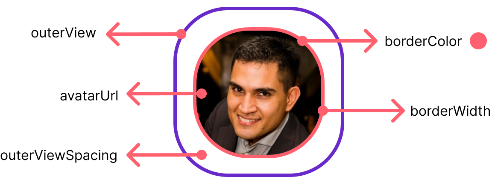

import Tabs from '@theme/Tabs';
import TabItem from '@theme/TabItem';


The `CometChatAvatar` component displays user and group avatars. For users and groups , it displays either an image or the user's avatar and falls back to the first two letters of the username.



## How to integrate CometChatAvatar ?

`CometChatAvatar` can be used by adding the following code snippet.

<Tabs>
<TabItem value="ts2" label="Typescript">

```typescript
<CometChatAvatar
  image={avatarImage}
  name={avatarName}
  style={avatarStyle}
 />
```


</TabItem>
</Tabs>


---

## Properties

| Properties | Type                                                  | Description                                    |
| ---------- | ----------------------------------------------------- | ---------------------------------------------- |
| image      | ImageType                                             | Image to display                               |
| name       | string                                                | Name letters to display if image is not loaded |
| style      | [AvatarStyleInterface](./avatar#avatarstyleinterface) | used to customize appearance of the Avatar     |


## AvatarStyleInterface

| Properties       | Type                 | Description                           |
| ---------------- | -------------------- | ------------------------------------- |
| backgroundColor  | string               | Sets the background colour for Avatar |
| height           | number &#124; string | Sets height for Avatar                |
| width            | number &#124; string | Sets the border width for Avatar      |
| border           | BorderStyleInterface | Sets the border colour for Avatar     |
| borderRadius     | number               | Sets border radius for Avatar         |
| nameTextFont     | FontStyleInterface   | Sets the text font for Avatar         |
| nameTextColor    | string               | Sets the text colour for Avatar       |
| outerView        | BorderStyleInterface | Sets the outerView width for Avatar   |
| outerViewSpacing | number               | Sets the outerView spacing for Avatar |


<Tabs>
<TabItem value="ts2" label="Typescript">

```typescript
<CometChatAvatar
  image={avatarImage}
  name="Andrew Joseph"
  style={{ borderRadius: 8, height: 100, width: 100 }}
/>
```


</TabItem>
</Tabs>