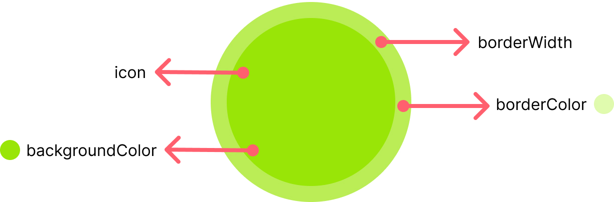

import Tabs from '@theme/Tabs';
import TabItem from '@theme/TabItem';

`CometChatStatusIndicator` is a customised component which indicates whether user is online or offline.



## How to integrate CometChatStatusIndicator ?

<Tabs>
<TabItem value="ts2" label="Typescript">

```typescript
<CometChatStatusIndicator
        backgroundImage={statusIndicatorIcon}
        style={{height: 20, width: 20}}
        backgroundColor={"green"}
      />
```


</TabItem>
</Tabs>


## Properties

| Properties | Type | Description | 
| ---- | ---- | ---- | 
| backgroundImage | ImageType | sets image to be shown | 
| style | StyleProp&lt;ViewStyle&gt; | used to customise the statusIndicator | 
| backgroundColor | string | used to set the background colour of statusIndicator view | 
