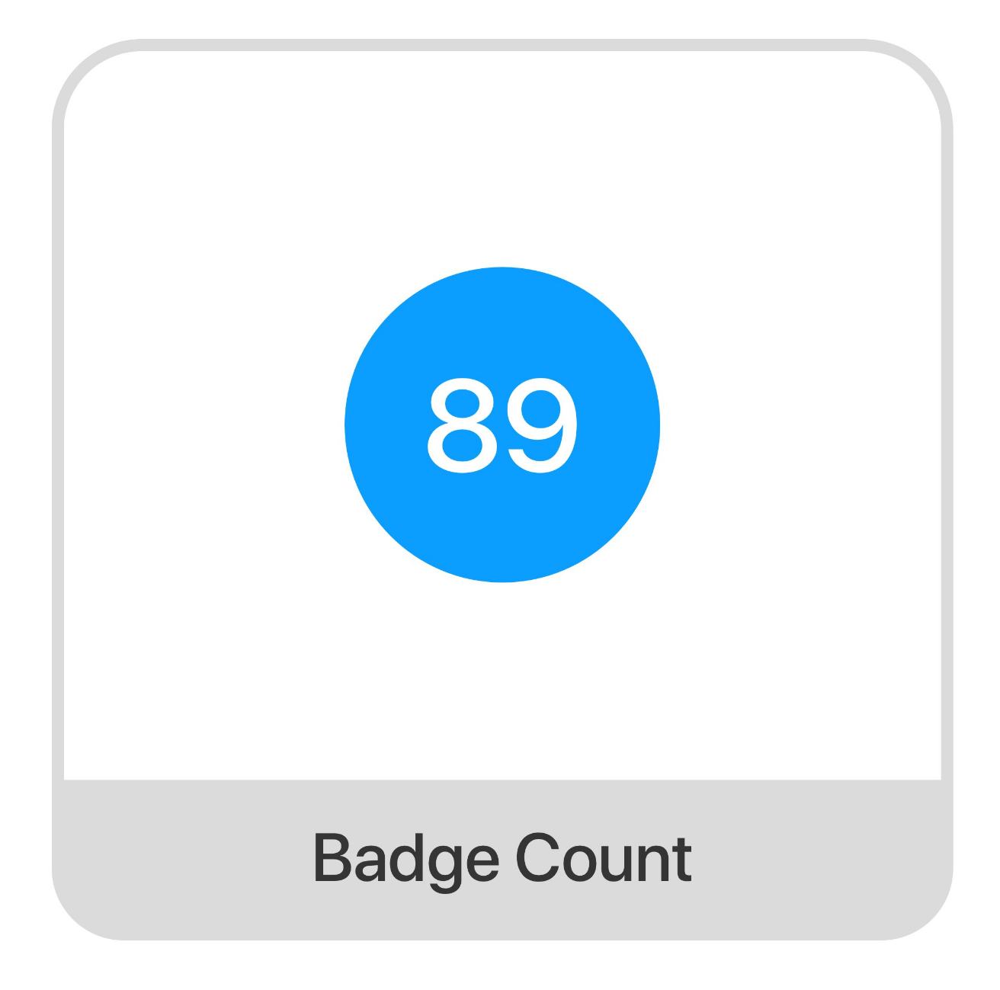

import Tabs from '@theme/Tabs';
import TabItem from '@theme/TabItem';

The `CometChatBadgeCount` component displays the unread count of messages for one-to-one private and group chats.



---

## How to integrate CometChatBadge ?

<Tabs>
<TabItem value="ts2" label="Typescript">

```typescript
<CometChatBadge
    count={count}
    style={badgeStyle}
  />
```


</TabItem>
</Tabs>


## Properties

| Properties | Type                                                             | Description                                   |
| ---------- | ---------------------------------------------------------------- | --------------------------------------------- |
| `count`    | number                                                           | number to display                             |
| style      | [CometChatBadgeInterface](./badge#cometchatbadgeinterface) | used to customise the appearance of this view |


## CometChatBadgeInterface

| Properties      | Type                 | Description                           |
| --------------- | -------------------- | ------------------------------------- |
| textColor       | string               | colour of the text shown in the badge |
| textFont        | FontStyleInterface   | font of the text shown in the badge   |
| height          | number &#124; string | height of the badge                   |
| width           | number &#124; string | width of the badge                    |
| backgroundColor | string               | colour of the badge                   |
| border          | BorderStyleInterface | border of the badge                   |
| borderRadius    | number               | radius of the badge                   |


<Tabs>
<TabItem value="ts2" label="Typescript">

```typescript
<CometChatBadge
    count={badgeCount}
     style={{
        height: 100,
        width: 100,
        textFont: { fontSize: 32 },
        backgroundColor: "red"
    }}
 />
```


</TabItem>
</Tabs>


---