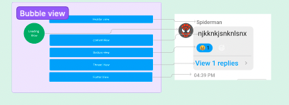

import Tabs from '@theme/Tabs';
import TabItem from '@theme/TabItem';

## Overview

`CometChatMessageBubble` is the reusable  components which forms different types of message bubbles accordingly.

There are different section available in message bubble which can be altered by passing `CometChatMessageTemplate` in `CometChatMessages`

## Sections

Following are the sections in message bubble

1. Header View
2. Leading View
3. Content View
4. Bottom View
5. Thread View
6. footer view

#### Properties

| Properties | Type | Description | 
| ---- | ---- | ---- | 
| **LeadingView** | () =&gt; JSX.Element | used to set view in leading View section | 
| **headerView** | () =&gt; JSX.Element | used to set view in header view section | 
| **replyView** | () =&gt; JSX.Element | used to set view in  reply view section | 
| **contentView** | () =&gt; JSX.Element | used to set content view , by default all different type of bubble are shown here | 
| **threadView** | () =&gt; JSX.Element | used to set view in thread view section , by default threaded section is shown | 
| **footerView** | () =&gt; JSX.Element | used to set footer view for message bubble , by default message receipt is shown | 
| **alignment** | 'left' &#124; 'right' &#124; 'center' | used to set bubble alignment , can be **left**, **right** and **centar** | 
| **style** | [MessageBubbleStyle](./message-bubble#style) | used to set styling properties foe message bubble | 
| **bottomView** | () =&gt; JSX.Element | used to set bottom view for message bubble , by default reactions are shown here | 

### style

| Properties | Type | Description | 
| ---- | ---- | ---- | 
| **height** | string &#124; number | used to set height | 
| **width** | string &#124; number | used to set width | 
| **backgroundColor** | string | used to set the background colour | 
| **border** | BorderStyle | used to set border | 
| **borderRadius** | number | used to set border radius | 
