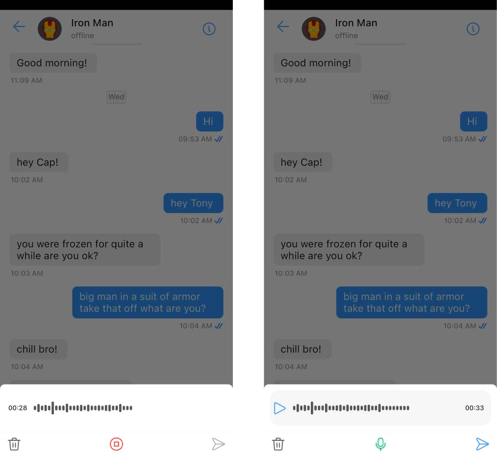

import Tabs from '@theme/Tabs';
import TabItem from '@theme/TabItem';

`CometChatMediaRecorder` is a class that allows users to record and send audio messages. It has a start button to start recording, a stop button to stop recording, a play button to play the recorded message, a pause button to pause the recorded message, a submit button to submit the recorded message and a close button to close the media recorder.



Usage

CometChatMediaRecorder can be used as a child component inside another component or be launched with a bottom/modal sheet.

<Tabs>
<TabItem value="ts2" label="Typescript">

```typescript
<CometChatBottomSheet
      ref={sheetRef}
      onClose={onClose}
      style={cometChatBottomSheetStyle}
    >
      <CometChatMediaRecorder
        onClose={onClose}
        onPause={onPause}
        onPlay={onPlay}
        onSend={onSend}
        onStop={onStop}
        onStart={onStart}
        recordedFile={recordedFile}
        recordedPlaying={recordedPlaying}
        mediaRecorderStyle={mediaRecorderStyle}
        pauseIconUrl={pauseIconUrl}
        playIconUrl={playIconUrl}
        recordIconUrl={recordIconUrl}
        deleteIconUrl={deleteIconUrl}
        stopIconUrl={stopIconUrl}
        submitIconUrl={submitIconUrl}
      />
    </CometChatBottomSheet>
```


</TabItem>
</Tabs>


## Properties

| Property | Type | Description | 
| ---- | ---- | ---- | 
| **onClose** | Function | a callback executed on tapping the close icon | 
| **onPlay** | Function | a callback executed on tapping the play icon | 
| **onPause** | Function | a callback executed on tapping the pause icon | 
| **onStop** | Function | a callback executed on tapping the stop icon | 
| **onSend** | Function | a callback executed on tapping the send icon | 
| **onStart** | Function | a callback executed on tapping the start icon | 
| **mediaRecorderStyle** | MediaRecorderStyle | used to customize the appearance of CometChatMediaRecorder | 
| **recordedFile** | String | used to get the recorded audio file path | 
| **recordedPlaying** | boolean | used to set the play and pause of the recording | 
| **pauseIconUrl** | Image | provides icon to the pause Icon | 
| **playIconUrl** | Image | used to set the play Icon | 
| **recordIconUrl** | Image | used to set record Icon | 
| **deleteIconUrl** | Image | used to set delete Icon | 
| **stopIconUrl** | Image | used to set stop Icon | 
| **submitIconUrl** | Image | used to set submit Icon | 


### mediaRecorderStyle

A MediaRecorderStyle object is used to customize the appearance of CometChatMediaRecorder.

<Tabs>
<TabItem value="ts2" label="Typescript">

```typescript
// create a MediaRecorderStyle object
const mediaRecorderStyle = new MediaRecorderStyle({
        pauseIconTint = "rgb(51, 153, 255)",
        playIconTint = "rgb(51, 153, 255)",
        closeIconTint = "rgba(20, 20, 20, 0.58)",
        startIconTint = "rgb(51, 153, 255)",
        stopIconTint = "rgb(237, 26, 26)",
        submitIconTint = "rgba(237, 26, 26)",
        audioBarTint = "rgba(20, 20, 20, 0.58)",
        timerTextFont = undefined,
        timerTextstyle = "normal",
        timerTextColor = theme?.palette.getAccent50(),
        ...messagesStyle
    });

// pass that MediaRecorderStyle object to CometChatMediaRecorder
<CometChatMediaRecorder
  ...
  mediaRecorderStyle={mediaRecorderStyle}
  ...
/>
```


</TabItem>
</Tabs>


