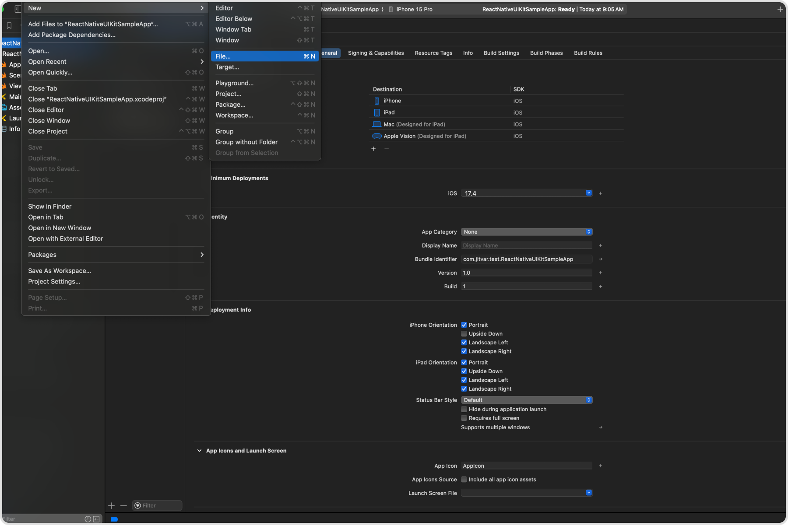
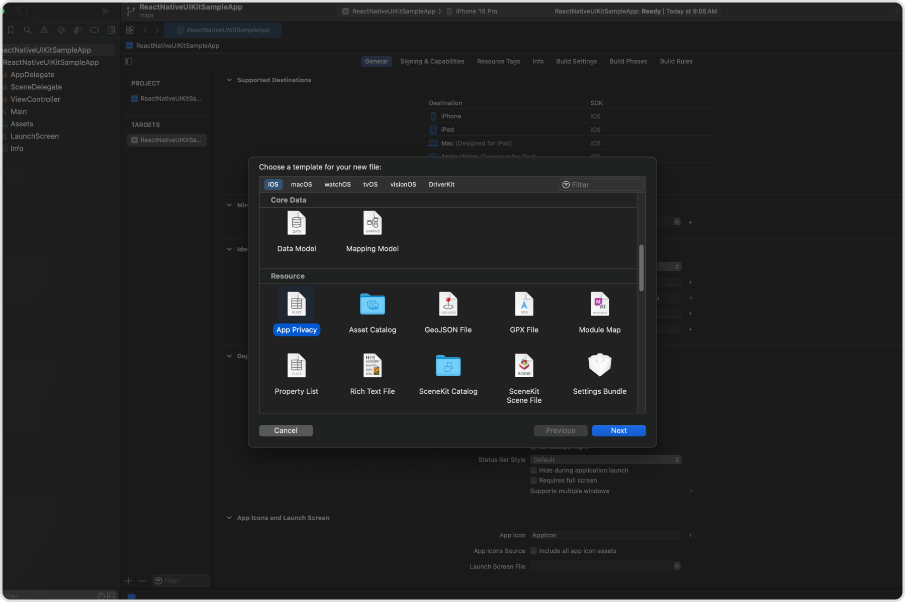
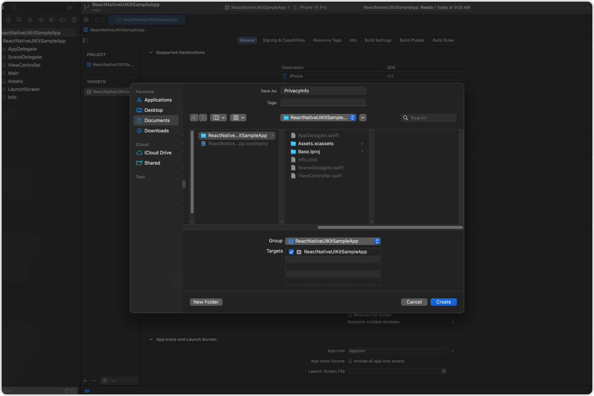
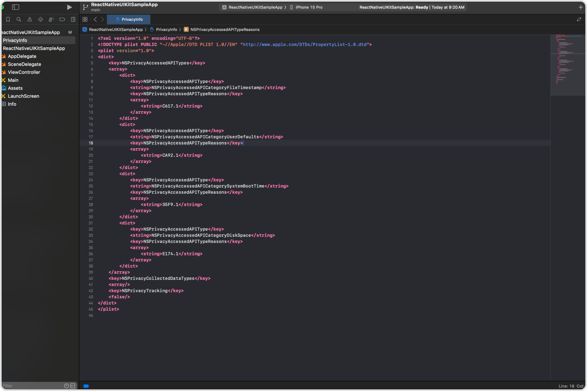

## Overview

The Apple Privacy Manifest plays a critical role in enhancing privacy and transparency for apps on Apple's platforms. As part of Apple's commitment to user privacy and data security, they introduced a new feature called the "App Privacy Details" section, which is essentially a 'privacy label' for each app.

The privacy manifest is a property list that records the following information:

- The types of data collected by an app or third-party SDK.
- The required reasons APIs an app or third-party SDK uses.

For each type of data an app or third-party SDK collects and category of required reasons API it uses, the app or third-party SDK needs to record the reasons in its bundled privacy manifest file.

## React Native UIkit's Privacy Manifest

If you are using React Native UI Kit you need to add the following entries to your Privacy Manifest File.

1. **React Native**

   React Native as a framework uses a few of the APIs that need to be added to your application. you can find more information on their GitHub [thread](https://github.com/react-native-community/discussions-and-proposals/discussions/776).

1. **SPTPersistentCache**

   React Native UI Kit uses a Native Module which is a fork of react-native-video library. This native module has an internal dependency on SPTPersistentCache. This library uses one of the APIs listed by Apple.

Below is the finalized Privacy Manifest that should be included in your application for seamless integration and adherence to privacy regulations

```xml title="PrivacyInfo.xcprivacy"
<?xml version="1.0" encoding="UTF-8"?>
<!DOCTYPE plist PUBLIC "-//Apple//DTD PLIST 1.0//EN" "http://www.apple.com/DTDs/PropertyList-1.0.dtd">
<plist version="1.0">
<dict>
    <key>NSPrivacyAccessedAPITypes</key>
    <array>
        <dict>
            <key>NSPrivacyAccessedAPIType</key>
            <string>NSPrivacyAccessedAPICategoryFileTimestamp</string>
            <key>NSPrivacyAccessedAPITypeReasons</key>
            <array>
                <string>C617.1</string>
            </array>
        </dict>
        <dict>
            <key>NSPrivacyAccessedAPIType</key>
            <string>NSPrivacyAccessedAPICategoryUserDefaults</string>
            <key>NSPrivacyAccessedAPITypeReasons</key>
            <array>
                <string>CA92.1</string>
            </array>
        </dict>
        <dict>
            <key>NSPrivacyAccessedAPIType</key>
            <string>NSPrivacyAccessedAPICategorySystemBootTime</string>
            <key>NSPrivacyAccessedAPITypeReasons</key>
            <array>
                <string>35F9.1</string>
            </array>
        </dict>
        <dict>
            <key>NSPrivacyAccessedAPIType</key>
            <string>NSPrivacyAccessedAPICategoryDiskSpace</string>
            <key>NSPrivacyAccessedAPITypeReasons</key>
            <array>
                <string>E174.1</string>
            </array>
        </dict>
    </array>
    <key>NSPrivacyCollectedDataTypes</key>
    <array/>
    <key>NSPrivacyTracking</key>
    <false/>
</dict>
</plist>
```

## Steps to Create a Privacy Manifest

To add the privacy manifest to your application. You will need to open Xcode,

1. Choose `File > New > File...`
   
1. Scroll down to the Resource section. Select the App Privacy file type, click `Next`.
   
1. Select the target, then click `Create`.
   
1. By default, the file is named `PrivacyInfo.xcprivacy`. Don’t change the filename.
1. This will create an empty `Privacy Manifest` file. You need to replace the content of the file with the manifest shared above.
   
