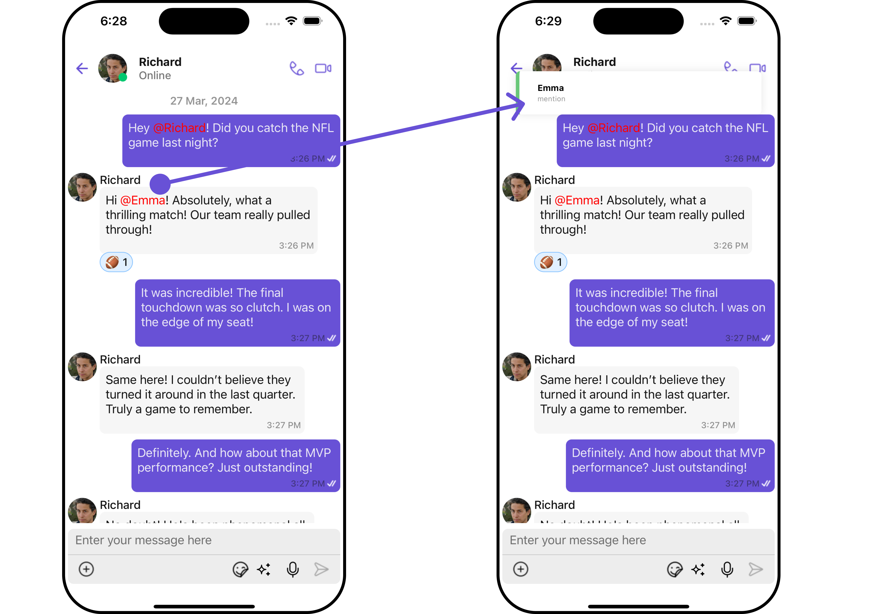
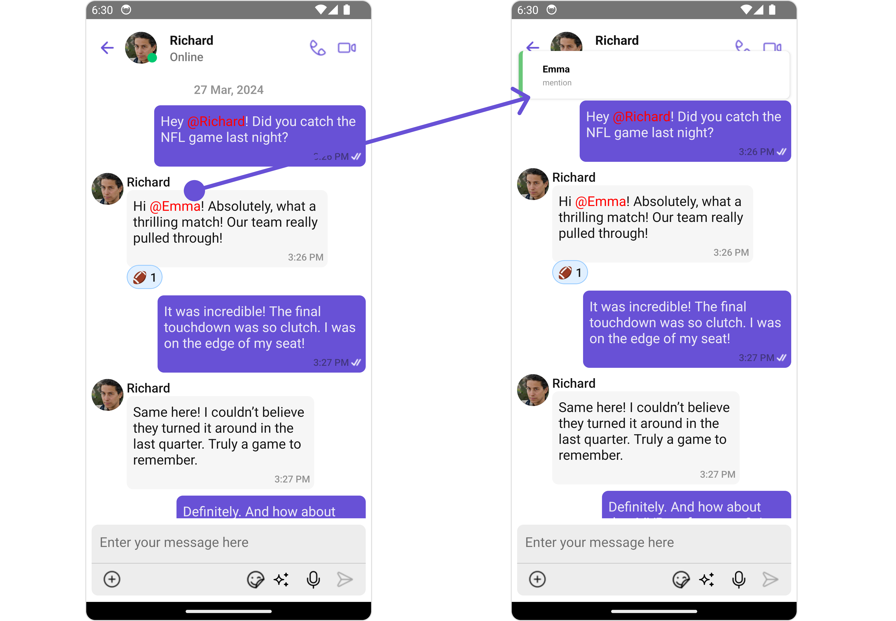

import Tabs from '@theme/Tabs';
import TabItem from '@theme/TabItem';

## Overview

The `CometChatMentionsFormatter` class is a part of the CometChat UI Kit, a ready-to-use chat UI component library for integrating CometChat into your Android applications. This class provides functionality to format mentions within text messages displayed in the chat interface. Mentions allow users to reference other users within a conversation, providing a convenient way to direct messages or involve specific participants.

## Features

- **Mention Formatting**: Automatically formats mentions within text messages based on provided styles and settings.
- **Customizable Styles**: Allows customization of text styles for mentions, including colors, fonts, and background colors.
- **User and Group Member Mentions**: Supports mentions for both individual users and group members, providing flexibility in communication scenarios.
- **Mention List Generation**: Generates a list of suggested mentions based on user input, facilitating easy selection of recipients during message composition.
- **Mention Click Handling**: Provides a listener interface for handling click events on mentions, enabling custom actions to be performed when a mention is tapped by the user.

## Usage

To integrate the `CometChatMentionsFormatter` class into your application:

1. **Initialization**: Create an instance of the `CometChatMentionsFormatter` class and configure it with desired settings, such as mention text styles and limit settings.
2. **Set Mention Listeners**: Set listeners for handling mention click events (`setOnMentionCLick`).

3. **Customization**: Customize the appearance and behavior of mentions by adjusting the text styles, colors, and other formatting properties as needed.

Below is an example demonstrating how to use the `CometChatMentionsFormatter` class in components such as [CometChatConversations](./conversations), [CometChatMessageList](./message-list), [CometChatMessageComposer](./message-composer).

<Tabs>
<TabItem value="ts" label="Typescript">

```typescript
// Initialize CometChatMentionsFormatter
const mentionsFormatter: CometChatMentionsFormatter =
  new CometChatMentionsFormatter();
const textFormatters: Array<CometChatTextFormatter> = [mentionsFormatter];
textFormatters.push(mentionsFormatter);
// This can be passed as an array of formatter in CometChatConversations, MessageList or Message Composer by using textFormatters prop.
```

</TabItem>
</Tabs>

## Actions

[Actions](/ui-kit/react-native/components-overview#actions) dictate how a component functions. They are divided into two types: Predefined and User-defined. You can override either type, allowing you to tailor the behavior of the component to fit your specific needs.

##### setOnMentionClick

Setting a listener for mention-click events in Message Bubbles enhances interactivity within the chat. This listener is activated when a mention is clicked, returning the corresponding user object. This feature transforms mentions into interactive links, enabling more in-depth and contextual engagement with the user associated with the clicked mention.

**Example**
<Tabs>
<TabItem value="ios" label="iOS">



</TabItem>
<TabItem value="android" label="Android">



</TabItem>
</Tabs>

<Tabs>
<TabItem value="App" label="App.tsx">

```jsx

import React from "react";
import { CometChat } from '@cometchat/chat-sdk-react-native';
import { CometChatMessages, CometChatMentionsFormatter } from '@cometchat/chat-uikit-react-native';
import Toast from 'react-native-toast-message';

function App(): React.JSX.Element {
    const [chatUser, setChatUser] = React.useState<CometChat.User| undefined>();

    React.useEffect(() => {
        CometChat.getUser("uid").then((user) => {
            setChatUser(user);
        })
    }, []);

    const mentionsFormatter = new CometChatMentionsFormatter();

    mentionsFormatter.setOnMentionClick((message: CometChat.BaseMessage, uid: string) => {
       const mentionedUsers = message.getMentionedUsers();
       let user;
       for(let i = 0; i < mentionedUsers.length; i++) {
           if(uid == mentionedUsers[i].getUid()) {
              user = mentionedUsers[i];
           }
        }
        Toast.show({
          text1: user?.getName(),
          text2: "mention"
        });
    })

    return (
     <>
        { chatUser && <CometChatMessages
             user={chatUser}
             messageListConfiguration={{textFormatters: [mentionsFormatter]}}
        />}
        <Toast />
     </>
   );
  }

```

</TabItem>
</Tabs>

## Customization

| Methods                            | Description                                                  | Code                                                                                                                    |
| ---------------------------------- | ------------------------------------------------------------ | ----------------------------------------------------------------------------------------------------------------------- |
| **Set Mention Limit**              | Sets the limit for the number of mentions allowed.           | `setLimit(limit: number)`                                                                                               |
| **Set GroupMembersRequestBuilder** | Sets the builder for fetching users or group members.        | `setSearchRequestBuilder(requestBuilder: CometChat.UsersRequestBuilder` &#124; ` CometChat.GroupMembersRequestBuilder)` |
| **Set OnMentionClick**             | Sets a listener for mention click in Message Bubbles events. | `setOnMentionClick(callBack: (message: CometChat.BaseMessage, uid: string) => void);`                                   |

## Advance

For advanced-level customization, you can set the style of the Mentions formatters. This lets you tailor each aspect of the component to fit your exact needs and application aesthetics. You can create and define your formatters style.

### MentionTextStyle

MentionTextStyle is a class that is used to provide over all styling to a particular mentions formatted text

| Methods                   | Type      | Description                                                   |
| ------------------------- | --------- | ------------------------------------------------------------- |
| **textStyle**             | TextStyle | The text style to be applied to mentions                      |
| **loggedInUserTextStyle** | TextStyle | The text style to be applied to the logged-in user's mentions |

<Tabs>
<TabItem value="App" label="App.tsx">

```jsx

import React from "react";
import { CometChat } from '@cometchat/chat-sdk-react-native';
import { CometChatMessages, CometChatMentionsFormatter, TextStyle, MentionTextStyle } from '@cometchat/chat-uikit-react-native';

function App(): React.JSX.Element {
    const [chatUser, setChatUser] = React.useState<CometChat.User| undefined>();

    React.useEffect(() => {
        CometChat.getUser("uid").then((user) => {
            setChatUser(user);
        })
    }, []);

    const mentionsFormatter = new CometChatMentionsFormatter();

    const loggedInUserTextStyle : TextStyle = {
      color: "red",
      fontWeight: "bold"
    }

    const otherUsersStyle :TextStyle  = {
      color: "red",
    }

    const mentiontextStyle : MentionTextStyle = {
      loggedInUserTextStyle: loggedInUserTextStyle,
      textStyle: otherUsersStyle
    }

  mentionsFormatter.setMentionsStyle(mentiontextStyle);

    return (
     <>
        { chatUser && <CometChatMessages
             user={chatUser}
             messageListConfiguration={{textFormatters: [mentionsFormatter]}}
        />}
        <Toast />
     </>
   );
  }

```

</TabItem>
</Tabs>
