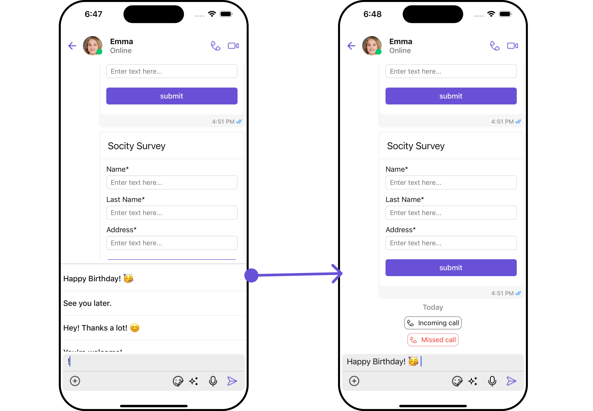
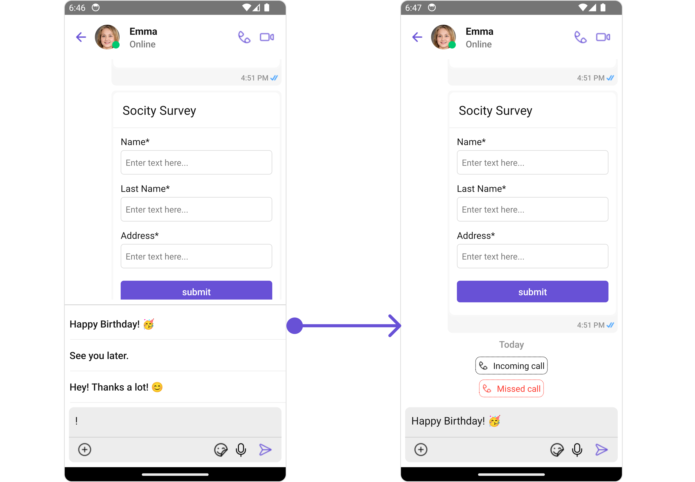

import Tabs from '@theme/Tabs';
import TabItem from '@theme/TabItem';

## Introduction

The `ShortCutFormatter` class extends the `CometChatTextFormatter` class to provide a mechanism for handling shortcuts within messages. This guide will walk you through the process of using ShortCutFormatter to implement shortcut extensions in your CometChat application.

## Setup

1. **Create the ShortCutFormatter Class**: Define the ShortCutFormatter class by extending the CometChatTextFormatter class.

<Tabs>
<TabItem value="ts" label="Typescript">

```typescript
import { CometChat } from "@cometchat/chat-sdk-react-native";
import {
  CometChatTextFormatter,
  SuggestionItem,
} from "@cometchat/chat-uikit-react-native";

export class ShortCutFormatter extends CometChatTextFormatter {
  constructor() {
    super();
    this.trackCharacter = "!";
  }
}
```

</TabItem>
</Tabs>

2. **Override Search Method**: Override the search() method to search for shortcuts based on the entered search text.

<Tabs>
<TabItem value="ts" label="Typescript">

```ts
search = (searchKey: string) => {
  let data: Array<SuggestionItem> = [];

  CometChat.callExtension("message-shortcuts", "GET", "v1/fetch", undefined)
    .then((data: any) => {
      if (data && data?.shortcuts) {
        let suggestionData = Object.keys(data.shortcuts).map((key) => {
          return new SuggestionItem({
            id: key,
            name: data.shortcuts[key],
            promptText: data.shortcuts[key],
            trackingCharacter: "!",
            underlyingText: data.shortcuts[key],
          });
        });
        this.setSearchData(suggestionData); // setting data in setSearchData();
      }
    })
    .catch((error) => {
      // Some error occured
    });

  this.setSearchData(data);
};

// return null in fetchNext, if there's no pagination.
fetchNext = () => {
  return null;
};
```

</TabItem>
</Tabs>

## Usage

1. **Initialization**: Initialize an instance of `ShortCutFormatter` in your application.

<Tabs>
<TabItem value="ts" label="App.tsx">

```ts
import React from "react";
import { CometChat } from "@cometchat/chat-sdk-react-native";
import {
  CometChatMessages,
  CometChatMentionsFormatter,
} from "@cometchat/chat-uikit-react-native";

function App(): React.JSX.Element {
  const [chatUser, setChatUser] = React.useState<CometChat.User | undefined>();

  React.useEffect(() => {
    CometChat.getUser("uid").then((user) => {
      setChatUser(user);
    });
  }, []);

  const shortcutFormatter = new ShortCutFormatter();

  return (
    <>
      {chatUser && (
        <CometChatMessages
          user={chatUser}
          messageComposerConfiguration={{ textFormatters: [shortcutFormatter] }}
        />
      )}
    </>
  );
}
```

</TabItem>
</Tabs>

## Example

<Tabs>
<TabItem value="ios" label="iOS">



</TabItem>
<TabItem value="android" label="Android">



</TabItem>
</Tabs>
