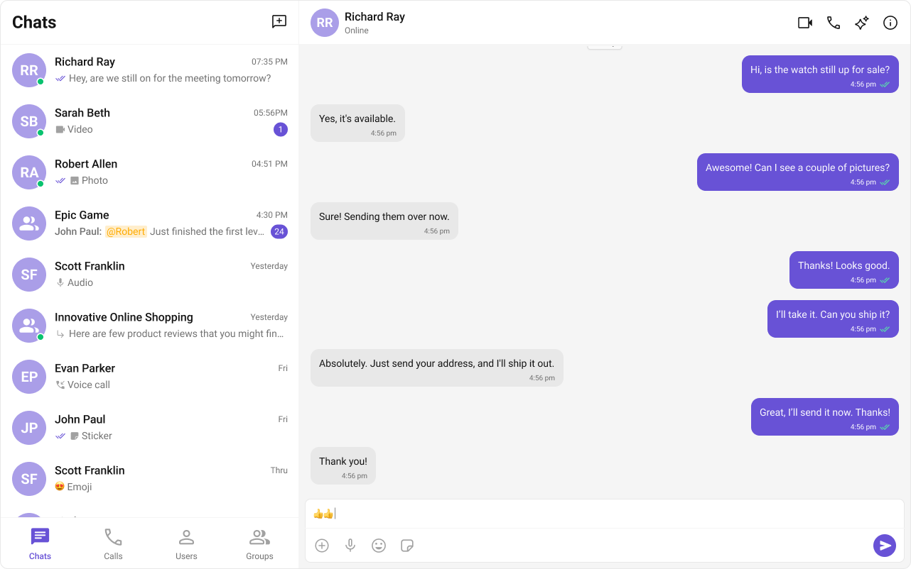

# **CometChat UI Kit for React**

The **CometChat UI Kit** for React is a powerful solution designed to seamlessly integrate chat functionality into applications. It provides a robust set of **prebuilt UI components** that are **modular, customizable, and highly scalable**, allowing developers to accelerate their development process with minimal effort.

---

## **Why Choose CometChat UI Kit?**
- **Rapid Integration** – Prebuilt UI components for faster deployment.  
- **Customizable & Flexible** – Modify the UI to align with your brand’s identity.  
- **Cross-Platform Compatibility** – Works seamlessly across various React-based frameworks.  
- **Scalable & Reliable** – Built on CometChat's **robust chat infrastructure** for enterprise-grade performance.  

---

## **User Interface Preview**

---

## **Integration Options**
CometChat UI Kit works with **React.js** and **Next.js**:

- **[React.js Guide](./react-js-integration)** – For React apps.  
- **[Next.js Guide](./next-js-integration)** – For Next.js apps.  

---

## **Next Steps for Developers**
1. **Learn the Basics** – [Key Concepts](/fundamentals/key-concepts).  
2. **Pick a Framework** – React.js or Next.js.  
3. **Follow the Setup Guide** – [React.js](./react-js-integration) | [Next.js](./next-js-integration).  
4. **Customize UI** – Adjust [styles, themes](./theme), and [components](./components-overview).  
5. **Test & Deploy** – Run tests and launch your chat app.  

---

## **Helpful Resources**
Explore these essential resources to gain a deeper understanding of **CometChat UI Kits** and streamline your integration process.

  

    <h4>🚀 React Sample App</h4>
    
Fully functional sample applications to accelerate your development.

    <a href="https://github.com/cometchat/cometchat-uikit-react/tree/v6/sample-app" target="_blank" style={{ color: '#6851D6', fontWeight: 'bold' }}>View on GitHub</a>
  

  

    <h4>📦 UI Kit Source Code</h4>
    
Access the complete UI Kit source code on GitHub.

    <a href="https://github.com/cometchat/cometchat-uikit-react/tree/v6" target="_blank" style={{ color: '#6851D6', fontWeight: 'bold' }}>View on GitHub</a>
  

  

    <h4>🎨 Figma Design File</h4>
    
UI design resources for customization and prototyping.

    <a href="https://www.figma.com/community/file/1442863561340379957/cometchat-ui-kit-for-web" target="_blank" style={{ color: '#6851D6', fontWeight: 'bold' }}>View on Figma</a>
  

---

## **💡 Need Help?**
If you need assistance, check out:  
- 📖 [Official Documentation](https://www.cometchat.com/docs)  
- 💬 [Developer Community](https://forum.cometchat.com/)  
- ❓ [Support Portal](https://support.cometchat.com/)  

---