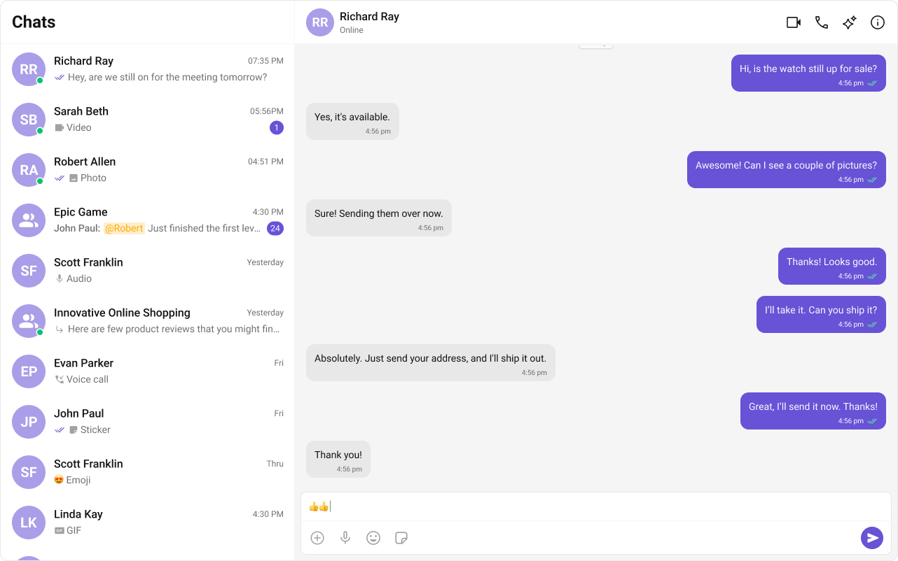

import Tabs from '@theme/Tabs';
import TabItem from '@theme/TabItem';

# **Building a Conversation List + Message View**
The **Conversation List + Message View** layout offers a seamless **two-panel chat interface**, commonly used in modern messaging applications like **WhatsApp Web, Slack, and Microsoft Teams**. 

This design enables users to switch between conversations effortlessly while keeping the chat window open, ensuring a **smooth, real-time messaging experience**.

---

## **User Interface Overview**


This layout is structured into three key sections:

1. **Sidebar (Conversation List)** – Displays active conversations, including users and groups.
2. **Message View** – Shows chat messages for the selected conversation in real-time.
3. **Message Composer** – Provides an input field for typing and sending messages, along with support for media, emojis, and reactions.

---

## **Step-by-Step Guide**

### **Step 1: Create Sidebar**

Let's create the `Sidebar` component which will render different conversations.  

#### **Folder Structure**
Create a `CometChatSelector` folder inside your `src` directory and add the following files:

```bash
src/
│── CometChatSelector/
│   ├── assets/
│   │   ├── chats.svg # This is the image you need to save
│   ├── CometChatSelector.tsx
│   ├── CometChatSelector.css
```

#### **Download the Icon**

These icons are available in the **CometChat UI Kit assets folder**. You can find them at:  
🔗 [GitHub Assets Folder](https://github.com/cometchat/cometchat-uikit-react/tree/v6/sample-app/src/assets)

<Tabs>
<TabItem value="tsx" label="TypeScript">
```tsx title="CometChatSelector.tsx"
import { useEffect, useState } from "react";
import {
  Conversation,
  Group,
  User,
  CometChat,
} from "@cometchat/chat-sdk-javascript";
import {
  CometChatConversations,
  CometChatUIKitLoginListener,
} from "@cometchat/chat-uikit-react";
import "./CometChatSelector.css";

// Define the props for the CometChatSelector component
interface SelectorProps {
  onSelectorItemClicked?: (
    input: User | Group | Conversation,
    type: string
  ) => void;
  onHide?: () => void;
  onNewChatClicked?: () => void;
}

// CometChatSelector component
export const CometChatSelector = (props: SelectorProps) => {
  // Destructure props with a default function for onSelectorItemClicked
  const { onSelectorItemClicked = () => {} } = props;

  // State to store the logged-in user
  const [loggedInUser, setLoggedInUser] = useState<CometChat.User | null>();

  // State to track the currently selected item (it can be a Conversation, User, or Group)
  const [activeItem, setActiveItem] = useState<
    CometChat.Conversation | CometChat.User | CometChat.Group | undefined
  >();

  // useEffect hook to fetch and set the logged-in user
  useEffect(() => {
    const loggedInUser = CometChatUIKitLoginListener.getLoggedInUser();
    setLoggedInUser(loggedInUser);
  }, [loggedInUser]); // Dependency on loggedInUser causes unnecessary re-renders

  return (
    <>
      {/* Render chat conversations if a user is logged in */}
      {loggedInUser && (
        <>
          <CometChatConversations
            activeConversation={
              activeItem instanceof CometChat.Conversation
                ? activeItem
                : undefined
            }
            onItemClick={(e) => {
              setActiveItem(e); // Update the active item when an item is clicked
              onSelectorItemClicked(e, "updateSelectedItem"); // Notify parent component
            }}
          />
        </>
      )}

      {/* Bottom navigation for chat selection */}
      <div className="cometchat-selector">
        {
          <div key={"chats"} className="cometchat-selector__tab">
            <div className="cometchat-selector__tab-icon-active" />
            <div className="cometchat-selector__tab-text-active">CHATS</div>
          </div>
        }
      </div>
    </>
  );
};
```
</TabItem>
<TabItem value="css" label="CSS">
```css title="CometChatSelector.css"
/* Styles for the menu icon in the conversation header */
.selector-wrapper .cometchat-conversations .cometchat-list__header-menu .cometchat-button__icon {
    background: var(--cometchat-icon-color-primary);
}

/* Change background color of the menu icon on hover */
.cometchat-conversations .cometchat-list__header-menu .cometchat-button__icon:hover {
    background: var(--cometchat-icon-color-highlight);
}

/* Remove the right border from the search bar */
.cometchat-list__header-search-bar {
    border-right: none;
}

/* Aligns submenu list items to the left */
.cometchat .cometchat-menu-list__sub-menu-list-item {
    text-align: left;
}

/* Adjust the width and positioning of the conversation menu list */
.cometchat .cometchat-conversations .cometchat-menu-list__sub-menu-list {
    width: 212px;
    top: 40px !important;
    left: 172px !important;
}

/* Styles for the logged-in user section */
#logged-in-user {
    border-bottom: 2px solid var(--cometchat-border-color-default, #E8E8E8);
}

/* Disable cursor interaction for menu items inside logged-in user section */
#logged-in-user .cometchat-menu-list__sub-menu-item-title,
#logged-in-user .cometchat-menu-list__sub-menu-list-item {
    cursor: default;
}

/* Background color for the logout button icon */
.cometchat-menu-list__sub-menu-list-item-icon-log-out {
    background-color: var(--cometchat-error-color, #F44649);
}

/* Text color for the logout menu item */
.cometchat-menu-list__sub-menu-item-title-log-out {
    color: var(--cometchat-error-color, #F44649);
}

/* Enable pointer cursor for menu items inside the chat menu */
.chat-menu .cometchat .cometchat-menu-list__sub-menu-item-title {
    cursor: pointer;
}

/* Remove box-shadow from submenu in the chat menu */
.chat-menu .cometchat .cometchat-menu-list__sub-menu {
    box-shadow: none;
}

/* Styles for the submenu icon inside the chat menu */
.chat-menu .cometchat .cometchat-menu-list__sub-menu-icon {
    background-color: var(--cometchat-icon-color-primary, #141414);
    width: 24px;
    height: 24px;
}

/* Styling for the chat selector container */
.cometchat-selector {
    display: flex;
    width: 100%;
    padding: 0px 8px;
    align-items: flex-start;
    gap: 8px;
    border-top: 1px solid var(--cometchat-border-color-light, #F5F5F5);
    border-right: 1px solid var(--cometchat-border-color-light, #F5F5F5);
    background: var(--cometchat-background-color-01, #FFF);
}

/* Styling for each tab inside the chat selector */
.cometchat-selector__tab {
    display: flex;
    padding: 12px 0px 10px 0px;
    flex-direction: column;
    justify-content: center;
    align-items: center;
    gap: 4px;
    flex: 1 0 0;
    min-height: 48px;
}

/* Styles for the active tab icon */
.cometchat-selector__tab-icon-active {
    display: flex;
    width: 32px;
    height: 32px;
    justify-content: center;
    align-items: center;
    -webkit-mask-size: contain;
    mask-size: contain;
    cursor: default;
    background: var(--cometchat-icon-color-highlight);
    -webkit-mask: url('./assets/chats.svg') no-repeat center;
    mask: url('./assets/chats.svg') no-repeat center;
}

/* Styles for the active tab text */
.cometchat-selector__tab-text-active {
    text-align: center;
    font: var(--cometchat-font-caption1-medium, 500 12px Roboto);
    cursor: default;
    color: var(--cometchat-text-color-highlight);
}
```
</TabItem>
</Tabs>

### **Step 2: Update App**

Now we will update the `App.tsx` & `App.css` files to import these new components as below,

<Tabs>
<TabItem value="tsx" label="TypeScript">
```tsx title="App.tsx"
import { useState } from "react";
import {
  CometChatMessageComposer,
  CometChatMessageHeader,
  CometChatMessageList,
} from "@cometchat/chat-uikit-react";
import { CometChat } from "@cometchat/chat-sdk-javascript";
import { CometChatSelector } from "./CometChatSelector/CometChatSelector";
import "./App.css";

function App() {
  // State to track the currently selected user
  const [selectedUser, setSelectedUser] = useState<CometChat.User | undefined>(undefined);

  // State to track the currently selected group
  const [selectedGroup, setSelectedGroup] = useState<CometChat.Group | undefined>(undefined);

  return (
    <div className="conversations-with-messages">
      {/* Sidebar for selecting conversations */}
      <div className="conversations-wrapper">
        <CometChatSelector
          onSelectorItemClicked={(activeItem) => {
            let item = activeItem;

            // If the selected item is a conversation, extract the user/group from it
            if (activeItem instanceof CometChat.Conversation) {
              item = activeItem.getConversationWith();
            }

            // Determine if the selected item is a User or a Group and update the state accordingly
            if (item instanceof CometChat.User) {
              setSelectedUser(item as CometChat.User);
              setSelectedGroup(undefined); // Ensure no group is selected
            } else if (item instanceof CometChat.Group) {
              setSelectedUser(undefined); // Ensure no user is selected
              setSelectedGroup(item as CometChat.Group);
            } else {
              setSelectedUser(undefined);
              setSelectedGroup(undefined); // Reset if selection is invalid
            }
          }}
        />
      </div>

      {/* If a user or group is selected, display the chat interface */}
      {selectedUser || selectedGroup ? (
        <div className="messages-wrapper">
          {/* Header displaying user/group details */}
          <CometChatMessageHeader user={selectedUser} group={selectedGroup} />
          
          {/* List of messages for the selected user/group */}
          <CometChatMessageList user={selectedUser} group={selectedGroup} />
          
          {/* Message input composer */}
          <CometChatMessageComposer user={selectedUser} group={selectedGroup} />
        </div>
      ) : (
        // Default message when no conversation is selected
        <div className="empty-conversation">Select Conversation to start</div>
      )}
    </div>
  );
};

export default App;
```
</TabItem>
<TabItem value="css" label="CSS">
```css title="App.css"
/* Importing CometChat UI Kit's CSS variables */
@import url('../node_modules/@cometchat/chat-uikit-react/dist/styles/css-variables.css');

/* Root container settings */
#root {
  text-align: center;
  width: 100vw; /* Full viewport width */
  height: 100vh; /* Full viewport height */
  background-color: #282c34; /* Dark background */
}

/* Layout container for conversations and messages */
.conversations-with-messages {
  display: flex;
  height: 100%;
  width: 100%;
  flex-direction: row; /* Horizontal layout */
}

/* Sidebar container for the conversation list */
.conversations-wrapper {
  height: 100vh;
  width: 480px; /* Fixed width for the sidebar */
  overflow: hidden;
  display: flex;
  flex-direction: column;
}

/* Prevent scrolling inside the conversation list */
.conversations-wrapper > .cometchat {
  overflow: hidden;
}

/* Main chat messages container */
.messages-wrapper {
  width: 100%;
  height: 100%;
  display: flex;
  flex-direction: column;
}

/* Styles for the placeholder when no conversation is selected */
.empty-conversation {
  height: 100vh;
  width: 100%;
  display: flex;
  justify-content: center;
  align-items: center;
  background: var(--cometchat-background-color-03, #F5F5F5); /* Light gray background */
  color: var(--cometchat-text-color-secondary, #727272); /* Secondary text color */
  font: var(--cometchat-font-body-regular, 400 14px Roboto);
}

/* Remove border-radius for the message composer input */
.cometchat .cometchat-message-composer {
  border-radius: 0px;
}
```
</TabItem>
</Tabs>

### **Step 3: Run the project**

```bash
npm start
```

---
 
## **Next Steps**

### **Enhance the User Experience**
- **[Advanced Customizations](./theme)** – Personalize the chat UI to align with your brand.

---