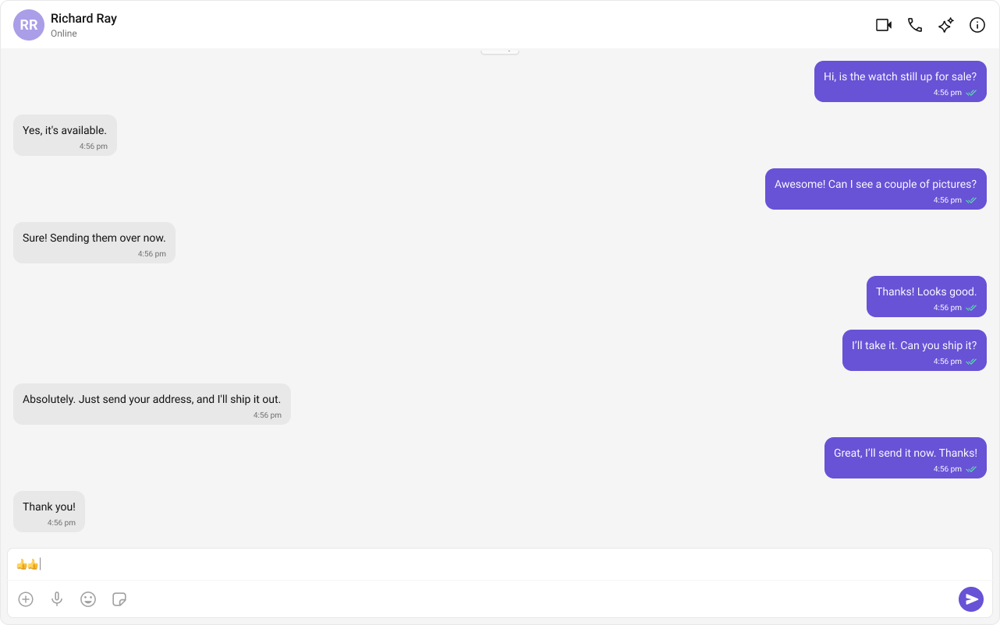

import Tabs from '@theme/Tabs';
import TabItem from '@theme/TabItem';

# **Building a One-to-One/Group Chat Experience**
The **One-to-One Chat** feature provides a streamlined **direct messaging interface**, making it ideal for **support chats, dating apps, and private messaging platforms**. This setup eliminates distractions by focusing solely on a **dedicated chat window**.

---

## **User Interface Preview**


### **Key Components**
1. **Chat Header** – Displays recipient details and optional call/video call buttons.
2. **Message View** – Shows real-time chat history.
3. **Message Input Box** – Enables users to send messages, media, and reactions.

---

## **Step-by-Step Guide**
 
### **Step 1: Implement the Chat Header**
- Display **profile picture, name, and online status**.
- Add **voice and video call buttons** (optional).

```tsx
<CometChatMessageHeader user={selectedUser} group={selectedGroup} />
```

### **Step 2: Build the Message View**
- Load **chat history** and **real-time messages**.
- Ensure **smooth scrolling and timestamp visibility**.

```tsx
<CometChatMessageList user={selectedUser} group={selectedGroup} />
```

### **Step 3: Add the Message Composer**
- Include a **text input field**.
- Support **media uploads, file attachments, emojis, and reactions**.

```tsx
<CometChatMessageComposer user={selectedUser} group={selectedGroup} />
```

---

#### **Implementation**
<Tabs>
<TabItem value="tsx" label="TypeScript"> 
```tsx title="App.tsx"
import { useEffect, useState } from "react";
import { CometChatMessageComposer, CometChatMessageHeader, CometChatMessageList } from "@cometchat/chat-uikit-react";
import { CometChat } from "@cometchat/chat-sdk-javascript";
import "./App.css";

function App() {
  const [selectedUser, setSelectedUser] = useState<CometChat.User | undefined>(undefined);
  // eslint-disable-next-line @typescript-eslint/no-unused-vars
  const [selectedGroup, setSelectedGroup] = useState<CometChat.Group | undefined>(undefined);

  useEffect(() => {
    // Fetch user or group from CometChat SDK whose chat you want to load. 

    /** Fetching User */
    const UID = "cometchat-uid-1";
    CometChat.getUser(UID).then(
      user => {
        setSelectedUser(user);
      }, error => {
        console.log("User fetching failed with error:", error);
      }
    );

    /** Fetching Group */
    // const GUID = "GUID"
    // CometChat.getGroup(GUID).then(
    //   group => {
    //     setSelectedGroup(group);
    //   }, error => {
    //     console.log("User fetching failed with error:", error);
    //   }
    // );

  }, []);

  return (
    <>
      {selectedUser || selectedGroup ? (
        <div className="messages-wrapper">
          <CometChatMessageHeader user={selectedUser} group={selectedGroup} />
          <CometChatMessageList user={selectedUser} group={selectedGroup} />
          <CometChatMessageComposer user={selectedUser} group={selectedGroup} />
        </div>
      ) : (
        <div className="empty-conversation">Please set a user or group in App.tsx.</div>
      )}
    </>
  );
};

export default App;
```
</TabItem>

<TabItem value="css" label="CSS"> 
```css title="App.css"
@import url('../node_modules/@cometchat/chat-uikit-react/dist/styles/css-variables.css');

#root {
  text-align: center;
  width: 100vw;
  height: 100vh;
  background-color: #282c34;
}

.conversations-with-messages {
  display: flex;
  height: 100%;
  width: 100%;
  flex-direction: row;
}

.conversations-wrapper {
  height: 100vh;
  width: 480px;
  overflow: hidden;
  display: flex;
  flex-direction: column;
}

.conversations-wrapper>.cometchat {
  overflow: hidden;
}

.messages-wrapper {
  width: 100%;
  height: 100vh;
  display: flex;
  flex-direction: column;
}

.empty-conversation {
  height: 100vh;
  width: 100%;
  display: flex;
  justify-content: center;
  align-items: center;
  background: var(--cometchat-background-color-03, #F5F5F5);
  color: var(--cometchat-text-color-secondary, #727272);
  font: var(--cometchat-font-body-regular, 400 14px Roboto);
}

.cometchat .cometchat-message-composer {
  border-radius: 0px;
}
```
</TabItem>
</Tabs>

In the code snippet above, ensure you select either a user or a group based on your chat requirement. You can also determine this dynamically depending on the conversation type.

#### **Fetching a User (One-on-One Chat)**
```tsx
const UID = "cometchat-uid-1";
CometChat.getUser(UID)
  .then(user => setSelectedUser(user))
  .catch(error => console.error("Failed to fetch user:", error));
```

#### **Fetching a Group (Group Chat)**
```tsx
const GUID = "GUID";
CometChat.getGroup(GUID)
  .then(group => setSelectedGroup(group))
  .catch(error => console.error("Failed to fetch group:", error));
```
 
---

### **Step 4: Run the project**

```bash
npm start
```

## **Next Steps**

### **Enhance the User Experience**
- **[Advanced Customizations](./theme)** – Personalize the chat UI to align with your brand.

---
