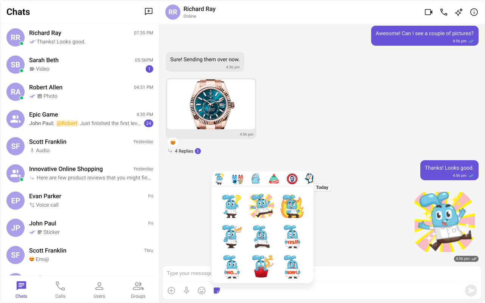
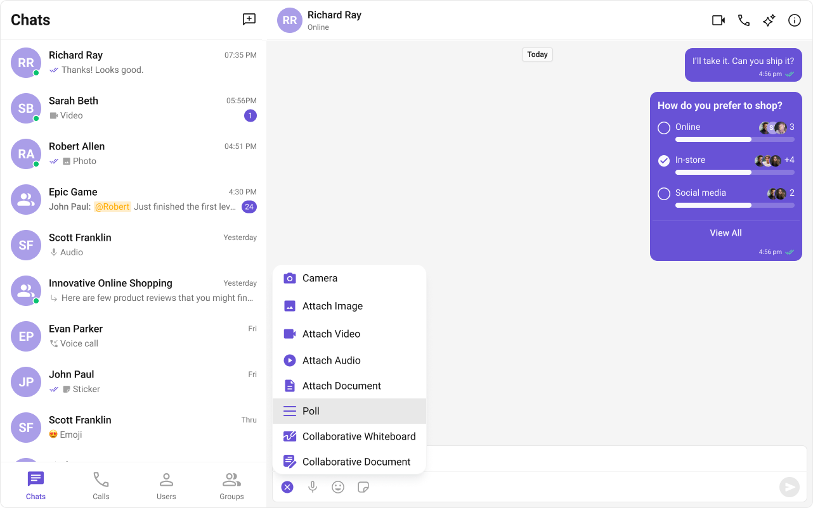
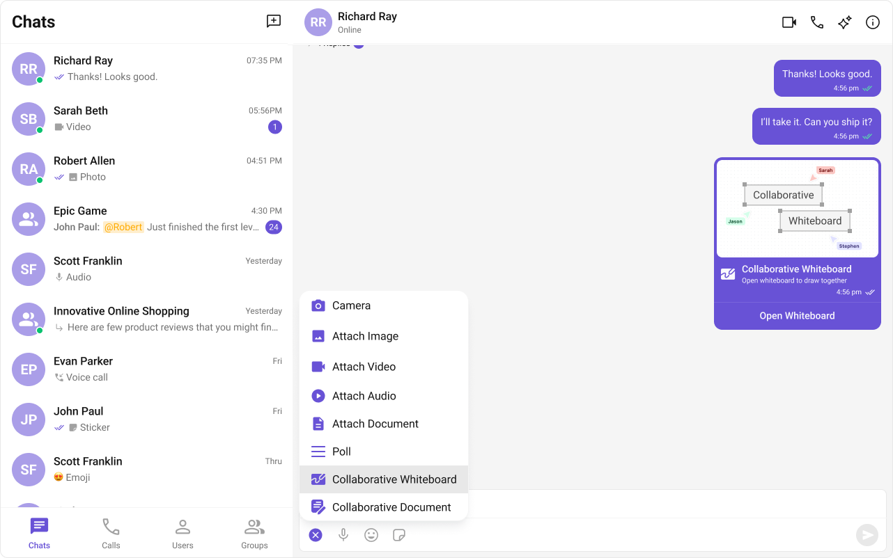
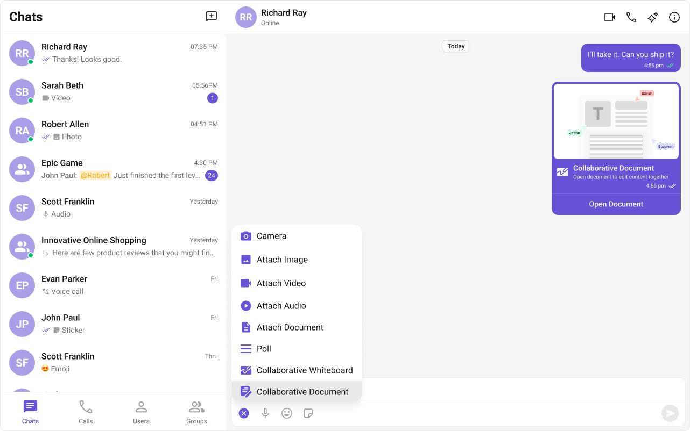
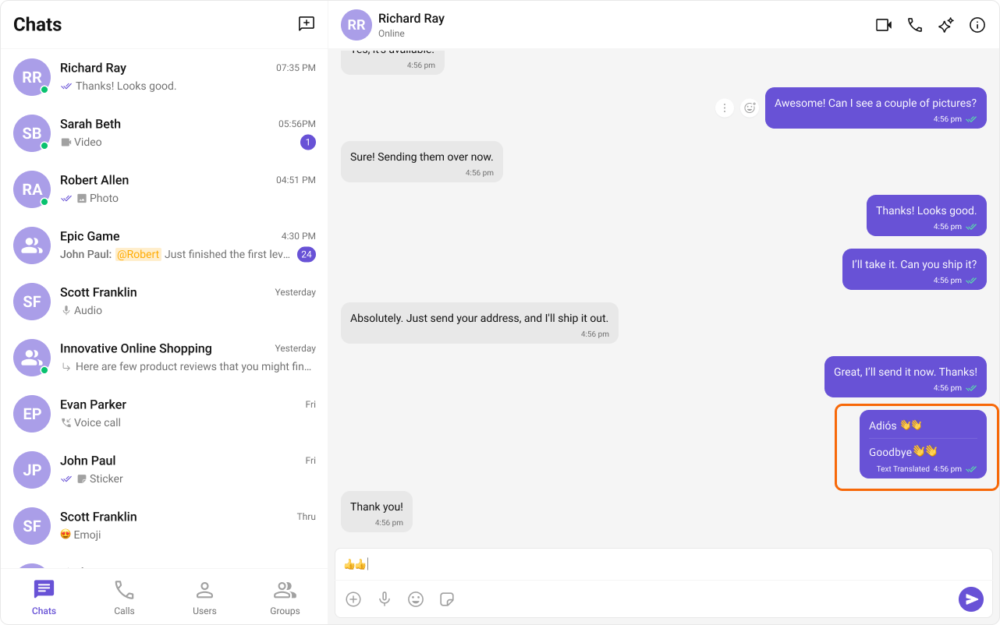
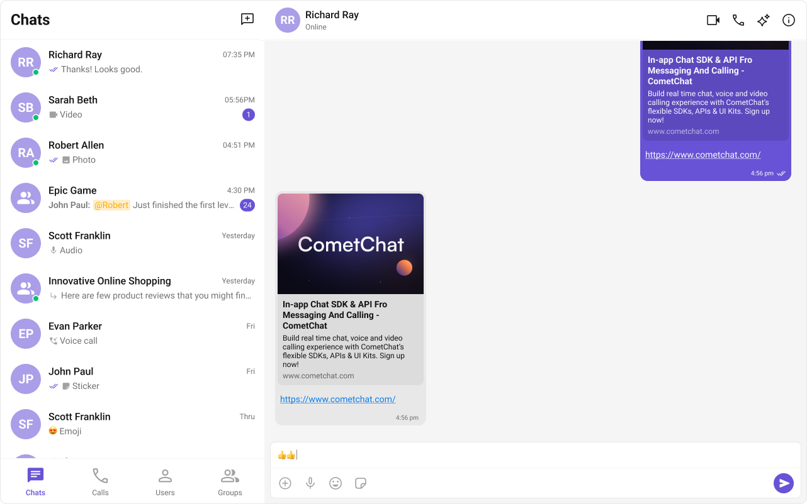
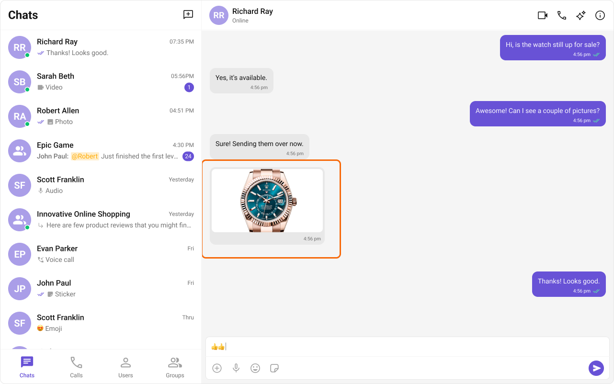

import Tabs from '@theme/Tabs';
import TabItem from '@theme/TabItem';

## Overview

CometChat's UI Kit offers built-in support for various extensions, enriching the chatting experience with enhanced functionality. These extensions augment your chat application, making it more interactive, secure, and efficient.

Activating extensions within CometChat is a straightforward process through your application's dashboard. For detailed instructions, refer to our guide on [Extensions](/extensions/overview).

Once you've enabled your desired extension in the dashboard, it seamlessly integrates into your CometChat application upon initialization and successful login. It's important to note that extension features will only be available if they are supported by the CometChat UI Kit.

CometChat's UI Kit provides native support for 12 powerful extensions. This effortless integration enables you to enhance your chat application with engaging features without any additional coding. Simply enable the desired extensions from the CometChat Dashboard, and they will automatically enhance the relevant components of your application, providing a richer and more engaging experience for your users.

## Built-in Extensions

Here's a guide on how you can enable and integrate these extensions:

### Stickers

The Stickers extension allows users to express their emotions more creatively. It adds a much-needed fun element to the chat by allowing users to send various pre-designed stickers. For a comprehensive understanding and guide on implementing and using the Sticker Extension, refer to our specific guide on the [Sticker Extension](/extensions/stickers).

Once you have successfully activated the [Sticker Extension](/extensions/stickers) from your CometChat Dashboard, the feature will automatically be incorporated into the [Message Composer](message-composer) component of UI Kits.

### Polls

The Polls extension enhances group discussions by allowing users to create polls. Users can ask questions with a predefined list of answers, enabling a quick, organized way to gather group opinions. For a comprehensive understanding and guide on implementing and using the Polls Extension, refer to our specific guide on the [Polls Extension](/extensions/polls).

Once you have successfully activated the [Polls Extension](/extensions/polls) from your CometChat Dashboard, the feature will automatically be incorporated into the Action Sheet of the [Message Composer](message-composer) component of UI Kits.

### Collaborative Whiteboard

The Collaborative Whiteboard extension facilitates real-time collaboration. Users can draw, brainstorm, and share ideas on a shared digital whiteboard. For a comprehensive understanding and guide on implementing and using the Collaborative Whiteboard Extension, refer to our specific guide on the [Collaborative Whiteboard Extension](/extensions/collaborative-whiteboard).

Once you have successfully activated the [Collaborative Whiteboard Extension](/extensions/collaborative-whiteboard) from your CometChat Dashboard, the feature will automatically be incorporated into the Action Sheet of the [Message Composer](message-composer) component of UI Kits.

### Collaborative Document

With the Collaborative Document extension, users can work together on a shared document. This feature is essential for remote teams where document collaboration is a recurring requirement. For a comprehensive understanding and guide on implementing and using the Collaborative Document Extension, refer to our specific guide on the [Collaborative Document Extension](/extensions/collaborative-document).

Once you have successfully activated the [Collaborative Document Extension](/extensions/collaborative-document) from your CometChat Dashboard, the feature will automatically be incorporated into the Action Sheet of the [Message Composer](message-composer) component of UI Kits.

### Message Translation

The Message Translation extension in CometChat is designed to translate any message into your local locale. It eliminates language barriers, making the chat more inclusive. For a comprehensive understanding and guide on implementing and using the Message Translation Extension, refer to our specific guide on the [Message Translation Extension](/extensions/message-translation).

Once you have successfully activated the [Message Translation Extension](/extensions/message-translation) from your CometChat Dashboard, the feature will automatically be incorporated into the Action Sheet of [MessageList Component](message-list) component of UI Kits.

### Link Preview

The Link Preview extension provides a summary of the URL shared in the chat. It includes the title, a description, and a thumbnail image from the web page. For a comprehensive understanding and guide on implementing and using the Link Preview Extension, refer to our specific guide on the [Link Preview Extension](/extensions/link-preview).

Once you have successfully activated the [Link Preview Extension](/extensions/link-preview) from your CometChat Dashboard, the feature will automatically be incorporated into the Message Bubble of [MessageList Component](message-list) component of UI Kits.

### Thumbnail Generation

The Thumbnail Generation extension automatically creates a smaller preview image whenever a larger image is shared, helping to reduce the upload/download time and bandwidth usage. For a comprehensive understanding and guide on implementing and using the Thumbnail Generation Extension, refer to our specific guide on the [Thumbnail Generation Extension](/extensions/thumbnail-generation).

Once you have successfully activated the [Thumbnail Generation Extension](/extensions/thumbnail-generation) from your CometChat Dashboard, the feature will automatically be incorporated into the Message Bubble of [MessageList Component](message-list) component of UI Kits.

