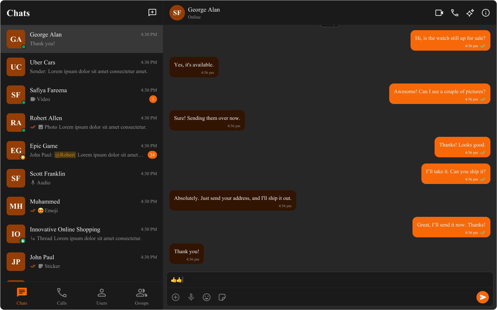

import Tabs from '@theme/Tabs';
import TabItem from '@theme/TabItem';

# **Customizing UI with Theming**

Theming allows you to define the **look and feel** of your app by adjusting **colors, fonts, and other styles**. Using **CSS variables**, you can create a consistent and **on-brand** chat experience.

---

## **Importing the Stylesheet**
To enable theming, first, **import the base stylesheet** containing default styles and variables.

<Tabs>
<TabItem value="css" label="App.css">

```css
@import url("../node_modules/@cometchat/chat-uikit-react/dist/styles/css-variables.css");
```

</TabItem>
</Tabs>

---

## **Global Theming with CSS Variables**
Customize the **entire chat UI** by overriding CSS variables in your **global stylesheet**.

### **Example: Changing Colors & Fonts**
The following **CSS variables** customize colors, fonts, and other elements.


<Tabs>
<TabItem value="tsx" label="App.tsx">

```tsx
import { useEffect } from "react";

const App = () => {
  useEffect(() => {
    document.documentElement.style.setProperty(
      "--cometchat-font-family",
      "'Times New Roman'"
    );
  }, []);

  return <div className="cometchat-root">{/* Your chat UI here */}</div>;
};

export default App;
```

</TabItem>
<TabItem value="css" label="App.css">

```css
.cometchat {
  --cometchat-primary-color: #f76808;
  --cometchat-neutral-color-300: #fff;
  --cometchat-background-color-03: #feede1;
  --cometchat-extended-primary-color-500: #fbaa75;
  --cometchat-icon-color-highlight: #f76808;
  --cometchat-text-color-highlight: #f76808;
}
```

</TabItem>
</Tabs>

---

## **Component-Specific Theming**
Want to apply **different styles to specific components**? Override **CSS variables within the component’s class**.


<Tabs>
<TabItem value="css" label="App.css">

```css
.cometchat .cometchat-conversations {
  --cometchat-primary-color: #f76808;
  --cometchat-extended-primary-color-500: #fbaa75;
  --cometchat-text-color-highlight: #ffab00;
  --cometchat-message-seen-color: #f76808;
  --cometchat-radius-max: 12px;
}
```

</TabItem>
</Tabs>

---

## **Advanced Customization with CSS Overrides**
For full control over component styling, use **CSS overrides**.

<Tabs>
<TabItem value="css" label="App.css">

```css
.cometchat-conversations .cometchat-avatar,
.cometchat-conversations .cometchat-avatar__image {
  border-radius: 12px;
}
```

</TabItem>
</Tabs>

---

## **Dark & Light Theme Support**
You can **switch** between light and dark modes.

### **Example: Enabling Dark Mode**


<Tabs>
<TabItem value="tsx" label="App.tsx">

```tsx
import { useEffect, useState } from "react";

const App = () => {
  const [theme, setTheme] = useState("light");

  useEffect(() => {
    const mediaQuery = window.matchMedia("(prefers-color-scheme: dark)");
    setTheme(mediaQuery.matches ? "dark" : "light");

    const handleThemeChange = (e: MediaQueryListEvent) => {
      setTheme(e.matches ? "dark" : "light");
    };

    mediaQuery.addEventListener("change", handleThemeChange);
    return () => mediaQuery.removeEventListener("change", handleThemeChange);
  }, []);

  return <div className="cometchat-root" data-theme={theme}>{/* Chat UI here */}</div>;
};

export default App;
```

</TabItem>
</Tabs>

---

## **Customizing Light & Dark Theme**
Define different **color schemes** for **light and dark modes**.



<Tabs>
<TabItem value="css" label="App.css">

```css
/* Default (Light) Theme */
.cometchat {
  --cometchat-primary-color: #f76808;
  --cometchat-neutral-color-300: #fff;
  --cometchat-background-color-03: #feede1;
  --cometchat-extended-primary-color-500: #fbaa75;
  --cometchat-icon-color-highlight: #f76808;
  --cometchat-text-color-highlight: #f76808;
}

/* Dark Theme */
@media (prefers-color-scheme: dark) {
  .cometchat {
    --cometchat-primary-color: #f76808;
    --cometchat-neutral-color-300: #311502;
    --cometchat-background-color-03: #451d02;
    --cometchat-extended-primary-color-500: #943e05;
    --cometchat-icon-color-highlight: #f76808;
    --cometchat-text-color-highlight: #f76808;
    --cometchat-message-seen-color: #f76808;
    --cometchat-neutral-color-50: #1a1a1a;
  }
}
```

</TabItem>
</Tabs>

---

## **📚 Helpful Resources**

Enhance your design and development workflow with the following resources:

<div style={{ display: 'flex', justifyContent: 'space-between', gap: '20px', flexWrap: 'wrap' }}>

  <div style={{ flex: '1', minWidth: '300px', padding: '20px', border: '1px solid #e0e0e0', borderRadius: '8px', textAlign: 'center'}}>
    <h4>📦 UI Kit Source Code</h4>
    <p>Explore the complete list of color variables and hex values on GitHub.</p>
    <a href="https://github.com/cometchat/cometchat-uikit-react/blob/v6/src/styles/css-variables.css#L198-L419" target="_blank" style={{ color: '#6851D6', fontWeight: 'bold' }}>View on GitHub</a>
  </div>

  <div style={{ flex: '1', minWidth: '300px', padding: '20px', border: '1px solid #e0e0e0', borderRadius: '8px', textAlign: 'center'}}>
    <h4>🎨 Figma UI Kit</h4>
    <p>Access the Figma UI Kit for a fully integrated color palette and seamless customization.</p>
    <a href="https://www.figma.com/community/file/1442863561340379957/cometchat-ui-kit-for-web" target="_blank" style={{ color: '#6851D6', fontWeight: 'bold' }}>View on Figma</a>
  </div>

</div>
 