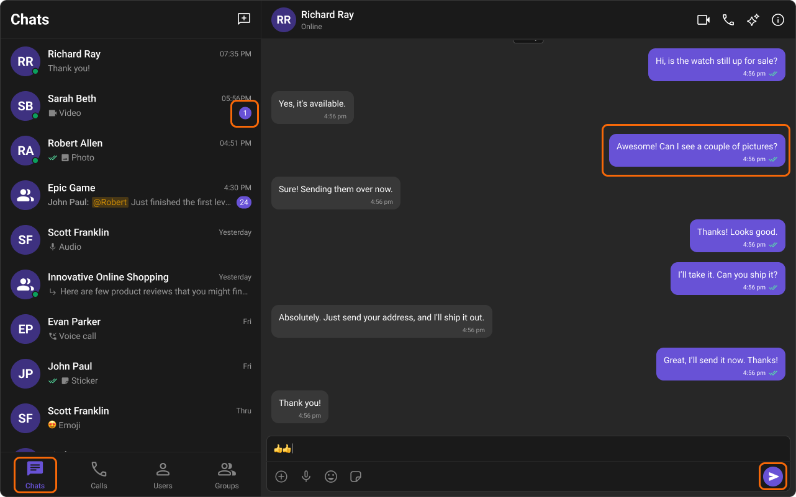

import loadingPlaceholder from '../assets/color_resources_figma_loader.png';

# **Color Resources**

## Introduction

The **Chat UI Kit** features a carefully crafted **color palette** designed for a **consistent and visually appealing** user experience. It follows the **Block, Element, Modifier (BEM)** methodology, ensuring **scalable styling** and easy **customization** by overriding the Kit’s CSS variables.

---

## Color Palette

The **primary color** defines key actions, branding, and UI elements, while the **extended primary palette** provides variations for supporting components.

### **Primary Color**

#### **Light Mode**


```css
--cometchat-primary-color: #6852d6;
--cometchat-extended-primary-color-50: #f9f8fd;
--cometchat-extended-primary-color-100: #edeafa;
--cometchat-extended-primary-color-200: #dcd7f6;
--cometchat-extended-primary-color-300: #ccc4f1;
--cometchat-extended-primary-color-400: #bbb1ed;
--cometchat-extended-primary-color-500: #aa9ee8;
--cometchat-extended-primary-color-600: #9a8be4;
--cometchat-extended-primary-color-700: #8978df;
--cometchat-extended-primary-color-800: #7965db;
--cometchat-extended-primary-color-900: #5d49be;
```

---

#### **Dark Mode**


```css
--cometchat-primary-color: #6852d6;
--cometchat-extended-primary-color-50: #15102b;
--cometchat-extended-primary-color-100: #1d173c;
--cometchat-extended-primary-color-200: #251e4d;
--cometchat-extended-primary-color-300: #2e245e;
--cometchat-extended-primary-color-400: #362b6f;
--cometchat-extended-primary-color-500: #3e3180;
--cometchat-extended-primary-color-600: #473892;
--cometchat-extended-primary-color-700: #4f3ea3;
--cometchat-extended-primary-color-800: #5745b4;
--cometchat-extended-primary-color-900: #7460d9;
```

### **Extended Primary Colors**

#### **Light Mode**


#### **Dark Mode**

 
