import Tabs from '@theme/Tabs';
import TabItem from '@theme/TabItem';

## Introduction

We offer customizable message bubble styling to enhance user experience and match your app’s design. With distinct classes for incoming and outgoing messages, you can easily define colors, borders, and other styles. Each message type, from text to multimedia, has predefined classes for default styling, and developers can further customize using CSS.

## Incoming & Outgoing Messages

Incoming and outgoing messages have different styling by default, allowing users to visually separate their own messages from others’. Here, we show both the default view and examples of customizations for these message bubbles.

Shown below is the default chat interface.

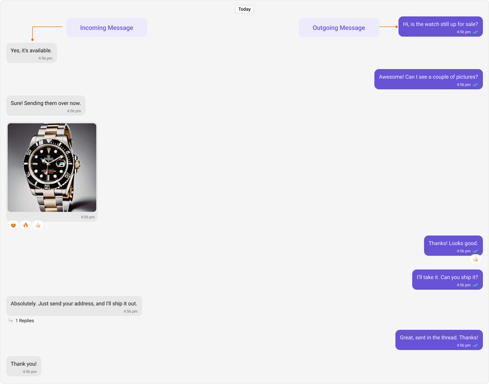

---

### Styling

#### Outgoing Message Bubbles

The customized chat interface is displayed below.

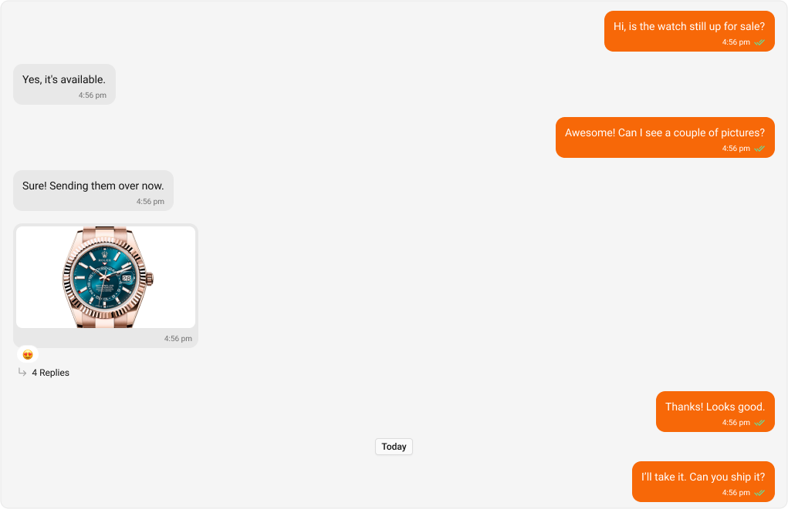

Use the following code to achieve the customization shown above.

```css title="App.css"
.cometchat .cometchat-message-bubble-outgoing .cometchat-message-bubble__body {
  --cometchat-primary-color: #f76808;
  --cometchat-extended-primary-color-900: #fbaa75;
}
```

---

#### Incoming Message Bubbles

The customized chat interface is displayed below.

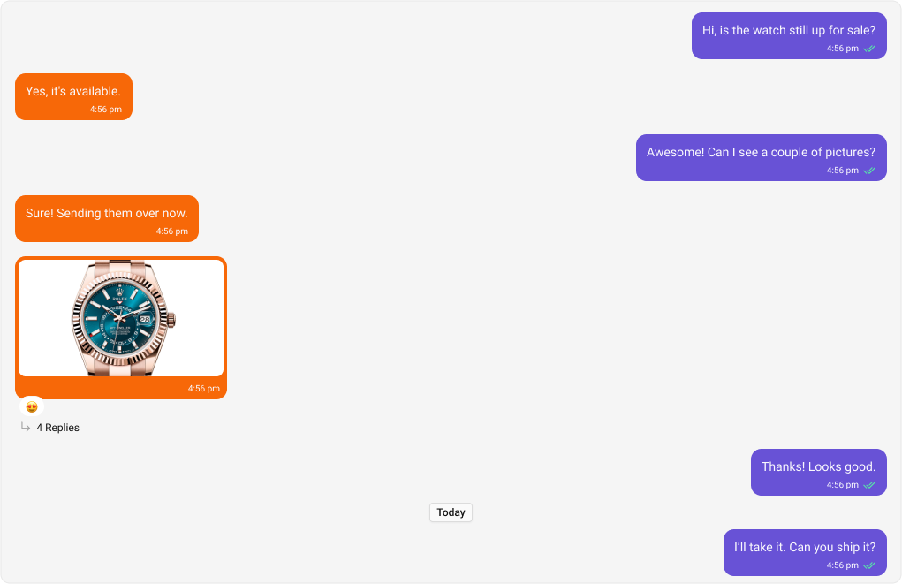

Use the following code to achieve the customization shown above.

```css title="App.css"
.cometchat .cometchat-message-bubble-incoming .cometchat-message-bubble__body {
  --cometchat-neutral-color-300: #f76808;
}
```

---

#### All Message Bubbles

The customized chat interface is displayed below.

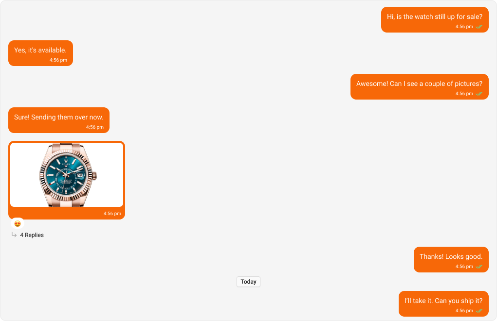

Use the following code to achieve the customization shown above.

```css title="App.css"
.cometchat .cometchat-message-bubble .cometchat-message-bubble__body {
  --cometchat-neutral-color-300: #f76808;
  --cometchat-primary-color: #f76808;
  --cometchat-extended-primary-color-900: #fbaa75;
}
```

---

## Message Types

CometChat UI Kit includes classes for various message types. Below are examples of default & customised views for each message type, along with the relevant CSS code snippets so that you can quickly up to the mark with CSS customization.

---

### Text Message Bubble

Shown below is the default chat interface.


The customized chat interface is displayed below.


Use the following code to achieve the customization shown above.

```css title="App.css"
/* Outgoing Text Message Bubble */
.cometchat
  .cometchat-message-bubble-outgoing
  .cometchat-message-bubble__body.cometchat-message-bubble__text-message {
  --cometchat-primary-color: #f76808;
}

/* Incoming Text Message Bubble */
.cometchat
  .cometchat-message-bubble-incoming
  .cometchat-message-bubble__body.cometchat-message-bubble__text-message {
  --cometchat-neutral-color-300: #feede1;
}
```

---

### Image Message Bubble

Shown below is the default chat interface.

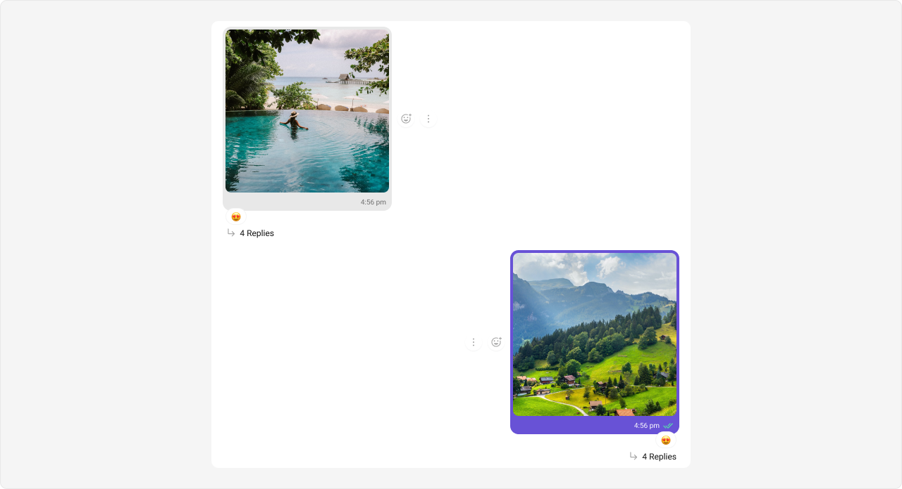

The customized chat interface is displayed below.

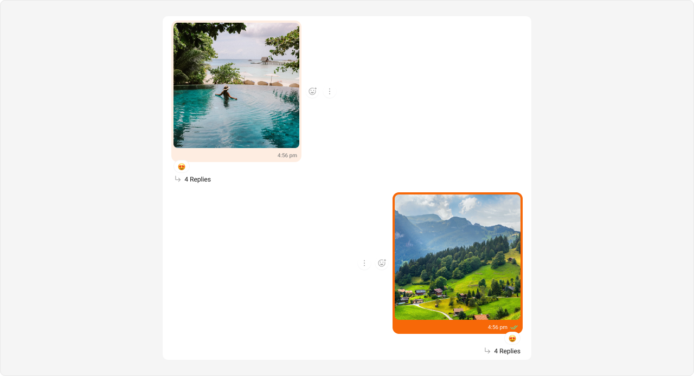

Use the following code to achieve the customization shown above.

```css title="App.css"
/* Outgoing Image Message Bubble */
.cometchat
  .cometchat-message-bubble-outgoing
  .cometchat-message-bubble__body.cometchat-message-bubble__image-message {
  --cometchat-primary-color: #f76808;
}

/* Incoming Image Message Bubble */
.cometchat
  .cometchat-message-bubble-incoming
  .cometchat-message-bubble__body.cometchat-message-bubble__image-message {
  --cometchat-neutral-color-300: #feede1;
}
```

---

### Video Message Bubble

Shown below is the default chat interface.

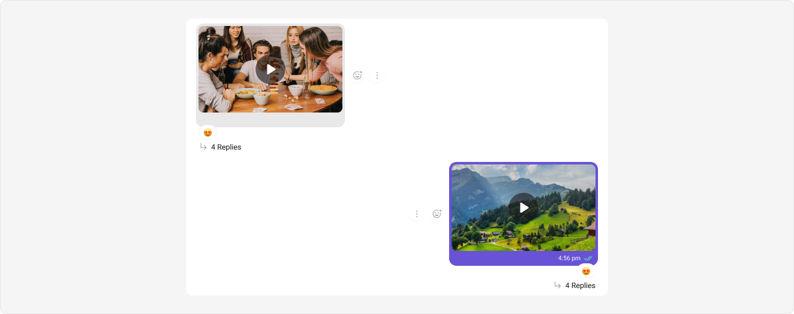

The customized chat interface is displayed below.

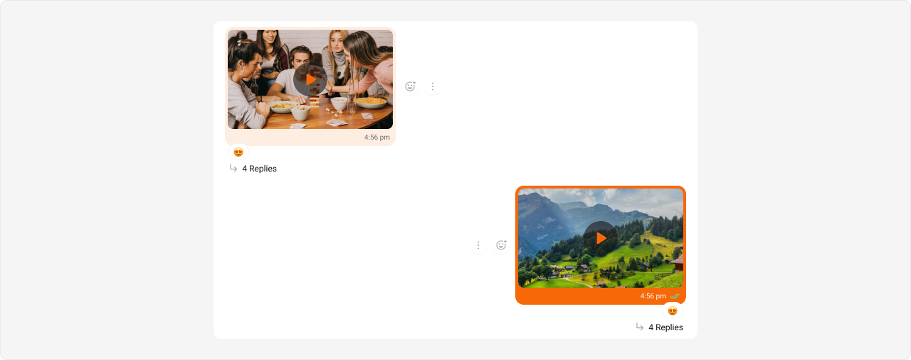

Use the following code to achieve the customization shown above.

```css title="App.css"
/* Outgoing Video Message Bubble */
.cometchat
  .cometchat-message-bubble-outgoing
  .cometchat-message-bubble__body.cometchat-message-bubble__video-message {
  --cometchat-primary-color: #f76808;
}

/* Incoming Video Message Bubble */
.cometchat
  .cometchat-message-bubble-incoming
  .cometchat-message-bubble__body.cometchat-message-bubble__video-message {
  --cometchat-neutral-color-300: #feede1;
}
```

---

### Audio Message Bubble

Shown below is the default chat interface.


The customized chat interface is displayed below.


Use the following code to achieve the customization shown above.

```css title="App.css"
/* Outgoing Audio Message Bubble */
.cometchat
  .cometchat-message-bubble-outgoing
  .cometchat-message-bubble__body.cometchat-message-bubble__audio-message {
  --cometchat-primary-color: #f76808;
}

/* Incoming Audio Message Bubble */
.cometchat
  .cometchat-message-bubble-incoming
  .cometchat-message-bubble__body.cometchat-message-bubble__audio-message {
  --cometchat-primary-color: #f76808;
  --cometchat-neutral-color-300: #feede1;
}
```

---

### File Message Bubble

Shown below is the default chat interface.


The customized chat interface is displayed below.


Use the following code to achieve the customization shown above.

```css title="App.css"
/* Outgoing File Message Bubble */
.cometchat
  .cometchat-message-bubble-outgoing
  .cometchat-message-bubble__body.cometchat-message-bubble__file-message {
  --cometchat-primary-color: #f76808;
}

/* Incoming File Message Bubble */
.cometchat
  .cometchat-message-bubble-incoming
  .cometchat-message-bubble__body.cometchat-message-bubble__file-message {
  --cometchat-primary-color: #f76808;
  --cometchat-neutral-color-300: #feede1;
}
```

---

### Delete Message Bubble

Shown below is the default chat interface.


The customized chat interface is displayed below.


Use the following code to achieve the customization shown above.

```css title="App.css"
/* Outgoing Delete Bubble */
.cometchat
  .cometchat-message-bubble-outgoing
  .cometchat-message-bubble__body.cometchat-message-bubble__delete-message {
  --cometchat-primary-color: #f76808;
}

/* Incoming Delete Bubble */
.cometchat
  .cometchat-message-bubble-incoming
  .cometchat-message-bubble__body.cometchat-message-bubble__delete-message {
  --cometchat-neutral-color-300: #feede1;
}
```

---

### Action Message Bubble

Shown below is the default chat interface.


The customized chat interface is displayed below.


Use the following code to achieve the customization shown above.

```css title="App.css"
.cometchat .cometchat-message-bubble__body .cometchat-action-bubble {
  --cometchat-primary-color: #f76808;
  background-color: #feede1;
  --cometchat-text-color-secondary: #f76808;
  --cometchat-icon-color-secondary: #f76808;
  --cometchat-border-color-default: #f76808;
}
```

---

### Direct Call Message Bubble

Shown below is the default chat interface.


The customized chat interface is displayed below.


Use the following code to achieve the customization shown above.

```css title="App.css"
/* Outgoing Direct Call Message Bubble */
.cometchat
  .cometchat-message-bubble-outgoing
  .cometchat-message-bubble__body.cometchat-message-bubble__meeting-message {
  --cometchat-primary-color: #f76808;
  --cometchat-extended-primary-color-800: #fbaa75;
}

/* Incoming Direct Call Message Bubble */
.cometchat
  .cometchat-message-bubble-incoming
  .cometchat-message-bubble__body.cometchat-message-bubble__meeting-message {
  --cometchat-primary-color: #f76808;
  --cometchat-neutral-color-300: #feede1;
}
```

---

### Default Call Message Bubble

Shown below is the default chat interface.

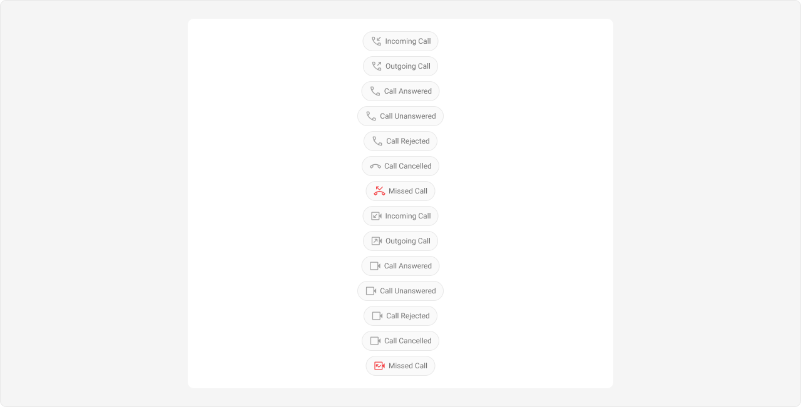

The customized chat interface is displayed below.

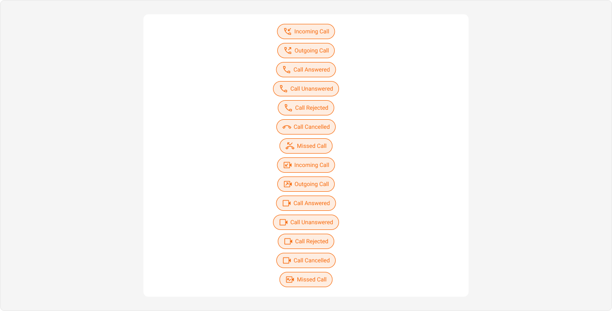

Use the following code to achieve the customization shown above.

```css title="App.css"
.cometchat .cometchat-message-bubble__body .cometchat-action-bubble {
  --cometchat-primary-color: #f76808;
  background-color: #feede1;
  --cometchat-text-color-secondary: #f76808;
  --cometchat-icon-color-secondary: #f76808;
  --cometchat-border-color-default: #f76808;
}
```

---

### Extensions

#### Collaborative Whiteboard Bubble

Shown below is the default chat interface.

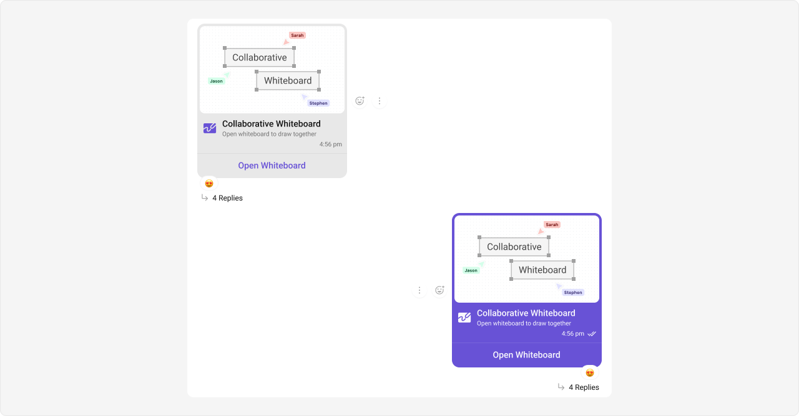

The customized chat interface is displayed below.


Use the following code to achieve the customization shown above.

```css title="App.css"
/* Outgoing Collaborative Whiteboard Bubble */
.cometchat
  .cometchat-message-bubble-outgoing
  .cometchat-message-bubble__body.cometchat-message-bubble__whiteboard-message {
  --cometchat-primary-color: #f76808;
}

/* Incoming Collaborative Whiteboard Bubble */
.cometchat
  .cometchat-message-bubble-incoming
  .cometchat-message-bubble__body.cometchat-message-bubble__whiteboard-message {
  --cometchat-primary-color: #f76808;
  --cometchat-primary-button-background: #f76808;
  --cometchat-neutral-color-300: #feede1;
}
```

---

#### Collaborative Document Bubble

Shown below is the default chat interface.

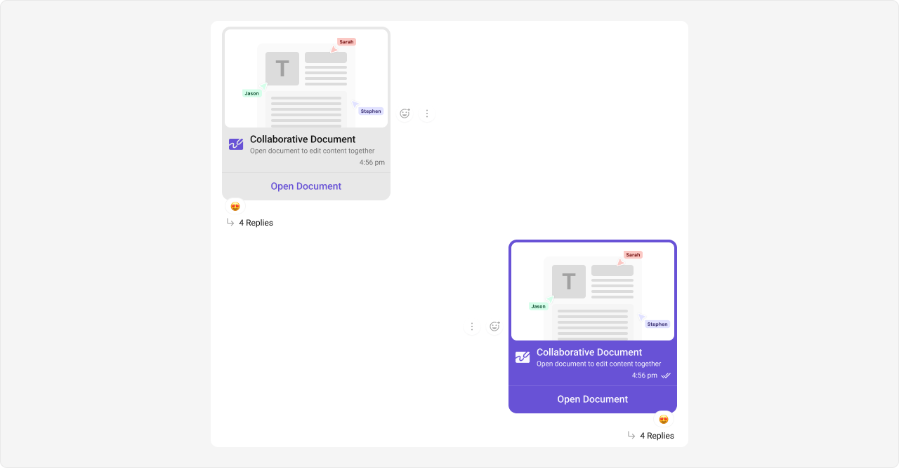

The customized chat interface is displayed below.

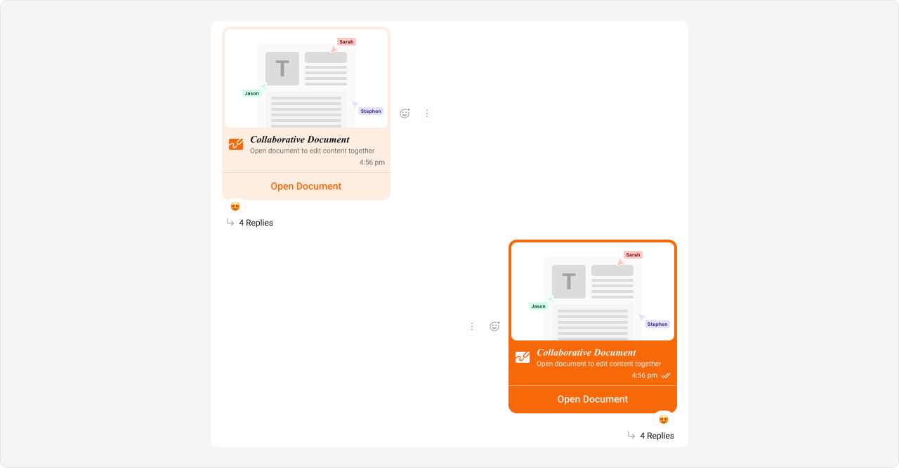

Use the following code to achieve the customization shown above.

```css title="App.css"
/* Outgoing Collaborative Document Bubble */
.cometchat
  .cometchat-message-bubble-outgoing
  .cometchat-message-bubble__body.cometchat-message-bubble__document-message {
  --cometchat-primary-color: #f76808;
}

/* Incoming Collaborative Document Bubble */
.cometchat
  .cometchat-message-bubble-incoming
  .cometchat-message-bubble__body.cometchat-message-bubble__document-message {
  --cometchat-primary-color: #f76808;
  --cometchat-primary-button-background: #f76808;
  --cometchat-neutral-color-300: #feede1;
}
```

---

#### Polls Bubble

Shown below is the default chat interface.

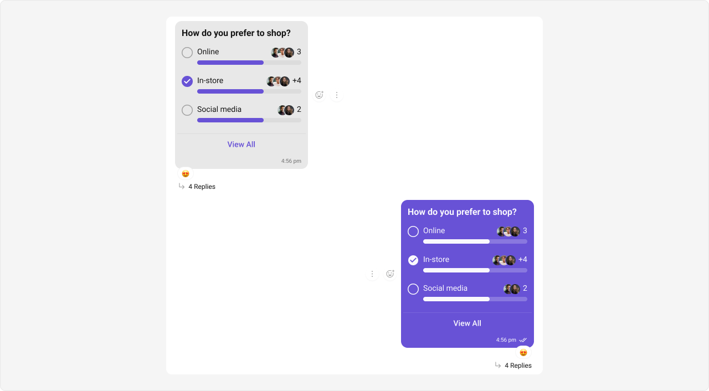

The customized chat interface is displayed below.

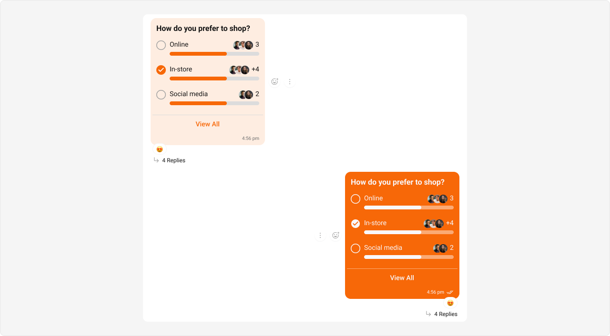

Use the following code to achieve the customization shown above.

```css title="App.css"
/* Outgoing Poll Message Bubble */
.cometchat
  .cometchat-message-bubble-outgoing
  .cometchat-message-bubble__body.cometchat-message-bubble__poll-message {
  --cometchat-primary-color: #f76808;
  --cometchat-extended-primary-color-700: #fbaa75;
}

/* Incoming Poll Message Bubble */
.cometchat
  .cometchat-message-bubble-incoming
  .cometchat-message-bubble__body.cometchat-message-bubble__poll-message {
  --cometchat-primary-color: #f76808;
  --cometchat-neutral-color-300: #feede1;
}
```

---

#### Stickers Bubble

Shown below is the default chat interface.

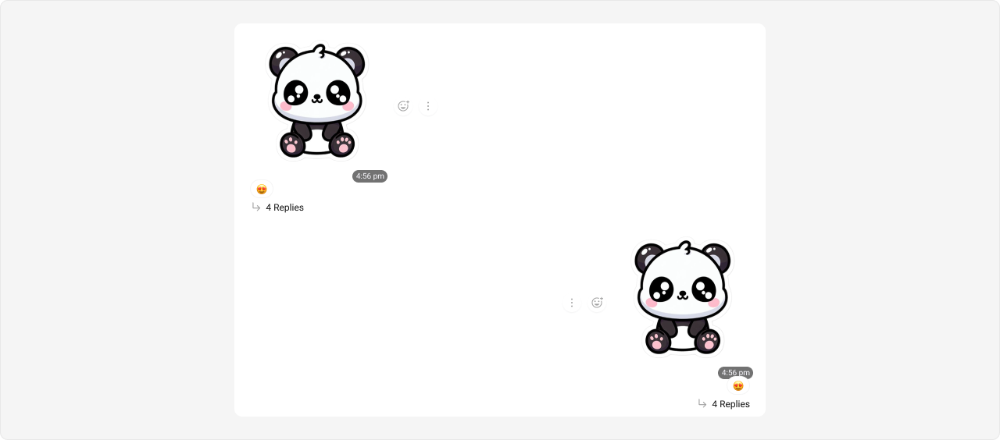

The customized chat interface is displayed below.

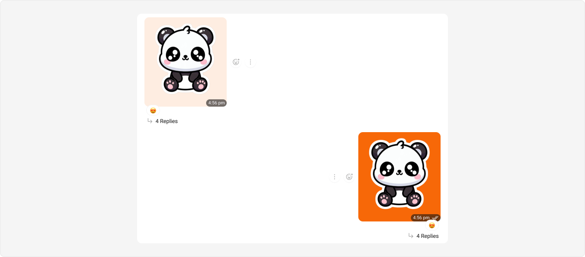

Use the following code to achieve the customization shown above.

```css title="App.css"
/* Outgoing Sticker Bubble */
.cometchat
  .cometchat-message-bubble-outgoing
  .cometchat-message-bubble__body.cometchat-message-bubble__sticker-message {
  --cometchat-primary-color: #f76808;
}

/* Incoming Sticker Bubble */
.cometchat
  .cometchat-message-bubble-incoming
  .cometchat-message-bubble__body.cometchat-message-bubble__sticker-message {
  --cometchat-neutral-color-300: #feede1;
}
```

---

#### Link Preview Bubble

Shown below is the default chat interface.

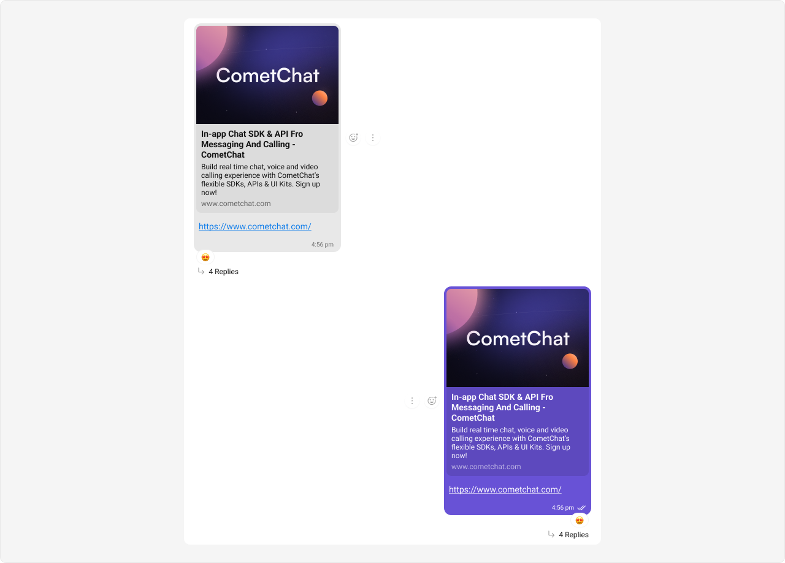

The customized chat interface is displayed below.

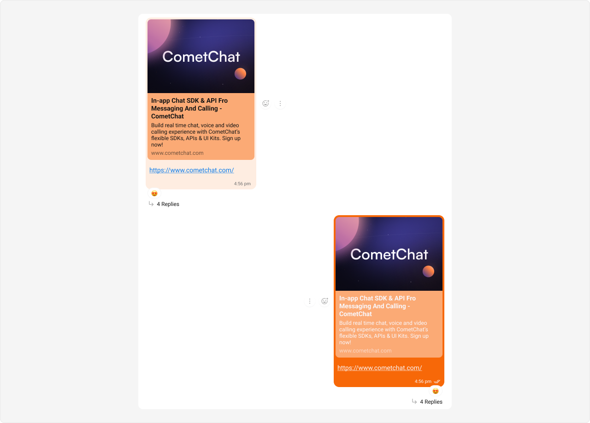

Use the following code to achieve the customization shown above.

```css title="App.css"
/* Outgoing Link Preview Bubble */
.cometchat
  .cometchat-message-bubble-outgoing
  .cometchat-message-bubble__body.cometchat-message-bubble__text-message {
  --cometchat-primary-color: #f76808;
  --cometchat-extended-primary-color-900: #fbaa75;
}

/* Incoming Link Preview Bubble */
.cometchat
  .cometchat-message-bubble-incoming
  .cometchat-message-bubble__body.cometchat-message-bubble__text-message {
  --cometchat-neutral-color-400: #fbaa75;
  --cometchat-neutral-color-300: #feede1;
}
```

---
