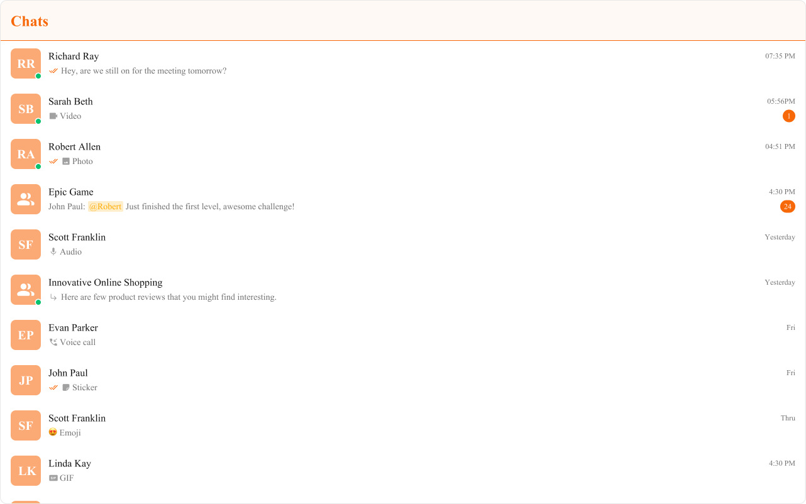
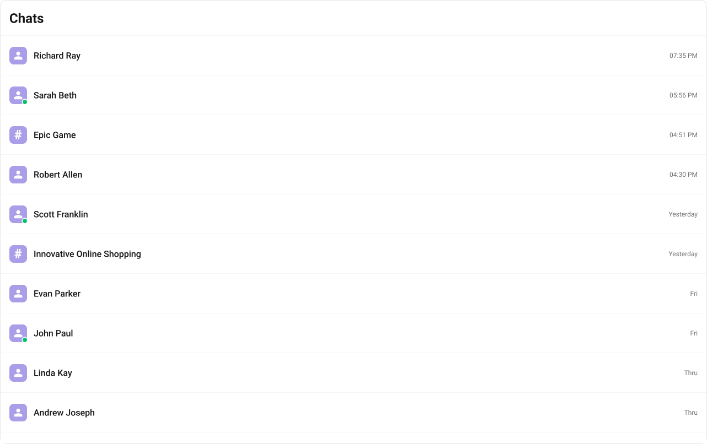
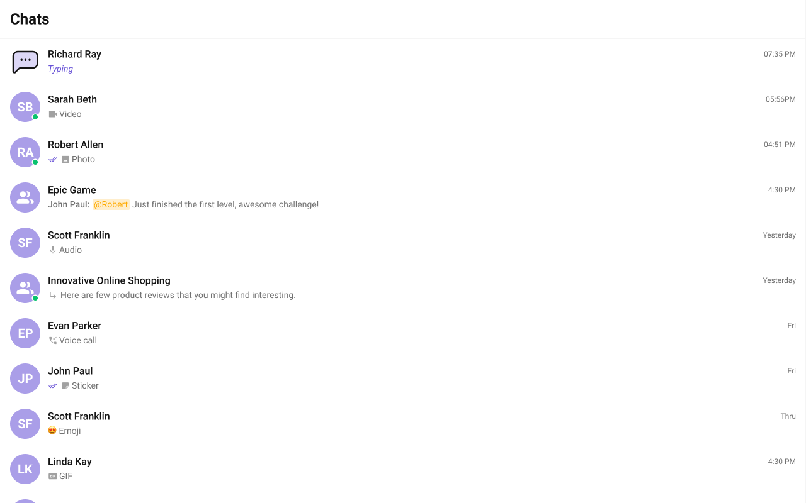
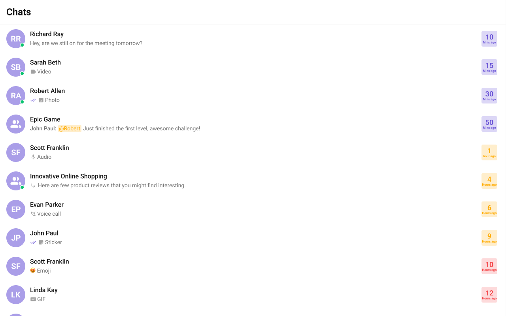
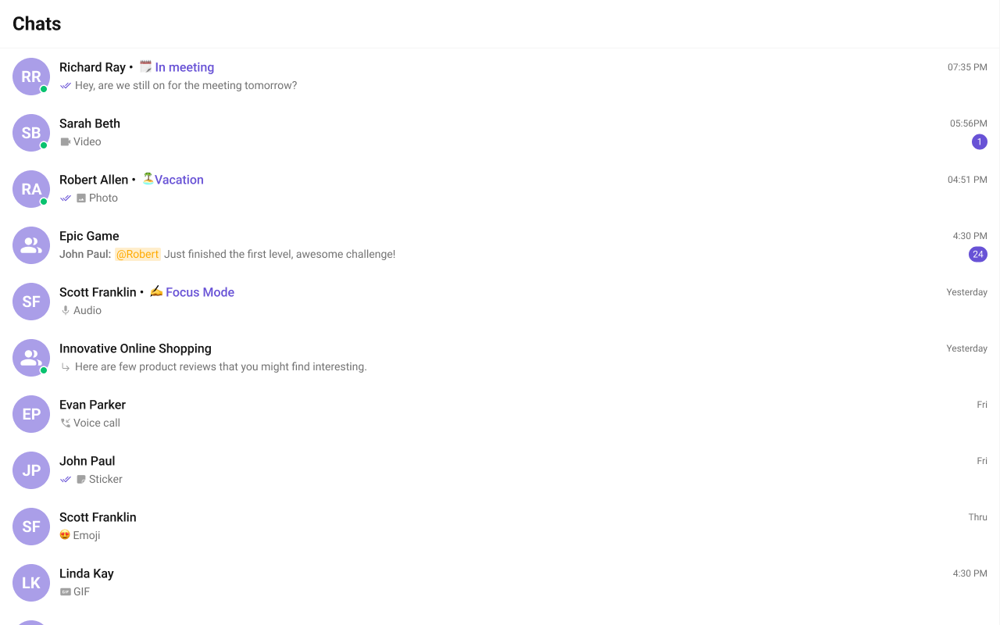
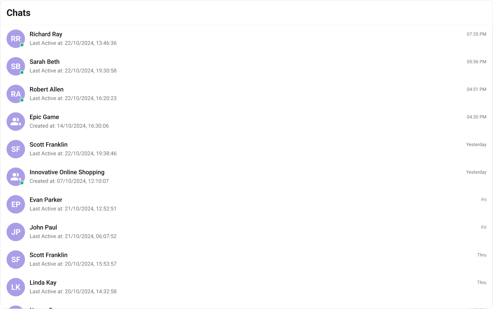
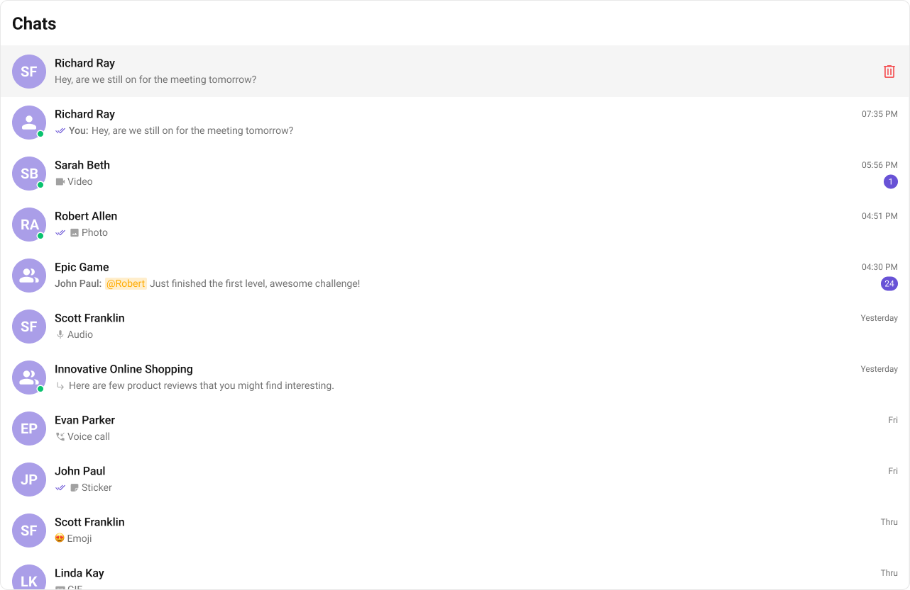
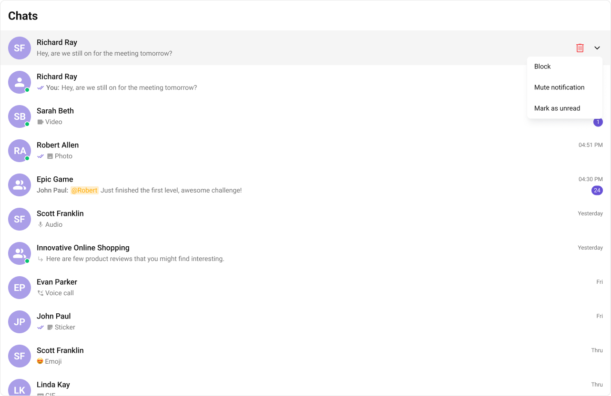

import Tabs from '@theme/Tabs';
import TabItem from '@theme/TabItem';

## Overview

The Conversations is a Component, that shows all conversations related to the currently logged-in user.

This component lists the most recent or latest conversations or contacts with whom you have exchanged messages. It provides a convenient way to quickly access and resume conversations with the people you have been in contact with recently.


## Usage

### Integration

<Tabs>
<TabItem value="ConversationsDemo" label="ConversationsDemo.tsx">

```tsx
import {
  CometChatConversations,
  TitleAlignment,
} from "@cometchat/chat-uikit-react";

function ConversationsDemo() {
  return (
    <div className="conversations" style={{ width: "100%", height: "100%" }}>
      <div>
        <CometChatConversations />
      </div>
    </div>
  );
}

export default ConversationsDemo;
```

</TabItem>
<TabItem value="ts" label="App.tsx">

```tsx
import { ConversationsDemo } from "./ConversationsDemo";

export default function App() {
  return (
    <div className="App">
      <ConversationsDemo />
    </div>
  );
}
```

</TabItem>
</Tabs>

### Actions

[Actions](components-overview#actions) dictate how a component functions. They are divided into two types: Predefined and User-defined. You can override either type, allowing you to tailor the behavior of the component to fit your specific needs.

##### 1. OnItemClick

`OnItemClick` is triggered when you click on a ListItem of the Conversations component.
The `OnItemClick` action doesn't have a predefined behavior. You can override this action using the following code snippet.

<Tabs>

<TabItem value="ConversationsDemo" label="ConversationsDemo.tsx">

```tsx
import { CometChatConversations } from "@cometchat/chat-uikit-react";

const getOnItemClick = (conversation: CometChat.Conversation) => {
  console.log("ItemClick:", conversation);
  // Your custom action here
};

<CometChatConversations onItemClick={getOnItemClick} />;
```

</TabItem>

</Tabs>

---

##### 2. OnSelect

The `OnSelect` event is triggered upon the completion of a selection in `SelectionMode`. It does not have a default behavior. However, you can override its behavior using the following code snippet.

<Tabs>

<TabItem value="ConversationsDemo" label="ConversationsDemo.tsx">

```tsx
import {
  CometChatConversations,
  SelectionMode,
} from "@cometchat/chat-uikit-react";

const getOnSelect = (
  conversation: CometChat.Conversation,
  selected: boolean
) => {
  console.log("Selected, ", conversation.getConversationId(), selected);
  // Your custom action on select
};

<CometChatConversations
  selectionMode={SelectionMode.multiple}
  onSelect={getOnSelect}
/>;
```

</TabItem>
</Tabs>

---

##### 3. OnError

This action doesn't change the behavior of the component but rather listens for any errors that occur in the Conversations component.

<Tabs>

<TabItem value="ConversationsDemo" label="ConversationsDemo.tsx">

```tsx
import { CometChatConversations } from "@cometchat/chat-uikit-react";

const handleOnError = (error: CometChat.CometChatException) => {
  // Your exception handling code
};

<CometChatConversations onError={handleOnError} />;
```

</TabItem>

</Tabs>

---

### Filters

You can set `ConversationsRequestBuilder` in the Conversations Component to filter the conversation list. You can modify the builder as per your specific requirements with multiple options available to know more refer to [ConversationRequestBuilder](/sdk/javascript/retrieve-conversations).

You can set filters using the following parameters.

1. **Conversation Type:** Filters on type of Conversation, `User` or `Groups`
1. **Limit:** Number of conversations fetched in a single request.
1. **WithTags:** Filter on fetching conversations containing tags
1. **Tags:** Filters on specific `Tag`
1. **UserTags:** Filters on specific User `Tag`
1. **GroupTags:** Filters on specific Group `Tag`

<Tabs>

<TabItem value="ConversationsDemo" label="ConversationsDemo.tsx">

```tsx
import { CometChatConversations } from "@cometchat/chat-uikit-react";
import { CometChat } from "@cometchat/chat-sdk-javascript";

<CometChatConversations
  conversationsRequestBuilder={new CometChat.ConversationsRequestBuilder().setLimit(
    10
  )}
/>;
```

</TabItem>
</Tabs>

---

### Events

[Events](components-overview#events) are emitted by a `Component`. By using event you can extend existing functionality. Being global events, they can be applied in Multiple Locations and are capable of being Added or Removed.

<Tabs>

<TabItem value="ConversationsDemo" label="Add Listener" >

```tsx
const ccConversationDeleted =
  CometChatConversationEvents.ccConversationDeleted.subscribe(
    (conversation: CometChat.Conversation) => {
      // Your code here
    }
  );
```

</TabItem>

</Tabs>

---

<Tabs>

<TabItem value="ConversationsDemo" label="Remove Listener">

```tsx
ccConversationDeleted?.unsubscribe();
```

</TabItem>

</Tabs>

## Customization

To fit your app's design requirements, you can customize the appearance of the conversation component. We provide exposed methods that allow you to modify the experience and behavior according to your specific needs.

### Style

Using CSS you can customize the look and feel of the component in your app like the color, size, shape, and fonts.



<Tabs>
<TabItem value="Typescript" label="Typescript">

```tsx
<CometChatConversations />
```

</TabItem>

<TabItem value="CSS" label="CSS">

```css
.cometchat-conversations .cometchat-list-item__body-title,
.cometchat-conversations .cometchat-list__header-title,
.cometchat-conversations .cometchat-avatar__text,
.cometchat-conversations .cometchat-badge,
.cometchat-conversations .cometchat-conversations__subtitle-text {
  font-family: "SF Pro";
}

.cometchat-conversations .cometchat-list__header-title {
  background: #fef8f8;
  border-bottom: 2px solid #f4b6b8;
}

.cometchat-conversations .cometchat-avatar {
  background: #f0999b;
}

.cometchat-conversations .cometchat-status-indicator {
  min-width: 10px;
  height: 10px;
}

.cometchat-conversations .cometchat-badge {
  background: #e5484d;
}

.cometchat-conversations .cometchat-receipts-read {
  background: #e96b6f;
}
```

</TabItem>
</Tabs>

### Functionality

These are a set of small functional customizations that allow you to fine-tune the overall experience of the component. With these, you can change text, set custom icons, and toggle the visibility of UI elements.

<Tabs>
<TabItem value="ConversationsDemo" label="ConversationsDemo.tsx">

```tsx
<div className="conversations" style={{ width: "100%", height: "100%" }}>
  <div>
    <CometChatConversations title="Your Custom Title" />
  </div>
</div>
```

</TabItem>
</Tabs>

Below is a list of customizations along with corresponding code snippets

| Property | Description | Code |
| ---------| ----------- | ---- |
| **Hide Receipts** | Disables the display of message read receipts. If set to `true`, the receipt status of the sent message won't be displayed. | `hideReceipts={false}` |
| **Hide Error** | Hides the default and the custom error view passed in the `errorView` prop. | `hideError={true}` |
| **Hide Delete Conversation** | Hides the delete conversation option in the default context menu. | `hideDeleteConversation={false}` |
| **Hide User Status** | Hides the user's online/offline status indicator. | `hideUserStatus={true}` |
| **Hide Group Type** | Hides the group type icon. | `hideGroupType={false}` |
| **Active Conversation** | Specifies the conversation to highlight in the list. | `activeConversation={activeConversation}` |
| **Selection Mode** |  Determines the selection mode for the component. | `selectionMode={SelectionMode.multiple}` |
| **Disable Sound For Messages** | Used to Disable sound for incoming messages. | `disableSoundForMessages={false}` |
| **Custom Sound For Messages** | Custom audio sound for incoming messages. | `customSoundForMessages="Your custom sound url"` |
| **Loading  View** | A custom component to display during the loading state. | `loadingView={<>Custom Loading View</>}` |
| **Empty View** | A custom component to display when there are no conversations available. | `emptyView={<>Custom Empty View</>}` |
| **Error View** | A custom component to display when an error occurs. | `errorView={<>Custom Error View</>}` |

### Advanced

For advanced-level customization, you can set custom views to the component. This lets you tailor each aspect of the component to fit your exact needs and application aesthetics. You can create and define your views, layouts, and UI elements and then incorporate those into the component.

---

#### ItemView

With this function, you can assign a custom ListItem to the Conversations Component.

Shown below is the default chat interface.


The customized chat interface is displayed below.



Use the following code to achieve the customization shown above.

<Tabs>

<TabItem value="Typescript" label="Typescript">

```tsx
import { CometChat } from "@cometchat/chat-sdk-javascript";
import {
  CometChatListItem,
  CometChatConversations,
} from "@cometchat/chat-uikit-react";

const getItemView = (conversation: CometChat.Conversation) => {
  const title = conversation.getConversationWith().getName();
  const timestamp = conversation?.getLastMessage()?.getSentAt();

  return (
    <CometChatListItem
      title={title}
      avatarName={title}
      id={conversation.getConversationId()}
      trailingView={<CometChatDate timestamp={timestamp} />}
      onListItemClicked={() => {
        // Logic here
      }}
    />
  );
};

<CometChatConversations
  itemView={getItemView} // Custom list item view
/>;
```

</TabItem>

<TabItem value="CSS" label="CSS">

```css
.cometchat-conversations .cometchat-avatar {
  border-radius: 8px;
  width: 32px;
  height: 32px;
}

.cometchat-conversations .cometchat-list-item {
  gap: 4px;
}
```

</TabItem>
</Tabs>

---
#### LeadingView

The customized chat interface is displayed below.



Use the following code to achieve the customization shown above.

<Tabs>
<TabItem value="TypeScript" label="TypeScript">

```tsx
import React from "react";
import { CometChat } from "@cometchat/chat-sdk-javascript";
import { CometChatConversations,CometChatAvatar } from "@cometchat/chat-uikit-react";
import {useEffect, useRef, useState} from "react";
const [isTyping, setIsTyping] = useState<boolean>(false);
const typingObjRef = useRef<CometChat.TypingIndicator | null>(null);

useEffect(()=>{
  //adding typing listeners
  const messageListenerId: string = "typing_demo_" + new Date().getTime();
  CometChat.addMessageListener(messageListenerId, new CometChat.MessageListener({
  onTypingStarted: (typingIndicator: CometChat.TypingIndicator) => {
  typingObjRef.current = typingIndicator;
  setIsTyping(true)
},
  onTypingEnded: (typingIndicator: CometChat.TypingIndicator) => {
  if(typingObjRef.current && typingObjRef.current.getSender().getUid() == typingIndicator.getSender().getUid()){
  typingObjRef.current = null;
  setIsTyping(false)
  }
},}))
  return () => {
 CometChat.removeMessageListener(messageListenerId)
  };
 },[setIsTyping])

// Custom leading view component
const CustomLeadingView = (conversation: CometChat.Conversation) => {
    const conversationObj = conversation.getConversationWith();
    const isUser = conversationObj instanceof CometChat.User;
    const isGroup = conversationObj instanceof CometChat.Group;

    // Check if the current user is typing
    const isMyTyping = isUser
        ? (conversationObj as CometChat.User).getUid() === typingObjRef.current?.getSender().getUid() &&
          loggedInUser?.getUid() === typingObjRef.current?.getReceiverId()
        : isGroup &&
          (conversationObj as CometChat.Group).getGuid() === typingObjRef.current?.getReceiverId();

    // Determine avatar and name
    const avatar = isUser
        ? (conversationObj as CometChat.User).getAvatar()
        : (conversationObj as CometChat.Group).getIcon();
    const name = isTyping && isMyTyping ? undefined : conversationObj.getName();
    const image = isTyping && isMyTyping ? "TYPING_ICON_HERE" : avatar;

    return (
        <div className="conversations__leading-view">
            <CometChatAvatar image={image} name={name} />
        </div>
    );
};
<CometChatConversations  leadingView={CustomLeadingView} />;
```
</TabItem>
</Tabs>

---

#### TrailingView

The customized chat interface is displayed below.



Use the following code to achieve the customization shown above.

<Tabs>
<TabItem value="TypeScript" label="TypeScript">

```tsx
import React from "react";
import { CometChat } from "@cometchat/chat-sdk-javascript";
import {
  CometChatConversations
} from "@cometchat/chat-uikit-react";

// Custom trailing view component
 const CustomTrailingButtonView = (conv: CometChat.Conversation) => {
  if (!conv.getLastMessage()) {
    return <></>;
  }
  const timestamp = conv.getLastMessage()?.getSentAt() * 1000;
  const now = new Date();
  const time = new Date(timestamp);
      
  // Calculate time difference
  const diffInMs = now.getTime() - time.getTime();
  const diffInMinutes = Math.floor(diffInMs / (1000 * 60));
  const diffInHours = Math.floor(diffInMs / (1000 * 60 * 60));
      
  // Determine the labels
  let backgroundColorClass = "conversations__trailing-view-min"; // Default (less than 1 hour)
  let topLabel = `${diffInMinutes}`; // Default minutes
  let bottomLabel = `${diffInMinutes === 1 ? "Min ago" : "Mins ago"}`; // Default "Mins ago"
      
  if (diffInHours >= 1 && diffInHours <= 10) {
    // 1-10 hours
    backgroundColorClass = "conversations__trailing-view-hour";
    topLabel = `${diffInHours}`;
    bottomLabel = `${diffInHours === 1 ? "Hour ago" : "Hours ago"}`;
  } else if (diffInHours > 10) {
    // More than 10 hours
    backgroundColorClass = "conversations__trailing-view-date";
    topLabel = time.toLocaleDateString("en-US", { day: "numeric" });
    bottomLabel = time.toLocaleDateString("en-US", {
      month: "short",
      year: "numeric",
    });
  }
  return (
  <div className={`conversations__trailing-view ${backgroundColorClass}`}>
  <span className="conversations__trailing-view-time">{topLabel}</span>
  <span className="conversations__trailing-view-status">{bottomLabel}</span>
  </div>
  );
};

<CometChatConversations  trailingView={CustomTrailingButtonView} />;
```

</TabItem>

<TabItem value="CSS" label="CSS">

```css
.conversations__trailing-view {
  display: flex;
  flex-direction: column;
  align-items: center;
  justify-content: center;
  width: 55px;
  height: 40px;
  border-radius: 8px;
  box-shadow: 0 2px 4px rgba(0, 0, 0, 0.1);
  font-family: Arial, sans-serif;
}

.conversations__trailing-view-min {
  background-color: #e0d4f7;
}

.conversations__trailing-view-hour {
  background-color: #fff3cd;
}

.conversations__trailing-view-date {
  background-color: #f8d7da;
}

.conversations__trailing-view-time{
  font-size: 20px;
  font-weight: bold;
  color: #4a3f99;
  margin-bottom: 4px;
  font:600 18px Roboto;
}

.conversations__trailing-view-status {
  font:600 8px Roboto;
  color: #6a5b99;
}
.cometchat-conversations .cometchat-list-item__trailing-view{
  height: 50px;
}
```

</TabItem>
</Tabs>
---

#### TextFormatters

Assigns the list of text formatters. If the provided list is not null, it sets the list. Otherwise, it assigns the default text formatters retrieved from the data source. To configure the existing Mentions look and feel check out [CometChatMentionsFormatter](mentions-formatter-guide)

<Tabs>
<TabItem value="ShortCutFormatter" label="ShortCutFormatter.ts">

```tsx
import { CometChatTextFormatter } from "@cometchat/chat-uikit-react";
import DialogHelper from "./Dialog";
import { CometChat } from "@cometchat/chat-sdk-javascript";

class ShortcutFormatter extends CometChatTextFormatter {
  private shortcuts: { [key: string]: string } = {};
  private dialogIsOpen: boolean = false;
  private dialogHelper = new DialogHelper();
  private currentShortcut: string | null = null; // Track the currently open shortcut

  constructor() {
    super();
    this.setTrackingCharacter("!");
    CometChat.callExtension("message-shortcuts", "GET", "v1/fetch", undefined)
      .then((data: any) => {
        if (data && data.shortcuts) {
          this.shortcuts = data.shortcuts;
        }
      })
      .catch((error) => console.log("error fetching shortcuts", error));
  }

  onKeyDown(event: KeyboardEvent) {
    const caretPosition =
      this.currentCaretPosition instanceof Selection
        ? this.currentCaretPosition.anchorOffset
        : 0;
    const textBeforeCaret = this.getTextBeforeCaret(caretPosition);

    const match = textBeforeCaret.match(/!([a-zA-Z]+)$/);
    if (match) {
      const shortcut = match[0];
      const replacement = this.shortcuts[shortcut];
      if (replacement) {
        // Close the currently open dialog, if any
        if (this.dialogIsOpen && this.currentShortcut !== shortcut) {
          this.closeDialog();
        }
        this.openDialog(replacement, shortcut);
      }
    }
  }

  getCaretPosition() {
    if (!this.currentCaretPosition?.rangeCount) return { x: 0, y: 0 };
    const range = this.currentCaretPosition?.getRangeAt(0);
    const rect = range.getBoundingClientRect();
    return {
      x: rect.left,
      y: rect.top,
    };
  }

  openDialog(buttonText: string, shortcut: string) {
    this.dialogHelper.createDialog(
      () => this.handleButtonClick(buttonText),
      buttonText
    );
    this.dialogIsOpen = true;
    this.currentShortcut = shortcut;
  }

  closeDialog() {
    this.dialogHelper.closeDialog(); // Use DialogHelper to close the dialog
    this.dialogIsOpen = false;
    this.currentShortcut = null;
  }

  handleButtonClick = (buttonText: string) => {
    if (this.currentCaretPosition && this.currentRange) {
      // Inserting the replacement text corresponding to the shortcut
      const shortcut = Object.keys(this.shortcuts).find(
        (key) => this.shortcuts[key] === buttonText
      );
      if (shortcut) {
        const replacement = this.shortcuts[shortcut];
        this.addAtCaretPosition(
          replacement,
          this.currentCaretPosition,
          this.currentRange
        );
      }
    }
    if (this.dialogIsOpen) {
      this.closeDialog();
    }
  };

  getFormattedText(text: string): string {
    return text;
  }

  private getTextBeforeCaret(caretPosition: number): string {
    if (
      this.currentRange &&
      this.currentRange.startContainer &&
      typeof this.currentRange.startContainer.textContent === "string"
    ) {
      const textContent = this.currentRange.startContainer.textContent;
      if (textContent.length >= caretPosition) {
        return textContent.substring(0, caretPosition);
      }
    }
    return "";
  }
}

export default ShortcutFormatter;
```

</TabItem>
<TabItem value="Dialog" label="Dialog.tsx">

```tsx
import React from "react";
import ReactDOM from "react-dom";

interface DialogProps {
  onClick: () => void;
  buttonText: string;
}

const Dialog: React.FC<DialogProps> = ({ onClick, buttonText }) => {
  console.log("buttonText", buttonText);

  return (
    <div
      style={{
        position: "fixed",
        left: "300px",
        top: "664px",
        width: "800px",
        height: "45px",
      }}
    >
      <button
        style={{
          width: "800px",
          height: "100%",
          cursor: "pointer",
          backgroundColor: "#f2e6ff",
          border: "2px solid #9b42f5",
          borderRadius: "12px",
          textAlign: "left",
          paddingLeft: "20px",
          font: "600 15px sans-serif, Inter",
        }}
        onClick={onClick}
      >
        {buttonText}
      </button>
    </div>
  );
};

export default class DialogHelper {
  private dialogContainer: HTMLDivElement | null = null;

  createDialog(onClick: () => void, buttonText: string) {
    this.dialogContainer = document.createElement("div");
    document.body.appendChild(this.dialogContainer);

    ReactDOM.render(
      <Dialog onClick={onClick} buttonText={buttonText} />,
      this.dialogContainer
    );
  }

  closeDialog() {
    if (this.dialogContainer) {
      ReactDOM.unmountComponentAtNode(this.dialogContainer);
      this.dialogContainer.remove();
      this.dialogContainer = null;
    }
  }
}
```

</TabItem>
<TabItem value="ConversationDemo" label="ConversationDemo.tsx">

```tsx
import ShortcutFormatter from "./ShortCutFormatter";

<CometChatConversations textFormatters={[new ShortcutFormatter()]} />;
```

</TabItem>
</Tabs>

#### Header View

You can set the Custom Header view to add more options to the Conversations component.

The customized chat interface is displayed below.


Use the following code to achieve the customization shown above.

<Tabs>
<TabItem value="Typescript" label="Typescript">

```tsx
import {
  CometChatButton,
  CometChatConversations,
} from "@cometchat/chat-uikit-react";

const getHeaderView = () => {
return (
  <div className="conversations__header">
  <div className="conversations__header__title">
  {localize("CHATS")}
  </div>
  <CometChatButton 
  onClick={() => {
  // logic here
  }}
  iconURL={ICON_URL} 
  />
  </div>
);
};

<CometChatConversations headerView={getHeaderView()} />;
```

</TabItem>
<TabItem value="CSS" label="CSS">

```css
.conversations__header {
  display: flex;
  width: 100%;
  padding: 8px 16px;
  align-items: center;
  justify-content: space-between;
  gap: 12px;
  flex: 1 0 0;
  align-self: stretch;
  border-radius: 10px;
  border: 1px solid #E8E8E8;
  background: #EDEAFA;
}
.conversations__header__title {
  overflow: hidden;
  color: #141414;
  text-overflow: ellipsis;
  font: 700 24px Roboto;
}
.conversations__header .cometchat-button .cometchat-button__icon {
  background: #141414;
}
.conversations__header .cometchat-button{
  width: 24px;
  border: none;
  background: transparent;
  border-radius: 0;
  display: block;
}
```

</TabItem>
</Tabs>

---
#### Last Message Date Time Format

The `lastMessageDateTimeFormat` property allows you to customize the **Last Message** timestamp is displayed in the conversations.

Default Date Time Format:

```tsx
new CalendarObject({
    today: `hh:mm A`, // Example: "10:30 AM"
    yesterday: `[yesterday]`, // Example: "yesterday"
    otherDays: `DD/MM/YYYY`, // Example: "25/05/2025"
});
```

The following example demonstrates how to modify the **Last Message** timestamp format using a custom [`CalendarObject`](../04-Theming/04-localize.md#calendarobject).

<Tabs>
<TabItem value="TypeScript" label="TypeScript">

```tsx
import {
  CometChatConversations,
  CalendarObject
} from "@cometchat/chat-uikit-react";

// Define a custom date format pattern
function getDateFormat() {
  const dateFormat = new CalendarObject({
    today: `DD MMM, hh:mm A`,   // Example: "25 Jan, 10:30 AM"
    yesterday: `DD MMM, hh:mm A`, // Example: "25 Jan, 10:30 AM"
    otherDays: `DD MMM, hh:mm A`,  // Example: "25 Jan, 10:30 AM"
  });
  return dateFormat;
}

// Apply the custom format to the CometChatConversations component
<CometChatConversations lastMessageDateTimeFormat={getDateFormat()} />;
```

</TabItem>
</Tabs>

:::info  
**Fallback Mechanism**  
- If you **do not** pass any property in the [**CalendarObject**](../04-Theming/04-localize.md#calendarobject), the component will first check the [**global configuration**](../04-Theming/04-localize.md#customisation). If the property is **also missing in the global configuration**, it will **fallback to the component's default formatting**.
:::

---

#### TitleView

The customized chat interface is displayed below.



Use the following code to achieve the customization shown above.

<Tabs>
<TabItem value="TypeScript" label="TypeScript">

```tsx
import React from "react";
import { CometChat } from "@cometchat/chat-sdk-javascript";
import { CometChatConversations } from "@cometchat/chat-uikit-react";

// Custom title view component
const customTitleView = (conversation:CometChat.Conversation)=> {
  let user = conversation.getConversationType() == "user" ? conversation.getConversationWith() as CometChat.User : undefined;
  return  <div className="conversations__title-view">
  <span className="conversations__title-view-name">{ user ? conversation.getConversationWith().getName() +  " • " : conversation.getConversationWith().getName()}</span>
  {user ? <span className="conversations__title-view-status">{user.getStatusMessage()}</span> : null}
  </div>;
}

<CometChatConversations titleView={customTitleView} />;
```

</TabItem>
<TabItem value="CSS" label="CSS">

```css
.cometchat-conversations .conversations__title-view{
    display: flex;
    gap: 4px;
    width: 100%;
}

.cometchat-conversations .conversations__title-view .conversations__title-view-name{
    color: #141414;
    font: 500 16px/19.2px Roboto;
    text-align: left;
}
.cometchat-conversations .conversations__title-view .conversations__title-view-status{
    color: #6852D6;
    font: 400 16px/19.2px Roboto;
    text-align: left;
}

```

</TabItem>
</Tabs>

---

#### SubtitleView

You can customize the subtitle view for each conversation item to meet your requirements.

Shown below is the default chat interface.


The customized chat interface is displayed below.



Use the following code to achieve the customization shown above.

<Tabs>
<TabItem value="Typescript" label="Typescript">

```tsx
import { CometChat } from "@cometchat/chat-sdk-javascript";
import { CometChatConversations } from "@cometchat/chat-uikit-react";

const subtitleView = (conversation: CometChat.Conversation) => {
  if (conversation.getConversationType() === "user") {
    return (
      <>
        Last Message at:{" "}
        {getFormattedTimestamp(
          (
            conversation.getConversationWith() as CometChat.User
          ).getLastActiveAt()
        )}
      </>
    );
  } else {
    return (
      <>
        Created at:{" "}
        {getFormattedTimestamp(
          (conversation.getConversationWith() as CometChat.Group).getCreatedAt()
        )}
      </>
    );
  }
};

function getFormattedTimestamp(timestamp: number): string {
  const date = new Date(timestamp * 1000);
  return date.toLocaleString();
}

<CometChatConversations subtitleView={subtitleView} />;
```

</TabItem>
<TabItem value="CSS" label="CSS">

```css
.cometchat-conversations .cometchat-list-item__body-subtitle {
  overflow: hidden;
  color: var(--cometchat-text-color-secondary, #727272);
  text-overflow: ellipsis;
  white-space: nowrap;
  font: var(--cometchat-font-body-regular);
  font-family: "SF Pro";
  font-style: normal;
}
```

</TabItem>
</Tabs>

---

#### Options

A function that returns a list of actions available when hovering over a conversation item.

Shown below is the default chat interface.



The customized chat interface is displayed below.



Use the following code to achieve the customization shown above.

<Tabs>

<TabItem value="Typescript" label="Typescript">

```tsx
import {
  CometChatOption,
  CometChatConversations,
} from "@cometchat/chat-uikit-react";

const getOptions = (conversation: CometChat.Conversation) => {
  return [
    new CometChatOption({
      title: "Delete",
      iconURL: deleteIcon,
      id: "delete",
      onClick: () => {
        // Logic here
      },
    }),
    new CometChatOption({
      title: "Mute Notification",
      id: "mute",
      onClick: () => {
        // Logic here
      },
    }),
    new CometChatOption({
      title: "Mark as Unread",
      id: "unread",
      onClick: () => {
        // Logic here
      },
    }),
    new CometChatOption({
      title: "Block",
      id: "block",
      onClick: () => {
        // Logic here
      },
    }),
  ];
};

<CometChatConversations options={getOptions} />;
```

</TabItem>

<TabItem value="CSS" label="CSS">

```css
.cometchat-conversations .cometchat-menu-list__main-menu-item-icon-delete {
  background: red;
}

.cometchat-conversations .cometchat-menu-list__sub-menu {
  background: transparent;
  box-shadow: none;
}

.cometchat-conversations .cometchat-menu-list__sub-menu-icon {
  -webkit-mask: url(./assets/down-arrow.svg) center center no-repeat;
  -webkit-mask-size: contain;
}
```

</TabItem>

</Tabs>

##### Structure of CometChatOption

| Name        | Description                                           |
| ----------- | ----------------------------------------------------- |
| **id**      | Unique identifier for each option.                    |
| **title**   | Heading text for each option.                         |
| **iconURL** | Sets the asset URL of the icon for each option.       |
| **onClick** | Method to be invoked when user clicks on each option. |

---
