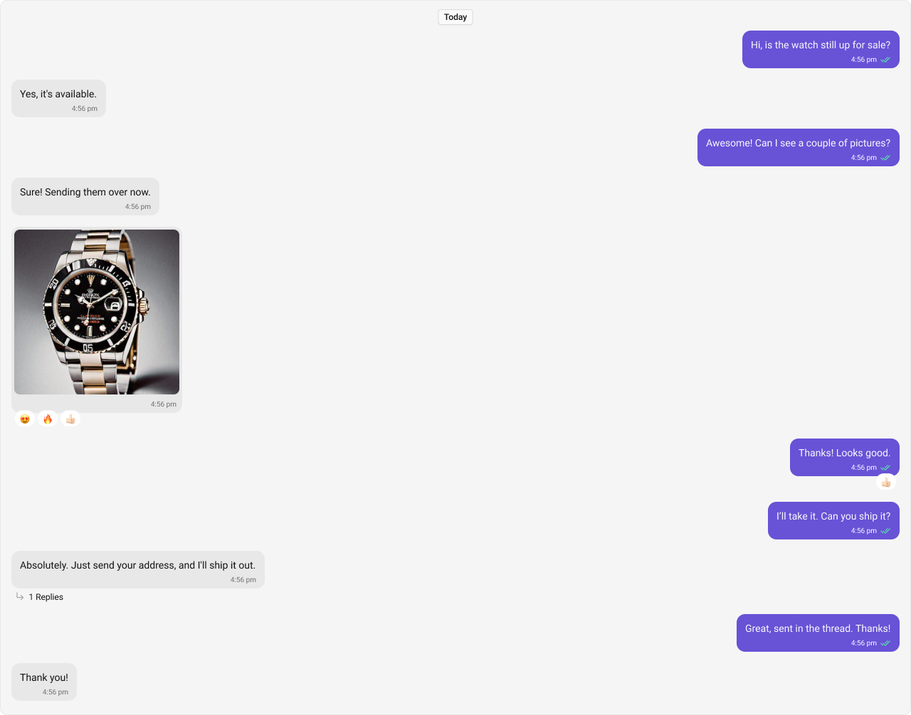
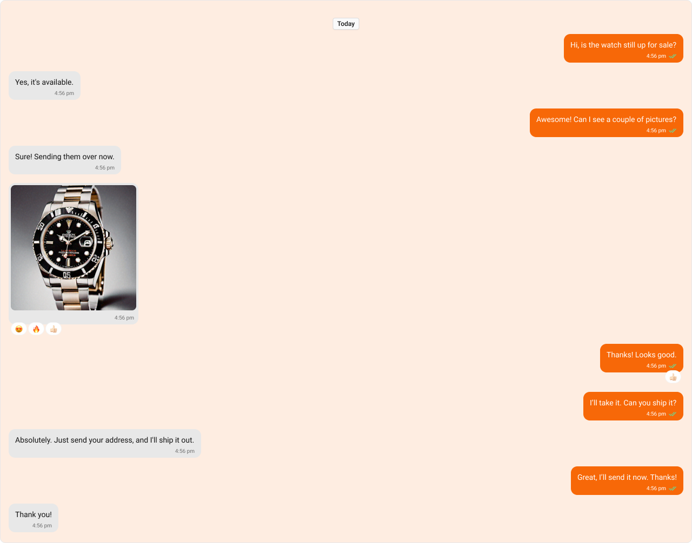
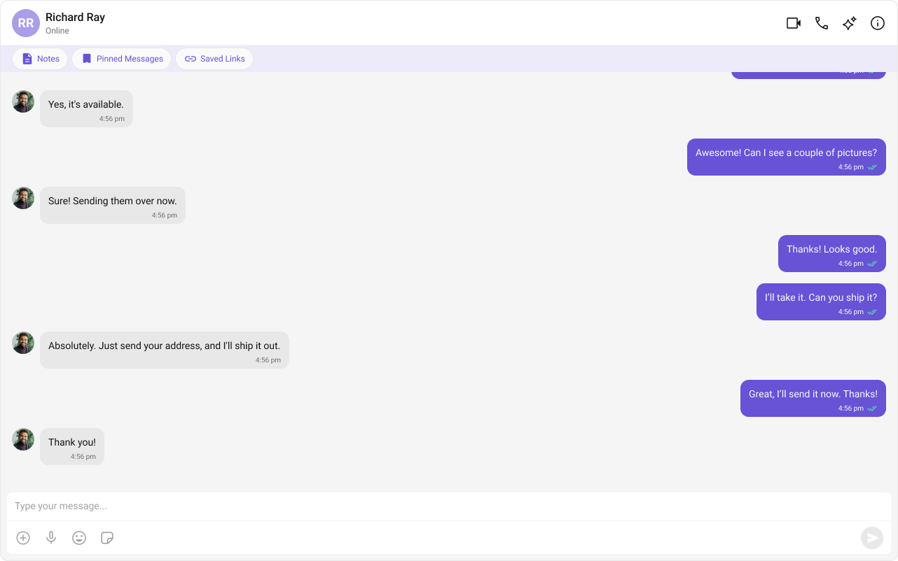
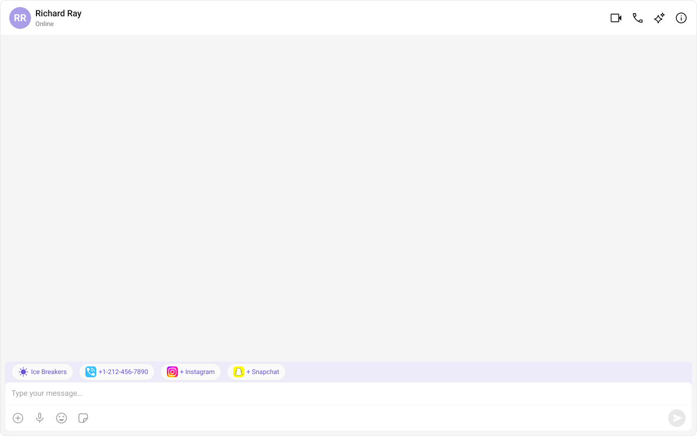

import Tabs from '@theme/Tabs';
import TabItem from '@theme/TabItem';

## Overview

`MessageList` is a composite component that displays a list of messages and effectively manages real-time operations. It includes various types of messages such as Text Messages, Media Messages, Stickers, and more.



---

## Usage

### Integration

The following code snippet illustrates how you can directly incorporate the MessageList component into your Application.

<Tabs>
<TabItem value="MessageListDemo" label="MessageListDemo.tsx">

```tsx
import React from "react";
import { CometChat } from "@cometchat/chat-sdk-javascript";
import { CometChatMessageList } from "@cometchat/chat-uikit-react";

export function MessageListDemo() {
  const [chatUser, setChatUser] = React.useState<CometChat.User>();
  React.useEffect(() => {
    CometChat.getUser("uid").then((user) => {
      setChatUser(user);
    });
  }, []);

  return chatUser ? (
    <div>
      <CometChatMessageList user={chatUser} />
    </div>
  ) : null;
}
```

</TabItem>
<TabItem value="App" label="App.tsx">

```tsx
import { MessageListDemo } from "./MessageListDemo";

export default function App() {
  return (
    <div className="App">
      <div>
        <MessageListDemo />
      </div>
    </div>
  );
}
```

</TabItem>
</Tabs>

:::warning

To fetch messages for a specific entity, you need to supplement it with `User` or `Group` Object.

:::

---

### Actions

[Actions](components-overview#actions) dictate how a component functions. They are divided into two types: Predefined and User-defined. You can override either type, allowing you to tailor the behavior of the component to fit your specific needs.

##### 1. onThreadRepliesClick

`onThreadRepliesClick` is triggered when you click on the threaded message bubble.
The `onThreadRepliesClick` action doesn't have a predefined behavior. You can override this action using the following code snippet.

<Tabs>
<TabItem value="TypeScript" label="TypeScript">

```tsx
import React from "react";
import { CometChat } from "@cometchat/chat-sdk-javascript";
import { CometChatMessageList } from "@cometchat/chat-uikit-react";

export function MessageListDemo() {
  const [chatUser, setChatUser] = React.useState<CometChat.User>();
  React.useEffect(() => {
    CometChat.getUser("uid").then((user) => {
      setChatUser(user);
    });
  }, []);

  const getOnThreadRepliesClick = () => {
    //your custom actions
  };

  return chatUser ? (
    <div>
      <CometChatMessageList
        user={chatUser}
        onThreadRepliesClick={getOnThreadRepliesClick}
      />
    </div>
  ) : null;
}
```

</TabItem>

<TabItem value="JavaScript" label="JavaScript">

```jsx
import React from "react";
import { CometChat } from "@cometchat/chat-sdk-javascript";
import { CometChatMessageList } from "@cometchat/chat-uikit-react";

export function MessageListDemo() {
  const [chatUser, setChatUser] = React.useState(null);

  React.useEffect(() => {
    CometChat.getUser("uid").then((user) => {
      setChatUser(user);
    });
  }, []);

  const getOnThreadRepliesClick = () => {
    //your custom actions
  };

  return chatUser ? (
    <div>
      <CometChatMessageList
        user={chatUser}
        onThreadRepliesClick={getOnThreadRepliesClick}
      />
    </div>
  ) : null;
}
```

</TabItem>
</Tabs>

##### 2. onError

This action doesn't change the behavior of the component but rather listens for any errors that occur in the MessageList component.

<Tabs>
<TabItem value="TypeScript" label="TypeScript">

```tsx
import React from "react";
import { CometChat } from "@cometchat/chat-sdk-javascript";
import { CometChatMessageList } from "@cometchat/chat-uikit-react";

export function MessageListDemo() {
  const [chatUser, setChatUser] = React.useState<CometChat.User>();
  React.useEffect(() => {
    CometChat.getUser("uid").then((user) => {
      setChatUser(user);
    });
  }, []);

  function handleError(error: CometChat.CometChatException) {
    throw new Error("your custom error action");
  }

  return chatUser ? (
    <div>
      <CometChatMessageList user={chatUser} onError={handleError} />
    </div>
  ) : null;
}
```

</TabItem>

<TabItem value="JavaScript" label="JavaScript">

```jsx
import React from "react";
import { CometChat } from "@cometchat/chat-sdk-javascript";
import { CometChatMessageList } from "@cometchat/chat-uikit-react";

export function MessageListDemo() {
  const [chatUser, setChatUser] = React.useState(null);

  React.useEffect(() => {
    CometChat.getUser("uid").then((user) => {
      setChatUser(user);
    });
  }, []);

  const handleError = (error) => {
    throw new Error("your custom error action");
  };

  return chatUser ? (
    <div>
      <CometChatMessageList user={chatUser} onError={handleError} />
    </div>
  ) : null;
}
```

</TabItem>
</Tabs>

##### 3. onReactionClick

`onReactionClick` is triggered when you click on the reaction item of the message bubble.
The `onReactionClick` action doesn't have a predefined behavior. You can override this action using the following code snippet.

<Tabs>
<TabItem value="TypeScript" label="TypeScript">

```tsx
import React from "react";
import { CometChat } from "@cometchat/chat-sdk-javascript";
import { CometChatMessageList } from "@cometchat/chat-uikit-react";

export function MessageListDemo() {
  const [chatUser, setChatUser] = React.useState<CometChat.User>();
  React.useEffect(() => {
    CometChat.getUser("uid").then((user) => {
      setChatUser(user);
    });
  }, []);

  function onReactionClick(reaction: CometChat.ReactionCount, message: CometChat.BaseMessage) {
    //your custom action
  }

  return chatUser ? (
    <div>
      <CometChatMessageList user={chatUser} onReactionClick={onReactionClick} />
    </div>
  ) : null;
}
```

</TabItem>

<TabItem value="JavaScript" label="JavaScript">

```jsx
import React from "react";
import { CometChat } from "@cometchat/chat-sdk-javascript";
import { CometChatMessageList } from "@cometchat/chat-uikit-react";

export function MessageListDemo() {
  const [chatUser, setChatUser] = React.useState(null);

  React.useEffect(() => {
    CometChat.getUser("uid").then((user) => {
      setChatUser(user);
    });
  }, []);

  const onReactionClick = (reaction, message) => {
    //your custom action
  };

  return chatUser ? (
    <div>
      <CometChatMessageList user={chatUser} onReactionClick={onReactionClick} />
    </div>
  ) : null;
}
```

</TabItem>
</Tabs>

##### 4. onReactionListItemClick

`onReactionListItemClick` is triggered when you click on the reaction list item of the reaction list.
The `onReactionListItemClick` action doesn't have a predefined behavior. You can override this action using the following code snippet.

<Tabs>
<TabItem value="TypeScript" label="TypeScript">

```tsx
import React from "react";
import { CometChat } from "@cometchat/chat-sdk-javascript";
import { CometChatMessageList } from "@cometchat/chat-uikit-react";

export function MessageListDemo() {
  const [chatUser, setChatUser] = React.useState<CometChat.User>();
  React.useEffect(() => {
    CometChat.getUser("uid").then((user) => {
      setChatUser(user);
    });
  }, []);

  function onReactionListItemClick(reaction: CometChat.Reaction, message: CometChat.BaseMessage) {
    //your custom action
  }

  return chatUser ? (
    <div>
      <CometChatMessageList user={chatUser} onReactionListItemClick={onReactionListItemClick} />
    </div>
  ) : null;
}
```

</TabItem>

<TabItem value="JavaScript" label="JavaScript">

```jsx
import React from "react";
import { CometChat } from "@cometchat/chat-sdk-javascript";
import { CometChatMessageList } from "@cometchat/chat-uikit-react";

export function MessageListDemo() {
  const [chatUser, setChatUser] = React.useState(null);

  React.useEffect(() => {
    CometChat.getUser("uid").then((user) => {
      setChatUser(user);
    });
  }, []);

  const onReactionListItemClick = (reaction, message) => {
    //your custom action
  };

  return chatUser ? (
    <div>
      <CometChatMessageList user={chatUser} onReactionListItemClick={onReactionListItemClick} />
    </div>
  ) : null;
}
```

</TabItem>
</Tabs>


### Filters

##### 1. Messages Request Builder
You can adjust the `MessagesRequestBuilder` in the MessageList Component to customize your message list. Numerous options are available to alter the builder to meet your specific needs. For additional details on `MessagesRequestBuilder`, please visit [MessagesRequestBuilder](/sdk/javascript/additional-message-filtering).

In the example below, we are applying a filter to the messages based on a search substring and for a specific user. This means that only messages that contain the search term and are associated with the specified user will be displayed

<Tabs>
<TabItem value="TypeScript" label="TypeScript">

```tsx
import React from "react";
import { CometChat } from "@cometchat/chat-sdk-javascript";
import { CometChatMessageList } from "@cometchat/chat-uikit-react";

export function MessageListDemo() {
  const [chatUser, setChatUser] = React.useState<CometChat.User>();
  React.useEffect(() => {
    CometChat.getUser("uid").then((user) => {
      setChatUser(user);
    });
  }, []);

  return chatUser ? (
    <div>
      <CometChatMessageList
        user={chatUser}
        messagesRequestBuilder={new CometChat.MessagesRequestBuilder().setLimit(
          5
        )}
      />
    </div>
  ) : null;
}
```

</TabItem>
<TabItem value="JavaScript" label="JavaScript">

```jsx
import React from "react";
import { CometChat } from "@cometchat/chat-sdk-javascript";
import { CometChatMessageList } from "@cometchat/chat-uikit-react";

export function MessageListDemo() {
  const [chatUser, setChatUser] = React.useState(null);

  React.useEffect(() => {
    CometChat.getUser("uid").then((user) => {
      setChatUser(user);
    });
  }, []);

  return chatUser ? (
    <div>
      <CometChatMessageList
        user={chatUser}
        messagesRequestBuilder={new CometChat.MessagesRequestBuilder().setLimit(
          5
        )}
      />
    </div>
  ) : null;
}
```

</TabItem>
</Tabs>

:::info

The following parameters in messageRequestBuilder will always be altered inside the message list

1. UID
2. GUID
   :::

##### 2. Reactions Request Builder

You can adjust the `ReactionsRequestBuilder` in the MessageList Component to customize and fetch the reactions for the messages. Numerous options are available to alter the builder to meet your specific needs.

<Tabs>
<TabItem value="TypeScript" label="TypeScript">

```tsx
import React from "react";
import { CometChat } from "@cometchat/chat-sdk-javascript";
import { CometChatMessageList } from "@cometchat/chat-uikit-react";

export function MessageListDemo() {
  const [chatUser, setChatUser] = React.useState<CometChat.User>();
  React.useEffect(() => {
    CometChat.getUser("uid").then((user) => {
      setChatUser(user);
    });
  }, []);

  return chatUser ? (
    <div>
      <CometChatMessageList
        user={chatUser}
        reactionsRequestBuilder={new CometChat.ReactionsRequestBuilder().setLimit(5)}
      />
    </div>
  ) : null;
}
```

</TabItem>
<TabItem value="JavaScript" label="JavaScript">

```jsx
import React from "react";
import { CometChat } from "@cometchat/chat-sdk-javascript";
import { CometChatMessageList } from "@cometchat/chat-uikit-react";

export function MessageListDemo() {
  const [chatUser, setChatUser] = React.useState(null);

  React.useEffect(() => {
    CometChat.getUser("uid").then((user) => {
      setChatUser(user);
    });
  }, []);

  return chatUser ? (
    <div>
      <CometChatMessageList
        user={chatUser}
        reactionsRequestBuilder={new CometChat.ReactionsRequestBuilder().setLimit(5)}
      />
    </div>
  ) : null;
}
```

</TabItem>
</Tabs>

### Events

[Events](components-overview#events) are emitted by a `Component`. By using event you can extend existing functionality. Being global events, they can be applied in Multiple Locations and are capable of being Added or Removed.

The list of events emitted by the Message List component is as follows.

| Event | Description |
| ------| ----------- |
| **ccOpenChat** | this event alerts the listeners if the logged-in user has opened a user or a group chat. |
| **ccMessageEdited** | Triggers whenever a loggedIn user edits any message from the list of messages .it will have three states such as: inProgress, success and error. |
| **ccMessageDeleted** | Triggers whenever a loggedIn user deletes any message from the list of messages. |
| **ccActiveChatChanged** | This event is triggered when the user navigates to a particular chat window. |
| **ccMessageRead** | Triggers whenever a loggedIn user reads any message. |

Adding `CometChatMessageEvents` Listener's

<Tabs>
<TabItem value="TypeScript" label="TypeScript">

```tsx
import { CometChatMessageEvents } from "@cometchat/chat-uikit-react";

const ccOpenChat = CometChatMessageEvents.ccOpenChat.subscribe(() => {
  // Your Code
});

const ccMessageEdited = CometChatMessageEvents.ccMessageEdited.subscribe(() => {
  // Your Code
});

const ccMessageDeleted = CometChatMessageEvents.ccMessageDeleted.subscribe(
  () => {
    // Your Code
  }
);

const ccActiveChatChanged =
  CometChatMessageEvents.ccActiveChatChanged.subscribe(() => {
    // Your Code
  });

const ccMessageRead = CometChatMessageEvents.ccMessageRead.subscribe(() => {
  // Your Code
});
```

</TabItem>
<TabItem value="js" label="JavaScript">

```jsx
import { CometChatMessageEvents } from "@cometchat/chat-uikit-react";

const ccOpenChat = CometChatMessageEvents.ccOpenChat.subscribe(() => {
  // Your Code
});

const ccMessageEdited = CometChatMessageEvents.ccMessageEdited.subscribe(() => {
  // Your Code
});

const ccMessageDeleted = CometChatMessageEvents.ccMessageDeleted.subscribe(
  () => {
    // Your Code
  }
);

const ccActiveChatChanged =
  CometChatMessageEvents.ccActiveChatChanged.subscribe(() => {
    // Your Code
  });

const ccMessageRead = CometChatMessageEvents.ccMessageRead.subscribe(() => {
  // Your Code
});
```

</TabItem>
</Tabs>

---

Removing `CometChatMessageEvents` Listener's

<Tabs>
<TabItem value="TypeScript" label="TypeScript">

```tsx
ccMessageEdited?.unsubscribe();
ccActiveChatChanged?.unsubscribe();
```

</TabItem>
<TabItem value="js" label="JavaScript">

```jsx
ccMessageEdited?.unsubscribe();
ccActiveChatChanged?.unsubscribe();
```

</TabItem>
</Tabs>

---

## Customization

To fit your app's design requirements, you can customize the appearance of the Message List component. We provide exposed properties that allow you to modify the experience and behavior according to your specific needs.

### Style

You can set the css to the MessageList Component Component to customize the styling.

**Example**



<Tabs>
<TabItem value="TypeScript" label="TypeScript">

```tsx
import React from "react";
import { CometChat } from "@cometchat/chat-sdk-javascript";
import { CometChatMessageList } from "@cometchat/chat-uikit-react";

<CometChatMessageList user={chatUser} />;
```

</TabItem>
<TabItem value="CSS" label="CSS">

```css
.cometchat-message-bubble__body
  .cometchat-text-bubble.cometchat-text-bubble-incoming
  .cometchat-text-bubble__body-text {
  font-family: "SF Pro";
}
```

</TabItem>
</Tabs>

### Functionality

These are a set of small functional customizations that allow you to fine-tune the overall experience of the component. With these, you can change text, set custom icons, and toggle the visibility of UI elements.

<Tabs>
<TabItem value="TypeScript" label="TypeScript">

```tsx
import React from "react";
import { CometChat } from "@cometchat/chat-sdk-javascript";
import { CometChatMessageList } from "@cometchat/chat-uikit-react";

export function MessageListDemo() {
  const [chatUser, setChatUser] = React.useState<CometChat.User>();
  React.useEffect(() => {
    CometChat.getUser("uid").then((user) => {
      setChatUser(user);
    });
  }, []);

  return chatUser ? (
    <div>
      <CometChatMessageList
        user={chatUser}
        hideError={true}
        hideReceipt={true}
      />
    </div>
  ) : null;
}
```

</TabItem>
<TabItem value="JavaScript" label="JavaScript">

```jsx
import React from "react";
import { CometChat } from "@cometchat/chat-sdk-javascript";
import { CometChatMessageList } from "@cometchat/chat-uikit-react";

export function MessageListDemo() {
  const [chatUser, setChatUser] = React.useState(null);

  React.useEffect(() => {
    CometChat.getUser("uid").then((user) => {
      setChatUser(user);
    });
  }, []);

  return chatUser ? (
    <div>
      <CometChatMessageList
        user={chatUser}
        hideError={true}
        hideReceipt={true}
      />
    </div>
  ) : null;
}
```

</TabItem>
</Tabs>

---

Below is a list of customizations along with corresponding code snippets

| Property | Description | Code |
| -------- | ----------- | ---- |
| **Hide Date Separator**           | Hides the visibility of the date separator in the message list.                                              | `hideDateSeparator={true}`                     |
| **Hide Sticky Date**              | Hides the sticky date header in the message list.                                                            | `hideStickyDate={true}`                        |
| **Hide Receipts**                 | Hides the visibility of receipts in the message list.                                                        | `hideReceipts={true}`                          |
| **Hide Error**                    | Hides the default & custom error view passed in the `errorView` prop.                                        | `hideError={true}`                             |
| **Hide Reply In Thread Option**   | Hides the option to reply to messages in a thread.                                                           | `hideReplyInThreadOption={true}`               |
| **Hide Translate Message Option** | Hides the option to translate messages.                                                                      | `hideTranslateMessageOption={true}`            |
| **Hide Edit Message Option**      | Hides the option to edit messages.                                                                           | `hideEditMessageOption={true}`                 |
| **Hide Delete Message Option**    | Hides the option to delete messages.                                                                         | `hideDeleteMessageOption={true}`               |
| **Hide Reaction Option**          | Hides the option to react to messages.                                                                       | `hideReactionOption={true}`                    |
| **Hide Message Privately Option** | Hides the option to message a user privately.                                                                | `hideMessagePrivatelyOption={true}`            |
| **Hide Copy Message Option**      | Hides the option to copy messages.                                                                           | `hideCopyMessageOption={true}`                 |
| **Hide Message Info Option**      | Hides the option to view message information.                                                                | `hideMessageInfoOption={true}`                 |
| **Hide Avatar**                   | Hides avatars for messages.                                                                                  | `hideAvatar={true}`                            |
| **Hide Group Action Messages**    | Hides group action messages.                                                                                 | `hideGroupActionMessages={true}`               |
| **Hide Conversation Starters**    | Hides the visibility of the conversation starters in the message list.                                       | `hideConversationStarters={true}`              |
| **Hide Smart Replies**            | Hides the visibility of the smart replies in the message list.                                               | `hideSmartReplies={true}`                      |
| **Parent Message ID**             | Unique identifier of the parent message for displaying threaded conversations.                               | `parentMessageId={1234}`                       |
| **User**                          | A `CometChat.User` object representing the participant of the chat.                                          | `user={chatUser}`                              |
| **Group**                         | A `CometChat.Group` object representing the group whose chat messages are displayed.                         | `group={chatGroup}`                            |
| **Message Alignment**             | Specifies the alignment of messages in the list (e.g., left, right).                                         | `messageAlignment={MessageListAlignment.left}` |
| **Scroll To Bottom On New Messages** | Automatically scrolls the message list to the bottom when a new message arrives.                          | `scrollToBottomOnNewMessages={true}`           |
| **Quick Options Count**           | Specifies how many message options are visible in the main menu by default.                                  | `quickOptionsCount={3}`                        |
| **Disable Sound For Messages**    | Disables the sound effect when new messages arrive.                                                          | `disableSoundForMessages={true}`               |
| **Custom Sound For Messages**     | Specifies a custom sound file to play when new messages arrive.                                              | `customSoundForMessages="sound.mp3"`           |
| **Smart Replies Keywords**        | Sets the keywords on which the smart replies should be triggered in the message list.                        | `smartRepliesKeywords={['why', 'how']}`        |
| **Smart Replies Delay Duration**  | Sets the delay duration (in milliseconds) before smart replies are shown.                                    | `smartRepliesDelayDuration={5000}`             |
| **Empty View**                    | Custom empty state view to display when there are no messages.                                               | `emptyView={<EmptyState />}`                   |
| **Error View**                    | A custom view displayed when there are no messages.                                                          | `errorView={<ErrorComponent />}`               |
| **Loading View**                  | A custom view displayed while messages are being fetched.                                                    | `loadingView={<LoadingSpinner />}`             |

---

### Advanced

For advanced-level customization, you can set custom views to the component. This lets you tailor each aspect of the component to fit your exact needs and application aesthetics. You can create and define your views, layouts, and UI elements and then incorporate those into the component.

#### Templates

[CometChatMessageTemplate](message-template) is a pre-defined structure for creating message views that can be used as a starting point or blueprint for creating message views often known as message bubbles. For more information, you can refer to [CometChatMessageTemplate](message-template).

You can set message Templates to MessageList by using the following code snippet.

<Tabs>
<TabItem value="TypeScript" label="TypeScript">

```tsx
import React from "react";
import { CometChat } from "@cometchat/chat-sdk-javascript";
import {
  CometChatMessageList,
  ChatConfigurator,
  CometChatActionsIcon,
} from "@cometchat/chat-uikit-react";

export function MessageListDemo() {
  const [chatUser, setChatUser] = React.useState<CometChat.User>();
  React.useEffect(() => {
    CometChat.getUser("uid").then((user) => {
      setChatUser(user);
    });
  }, []);

  const getCustomOptions = (
    loggedInUser: CometChat.User,
    message: CometChat.BaseMessage,
    group?: CometChat.Group
  ) => {
    const defaultOptions: any =
      ChatConfigurator.getDataSource().getMessageOptions(
        loggedInUser,
        message,
        group
      );
    const myView: any = new CometChatActionsIcon({
      id: "custom id",
      title: "your custom title for options",
      iconURL: "your custom icon url for options",
      onClick: () => console.log("custom action"),
    });
    defaultOptions.push(myView);
    return defaultOptions;
  };

  const getTemplates = () => {
    let templates = ChatConfigurator.getDataSource().getAllMessageTemplates();
    templates.map((data) => {
      data.options = (
        loggedInUser: CometChat.User,
        message: CometChat.BaseMessage,
        group?: CometChat.Group
      ) => getCustomOptions(loggedInUser, message, group);
    });
    return templates;
  };

  return chatUser ? (
    <div>
      <CometChatMessageList user={chatUser} templates={getTemplates()} />
    </div>
  ) : null;
}
```

</TabItem>

<TabItem value="JavaScript" label="JavaScript">

```jsx
import React from "react";
import { CometChat } from "@cometchat/chat-sdk-javascript";
import {
  CometChatMessageList,
  ChatConfigurator,
  CometChatActionsIcon,
} from "@cometchat/chat-uikit-react";

export function MessageListDemo() {
  const [chatUser, setChatUser] = React.useState(null);

  React.useEffect(() => {
    CometChat.getUser("uid").then((user) => {
      setChatUser(user);
    });
  }, []);

  const getCustomOptions = (loggedInUser, message, theme, group) => {
    const defaultOptions = ChatConfigurator.getDataSource().getMessageOptions(
      loggedInUser,
      message,
      group
    );
    const myView = new CometChatActionsIcon({
      id: "custom id",
      title: "your custom title for options",
      iconURL: "your custom icon url for options",
      onClick: () => console.log("custom action"),
    });
    defaultOptions.push(myView);
    return defaultOptions;
  };

  const getTemplates = () => {
    let templates = ChatConfigurator.getDataSource().getAllMessageTemplates();
    templates.map((data) => {
      data.options = (loggedInUser, message, group) =>
        getCustomOptions(loggedInUser, message, group);
    });
    return templates;
  };

  return chatUser ? (
    <div>
      <CometChatMessageList user={chatUser} templates={getTemplates()} />
    </div>
  ) : null;
}
```

</TabItem>
</Tabs>

---

#### Separator DateTime Format

The `separatorDateTimeFormat` property allows you to customize the **Date Separator** timestamp displayed in the Message List.

Default Date Time Format:

```tsx
new CalendarObject({
    today: "today" // Example: "today"
    yesterday: "yesterday", // Example: "yesterday"
    otherDays: `DD MMM, YYYY`, // Example: "25 Jan, 2025"
});
```

The following example demonstrates how to modify the **Date Separator** timestamp format using a custom [`CalendarObject`](../04-Theming/04-localize.md#calendarobject).

<Tabs>
<TabItem value="TypeScript" label="TypeScript">

```tsx
import {
  CometChatMessageList,
  CalendarObject
} from "@cometchat/chat-uikit-react";

// Define a custom date format pattern
function getDateFormat() {
  const dateFormat = new CalendarObject({
    today: `hh:mm A`, // Example: "10:30 AM"
    yesterday: `[yesterday]`, // Example: "yesterday"
    otherDays: `DD/MM/YYYY`, // Example: "25/05/2025"
  });
  return dateFormat;
}

// Apply the custom format to the CometChatMessageList component
<CometChatMessageList user={chatUser} separatorDateTimeFormat={getDateFormat()} />;
```

</TabItem>
</Tabs>

:::info  
**Fallback Mechanism**  
- If you **do not** pass any property in the [**CalendarObject**](../04-Theming/04-localize.md#calendarobject), the component will first check the [**global configuration**](../04-Theming/04-localize.md#customisation). If the property is **also missing in the global configuration**, it will **fallback to the component's default formatting**.
:::

---

#### Sticky DateTime Format

The `stickyDateTimeFormat` property allows you to customize the **Sticky Date** timestamp displayed in the Message List.


Default Date Time Format:

```tsx
new CalendarObject({
    today: "today" // Example: "today"
    yesterday: "yesterday", // Example: "yesterday"
    otherDays: `DD MMM, YYYY`, // Example: "25 Jan, 2025"
});
```

The following example demonstrates how to modify the **Sticky Date** timestamp format using a custom [`CalendarObject`](../04-Theming/04-localize.md#calendarobject).

<Tabs>
<TabItem value="TypeScript" label="TypeScript">

```tsx
import {
  CometChatMessageList,
  CalendarObject
} from "@cometchat/chat-uikit-react";

// Define a custom date format pattern
function getDateFormat() {
  const dateFormat = new CalendarObject({
    today: `hh:mm A`, // Example: "10:30 AM"
    yesterday: `[yesterday]`, // Example: "yesterday"
    otherDays: `DD/MM/YYYY`, // Example: "25/05/2025"
  });
  return dateFormat;
}

// Apply the custom format to the CometChatMessageList component
<CometChatMessageList user={chatUser} stickyDateTimeFormat={getDateFormat()} />;
```

</TabItem>
</Tabs>

:::info  
**Fallback Mechanism**  
- If you **do not** pass any property in the [**CalendarObject**](../04-Theming/04-localize.md#calendarobject), the component will first check the [**global configuration**](../04-Theming/04-localize.md#customisation). If the property is **also missing in the global configuration**, it will **fallback to the component's default formatting**.
:::

---

#### Message SentAt DateTime Format

The `messageSentAtDateTimeFormat` property allows you to customize the **Message SentAt** timestamp displayed in the Message List.

Default Date Time Format:

```tsx
new CalendarObject({
    today: "hh:mm A" // Example: "12:00 PM"
    yesterday: "hh:mm A", // Example: "01:00 AM"
    otherDays: `hh:mm A`, // Example: "09:30 PM"
});
```

The following example demonstrates how to modify the **Message SentAt** timestamp format using a custom [`CalendarObject`](../04-Theming/04-localize.md#calendarobject).

<Tabs>
<TabItem value="TypeScript" label="TypeScript">

```tsx
import {
  CometChatMessageList,
  CalendarObject
} from "@cometchat/chat-uikit-react";

// Define a custom date format pattern
function getDateFormat() {
  const dateFormat = new CalendarObject({
    today: `hh:mm A`, // Example: "10:30 AM"
    yesterday: `[yesterday]`, // Example: "yesterday"
    otherDays: `DD/MM/YYYY`, // Example: "25/05/2025"
  });
  return dateFormat;
}

// Apply the custom format to the CometChatMessageList component
<CometChatMessageList user={chatUser} messageSentAtDateTimeFormat={getDateFormat()} />;
```

</TabItem>
</Tabs>

:::info  
**Fallback Mechanism**  
- If you **do not** pass any property in the [**CalendarObject**](../04-Theming/04-localize.md#calendarobject), the component will first check the [**global configuration**](../04-Theming/04-localize.md#customisation). If the property is **also missing in the global configuration**, it will **fallback to the component's default formatting**.
:::

---

#### Message Info DateTime Format

The `messageInfoDateTimeFormat` property allows you to customize the **Message Info** timestamp displayed in the Message List.

Default Date Time Format:

```tsx
new CalendarObject({
    today: `DD MMM, hh:mm A`,   // Example: "29 Jan, 04:34 AM"
    yesterday: `DD MMM, hh:mm A`, // Example: "29 Jan, 04:34 AM"
    otherDays: `DD MMM, hh:mm A`,  // Example: "29 Jan, 04:34 AM"
});
```

The following example demonstrates how to modify the **Message Info** timestamp format using a custom [`CalendarObject`](../04-Theming/04-localize.md#calendarobject).

<Tabs>
<TabItem value="TypeScript" label="TypeScript">

```tsx
import {
  CometChatMessageList,
  CalendarObject
} from "@cometchat/chat-uikit-react";

// Define a custom date format pattern
function getDateFormat() {
  const dateFormat = new CalendarObject({
    today: `hh:mm A`, // Example: "10:30 AM"
    yesterday: `[yesterday]`, // Example: "yesterday"
    otherDays: `DD/MM/YYYY`, // Example: "25/05/2025"
  });
  return dateFormat;
}

// Apply the custom format to the CometChatMessageList component
<CometChatMessageList user={chatUser} messageInfoDateTimeFormat={getDateFormat()} />;
```

</TabItem>
</Tabs>

:::info
**Fallback Mechanism**  
- If you **do not** pass any property in the [**CalendarObject**](../04-Theming/04-localize.md#calendarobject), the component will first check the [**global configuration**](../04-Theming/04-localize.md#customisation). If the property is **also missing in the global configuration**, it will **fallback to the component's default formatting**.
:::

---

#### Headerview

You can set custom headerView to the Message List component using the following method.

The customized chat interface is displayed below.



Use the following code to achieve the customization shown above.

<Tabs>
<TabItem value="TypeScript" label="TypeScript">

```tsx
import React from "react";
import { CometChat } from "@cometchat/chat-sdk-javascript";
import { CometChatMessageList } from "@cometchat/chat-uikit-react";
import notesIcon from "../../assets/notesIcon.svg";
import pinnedIcon from "../../assets/pinnedIcon.svg";
import savedIcon from "../../assets/savedIcon.svg";

export function MessageListDemo() {
  const [chatUser, setChatUser] = React.useState<CometChat.User>();

  React.useEffect(() => {
    CometChat.getUser("uid").then((user) => {
      setChatUser(user);
    });
  }, []);

  const getHeaderView = () => {
    return (
      <div className="header-view">
        <CometChatButton iconURL={notesIcon} text="Notes" />
        <CometChatButton iconURL={pinnedIcon} text="Pinned Message" />
        <CometChatButton iconURL={savedIcon} text="Saved Links" />
      </div>
    );
  };

  return chatUser ? (
    <div>
      <CometChatMessageList user={chatUser} headerView={getHeaderView()} />
    </div>
  ) : null;
}
```

</TabItem>
<TabItem value="JavaScript" label="JavaScript">

```jsx
import React from "react";
import { CometChat } from "@cometchat/chat-sdk-javascript";
import { CometChatMessageList } from "@cometchat/chat-uikit-react";
import notesIcon from "../../assets/notesIcon.svg";
import pinnedIcon from "../../assets/pinnedIcon.svg";
import savedIcon from "../../assets/savedIcon.svg";

export function MessageListDemo() {
  const [chatUser, setChatUser] = React.useState(null);

  React.useEffect(() => {
    CometChat.getUser("uid").then((user) => {
      setChatUser(user);
    });
  }, []);

  const getHeaderView = () => {
    return (
      <div className="header-view">
        <CometChatButton iconURL={notesIcon} text="Notes" />
        <CometChatButton iconURL={pinnedIcon} text="Pinned Message" />
        <CometChatButton iconURL={savedIcon} text="Saved Links" />
      </div>
    );
  };

  return chatUser ? (
    <div>
      <CometChatMessageList user={chatUser} headerView={getHeaderView()} />
    </div>
  ) : null;
}
```

</TabItem>
<TabItem value="CSS" label="CSS">

```css
.header-view {
  display: flex;
  width: 100%;
  padding: 3px 16px;
  align-items: flex-start;
  gap: 5px;
  background: #edeafa;
}

.header-view .cometchat .cometchat-button {
  width: auto;
  height: 32px;
  border-radius: 1000px;
  border: 1px solid #e8e8e8;
  background: #fafafa;
  color: #6852d6;
  text-align: center;
}

.header-view .cometchat .cometchat-button__text {
  color: #6852d6;
  text-align: center;
  font: 400 12px/14.4px Roboto;
  font-style: normal;
}

.header-view .cometchat .cometchat-button__icon {
  background-color: #6852d6;
  display: flex;
  justify-content: center;
  align-items: center;
}
```

</TabItem>
</Tabs>

---

#### FooterView

You can set custom footerview to the Message List component using the following method.

The customized chat interface is displayed below.



Use the following code to achieve the customization shown above.

<Tabs>
<TabItem value="TypeScript" label="TypeScript">

```tsx
import React from "react";
import { CometChat } from "@cometchat/chat-sdk-javascript";
import { CometChatMessageList } from "@cometchat/chat-uikit-react";
import iceBreakersIcon from "../../assets/iceBreakersIcon.svg";
import callIcon from "../../assets/callIcon.svg";
import instagramIcon from "../../assets/instagramIcon.svg";
import snapchatIcon from "../../assets/snapchatIcon.svg";

export function MessageListDemo() {
  const [chatUser, setChatUser] = React.useState<CometChat.User>();

  React.useEffect(() => {
    CometChat.getUser("uid").then((user) => {
      setChatUser(user);
    });
  }, []);

  const getFooterView = () => {
    return (
      <div className="footer-view">
        <CometChatButton iconURL={iceBreakersIcon} text="Ice Breakers" />
        <CometChatButton iconURL={callIcon} text="+1-212-456-7890" />
        <CometChatButton iconURL={instagramIcon} text="+ Instagram" />
        <CometChatButton iconURL={snapchatIcon} text="+ Snapchat" />
      </div>
    );
  };

  return chatUser ? (
    <div>
      <CometChatMessageList user={chatUser} footerView={getFooterView()} />
    </div>
  ) : null;
}
```

</TabItem>
<TabItem value="JavaScript" label="JavaScript">

```jsx
import React from "react";
import { CometChat } from "@cometchat/chat-sdk-javascript";
import { CometChatMessageList } from "@cometchat/chat-uikit-react";
import iceBreakersIcon from "../../assets/iceBreakersIcon.svg";
import callIcon from "../../assets/callIcon.svg";
import instagramIcon from "../../assets/instagramIcon.svg";
import snapchatIcon from "../../assets/snapchatIcon.svg";

export function MessageListDemo() {
  const [chatUser, setChatUser] = React.useState(null);

  React.useEffect(() => {
    CometChat.getUser("uid").then((user) => {
      setChatUser(user);
    });
  }, []);

  const getFooterView = () => {
    return (
      <div className="footer-view">
        <CometChatButton iconURL={iceBreakersIcon} text="Ice Breakers" />
        <CometChatButton iconURL={callIcon} text="+1-212-456-7890" />
        <CometChatButton iconURL={instagramIcon} text="+ Instagram" />
        <CometChatButton iconURL={snapchatIcon} text="+ Snapchat" />
      </div>
    );
  };

  return chatUser ? (
    <div>
      <CometChatMessageList user={chatUser} footerView={getFooterView()} />
    </div>
  ) : null;
}
```

</TabItem>
<TabItem value="CSS" label="CSS">

```css
.footer-view {
  display: flex;
  width: 100%;
  padding: 3px 16px;
  align-items: flex-start;
  gap: 5px;
  background: #edeafa;
}

.footer-view .cometchat .cometchat-button {
  width: auto;
  height: 32px;
  border-radius: 1000px;
  border: 1px solid #e8e8e8;
  background: #fafafa;
  color: #6852d6;
  text-align: center;
}

.footer-view .cometchat .cometchat-button__text {
  color: #6852d6;
  text-align: center;
  font: 400 12px/14.4px Roboto;
  font-style: normal;
}

.footer-view .cometchat .cometchat-button__icon {
  background-color: #6852d6;
  display: flex;
  justify-content: center;
  align-items: center;
}
```

</TabItem>
</Tabs>

---

#### TextFormatters

Assigns the list of text formatters. If the provided list is not null, it sets the list. Otherwise, it assigns the default text formatters retrieved from the data source. To configure the existing Mentions look and feel check out [CometChatMentionsFormatter](mentions-formatter-guide)

<Tabs>
<TabItem value="ShortCutFormatter" label="ShortCutFormatter.ts">

```tsx
import { CometChatTextFormatter } from "@cometchat/chat-uikit-react";
import DialogHelper from "./Dialog";
import { CometChat } from "@cometchat/chat-sdk-javascript";

class ShortcutFormatter extends CometChatTextFormatter {
  private shortcuts: { [key: string]: string } = {};
  private dialogIsOpen: boolean = false;
  private dialogHelper = new DialogHelper();
  private currentShortcut: string | null = null; // Track the currently open shortcut

  constructor() {
    super();
    this.setTrackingCharacter("!");
    CometChat.callExtension("message-shortcuts", "GET", "v1/fetch", undefined)
      .then((data: any) => {
        if (data && data.shortcuts) {
          this.shortcuts = data.shortcuts;
        }
      })
      .catch((error) => console.log("error fetching shortcuts", error));
  }

  onKeyDown(event: KeyboardEvent) {
    const caretPosition =
      this.currentCaretPosition instanceof Selection
        ? this.currentCaretPosition.anchorOffset
        : 0;
    const textBeforeCaret = this.getTextBeforeCaret(caretPosition);

    const match = textBeforeCaret.match(/!([a-zA-Z]+)$/);
    if (match) {
      const shortcut = match[0];
      const replacement = this.shortcuts[shortcut];
      if (replacement) {
        // Close the currently open dialog, if any
        if (this.dialogIsOpen && this.currentShortcut !== shortcut) {
          this.closeDialog();
        }
        this.openDialog(replacement, shortcut);
      }
    }
  }

  getCaretPosition() {
    if (!this.currentCaretPosition?.rangeCount) return { x: 0, y: 0 };
    const range = this.currentCaretPosition?.getRangeAt(0);
    const rect = range.getBoundingClientRect();
    return {
      x: rect.left,
      y: rect.top,
    };
  }

  openDialog(buttonText: string, shortcut: string) {
    this.dialogHelper.createDialog(
      () => this.handleButtonClick(buttonText),
      buttonText
    );
    this.dialogIsOpen = true;
    this.currentShortcut = shortcut;
  }

  closeDialog() {
    this.dialogHelper.closeDialog(); // Use DialogHelper to close the dialog
    this.dialogIsOpen = false;
    this.currentShortcut = null;
  }

  handleButtonClick = (buttonText: string) => {
    if (this.currentCaretPosition && this.currentRange) {
      // Inserting the replacement text corresponding to the shortcut
      const shortcut = Object.keys(this.shortcuts).find(
        (key) => this.shortcuts[key] === buttonText
      );
      if (shortcut) {
        const replacement = this.shortcuts[shortcut];
        this.addAtCaretPosition(
          replacement,
          this.currentCaretPosition,
          this.currentRange
        );
      }
    }
    if (this.dialogIsOpen) {
      this.closeDialog();
    }
  };

  getFormattedText(text: string): string {
    return text;
  }

  private getTextBeforeCaret(caretPosition: number): string {
    if (
      this.currentRange &&
      this.currentRange.startContainer &&
      typeof this.currentRange.startContainer.textContent === "string"
    ) {
      const textContent = this.currentRange.startContainer.textContent;
      if (textContent.length >= caretPosition) {
        return textContent.substring(0, caretPosition);
      }
    }
    return "";
  }
}

export default ShortcutFormatter;
```

</TabItem>
<TabItem value="Dialog" label="Dialog.tsx">

```tsx
import React from "react";
import ReactDOM from "react-dom";

interface DialogProps {
  onClick: () => void;
  buttonText: string;
}

const Dialog: React.FC<DialogProps> = ({ onClick, buttonText }) => {
  console.log("buttonText", buttonText);

  return (
    <div
      style={{
        position: "fixed",
        left: "300px",
        top: "664px",
        width: "800px",
        height: "45px",
      }}
    >
      <button
        style={{
          width: "800px",
          height: "100%",
          cursor: "pointer",
          backgroundColor: "#f2e6ff",
          border: "2px solid #9b42f5",
          borderRadius: "12px",
          textAlign: "left",
          paddingLeft: "20px",
          font: "600 15px sans-serif, Inter",
        }}
        onClick={onClick}
      >
        {buttonText}
      </button>
    </div>
  );
};

export default class DialogHelper {
  private dialogContainer: HTMLDivElement | null = null;

  createDialog(onClick: () => void, buttonText: string) {
    this.dialogContainer = document.createElement("div");
    document.body.appendChild(this.dialogContainer);

    ReactDOM.render(
      <Dialog onClick={onClick} buttonText={buttonText} />,
      this.dialogContainer
    );
  }

  closeDialog() {
    if (this.dialogContainer) {
      ReactDOM.unmountComponentAtNode(this.dialogContainer);
      this.dialogContainer.remove();
      this.dialogContainer = null;
    }
  }
}
```

</TabItem>
<TabItem value="MessageListDemo" label="MessageListDemo.tsx">

```tsx
import React from "react";
import { CometChat } from "@cometchat/chat-sdk-javascript";
import { CometChatMessageList } from "@cometchat/chat-uikit-react";
import ShortcutFormatter from "./ShortCutFormatter";

export function MessageListDemo() {
  const [chatUser, setChatUser] = React.useState<CometChat.User>();
  React.useEffect(() => {
    CometChat.getUser("uid").then((user) => {
      setChatUser(user);
    });
  }, []);

  return chatUser ? (
    <div>
      <CometChatMessageList
        user={chatUser}
        textFormatters={[new ShortcutFormatter()]}
      />
    </div>
  ) : null;
}
```

</TabItem>
</Tabs>

---
