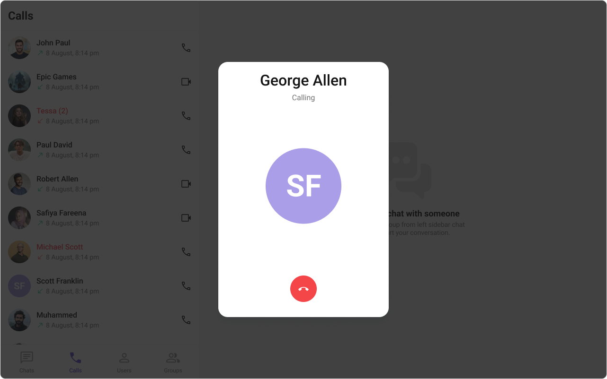
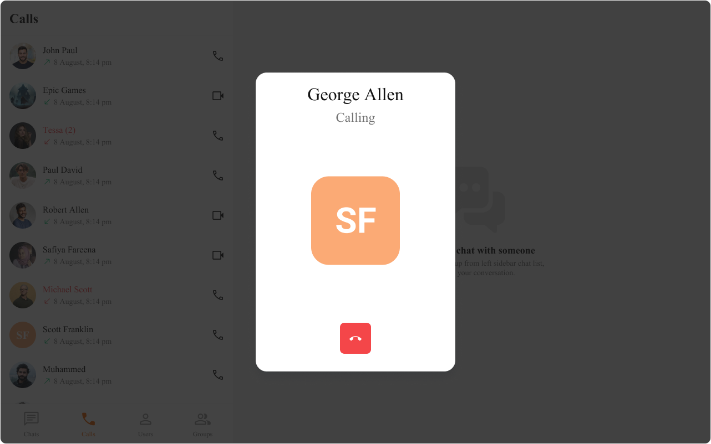
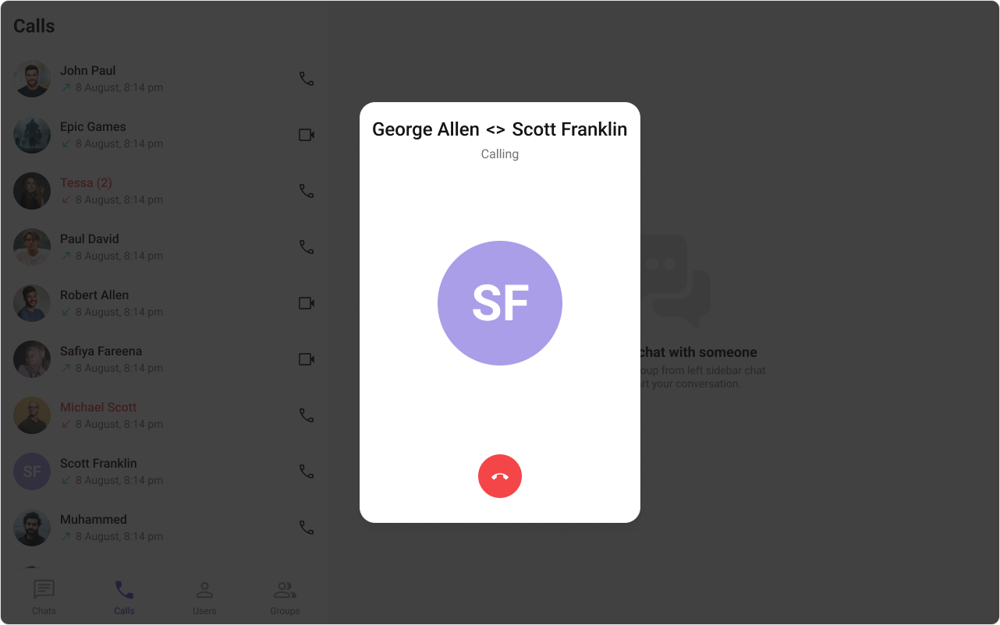
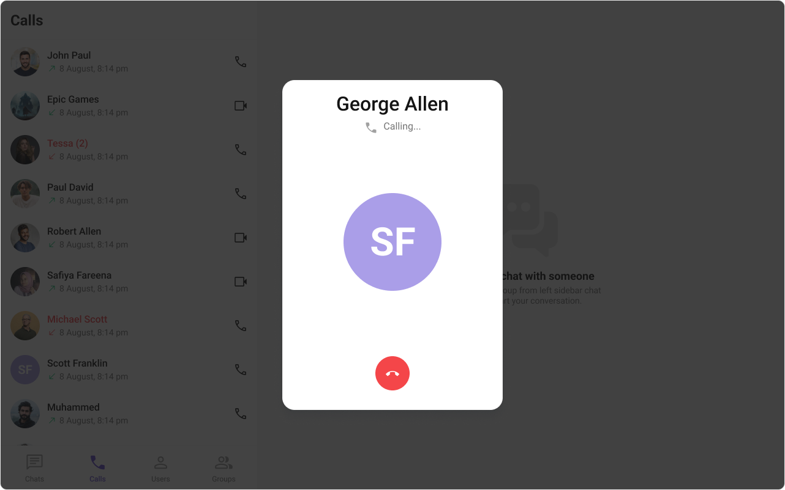
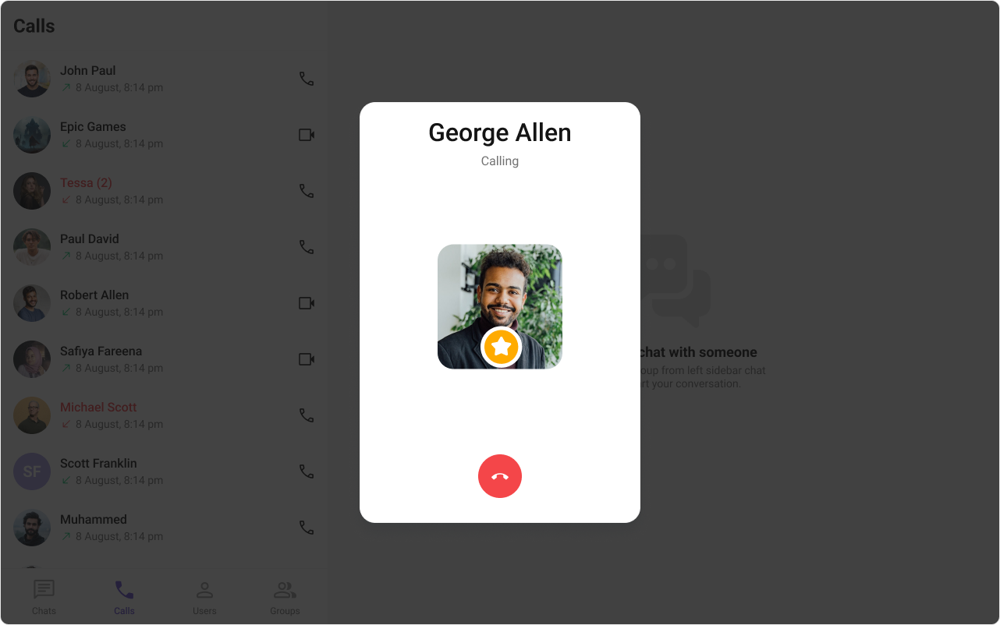
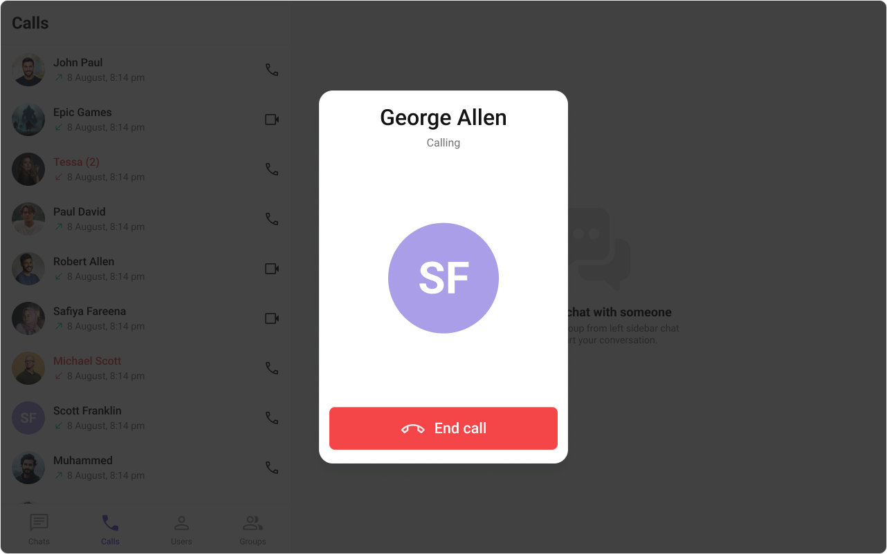

import Tabs from '@theme/Tabs';
import TabItem from '@theme/TabItem';

## Overview

The outgoing call component is a visual representation of a user-initiated call, whether it's a voice or video call. It serves as an interface for managing outgoing calls, providing users with essential options to control the call experience. This component typically includes information about the call recipient, call controls for canceling the call, and feedback on the call status, such as indicating when the call is in progress.



The `Outgoing Call` is comprised of the following components:
 
| Components | Description |
| ---------- | ------------|
| CometChat Button | This component represents a button with optional icon and text. |
| CometChat Avatar | This component component displays an image or user's avatar with fallback to the first two letters of the username. |

## Usage

### Integration

<Tabs>
<TabItem value="OutgoingCallDemo" label="OutgoingCallDemo.tsx">

```tsx
import { CometChat } from "@cometchat/chat-sdk-javascript";
import {
  CometChatOutgoingCall,
  CometChatUIKitConstants,
} from "@cometchat/chat-uikit-react";
import React from "react";

const OutgoingCallDemo = () => {
  const [call, setCall] = React.useState<CometChat.Call>();

  React.useEffect(() => {
    const uid = "uid";

    const callObject = new CometChat.Call(
      uid,
      CometChatUIKitConstants.MessageTypes.audio,
      CometChatUIKitConstants.MessageReceiverType.user
    );
    CometChat.initiateCall(callObject)
      .then((c) => {
        setCall(c);
      })
      .catch(console.log);
  }, []);

  return call ? <CometChatOutgoingCall call={call} /> : null;
};

export default OutgoingCallDemo;
```

</TabItem>

<TabItem value="App" label="App.tsx">

```jsx
import { OutgoingCallDemo } from "./OutgoingCallDemo";

export default function App() {
  return (
    <div className="App">
      <div>
        <OutgoingCallDemo />
      </div>
    </div>
  );
}
```

</TabItem>
</Tabs>

### Actions

[Actions](components-overview#actions) dictate how a component functions. They are divided into two types: Predefined and User-defined. You can override either type, allowing you to tailor the behavior of the component to fit your specific needs.

##### 1. onCallCanceled

The `onCallCanceled` event gets activated when the cancel button is clicked. It does not have a default behavior. However, you can override its behavior using the following code snippet.

<Tabs>
<TabItem value="TypeScript" label="TypeScript">

```tsx
import { CometChat } from "@cometchat/chat-sdk-javascript";
import {
  CometChatOutgoingCall,
  CometChatUIKitConstants,
} from "@cometchat/chat-uikit-react";
import React from "react";

const OutgoingCallDemo = () => {
  const [call, setCall] = React.useState<CometChat.Call>();

  React.useEffect(() => {
    const uid = "uid";

    const callObject = new CometChat.Call(
      uid,
      CometChatUIKitConstants.MessageTypes.audio,
      CometChatUIKitConstants.MessageReceiverType.user
    );
    CometChat.initiateCall(callObject)
      .then((c) => {
        setCall(c);
      })
      .catch(console.log);
  }, []);

  const cancelCall = () => {
    //your custom cancel call click actions
    CometChat.endCall(call!.getSessionId()).then(() => {
      setCall(undefined);
    });
  };
  return call ? (
    <CometChatOutgoingCall call={call} onCallCanceled={cancelCall} />
  ) : null;
};

export default OutgoingCallDemo;
```

</TabItem>
<TabItem value="JavaScript" label="JavaScript">

```jsx
import React, { useState, useEffect } from 'react';
import { CometChat } from '@cometchat/chat-sdk-javascript';
import { CometChatOutgoingCall, CometChatUIKitConstants } from '@cometchat/chat-uikit-react';

const OutgoingCallDemo = () => {
  const [call, setCall] = useState(null);

  useEffect(() => {
    const uid = "uid";

    const callObject = new CometChat.Call(
      uid,
      CometChatUIKitConstants.MessageTypes.audio,
      CometChatUIKitConstants.MessageReceiverType.user
    );

    CometChat.initiateCall(callObject)
      .then((c) => {
        setCall(c);
      })
      .catch(console.log);
  }, []);

  const cancelCall = () =>{
    //your custom cancel call click actions
    CometChat.endCall(call!.getSessionId())
    .then(() => {
      setCall(undefined);
    })
  };

  return (
    call && (
      <CometChatOutgoingCall call={call} onCallCanceled={cancelCall} />
    )
  );
};
export default OutgoingCallDemo;
```

</TabItem>
</Tabs>

##### 2. onError

This action doesn't change the behavior of the component but rather listens for any errors that occur in the Outgoing Call component.

<Tabs>
<TabItem value="TypeScript" label="TypeScript">

```tsx
import { CometChat } from "@cometchat/chat-sdk-javascript";
import {
  CometChatOutgoingCall,
  CometChatUIKitConstants,
} from "@cometchat/chat-uikit-react";
import React from "react";

const OutgoingCallDemo = () => {
  const [call, setCall] = React.useState<CometChat.Call>();

  React.useEffect(() => {
    const uid = "uid";

    const callObject = new CometChat.Call(
      uid,
      CometChatUIKitConstants.MessageTypes.audio,
      CometChatUIKitConstants.MessageReceiverType.user
    );
    CometChat.initiateCall(callObject)
      .then((c) => {
        setCall(c);
      })
      .catch(console.log);
  }, []);

  function handleOnError(error: CometChat.CometChatException) {
    //Your Custom Error Actions
    console.log(error);
  }

  return call ? (
    <CometChatOutgoingCall call={call} onError={handleOnError} />
  ) : null;
};

export default OutgoingCallDemo;
```

</TabItem>
<TabItem value="JavaScript" label="JavaScript">

```jsx
import React, { useState, useEffect } from "react";
import { CometChat } from "@cometchat/chat-sdk-javascript";
import {
  CometChatOutgoingCall,
  CometChatUIKitConstants,
} from "@cometchat/chat-uikit-react";

const OutgoingCallDemo = () => {
  const [call, setCall] = useState(null);

  useEffect(() => {
    const uid = "uid";

    const callObject = new CometChat.Call(
      uid,
      CometChatUIKitConstants.MessageTypes.audio,
      CometChatUIKitConstants.MessageReceiverType.user
    );

    CometChat.initiateCall(callObject)
      .then((c) => {
        setCall(c);
      })
      .catch(console.log);
  }, []);

  function handleOnError(error) {
    //Your Custom Error Actions
    console.log(error);
  }
  return call && <CometChatOutgoingCall call={call} onError={handleOnError} />;
};

export default OutgoingCallDemo;
```

</TabItem>
</Tabs>

---

### Filters

**Filters** allow you to customize the data displayed in a list within a `Component`. You can filter the list based on your specific criteria, allowing for a more customized. Filters can be applied using `RequestBuilders` of Chat SDK.

The `Outgoing Call` component does not have any exposed filters.

---

### Events

[Events](components-overview#events) are emitted by a `Component`. By using event you can extend existing functionality. Being global events, they can be applied in Multiple Locations and are capable of being Added or Removed.

The `Outgoing Call` component does not have any exposed filters.

---

## Customization

To fit your app's design requirements, you can customize the appearance of the Outgoing Call component. We provide exposed methods that allow you to modify the experience and behavior according to your specific needs.

### Style

Using CSS you can customize the look and feel of the component in your app like the color, size, shape, and fonts.

**Example**



<Tabs>
<TabItem value="TypeScript" label="TypeScript">

```tsx
import { CometChat } from "@cometchat/chat-sdk-javascript";
import {
  CometChatOutgoingCall,
  CometChatUIKitConstants,
  OutgoingCallStyle,
} from "@cometchat/chat-uikit-react";
import React from "react";

const OutgoingCallDemo = () => {
  const [call, setCall] = React.useState<CometChat.Call>();

  React.useEffect(() => {
    const uid = "uid";

    const callObject = new CometChat.Call(
      uid,
      CometChatUIKitConstants.MessageTypes.audio,
      CometChatUIKitConstants.MessageReceiverType.user
    );
    CometChat.initiateCall(callObject)
      .then((c) => {
        setCall(c);
      })
      .catch(console.log);
  }, []);

  return call ? <CometChatOutgoingCall call={call} /> : null;
};

export default OutgoingCallDemo;
```

</TabItem>
<TabItem value="JavaScript" label="JavaScript">

```jsx
import React, { useState, useEffect } from "react";
import { CometChat } from "@cometchat/chat-sdk-javascript";
import {
  CometChatOutgoingCall,
  CometChatUIKitConstants,
  OutgoingCallStyle,
} from "@cometchat/chat-uikit-react";

const OutgoingCallDemo = () => {
  const [call, setCall] = useState(null);

  useEffect(() => {
    const uid = "uid";

    const callObject = new CometChat.Call(
      uid,
      CometChatUIKitConstants.MessageTypes.audio,
      CometChatUIKitConstants.MessageReceiverType.user
    );

    CometChat.initiateCall(callObject)
      .then((c) => {
        setCall(c);
      })
      .catch(console.log);
  }, []);

  return call && <CometChatOutgoingCall call={call} />;
};

export default OutgoingCallDemo;
```

</TabItem>

<TabItem value="CSS" label="CSS">

```css
.cometchat-outgoing-call__avatar .cometchat-avatar {
  display: flex;
  justify-content: center;
  align-items: center;
  flex-shrink: 0;
  border-radius: 16px;
  background: #fbaa75;
}

.cometchat-outgoing-call__button {
  display: flex;
  align-items: center;
  border-radius: 8px;
  background: #f44649;
}

.cometchat-outgoing-call .cometchat-outgoing-call__title {
  text-align: center;
  font: 400 32px/38px "Times New Roman";
}
```

</TabItem>
</Tabs>

### Functionality

These are a set of small functional customizations that allow you to fine-tune the overall experience of the component. With these, you can change text, set custom icons, and toggle the visibility of UI elements.

Here is a code snippet demonstrating how you can customize the functionality of the `Outgoing Call` component.

<Tabs>
<TabItem value="TypeScript" label="TypeScript">

```tsx
import { CometChat } from "@cometchat/chat-sdk-javascript";
import {
  CometChatOutgoingCall,
  CometChatUIKitConstants,
} from "@cometchat/chat-uikit-react";
import React from "react";

const OutgoingCallDemo = () => {
  const [call, setCall] = React.useState<CometChat.Call>();

  React.useEffect(() => {
    const uid = "uid";

    const callObject = new CometChat.Call(
      uid,
      CometChatUIKitConstants.MessageTypes.audio,
      CometChatUIKitConstants.MessageReceiverType.user
    );
    CometChat.initiateCall(callObject)
      .then((c) => {
        setCall(c);
      })
      .catch(console.log);
  }, []);

  return call ? (
    <CometChatOutgoingCall call={call} disableSoundForCalls={false} />
  ) : null;
};

export default OutgoingCallDemo;
```

</TabItem>
<TabItem value="JavaScript" label="JavaScript">

```jsx
import React, { useState, useEffect } from "react";
import { CometChat } from "@cometchat/chat-sdk-javascript";
import {
  CometChatOutgoingCall,
  CometChatUIKitConstants,
} from "@cometchat/chat-uikit-react";

const OutgoingCallDemo = () => {
  const [call, setCall] = useState(null);

  useEffect(() => {
    const uid = "uid";

    const callObject = new CometChat.Call(
      uid,
      CometChatUIKitConstants.MessageTypes.audio,
      CometChatUIKitConstants.MessageReceiverType.user
    );

    CometChat.initiateCall(callObject)
      .then((c) => {
        setCall(c);
      })
      .catch(console.log);
  }, []);

  return (
    call && <CometChatOutgoingCall call={call} disableSoundForCalls={false} />
  );
};

export default OutgoingCallDemo;
```

</TabItem>
</Tabs>

<!-- Default:


Custom:
 -->

Below is a list of customizations along with corresponding code snippets

| Property | Description | Code |
| -------- | ----------- | ---- |
| **Call**          | The CometChat call object used to set up and launch the outgoing call. | `call={call}`                                       |
| **Disable Sound** | Disables the sound of outgoing calls.                                  | `disableSoundForCalls={false}`                      |
| **Custom Sound**  | Specifies a custom sound to play for outgoing calls.                   | `customSoundForCalls='Your Custom Sound For Calls'` |

---

### Advanced

For advanced-level customization, you can set custom views to the component. This lets you tailor each aspect of the component to fit your exact needs and application aesthetics. You can create and define your views, layouts, and UI elements and then incorporate those into the component.

---

#### TitleView

This prop renders the custom title view for the outgoing call. Use this to override the existing title of user name from the outgoing call.

The customized chat interface is displayed below.



Use the following code to achieve the customization shown above.

<Tabs>
<TabItem value="TypeScript" label="TypeScript">

```tsx
import { CometChat } from "@cometchat/chat-sdk-javascript";
import {
  CometChatOutgoingCall,
  CometChatUIKitConstants,
} from "@cometchat/chat-uikit-react";
import React from "react";

const OutgoingCallDemo = () => {
  const [call, setCall] = React.useState<CometChat.Call>();

  React.useEffect(() => {
    const uid = "uid";

    const callObject = new CometChat.Call(
      uid,
      CometChatUIKitConstants.MessageTypes.audio,
      CometChatUIKitConstants.MessageReceiverType.user
    );
    CometChat.initiateCall(callObject)
      .then((c) => {
        setCall(c);
      })
      .catch(console.log);
  }, []);

  const getTitleView = (call: Call) => {
    return (
      <div className="outgoing-call__title">
        {call.getCallInitiator().getName()} {" <> "} {call.getCallReceiver().getName()}
      </div>
    );
  };

  return (
    call && <CometChatOutgoingCall call={call} titleView={getTitleView(call)} />
  );
};

export default OutgoingCallDemo;
```

</TabItem>
<TabItem value="JavaScript" label="JavaScript">

```jsx
import React, { useState, useEffect } from "react";
import { CometChat } from "@cometchat/chat-sdk-javascript";
import {
  CometChatOutgoingCall,
  CometChatUIKitConstants,
} from "@cometchat/chat-uikit-react";

const OutgoingCallDemo = () => {
  const [call, setCall] = useState(null);

  useEffect(() => {
    const uid = "uid";

    const callObject = new CometChat.Call(
      uid,
      CometChatUIKitConstants.MessageTypes.audio,
      CometChatUIKitConstants.MessageReceiverType.user
    );

    CometChat.initiateCall(callObject)
      .then((c) => {
        setCall(c);
      })
      .catch(console.log);
  }, []);

  const getTitleView = (call) => {
    return (
      <div className="outgoing-call__title">
        {call.getCallInitiator().getName()} {" <> "} {call.getCallReceiver().getName()}
      </div>
    );
  };

  return (
    call && <CometChatOutgoingCall call={call} titleView={getTitleView(call)} />
  );
};

export default OutgoingCallDemo;
```

</TabItem>

<TabItem value="CSS" label="CSS">

```css
.outgoing-call__title {
  color: #141414;
  text-align: center;
  font: 500 24px Roboto;
}
```

</TabItem>
</Tabs>

#### SubtitleView

This prop renders the custom sub title view for the outgoing call. Use this to override the existing sub title text from the outgoing call.

The customized chat interface is displayed below.



Use the following code to achieve the customization shown above.

<Tabs>
<TabItem value="TypeScript" label="TypeScript">

```tsx
import { CometChat } from "@cometchat/chat-sdk-javascript";
import {
  CometChatOutgoingCall,
  CometChatUIKitConstants,
} from "@cometchat/chat-uikit-react";
import React from "react";

const OutgoingCallDemo = () => {
  const [call, setCall] = React.useState<CometChat.Call>();

  React.useEffect(() => {
    const uid = "uid";

    const callObject = new CometChat.Call(
      uid,
      CometChatUIKitConstants.MessageTypes.audio,
      CometChatUIKitConstants.MessageReceiverType.user
    );
    CometChat.initiateCall(callObject)
      .then((c) => {
        setCall(c);
      })
      .catch(console.log);
  }, []);

  const getSubtitleView = (call: Call) => {
    return (
      <div className="outgoing-call__subtitle">
        <div className="outgoing-call__subtitle-icon" />
        {"Calling..."}
      </div>
    );
  };

  return (
    call && <CometChatOutgoingCall call={call} subtitleView={getSubtitleView(call)} />
  );
};

export default OutgoingCallDemo;
```

</TabItem>
<TabItem value="JavaScript" label="JavaScript">

```jsx
import React, { useState, useEffect } from "react";
import { CometChat } from "@cometchat/chat-sdk-javascript";
import {
  CometChatOutgoingCall,
  CometChatUIKitConstants,
} from "@cometchat/chat-uikit-react";

const OutgoingCallDemo = () => {
  const [call, setCall] = useState(null);

  useEffect(() => {
    const uid = "uid";

    const callObject = new CometChat.Call(
      uid,
      CometChatUIKitConstants.MessageTypes.audio,
      CometChatUIKitConstants.MessageReceiverType.user
    );

    CometChat.initiateCall(callObject)
      .then((c) => {
        setCall(c);
      })
      .catch(console.log);
  }, []);

  const getSubtitleView = (call) => {
    return (
      <div className="outgoing-call__subtitle">
        <div className="outgoing-call__subtitle-icon" />
        {"Calling..."}
      </div>
    );
  };

  return (
    call && <CometChatOutgoingCall call={call} subtitleView={getSubtitleView(call)} />
  );
};

export default OutgoingCallDemo;
```

</TabItem>

<TabItem value="CSS" label="CSS">

```css
.outgoing-call__subtitle {
    display: flex;
    justify-content: center;
    align-items: flex-start;
    gap: 8px;
    color: #727272;
    text-align: center;
    font: 400 16px Roboto;
}

.outgoing-call__subtitle-icon {
    -webkit-mask: url("<relative path to your icon svg>") center center no-repeat;
    background: #A1A1A1;
    height: 24px;
    width: 24px;
}
```

</TabItem>
</Tabs>

#### AvatarView

This prop renders the custom avatar view for the outgoing call. Use this to override the existing avatar image from the outgoing call.

The customized chat interface is displayed below.



Use the following code to achieve the customization shown above.

<Tabs>
<TabItem value="TypeScript" label="TypeScript">

```tsx
import { CometChat } from "@cometchat/chat-sdk-javascript";
import {
  CometChatAvatar,
  CometChatOutgoingCall,
  CometChatUIKitConstants,
} from "@cometchat/chat-uikit-react";
import React from "react";

const OutgoingCallDemo = () => {
  const [call, setCall] = React.useState<CometChat.Call>();

  React.useEffect(() => {
    const uid = "uid";

    const callObject = new CometChat.Call(
      uid,
      CometChatUIKitConstants.MessageTypes.audio,
      CometChatUIKitConstants.MessageReceiverType.user
    );
    CometChat.initiateCall(callObject)
      .then((c) => {
        setCall(c);
      })
      .catch(console.log);
  }, []);

  const getAvatarView = (call: CometChat.Call) => {
    return (
      <div className="outgoing-call__avatar">
        <CometChatAvatar
          name={call?.getCallReceiver()?.getName()}
          image={(call?.getCallReceiver() as CometChat.User)?.getAvatar()}
        />
        <div className="outgoing-call__avatar-status" />
      </div>
    );
  };

  return (
    call && <CometChatOutgoingCall call={call} avatarView={getAvatarView(call)} />
  );
};

export default OutgoingCallDemo;
```

</TabItem>
<TabItem value="JavaScript" label="JavaScript">

```jsx
import React, { useState, useEffect } from "react";
import { CometChat } from "@cometchat/chat-sdk-javascript";
import {
  CometChatAvatar,
  CometChatOutgoingCall,
  CometChatUIKitConstants,
} from "@cometchat/chat-uikit-react";

const OutgoingCallDemo = () => {
  const [call, setCall] = useState(null);

  useEffect(() => {
    const uid = "uid";

    const callObject = new CometChat.Call(
      uid,
      CometChatUIKitConstants.MessageTypes.audio,
      CometChatUIKitConstants.MessageReceiverType.user
    );

    CometChat.initiateCall(callObject)
      .then((c) => {
        setCall(c);
      })
      .catch(console.log);
  }, []);

  const getAvatarView = (call) => {
    return (
      <div className="outgoing-call__avatar">
        <CometChatAvatar
          name={call?.getCallReceiver()?.getName()}
          image={call?.getCallReceiver()?.getAvatar()}
        />
        <div className="outgoing-call__avatar-status" />
      </div>
    );
  };

  return (
    call && <CometChatOutgoingCall call={call} avatarView={getAvatarView(call)} />
  );
};

export default OutgoingCallDemo;
```

</TabItem>

<TabItem value="CSS" label="CSS">

```css
.outgoing-call__avatar .cometchat-avatar,
.outgoing-call__avatar .cometchat-avatar__image {
    width: 160px;
    height: 160px;
    border-radius: 20px;
}

.outgoing-call__avatar-status {
    background-image: url("<relative path to your status icon>");
    height: 44px;
    width: 44px;
    background-size: contain;
    position: relative;
    top: -45px;
    right: -60px;
}
```

</TabItem>
</Tabs>

#### CancelButtonView

This prop renders the custom cancel-call button view for the outgoing call. Use this to override the existing cancel call button view from the outgoing call.

The customized chat interface is displayed below.



Use the following code to achieve the customization shown above.

<Tabs>
<TabItem value="TypeScript" label="TypeScript">

```tsx
import { CometChat } from "@cometchat/chat-sdk-javascript";
import {
  CometChatOutgoingCall,
  CometChatUIKitConstants,
} from "@cometchat/chat-uikit-react";
import React from "react";

const OutgoingCallDemo = () => {
  const [call, setCall] = React.useState<CometChat.Call>();

  React.useEffect(() => {
    const uid = "uid";

    const callObject = new CometChat.Call(
      uid,
      CometChatUIKitConstants.MessageTypes.audio,
      CometChatUIKitConstants.MessageReceiverType.user
    );
    CometChat.initiateCall(callObject)
      .then((c) => {
        setCall(c);
      })
      .catch(console.log);
  }, []);

  const getCancelButtonView = (call: Call) => {
    return (
      <div className="outgoing-call__cancel-button-wrapper">
        <div className="outgoing-call__cancel-button">
          <div className="outgoing-call__cancel-button-icon" />
          {"End Call"}
        </div>
      </div>
    );
  };

  return (
    call && <CometChatOutgoingCall call={call} cancelButtonView={getCancelButtonView(call)} />
  );
};

export default OutgoingCallDemo;
```

</TabItem>
<TabItem value="JavaScript" label="JavaScript">

```jsx
import React, { useState, useEffect } from "react";
import { CometChat } from "@cometchat/chat-sdk-javascript";
import {
  CometChatOutgoingCall,
  CometChatUIKitConstants,
} from "@cometchat/chat-uikit-react";

const OutgoingCallDemo = () => {
  const [call, setCall] = useState(null);

  useEffect(() => {
    const uid = "uid";

    const callObject = new CometChat.Call(
      uid,
      CometChatUIKitConstants.MessageTypes.audio,
      CometChatUIKitConstants.MessageReceiverType.user
    );

    CometChat.initiateCall(callObject)
      .then((c) => {
        setCall(c);
      })
      .catch(console.log);
  }, []);

  const getCancelButtonView = (call) => {
    return (
      <div className="outgoing-call__cancel-button-wrapper">
        <div className="outgoing-call__cancel-button">
          <div className="outgoing-call__cancel-button-icon" />
          {"End Call"}
        </div>
      </div>
    );
  };

  return (
    call && <CometChatOutgoingCall call={call} cancelButtonView={getCancelButtonView(call)} />
  );
};

export default OutgoingCallDemo;
```

</TabItem>

<TabItem value="CSS" label="CSS">

```css
.outgoing-call__cancel-button-wrapper {
    height: 64px;
    display: flex;
    justify-content: center;
    cursor: pointer;
}

.outgoing-call__cancel-button {
    display: flex;
    width: 330px;
    padding: 12px 30px;
    justify-content: center;
    align-items: center;
    gap: 12px;
    align-self: stretch;
    border-radius: 12px;
    background-color: #F44649;
    color: #FFF;
    font: 500 20px Roboto;
}

.outgoing-call__cancel-button-icon {
    -webkit-mask: url("<relative path to your icon svg>") center center no-repeat;
    background: #E8E8E8;
    height: 32px;
    width: 32px;
}
```

</TabItem>
</Tabs>