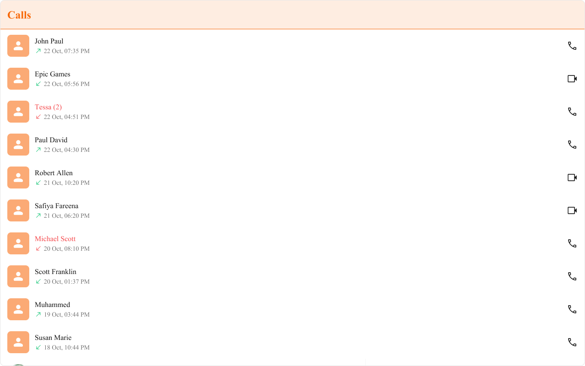
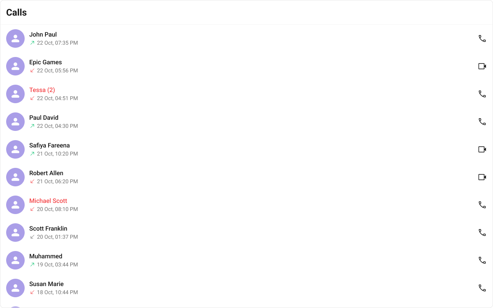
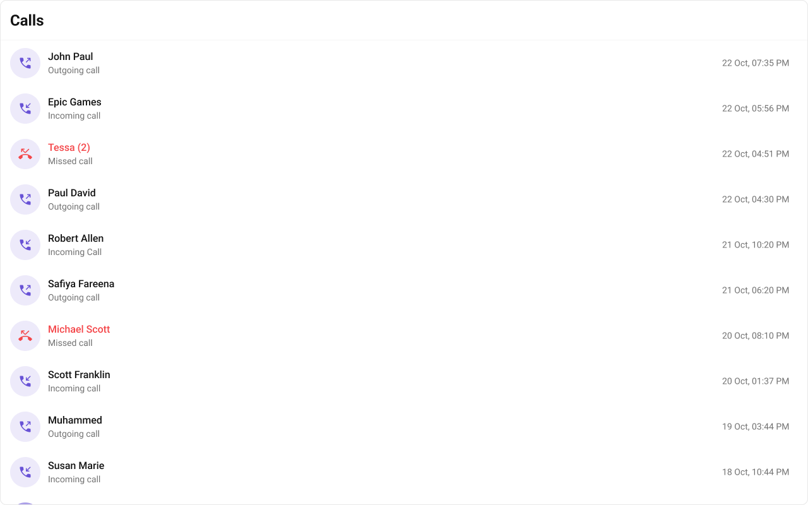
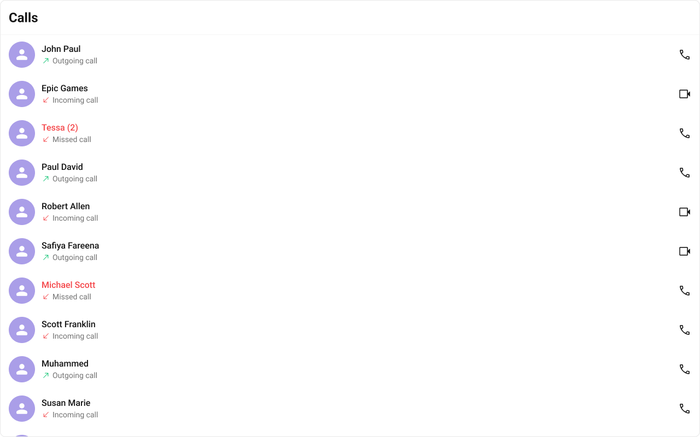
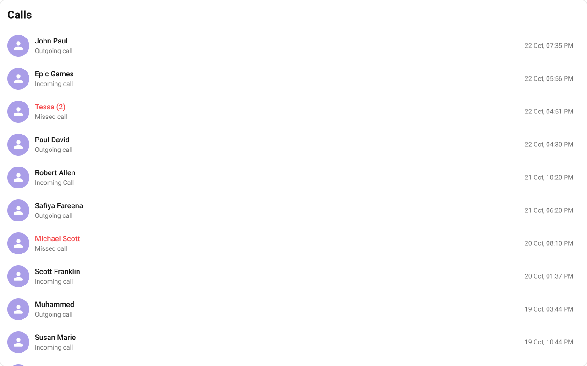
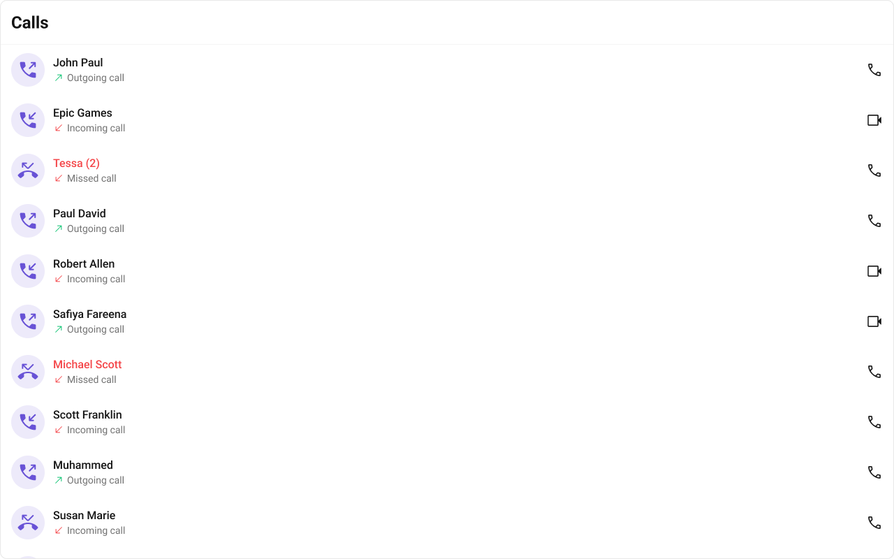
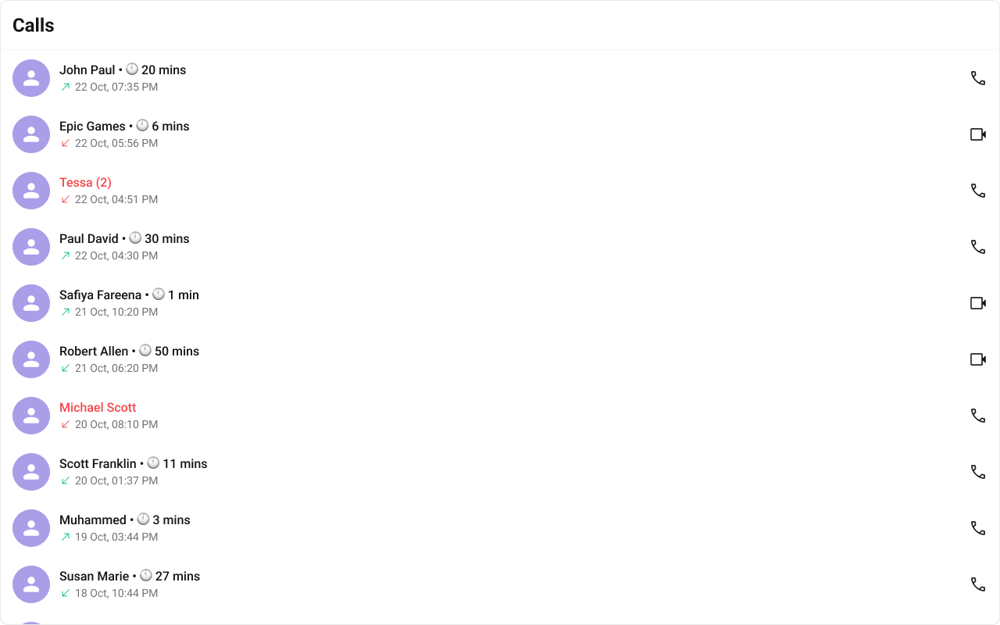

import Tabs from '@theme/Tabs';
import TabItem from '@theme/TabItem';

## Overview

`CometChatCallLogs` is a Component that shows the list of Call Log available . By default, names are shown for all listed users, along with their avatar if available.


The `Call Logs` is comprised of the following components:

| Components        | Description                                                                                                                 |
| ----------------- | --------------------------------------------------------------------------------------------------------------------------- |
| CometChatList     | A reusable container component having title, search box, customizable background and a list view.                           |
| CometChatListItem | A component that renders data obtained from a Group object on a Tile having a title, subtitle, leading and trailing view.   |
| CometChatDate     | This component used to show the date and time. You can also customize the appearance of this widget by modifying its logic. |

## Usage

### Integration

<Tabs>
<TabItem value="CallLogDemo" label="CallLogDemo.tsx">

```tsx
import { CometChatCallLogs } from "@cometchat/chat-uikit-react";
import React from "react";

const CallLogDemo = () => {
  return <CometChatCallLogs />;
};

export default CallLogDemo;
```

</TabItem>

<TabItem value="App" label="App.tsx">

```tsx
import { CallLogDemo } from "./CallLogDemo";

export default function App() {
  return (
    <div className="App">
      <div>
        <CallLogDemo />
      </div>
    </div>
  );
}
```

</TabItem>
</Tabs>

### Actions

[Actions](components-overview#actions) dictate how a component functions. They are divided into two types: Predefined and User-defined. You can override either type, allowing you to tailor the behavior of the component to fit your specific needs.

##### 1. onItemClick

`onItemClick` is a callback function which triggers when a call log list item is clicked. It does not have a default behavior. However, you can override its behavior using the following code snippet.

<Tabs>
<TabItem value="TypeScript" label="TypeScript">

```tsx
import { CometChatCallLogs } from "@cometchat/chat-uikit-react";
import React from "react";

const CallLogDemo = () => {
  const handleOnItemClick = (callLog: any) => {
    console.log("custom on item click", callLog);
  };
  return <CometChatCallLogs onItemClick={handleOnItemClick} />;
};

export default CallLogDemo;
```

</TabItem>
<TabItem value="JavaScript" label="JavaScript">

```jsx
import { CometChatCallLogs } from "@cometchat/chat-uikit-react";
import React from "react";

const CallLogDemo = () => {
  const handleOnItemClick = (callLog) => {
    console.log("custom on item click", callLog);
  };
  return <CometChatCallLogs onItemClick={handleOnItemClick} />;
};

export default CallLogDemo;
```

</TabItem>
</Tabs>

##### 2. onCallButtonClicked

`onCallButtonClicked` is a callback function which triggers when the call button in the trailing view is clicked.

<Tabs>
<TabItem value="TypeScript" label="TypeScript">

```tsx
import { CometChatCallLogs } from "@cometchat/chat-uikit-react";
import React from "react";

const CallLogDemo = () => {
  const handleOnCallButtonClick = (callLog: any) => {
    console.log("custom on info click", callLog);
  };
  return <CometChatCallLogs onCallButtonClicked={handleOnCallButtonClick} />;
};

export default CallLogDemo;
```

</TabItem>
<TabItem value="JavaScript" label="JavaScript">

```jsx
import { CometChatCallLogs } from "@cometchat/chat-uikit-react";
import React from "react";

const CallLogDemo = () => {
  const handleOnCallButtonClick = (callLog) => {
    console.log("custom on info click", callLog);
  };
  return <CometChatCallLogs onCallButtonClicked={handleOnCallButtonClick} />;
};

export default CallLogDemo;
```

</TabItem>
</Tabs>

##### 3. onError

This is a callback function which is triggered when the component encounters an error.

<Tabs>
<TabItem value="TypeScript" label="TypeScript">

```tsx
import { CometChat } from "@cometchat/chat-sdk-javascript";
import { CometChatCallLogs } from "@cometchat/chat-uikit-react";
import React from "react";

const CallLogDemo = () => {
  const handleOnError = (error: CometChat.CometChatException) => {
    console.log("your custom on error actions", error);
  };
  return <CometChatCallLogs onError={handleOnError} />;
};

export default CallLogDemo;
```

</TabItem>
<TabItem value="JavaScript" label="JavaScript">

```jsx
import { CometChatCallLogs } from "@cometchat/chat-uikit-react";
import React from "react";

const CallLogDemo = () => {
  const handleOnError = (error) => {
    console.log("your custom on error actions", error);
  };
  return <CometChatCallLogs onError={handleOnError} />;
};

export default CallLogDemo;
```

</TabItem>
</Tabs>

---

### Filters

**Filters** allow you to customize the data displayed in a list within a `Component`. You can filter the list based on your specific criteria, allowing for a more customized. Filters can be applied using `RequestBuilders` of Chat SDK.

##### 1. CallLogRequestBuilder

The [CallLogRequestBuilder](/sdk/javascript/call-logs) enables you to filter and customize the Call Log based on available parameters in [CallLogRequestBuilder](/sdk/javascript/call-logs). This feature allows you to create more specific and targeted queries when fetching the call logs. The following are the parameters available in [CallLogRequestBuilder](/sdk/javascript/call-logs)

| Methods              | Type       | Description                                                  |
| -------------------- | ---------- | ------------------------------------------------------------ |
| **setLimit**         | number     | Specifies the number of call logs to fetch.                  |
| **setCallType**      | String     | Sets the type of calls to fetch (call or meet).              |
| **setCallStatus**    | callStatus | Sets the status of calls to fetch (initiated, ongoing, etc.) |
| **setHasRecording**  | boolean    | Sets whether to fetch calls that have recordings.            |
| **setCallCategory**  | string     | Sets the category of calls to fetch (call or meet).          |
| **setCallDirection** | string     | Sets the direction of calls to fetch (incoming or outgoing)  |
| **setUid**           | string     | Sets the UID of the user whose call logs to fetch.           |
| **setGuid**          | string     | Sets the GUID of the user whose call logs to fetch.          |
| **setAuthToken**     | string     | Sets the Auth token of the logged-in user.                   |

**Example**

In the example below, we're filtering Call Logs to show only canceled calls and setting the limit to five.

<Tabs>
<TabItem value="TypeScript" label="TypeScript">

```tsx
import { CallLogRequestBuilder } from "@cometchat/calls-sdk-javascript";
import { CometChatCallLogs } from "@cometchat/chat-uikit-react";
import React from "react";

const CallLogDemo = () => {
  return (
    <CometChatCallLogs
      callLogRequestBuilder={new CallLogRequestBuilder()
        .setAuthToken("authtoken")
        .setLimit(5)
        .setCallStatus("cancelled")}
    />
  );
};

export default CallLogDemo;
```

</TabItem>
<TabItem value="JavaScript" label="JavaScript">

```jsx
import { CallLogRequestBuilder } from "@cometchat/calls-sdk-javascript";
import { CometChatCallLogs } from "@cometchat/chat-uikit-react";
import React from "react";

const CallLogDemo = () => {
  return (
    <CometChatCallLogs
      callLogRequestBuilder={new CallLogRequestBuilder()
        .setAuthToken("authtoken")
        .setLimit(5)
        .setCallStatus("cancelled")}
    />
  );
};

export default CallLogDemo;
```

</TabItem>
</Tabs>

---

### Events

[Events](components-overview#events) are emitted by a `Component`. By using event you can extend existing functionality. Being global events, they can be applied in Multiple Locations and are capable of being Added or Removed.

The list of events emitted by the `Call Logs` component is as follows.

| Event             | Description                                                                                               |
| ----------------- | --------------------------------------------------------------------------------------------------------- |
| **ccMessageSent** | This event is triggered when the sent message is in transit and also when it is received by the receiver. |

---

<Tabs>

<TabItem value="js" label="Add Listener">

```javascript
const ccMessageSent = CometChatMessageEvents.ccMessageSent.subscribe(() => {
  //Your Code
});
```

</TabItem>
</Tabs>

---

<Tabs>
<TabItem value="js" label="Remove Listener">

```javascript
ccMessageSent?.unsubscribe();
```

</TabItem>
</Tabs>

---

## Customization

To fit your app's design requirements, you can customize the appearance of the Call Logs component. We provide exposed methods that allow you to modify the experience and behavior according to your specific needs.

### Style

Using CSS you can customize the look and feel of the component in your app like the color, size, shape, and fonts.

**Example:**



<Tabs>
<TabItem value="TypeScript" label="TypeScript">

```tsx
import { CometChatCallLogs } from "@cometchat/chat-uikit-react";
import React from "react";

const CallLogDemo = () => {
  return <CometChatCallLogs />;
};

export default CallLogDemo;
```

</TabItem>
<TabItem value="JavaScript" label="JavaScript">

```jsx
import { CometChatCallLogs } from "@cometchat/chat-uikit-react";
import React from "react";

const CallLogDemo = () => {
  return <CometChatCallLogs />;
};

export default CallLogDemo;
```

</TabItem>

<TabItem value="CSS" label="CSS">

```css
.cometchat .cometchat-call-logs .cometchat-list__header-title {
  background-color: #fce9ea;
  color: #f76808;
  border: 0px 1px 1px 0px solid #e5484d;
  font-family: "Times New Roman";
}

.cometchat .cometchat-call-logs .cometchat-list-item__body-title {
  overflow: hidden;
  color: #141414;
  text-overflow: ellipsis;
  font-family: "Times New Roman";
  font-size: 16px;
  font-style: normal;
  font-weight: 400;
  line-height: 19.2px;
}

.cometchat .cometchat-call-logs .cometchat-list-item__body-subtitle {
  overflow: hidden;
  color: #727272;
  text-overflow: ellipsis;
  white-space: nowrap;
  font-family: "Times New Roman";
  font-size: 14px;
  font-style: normal;
  font-weight: 400;
  line-height: 16.8px;
}

.cometchat .cometchat-call-logs .cometchat-avatar {
  border-radius: 8px;
  background: #fbaa75;
}

.cometchat .cometchat-call-logs .cometchat-avatar__image {
  border-radius: 8px;
}
```

</TabItem>
</Tabs>

---

### Functionality

These are a set of small functional customizations that allow you to fine-tune the overall experience of the component. With these, you can change text, set custom icons, and toggle the visibility of UI elements.

Here is a code snippet demonstrating how you can customize the functionality of the `Call Logs` component.

<Tabs>
<TabItem value="TypeScript" label="TypeScript">

```tsx
import { CometChatCallLogs } from "@cometchat/chat-uikit-react";
import React from "react";

const CallLogDemo = () => {
  return <CometChatCallLogs title="Your Custom Title" />;
};

export default CallLogDemo;
```

</TabItem>
<TabItem value="JavaScript" label="JavaScript">

```jsx
import { CometChatCallLogs } from "@cometchat/chat-uikit-react";
import React from "react";

const CallLogDemo = () => {
  return <CometChatCallLogs title="Your Custom Title" />;
};

export default CallLogDemo;
```

</TabItem>
</Tabs>

<!-- Default:


Custom:

 -->

Below is a list of customizations along with corresponding code snippets

| Property           | Description                                                                 | Code                                                              |
| ------------------ | --------------------------------------------------------------------------- | ----------------------------------------------------------------- |
| **Active Call**    | Object representing the active call that is currently selected.             | `activeCall={call}`                                               |
| **Loading View**   | A custom view to display when call logs are being loaded.                   | `loadingView={<>Custom Loading View</>}`                          |
| **Empty View**     | A custom view to display when no call logs are available.                   | `emptyView={<>Custom Empty View</>}`                              |
| **Error View**     | A custom view to display when an error occurs while fetching the call logs. | `errorView={<>Custom Error View</>}`                              |
| **Item View**      | A function that renders a JSX element to display the item view.             | `itemView={(call) => { return (<>Custom Item View</>)}}`          |
| **Leading View**   | A function that renders a JSX element to display the leading view.          | `leadingView={(call) => { return (<>Custom Leading View</>)}}`    |
| **Title View**     | A function that renders a JSX element to display the title view.            | `titleView={(call) => { return (<>Custom Title View</>)}}`        |
| **Sub Title View** | A function that renders a JSX element to display the subtitle view.         | `subtitleView={(call) => { return (<>Custom Sub Title View</>)}}` |
| **Trailing View**  | A function that renders a JSX element to display the trailing view.         | `trailingView={(call) => { return (<>Custom Trailing View</>)}}`  |

---

### Advanced

For advanced-level customization, you can set custom views to the component. This lets you tailor each aspect of the component to fit your exact needs and application aesthetics. You can create and define your views, layouts, and UI elements and then incorporate those into the component.

---

#### Call Initiated Date Time Format

The `callInitiatedDateTimeFormat` property allows you to customize the **Call Initiated** timestamp displayed in the call logs.

Default Date Time Format:

```tsx
new CalendarObject({
  today: `DD MMM, hh:mm A`, // Example: "25 Jan, 10:30 AM"
  yesterday: `DD MMM, hh:mm A`, // Example: "25 Jan, 10:30 AM"
  otherDays: `DD MMM, hh:mm A`, // Example: "25 Jan, 10:30 AM"
});
```

The following example demonstrates how to modify the **Call Initiated** timestamp format using a custom [`CalendarObject`](../04-Theming/04-localize.md#calendarobject).

<Tabs>
<TabItem value="TypeScript" label="TypeScript">

```tsx
import { CometChatCallLogs, CalendarObject } from "@cometchat/chat-uikit-react";

// Define a custom date format pattern
function getDateFormat() {
  const dateFormat = new CalendarObject({
    today: `hh:mm A`, // Example: "10:30 AM"
    yesterday: `[yesterday]`, // Example: "yesterday"
    otherDays: `DD/MM/YYYY`, // Example: "25/05/2025"
  });
  return dateFormat;
}

// Apply the custom format to the CometChatCallLogs component
<CometChatCallLogs callInitiatedDateTimeFormat={getDateFormat()} />;
```

</TabItem>
</Tabs>

:::info  
**Fallback Mechanism**

- If you **do not** pass any property in the [**CalendarObject**](../04-Theming/04-localize.md#calendarobject), the component will first check the [**global configuration**](../04-Theming/04-localize.md#customisation). If the property is **also missing in the global configuration**, it will **fallback to the component's default formatting**.
  :::

---

#### ItemView

With this property, you can assign a custom ListItem to the Call Logs Component.

Shown below is the default chat interface.



The customized chat interface is displayed below.



Use the following code to achieve the customization shown above.

<Tabs>
<TabItem value="TypeScript" label="TypeScript">

```tsx
import {
  CometChatCallLogs,
  CometChatUIKitLoginListener,
  isMissedCall,
  isSentByMe,
  verifyCallUser,
} from "@cometchat/chat-uikit-react";
import { CometChatCallLogs } from "@cometchat/chat-uikit-react";

const CallLogDemo = () => {
  const getItemView = (call: any) => {
    const missedCall = isMissedCall(
      call,
      CometChatUIKitLoginListener?.getLoggedInUser()!
    );
    const isCallSentByMe = isSentByMe(
      call,
      CometChatUIKitLoginListener?.getLoggedInUser()!
    );

    let callStatus = missedCall
      ? "Missed Call"
      : isCallSentByMe
      ? "Outgoing Call"
      : "Incoming Call";

    let callIcon = missedCall
      ? missedIcon
      : isCallSentByMe
      ? outgoingIcon
      : incomingIcon;

    function formatDate(timestamp: number) {
      // Convert the timestamp from seconds to milliseconds
      const date = new Date(timestamp * 1000);

      // Define options for formatting
      const options: Object = {
        day: "2-digit",
        month: "short",
        hour: "2-digit",
        minute: "2-digit",
        hour12: true,
      };

      // Format the date with the specified options
      return date.toLocaleDateString("en-GB", options);
    }

    return (
      <div>
        <CometChatListItem
          title={verifyCallUser(
            call,
            CometChatUIKitLoginListener?.getLoggedInUser()!
          )?.getName()}
          subtitleView={callStatus}
          avatarURL={callIcon}
          trailingView={formatDate(call?.getInitiatedAt())}
        />
      </div>
    );
  };

  return <CometChatCallLogs itemView={getItemView} />;
};

export default CallLogDemo;
```

</TabItem>
<TabItem value="JavaScript" label="JavaScript">

```jsx
import { CometChatCallLogs, CometChatUIKitLoginListener, isMissedCall, isSentByMe, verifyCallUser } from "@cometchat/chat-uikit-react";

const CallLogDemo = () => {
  const getItemView = (call) => {
    const missedCall = isMissedCall(call, CometChatUIKitLoginListener?.getLoggedInUser()!);
    const isCallSentByMe = isSentByMe(call, CometChatUIKitLoginListener?.getLoggedInUser()!);

    let callStatus = missedCall
      ? "Missed Call"
      : isCallSentByMe
        ? "Outgoing Call"
        : "Incoming Call";

    let callIcon = missedCall
      ? missedIcon
      : isCallSentByMe
        ? outgoingIcon
        : incomingIcon;

    function formatDate(timestamp: number) {
      // Convert the timestamp from seconds to milliseconds
      const date = new Date(timestamp * 1000);

      // Define options for formatting
      const options: Object = {
        day: '2-digit',
        month: 'short',
        hour: '2-digit',
        minute: '2-digit',
        hour12: true,
      };

      // Format the date with the specified options
      return date.toLocaleDateString('en-GB', options);
    }

    return (
      <div>
        <CometChatListItem
          title={verifyCallUser(call, CometChatUIKitLoginListener?.getLoggedInUser()!)?.getName()}
          subtitleView={callStatus}
          avatarURL={callIcon}
          trailingView={formatDate(call?.getInitiatedAt())}
        />
      </div>
    )
  }
  return <CometChatCallLogs itemView={getItemView} />;
};

export default CallLogDemo;
```

</TabItem>

<TabItem value="CSS" label="CSS">

```css
.cometchat .cometchat-call-logs .cometchat-list-item__trailing-view {
  width: auto;
  overflow: hidden;
  color: #727272;
  text-overflow: ellipsis;
  font: 400 14px/120% roboto;
  font-style: normal;
}

.cometchat .cometchat-call-logs .cometchat-avatar {
  background-color: #edeafa;
}

.cometchat .cometchat-call-logs .cometchat-avatar__image {
  height: 24px;
  width: 24px;
}

.cometchat .cometchat-call-logs .cometchat-list-item__body-title {
  overflow: hidden;
  color: #141414;
  text-overflow: ellipsis;
  white-space: nowrap;
  font: 500 16px/19.2px roboto;
  font-style: normal;
}

.cometchat .cometchat-call-logs .cometchat-list-item__body-subtitle {
  overflow: hidden;
  color: #727272;
  text-overflow: ellipsis;
  font: 400 14px/120% roboto;
  font-style: normal;
}
```

</TabItem>
</Tabs>

---

#### SubtitleView

You can customize the subtitle view for each call logs item to meet your requirements.

Shown below is the default chat interface.


The customized chat interface is displayed below.



Use the following code to achieve the customization shown above.

<Tabs>
<TabItem value="TypeScript" label="TypeScript">

```tsx
import {
  CometChatCallLogs,
  CometChatUIKitLoginListener,
  isMissedCall,
  isSentByMe,
} from "@cometchat/chat-uikit-react";
import React from "react";

const CallLogDemo = () => {
  const getSubtitleView = (call: any): JSX.Element => {
    const missedCall = isMissedCall(
      call,
      CometChatUIKitLoginListener?.getLoggedInUser()!
    );
    const isCallSentByMe = isSentByMe(
      call,
      CometChatUIKitLoginListener?.getLoggedInUser()!
    );

    const iconClass = missedCall
      ? "cometchat-call-logs__list-item-subtitle-icon-missed-call"
      : isCallSentByMe
      ? "cometchat-call-logs__list-item-subtitle-icon-outgoing-call"
      : "cometchat-call-logs__list-item-subtitle-icon-incoming-call";

    const callStatus = missedCall
      ? "Missed Call"
      : isCallSentByMe
      ? "Outgoing Call"
      : "Incoming Call";

    return (
      <>
        <div className={`cometchat-call-logs__list-item-subtitle`}>
          <div
            className={`cometchat-call-logs__list-item-subtitle-icon ${iconClass}`}
          />
          <div className="cometchat-call-logs__list-item-subtitle-text">
            {" "}
            {callStatus}
          </div>
        </div>
      </>
    );
  };

  return <CometChatCallLogs subtitleView={getSubtitleView} />;
};

export default CallLogDemo;
```

</TabItem>
<TabItem value="JavaScript" label="JavaScript">

```jsx
import { CometChatCallLogs,CometChatUIKitLoginListener,isMissedCall,isSentByMe } from "@cometchat/chat-uikit-react";
import React from "react";

const CallLogDemo = () => {
   const getSubtitleView = (call) => {

    const missedCall = isMissedCall(call, CometChatUIKitLoginListener?.getLoggedInUser()!);
    const isCallSentByMe = isSentByMe(call, CometChatUIKitLoginListener?.getLoggedInUser()!);

    const iconClass = missedCall
      ? "cometchat-call-logs__list-item-subtitle-icon-missed-call"
      : isCallSentByMe
        ? "cometchat-call-logs__list-item-subtitle-icon-outgoing-call"
        : "cometchat-call-logs__list-item-subtitle-icon-incoming-call";

    const callStatus = missedCall
      ? "Missed Call"
      : isCallSentByMe
        ? "Outgoing Call"
        : "Incoming Call";

    return (
      <>
        <div className={`cometchat-call-logs__list-item-subtitle`}>
          <div
            className={`cometchat-call-logs__list-item-subtitle-icon ${iconClass}`}
          />
          <div className="cometchat-call-logs__list-item-subtitle-text">
            {callStatus}
          </div>
        </div>
      </>
    )
  }

  return <CometChatCallLogs subtitleView={getSubtitleView} />;
};

export default CallLogDemo;
```

</TabItem>

<TabItem value="CSS" label="CSS">

```css
.cometchat-call-logs__list-item-subtitle-text {
  overflow: hidden;
  color: #727272;
  text-overflow: ellipsis;
  font: 400 14px/120% Roboto;
  font-style: normal;
}
```

</TabItem>
</Tabs>

---

#### TrailingView

You can customize the trailing view for each call logs item to meet your requirements.

Shown below is the default chat interface.


The customized chat interface is displayed below.



Use the following code to achieve the customization shown above.

<Tabs>
<TabItem value="TypeScript" label="TypeScript">

```tsx
import { CallLog } from "@cometchat/calls-sdk-javascript";
import { CometChatCallLogs } from "@cometchat/chat-uikit-react";
import React from "react";

const CallLogDemo = () => {
  function formatDate(timestamp: number) {
    // Convert the timestamp from seconds to milliseconds
    const date = new Date(timestamp * 1000);

    // Define options for formatting
    const options: Object = {
      day: "2-digit",
      month: "short",
      hour: "2-digit",
      minute: "2-digit",
      hour12: true,
    };

    // Format the date with the specified options
    return date.toLocaleDateString("en-GB", options);
  }

  const getTrailingView = (call: any) => {
    return (
      <div className="call-log-trailing-view">
        {formatDate(call?.getInitiatedAt())}
      </div>
    );
  };

  return <CometChatCallLogs trailingView={getTrailingView} />;
};

export default CallLogDemo;
```

</TabItem>
<TabItem value="JavaScript" label="JavaScript">

```jsx
import { CometChatCallLogs } from "@cometchat/chat-uikit-react";
import React from "react";

const CallLogDemo = () => {
  function formatDate(timestamp) {
    // Convert the timestamp from seconds to milliseconds
    const date = new Date(timestamp * 1000);

    // Define options for formatting
    const options = {
      day: "2-digit",
      month: "short",
      hour: "2-digit",
      minute: "2-digit",
      hour12: true,
    };

    // Format the date with the specified options
    return date.toLocaleDateString("en-GB", options);
  }

  const getTrailingView = (call) => {
    return (
      <div className="call-log-trailing-view">
        {formatDate(call?.getInitiatedAt())}
      </div>
    );
  };

  return <CometChatCallLogs trailingView={getTrailingView} />;
};

export default CallLogDemo;
```

</TabItem>

<TabItem value="CSS" label="CSS">

```css
.cometchat .cometchat-call-logs .cometchat-list-item__trailing-view {
  width: auto;
  overflow: hidden;
  color: #727272;
  text-overflow: ellipsis;
  font: 400 14px/120% roboto;
  font-style: normal;
}
```

</TabItem>
</Tabs>

#### LeadingView

You can customize the leading view for each call logs item to meet your requirements.

Shown below is the default chat interface.


The customized chat interface is displayed below.



Use the following code to achieve the customization shown above.

<Tabs>
<TabItem value="TypeScript" label="TypeScript">

```tsx
import { CallLog } from "@cometchat/calls-sdk-javascript";
import {
  CometChatUIKitLoginListener,
  CometChatCallLogs,
} from "@cometchat/chat-uikit-react";
import React from "react";

const CallLogDemo = () => {
  const getLeadingView = (call: any) => {
    const loggedInUser = CometChatUIKitLoginListener.getLoggedInUser();
    return (
      <div className="call-log-avatar">
        {call.status === "unanswered" || call.status === "cancelled" ? (
          <div className="call-log-missed" />
        ) : call.initiator?.uid === loggedInUser?.getUid() ? (
          <div className="call-log-outgoing" />
        ) : (
          <div className="call-log-incoming" />
        )}
      </div>
    );
  };

  return <CometChatCallLogs leadingView={getLeadingView} />;
};

export default CallLogDemo;
```

</TabItem>
<TabItem value="JavaScript" label="JavaScript">

```jsx
import {
  CometChatUIKitLoginListener,
  CometChatCallLogs,
} from "@cometchat/chat-uikit-react";
import React from "react";

const CallLogDemo = () => {
  const getLeadingView = (call) => {
    const loggedInUser = CometChatUIKitLoginListener.getLoggedInUser();
    return (
      <div className="call-log-avatar">
        {call.status === "unanswered" || call.status === "cancelled" ? (
          <div className="call-log-missed" />
        ) : call.initiator?.uid === loggedInUser?.getUid() ? (
          <div className="call-log-outgoing" />
        ) : (
          <div className="call-log-incoming" />
        )}
      </div>
    );
  };

  return <CometChatCallLogs leadingView={getLeadingView} />;
};

export default CallLogDemo;
```

</TabItem>

<TabItem value="CSS" label="CSS">

```css
.call-log-avatar {
  display: flex;
  width: 48px;
  height: 48px;
  padding: 8px;
  justify-content: center;
  align-items: center;
  border-radius: 1000px;
  background: #edeafa;
}

.call-log-missed {
  background-image: url("<relative path to your missed call icon>");
  background-size: contain;
  height: 32px;
  width: 32px;
}

.call-log-incoming {
  background-image: url("<relative path to your incoming call icon>");
  background-size: contain;
  height: 32px;
  width: 32px;
}

.call-log-outgoing {
  background-image: url("<relative path to your outgoing call icon>");
  background-size: contain;
  height: 32px;
  width: 32px;
}
```

</TabItem>
</Tabs>

#### TitleView

You can customize the title view for each call logs item to meet your requirements.

Shown below is the default chat interface.


The customized chat interface is displayed below.



Use the following code to achieve the customization shown above.

<Tabs>
<TabItem value="TypeScript" label="TypeScript">

```tsx
import { CallLog } from "@cometchat/calls-sdk-javascript";
import { CometChatCallLogs } from "@cometchat/chat-uikit-react";
import React from "react";

const CallLogDemo = () => {
  const getTitleView = (call: any) => {
    return (
      <div className="call-log-title">
        {call.initiator?.name}
        {call.status !== "unanswered" && call.status !== "cancelled" && (
          <>{" • 🕚️ " + Math.ceil(call.totalDurationInMinutes) + " mins"}</>
        )}
      </div>
    );
  };

  return <CometChatCallLogs titleView={getTitleView} />;
};

export default CallLogDemo;
```

</TabItem>
<TabItem value="JavaScript" label="JavaScript">

```jsx
import { CometChatCallLogs } from "@cometchat/chat-uikit-react";
import React from "react";

const CallLogDemo = () => {
  const getTitleView = (call) => {
    return (
      <div className="call-log-title">
        {call.initiator?.name}
        {call.status !== "unanswered" && call.status !== "cancelled" && (
          <>{" • 🕚️ " + Math.ceil(call.totalDurationInMinutes) + " mins"}</>
        )}
      </div>
    );
  };

  return <CometChatCallLogs titleView={getTitleView} />;
};

export default CallLogDemo;
```

</TabItem>

<TabItem value="CSS" label="CSS">

```css
.call-log-title {
  overflow: hidden;
  color: #141414;
  text-overflow: ellipsis;
  white-space: nowrap;
  font: 500 16px Roboto;
}
```

</TabItem>
</Tabs>
