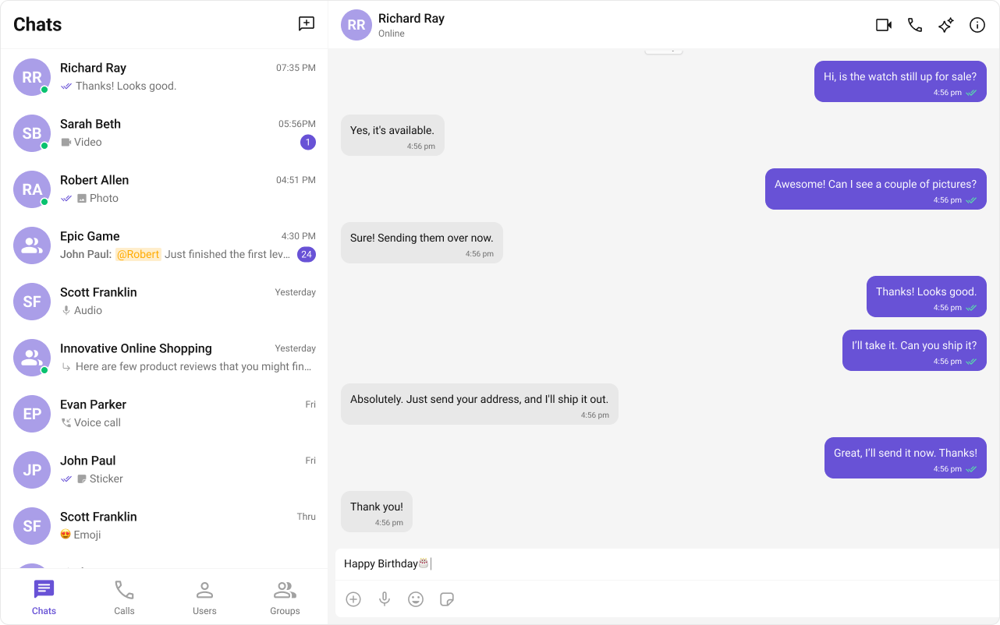

import Tabs from '@theme/Tabs';
import TabItem from '@theme/TabItem';

## Overview

The `ShortCutFormatter` class extends the [CometChatTextFormatter](./custom-text-formatter-guide) class to provide a mechanism for handling shortcuts within messages. This guide will walk you through the process of using `ShortCutFormatter` to implement shortcut extensions in your CometChat application.


## Usage

Here are the steps to create a `ShortCutFormatter` for CometChat using the CometChatTextFormatter:

1. Firstly, you need to import `CometChatTextFormatter` from the CometChat UI Kit react library.

```jsx
import { CometChatTextFormatter } from "@cometchat/chat-uikit-react";
```

2. Now, extend the `CometChatTextFormatter` class to create your custom text formatter class. In this case, let's create a `HashTagTextFormatter`.

```jsx
class ShortCutFormatter extends CometChatTextFormatter {
  ...
}
```

3. Set up the `trackCharacter` and define any necessary private fields.

```jsx
this.setTrackingCharacter("!");
```

4. Implement the `onKeyDown` method to handle key events and trigger actions based on defined shortcuts.

```jsx
onKeyDown(event: KeyboardEvent) {
  // Your implementation
}
```

5. Implement any additional methods required for your custom formatter, such as opening and closing dialogs, handling button clicks, and formatting text.

```jsx
openDialog(buttonText: string) {
  // Your implementation
}

closeDialog() {
  // Your implementation
}

handleButtonClick = () => {
  // Your implementation
};

getFormattedText(text: string): string {
  return text;
}

private getTextBeforeCaret(caretPosition: number): string {
  // Your implementation
}
```

## Example

Below is an example demonstrating how to use a custom formatter class in components such as [CometChatConversations](conversations), [CometChatMessageList](message-list), [CometChatMessageComposer](message-composer).




<Tabs>
<TabItem value="ShortCutFormatter" label="ShortCutFormatter.ts">

```typescript
import { CometChatTextFormatter } from "@cometchat/chat-uikit-react";
import DialogHelper from "./Dialog";
import { CometChat } from "@cometchat/chat-sdk-javascript";

class ShortcutFormatter extends CometChatTextFormatter {
  private shortcuts: { [key: string]: string } = {};
  private dialogIsOpen: boolean = false;
  private dialogHelper = new DialogHelper();
  private currentShortcut: string | null = null; // Track the currently open shortcut

  constructor() {
    super();
    this.setTrackingCharacter("!");
    CometChat.callExtension("message-shortcuts", "GET", "v1/fetch", undefined)
      .then((data: any) => {
        if (data && data.shortcuts) {
          this.shortcuts = data.shortcuts;
        }
      })
      .catch((error) => console.log("error fetching shortcuts", error));
  }

  onKeyUp(event: KeyboardEvent) {
    const caretPosition =
      this.currentCaretPosition instanceof Selection
        ? this.currentCaretPosition.anchorOffset
        : 0;
    const textBeforeCaret = this.getTextBeforeCaret(caretPosition);

    const match = textBeforeCaret.match(/!([a-zA-Z]+)$/);
    if (match) {
      const shortcut = match[0];
      const replacement = this.shortcuts[shortcut];
      if (replacement) {
        // Close the currently open dialog, if any
        if (this.dialogIsOpen && this.currentShortcut !== shortcut) {
          this.closeDialog();
        }
        this.openDialog(replacement, shortcut);
      }
    } else if (!textBeforeCaret) {
      this.closeDialog();
    }
  }

  getCaretPosition() {
    if (!this.currentCaretPosition?.rangeCount) return { x: 0, y: 0 };
    const range = this.currentCaretPosition?.getRangeAt(0);
    const rect = range.getBoundingClientRect();
    return {
      x: rect.left,
      y: rect.top,
    };
  }

  openDialog(buttonText: string, shortcut: string) {
    this.dialogHelper.createDialog(
      () => this.handleButtonClick(buttonText),
      buttonText
    );
    this.dialogIsOpen = true;
    this.currentShortcut = shortcut;
  }

  closeDialog() {
    this.dialogHelper.closeDialog(); // Use DialogHelper to close the dialog
    this.dialogIsOpen = false;
    this.currentShortcut = null;
  }

  handleButtonClick = (buttonText: string) => {
    if (this.currentCaretPosition && this.currentRange) {
      // Inserting the replacement text corresponding to the shortcut
      const shortcut = Object.keys(this.shortcuts).find(
        (key) => this.shortcuts[key] === buttonText
      );
      if (shortcut) {
        const replacement = this.shortcuts[shortcut];
        this.addAtCaretPosition(
          replacement,
          this.currentCaretPosition,
          this.currentRange
        );
      }
    }
    if (this.dialogIsOpen) {
      this.closeDialog();
    }
  };

  getFormattedText(text: string): string {
    return text;
  }

  private getTextBeforeCaret(caretPosition: number): string {
    if (
      this.currentRange &&
      this.currentRange.startContainer &&
      typeof this.currentRange.startContainer.textContent === "string"
    ) {
      const textContent = this.currentRange.startContainer.textContent;
      if (textContent.length >= caretPosition) {
        return textContent.substring(0, caretPosition);
      }
    }
    return "";
  }
}

export default ShortcutFormatter;
```

</TabItem>
<TabItem value="Dialog" label="Dialog.tsx">

```typescript
import React from "react";
import ReactDOM from "react-dom";
import { CometChatUIEvents, PanelAlignment } from "@cometchat/chat-uikit-react";

interface DialogProps {
  onClick: () => void;
  buttonText: string;
}

const Dialog: React.FC<DialogProps> = ({ onClick, buttonText }) => {
  return (
    <div
      style={{
        width: "800px",
        height: "45px",
      }}
    >
      <button
        style={{
          width: "800px",
          height: "100%",
          cursor: "pointer",
          backgroundColor: "#f2e6ff",
          border: "2px solid #9b42f5",
          borderRadius: "12px",
          textAlign: "left",
          paddingLeft: "20px",
          font: "600 15px sans-serif, Inter",
        }}
        onClick={onClick}
      >
        {buttonText}
      </button>
    </div>
  );
};

export default class DialogHelper {
  private dialogContainer: HTMLDivElement | null = null;

  createDialog(onClick: () => void, buttonText: string) {
    this.dialogContainer = document.createElement("div");
    document.body.appendChild(this.dialogContainer);
    CometChatUIEvents.ccShowPanel.next({
      child: <Dialog onClick={onClick} buttonText={buttonText} />,
      position: PanelAlignment.messageListFooter,
    });
  }

  closeDialog() {
    if (this.dialogContainer) {
      CometChatUIEvents.ccHidePanel.next(PanelAlignment.messageListFooter);
      this.dialogContainer.remove();
      this.dialogContainer = null;
    }
  }
}
```

</TabItem>
<TabItem value="ConversationDemo" label="ConversationDemo.tsx">

```typescript
import ShortcutFormatter from "./ShortCutFormatter";
import { CometChatMessageComposer } from "@cometchat/chat-uikit-react";

<CometChatMessageComposer textFormatters={[new ShortcutFormatter()]} />;
```

</TabItem>
</Tabs>

---
