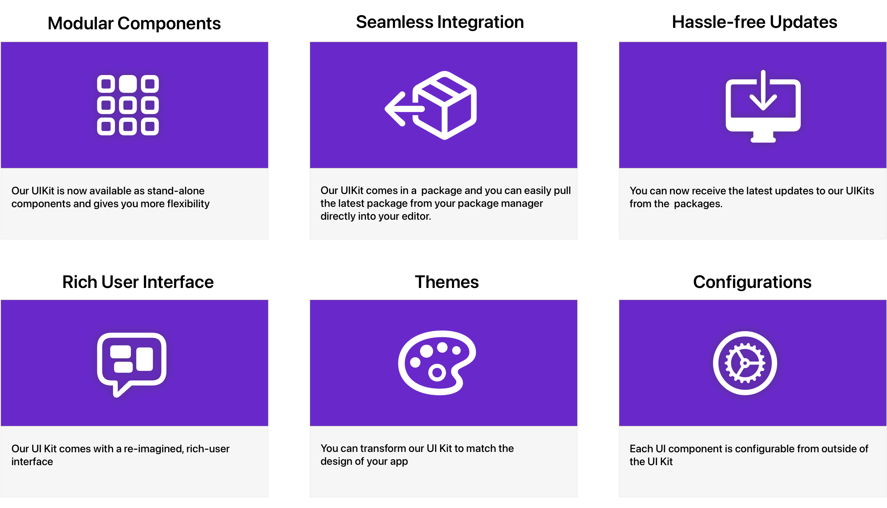

CometChat's **UI Kit** for Vue, you can easily built an chat app with all the essential messaging feature along with the customisations and so on as per your application needs. This **UI Kit** is a set of prebuilt UI components divided into smaller modules and components and each and every component is configurable to suit your need.

---

## What's New

**UI Kits** give you more control over customising UI kits to match your specific needs. It also has a lot additional upgrades such as -

## Integration

You can start building a modern messaging experience in your app by installing UI Kit. This developer kit is an add-on feature to CometChat Javascript SDK so installing it will also install the core Chat SDK.

To start the [integration process, please navigate here](./integration)

---

## UI Components

If you've already integrated UI Kit, then you can proceed with the UI components.

The UI Kit is a set of prebuilt UI components that allows you to easily build beautiful in-app chat with all the essential messaging features.

To learn more about [UI Components, please visit here](/ui-kit/vue/ui-components-overview).

---

## Sample App

You can try out our sample app and experience the newly built Vue UI Kit by following this link.

  

    

      <a class="button btn" style={{ backgroundColor: '#7c55c9', color: 'white', textDecoration: 'underline' }}href="https://github.com/cometchat-pro/cometchat-chat-sample-app-vue/tree/v4" target="/">Vue Sample App</a>
    

  

---
