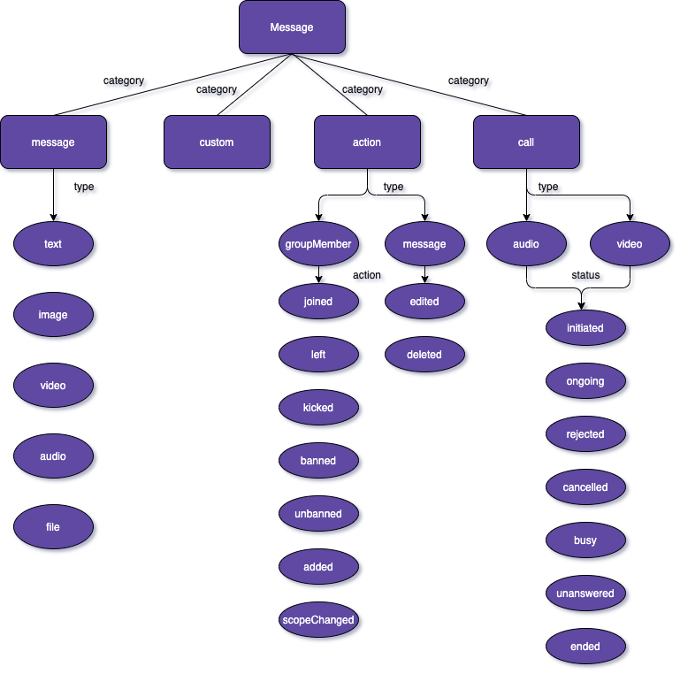

import Tabs from '@theme/Tabs';
import TabItem from '@theme/TabItem';

The below diagram helps you better understand the various message categories and types that a CometChat message can belong to.

:::info

The calling feature is not  currently supported  by the CometChat flutter SDK

:::

As you can see in the above diagram, every message belongs to a particular category. A message can belong to either one of the 4 categories

1. Message
2. Custom
3. Action

Each category can be further be classified into types.

#Message A message belonging to the category `message` can be classified into either 1 of the below types:

1. text - A plain text message
2. image- An image message
3. video- A video message
4. audio- An audio message
5. file- A file message

## Custom

In the case of messages that belong to the `custom` category, there are no predefined types. Custom messages can be used by developers to send messages that do not fit in the default category and types provided by CometChat. For messages with the category `custom`, the developers can set their own type to uniquely identify the custom message. A very good example of a custom message would be the sharing of location co-ordinates. In this case, the developer can decide to use the custom message with type set to `location`.

## Action

Action messages are system-generated messages. Messages belonging to the `action` category can further be classified into one of the below types:

1. groupMember - action performed on a group member.
2. message - action performed on a message.

Action messages hold another property called `action` which actually determine the action that has been performed For the type `groupMember` the action can be either one of the below:

1. joined - when a group member joins a group
2. left - when a group member leaves a group
3. kicked - when a group member is kicked from the group
4. banned - when a group member is banned from the group
5. unbanned - when a group member is unbanned from the group
6. added - when a user is added to the group
7. scopeChanged - When the scope of a group member is changed.

For the type `message`, the action can be either one of the below:

1. edited - when a message is edited.
2. deleted - when a message is deleted.