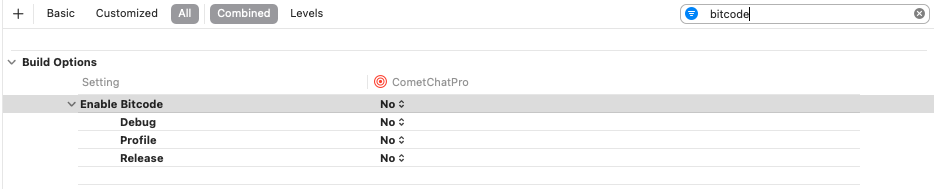

import Tabs from '@theme/Tabs';
import TabItem from '@theme/TabItem';

### Get your Application Keys

[Signup for CometChat](https://app.cometchat.com/) and then:

1. Create a new app
2. Head over to the **API Keys** section and note the **Auth Key**, **App ID** & **Region**

:::info Minimum Requirement

- Android API Level 21
- AndroidX Compatibility
- iOS 11 or higher
- Flutter SDK 1.2 or higher

:::

### Add the CometChat Dependency

1. Add the following code in your `pubspec.yaml` file and run `pub get` command.

<Tabs>
<TabItem value="1" label="Dart">

```Dart
cometchat: any
```

</TabItem>
</Tabs>


2. Add following code  to podfile inside iOS section of your app

<Tabs>
<TabItem value="1" label="Ruby">

```Ruby
post_install do |installer|

installer.pods_project.targets.each do |target|

flutter_additional_ios_build_settings(target)

//Copy from here------->

target.build_configurations.each do |build_configuration|

build_configuration.build_settings['EXCLUDED_ARCHS[sdk=iphonesimulator*]'] = 'arm64 i386'

end

//Copy TILL here------->

end

end
```

</TabItem>
</Tabs>


3. For iOS, change the deployment target to `11`  or higher.
4. For iOS, navigate to your iOS folder in terminal or CMD and do `pod install`  . For apple chip system use rosetta terminal.
5. For IOS you can set the Enabled Bitcode settings to **NO** present in build settings of XCODE project



Import CometChat SDK using following code in dart

<Tabs>
<TabItem value="1" label="Dart">

```Dart
import 'package:cometchat/cometchat_sdk.dart';
```

</TabItem>
</Tabs>


## Initialise CometChat

The `init()` method initialises the settings required for CometChat. The `init()` method takes the below parameters:

1. appID - You CometChat App ID
2. appSettings - An object of the AppSettings class can be created using the AppSettingsBuilder class. The region field is mandatory and can be set using the `setRegion()` method.

The `AppSettings` class allows you to configure three settings:

- **Region**: The region where you app was created.
- **[Presence Subscription ](./user-presence):** Represents the subscription type for user presence (real-time online/offline status)
- **autoEstablishSocketConnection(boolean value)**: This property takes a boolean value which when set to true informs the SDK to manage the web-socket connection internally. If set to false, it informs the SDK that the web-socket connection will be managed manually. The default value for this parameter is true. For more information on this, please check the [Managing Web-Socket connections manually](./advanced-managing-web-sockets-connections-manually) section. The default value for this property is **true.**
- **adminHost(adminHost: string)**: This method takes the admin URL as input and uses this admin URL instead of the default admin URL. This can be used in case of dedicated deployment of CometChat.
- **clientHost(clientHost: string)**: This method takes the client URL as input and uses this client URL instead of the default client URL. This can be used in case of dedicated deployment of CometChat.

<Tabs>
<TabItem value="1" label="Dart">

```Dart
String region = "REGION";
String appId = "APP_ID";

AppSettings appSettings= (AppSettingsBuilder()
        ..subscriptionType = CometChatSubscriptionType.allUsers
        ..region= region
				..adminHost = "" //optional
				..clientHost = "" //optional
        ..autoEstablishSocketConnection =  true
 ).build();

CometChat.init(appId, appSettings, 
	onSuccess: (String successMessage) {
		debugPrint("Initialization completed successfully  $successMessage");
	}, onError: (CometChatException excep) {
		debugPrint("Initialization failed with exception: ${excep.message}");
	}
);
```

</TabItem>
</Tabs>


We suggest you call the `init()` method on app startup.
